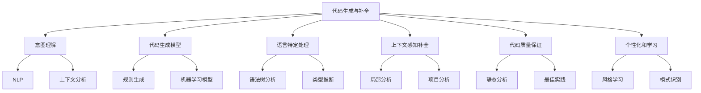
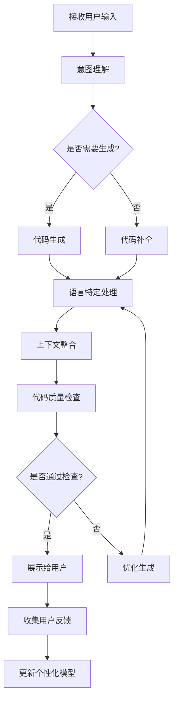
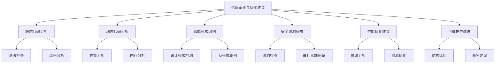
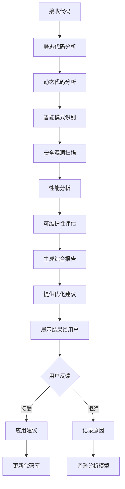
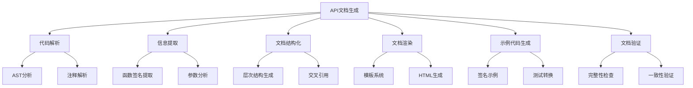
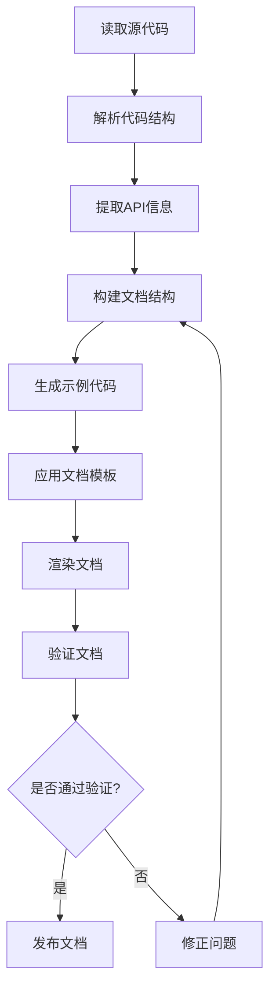
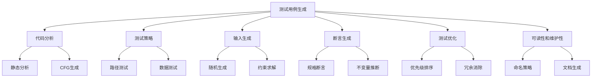
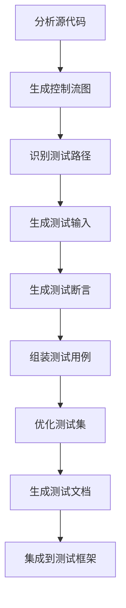
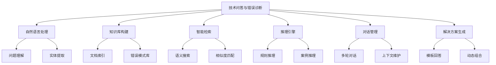
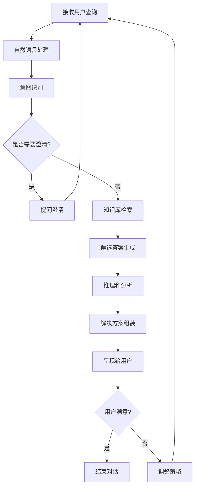

# 第10章：研发辅助 Agent 开发

## 10.1 代码生成与补全

### 核心概念

代码生成与补全是一种利用人工智能技术来辅助软件开发的方法，旨在提高编程效率、减少错误，并帮助开发者更快地实现其编程意图。这种技术不仅可以自动生成代码片段，还能根据上下文智能地预测和补全代码，为开发者提供实时的编程建议。

### 问题背景

随着软件开发复杂度的不断增加和开发周期的缩短，开发者面临着巨大的压力。传统的编码方式往往耗时且容易出错，特别是在处理重复性任务或复杂的API调用时。同时，新技术和框架的快速迭代也给开发者带来了持续学习的负担。因此，需要一种智能的辅助工具来提高编码效率和质量。

### 问题描述

1. 如何准确理解开发者的编程意图
2. 如何生成符合特定编程语言语法和最佳实践的代码
3. 如何处理不同编程范式和框架的代码生成
4. 如何提供上下文相关的代码补全建议
5. 如何确保生成的代码的安全性和性能
6. 如何处理自定义库和项目特定代码的生成和补全

### 问题解决

我们将从以下几个方面详细探讨代码生成与补全的实现：

1. 意图理解：
    - 自然语言处理（NLP）
    - 上下文分析
    - 编程模式识别

2. 代码生成模型：
    - 基于规则的生成
    - 机器学习模型（如Transformer）
    - 神经网络代码生成

3. 语言特定处理：
    - 语法树分析
    - 类型推断
    - 语言特性适配

4. 上下文感知补全：
    - 局部上下文分析
    - 项目范围分析
    - 依赖关系推断

5. 代码质量保证：
    - 静态代码分析
    - 最佳实践检查
    - 安全漏洞扫描

6. 个性化和学习：
    - 用户编码风格学习
    - 项目特定模式识别
    - 持续优化模型

### 边界与外延

虽然本节主要关注通用的代码生成与补全，但这些技术也可以扩展到特定领域的代码生成（如数据库查询、API调用）和更高级的软件工程任务（如重构建议、测试用例生成）。此外，我们还将讨论如何将这些技术与集成开发环境（IDE）和版本控制系统集成，以提供无缝的开发体验。

### 概念结构与核心要素组成



### 概念之间的关系

| 组件 | 主要功能 | 输入 | 输出 | 与其他组件的关系 |
|------|---------|------|------|------------------|
| 意图理解 | 解析开发者意图 | 自然语言、部分代码 | 结构化意图 | 为代码生成提供指导 |
| 代码生成模型 | 生成代码片段 | 结构化意图 | 代码片段 | 使用语言特定处理 |
| 语言特定处理 | 确保语言兼容性 | 代码片段 | 优化的代码 | 支持代码生成和补全 |
| 上下文感知补全 | 提供实时建议 | 当前代码上下文 | 补全建议 | 利用项目分析结果 |
| 代码质量保证 | 验证生成的代码 | 生成的代码 | 质量报告 | 反馈到生成模型 |
| 个性化和学习 | 适应用户偏好 | 用户行为数据 | 个性化模型 | 影响所有其他组件 |

### 算法流程图

代码生成与补全的基本流程：



### 算法源代码

以下是一个简化的代码生成与补全系统示例：

```python
import re
from typing import List, Dict

class CodeGenerator:
    def __init__(self):
        self.language_patterns = {
            "python": {
                "function": "def {name}({params}):\n    {body}",
                "class": "class {name}:\n    def __init__(self):\n        {body}",
                "if_statement": "if {condition}:\n    {body}",
                "for_loop": "for {var} in {iterable}:\n    {body}"
            }
        }
        self.context = {}

    def understand_intent(self, user_input: str) -> Dict:
        # 简化的意图理解
        intent = {}
        if "function" in user_input:
            intent["type"] = "function"
            intent["name"] = re.search(r"function\s+(\w+)", user_input).group(1)
        elif "class" in user_input:
            intent["type"] = "class"
            intent["name"] = re.search(r"class\s+(\w+)", user_input).group(1)
        elif "if" in user_input:
            intent["type"] = "if_statement"
            intent["condition"] = re.search(r"if\s+(.+)", user_input).group(1)
        elif "for" in user_input:
            intent["type"] = "for_loop"
            intent["var"], intent["iterable"] = re.search(r"for\s+(\w+)\s+in\s+(.+)", user_input).groups()
        return intent

    def generate_code(self, intent: Dict, language: str = "python") -> str:
        pattern = self.language_patterns[language][intent["type"]]
        if intent["type"] == "function":
            return pattern.format(name=intent["name"], params="", body="pass")
        elif intent["type"] == "class":
            return pattern.format(name=intent["name"], body="pass")
        elif intent["type"] == "if_statement":
            return pattern.format(condition=intent["condition"], body="pass")
        elif intent["type"] == "for_loop":
            return pattern.format(var=intent["var"], iterable=intent["iterable"], body="pass")

    def complete_code(self, partial_code: str, language: str = "python") -> List[str]:
        # 简化的代码补全
        completions = []
        if language == "python":
            if partial_code.endswith("print("):
                completions = ['"Hello, World!"', 'f"The value is {value}"']
            elif partial_code.endswith("for "):
                completions = ["item in items:", "i in range(10):"]
            elif partial_code.endswith("if "):
                completions = ["condition:", "x > 0:"]
        return completions

    def check_quality(self, code: str) -> bool:
        # 简化的质量检查
        if "import" in code and "from" not in code:
            return False  # 推荐使用 from ... import ...
        if "except:" in code:
            return False  # 不推荐使用裸异常
        return True

    def optimize_code(self, code: str) -> str:
        # 简化的代码优化
        optimized = code.replace("print('", 'print(f"')
        optimized = optimized.replace("except:", "except Exception as e:")
        return optimized

# 使用示例
generator = CodeGenerator()

# 代码生成
user_input = "Create a function called greet"
intent = generator.understand_intent(user_input)
generated_code = generator.generate_code(intent)
print("Generated Code:")
print(generated_code)

# 代码补全
partial_code = "for "
completions = generator.complete_code(partial_code)
print("\nCode Completions:")
for completion in completions:
    print(f"- {partial_code}{completion}")

# 代码质量检查和优化
code_to_check = "try:\n    import random\nexcept:\n    pass"
if not generator.check_quality(code_to_check):
    optimized_code = generator.optimize_code(code_to_check)
    print("\nOptimized Code:")
    print(optimized_code)
```

### 实际场景应用

1. IDE集成：
    - 实时代码补全和建议
    - 智能代码重构建议
    - 自动生成常用代码模式（如设计模式实现）

2. API开发辅助：
    - 自动生成API调用代码
    - 提供API文档的智能链接
    - 生成API测试用例

3. 数据科学工作流：
    - 自动生成数据预处理代码
    - 提供常用机器学习模型的代码模板
    - 生成数据可视化代码

4. Web开发：
    - 生成前端组件代码
    - 自动完成后端路由和控制器代码
    - 提供数据库查询语句的智能补全

5. 移动应用开发：
    - 生成UI布局代码
    - 提供平台特定API的使用建议
    - 自动生成本地化代码### 最佳实践 tips

1. 上下文理解：
    - 分析整个项目结构和依赖关系
    - 考虑当前文件的导入和变量作用域
    - 理解代码的语义和意图，而不仅仅是语法

2. 实时学习：
    - 持续从用户的编码行为中学习
    - 适应项目特定的编码风格和约定
    - 更新模型以反映最新的编程趋势和最佳实践

3. 性能优化：
    - 使用缓存机制提高响应速度
    - 实现增量分析以减少计算开销
    - 优先处理最相关的代码建议

4. 可定制性：
    - 允许用户自定义代码生成模板
    - 提供配置选项以调整建议的频率和类型
    - 支持项目级别的代码风格设置

5. 安全性考虑：
    - 避免生成潜在的不安全代码
    - 提供安全最佳实践的建议
    - 集成安全漏洞检测

6. 多语言支持：
    - 设计灵活的架构以支持多种编程语言
    - 处理语言特定的语法和惯用法
    - 支持跨语言的代码生成（如ORM查询）

7. 协作功能：
    - 集成版本控制系统的信息
    - 支持团队共享自定义代码片段
    - 提供代码审查建议

### 行业发展与未来趋势

| 时期 | 主要特征 | 关键技术 | 挑战 | 未来展望 |
|------|---------|----------|------|----------|
| 2018-2019 | 基础自动补全 | 规则基础、简单ML | 上下文理解有限 | 更智能的代码建议 |
| 2020-2021 | 智能代码生成 | 深度学习、Transformer | 大规模模型训练 | 自然语言到代码转换 |
| 2022-2023 | AI配对编程 | GPT、代码理解模型 | 生成代码的质量和相关性 | 上下文感知的代码生成 |
| 2024-2025 (预测) | 自适应编程助手 | 强化学习、知识图谱 | 个性化和项目特定适应 | 全面的开发流程辅助 |
| 2026+ (展望) | 认知编程环境 | AGI、量子计算 | 创造性编程辅助 | 思维级编程交互 |

代码生成与补全技术正在经历快速的演变。从早期的简单文本补全到现在的AI驱动的智能编程助手，我们看到了显著的进步。这些变化不仅提高了编程效率，还改变了开发者与代码交互的方式。

未来的代码生成与补全系统可能会更加注重以下几个方面：

1. 自然语言编程：
    - 直接将自然语言描述转换为可执行代码
    - 理解高级抽象概念并生成相应实现
    - 支持多语言、多模态的编程指令输入

2. 上下文感知和意图理解：
    - 深度理解项目结构、代码依赖和业务逻辑
    - 预测开发者的长期编程意图
    - 提供跨文件和跨模块的智能建议

3. 自适应学习：
    - 快速适应新的编程语言和框架
    - 从全球开发者社区实时学习最佳实践
    - 个性化学习每个开发者的编码风格和偏好

4. 全流程开发辅助：
    - 集成需求分析、架构设计、编码、测试和部署
    - 提供端到端的解决方案建议
    - 自动化重复性任务，让开发者专注于创造性工作

5. 协作式编程：
    - 支持多人实时协作编程
    - 智能解决代码冲突和合并
    - 提供团队级的代码质量和一致性建议

6. 安全和性能优化：
    - 主动识别和修复安全漏洞
    - 自动提供性能优化建议
    - 生成高效、可维护的代码结构

7. 创造性编程支持：
    - 辅助算法创新和设计模式应用
    - 提供问题解决的多种方案建议
    - 激发开发者的创造力和思考

随着这些趋势的发展，代码生成与补全系统将从简单的编码工具演变为智能的编程伙伴。它们将能够更深入地理解开发者的意图和项目需求，提供更全面、更具洞察力的编程支持，并在软件开发的各个阶段发挥关键作用。

这种进步将带来多方面的益处：

1. 提高开发效率：显著减少重复性编码工作，加速开发周期。

2. 改善代码质量：通过一致的最佳实践和自动化检查，提高代码质量。

3. 降低入门门槛：使新手开发者更容易上手复杂的项目和技术。

4. 促进创新：让开发者将更多精力集中在创新和问题解决上。

5. 增强学习：提供实时的学习资源和编程指导。

6. 优化资源分配：帮助团队更有效地分配开发任务和资源。

7. 提高软件可维护性：生成更一致、更易于理解和维护的代码。

然而，这种发展也带来了新的挑战，如如何确保生成代码的原创性和知识产权问题，如何平衡自动化与开发者的创造性控制，以及如何处理AI生成代码的责任和问题追溯。未来的系统需要在提高效率和保持人类创造力之间找到平衡，确保技术进步能够真正增强而不是取代人类开发者的能力。

总的来说，代码生成与补全技术的演进将继续深刻影响软件开发行业。通过提供更智能、更全面的编程支持，这些技术将帮助开发者和组织更快地将创意转化为现实，提高软件质量，并在快速变化的技术环境中保持竞争力。这不仅将改变我们编写代码的方式，还将重塑整个软件开发流程，推动行业向更高效、更创新的方向发展。

## 10.2 代码审查与优化建议

### 核心概念

代码审查与优化建议是软件开发过程中的关键环节，旨在提高代码质量、性能和可维护性。这个过程涉及对代码进行系统性的检查，识别潜在的问题和改进机会，并提供具体的优化建议。通过结合人工智能技术，现代的代码审查系统能够自动化地执行大部分检查工作，为开发者提供及时、全面的反馈。

### 问题背景

随着软件系统的复杂性不断增加，确保代码质量变得越来越具有挑战性。传统的人工代码审查耗时且容易遗漏问题，而简单的静态分析工具往往产生大量误报或无法捕捉复杂的代码问题。同时，不同项目和团队可能有特定的编码标准和最佳实践，需要一个灵活、智能的系统来适应这些需求。

### 问题描述

1. 如何自动识别代码中的潜在问题和优化机会
2. 如何提供上下文相关、可操作的优化建议
3. 如何处理不同编程语言和框架的特定规则
4. 如何平衡代码质量、性能和可读性的需求
5. 如何适应项目特定的编码标准和最佳实践
6. 如何有效地展示和管理大量的审查结果

### 问题解决

我们将从以下几个方面详细探讨代码审查与优化建议的实现：

1. 静态代码分析：
    - 语法检查
    - 代码风格分析
    - 复杂度计算

2. 动态代码分析：
    - 性能分析
    - 内存使用分析
    - 并发问题检测

3. 智能模式识别：
    - 设计模式检测
    - 反模式识别
    - 代码克隆检测

4. 安全漏洞扫描：
    - 已知漏洞检查
    - 安全最佳实践验证
    - 敏感信息泄露检测

5. 性能优化建议：
    - 算法复杂度分析
    - 资源使用优化
    - 并发性能建议

6. 可维护性改进：
    - 代码结构优化
    - 命名建议
    - 文档完整性检查

### 边界与外延

虽然本节主要关注源代码级别的审查和优化，但这些技术也可以扩展到更高层次的软件架构分析和系统级优化。此外，我们还将讨论如何将代码审查与持续集成/持续部署（CI/CD）流程集成，以及如何利用机器学习技术来不断改进审查和建议的质量。

### 概念结构与核心要素组成



### 概念之间的关系

| 组件 | 主要功能 | 输入 | 输出 | 与其他组件的关系 |
|------|---------|------|------|------------------|
| 静态代码分析 | 检查代码结构和风格 | 源代码 | 静态问题报告 | 为其他分析提供基础 |
| 动态代码分析 | 分析运行时行为 | 执行跟踪 | 性能和行为报告 | 补充静态分析结果 |
| 智能模式识别 | 识别代码模式 | 代码结构 | 模式报告 | 利用静态分析结果 |
| 安全漏洞扫描 | 检测安全问题 | 源代码、依赖 | 安全报告 | 与静态和动态分析协同 |
| 性能优化建议 | 提供性能改进建议 | 分析结果 | 优化建议 | 基于动态分析结果 |
| 可维护性改进 | 提高代码可维护性 | 代码结构、文档 | 改进建议 | 整合多个分析结果 |

### 算法流程图

代码审查与优化建议的基本流程：



### 算法源代码

以下是一个简化的代码审查与优化建议系统示例：

```python
import ast
import re
from typing import List, Dict

class CodeReviewer:
    def __init__(self):
        self.issues = []
        self.suggestions = []

    def review_code(self, code: str):
        self.static_analysis(code)
        self.pattern_recognition(code)
        self.security_check(code)
        self.performance_analysis(code)
        self.maintainability_check(code)

    def static_analysis(self, code: str):
        tree = ast.parse(code)
        for node in ast.walk(tree):
            if isinstance(node, ast.FunctionDef):
                if len(node.args.args) > 5:
                    self.issues.append(f"Function '{node.name}' has too many parameters")
            elif isinstance(node, ast.If):
                if isinstance(node.test, ast.Compare) and len(node.test.ops) > 2:
                    self.issues.append("Complex condition detected, consider simplifying")

    def pattern_recognition(self, code: str):
        # 简单的单例模式检测
        if "class" in code and "__new__" in code and "cls.__instance" in code:
            self.suggestions.append("Singleton pattern detected, ensure thread-safety if needed")

    def security_check(self, code: str):
        if "eval(" in code:
            self.issues.append("Use of eval() detected, this can be a security risk")
        if re.search(r"password\s*=\s*['\"][^'\"]+['\"]", code):
            self.issues.append("Hardcoded password detected, consider using environment variables")

    def performance_analysis(self, code: str):
        if "+=" in code and any(loop in code for loop in ["for ", "while "]):
            self.suggestions.append("String concatenation in loop detected, consider using join() for better performance")

    def maintainability_check(self, code: str):
        lines = code.split("\n")
        if any(len(line.strip()) > 100 for line in lines):
            self.suggestions.append("Some lines are too long, consider breaking them for better readability")

    def get_review_result(self) -> Dict[str, List[str]]:
        return {
            "issues": self.issues,
            "suggestions": self.suggestions
        }

class OptimizationAdvisor:
    def __init__(self, review_result: Dict[str, List[str]]):
        self.review_result = review_result
        self.optimizations = []

    def generate_advice(self):
        for issue in self.review_result["issues"]:
            if "too many parameters" in issue:
                self.optimizations.append("Consider grouping related parameters into a class or using keyword arguments")
            elif "Complex condition" in issue:
                self.optimizations.append("Simplify complex conditions by breaking them into multiple if statements or using helper functions")
            elif "eval()" in issue:
                self.optimizations.append("Replace eval() with safer alternatives like ast.literal_eval() or json.loads()")

        for suggestion in self.review_result["suggestions"]:
            if "Singleton pattern" in suggestion:
                self.optimizations.append("Implement double-checked locking for thread-safe singleton initialization")
            elif "String concatenation in loop" in suggestion:
                self.optimizations.append("Use ''.join(items) instead of += for string concatenation in loops")
            elif "lines are too long" in suggestion:
                self.optimizations.append("Break long lines using line continuation (\) or parentheses for better readability")

    def get_optimization_advice(self) -> List[str]:
        return self.optimizations

# 使用示例
code_to_review = """
class Singleton:
    __instance = None
    def __new__(cls):
        if cls.__instance is None:
            cls.__instance = super().__new__(cls)
        return cls.__instance

def process_data(data, param1, param2, param3, param4, param5, param6):
    result = ""
    for item in data:
        if item > 10 and item < 20 and item != 15:
            result += str(item)
    return eval(result)

password = "hardcoded_password"
"""

reviewer = CodeReviewer()
reviewer.review_code(code_to_review)
review_result = reviewer.get_review_result()

print("Review Results:")
for category, items in review_result.items():
    print(f"\n{category.capitalize()}:")
    for item in items:
        print(f"- {item}")

advisor = OptimizationAdvisor(review_result)
advisor.generate_advice()
optimizations = advisor.get_optimization_advice()

print("\nOptimization Advice:")
for advice in optimizations:
    print(f"- {advice}")
```

### 实际场景应用

1. 持续集成/持续部署（CI/CD）:
    - 在代码提交时自动运行审查
    - 阻止不符合质量标准的代码合并
    - 生成代码质量趋势报告

2. IDE集成：
    - 实时代码分析和建议
    - 提供即时重构选项
    - 集成文档和最佳实践指南

3. 代码库健康检查：
    - 定期扫描整个代码库
    - 识别技术债务和改进机会
    - 生成代码健康度报告

4. 安全审计：
    - 识别潜在的安全漏洞
    - 确保遵守安全最佳实践
    - 生成合规性报告

5. 性能优化：
    - 识别性能瓶颈
    - 提供算法和数据结构优化建议
    - 模拟不同优化策略的影响

### 最佳实践 tips

1. 上下文感知：
    - 考虑项目特定的编码规范和约定
    - 理解代码的业务逻辑和架构背景
    - 提供与当前开发任务相关的建议

2. 可操作性：
    - 提供具体、可执行的优化步骤
    - 包含代码示例和重构建议
    - 支持一键应用某些优化建议

3. 优先级管理：
    - 根据严重性和影响对问题进行分类
    - 突出显示最关键的问题和优化机会
    - 允许团队自定义问题的优先级规则

4. 持续学习：
    - 从用户反馈中学习和改进建议质量
    - 适应项目随时间变化的需求
    - 整合行业最新的最佳实践和安全标准

5. 协作功能：
    - 支持团队成员之间的代码审查协作
    - 允许讨论和注释具体的问题和建议
    - 集成与项目管理工具的工作流

6. 性能考虑：
    - 优化分析算法以处理大型代码库
    - 支持增量分析以减少重复工作
    - 提供分布式分析选项for大规模项目

7. 可解释性：
    - 提供每个问题和建议的详细解释
    - 链接到相关的文档和学习资源
    - 展示问题如何影响代码质量和性能

### 行业发展与未来趋势

| 时期 | 主要特征 | 关键技术 | 挑战 | 未来展望 |
|------|---------|----------|------|----------|
| 2018-2019 | 基础静态分析 | 规则引擎、AST分析 | 误报率高 | 更智能的代码理解 |
| 2020-2021 | 机器学习集成 | NLP、代码嵌入 | 上下文理解 | 自适应分析系统 |
| 2022-2023 | AI辅助审查 | 深度学习、图神经网络 | 大规模代码分析 | 预测性代码质量管理 |
| 2024-2025 (预测) | 自动化重构建议 | 程序合成、强化学习 | 复杂系统理解 | 全面的代码智能平台 |
| 2026+ (展望) | 认知代码分析 | AGI、量子计算 | 创造性编程辅助 | 自主优化代码系统 |

代码审查与优化建议技术正在经历快速的演变。从早期的基于规则的静态分析到现在的AI驱动的智能审查系统，我们看到了显著的进步。这些变化不仅提高了代码质量和开发效率，还改变了开发者和团队协作的方式。

未来的代码审查与优化建议系统可能会更加注重以下几个方面：

1. 深度语义理解：
    - 理解代码的意图和业务逻辑
    - 跨文件和跨模块的全局分析
    - 考虑软件架构和设计模式的影响

2. 预测性分析：
    - 预测潜在的bug和性能问题
    - 评估代码变更的长期影响
    - 提供未来维护成本的估算

3. 自适应学习：
    - 从代码库和团队行为中持续学习
    - 自动调整规则和建议以适应项目演变
    - 识别和推广团队特定的最佳实践

4. 智能重构建议：
    - 提供自动化的代码重构方案
    - 模拟重构的影响和风险
    - 支持大规模代码库的渐进式优化

5. 协作增强：
    - 集成自然语言交互for代码讨论
    - 提供团队知识共享和学习平台
    - 支持跨团队和开源项目的协作审查

6. 全生命周期质量管理：
    - 集成需求分析、设计、测试和部署阶段
    - 提供端到端的代码质量跟踪
    - 支持DevOps和持续质量改进

7. 创新型代码优化：
    - 建议创新的算法和数据结构
    - 自动发现和应用领域特定的优化模式
    - 支持实验性的代码改进和评估

随着这些趋势的发展，代码审查与优化建议系统将从被动的检查工具演变为主动的开发助手。它们将能够更深入地理解代码的本质和目的，提供更全面、更具前瞻性的改进建议，并在软件开发的各个阶段发挥关键作用。

这种进步将带来多方面的益处：

1. 提高代码质量：通过持续和全面的分析，显著减少bug和技术债务。

2. 加速开发周期：自动化的审查和优化建议减少了手动审查的时间。

3. 增强学习和知识共享：为开发者提供持续学习和改进的机会。

4. 提高安全性：更好地识别和预防潜在的安全漏洞。

5. 优化性能：自动识别和解决性能瓶颈。

6. 改善可维护性：通过一致的编码标准和最佳实践，提高代码的可读性和可维护性。

7. 促进创新：释放开发者的创造力，专注于更高层次的问题解决。

然而，这种发展也带来了新的挑战，如如何平衡自动化建议和人类判断，如何处理复杂系统的整体优化，以及如何在提高代码质量的同时保持开发的灵活性和创新性。未来的系统需要在技术先进性和实用性之间找到平衡，确保代码审查和优化过程不仅高效可靠，还能真正增强开发团队的能力和创造力。

总的来说，代码审查与优化建议技术的演进将继续深刻影响软件开发行业。通过提供更智能、更全面的代码质量管理，这些技术将帮助组织构建更可靠、更高效的软件系统，并在快速变化的技术环境中保持竞争优势。这不仅将改变我们审查和优化代码的方式，还将推动整个软件开发文化向更加注重质量、协作和持续改进的方向发展。

## 10.3 API 文档生成

### 核心概念

API文档生成是一个自动化过程，旨在从源代码、注释和其他元数据中提取信息，并生成结构化、易于理解的API文档。这个过程不仅包括函数、类和模块的描述，还涉及参数说明、返回值、异常处理、使用示例等关键信息。高质量的API文档对于开发者理解和正确使用API至关重要，同时也是维护和扩展软件项目的重要资源。

### 问题背景

随着软件项目规模的增长和API复杂度的提高，手动维护API文档变得越来越具有挑战性。传统的文档编写方法往往导致文档与实际代码不同步，而且耗时费力。同时，不同的开发者可能有不同的文档风格，导致整体文档的一致性和质量难以保证。因此，需要一个自动化、标准化的API文档生成解决方案。

### 问题描述

1. 如何从源代码中准确提取API信息
2. 如何处理不同编程语言和框架的特定语法和约定
3. 如何生成结构清晰、易于导航的文档
4. 如何确保生成的文档的完整性和准确性
5. 如何处理代码更新时的文档同步问题
6. 如何支持自定义文档模板和风格

### 问题解决

我们将从以下几个方面详细探讨API文档生成的实现：

1. 代码解析：
    - 抽象语法树（AST）分析
    - 注释解析
    - 类型推断

2. 信息提取：
    - 函数和方法签名提取
    - 参数和返回值分析
    - 异常和错误处理信息提取

3. 文档结构化：
    - 模块和类层次结构生成
    - 交叉引用处理
    - 版本控制集成

4. 文档渲染：
    - 模板系统
    - Markdown/HTML生成
    - 交互式文档界面

5. 示例代码生成：
    - 基于签名的示例生成
    - 单元测试转换为示例
    - 交互式代码片段

6. 文档验证：
    - 完整性检查
    - 一致性验证
    - 死链接检测

### 边界与外延

虽然本节主要关注API文档的自动生成，但这些技术也可以扩展到更广泛的技术文档领域，如系统架构文档、用户手册等。此外，我们还将讨论如何将API文档生成与持续集成/持续部署（CI/CD）流程集成，以及如何利用机器学习技术来改进文档质量和用户体验。

### 概念结构与核心要素组成



### 概念之间的关系

| 组件 | 主要功能 | 输入 | 输出 | 与其他组件的关系 |
|------|---------|------|------|------------------|
| 代码解析 | 解析源代码结构 | 源代码文件 | AST、注释数据 | 为信息提取提供基础 |
| 信息提取 | 提取API相关信息 | AST、注释数据 | 结构化API信息 | 利用代码解析结果 |
| 文档结构化 | 组织文档结构 | 结构化API信息 | 文档结构树 | 基于信息提取结果 |
| 文档渲染 | 生成可读文档 | 文档结构树 | HTML/Markdown文档 | 使用文档结构和模板 |
| 示例代码生成 | 创建API使用示例 | API信息、单元测试 | 代码示例 | 集成到渲染过程 |
| 文档验证 | 确保文档质量 | 生成的文档 | 验证报告 | 检查最终文档 |

### 算法流程图

API文档生成的基本流程：



### 算法源代码

以下是一个简化的API文档生成系统示例：

```python
import ast
import inspect
from typing import List, Dict, Any

class APIDocGenerator:
    def __init__(self):
        self.api_info = {}

    def parse_code(self, code: str):
        tree = ast.parse(code)
        for node in ast.walk(tree):
            if isinstance(node, ast.FunctionDef):
                self.extract_function_info(node)

    def extract_function_info(self, node: ast.FunctionDef):
        function_name = node.name
        args = [arg.arg for arg in node.args.args]
        docstring = ast.get_docstring(node)
        
        self.api_info[function_name] = {
            "args": args,
            "docstring": docstring,
            "returns": self.infer_return_type(node)
        }

    def infer_return_type(self, node: ast.FunctionDef) -> str:
        for child in ast.iter_child_nodes(node):
            if isinstance(child, ast.Return):
                return type(child.value).__name__ if child.value else "None"
        return "Unknown"

    def generate_doc(self) -> str:
        doc = "# API Documentation\n\n"
        for func_name, info in self.api_info.items():
            doc += f"## {func_name}\n\n"
            doc += f"**Arguments:** {', '.join(info['args'])}\n\n"
            doc += f"**Returns:** {info['returns']}\n\n"
            doc += f"**Description:** {info['docstring']}\n\n"
            doc += "---\n\n"
        return doc

class APIDocValidator:
    def validate(self, doc: str) -> List[str]:
        issues = []
        if "# API Documentation" not in doc:
            issues.append("Missing main title")
        if doc.count("##") == 0:
            issues.append("No function documentation found")
        return issues

# 使用示例
code = """
def greet(name: str) -> str:
    \"\"\"
    Greet a person by name.
    
    Args:
        name: The name of the person to greet.
    
    Returns:
        A greeting message.
    \"\"\"
    return f"Hello, {name}!"

def calculate_sum(a: int, b: int) -> int:
    \"\"\"
    Calculate the sum of two numbers.
    
    Args:
        a: The first number.
        b: The second number.
    
    Returns:
        The sum of a and b.
    \"\"\"
    return a + b
"""

generator = APIDocGenerator()
generator.parse_code(code)
doc = generator.generate_doc()

validator = APIDocValidator()
issues = validator.validate(doc)

print("Generated API Documentation:")
print(doc)

if issues:
    print("\nValidation Issues:")
    for issue in issues:
        print(f"- {issue}")
else:
    print("\nNo validation issues found.")
```

### 实际场景应用

1. 开源项目文档：
    - 自动生成和更新项目API文档
    - 集成到持续集成流程中
    - 支持多语言和多版本文档

2. 企业内部API管理：
    - 生成内部服务和库的文档
    - 集成访问控制和版本管理
    - 提供团队协作和注释功能

3. SDK文档生成：
    - 为第三方开发者生成全面的SDK文档
    - 包含交互式示例和代码片段
    - 支持多平台和多语言版本

4. 微服务文档：
    - 自动生成微服务API规范
    - 集成服务发现和配置管理
    - 提供服务依赖关系可视化

5. 学习和培训材料：
    - 生成交互式API学习教程
    - 自动更新培训材料以匹配最新API
    - 集成测验和实践练习

### 最佳实践 tips

1. 一致性和标准化：
    - 使用统一的文档格式和风格
    - 遵循行业标准（如OpenAPI、JavaDoc）
    - 确保跨项目和团队的一致性

2. 实时同步：
    - 实现代码和文档的自动同步
    - 集成到版本控制系统的工作流中
    - 提供文档变更的差异比较

3. 交互性和可访问性：
    - 创建交互式和响应式文档界面
    - 支持全文搜索和智能导航
    - 提供多种格式（如HTML、PDF、离线文档）

4. 示例和用例：
    - 为每个API提供实际的使用示例
    - 包含常见用例和最佳实践
    - 提供可执行的代码片段

5. 版本控制：
    - 支持多版本API文档
    - 清晰标注废弃和新增的API
    - 提供版本间的迁移指南

6. 自定义和扩展：
    - 允许自定义文档模板和样式
    - 支持插件系统for特定需求
    - 提供API for集成第三方工具

7. 性能和可扩展性：
    - 优化大型项目的文档生成性能
    - 支持增量更新以减少生成时间
    - 实现分布式文档生成for大规模项目

### 行业发展与未来趋势

| 时期 | 主要特征 | 关键技术 | 挑战 | 未来展望 |
|------|---------|----------|------|----------|
| 2018-2019 | 基础自动生成 | 注释解析、模板引擎 | 文档完整性 | 更智能的内容生成 |
| 2020-2021 | 交互式文档 | 动态网页、代码片段执行 | 实时同步 | AI辅助文档编写 |
| 2022-2023 | AI增强生成 | NLP、机器学习 | 上下文理解 | 自适应文档系统 |
| 2024-2025 (预测) | 智能文档助手 | 对话式AI、知识图谱 | 个性化体验 | 预测性文档生成 |
| 2026+ (展望) | 认知API文档 | AGI、量子计算 | 创造性内容生成 | 自主学习文档系统 |

API文档生成技术正在经历快速的演变。从早期的简单注释提取到现在的AI驱动的智能文档系统，我们看到了显著的进步。这些变化不仅提高了文档的质量和完整性，还改变了开发者与文档交互和学习API的方式。

未来的API文档生成系统可能会更加注重以下几个方面：

1. 智能内容生成：
    - 使用AI生成高质量的描述和示例
    - 自动识别和补充缺失的文档部分
    - 生成针对不同技能水平的多层次文档

2. 上下文感知：
    - 理解API的使用上下文和业务逻辑
    - 提供场景化的API使用建议
    - 自动生成API之间的关系图和依赖说明

3. 交互式学习体验：
    - 集成虚拟代码环境for即时尝试
    - 提供智能问答系统解答API相关问题
    - 生成个性化的API学习路径

4. 预测性文档更新：
    - 预测可能的API变更并提前准备文档
    - 自动生成API变更的影响分析
    - 提供智能的废弃API迁移建议

5. 多模态文档：
    - 集成文本、图像、视频等多种形式
    - 生成API使用的可视化流程图
    - 支持语音交互和AR/VR文档体验

6. 协作和社区驱动：
    - 支持开发者社区对文档的贡献和审核
    - 集成实时反馈和问题跟踪
    - 自动整合社区最佳实践和使用技巧

7. 全生命周期文档管理：
    - 集成需求、设计、测试和部署文档
    - 提供API演进历史和决策理由
    - 支持文档的版本控制和回滚

随着这些趋势的发展，API文档生成系统将从简单的文档工具演变为全面的知识管理和学习平台。它们将能够更深入地理解API的本质和用途，提供更智能、更个性化的文档体验，并在软件开发生命周期中发挥更加核心的作用。

这种进步将带来多方面的益处：

1. 提高开发效率：通过提供准确、及时的API信息，加速开发过程。

2. 增强学习体验：为开发者提供更直观、更交互的API学习方式。

3. 改善API设计：通过文档反馈促进更好的API设计和演进。

4. 降低维护成本：自动化和智能化减少文档维护的人力需求。

5. 促进协作：改善团队间的沟通和知识共享。

6. 提高软件质量：完善的文档有助于减少误用和错误。

7. 加速创新：让开发者更容易理解和集成新技术。

然而，这种发展也带来了新的挑战，如如何确保AI生成内容的准确性，如何平衡自动化和人工编辑，以及如何在提供丰富功能的同时保持文档的简洁性和可用性。未来的系统需要在技术创新和实用性之间找到平衡，确保API文档不仅全面详实，还易于理解和使用。

总的来说，API文档生成技术的演进将继续深刻影响软件开发和知识管理领域。通过提供更智能、更全面的文档解决方案，这些技术将帮助组织更好地管理和利用其API资产，提高开发效率，并在快速变化的技术环境中保持竞争优势。这不仅将改变我们创建和使用API文档的方式，还将推动整个软件开发文化向更加开放、协作和知识驱动的方向发展。

## 10.4 测试用例生成

### 核心概念

测试用例生成是一种自动化技术，旨在基于源代码、规格说明或其他软件制品自动创建测试用例。这个过程涉及分析程序的结构和行为，识别可能的输入场景，并生成能够有效验证软件功能和性能的测试用例。高质量的测试用例对于确保软件质量、识别潜在问题和维护代码的可靠性至关重要。

### 问题背景

随着软件系统的复杂性不断增加，手动创建全面的测试套件变得越来越具有挑战性。传统的测试方法往往耗时费力，且容易遗漏关键场景。同时，敏捷开发和持续集成/持续部署（CI/CD）的普及要求更快速、更频繁的测试周期。因此，需要一种能够自动生成高质量、全面覆盖的测试用例的解决方案。

### 问题描述

1. 如何自动识别需要测试的关键路径和边界条件
2. 如何生成能够最大化代码覆盖率的测试用例
3. 如何处理复杂的数据结构和依赖关系
4. 如何生成既能测试正常流程又能验证异常情况的用例
5. 如何确保生成的测试用例的可读性和可维护性
6. 如何适应不同类型的测试（单元测试、集成测试、系统测试等）

### 问题解决

我们将从以下几个方面详细探讨测试用例生成的实现：

1. 代码分析：
    - 静态代码分析
    - 控制流图（CFG）生成
    - 数据流分析

2. 测试策略：
    - 基于路径的测试
    - 基于数据的测试
    - 基于模型的测试

3. 输入生成：
    - 随机测试数据生成
    - 约束求解
    - 模糊测试（Fuzzing）

4. 断言生成：
    - 基于规格的断言
    - 不变量推断
    - 异常处理测试

5. 测试优化：
    - 测试用例优先级排序
    - 冗余测试消除
    - 增量测试生成

6. 可读性和维护性：
    - 测试命名策略
    - 测试文档生成
    - 测试代码重构

### 边界与外延

虽然本节主要关注基于代码的测试用例生成，但这些技术也可以扩展到基于模型的测试、GUI测试、性能测试等领域。此外，我们还将讨论如何将测试用例生成与持续集成/持续部署（CI/CD）流程集成，以及如何利用机器学习技术来改进测试用例的质量和效率。

### 概念结构与核心要素组成



### 概念之间的关系

| 组件 | 主要功能 | 输入 | 输出 | 与其他组件的关系 |
|------|---------|------|------|------------------|
| 代码分析 | 理解代码结构 | 源代码 | CFG、数据流信息 | 为测试策略提供基础 |
| 测试策略 | 确定测试方法 | 代码分析结果 | 测试计划 | 指导输入和断言生成 |
| 输入生成 | 创建测试数据 | 测试计划 | 测试输入 | 与断言生成协同 |
| 断言生成 | 创建验证点 | 代码、规格 | 测试断言 | 使用输入生成结果 |
| 测试优化 | 改进测试效率 | 初始测试集 | 优化后的测试集 | 应用于整体测试集 |
| 可读性和维护性 | 提高测试质量 | 原始测试代码 | 优化的测试代码 | 影响所有生成的测试 |

### 算法流程图

测试用例生成的基本流程：



### 算法源代码

以下是一个简化的测试用例生成系统示例：

```python
import ast
import random
from typing import List, Dict, Any

class TestCaseGenerator:
    def __init__(self):
        self.ast_tree = None
        self.test_cases = []

    def parse_code(self, code: str):
        self.ast_tree = ast.parse(code)

    def generate_test_cases(self):
        for node in ast.walk(self.ast_tree):
            if isinstance(node, ast.FunctionDef):
                self.generate_function_test(node)

    def generate_function_test(self, node: ast.FunctionDef):
        function_name = node.name
        args = [arg.arg for arg in node.args.args]
        
        # 简单的输入生成策略
        test_inputs = self.generate_inputs(args)
        
        for inputs in test_inputs:
            test_case = {
                "function": function_name,
                "inputs": inputs,
                "assertion": self.generate_assertion(node, inputs)
            }
            self.test_cases.append(test_case)

    def generate_inputs(self, args: List[str]) -> List[Dict[str, Any]]:
        # 简化的输入生成，实际应用中应该更复杂
        inputs = []
        for _ in range(3):  # 生成3个测试用例
            input_set = {}
            for arg in args:
                input_set[arg] = random.randint(1, 100)  # 假设所有参数都是整数
            inputs.append(input_set)
        return inputs

    def generate_assertion(self, node: ast.FunctionDef, inputs: Dict[str, Any]) -> str:
        # 简化的断言生成，实际应用中应该基于函数行为分析
        return f"assert {node.name}({', '.join([str(v) for v in inputs.values()])}) is not None"

    def get_test_cases(self) -> List[Dict[str, Any]]:
        return self.test_cases

class TestCaseOptimizer:
    def optimize(self, test_cases: List[Dict[str, Any]]) -> List[Dict[str, Any]]:
        # 简单的优化策略：去除重复的输入
        seen_inputs = set()
        optimized_cases = []
        for case in test_cases:
            inputs_tuple = tuple(sorted(case['inputs'].items()))
            if inputs_tuple not in seen_inputs:
                seen_inputs.add(inputs_tuple)
                optimized_cases.append(case)
        return optimized_cases

# 使用示例
code = """
def add(a, b):
    return a + b

def multiply(x, y):
    return x * y
"""

generator = TestCaseGenerator()
generator.parse_code(code)
generator.generate_test_cases()
test_cases = generator.get_test_cases()

optimizer = TestCaseOptimizer()
optimized_test_cases = optimizer.optimize(test_cases)

print("Generated Test Cases:")
for case in optimized_test_cases:
    print(f"Function: {case['function']}")
    print(f"Inputs: {case['inputs']}")
    print(f"Assertion: {case['assertion']}")
    print("---")
```

### 实际场景应用

1. 单元测试自动化：
    - 为新开发的功能自动生成单元测试
    - 在重构过程中更新和扩展现有测试
    - 确保关键组件的全面测试覆盖

2. 集成测试生成：
    - 基于系统架构自动生成组件间的集成测试
    - 模拟各种集成场景和边界条件
    - 测试不同模块之间的数据流和交互

3. API测试：
    - 自动生成RESTful API的测试用例
    - 覆盖不同的HTTP方法和状态码
    - 测试各种请求参数组合和边界值

4. 性能测试脚本生成：
    - 创建模拟不同负载的性能测试脚本
    - 生成针对性能瓶颈的专项测试
    - 自动化生成长期性能趋势分析测试

5. 安全测试用例：
    - 生成针对常见安全漏洞的测试用例
    - 创建模糊测试输入以发现潜在安全问题
    - 自动化生成渗透测试脚本

### 最佳实践 tips

1. 代码覆盖率优化：
    - 使用多种覆盖率指标（如语句、分支、路径覆盖）
    - 优先生成覆盖未测试路径的用例
    - 定期分析和提高整体代码覆盖率

2. 智能输入生成：
    - 使用约束求解技术生成边界值
    - 结合历史数据和领域知识生成真实场景输入
    - 实现自适应的输入生成策略

3. 测试用例多样性：
    - 确保测试正常、边界和异常情况
    - 生成不同复杂度和规模的输入数据
    - 考虑各种可能的执行路径和条件组合

4. 可读性和可维护性：
    - 生成描述性的测试用例名称
    - 包含清晰的测试目的和预期结果注释
    - 结构化组织测试用例，便于管理和更新

5. 持续优化：
    - 实现增量测试生成以适应代码变化
    - 基于测试执行结果动态调整生成策略
    - 定期清理和重构测试套件

6. 集成开发流程：
    - 将测试用例生成集成到CI/CD管道中
    - 自动化测试执行和结果报告
    - 与版本控制系统和问题跟踪工具集成

7. 性能考虑：
    - 优化生成算法以处理大型代码库
    - 实现并行化测试生成和执行
    - 使用缓存机制减少重复计算

### 行业发展与未来趋势

| 时期 | 主要特征 | 关键技术 | 挑战 | 未来展望 |
|------|---------|----------|------|----------|
| 2018-2019 | 基于规则的生成 | 静态分析、随机测试 | 测试覆盖率 | 更智能的测试策略 |
| 2020-2021 | 智能测试生成 | 机器学习、符号执行 | 复杂系统测试 | 自适应测试系统 |
| 2022-2023 | AI驱动测试 | 深度学习、自然语言处理 | 测试用例质量 | 认知测试助手 |
| 2024-2025 (预测) | 自主测试系统 | 强化学习、知识图谱 | 创造性测试场景 | 全面质量保证 |
| 2026+ (展望) | 量子测试优化 | 量子计算、AGI | 极限规模系统测试 | 预见性缺陷预防 |

测试用例生成技术正在经历快速的演变。从早期的基于规则的简单生成到现在的AI驱动的智能测试系统，我们看到了显著的进步。这些变化不仅提高了测试的效率和覆盖率，还改变了开发者和测试人员对软件质量保证的方法。

未来的测试用例生成系统可能会更加注重以下几个方面：

1. 上下文感知测试：
    - 理解软件的业务逻辑和用户场景
    - 生成基于实际使用模式的测试用例
    - 适应不同的开发阶段和项目类型

2. 自适应学习：
    - 从历史测试结果中学习和改进
    - 预测可能的缺陷区域并集中测试
    - 动态调整测试策略以适应软件演化

3. 全面系统测试：
    - 自动生成端到端的系统测试场景
    - 模拟复杂的用户交互和系统状态
    - 测试跨平台和跨设备的兼容性

4. 智能测试数据生成：
    - 使用高级AI模型生成真实的测试数据
    - 自动识别和生成边缘案例和异常情况
    - 考虑数据隐私和合规性要求

5. 协作式测试生成：
    - 集成人类专家知识和AI能力
    - 支持团队协作的测试设计和审查
    - 自动整合和优化来自不同来源的测试用例

6. 预测性测试：
    - 基于代码变更预测可能的影响区域
    - 生成针对潜在风险的预防性测试
    - 提供早期预警和质量趋势分析

7. 量子增强测试：
    - 利用量子计算解决复杂的测试优化问题
    - 实现超大规模系统的全面测试覆盖
    - 探索新的测试范式和方法论

随着这些趋势的发展，测试用例生成系统将从简单的自动化工具演变为智能的质量保证伙伴。它们将能够更深入地理解软件系统的本质和目标，提供更全面、更有针对性的测试策略，并在软件开发生命周期中发挥更加核心的作用。

这种进步将带来多方面的益处：

1. 提高测试效率：显著减少手动测试的工作量，加速测试周期。

2. 增强测试覆盖率：发现传统方法难以识别的边缘情况和潜在问题。

3. 改善软件质量：通过更全面和智能的测试，减少缺陷和提高可靠性。

4. 加速开发周期：支持快速迭代和持续集成/持续部署实践。

5. 降低维护成本：自动化和智能化减少测试维护的人力需求。

6. 促进创新：让开发者更专注于创新而不是重复性测试工作。

7. 提高用户满意度：通过更全面的测试，减少生产环境中的问题。

然而，这种发展也带来了新的挑战，如如何确保自动生成的测试用例的质量和相关性，如何平衡测试覆盖率和执行效率，以及如何处理高度复杂和动态的系统。未来的系统需要在自动化和人工智慧之间找到平衡，确保测试不仅全面有效，还能捕捉到需要人类洞察力的微妙问题。

总的来说，测试用例生成技术的演进将继续深刻影响软件开发和质量保证领域。通过提供更智能、更全面的测试解决方案，这些技术将帮助组织构建更可靠、更高质量的软件系统，并在快速变化的技术环境中保持竞争优势。这不仅将改变我们测试软件的方式，还将推动整个软件开发文化向更加注重质量、效率和创新的方向发展。

## 10.5 技术问答与错误诊断

### 核心概念

技术问答与错误诊断是一种利用人工智能技术来辅助开发者解决技术问题和诊断系统错误的方法。这种技术旨在提供快速、准确的解答和建议，帮助开发者克服编程挑战，诊断和修复系统故障。它结合了自然语言处理、知识图谱、机器学习等技术，为开发者提供智能化的技术支持。

### 问题背景

随着技术的快速发展和软件系统的日益复杂化，开发者面临着越来越多的技术挑战和错误诊断问题。传统的问题解决方法，如查阅文档、搜索论坛或咨询同事，往往耗时且效率不高。同时，错误诊断过程中的人为因素可能导致误判或延误。因此，需要一个智能化、自动化的系统来辅助开发者快速解决技术问题和诊断系统错误。

### 问题描述

1. 如何准确理解开发者的技术问题和错误描述
2. 如何从海量技术文档和历史案例中快速检索相关信息
3. 如何处理复杂的、多步骤的问题解决过程
4. 如何提供个性化的、上下文相关的解决方案
5. 如何持续学习和更新知识库以适应新技术和新问题
6. 如何处理模糊不清或表述不准确的问题描述

### 问题解决

我们将从以下几个方面详细探讨技术问答与错误诊断的实现：

1. 自然语言处理：
    - 问题理解和意图识别
    - 实体和关键词提取
    - 语义分析和上下文理解

2. 知识库构建：
    - 技术文档索引
    - 错误模式库
    - 解决方案库

3. 智能检索：
    - 语义搜索
    - 相似度匹配
    - 排序和过滤算法

4. 推理引擎：
    - 基于规则的推理
    - 案例推理
    - 概率推理

5. 对话管理：
    - 多轮对话处理
    - 上下文维护
    - 澄清和确认机制

6. 解决方案生成：
    - 模板化回答
    - 动态内容组合
    - 个性化建议

### 边界与外延

虽然本节主要关注开发者面临的技术问题和错误诊断，但这些技术也可以扩展到更广泛的技术支持领域，如用户支持、IT运维等。此外，我们还将讨论如何将这些系统与开发环境、版本控制系统和问题跟踪工具集成，以提供更全面的开发支持体验。

### 概念结构与核心要素组成



### 概念之间的关系

| 组件 | 主要功能 | 输入 | 输出 | 与其他组件的关系 |
|------|---------|------|------|------------------|
| 自然语言处理 | 理解用户问题 | 用户查询 | 结构化问题表示 | 为智能检索提供输入 |
| 知识库构建 | 组织技术知识 | 技术文档、案例 | 结构化知识库 | 为智能检索和推理提供数据 |
| 智能检索 | 查找相关信息 | 问题表示、知识库 | 候选答案 | 使用NLP结果，访问知识库 |
| 推理引擎 | 分析问题和答案 | 候选答案、规则 | 推理结果 | 基于检索结果进行推理 |
| 对话管理 | 维护对话流程 | 用户输入、上下文 | 对话状态 | 协调其他组件的交互 |
| 解决方案生成 | 创建最终答案 | 推理结果、模板 | 格式化解决方案 | 整合其他组件的输出 |

### 算法流程图

技术问答与错误诊断的基本流程：



### 算法源代码

以下是一个简化的技术问答与错误诊断系统示例：

```python
import re
from typing import List, Dict, Any

class TechSupportSystem:
    def __init__(self):
        self.knowledge_base = {
            "python": {
                "syntax_error": "Check for missing colons, parentheses, or indentation issues.",
                "import_error": "Ensure the module is installed and in the Python path.",
                "type_error": "Verify that you're using the correct data types in your operations."
            },
            "javascript": {
                "reference_error": "Check if the variable or function is declared before use.",
                "syntax_error": "Look for missing semicolons, brackets, or parentheses.",
                "type_error": "Ensure you're not performing operations on incompatible types."
            }
        }
        self.context = {}

    def process_query(self, query: str) -> str:
        intent, entities = self.analyze_query(query)
        if not entities:
            return "Could you provide more details about the programming language and error type?"
        
        answer = self.search_knowledge_base(intent, entities)
        if not answer:
            return "I'm sorry, I don't have specific information about that. Can you rephrase or provide more details?"
        
        return self.generate_response(answer, entities)

    def analyze_query(self, query: str) -> tuple:
        # 简化的意图和实体识别
        intent = "error_diagnosis" if "error" in query.lower() else "general_question"
        entities = {}
        for lang in ["python", "javascript"]:
            if lang in query.lower():
                entities["language"] = lang
        error_types = ["syntax_error", "import_error", "type_error", "reference_error"]
        for error in error_types:
            if error.replace("_", " ") in query.lower():
                entities["error_type"] = error
        return intent, entities

    def search_knowledge_base(self, intent: str, entities: Dict[str, str]) -> str:
        if intent == "error_diagnosis" and "language" in entities and "error_type" in entities:
            return self.knowledge_base.get(entities["language"], {}).get(entities["error_type"], "")
        return ""

    def generate_response(self, answer: str, entities: Dict[str, str]) -> str:
        language = entities.get("language", "the programming language")
        error_type = entities.get("error_type", "the error").replace("_", " ")
        return f"For {error_type} in {language}, here's a suggestion: {answer}"

# 使用示例
support_system = TechSupportSystem()

queries = [
    "I'm getting a syntax error in Python",
    "How do I fix a reference error in JavaScript?",
    "What causes a type error?",
    "I'm having trouble with Java"
]

for query in queries:
    response = support_system.process_query(query)
    print(f"Query: {query}")
    print(f"Response: {response}")
    print("---")
```

### 实际场景应用

1. 集成开发环境（IDE）插件：
    - 实时错误诊断和修复建议
    - 代码补全和最佳实践提示
    - 上下文相关的文档和示例推荐

2. 技术支持聊天机器人：
    - 24/7自动化技术支持
    - 多语言和多平台问题解答
    - 智能问题升级和人工协助

3. 开发者社区增强：
    - 智能问答系统集成到开发者论坛
    - 自动分类和路由技术问题
    - 生成高质量的问题摘要和解答

4. DevOps 支持：
    - 自动化错误日志分析和诊断
    - 提供部署和配置问题的解决方案
    - 性能优化和安全漏洞修复建议

5. 技术文档智能助手：
    - 交互式API文档导航
    - 个性化学习路径推荐
    - 实时代码示例生成和解释

### 最佳实践 tips

1. 持续学习和更新：
    - 从用户交互中学习新的问题模式
    - 定期更新知识库以涵盖新技术和框架
    - 利用社区贡献来扩展问答能力

2. 上下文感知：
    - 维护会话历史以理解复杂查询
    - 考虑用户的技能水平和偏好
    - 根据项目环境调整回答的详细程度

3. 多模态交互：
    - 支持文本、语音和图像输入
    - 提供可视化的错误诊断和解决步骤
    - 集成代码编辑器for实时演示

4. 个性化体验：
    - 学习用户的问题解决模式
    - 根据用户历史提供定制建议
    - 允许用户自定义知识库和优先级

5. 协作功能：
    - 支持团队共享问题和解决方案
    - 集成版本控制和问题跟踪系统
    - 促进专家和新手之间的知识传递

6. 安全和隐私：
    - 实施严格的数据保护措施
    - 提供选择性的信息共享选项
    - 确保敏感信息在问答过程中得到保护

7. 性能优化：
    - 使用缓存机制提高响应速度
    - 实现分布式处理以处理高并发查询
    - 优化知识检索算法以处理大规模数据

### 行业发展与未来趋势

| 时期 | 主要特征 | 关键技术 | 挑战 | 未来展望 |
|------|---------|----------|------|----------|
| 2018-2019 | 基础问答系统 | 关键词匹配、规则引擎 | 理解复杂查询 | 更智能的语义理解 |
| 2020-2021 | 智能对话系统 | NLP、机器学习 | 上下文维护 | 多轮对话理解 |
| 2022-2023 | AI驱动诊断 | 深度学习、知识图谱 | 跨域知识整合 | 自适应学习系统 |
| 2024-2025 (预测) | 认知问答助手 | 神经符号推理、联邦学习 | 创造性问题解决 | 全面开发支持 |
| 2026+ (展望) | 通用技术顾问 | AGI、量子计算 | 人机协作平衡 | 预见性问题预防 |

技术问答与错误诊断系统正在经历快速的演变。从早期的简单规则基础系统到现在的AI驱动的智能助手，我们看到了显著的进步。这些变化不仅提高了问题解决的效率和准确性，还改变了开发者获取技术支持和知识的方式。

未来的技术问答与错误诊断系统可能会更加注重以下几个方面：

1. 深度语境理解：
    - 理解复杂的技术概念和它们之间的关系
    - 考虑项目背景、技术栈和开发环境
    - 提供多角度的问题分析和解决方案

2. 预测性问题解决：
    - 分析代码和系统行为预测潜在问题
    - 提供主动的优化和错误预防建议
    - 生成针对特定项目的最佳实践指南

3. 自适应学习：
    - 从每次交互中学习和改进回答质量
    - 适应新兴技术和不断变化的编程范式
    - 个性化学习曲线，根据用户进步调整回答深度

4. 协作式问题解决：
    - 整合人类专家和AI系统的优势
    - 促进开发者社区的知识共享和协作
    - 支持跨团队和跨项目的问题解决经验传递

5. 多模态交互：
    - 结合文本、语音、图像和视频的问题诊断
    - 提供增强现实（AR）辅助的错误可视化
    - 支持手势和自然语言的混合交互模式

6. 全栈技术支持：
    - 覆盖从前端到后端、从开发到部署的全流程支持
    - 提供跨语言、跨平台的统一问答体验
    - 整合DevOps和云服务的问题诊断

7. 情境感知的代码生成：
    - 根据问题描述自动生成修复代码
    - 提供多个解决方案并解释其优缺点
    - 实时模拟代码更改的影响

随着这些趋势的发展，技术问答与错误诊断系统将从简单的信息检索工具演变为智能的编程助手和技术顾问。它们将能够更深入地理解开发者的需求和挑战，提供更全面、更具前瞻性的支持，并在整个软件开发生命周期中发挥关键作用。

这种进步将带来多方面的益处：

1. 提高开发效率：快速解决技术问题，减少调试时间。

2. 加速学习曲线：为新技术和框架提供即时、相关的学习资源。

3. 改善代码质量：通过持续的最佳实践建议和错误预防。

4. 降低维护成本：通过预测性分析减少长期问题。

5. 增强团队协作：促进知识共享和跨团队学习。

6. 支持创新：让开发者更容易尝试和掌握新技术。

7. 提高用户满意度：通过更快、更准确的问题解决提升体验。

然而，这种发展也带来了新的挑战，如如何确保AI系统提供的建议的准确性和适用性，如何平衡自动化支持和人工专家介入，以及如何在提供全面支持的同时避免过度依赖。未来的系统需要在技术能力和实用性之间找到平衡，确保它们真正增强而不是替代人类开发者的创造力和问题解决能力。

总的来说，技术问答与错误诊断系统的演进将继续深刻影响软件开发行业。通过提供更智能、更全面的技术支持，这些系统将帮助开发者更有效地应对技术挑战，提高生产力，并在快速变化的技术环境中保持竞争力。这不仅将改变我们解决技术问题的方式，还将推动整个软件开发文化向更加智能、协作和持续学习的方向发展。
