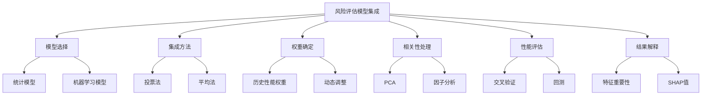
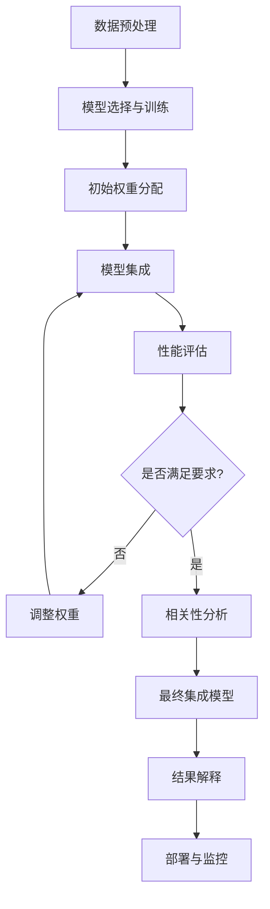
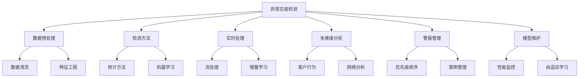
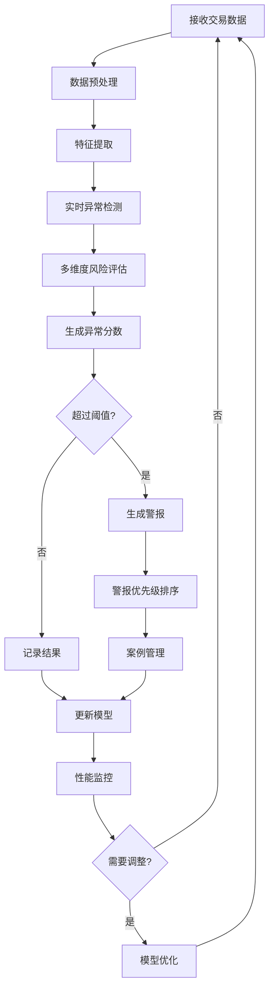
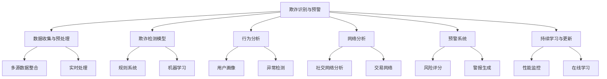
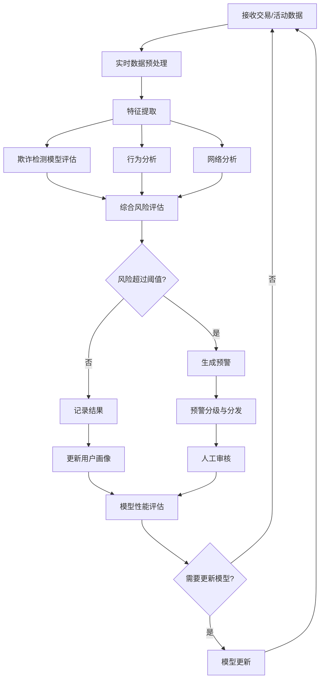
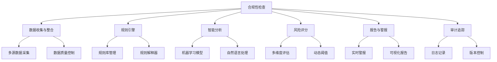
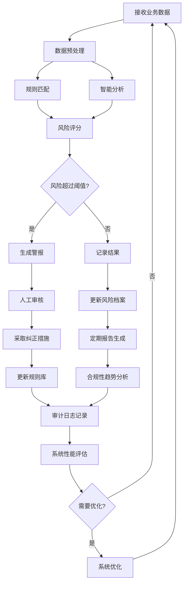
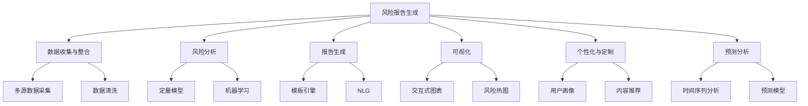
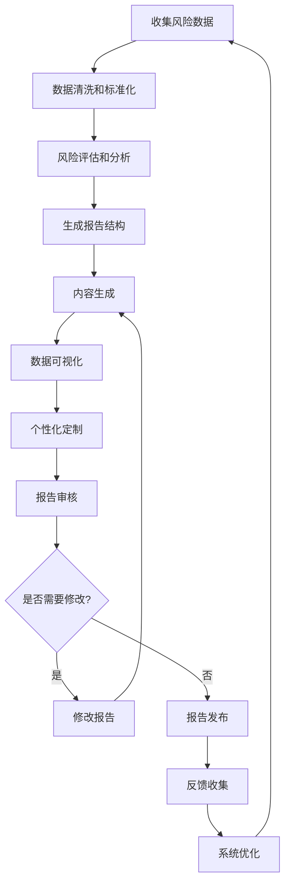

# 第11章：风控 Agent 开发

## 11.1 风险评估模型集成

### 核心概念

风险评估模型集成是一种将多个风险评估模型组合在一起，以提供更全面、更准确的风险评估结果的方法。这种集成方法旨在利用不同模型的优势，弥补单一模型的局限性，从而提高风险评估的准确性和可靠性。在金融、保险、信贷等领域，风险评估模型集成已成为风险管理的关键组成部分。

### 问题背景

随着金融市场的复杂性增加和数据可用性的提高，单一的风险评估模型往往无法捕捉所有相关的风险因素。不同的模型可能擅长评估不同类型的风险或在不同的市场条件下表现更好。同时，监管要求也日益严格，要求金融机构采用更全面、更稳健的风险评估方法。因此，需要一种能够整合多个模型优势的集成方法。

### 问题描述

1. 如何选择和组合不同类型的风险评估模型
2. 如何处理不同模型输出的异质性
3. 如何确定各个模型在集成结果中的权重
4. 如何处理模型之间的相关性和依赖关系
5. 如何评估集成模型的性能和稳定性
6. 如何解释集成模型的结果以满足监管要求

### 问题解决

我们将从以下几个方面详细探讨风险评估模型集成的实现：

1. 模型选择：
    - 统计模型（如线性回归、逻辑回归）
    - 机器学习模型（如随机森林、支持向量机）
    - 深度学习模型（如神经网络）
    - 专家系统和规则基础模型

2. 集成方法：
    - 投票法（多数投票、加权投票）
    - 平均法（简单平均、加权平均）
    - 堆叠（Stacking）
    - 贝叶斯模型平均（BMA）

3. 权重确定：
    - 基于历史性能的权重分配
    - 动态权重调整
    - 优化算法（如遗传算法）

4. 相关性处理：
    - 主成分分析（PCA）
    - 因子分析
    - 相关性矩阵调整

5. 性能评估：
    - 交叉验证
    - 回测（Backtesting）
    - 压力测试

6. 结果解释：
    - 特征重要性分析
    - 部分依赖图（PDP）
    - SHAP（SHapley Additive exPlanations）值

### 边界与外延

虽然本节主要关注金融风险评估模型的集成，但这些技术也可以扩展到其他领域，如医疗诊断、环境风险评估等。此外，我们还将讨论如何将模型集成与实时数据流、大数据处理技术结合，以及如何应对模型集成在实际应用中的挑战。

### 概念结构与核心要素组成



### 概念之间的关系

| 组件 | 主要功能 | 输入 | 输出 | 与其他组件的关系 |
|------|---------|------|------|------------------|
| 模型选择 | 确定基础模型 | 历史数据、风险因素 | 候选模型集 | 为集成方法提供基础 |
| 集成方法 | 组合模型结果 | 各模型输出 | 集成预测结果 | 使用权重确定的结果 |
| 权重确定 | 分配模型权重 | 模型性能指标 | 权重系数 | 影响集成方法的效果 |
| 相关性处理 | 减少冗余 | 模型输出、特征 | 降维后的数据 | 优化集成效果 |
| 性能评估 | 评估集成效果 | 集成模型结果 | 性能指标 | 反馈到权重确定 |
| 结果解释 | 提供可解释性 | 集成模型、预测结果 | 解释报告 | 利用集成结果和原始特征 |

### 算法流程图

风险评估模型集成的基本流程：



### 算法源代码

以下是一个简化的风险评估模型集成系统示例：

```python
import numpy as np
from sklearn.ensemble import RandomForestClassifier
from sklearn.linear_model import LogisticRegression
from sklearn.svm import SVC
from sklearn.model_selection import train_test_split
from sklearn.metrics import accuracy_score, roc_auc_score
from sklearn.preprocessing import StandardScaler

class RiskAssessmentEnsemble:
    def __init__(self):
        self.models = {
            'rf': RandomForestClassifier(n_estimators=100, random_state=42),
            'lr': LogisticRegression(random_state=42),
            'svm': SVC(probability=True, random_state=42)
        }
        self.weights = {'rf': 0.4, 'lr': 0.3, 'svm': 0.3}
        self.scaler = StandardScaler()

    def train(self, X, y):
        X_scaled = self.scaler.fit_transform(X)
        X_train, X_val, y_train, y_val = train_test_split(X_scaled, y, test_size=0.2, random_state=42)
        
        for name, model in self.models.items():
            model.fit(X_train, y_train)
            y_pred = model.predict(X_val)
            accuracy = accuracy_score(y_val, y_pred)
            print(f"{name} Accuracy: {accuracy:.4f}")

    def predict_proba(self, X):
        X_scaled = self.scaler.transform(X)
        predictions = {}
        for name, model in self.models.items():
            predictions[name] = model.predict_proba(X_scaled)[:, 1]
        
        ensemble_pred = np.zeros(X_scaled.shape[0])
        for name, pred in predictions.items():
            ensemble_pred += self.weights[name] * pred
        
        return ensemble_pred

    def evaluate(self, X, y):
        y_pred = self.predict_proba(X)
        auc = roc_auc_score(y, y_pred)
        print(f"Ensemble AUC: {auc:.4f}")

    def adjust_weights(self, X, y):
        # 简化的权重调整方法
        X_scaled = self.scaler.transform(X)
        performances = {}
        for name, model in self.models.items():
            y_pred = model.predict_proba(X_scaled)[:, 1]
            performances[name] = roc_auc_score(y, y_pred)
        
        total_performance = sum(performances.values())
        self.weights = {name: perf / total_performance for name, perf in performances.items()}
        print("Adjusted weights:", self.weights)

# 使用示例
# 假设我们有一些风险评估数据
np.random.seed(42)
X = np.random.rand(1000, 10)  # 10个风险因素
y = (X.sum(axis=1) + np.random.normal(0, 0.1, 1000)) > 5  # 简化的风险标签

ensemble = RiskAssessmentEnsemble()
ensemble.train(X, y)

# 评估集成模型
ensemble.evaluate(X, y)

# 调整权重
ensemble.adjust_weights(X, y)

# 再次评估
ensemble.evaluate(X, y)

# 对新数据进行预测
new_data = np.random.rand(10, 10)
risk_scores = ensemble.predict_proba(new_data)
print("Risk scores for new data:", risk_scores)
```

### 实际场景应用

1. 信用风险评估：
    - 集成信用评分模型、行为模型和宏观经济模型
    - 评估个人或企业的信用风险
    - 支持信贷决策和定价

2. 市场风险管理：
    - 结合VaR模型、压力测试和情景分析
    - 评估投资组合的市场风险
    - 优化资产配置策略

3. 操作风险评估：
    - 集成定量模型和定性评估方法
    - 识别和量化潜在的操作风险
    - 支持风险缓解策略的制定

4. 保险承保：
    - 结合精算模型、客户行为模型和欺诈检测模型
    - 评估保险申请的风险
    - 优化保费定价和承保决策

5. 反洗钱（AML）：
    - 集成交易监控、客户画像和网络分析模型
    - 识别可疑的金融活动
    - 支持合规报告和调查

### 最佳实践 tips

1. 模型多样性：
    - 选择不同类型和复杂度的模型
    - 考虑模型在不同市场条件下的表现
    - 定期评估和更新模型组合

2. 动态权重调整：
    - 实施自适应权重分配机制
    - 根据最新的市场数据和模型表现调整权重
    - 考虑使用机器学习算法优化权重分配

3. 数据质量和预处理：
    - 确保输入数据的质量和一致性
    - 实施强大的异常值检测和处理机制
    - 标准化不同来源的数据

4. 实时性能监控：
    - 建立实时监控仪表板
    - 设置性能警报阈值
    - 实施自动化的模型退化检测机制

5. 可解释性：
    - 使用可解释的AI技术（如LIME、SHAP）
    - 生成直观的风险因素贡献报告
    - 提供模型决策的审计跟踪

6. 压力测试和情景分析：
    - 定期进行极端情景下的模型表现测试
    - 评估模型对不同经济环境的敏感性
    - 包括历史事件和假设情景的分析

7. 监管合规：
    - 确保模型文档的完整性和透明度
    - 实施模型验证和审核流程
    - 保持与最新监管要求的一致性

### 行业发展与未来趋势

| 时期 | 主要特征 | 关键技术 | 挑战 | 未来展望 |
|------|---------|----------|------|----------|
| 2018-2019 | 基础模型集成 | 简单平均、投票法 | 模型选择 | 更复杂的集成方法 |
| 2020-2021 | 高级集成技术 | 堆叠、贝叶斯平均 | 实时性能 | AI驱动的动态集成 |
| 2022-2023 | AI增强集成 | 深度学习、强化学习 | 可解释性 | 自适应风险评估系统 |
| 2024-2025 (预测) | 认知风险评估 | 图神经网络、因果推理 | 复杂系统建模 | 预见性风险管理 |
| 2026+ (展望) | 量子风险计算 | 量子机器学习、AGI | 伦理和隐私 | 全息风险感知系统 |

风险评估模型集成技术正在经历快速的演变。从早期的简单平均和投票方法到现在的AI驱动的动态集成系统，我们看到了显著的进步。这些变化不仅提高了风险评估的准确性和全面性，还改变了金融机构管理和应对风险的方式。

未来的风险评估模型集成系统可能会更加注重以下几个方面：

1. 实时动态集成：
    - 根据市场条件实时调整模型权重
    - 集成实时数据流和高频交易数据
    - 实现毫秒级的风险评估和决策

2. 跨域风险整合：
    - 集成信用、市场、操作等多种风险评估
    - 考虑风险之间的相互作用和级联效应
    - 提供全面的企业风险管理视图

3. 智能自适应：
    - 使用强化学习自动优化模型组合
    - 根据新数据自动更新和重新训练模型
    - 适应新出现的风险类型和模式

4. 因果推理：
    - 整合因果推理模型以理解风险驱动因素
    - 提供"假设情景"分析能力
    - 支持更精确的风险缓解策略制定

5. 分布式风险计算：
    - 利用边缘计算进行本地风险评估
    - 实现跨机构的安全风险信息共享
    - 支持全球分布式金融系统的风险管理

6. 量子风险计算：
    - 利用量子计算解决复杂的风险优化问题
    - 实现超大规模的蒙特卡洛模拟
    - 探索新的风险建模范式

7. 认知风险感知：
    - 集成自然语言处理分析新闻和社交媒体
    - 使用计算机视觉分析地理空间风险
    - 开发多模态风险感知系统

随着这些趋势的发展，风险评估模型集成系统将从静态的分析工具演变为动态的、自适应的风险管理平台。它们将能够更全面地理解和预测各种风险，提供更及时、更准确的风险洞察，并在复杂多变的金融环境中发挥关键作用。

这种进步将带来多方面的益处：

1. 提高风险管理效率：通过自动化和智能化减少人工干预。

2. 增强预测能力：更早地识别潜在风险和机会。

3. 改善决策质量：提供更全面、更及时的风险信息支持决策。

4. 优化资本配置：更精确地评估风险，优化资本使用。

5. 增强监管合规：提供更透明、更可审计的风险评估过程。

6. 促进创新：支持新金融产品和服务的风险评估。

7. 提高系统稳定性：通过更好的风险管理增强金融系统的整体稳定性。

然而，这种发展也带来了新的挑战，如如何确保复杂集成系统的可解释性，如何平衡模型的复杂性和实用性，以及如何处理日益增加的数据隐私和安全问题。未来的系统需要在技术创新和风险管理实践之间找到平衡，确保它们不仅技术先进，还能满足实际业务需求和监管要求。

总的来说，风险评估模型集成技术的演进将继续深刻影响金融行业的风险管理实践。通过提供更智能、更全面的风险评估能力，这些技术将帮助金融机构更好地应对不确定性，提高风险管理的效率和效果，并在复杂多变的全球金融环境中保持竞争优势。这不仅将改变我们评估和管理风险的方式，还将推动整个金融行业向更加数据驱动、智能化和前瞻性的方向发展。

## 11.2 异常交易检测

### 核心概念

异常交易检测是一种利用数据分析和机器学习技术来识别金融交易中的异常模式或可疑行为的方法。这种技术旨在发现潜在的欺诈、洗钱、内幕交易等非法或高风险活动，以保护金融机构和客户的利益，维护金融市场的稳定性和完整性。异常交易检测系统通常分析大量的交易数据，寻找偏离正常模式的行为，并生成警报供进一步调查。

### 问题背景

随着金融交易的数字化和全球化，金融犯罪和欺诈活动变得越来越复杂和难以察觉。传统的规则基础方法往往无法应对快速变化的欺诈模式和大规模数据处理的需求。同时，监管要求日益严格，要求金融机构采用更先进、更有效的方法来监控和报告可疑活动。因此，需要一个能够实时处理大量数据、适应新兴威胁的智能异常交易检测系统。

### 问题描述

1. 如何处理和分析海量的实时交易数据
2. 如何定义和识别"异常"交易
3. 如何平衡检测的敏感性和误报率
4. 如何处理不同类型的金融产品和交易模式
5. 如何适应不断变化的欺诈模式和技术
6. 如何整合多源数据以提高检测准确性

### 问题解决

我们将从以下几个方面详细探讨异常交易检测的实现：

1. 数据预处理：
    - 数据清洗和标准化
    - 特征工程
    - 时间序列分析

2. 检测方法：
    - 统计方法（如Z-score、MAD）
    - 机器学习方法（如孤立森林、One-Class SVM）
    - 深度学习方法（如自编码器、LSTM）

3. 实时处理：
    - 流处理架构
    - 增量学习
    - 分布式计算

4. 多维度分析：
    - 客户行为分析
    - 网络分析
    - 地理位置分析

5. 警报生成和管理：
    - 警报优先级排序
    - 警报聚合
    - 案例管理系统

6. 模型更新和维护：
    - 模型性能监控
    - 自适应学习
    - A/B测试

### 边界与外延

虽然本节主要关注金融交易的异常检测，但这些技术也可以扩展到其他领域，如网络安全、医疗诊断、工业生产等。此外，我们还将讨论如何将异常交易检测与其他风险管理系统集成，以及如何应对隐私保护和监管合规的挑战。

### 概念结构与核心要素组成



### 概念之间的关系

| 组件 | 主要功能 | 输入 | 输出 | 与其他组件的关系 |
|------|---------|------|------|------------------|
| 数据预处理 | 准备分析数据 | 原始交易数据 | 清洗后的特征 | 为检测方法提供输入 |
| 检测方法 | 识别异常模式 | 预处理后的数据 | 异常分数 | 使用预处理数据，输出给警报管理 |
| 实时处理 | 处理流数据 | 实时交易流 | 实时异常检测结果 | 与检测方法和多维度分析协同 |
| 多维度分析 | 全面评估风险 | 多源数据 | 综合风险评分 | 补充检测方法的结果 |
| 警报管理 | 处理检测结果 | 异常分数、风险评分 | 警报和案例 | 整合检测和分析结果 |
| 模型维护 | 保持模型效果 | 性能指标、新数据 | 更新后的模型 | 优化所有其他组件 |

### 算法流程图

异常交易检测的基本流程：



### 算法源代码

以下是一个简化的异常交易检测系统示例：

```python
import numpy as np
import pandas as pd
from sklearn.preprocessing import StandardScaler
from sklearn.ensemble import IsolationForest
from sklearn.svm import OneClassSVM

class AnomalyDetectionSystem:
    def __init__(self):
        self.scaler = StandardScaler()
        self.isolation_forest = IsolationForest(contamination=0.05, random_state=42)
        self.one_class_svm = OneClassSVM(nu=0.05, kernel="rbf", gamma='scale')
        self.models = {
            'isolation_forest': self.isolation_forest,
            'one_class_svm': self.one_class_svm
        }

    def preprocess_data(self, data):
        # 假设数据已经是数值型的特征
        return self.scaler.fit_transform(data)

    def train_models(self, data):
        preprocessed_data = self.preprocess_data(data)
        for name, model in self.models.items():
            model.fit(preprocessed_data)
            print(f"{name} model trained.")

    def detect_anomalies(self, transaction):
        preprocessed_transaction = self.scaler.transform([transaction])
        results = {}
        for name, model in self.models.items():
            prediction = model.predict(preprocessed_transaction)
            anomaly_score = model.score_samples(preprocessed_transaction)
            results[name] = {
                'is_anomaly': prediction[0] == -1,
                'anomaly_score': anomaly_score[0]
            }
        return results

    def generate_alert(self, transaction, results):
        alert = None
        if any(result['is_anomaly'] for result in results.values()):
            alert = {
                'transaction': transaction,
                'anomaly_scores': {name: result['anomaly_score'] for name, result in results.items()},
                'detection_methods': [name for name, result in results.items() if result['is_anomaly']],
                'priority': 'high' if all(result['is_anomaly'] for result in results.values()) else 'medium'
            }
        return alert

# 使用示例
np.random.seed(42)
# 生成模拟交易数据
normal_transactions = np.random.normal(loc=100, scale=10, size=(1000, 4))
anomaly_transactions = np.random.normal(loc=200, scale=50, size=(50, 4))
all_transactions = np.vstack((normal_transactions, anomaly_transactions))

system = AnomalyDetectionSystem()
system.train_models(all_transactions)

# 模拟实时交易检测
new_transactions = [
    [105, 98, 102, 95],  # 正常交易
    [250, 300, 280, 270],  # 异常交易
]

for transaction in new_transactions:
    results = system.detect_anomalies(transaction)
    alert = system.generate_alert(transaction, results)
    if alert:
        print("Alert generated:")
        print(f"Transaction: {alert['transaction']}")
        print(f"Anomaly scores: {alert['anomaly_scores']}")
        print(f"Detected by: {alert['detection_methods']}")
        print(f"Priority: {alert['priority']}")
    else:
        print("No alert generated for transaction:", transaction)
    print("---")
```

### 实际场景应用

1. 信用卡欺诈检测：
    - 实时监控信用卡交易
    - 识别异常的消费模式和地理位置
    - 快速冻结可疑账户

2. 反洗钱（AML）：
    - 分析复杂的资金流动模式
    - 识别结构化交易和可疑账户网络
    - 生成监管报告

3. 内幕交易检测：
    - 监控股票交易模式
    - 分析交易时间与公司公告的关系
    - 识别异常的交易量和价格变动

4. 网络银行安全：
    - 检测异常的登录行为和设备
    - 识别可疑的资金转移模式
    - 防止账户接管和身份盗窃

5. 保险欺诈检测：
    - 分析理赔模式和频率
    - 识别可疑的理赔网络
    - 优化理赔调查流程

### 最佳实践 tips

1. 多模型集成：
    - 结合多种检测方法以提高准确性
    - 使用集成学习技术如随机森林、梯度提升
    - 定期评估和调整模型权重

2. 实时处理优化：
    - 使用流处理框架如Apache Kafka或Apache Flink
    - 实现增量学习以适应新模式
    - 优化数据流水线以减少延迟

3. 特征工程：
    - 创建领域特定的特征（如交易频率、金额变化率）
    - 利用时间序列特征捕捉行为模式
    - 考虑使用自动特征生成技术

4. 动态阈值调整：
    - 实现自适应阈值以适应不同客户和市场条件
    - 使用统计方法动态调整异常分数阈值
    - 考虑季节性和周期性因素

5. 警报管理：
    - 实施警报聚合以减少重复
    - 使用机器学习对警报进行优先级排序
    - 提供详细的上下文信息以辅助调查

6. 持续学习和更新：
    - 建立反馈循环以从调查结果中学习
    - 定期重新训练模型以适应新的欺诈模式
    - 实施A/B测试以评估新模型和策略

7. 可解释性：
    - 使用可解释的AI技术如SHAP值
    - 提供清晰的异常检测理由
    - 生成易于理解的异常报告for非技术人员

### 行业发展与未来趋势

| 时期 | 主要特征 | 关键技术 | 挑战 | 未来展望 |
|------|---------|----------|------|----------|
| 2018-2019 | 规则基础检测 | 专家系统、简单ML | 高误报率 | 更智能的检测方法 |
| 2020-2021 | 机器学习应用 | 深度学习、大数据 | 实时处理 | 自适应系统 |
| 2022-2023 | AI驱动检测 | 图神经网络、联邦学习 | 隐私保护 | 跨机构协作 |
| 2024-2025 (预测) | 认知异常检测 | 因果推理、强化学习 | 复杂欺诈模式 | 预见性欺诈预防 |
| 2026+ (展望) | 量子增强检测 | 量子机器学习、AGI | 伦理和监管 | 全息风险感知 |

异常交易检测技术正在经历快速的演变。从早期的基于规则的系统到现在的AI驱动的智能检测平台，我们看到了显著的进步。这些变化不仅提高了检测的准确性和效率，还改变了金融机构应对欺诈和风险的方式。

未来的异常交易检测系统可能会更加注重以下几个方面：

1. 全息风险视图：
    - 整合交易、客户行为、市场数据等多维信息
    - 构建动态的风险网络图
    - 提供全面的风险评估和可视化

2. 预见性欺诈预防：
    - 使用高级AI预测潜在的欺诈模式
    - 实施主动式风险缓解策略
    - 开发欺诈模式模拟器for预防性测试

3. 跨机构协作检测：
    - 实现安全的数据共享和联合学习
    - 建立行业级的欺诈情报网络
    - 开发跨境、跨行业的协作检测机制

4. 自主学习和适应：
    - 持续从新数据和反馈中学习
    - 自动发现和适应新的欺诈模式
    - 实现模型的自我诊断和优化

5. 情境感知检测：
    - 考虑更广泛的环境和社会因素
    - 整合非结构化数据（如新闻、社交媒体）
    - 开发多模态异常检测系统

6. 量子增强计算：
    - 利用量子计算解决复杂的优化问题
    - 实现超大规模数据的实时处理
    - 探索新的量子机器学习算法for异常检测

7. 伦理AI和可解释性：
    - 确保检测系统的公平性和无偏见
    - 提供高度透明和可审计的决策过程
    - 开发符合监管要求的可解释AI系统

随着这些趋势的发展，异常交易检测系统将从被动的监控工具演变为主动的风险管理平台。它们将能够更全面地理解和预测各种欺诈和风险模式，提供更及时、更准确的异常检测，并在复杂多变的金融环境中发挥关键作用。

这种进步将带来多方面的益处：

1. 提高检测准确性：显著减少误报和漏报。

2. 增强实时响应能力：更快地识别和阻止欺诈活动。

3. 改善用户体验：减少对合法交易的干扰。

4. 优化运营效率：自动化大部分检测和调查过程。

5. 增强合规能力：更好地满足不断变化的监管要求。

6. 促进创新：支持新型金融产品和服务的安全开发。

7. 提高系统韧性：更好地应对新兴威胁和黑天鹅事件。

然而，这种发展也带来了新的挑战，如如何在提高检测能力的同时保护客户隐私，如何平衡自动化决策和人工判断，以及如何确保AI系统的公平性和透明度。未来的系统需要在技术创新和伦理考量之间找到平衡，确保它们不仅高效可靠，还符合社会和监管的期望。

总的来说，异常交易检测技术的演进将继续深刻影响金融安全和风险管理领域。通过提供更智能、更全面的异常检测能力，这些技术将帮助金融机构更好地保护自身和客户利益，维护金融系统的稳定性和完整性，并在日益复杂的全球金融环境中保持竞争优势。这不仅将改变我们检测和预防金融犯罪的方式，还将推动整个金融行业向更加安全、透明和创新的方向发展。

## 11.3 欺诈识别与预警

### 核心概念

欺诈识别与预警是一种利用先进的数据分析和人工智能技术来检测、预防和预测欺诈行为的系统。这种系统旨在实时监控各种金融交易和活动，识别可疑模式，并在欺诈行为发生之前或发生初期发出警报。欺诈识别与预警系统不仅关注已知的欺诈模式，还能够识别新兴的、未知的欺诈手法，从而为金融机构提供全面的防护。

### 问题背景

随着数字化金融服务的普及和全球化趋势的加深，欺诈行为变得越来越复杂和难以察觉。传统的欺诈检测方法往往反应滞后，无法应对快速演变的欺诈技术。同时，合法用户对无缝、快速的金融服务体验的需求也在增加，这要求欺诈检测系统能够在不影响用户体验的情况下高效运作。此外，监管机构对金融机构的反欺诈能力提出了更高的要求，需要更先进、更主动的欺诈识别和预警解决方案。

### 问题描述

1. 如何实时处理和分析海量的交易数据和用户行为
2. 如何识别复杂的、多步骤的欺诈模式
3. 如何平衡欺诈检测的准确性和用户体验
4. 如何应对不断演变的欺诈技术和新兴威胁
5. 如何减少误报率同时提高真实欺诈的捕获率
6. 如何整合多源数据以提供全面的欺诈风险评估

### 问题解决

我们将从以下几个方面详细探讨欺诈识别与预警的实现：

1. 数据收集与预处理：
    - 多源数据整合
    - 实时数据流处理
    - 特征工程

2. 欺诈检测模型：
    - 规则基础系统
    - 机器学习模型（如随机森林、XGBoost）
    - 深度学习模型（如LSTM、GNN）

3. 行为分析：
    - 用户画像构建
    - 异常行为检测
    - 时序模式分析

4. 网络分析：
    - 社交网络分析
    - 交易网络可视化
    - 图模式匹配

5. 预警系统：
    - 风险评分
    - 多级别警报
    - 实时通知机制

6. 持续学习与更新：
    - 模型性能监控
    - 在线学习
    - 反馈循环机制

### 边界与外延

虽然本节主要关注金融领域的欺诈识别与预警，但这些技术也可以扩展到其他领域，如电子商务、保险、电信等。此外，我们还将讨论如何将欺诈识别与预警系统与其他风险管理和客户体验优化系统集成，以及如何应对隐私保护和跨境数据共享的挑战。

### 概念结构与核心要素组成



### 概念之间的关系

| 组件 | 主要功能 | 输入 | 输出 | 与其他组件的关系 |
|------|---------|------|------|------------------|
| 数据收集与预处理 | 准备分析数据 | 原始交易、用户数据 | 结构化特征 | 为所有其他组件提供输入 |
| 欺诈检测模型 | 识别欺诈模式 | 预处理后的数据 | 欺诈可能性 | 使用行为分析和网络分析结果 |
| 行为分析 | 分析用户行为 | 用户活动数据 | 行为异常分数 | 为欺诈检测模型提供输入 |
| 网络分析 | 分析关系网络 | 交易和社交数据 | 网络异常指标 | 补充欺诈检测模型的结果 |
| 预警系统 | 生成风险警报 | 各模型的输出 | 风险警报 | 整合所有分析结果 |
| 持续学习与更新 | 优化系统性能 | 模型性能指标、反馈 | 更新后的模型 | 改进所有其他组件 |

### 算法流程图

欺诈识别与预警的基本流程：



### 算法源代码

以下是一个简化的欺诈识别与预警系统示例：

```python
import numpy as np
import pandas as pd
from sklearn.ensemble import RandomForestClassifier
from sklearn.preprocessing import StandardScaler
from sklearn.model_selection import train_test_split

class FraudDetectionSystem:
    def __init__(self):
        self.scaler = StandardScaler()
        self.model = RandomForestClassifier(n_estimators=100, random_state=42)
        self.user_profiles = {}

    def preprocess_data(self, data):
        return self.scaler.fit_transform(data)

    def train_model(self, X, y):
        X_scaled = self.preprocess_data(X)
        X_train, X_test, y_train, y_test = train_test_split(X_scaled, y, test_size=0.2, random_state=42)
        self.model.fit(X_train, y_train)
        print(f"Model accuracy: {self.model.score(X_test, y_test):.4f}")

    def predict_fraud(self, transaction):
        scaled_transaction = self.scaler.transform([transaction])
        fraud_probability = self.model.predict_proba(scaled_transaction)[0][1]
        return fraud_probability

    def update_user_profile(self, user_id, transaction):
        if user_id not in self.user_profiles:
            self.user_profiles[user_id] = {'avg_amount': transaction['amount'], 'transaction_count': 1}
        else:
            profile = self.user_profiles[user_id]
            profile['avg_amount'] = (profile['avg_amount'] * profile['transaction_count'] + transaction['amount']) / (profile['transaction_count'] + 1)
            profile['transaction_count'] += 1

    def analyze_behavior(self, user_id, transaction):
        if user_id not in self.user_profiles:
            return 0.5  # Neutral score for new users
        profile = self.user_profiles[user_id]
        amount_diff = abs(transaction['amount'] - profile['avg_amount'])
        behavior_score = amount_diff / profile['avg_amount']
        return min(behavior_score, 1.0)  # Normalize to [0, 1]

    def generate_alert(self, transaction, fraud_probability, behavior_score):
        combined_score = (fraud_probability + behavior_score) / 2
        if combined_score > 0.8:
            return {'level': 'High', 'score': combined_score, 'transaction': transaction}
        elif combined_score > 0.5:
            return {'level': 'Medium', 'score': combined_score, 'transaction': transaction}
        return None

# 使用示例
np.random.seed(42)
# 生成模拟交易数据
n_samples = 10000
X = np.column_stack((
    np.random.normal(100, 50, n_samples),  # 金额
    np.random.randint(1, 100, n_samples),  # 用户年龄
    np.random.choice([0, 1], n_samples, p=[0.7, 0.3])  # 是否使用新设备
))
y = (X[:, 0] > 250) | (X[:, 1] < 25) & (X[:, 2] == 1)  # 简单的欺诈规则

system = FraudDetectionSystem()
system.train_model(X, y)

# 模拟实时交易
transactions = [
    {'user_id': 1, 'amount': 120, 'age': 35, 'new_device': 0},
    {'user_id': 2, 'amount': 300, 'age': 22, 'new_device': 1},
    {'user_id': 1, 'amount': 150, 'age': 35, 'new_device': 0},
]

for transaction in transactions:
    fraud_prob = system.predict_fraud([transaction['amount'], transaction['age'], transaction['new_device']])
    system.update_user_profile(transaction['user_id'], transaction)
    behavior_score = system.analyze_behavior(transaction['user_id'], transaction)
    alert = system.generate_alert(transaction, fraud_prob, behavior_score)
    
    if alert:
        print(f"Alert: {alert['level']} risk")
        print(f"Combined score: {alert['score']:.2f}")
        print(f"Transaction details: {alert['transaction']}")
    else:
        print("No alert generated for transaction:", transaction)
    print("---")
```

### 实际场景应用

1. 信用卡交易监控：
    - 实时分析每笔交易
    - 考虑地理位置、消费模式和商户类型
    - 快速识别和阻止可疑交易

2. 在线银行欺诈预防：
    - 监控登录行为和账户活动
    - 分析设备信息和网络特征
    - 防止账户接管和身份盗窃

3. 保险理赔欺诈检测：
    - 分析理赔历史和模式
    - 识别可疑的理赔网络
    - 优化理赔调查流程

4. 电子商务防欺诈：
    - 评估新用户和交易风险
    - 检测虚假评论和刷单行为
    - 防止退款欺诈和账户滥用

5. 反洗钱（AML）监控：
    - 分析复杂的资金流动
    - 识别结构化交易和可疑账户网络
    - 生成监管报告和警报

### 最佳实践 tips

1. 多层防御：
    - 结合规则基础和机器学习方法
    - 实施多重验证机制
    - 建立分层的风险评估框架

2. 实时处理与响应：
    - 使用流处理技术如Apache Kafka
    - 实现毫秒级的欺诈评分
    - 建立快速响应机制for高风险交易

3. 全面的数据整合：
    - 整合内部和外部数据源
    - 考虑非结构化数据（如社交媒体）
    - 建立统一的客户视图

4. 高级分析技术：
    - 利用图分析识别复杂欺诈网络
    - 应用深度学习分析序列模式
    - 使用异常检测算法发现新型欺诈

5. 持续学习和适应：
    - 实施在线学习算法
    - 定期重新训练模型
    - 建立人工反馈循环

6. 可解释性和透明度：
    - 使用可解释的AI技术
    - 提供清晰的欺诈评分理由
    - 确保决策过程的可审计性

7. 隐私保护和合规：
    - 实施数据匿名化和加密
    - 遵守GDPR等隐私法规
    - 建立严格的数据访问控制

### 行业发展与未来趋势

| 时期 | 主要特征 | 关键技术 | 挑战 | 未来展望 |
|------|---------|----------|------|----------|
| 2018-2019 | 规则基础系统 | 专家系统、简单ML | 高误报率 | 更智能的检测 |
| 2020-2021 | 机器学习应用 | 深度学习、大数据 | 实时性能 | 自适应系统 |
| 2022-2023 | AI驱动预警 | 图神经网络、联邦学习 | 隐私保护 | 预测性欺诈防御 |
| 2024-2025 (预测) | 认知欺诈分析 | 因果推理、强化学习 | 复杂欺诈网络 | 全息风险感知 |
| 2026+ (展望) | 量子增强安全 | 量子机器学习、AGI | 伦理和监管 | 自主防御系统 |

欺诈识别与预警技术正在经历快速的演变。从早期的基于规则的系统到现在的AI驱动的智能预警平台，我们看到了显著的进步。这些变化不仅提高了欺诈检测的准确性和效率，还改变了金融机构应对欺诈风险的方式。

未来的欺诈识别与预警系统可能会更加注重以下几个方面：

1. 预测性欺诈防御：
    - 使用高级AI预测潜在的欺诈行为
    - 实施主动式风险缓解策略
    - 开发欺诈模式模拟器for预防性测试

2. 全息风险视图：
    - 整合交易、行为、社交等多维数据
    - 构建动态的风险网络图
    - 提供360度的客户风险评估

3. 自适应学习系统：
    - 实时调整检测策略
    - 自动发现新的欺诈模式
    - 快速适应不断变化的欺诈技术

4. 跨机构协作：
    - 安全的数据共享和联合学习
    - 建立行业级的欺诈情报网络
    - 开发跨境、跨行业的协作机制

5. 量子增强安全：
    - 利用量子计算加强加密
    - 开发量子抗性的欺诈检测算法
    - 探索量子机器学习在欺诈检测中的应用

6. 伦理AI和可解释性：
    - 确保欺诈检测的公平性和透明度
    - 开发符合监管要求的可解释AI系统
    - 平衡隐私保护和欺诈检测效率

7. 情境感知欺诈分析：
    - 考虑更广泛的环境和社会因素
    - 整合非结构化数据（如新闻、社交媒体）
    - 开发多模态欺诈检测系统

随着这些趋势的发展，欺诈识别与预警系统将从被动的检测工具演变为主动的、智能的风险管理平台。它们将能够更全面地理解和预测各种欺诈模式，提供更及时、更准确的预警，并在复杂多变的金融环境中发挥关键作用。

这种进步将带来多方面的益处：

1. 提高检测准确性：显著减少误报和漏报。

2. 增强实时响应能力：更快地识别和阻止欺诈活动。

3. 改善用户体验：减少对合法交易的干扰。

4. 优化运营效率：自动化大部分欺诈检测和调查过程。

5. 增强合规能力：更好地满足不断变化的监管要求。

6. 促进创新：支持新型金融产品和服务的安全开发。

7. 提高系统韧性：更好地应对新兴威胁和未知风险。

然而，这种发展也带来了新的挑战，如如何在提高检测能力的同时保护客户隐私，如何确保AI系统的决策公平性和透明度，以及如何应对日益复杂的监管环境。未来的系统需要在技术创新和伦理考量之间找到平衡，确保它们不仅高效可靠，还符合社会和监管的期望。

总的来说，欺诈识别与预警技术的演进将继续深刻影响金融安全和风险管理领域。通过提供更智能、更全面的欺诈防御能力，这些技术将帮助金融机构更好地保护自身和客户利益，维护金融系统的稳定性和完整性，并在日益复杂的全球金融环境中保持竞争优势。这不仅将改变我们识别和预防欺诈的方式，还将推动整个金融行业向更加安全、透明和创新的方向发展。

## 11.4 合规性检查

### 核心概念

合规性检查是一种系统化的过程，旨在确保组织的运营、流程和行为符合相关法律、法规、行业标准和内部政策。在金融科技领域，合规性检查尤为重要，因为它不仅关系到组织的法律风险，还直接影响到金融系统的稳定性和客户的信任。随着监管环境的不断变化和复杂化，自动化和智能化的合规性检查系统变得越来越重要，它能够实时监控、分析和报告潜在的合规风险，帮助组织及时采取纠正措施。

### 问题背景

金融科技行业面临着日益严格和复杂的监管环境。全球各地的监管机构不断出台新的法规和指引，涉及数据隐私、反洗钱、网络安全、消费者保护等多个方面。同时，跨境业务的增加也带来了多重监管合规的挑战。传统的手动合规检查方法已经无法应对这种复杂性和动态性。此外，不合规行为可能导致巨额罚款、声誉损失，甚至业务中断，因此需要一个更加高效、全面和主动的合规性检查解决方案。

### 问题描述

1. 如何实时监控和分析大量的交易和业务数据以识别合规风险
2. 如何处理和解释复杂、多变的监管要求
3. 如何确保跨地域、跨业务线的一致性合规
4. 如何有效管理和更新合规规则库
5. 如何平衡合规要求和业务效率
6. 如何处理合规检查过程中的误报和漏报问题

### 问题解决

我们将从以下几个方面详细探讨合规性检查的实现：

1. 数据收集与整合：
    - 多源数据采集
    - 数据质量控制
    - 数据标准化

2. 规则引擎：
    - 规则库管理
    - 规则解释器
    - 动态规则更新

3. 智能分析：
    - 机器学习模型
    - 自然语言处理
    - 模式识别

4. 风险评分：
    - 多维度风险评估
    - 动态阈值调整
    - 风险趋势分析

5. 报告与警报：
    - 实时警报系统
    - 可视化报告
    - 定制化仪表板

6. 审计追踪：
    - 完整日志记录
    - 版本控制
    - 证据链管理

### 边界与外延

虽然本节主要关注金融科技领域的合规性检查，但这些技术和方法也可以扩展到其他高度监管的行业，如医疗保健、能源和电信等。此外，我们还将探讨如何将合规性检查系统与其他企业系统（如风险管理、内部控制、客户关系管理等）集成，以及如何应对新兴技术（如区块链、人工智能）带来的合规挑战。

### 概念结构与核心要素组成



### 概念之间的关系

| 组件 | 主要功能 | 输入 | 输出 | 与其他组件的关系 |
|------|---------|------|------|------------------|
| 数据收集与整合 | 准备分析数据 | 原始业务数据 | 标准化数据 | 为所有其他组件提供输入 |
| 规则引擎 | 执行合规规则 | 标准化数据、规则库 | 规则匹配结果 | 与智能分析协同工作 |
| 智能分析 | 识别复杂模式 | 标准化数据 | 分析结果 | 补充规则引擎的结果 |
| 风险评分 | 量化合规风险 | 规则匹配和分析结果 | 风险分数 | 整合规则引擎和智能分析的输出 |
| 报告与警报 | 呈现结果 | 风险分数、分析结果 | 报告、警报 | 使用所有其他组件的输出 |
| 审计追踪 | 记录所有活动 | 系统操作、决策 | 审计日志 | 跟踪所有组件的活动 |

### 算法流程图

合规性检查的基本流程：



### 算法源代码

以下是一个简化的合规性检查系统示例：

```python
import re
from datetime import datetime
from typing import Dict, List, Any

class ComplianceChecker:
    def __init__(self):
        self.rules = {
            'transaction_limit': lambda t: t['amount'] <= 10000,
            'kyc_check': lambda t: t['kyc_status'] == 'verified',
            'high_risk_country': lambda t: t['country'] not in ['CountryA', 'CountryB'],
            'frequency_check': lambda t: self.check_transaction_frequency(t)
        }
        self.transaction_history = {}

    def check_transaction_frequency(self, transaction: Dict[str, Any]) -> bool:
        user_id = transaction['user_id']
        current_time = datetime.now()
        if user_id in self.transaction_history:
            last_transaction_time = self.transaction_history[user_id]
            if (current_time - last_transaction_time).total_seconds() < 60:  # 1 minute
                return False
        self.transaction_history[user_id] = current_time
        return True

    def check_compliance(self, transaction: Dict[str, Any]) -> Dict[str, Any]:
        results = {}
        for rule_name, rule_func in self.rules.items():
            results[rule_name] = rule_func(transaction)
        
        is_compliant = all(results.values())
        risk_score = sum(1 for result in results.values() if not result) / len(results) * 100
        
        return {
            'transaction': transaction,
            'is_compliant': is_compliant,
            'risk_score': risk_score,
            'rule_results': results
        }

    def generate_alert(self, check_result: Dict[str, Any]) -> Dict[str, Any]:
        if not check_result['is_compliant']:
            return {
                'level': 'High' if check_result['risk_score'] > 50 else 'Medium',
                'message': f"Compliance violation detected. Risk score: {check_result['risk_score']}",
                'details': check_result
            }
        return None

class ComplianceReporter:
    def __init__(self):
        self.violations = []

    def add_violation(self, alert: Dict[str, Any]):
        self.violations.append(alert)

    def generate_report(self) -> str:
        report = "Compliance Violations Report\n"
        report += "============================\n\n"
        for violation in self.violations:
            report += f"Level: {violation['level']}\n"
            report += f"Message: {violation['message']}\n"
            report += f"Details: {violation['details']}\n"
            report += "----------------------------\n"
        return report

# 使用示例
checker = ComplianceChecker()
reporter = ComplianceReporter()

transactions = [
    {'user_id': 1, 'amount': 5000, 'kyc_status': 'verified', 'country': 'CountryC'},
    {'user_id': 2, 'amount': 15000, 'kyc_status': 'verified', 'country': 'CountryD'},
    {'user_id': 1, 'amount': 3000, 'kyc_status': 'unverified', 'country': 'CountryE'},
    {'user_id': 3, 'amount': 8000, 'kyc_status': 'verified', 'country': 'CountryA'}
]

for transaction in transactions:
    result = checker.check_compliance(transaction)
    alert = checker.generate_alert(result)
    if alert:
        reporter.add_violation(alert)
        print(f"Alert generated for transaction: {transaction}")
    else:
        print(f"Transaction compliant: {transaction}")
    print("---")

print(reporter.generate_report())
```

### 实际场景应用

1. 反洗钱（AML）合规：
    - 监控可疑交易模式
    - 执行客户尽职调查（CDD）
    - 生成监管报告

2. 数据隐私合规：
    - 确保数据收集和使用符合GDPR、CCPA等法规
    - 管理数据访问权限
    - 执行数据保留和删除政策

3. 金融产品合规：
    - 检查产品设计是否符合监管要求
    - 监控销售和营销活动的合规性
    - 确保适当性原则的执行

4. 交易监控：
    - 实时检查交易限额和频率
    - 识别潜在的内幕交易
    - 监控跨境交易的合规性

5. 报告合规：
    - 自动生成监管报告
    - 确保财务报告的准确性和及时性
    - 管理信息披露要求

### 最佳实践 tips

1. 持续更新：
    - 建立监管变化的跟踪机制
    - 定期更新规则库和分析模型
    - 实施自动化的合规更新流程

2. 风险基础方法：
    - 采用风险评分系统优先处理高风险事项
    - 根据风险水平调整检查频率和深度
    - 实施动态的风险评估模型

3. 集成化方法：
    - 将合规检查集成到日常业务流程中
    - 与其他系统（如CRM、ERP）无缝对接
    - 建立跨部门的合规协作机制

4. 数据质量管理：
    - 实施严格的数据验证和清洗流程
    - 建立数据质量指标和监控机制
    - 定期进行数据审计

5. 自动化和智能化：
    - 利用机器学习提高检测准确性
    - 实现规则的自动提取和更新
    - 使用自然语言处理分析非结构化数据

6. 可解释性和透明度：
    - 提供清晰的合规决策解释
    - 建立完整的审计追踪
    - 确保系统决策的可复现性

7. 培训和意识提升：
    - 定期进行员工合规培训
    - 建立合规文化和激励机制
    - 提供易用的合规指南和工具

### 行业发展与未来趋势

| 时期 | 主要特征 | 关键技术 | 挑战 | 未来展望 |
|------|---------|----------|------|----------|
| 2018-2019 | 规则基础系统 | 数据库查询、简单算法 | 手动更新规则 | 更智能的合规检查 |
| 2020-2021 | 智能化合规 | 机器学习、NLP | 处理复杂规则 | 自适应合规系统 |
| 2022-2023 | AI驱动合规 | 深度学习、图分析 | 跨境合规 | 预测性合规管理 |
| 2024-2025 (预测) | 认知合规系统 | 强化学习、因果推理 | 法规解释的一致性 | 全面风险管理集成 |
| 2026+ (展望) | 量子增强合规 | 量子计算、AGI | 伦理和隐私平衡 | 自主合规决策系统 |

合规性检查技术正在经历快速的演变。从早期的基于规则的系统到现在的AI驱动的智能合规平台，我们看到了显著的进步。这些变化不仅提高了合规检查的效率和准确性，还改变了组织管理合规风险的方式。

未来的合规性检查系统可能会更加注重以下几个方面：

1. 预测性合规管理：
    - 使用高级AI预测潜在的合规风险
    - 模拟不同场景下的合规影响
    - 主动提供合规优化建议

2. 实时合规监控：
    - 实现毫秒级的合规检查
    - 动态调整合规规则和阈值
    - 提供即时的合规反馈和指导

3. 全息合规视图：
    - 整合内部和外部数据源
    - 提供跨业务线、跨地域的合规全景
    - 实现合规风险的可视化和交互4. 自适应学习系统：
    - 从合规决策和结果中持续学习
    - 自动识别新的合规模式和风险
    - 根据监管变化自动更新合规规则

5. 跨境合规协调：
    - 自动处理多司法管辖区的合规要求
    - 提供法规差异分析和冲突解决
    - 支持全球一致的合规标准实施

6. 智能合规助手：
    - 提供自然语言交互的合规咨询
    - 为决策者提供实时的合规建议
    - 协助合规文档的智能生成和审查

7. 量子增强合规计算：
    - 利用量子计算处理复杂的合规场景
    - 提高大规模数据分析的效率
    - 增强加密和隐私保护能力

随着这些趋势的发展，合规性检查系统将从被动的监控工具演变为主动的、智能的合规管理平台。它们将能够更全面地理解和预测合规风险，提供更及时、更准确的合规指导，并在复杂多变的监管环境中发挥关键作用。

这种进步将带来多方面的益处：

1. 提高合规效率：显著减少手动合规检查的工作量。

2. 增强风险管理：更早地识别和缓解潜在的合规风险。

3. 改善决策质量：为管理层提供更全面、更及时的合规信息。

4. 优化资源分配：根据风险水平更有效地分配合规资源。

5. 增强监管关系：通过主动和透明的合规管理提高监管信任。

6. 促进创新：在确保合规的同时支持新产品和服务的开发。

7. 提高组织韧性：更好地应对监管变化和合规挑战。

然而，这种发展也带来了新的挑战，如如何确保AI系统的决策公平性和透明度，如何在自动化和人工判断之间找到平衡，以及如何处理日益复杂的数据隐私和跨境合规问题。未来的系统需要在技术创新和伦理考量之间找到平衡，确保它们不仅高效可靠，还符合社会和监管的期望。

总的来说，合规性检查技术的演进将继续深刻影响金融科技和其他高度监管行业的合规管理实践。通过提供更智能、更全面的合规管理能力，这些技术将帮助组织更好地应对监管挑战，提高合规效率和效果，并在复杂多变的全球监管环境中保持竞争优势。这不仅将改变我们管理合规风险的方式，还将推动整个行业向更加透明、负责和创新的方向发展。

## 11.5 风险报告生成

### 核心概念

风险报告生成是一个系统化的过程，旨在收集、分析和呈现组织面临的各种风险信息。这个过程涉及数据整合、风险评估、趋势分析和可视化展示等多个环节。高质量的风险报告不仅能帮助管理层了解当前的风险状况，还能为战略决策提供重要依据。在金融科技领域，自动化和智能化的风险报告生成系统变得越来越重要，它能够实时处理大量数据，提供及时、准确和全面的风险洞察。

### 问题背景

随着金融科技行业的快速发展和全球化趋势，组织面临的风险变得更加复杂和多样化。传统的手动报告方法已经无法满足实时监控和快速决策的需求。同时，监管机构对风险报告的要求也在不断提高，要求更加详细、及时和全面的风险披露。此外，不同利益相关者（如董事会、管理层、监管机构、投资者）对风险信息的需求也各不相同。因此，需要一个能够自动化、个性化和智能化的风险报告生成解决方案。

### 问题描述

1. 如何从多个数据源实时收集和整合风险相关数据
2. 如何处理和分析大量的结构化和非结构化风险数据
3. 如何确保风险评估的一致性和准确性
4. 如何生成针对不同受众的个性化风险报告
5. 如何有效地可视化复杂的风险信息
6. 如何预测未来的风险趋势和潜在影响

### 问题解决

我们将从以下几个方面详细探讨风险报告生成的实现：

1. 数据收集与整合：
    - 多源数据采集
    - 数据清洗和标准化
    - 实时数据流处理

2. 风险分析：
    - 定量风险评估模型
    - 机器学习算法
    - 情景分析和压力测试

3. 报告生成：
    - 模板引擎
    - 自然语言生成（NLG）
    - 动态内容组织

4. 可视化：
    - 交互式图表
    - 风险热图
    - 网络图分析

5. 个性化与定制：
    - 用户画像分析
    - 内容推荐算法
    - 动态报告结构

6. 预测分析：
    - 时间序列分析
    - 预测模型
    - 趋势识别

### 边界与外延

虽然本节主要关注金融科技领域的风险报告生成，但这些技术和方法也可以扩展到其他行业，如医疗保健、能源、制造等。此外，我们还将探讨如何将风险报告系统与其他企业系统（如业务智能、决策支持系统等）集成，以及如何应用新兴技术（如区块链、边缘计算）来增强风险报告的可信度和实时性。

### 概念结构与核心要素组成



### 概念之间的关系

| 组件 | 主要功能 | 输入 | 输出 | 与其他组件的关系 |
|------|---------|------|------|------------------|
| 数据收集与整合 | 准备分析数据 | 原始风险数据 | 标准化数据集 | 为所有其他组件提供输入 |
| 风险分析 | 评估风险水平 | 标准化数据 | 风险评分和指标 | 为报告生成和可视化提供基础 |
| 报告生成 | 创建报告内容 | 风险分析结果 | 结构化报告 | 使用风险分析结果，与可视化协同 |
| 可视化 | 图形化展示 | 风险数据和分析结果 | 图表和图形 | 增强报告的可读性 |
| 个性化与定制 | 调整报告内容 | 用户偏好、风险数据 | 定制化报告 | 影响报告生成和可视化的输出 |
| 预测分析 | 预测未来风险 | 历史数据、当前风险状况 | 风险预测和趋势 | 为报告提供前瞻性内容 |

### 算法流程图

风险报告生成的基本流程：



### 算法源代码

以下是一个简化的风险报告生成系统示例：

```python
import pandas as pd
import matplotlib.pyplot as plt
from typing import List, Dict, Any

class RiskReportGenerator:
    def __init__(self):
        self.risk_data = None
        self.risk_scores = None
        self.report_sections = []

    def load_data(self, data: pd.DataFrame):
        self.risk_data = data
        print("Data loaded successfully.")

    def analyze_risks(self):
        # 简化的风险分析
        self.risk_scores = {
            'credit_risk': self.risk_data['credit_score'].mean(),
            'market_risk': self.risk_data['market_volatility'].max(),
            'operational_risk': self.risk_data['system_downtime'].sum()
        }
        print("Risk analysis completed.")

    def generate_summary(self) -> str:
        summary = "Risk Report Summary:\n\n"
        for risk_type, score in self.risk_scores.items():
            summary += f"{risk_type.replace('_', ' ').title()}: {score:.2f}\n"
        return summary

    def create_risk_chart(self) -> plt.Figure:
        fig, ax = plt.subplots()
        ax.bar(self.risk_scores.keys(), self.risk_scores.values())
        ax.set_title("Risk Overview")
        ax.set_ylabel("Risk Score")
        return fig

    def generate_report(self) -> Dict[str, Any]:
        self.analyze_risks()
        summary = self.generate_summary()
        chart = self.create_risk_chart()
        
        report = {
            'summary': summary,
            'chart': chart,
            'detailed_data': self.risk_data.describe().to_dict()
        }
        return report

class PersonalizedReportGenerator(RiskReportGenerator):
    def __init__(self, user_preferences: Dict[str, Any]):
        super().__init__()
        self.user_preferences = user_preferences

    def customize_report(self, report: Dict[str, Any]) -> Dict[str, Any]:
        if self.user_preferences.get('include_summary', True):
            report['summary'] = self.generate_summary()
        
        if self.user_preferences.get('chart_type') == 'pie':
            fig, ax = plt.subplots()
            ax.pie(self.risk_scores.values(), labels=self.risk_scores.keys(), autopct='%1.1f%%')
            ax.set_title("Risk Distribution")
            report['chart'] = fig
        
        if self.user_preferences.get('detail_level') == 'high':
            report['detailed_analysis'] = self.generate_detailed_analysis()
        
        return report

    def generate_detailed_analysis(self) -> str:
        # 这里可以添加更详细的风险分析逻辑
        return "Detailed risk analysis based on historical trends and current market conditions..."

# 使用示例
# 创建模拟数据
data = pd.DataFrame({
    'credit_score': [700, 650, 800, 750, 600],
    'market_volatility': [0.05, 0.07, 0.03, 0.06, 0.08],
    'system_downtime': [0, 2, 0, 1, 3]
})

# 基础报告生成
basic_generator = RiskReportGenerator()
basic_generator.load_data(data)
basic_report = basic_generator.generate_report()

print(basic_report['summary'])
basic_report['chart'].show()

# 个性化报告生成
user_preferences = {
    'include_summary': True,
    'chart_type': 'pie',
    'detail_level': 'high'
}

personalized_generator = PersonalizedReportGenerator(user_preferences)
personalized_generator.load_data(data)
personalized_report = personalized_generator.generate_report()
personalized_report = personalized_generator.customize_report(personalized_report)

print(personalized_report['summary'])
personalized_report['chart'].show()
print(personalized_report['detailed_analysis'])
```

### 实际场景应用

1. 企业风险管理（ERM）报告：
    - 整合财务、运营、战略风险
    - 提供全面的风险状况概览
    - 支持高层决策制定

2. 监管合规报告：
    - 自动生成符合监管要求的报告
    - 跟踪合规指标和违规事件
    - 提供审计追踪和证据链

3. 投资组合风险报告：
    - 分析市场、信用和流动性风险
    - 提供风险调整后的绩效指标
    - 支持投资策略的优化

4. 运营风险报告：
    - 监控关键运营指标
    - 识别潜在的系统漏洞和威胁
    - 提供事件响应和恢复建议

5. 信用风险报告：
    - 评估借款人和交易对手风险
    - 分析信用组合的集中度和多样性
    - 提供预期损失和资本要求估算

### 最佳实践 tips

1. 数据质量管理：
    - 实施严格的数据验证和清洗流程
    - 建立数据质量指标和监控机制
    - 定期进行数据审计

2. 实时更新和警报：
    - 实现近实时的数据处理和报告更新
    - 设置关键风险指标的阈值警报
    - 提供移动端访问和即时通知

3. 情景分析和压力测试：
    - 纳入多种经济和市场情景
    - 模拟极端事件的潜在影响
    - 提供动态的"假设情景"分析工具

4. 交互式可视化：
    - 使用交互式仪表板和图表
    - 支持钻取和多维度数据探索
    - 提供自定义视图和报告功能

5. 自然语言生成（NLG）：
    - 自动生成易于理解的风险叙述
    - 根据受众调整语言复杂度
    - 突出关键发现和异常情况

6. 机器学习增强：
    - 使用预测模型识别新兴风险
    - 应用异常检测算法发现隐藏模式
    - 利用推荐系统个性化报告内容

7. 版本控制和审计追踪：
    - 维护报告的历史版本
    - 记录所有数据源和计算方法
    - 提供详细的更改日志和审计trail

### 行业发展与未来趋势

| 时期 | 主要特征 | 关键技术 | 挑战 | 未来展望 |
|------|---------|----------|------|----------|
| 2018-2019 | 静态报告 | 电子表格、基础BI工具 | 手动更新慢 | 自动化报告生成 |
| 2020-2021 | 动态仪表板 | 高级BI、云计算 | 数据整合 | 实时风险监控 |
| 2022-2023 | AI驱动分析 | 机器学习、NLP | 复杂风险建模 | 预测性风险分析 |
| 2024-2025 (预测) | 智能风险顾问 | 深度学习、知识图谱 | 解释性和透明度 | 自主决策支持 |
| 2026+ (展望) | 量子风险计算 | 量子计算、AGI | 伦理和隐私问题 | 全息风险管理 |

风险报告生成技术正在经历快速的演变。从早期的静态电子表格报告到现在的AI驱动的动态风险分析平台，我们看到了显著的进步。这些变化不仅提高了风险报告的效率和准确性，还改变了组织理解和管理风险的方式。

未来的风险报告生成系统可能会更加注重以下几个方面：

1. 预测性风险分析：
    - 使用高级AI预测潜在风险事件
    - 模拟复杂的风险场景和连锁反应
    - 提供动态的风险缓解建议

2. 全息风险视图：
    - 整合内部和外部数据源
    - 提供跨业务线、跨地域的风险全景
    - 实现风险因素之间关系的可视化

3. 自适应报告系统：
    - 根据用户行为和偏好自动调整报告内容
    - 学习并预测决策者的信息需求
    - 提供上下文相关的风险洞察

4. 增强现实（AR）风险可视化：
    - 使用AR技术展示复杂的风险数据
    - 提供沉浸式的风险场景模拟
    - 支持团队协作的虚拟风险评估

5. 自然语言交互：
    - 通过对话式界面查询风险信息
    - 提供语音驱动的报告导航
    - 实现多语言的实时风险沟通

6. 边缘计算和物联网集成：
    - 利用边缘设备进行实时风险数据处理
    - 整合物联网传感器数据for全面风险监控
    - 实现分布式的风险报告生成

7. 区块链增强的可信报告：
    - 使用区块链技术确保报告数据的完整性
    - 提供不可篡改的风险评估审计trail
    - 支持跨组织的安全风险信息共享

随着这些趋势的发展，风险报告生成系统将从静态的信息汇总工具演变为动态的、智能的风险管理平台。它们将能够更全面地理解和预测各种风险，提供更及时、更准确的风险洞察，并在复杂多变的商业环境中发挥关键决策支持作用。

这种进步将带来多方面的益处：

1. 提高决策效率：为管理层提供及时、准确的风险信息。

2. 增强风险预测：更早地识别和应对潜在风险。

3. 改善资源分配：根据风险优先级优化资源使用。

4. 促进风险文化：通过透明和易懂的报告提高全员风险意识。

5. 增强监管合规：更好地满足不断变化的监管报告要求。

6. 支持创新：在理解风险的基础上支持业务创新。

7. 提高组织韧性：通过全面的风险理解增强应对不确定性的能力。

然而，这种发展也带来了新的挑战，如如何确保复杂AI模型的可解释性，如何在提供全面风险视图的同时保护敏感信息，以及如何平衡自动化决策支持和人类判断。未来的系统需要在技术创新和风险管理实践之间找到平衡，确保它们不仅技术先进，还能满足实际业务需求和监管要求。

总的来说，风险报告生成技术的演进将继续深刻影响组织的风险管理实践。通过提供更智能、更全面的风险报告能力，这些技术将帮助组织更好地理解和管理风险，提高决策的质量和速度，并在复杂多变的全球商业环境中保持竞争优势。这不仅将改变我们生成和使用风险报告的方式，还将推动整个行业向更加数据驱动、前瞻性和韧性的方向发展。
