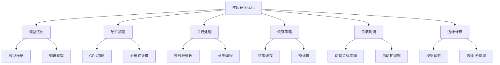
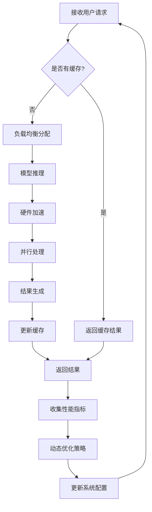

# 第12章：AI Agent 性能优化

## 12.1 响应速度优化

### 核心概念

响应速度优化是指通过各种技术和策略来减少AI Agent处理请求和生成响应所需的时间，从而提高系统的整体性能和用户体验。在AI Agent开发中，响应速度直接影响用户交互的流畅度和系统的实用性。优化响应速度涉及多个层面，包括模型优化、硬件加速、缓存策略、并行处理等方面。

### 问题背景

随着AI技术的广泛应用，用户对AI系统的响应速度期望越来越高。特别是在实时交互场景中，如对话系统、推荐系统等，快速响应对用户体验至关重要。然而，复杂的AI模型通常需要大量计算资源，这可能导致响应延迟。同时，随着用户数量的增加和请求复杂度的提高，系统的负载也在不断增加。因此，需要一种全面的优化策略来平衡模型性能和响应速度。

### 问题描述

1. 如何减少模型推理时间而不显著影响准确性
2. 如何有效利用硬件资源加速计算
3. 如何处理高并发请求以减少等待时间
4. 如何优化数据流以减少I/O瓶颈
5. 如何在边缘设备上实现快速响应
6. 如何平衡响应速度和系统资源消耗

### 问题解决

我们将从以下几个方面详细探讨响应速度优化的实现：

1. 模型优化：
    - 模型压缩（剪枝、量化）
    - 知识蒸馏
    - 模型缓存

2. 硬件加速：
    - GPU/TPU加速
    - FPGA定制化加速
    - 分布式计算

3. 并行处理：
    - 多线程处理
    - 异步编程
    - 流水线处理

4. 缓存策略：
    - 结果缓存
    - 预计算
    - 分布式缓存

5. 负载均衡：
    - 动态负载均衡
    - 服务发现
    - 自动扩缩容

6. 边缘计算：
    - 模型裁剪for边缘设备
    - 边缘-云协同计算
    - 本地优先处理

### 边界与外延

虽然本节主要关注AI Agent的响应速度优化，但这些技术和方法也可以应用于其他高性能计算场景，如大数据处理、实时流处理等。此外，我们还将探讨如何在保持响应速度的同时确保系统的可靠性和安全性，以及如何在不同的部署环境（云、边缘、移动设备）中实现一致的性能优化。

### 概念结构与核心要素组成



### 概念之间的关系

| 组件 | 主要功能 | 输入 | 输出 | 与其他组件的关系 |
|------|---------|------|------|------------------|
| 模型优化 | 减少计算复杂度 | 原始模型 | 优化后的模型 | 为硬件加速提供基础 |
| 硬件加速 | 提高计算速度 | 模型计算任务 | 加速后的结果 | 与并行处理协同工作 |
| 并行处理 | 同时处理多任务 | 并行任务 | 并行处理结果 | 增强硬件加速效果 |
| 缓存策略 | 减少重复计算 | 请求数据 | 缓存结果 | 与负载均衡配合使用 |
| 负载均衡 | 分配计算资源 | 请求流 | 均衡后的任务分配 | 优化整体系统性能 |
| 边缘计算 | 本地化处理 | 边缘设备请求 | 本地处理结果 | 减轻中心服务器负担 |

### 算法流程图

AI Agent响应速度优化的基本流程：



### 算法源代码

以下是一个简化的AI Agent响应速度优化系统示例：

```python
import time
import threading
from concurrent.futures import ThreadPoolExecutor
from functools import lru_cache

class OptimizedAIAgent:
    def __init__(self, model, cache_size=100, max_workers=4):
        self.model = model
        self.cache = lru_cache(maxsize=cache_size)(self.model_inference)
        self.executor = ThreadPoolExecutor(max_workers=max_workers)
        self.lock = threading.Lock()
        self.request_count = 0
        self.total_response_time = 0

    def model_inference(self, input_data):
        # 模拟模型推理过程
        time.sleep(0.1)  # 假设模型推理需要0.1秒
        return f"Result for {input_data}"

    @lru_cache(maxsize=100)
    def cached_inference(self, input_data):
        return self.model_inference(input_data)

    def process_request(self, input_data):
        start_time = time.time()
        result = self.cached_inference(input_data)
        end_time = time.time()
        
        with self.lock:
            self.request_count += 1
            self.total_response_time += (end_time - start_time)
        
        return result

    def async_process_request(self, input_data):
        return self.executor.submit(self.process_request, input_data)

    def get_average_response_time(self):
        with self.lock:
            if self.request_count == 0:
                return 0
            return self.total_response_time / self.request_count

def simulate_requests(agent, num_requests):
    futures = []
    for i in range(num_requests):
        future = agent.async_process_request(f"