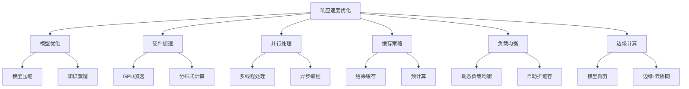
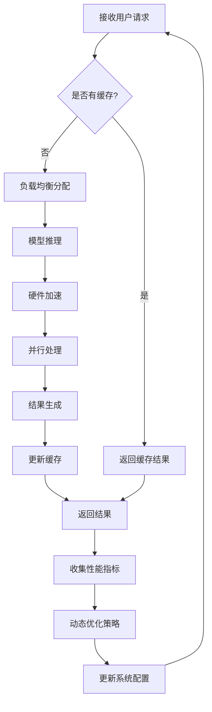
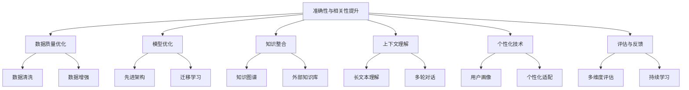
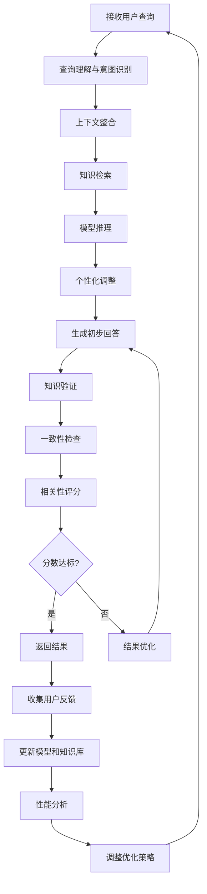
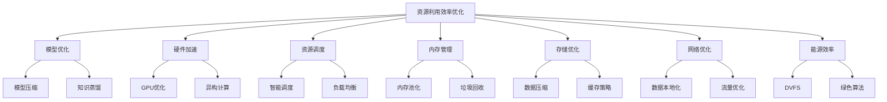
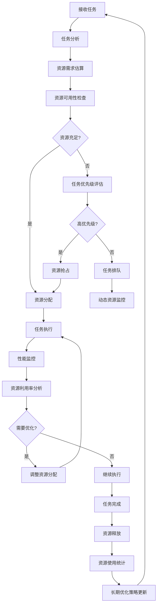
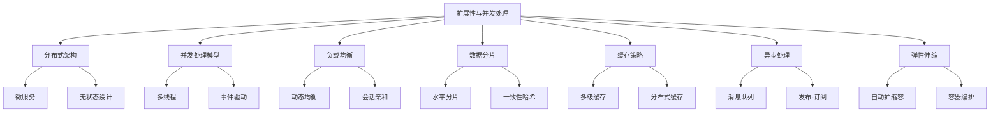
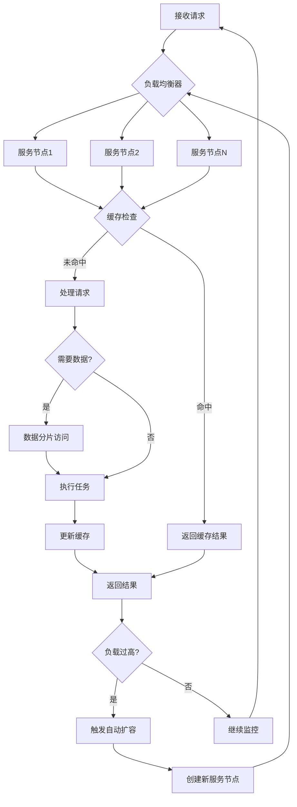

# 第12章：AI Agent 性能优化

## 12.1 响应速度优化

### 核心概念

响应速度优化是指通过各种技术和策略来减少AI Agent处理请求和生成响应所需的时间，从而提高系统的整体性能和用户体验。在AI Agent开发中，响应速度直接影响用户交互的流畅度和系统的实用性。优化响应速度涉及多个层面，包括模型优化、硬件加速、缓存策略、并行处理等方面。

### 问题背景

随着AI技术的广泛应用，用户对AI系统的响应速度期望越来越高。特别是在实时交互场景中，如对话系统、推荐系统等，快速响应对用户体验至关重要。然而，复杂的AI模型通常需要大量计算资源，这可能导致响应延迟。同时，随着用户数量的增加和请求复杂度的提高，系统的负载也在不断增加。因此，需要一种全面的优化策略来平衡模型性能和响应速度。

### 问题描述

1. 如何减少模型推理时间而不显著影响准确性
2. 如何有效利用硬件资源加速计算
3. 如何处理高并发请求以减少等待时间
4. 如何优化数据流以减少I/O瓶颈
5. 如何在边缘设备上实现快速响应
6. 如何平衡响应速度和系统资源消耗

### 问题解决

我们将从以下几个方面详细探讨响应速度优化的实现：

1. 模型优化：
    - 模型压缩（剪枝、量化）
    - 知识蒸馏
    - 模型缓存

2. 硬件加速：
    - GPU/TPU加速
    - FPGA定制化加速
    - 分布式计算

3. 并行处理：
    - 多线程处理
    - 异步编程
    - 流水线处理

4. 缓存策略：
    - 结果缓存
    - 预计算
    - 分布式缓存

5. 负载均衡：
    - 动态负载均衡
    - 服务发现
    - 自动扩缩容

6. 边缘计算：
    - 模型裁剪for边缘设备
    - 边缘-云协同计算
    - 本地优先处理

### 边界与外延

虽然本节主要关注AI Agent的响应速度优化，但这些技术和方法也可以应用于其他高性能计算场景，如大数据处理、实时流处理等。此外，我们还将探讨如何在保持响应速度的同时确保系统的可靠性和安全性，以及如何在不同的部署环境（云、边缘、移动设备）中实现一致的性能优化。

### 概念结构与核心要素组成



### 概念之间的关系

| 组件 | 主要功能 | 输入 | 输出 | 与其他组件的关系 |
|------|---------|------|------|------------------|
| 模型优化 | 减少计算复杂度 | 原始模型 | 优化后的模型 | 为硬件加速提供基础 |
| 硬件加速 | 提高计算速度 | 模型计算任务 | 加速后的结果 | 与并行处理协同工作 |
| 并行处理 | 同时处理多任务 | 并行任务 | 并行处理结果 | 增强硬件加速效果 |
| 缓存策略 | 减少重复计算 | 请求数据 | 缓存结果 | 与负载均衡配合使用 |
| 负载均衡 | 分配计算资源 | 请求流 | 均衡后的任务分配 | 优化整体系统性能 |
| 边缘计算 | 本地化处理 | 边缘设备请求 | 本地处理结果 | 减轻中心服务器负担 |

### 算法流程图

AI Agent响应速度优化的基本流程：



### 算法源代码

以下是一个简化的AI Agent响应速度优化系统示例：

```python
import time
import threading
from concurrent.futures import ThreadPoolExecutor
from functools import lru_cache

class OptimizedAIAgent:
    def __init__(self, model, cache_size=100, max_workers=4):
        self.model = model
        self.cache = lru_cache(maxsize=cache_size)(self.model_inference)
        self.executor = ThreadPoolExecutor(max_workers=max_workers)
        self.lock = threading.Lock()
        self.request_count = 0
        self.total_response_time = 0

    def model_inference(self, input_data):
        # 模拟模型推理过程
        time.sleep(0.1)  # 假设模型推理需要0.1秒
        return f"Result for {input_data}"

    @lru_cache(maxsize=100)
    def cached_inference(self, input_data):
        return self.model_inference(input_data)

    def process_request(self, input_data):
        start_time = time.time()
        result = self.cached_inference(input_data)
        end_time = time.time()
        
        with self.lock:
            self.request_count += 1
            self.total_response_time += (end_time - start_time)
        
        return result

    def async_process_request(self, input_data):
        return self.executor.submit(self.process_request, input_data)

    def get_average_response_time(self):
        with self.lock:
            if self.request_count == 0:
                return 0
            return self.total_response_time / self.request_count

def simulate_requests(agent, num_requests):
    futures = []
    for i in range(num_requests):
        future = agent.async_process_request(f"Input {i}")
        futures.append(future)
    
    for future in futures:
        result = future.result()
        print(f"Received result: {result}")

# 使用示例
agent = OptimizedAIAgent(model=None)  # 这里我们没有实际的模型，使用模拟的推理过程

print("Starting simulation...")
simulate_requests(agent, 50)
print(f"Average response time: {agent.get_average_response_time():.4f} seconds")

# 模拟负载增加
print("\nSimulating increased load...")
simulate_requests(agent, 100)
print(f"Average response time after increased load: {agent.get_average_response_time():.4f} seconds")
```

### 实际场景应用

1. 对话系统优化：
   - 实现上下文缓存减少重复计算
   - 使用模型量化加速推理
   - 实现流式响应提高用户体验

2. 推荐系统加速：
   - 预计算用户兴趣向量
   - 使用近似最近邻搜索加速推荐
   - 实现实时特征更新

3. 图像处理优化：
   - 使用GPU加速图像预处理
   - 实现渐进式图像加载
   - 边缘设备上的轻量级模型部署

4. 自然语言处理加速：
   - 实现动态批处理
   - 使用注意力机制缓存
   - 模型蒸馏for特定任务

5. 金融风控系统优化：
   - 实现多级缓存策略
   - 使用FPGA加速特定算法
   - 实时风险评分的并行计算

### 最佳实践 tips

1. 性能分析和瓶颈识别：
   - 使用性能分析工具定位瓶颈
   - 建立关键性能指标（KPI）监控
   - 定期进行性能审计

2. 渐进式优化：
   - 从最显著的瓶颈开始优化
   - 实施A/B测试评估优化效果
   - 持续监控和迭代优化策略

3. 缓存策略优化：
   - 实现多级缓存（内存、磁盘、分布式）
   - 使用智能缓存失效策略
   - 考虑预热缓存减少冷启动问题

4. 分布式系统设计：
   - 实现微服务架构增加灵活性
   - 使用消息队列解耦组件
   - 实现服务网格for更好的流量管理

5. 硬件资源优化：
   - 选择适合任务的硬件（CPU/GPU/TPU）
   - 优化内存使用和管理
   - 考虑使用专用硬件加速器

6. 算法优化：
   - 选择高效的数据结构和算法
   - 实现近似算法for非关键计算
   - 考虑增量计算减少冗余

7. 用户体验优化：
   - 实现异步加载和渐进式渲染
   - 提供及时的用户反馈（如加载指示器）
   - 优先处理关键路径请求

### 行业发展与未来趋势

| 时期 | 主要特征 | 关键技术 | 挑战 | 未来展望 |
|------|---------|----------|------|----------|
| 2018-2019 | 模型压缩 | 剪枝、量化 | 精度损失 | 更高效的模型架构 |
| 2020-2021 | 硬件加速 | GPU/TPU优化 | 硬件成本 | 专用AI芯片普及 |
| 2022-2023 | 分布式优化 | 联邦学习、边缘计算 | 系统复杂性 | 云边端协同计算 |
| 2024-2025 (预测) | 自适应优化 | 神经架构搜索、AutoML | 动态环境适应 | 自优化AI系统 |
| 2026+ (展望) | 量子加速 | 量子机器学习 | 量子系统稳定性 | 超高速AI处理 |

响应速度优化技术正在经历快速的演变。从早期的简单模型压缩到现在的复杂分布式系统和专用硬件加速，我们看到了显著的进步。这些变化不仅提高了AI系统的性能，还改变了我们设计和部署AI应用的方式。

未来的响应速度优化可能会更加注重以下几个方面：

1. 自适应优化：
   - 根据实时负载动态调整模型复杂度
   - 自动选择最佳的硬件加速策略
   - 智能调度算法适应不同的计算环境

2. 端到端优化：
   - 从数据采集到结果呈现的全流程优化
   - 跨层次优化（硬件、系统、算法、应用）
   - 优化目标的多样化（速度、能耗、成本）

3. 个性化优化：
   - 根据用户设备和网络条件定制优化策略
   - 学习用户行为模式预测和预加载
   - 动态平衡本地处理和云端处理

4. 协同优化：
   - 多Agent系统的协同响应优化
   - 跨设备、跨平台的资源共享和任务分配
   - 群体智能优化策略

5. 量子计算加速：
   - 利用量子算法加速特定AI任务
   - 开发量子-经典混合系统
   - 探索量子机器学习的新范式

6. 神经形态计算：
   - 开发模拟人脑的高效处理架构
   - 实现超低功耗的实时响应系统
   - 探索新型学习算法和计算模型

7. 可解释性和安全性的平衡：
   - 在保证响应速度的同时提高模型可解释性
   - 开发高效的隐私保护计算方法
   - 实现实时的安全监控和防御机制

随着这些趋势的发展，AI Agent的响应速度优化将从单纯的性能提升演变为一个多目标、多约束的复杂优化问题。未来的系统将能够更智能地平衡速度、准确性、能耗、成本等多个因素，提供更加个性化和适应性强的用户体验。

这种进步将带来多方面的益处：

1. 提升用户体验：实现近乎实时的AI响应。

2. 扩大应用范围：使AI能够应用于更多对延迟敏感的场景。

3. 降低运营成本：通过更高效的资源利用减少基础设施开支。

4. 促进创新：支持更复杂、更智能的AI应用开发。

5. 提高可访问性：使高性能AI服务可在各种设备上使用。

6. 增强系统可靠性：通过分布式和冗余设计提高系统稳定性。

7. 推动技术进步：刺激新型硬件和算法的研发。

然而，这种发展也带来了新的挑战，如如何在复杂的分布式环境中保证一致性，如何平衡性能优化和系统可维护性，以及如何应对日益增长的能源消耗和环境影响。未来的优化策略需要在技术创新和可持续发展之间找到平衡，确保AI系统不仅快速高效，还能够负责任地使用资源。

总的来说，响应速度优化将继续是AI Agent开发中的一个核心主题。通过不断创新和优化，我们将能够构建更快速、更智能、更高效的AI系统，为用户提供更好的服务，并推动整个行业向更加先进和可持续的方向发展。这不仅将改变我们与AI交互的方式，还将为解决更复杂的实际问题提供新的可能性。

## 12.2 准确性与相关性提升

### 核心概念

准确性与相关性提升是指通过各种技术和策略来提高AI Agent的输出质量，使其更准确地回答问题、更相关地满足用户需求。这个过程涉及模型训练、知识整合、上下文理解、个性化等多个方面。高准确性和相关性直接影响用户对AI系统的信任和满意度，是AI Agent性能优化的关键目标之一。

### 问题背景

随着AI技术的广泛应用，用户对AI系统的期望不断提高。他们不仅要求快速的响应，还期望得到准确、相关、有洞察力的回答。然而，实现高准确性和相关性面临多重挑战：数据质量和数量的限制、模型泛化能力的不足、复杂查询的理解困难、个性化需求的多样性等。同时，在某些领域（如医疗、金融、法律），准确性直接关系到系统的可用性和合规性。因此，需要一种全面的优化策略来不断提升AI Agent的输出质量。

### 问题描述

1. 如何提高模型的泛化能力，使其能够准确处理未见过的情况
2. 如何整合多源知识，提供更全面、准确的回答
3. 如何准确理解用户意图，特别是在复杂或模糊查询情况下
4. 如何平衡准确性和创造性，特别是在生成任务中
5. 如何实现个性化的相关性优化，满足不同用户的需求
6. 如何在保持高准确性的同时，确保系统的实时性能

### 问题解决

我们将从以下几个方面详细探讨准确性与相关性提升的实现：

1. 数据质量优化：
   - 数据清洗和预处理
   - 数据增强技术
   - 主动学习for高质量数据采集

2. 模型优化：
   - 先进架构（如Transformer、GPT）
   - 迁移学习和微调
   - 集成学习方法

3. 知识整合：
   - 知识图谱集成
   - 外部知识库查询
   - 多模态信息融合

4. 上下文理解：
   - 长文本理解技术
   - 多轮对话管理
   - 意图识别和实体提取

5. 个性化技术：
   - 用户画像构建
   - 个性化模型适配
   - 上下文感知推荐

6. 评估与反馈：
   - 多维度评估指标
   - 人机协作评估
   - 持续学习和模型更新

### 边界与外延

虽然本节主要关注AI Agent的准确性与相关性提升，但这些技术和方法也可以应用于其他AI应用场景，如搜索引擎、推荐系统、自动驾驶等。此外，我们还将探讨如何在提高准确性和相关性的同时，保持系统的可解释性、公平性和隐私保护，以及如何应对不同领域和文化背景下的准确性和相关性挑战。

### 概念结构与核心要素组成



### 概念之间的关系

| 组件 | 主要功能 | 输入 | 输出 | 与其他组件的关系 |
|------|---------|------|------|------------------|
| 数据质量优化 | 提高训练数据质量 | 原始数据 | 高质量数据集 | 为模型优化提供基础 |
| 模型优化 | 提升模型性能 | 训练数据、模型架构 | 优化后的模型 | 与知识整合协同工作 |
| 知识整合 | 扩展知识范围 | 外部知识源 | 增强的知识库 | 补充模型的知识缺口 |
| 上下文理解 | 提高语境理解能力 | 用户输入、对话历史 | 上下文表示 | 为个性化技术提供输入 |
| 个性化技术 | 定制用户体验 | 用户数据、上下文 | 个性化响应 | 利用其他组件的输出 |
| 评估与反馈 | 持续改进系统 | 系统输出、用户反馈 | 性能指标、更新策略 | 影响所有其他组件的优化 |

### 算法流程图

AI Agent准确性与相关性提升的基本流程：



### 算法源代码

以下是一个简化的AI Agent准确性与相关性提升系统示例：

```python
import random
from typing import Dict, List, Any

class EnhancedAIAgent:
    def __init__(self):
        self.knowledge_base = {
            "AI": "Artificial Intelligence is the simulation of human intelligence in machines.",
            "ML": "Machine Learning is a subset of AI that enables systems to learn and improve from experience.",
            "NLP": "Natural Language Processing is a branch of AI that helps computers understand, interpret and manipulate human language."
        }
        self.user_profiles = {}
        self.context_history = {}

    def preprocess_query(self, query: str) -> str:
        # 简化的查询预处理
        return query.lower().strip()

    def get_intent(self, query: str) -> str:
        # 简化的意图识别
        if "what" in query:
            return "definition"
        elif "how" in query:
            return "explanation"
        else:
            return "general"

    def retrieve_knowledge(self, query: str) -> str:
        # 简化的知识检索
        for key, value in self.knowledge_base.items():
            if key.lower() in query:
                return value
        return "I don't have specific information about that."

    def personalize_response(self, user_id: str, response: str) -> str:
        # 简化的个性化调整
        if user_id not in self.user_profiles:
            self.user_profiles[user_id] = {"expertise": "beginner"}
        
        if self.user_profiles[user_id]["expertise"] == "beginner":
            return f"In simple terms, {response}"
        else:
            return response

    def check_relevance(self, query: str, response: str) -> float:
        # 简化的相关性评分
        query_words = set(query.lower().split())
        response_words = set(response.lower().split())
        common_words = query_words.intersection(response_words)
        return len(common_words) / len(query_words)

    def generate_response(self, user_id: str, query: str) -> str:
        preprocessed_query = self.preprocess_query(query)
        intent = self.get_intent(preprocessed_query)
        initial_response = self.retrieve_knowledge(preprocessed_query)
        personalized_response = self.personalize_response(user_id, initial_response)
        
        relevance_score = self.check_relevance(preprocessed_query, personalized_response)
        if relevance_score < 0.5:
            personalized_response += " Is there anything specific you'd like to know about this topic?"
        
        return personalized_response

    def update_from_feedback(self, query: str, response: str, feedback: bool):
        # 简化的反馈更新机制
        if feedback:
            print(f"Positive feedback received for query: {query}")
            # 这里可以添加更新知识库或模型的逻辑
        else:
            print(f"Negative feedback received for query: {query}")
            # 这里可以添加改进响应的逻辑

# 使用示例
agent = EnhancedAIAgent()

queries = [
    "What is AI?",
    "How does ML work?",
    "Tell me about NLP",
    "What is quantum computing?"
]

for i, query in enumerate(queries):
    user_id = f"user_{i}"
    response = agent.generate_response(user_id, query)
    print(f"Query: {query}")
    print(f"Response: {response}")
    
    # 模拟用户反馈
    feedback = random.choice([True, False])
    agent.update_from_feedback(query, response, feedback)
    print(f"Feedback: {'Positive' if feedback else 'Negative'}")
    print("---")
```

### 实际场景应用

1. 智能客服优化：
   - 实现多轮对话理解提高准确性
   - 集成产品知识库提升回答相关性
   - 个性化响应基于客户历史

2. 医疗诊断辅助：
   - 整合最新医学研究提高诊断准确性
   - 考虑患者个人病史提供相关建议
   - 实时更新医疗指南确保信息时效性

3. 法律咨询系统：
   - 准确理解法律术语和复杂查询
   - 整合判例法和最新法规
   - 根据用户所在地区提供相关法律解释

4. 教育辅导平台：
   - 根据学生水平调整解答深度
   - 提供个性化学习路径建议
   - 实时评估学生理解程度调整教学策略

5. 金融投资顾问：
   - 准确分析市场数据提供投资建议
   - 考虑客户风险偏好个性化投资组合
   - 实时监控市场变化更新建议

### 最佳实践 tips

1. 持续学习机制：
   - 实施在线学习更新模型
   - 建立用户反馈循环
   - 定期重新训练模型适应新趋势

2. 多源知识融合：
   - 集成结构化和非结构化知识
   - 实现跨领域知识迁移
   - 建立动态知识图谱

3. 上下文感知增强：
   - 实现长期记忆机制
   - 考虑多模态上下文信息
   - 动态调整上下文窗口大小

4. 不确定性处理：
   - 提供置信度评分
   - 实现多样化答案生成
   - 在低置信度情况下寻求人工协助

5. 偏见检测与缓解：
   - 实施公平性评估指标
   - 使用去偏技术处理训练数据
   - 定期审核系统输出检测潜在偏见

6. 可解释性增强：
   - 提供答案来源和推理过程
   - 实现可视化解释技术
   - 支持交互式探索和澄清

7. 领域适应性：
   - 开发领域特定的微调策略
   - 建立领域专家反馈机制
   - 实现跨领域知识迁移

### 行业发展与未来趋势

| 时期 | 主要特征 | 关键技术 | 挑战 | 未来展望 |
|------|---------|----------|------|----------|
| 2018-2019 | 基础模型优化 | BERT、GPT | 领域适应 | 更大规模预训练 |
| 2020-2021 | 知识增强 | 知识图谱集成 | 知识一致性 | 动态知识更新 |
| 2022-2023 | 多模态融合 | 跨模态预训练 | 模态对齐 | 统一多模态理解 |
| 2024-2025 (预测) | 认知智能 | 神经符号推理 | 常识推理 | 类人思维模拟 |
| 2026+ (展望) | 自主学习 | 元学习、终身学习 | 概念漂移 | 自适应智能系统 |

准确性与相关性提升技术正在经历快速的演变。从早期的基于规则的系统到现在的大规模预训练模型和知识增强AI，我们看到了显著的进步。这些变化不仅提高了AI系统的性能，还改变了我们设计和应用AI的方式。

未来的准确性与相关性提升可能会更加注重以下几个方面：

1. 自主知识获取：
   - AI系统能够自主学习新知识
   - 实时更新知识库以适应变化
   - 主动识别和填补知识空白

2. 深度语境理解：
   - 理解复杂的隐含意义和情感色彩
   - 考虑文化、社会背景的影响
   - 模拟人类的推理和判断过程

3. 个性化认知模型：
   - 为每个用户构建独特的认知模型
   - 预测用户的思维模式和需求
   - 提供高度个性化的交互体验

4. 多智能体协作：
   - 多个专业AI协同工作
   - 集成不同领域的专业知识
   - 实现复杂问题的分解和协作解决

5. 伦理和价值观对齐：
   - 将伦理考量纳入决策过程
   - 适应不同文化的价值观
   - 平衡准确性和道德责任

6. 元认知能力：
   - AI系统能够评估自身的知识限制
   - 主动寻求澄清和额外信息
   - 反思和改进自身的决策过程

7. 跨语言和跨文化理解：
   - 无缝处理多语言交互
   - 理解和适应不同文化的表达方式
   - 提供文化敏感的回应

随着这些趋势的发展，AI Agent的准确性与相关性提升将从单纯的信息检索和模式匹配演变为更接近人类认知的智能系统。未来的系统将能够更深入地理解用户需求，提供更有洞察力和创造性的回答，同时保持高度的准确性和相关性。

这种进步将带来多方面的益处：

1. 提升用户体验：提供更精准、更有价值的信息和服务。

2. 扩大应用范围：使AI能够胜任更复杂、更专业的任务。

3. 促进知识传播：更有效地分享和应用专业知识。

4. 支持决策制定：为复杂决策提供更可靠的支持。

5. 推动创新：通过深度理解和创造性组合促进新想法的产生。

6. 增强教育效果：提供更个性化、更有效的学习体验。

7. 改善跨文化交流：促进不同背景人群之间的理解和沟通。

然而，这种发展也带来了新的挑战，如如何确保AI系统的公平性和包容性，如何处理潜在的知识偏见，以及如何在提高准确性的同时保持系统的可解释性和透明度。未来的优化策略需要在技术进步和伦理考量之间找到平衡，确保AI系统不仅准确高效，还能负责任地服务于人类需求。

总的来说，准确性与相关性提升将继续是AI Agent开发中的一个核心主题。通过不断创新和优化，我们将能够构建更智能、更可靠、更有洞察力的AI系统，为用户提供更高质量的服务，并推动整个行业向更加先进和负责任的方向发展。这不仅将改变我们获取和处理信息的方式，还将为解决复杂的社会和科学问题提供强大的工具。

## 12.3 资源利用效率优化

### 核心概念

资源利用效率优化是指通过各种技术和策略来提高AI Agent系统对计算资源（如CPU、内存、存储、网络带宽等）的使用效率，以实现更高的性能、更低的成本和更好的可扩展性。这个过程涉及硬件选择、软件优化、资源调度、负载均衡等多个方面。高效的资源利用不仅可以提升系统性能，还能降低运营成本，减少能源消耗，对于大规模AI系统的部署和运维至关重要。

### 问题背景

随着AI技术的快速发展和广泛应用，AI系统的规模和复杂性不断增加，对计算资源的需求也在急剧上升。然而，计算资源往往是昂贵和有限的，特别是在处理大规模数据和复杂模型时。同时，能源消耗和环境影响也成为越来越重要的考虑因素。此外，在云计算和边缘计算环境中，资源的动态性和异构性进一步增加了资源管理的难度。因此，如何高效利用现有资源，平衡性能、成本和可持续性，成为AI系统优化的关键挑战。

### 问题描述

1. 如何优化AI模型以减少计算资源需求
2. 如何有效分配和调度异构计算资源
3. 如何平衡实时性能和资源利用率
4. 如何在分布式环境中协调资源使用
5. 如何实现动态资源分配以应对负载变化
6. 如何优化能源效率，减少碳足迹

### 问题解决

我们将从以下几个方面详细探讨资源利用效率优化的实现：

1. 模型优化：
   - 模型压缩（剪枝、量化）
   - 知识蒸馏
   - 模型分割和并行

2. 硬件加速：
   - GPU/TPU优化
   - FPGA定制化加速
   - 异构计算

3. 资源调度：
   - 智能任务调度
   - 负载均衡
   - 资源预留和超售

4. 内存管理：
   - 内存池化
   - 垃圾回收优化
   - 内存压缩技术

5. 存储优化：
   - 数据压缩和编码
   - 缓存策略
   - 分层存储管理

6. 网络优化：
   - 数据本地化
   - 网络流量优化
   - 协议优化

7. 能源效率：
   - 动态电压和频率调节（DVFS）
   - 绿色算法设计
   - 能源感知调度

### 边界与外延

虽然本节主要关注AI Agent的资源利用效率优化，但这些技术和方法也可以应用于其他高性能计算场景，如大数据处理、科学计算等。此外，我们还将探讨如何将资源利用效率优化与其他系统目标（如可靠性、安全性、可维护性）进行平衡，以及如何在不同的部署环境（云、边缘、移动设备）中实现一致的优化策略。

### 概念结构与核心要素组成



### 概念之间的关系

| 组件 | 主要功能 | 输入 | 输出 | 与其他组件的关系 |
|------|---------|------|------|------------------|
| 模型优化 | 减少模型复杂度 | 原始模型 | 优化后的模型 | 影响硬件加速效果 |
| 硬件加速 | 提高计算速度 | 计算任务 | 加速后的结果 | 与资源调度协同工作 |
| 资源调度 | 分配计算资源 | 任务队列 | 执行计划 | 影响所有其他组件的效率 |
| 内存管理 | 优化内存使用 | 内存请求 | 内存分配 | 与存储优化相互补充 |
| 存储优化 | 提高数据访问效率 | 数据访问模式 | 优化的存储策略 | 影响网络优化策略 |
| 网络优化 | 减少网络开销 | 网络流量 | 优化的通信模式 | 与资源调度协同工作 |
| 能源效率 | 降低能源消耗 | 系统负载 | 能源策略 | 影响所有组件的运行模式 |

### 算法流程图

AI Agent资源利用效率优化的基本流程：



### 算法源代码

以下是一个简化的AI Agent资源利用效率优化系统示例：

```python
import time
import random
from typing import Dict, List, Any

class Resource:
    def __init__(self, capacity: int):
        self.capacity = capacity
        self.used = 0

    def allocate(self, amount: int) -> bool:
        if self.used + amount <= self.capacity:
            self.used += amount
            return True
        return False

    def release(self, amount: int):
        self.used = max(0, self.used - amount)

class Task:
    def __init__(self, id: int, resource_demand: int, priority: int):
        self.id = id
        self.resource_demand = resource_demand
        self.priority = priority
        self.start_time = None
        self.end_time = None

class ResourceManager:
    def __init__(self, cpu_capacity: int, memory_capacity: int):
        self.cpu = Resource(cpu_capacity)
        self.memory = Resource(memory_capacity)
        self.tasks: List[Task] = []
        self.completed_tasks: List[Task] = []

    def submit_task(self, task: Task):
        self.tasks.append(task)

    def execute_tasks(self):
        self.tasks.sort(key=lambda x: x.priority, reverse=True)
        for task in self.tasks:
            if self.cpu.allocate(task.resource_demand) and self.memory.allocate(task.resource_demand):
                task.start_time = time.time()
                print(f"Executing task {task.id} with priority {task.priority}")
                # Simulate task execution
                time.sleep(random.uniform(0.1, 0.5))
                task.end_time = time.time()
                self.cpu.release(task.resource_demand)
                self.memory.release(task.resource_demand)
                self.completed_tasks.append(task)
            else:
                print(f"Not enough resources for task {task.id}")
        self.tasks = [task for task in self.tasks if task not in self.completed_tasks]

    def optimize_resources(self):
        cpu_utilization = self.cpu.used / self.cpu.capacity
        memory_utilization = self.memory.used / self.memory.capacity
        print(f"CPU utilization: {cpu_utilization:.2f}")
        print(f"Memory utilization: {memory_utilization:.2f}")
        
        if cpu_utilization < 0.5 and memory_utilization < 0.5:
            print("Low resource utilization. Consider reducing capacity or increasing workload.")
        elif cpu_utilization > 0.9 or memory_utilization > 0.9:
            print("High resource utilization. Consider increasing capacity or optimizing tasks.")

    def generate_report(self):
        total_execution_time = sum(task.end_time - task.start_time for task in self.completed_tasks)
        avg_execution_time = total_execution_time / len(self.completed_tasks) if self.completed_tasks else 0
        print(f"Average task execution time: {avg_execution_time:.4f} seconds")
        print(f"Total tasks completed: {len(self.completed_tasks)}")
        print(f"Tasks remaining in queue: {len(self.tasks)}")

# 使用示例
manager = ResourceManager(cpu_capacity=100, memory_capacity=100)

# 生成随机任务
for i in range(20):
    task = Task(id=i, resource_demand=random.randint(10, 30), priority=random.randint(1, 5))
    manager.submit_task(task)

# 执行任务并优化资源
for _ in range(5):
    manager.execute_tasks()
    manager.optimize_resources()

manager.generate_report()
```

### 实际场景应用

1. 云服务资源管理：
   - 动态虚拟机分配
   - 容器编排优化
   - 多租户资源隔离

2. 边缘计算优化：
   - 任务卸载决策
   - 边缘节点资源调度
   - 能耗感知计算

3. 大规模机器学习训练：
   - 分布式训练资源分配
   - GPU集群管理
   - 模型并行和数据并行优化

4. 实时流处理系统：
   - 动态流量负载均衡
   - 弹性计算资源分配
   - 内存数据库优化

5. 移动设备AI应用：
   - 电池感知计算
   - 轻量级模型部署
   - 动态特征选择

### 最佳实践 tips

1. 全面监控和分析：
   - 实施细粒度的资源使用监控
   - 使用高级分析工具识别瓶颈
   - 建立资源使用基准和趋势分析

2. 自适应资源管理：
   - 实现动态资源分配算法
   - 使用机器学习预测资源需求
   - 实施自动扩缩容机制

3. 多层次优化：
   - 从硬件到应用层的全栈优化
   - 考虑跨层优化机会
   - 平衡短期和长期优化策略

4. 智能缓存策略：
   - 实现多级缓存架构
   - 使用预测性缓存算法
   - 优化缓存一致性协议

5. 高效通信模式：
   - 实现数据本地化处理
   - 优化分布式系统的通信模式
   - 使用高效的序列化和压缩技术

6. 能源感知计算：
   - 实施动态功率管理
   - 优化数据中心制冷策略
   - 考虑使用可再生能源

7. 持续优化和反馈：
   - 建立持续性能评估机制
   - 实施A/B测试评估优化效果
   - 建立资源优化的最佳实践知识库

### 行业发展与未来趋势

| 时期 | 主要特征 | 关键技术 | 挑战 | 未来展望 |
|------|---------|----------|------|----------|
| 2018-2019 | 基础优化 | 虚拟化、容器化 | 资源碎片 | 更智能的调度 |
| 2020-2021 | 智能调度 | AI驱动的资源管理 | 复杂环境适应 | 自优化系统 |
| 2022-2023 | 边缘-云协同 | 分布式优化、联邦学习 | 异构资源管理 | 无缝边缘-云计算 |
| 2024-2025 (预测) | 量子加速 | 量子-经典混合计算 | 量子资源管理 | 量子优势应用 |
| 2026+ (展望) | 生物启发计算 | 神经形态硬件、DNA存储 | 新型架构适应 | 超高效能计算 |

资源利用效率优化技术正在经历快速的演变。从早期的静态资源分配到现在的AI驱动的动态优化，我们看到了显著的进步。这些变化不仅提高了系统性能和效率，还改变了我们设计和运营大规模AI系统的方式。

未来的资源利用效率优化可能会更加注重以下几个方面：

1. 自主优化系统：
   - AI系统能够自主分析和优化自身资源使用
   - 实时适应工作负载和环境变化
   - 预测性维护和自我修复能力

2. 跨域资源协同：
   - 实现云、边缘、终端设备的无缝资源共享
   - 动态任务迁移和负载均衡
   - 全局最优的资源分配策略

3. 新型计算范式：
   - 量子计算资源的高效利用
   - 神经形态计算的能效优化
   - 生物计算的可扩展性探索

4. 极致能效：
   - 接近理论极限的能源效率
   - 碳中和数据中心设计
   - 能源收集和存储技术的集成

5. 智能硬件-软件协同：
   - 硬件感知的软件优化
   - 软件定义的硬件配置
   - 动态重构的计算架构

6. 认知资源管理：
   - 理解和预测用户意图的资源预分配
   - 上下文感知的资源动态调整
   - 基于任务重要性的智能资源分配

7. 可持续性导向优化：
   - 将环境影响作为优化目标之一
   - 生命周期资源效率评估
   - 循环经济理念在IT资源管理中的应用

随着这些趋势的发展，AI Agent的资源利用效率优化将从单纯的技术问题演变为一个多目标、多约束的复杂系统工程问题。未来的系统将能够更智能地平衡性能、成本、能耗和环境影响，提供更可持续和负责任的AI服务。

这种进步将带来多方面的益处：

1. 提高系统性能：实现更快、更可靠的AI服务。

2. 降低运营成本：通过高效资源利用减少基础设施开支。

3. 增强可扩展性：支持更大规模的AI应用部署。

4. 改善用户体验：通过高效资源管理提供更流畅的服务。

5. 促进创新：为资源密集型AI应用提供可能性。

6. 提高可持续性：减少AI系统的能源消耗和碳足迹。

7. 优化投资回报：最大化硬件投资的价值。

然而，这种发展也带来了新的挑战，如如何在复杂的异构环境中实现全局最优，如何平衡短期性能和长期可持续性，以及如何处理日益增长的系统复杂性。未来的优化策略需要在技术创新、经济效益和环境责任之间找到平衡，确保AI系统不仅高效强大，还能够可持续发展。

总的来说，资源利用效率优化将继续是AI Agent开发和部署中的一个核心主题。通过不断创新和优化，我们将能够构建更高效、更智能、更可持续的AI系统，为用户提供更优质的服务，并推动整个行业向更加绿色和负责任的方向发展。这不仅将改变我们设计和运营AI系统的方式，还将为解决全球计算资源短缺和环境挑战提供新的可能性。

## 12.4 扩展性与并发处理

### 核心概念

扩展性与并发处理是指AI Agent系统能够有效地处理增长的工作负载和同时服务多个用户或任务的能力。扩展性包括垂直扩展（增加单个节点的资源）和水平扩展（增加节点数量）。并发处理涉及多线程、分布式计算、负载均衡等技术，以实现高效的并行任务执行。这些能力对于构建高性能、高可用性的AI系统至关重要，尤其是在面对大规模用户和复杂任务时。

### 问题背景

随着AI技术的普及，AI Agent系统面临着日益增长的用户需求和数据量。传统的单机或简单并行处理方法往往无法满足高并发、大规模数据处理的需求。同时，不同的AI任务（如推理、训练、数据预处理等）对计算资源的需求也各不相同。此外，在云计算和边缘计算环境中，系统需要能够动态适应负载变化和资源波动。因此，如何设计具有高扩展性和高效并发处理能力的AI Agent系统成为一个关键挑战。

### 问题描述

1. 如何设计可水平扩展的AI Agent架构
2. 如何有效管理和协调分布式AI任务
3. 如何实现高效的负载均衡以优化资源利用
4. 如何处理大规模并发请求而不影响系统性能
5. 如何在保证一致性的同时提高并发处理能力
6. 如何设计可动态伸缩的系统以应对负载波动

### 问题解决

我们将从以下几个方面详细探讨扩展性与并发处理的实现：

1. 分布式架构设计：
   - 微服务架构
   - 无状态设计
   - 服务网格

2. 并发处理模型：
   - 多线程和协程
   - 事件驱动架构
   - Actor模型

3. 负载均衡：
   - 动态负载均衡算法
   - 会话亲和性
   - 地理位置感知路由

4. 数据分片：
   - 水平分片
   - 垂直分片
   - 一致性哈希

5. 缓存策略：
   - 多级缓存
   - 分布式缓存
   - 缓存一致性协议

6. 异步处理：
   - 消息队列
   - 发布-订阅模式
   - 异步任务调度

7. 弹性伸缩：
   - 自动扩缩容
   - 预测性扩展
   - 容器编排

### 边界与外延

虽然本节主要关注AI Agent系统的扩展性与并发处理，但这些技术和方法也广泛应用于其他大规模分布式系统，如电子商务平台、社交网络、物联网等。此外，我们还将探讨如何在提高扩展性和并发能力的同时，保证系统的可靠性、一致性和安全性，以及如何在不同的部署环境（公有云、私有云、混合云）中实现一致的扩展策略。

### 概念结构与核心要素组成



### 概念之间的关系

| 组件 | 主要功能 | 输入 | 输出 | 与其他组件的关系 |
|------|---------|------|------|------------------|
| 分布式架构 | 系统整体结构设计 | 系统需求 | 架构蓝图 | 为其他所有组件提供基础 |
| 并发处理模型 | 并行任务执行 | 并发请求 | 处理结果 | 与负载均衡协同工作 |
| 负载均衡 | 请求分发 | 用户请求 | 均衡后的任务 | 影响数据分片和缓存策略 |
| 数据分片 | 数据分布管理 | 大规模数据 | 分片方案 | 与缓存策略密切相关 |
| 缓存策略 | 提高数据访问速度 | 频繁访问数据 | 缓存结果 | 影响系统整体性能 |
| 异步处理 | 非阻塞操作处理 | 长时间任务 | 异步结果 | 提高系统响应性 |
| 弹性伸缩 | 动态资源管理 | 负载指标 | 扩缩容决策 | 影响所有组件的资源分配 |

### 算法流程图

AI Agent系统扩展性与并发处理的基本流程：



### 算法源代码

以下是一个简化的AI Agent系统扩展性与并发处理示例：

```python
import threading
import queue
import time
import random
from typing import List, Dict, Any

class Task:
    def __init__(self, id: int, complexity: int):
        self.id = id
        self.complexity = complexity

class Worker(threading.Thread):
    def __init__(self, task_queue: queue.Queue, results: Dict[int, Any]):
        threading.Thread.__init__(self)
        self.task_queue = task_queue
        self.results = results

    def run(self):
        while True:
            task = self.task_queue.get()
            if task is None:
                break
            result = self.process_task(task)
            self.results[task.id] = result
            self.task_queue.task_done()

    def process_task(self, task: Task) -> str:
        # 模拟任务处理
        time.sleep(task.complexity * 0.1)
        return f"Result of task {task.id}"

class LoadBalancer:
    def __init__(self, workers: List[Worker]):
        self.workers = workers
        self.current_worker = 0

    def distribute_task(self, task: Task):
        worker = self.workers[self.current_worker]
        worker.task_queue.put(task)
        self.current_worker = (self.current_worker + 1) % len(self.workers)

class ScalableAISystem:
    def __init__(self, initial_workers: int = 5):
        self.task_queue = queue.Queue()
        self.results = {}
        self.workers = []
        self.load_balancer = LoadBalancer(self.workers)
        self.scale_up(initial_workers)

    def scale_up(self, count: int):
        for _ in range(count):
            worker = Worker(self.task_queue, self.results)
            worker.start()
            self.workers.append(worker)
        self.load_balancer = LoadBalancer(self.workers)
        print(f"Scaled up to {len(self.workers)} workers")

    def scale_down(self, count: int):
        for _ in range(min(count, len(self.workers))):
            self.task_queue.put(None)
        remaining_workers = max(1, len(self.workers) - count)
        self.workers = self.workers[:remaining_workers]
        self.load_balancer = LoadBalancer(self.workers)
        print(f"Scaled down to {len(self.workers)} workers")

    def submit_task(self, task: Task):
        self.load_balancer.distribute_task(task)

    def monitor_and_scale(self):
        while True:
            queue_size = self.task_queue.qsize()
            if queue_size > len(self.workers) * 10:
                self.scale_up(1)
            elif queue_size == 0 and len(self.workers) > 1:
                self.scale_down(1)
            time.sleep(1)

    def wait_for_results(self):
        self.task_queue.join()

# 使用示例
system = ScalableAISystem(initial_workers=3)

# 启动监控和自动扩缩容
monitor_thread = threading.Thread(target=system.monitor_and_scale)
monitor_thread.start()

# 模拟任务提交
for i in range(100):
    task = Task(id=i, complexity=random.randint(1, 5))
    system.submit_task(task)
    time.sleep(random.uniform(0.1, 0.3))

# 等待所有任务完成
system.wait_for_results()

print("All tasks completed")
print(f"Total results: {len(system.results)}")

# 停止监控线程
monitor_thread.join(timeout=1)

# 关闭所有worker
for _ in range(len(system.workers)):
    system.task_queue.put(None)
for worker in system.workers:
    worker.join()
```

### 实际场景应用

1. 大规模在线推理服务：
   - 动态扩展推理节点
   - 请求级别负载均衡
   - 模型分片和并行推理

2. 分布式机器学习训练：
   - 数据并行和模型并行
   - 参数服务器架构
   - 动态资源分配

3. 实时数据处理流水线：
   - 流处理框架集成
   - 动态任务分配
   - 弹性流控制

4. 多模态AI系统：
   - 异构计算资源管理
   - 任务优先级调度
   - 跨模态并行处理

5. 智能客服平台：
   - 会话级负载均衡
   - 知识库分布式访问
   - 实时响应与异步处理结合

### 最佳实践 tips

1. 设计可扩展的架构：
   - 采用微服务和无状态设计
   - 使用消息队列解耦组件
   - 实现服务发现和注册机制

2. 优化数据管理：
   - 实施有效的数据分片策略
   - 使用分布式缓存提高访问速度
   - 考虑数据局部性优化

3. 实现智能负载均衡：
   - 使用动态负载均衡算法
   - 考虑任务亲和性和资源亲和性
   - 实现请求路由和限流机制

4. 异步和并行处理：
   - 充分利用异步编程模型
   - 实现细粒度的任务并行
   - 使用工作池管理并发任务

5. 自动化运维：
   - 实现自动扩缩容机制
   - 使用容器化技术简化部署
   - 建立全面的监控和告警系统

6. 性能优化：
   - 进行系统级和应用级性能调优
   - 使用性能分析工具识别瓶颈
   - 实施缓存预热和智能缓存策略

7. 故障恢复和高可用：
   - 实现服务熔断和降级机制
   - 使用多可用区部署增强可靠性
   - 建立有效的备份和恢复策略

### 行业发展与未来趋势

| 时期 | 主要特征 | 关键技术 | 挑战 | 未来展望 |
|------|---------|----------|------|----------|
| 2018-2019 | 基础扩展 | 容器化、微服务 | 系统复杂性 | 更智能的编排 |
| 2020-2021 | 云原生AI | Kubernetes、服务网格 | 多云管理 | 无服务器AI |
| 2022-2023 | 边缘AI扩展 | 边缘计算、5G | 异构资源协调 | 边云协同AI |
| 2024-2025 (预测) | 自适应AI系统 | 自组织网络、强化学习 | 复杂环境适应 | 认知计算架构 |
| 2026+ (展望) | 量子增强AI | 量子-经典混合系统 | 量子纠错和稳定性 | 超大规模量子AI |

扩展性与并发处理技术正在经历快速的演变。从早期的简单横向扩展到现在的智能化、自适应系统，我们看到了显著的进步。这些变化不仅提高了AI系统的性能和可扩展性，还改变了我们设计和部署大规模AI应用的方式。

未来的扩展性与并发处理可能会更加注重以下几个方面：

1. 自适应架构：
   - 系统能够根据负载和资源动态调整其结构
   - 智能预测和预防性扩展
   - 自我修复和自我优化能力

2. 边缘-云协同计算：
   - 无缝集成边缘设备和云资源
   - 动态任务分配和迁移
   - 考虑网络条件和延迟的智能决策

3. 超大规模分布式AI：
   - 跨数据中心的全球化AI系统
   - 极致的并行处理能力
   - 高效的全球数据同步机制

4. 量子计算集成：
   - 量子-经典混合AI系统
   - 量子并行处理for特定AI任务
   - 量子安全的分布式AI

5. 认知计算架构：
   - 模仿人脑的分布式处理模型
   - 自适应学习和任务分配
   - 高效的能源利用和热管理

6. 多样化硬件协同：
   - 异构计算资源的智能调度
   - 专用AI加速器的动态集成
   - 软件定义硬件的灵活配置

7. 可持续性导向的扩展：
   - 能源效率作为扩展决策的关键因素
   - 碳中和AI计算集群
   - 可再生能源驱动的动态扩展

随着这些趋势的发展，AI系统的扩展性与并发处理将从静态、被动的资源管理演变为动态、主动的智能化系统。未来的系统将能够更智能地适应复杂多变的环境，提供更高效、更可靠的服务，同时考虑能源效率和环境影响。

这种进步将带来多方面的益处：

1. 提高系统性能：实现近乎无限的扩展能力和极致的并发处理。

2. 增强适应性：快速响应负载变化和环境变化。

3. 优化资源利用：通过智能调度最大化资源效率。

4. 降低运营成本：自动化管理减少人工干预。

5. 提升用户体验：保证在任何负载下的一致性能。

6. 支持创新应用：为新一代AI应用提供强大的计算基础。

7. 提高可持续性：实现大规模AI系统的环境友好运营。

然而，这种发展也带来了新的挑战，如如何管理和协调极其复杂的分布式系统，如何确保大规模并发处理的数据一致性和安全性，以及如何在全球范围内优化资源分配。未来的系统需要在技术创新、性能提升和可持续发展之间找到平衡，确保AI系统不仅强大高效，还能负责任地使用资源。

总的来说，扩展性与并发处理将继续是AI系统设计和优化的核心主题。通过不断创新和优化，我们将能够构建更强大、更智能、更可持续的AI基础设施，为解决复杂的全球性问题提供必要的计算能力，并推动整个行业向更加先进和负责任的方向发展。这不仅将改变我们构建和运营AI系统的方式，还将为人工智能在各个领域的深入应用铺平道路，最终推动社会和技术的进步。
