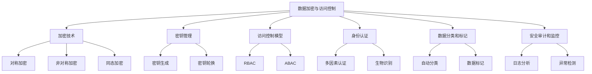
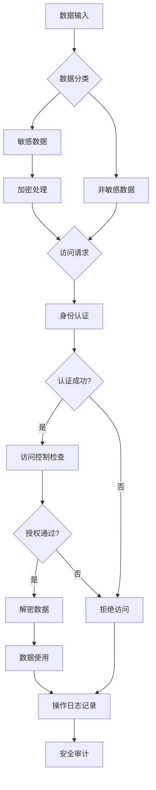
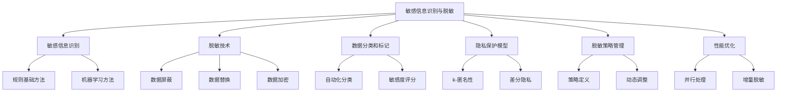
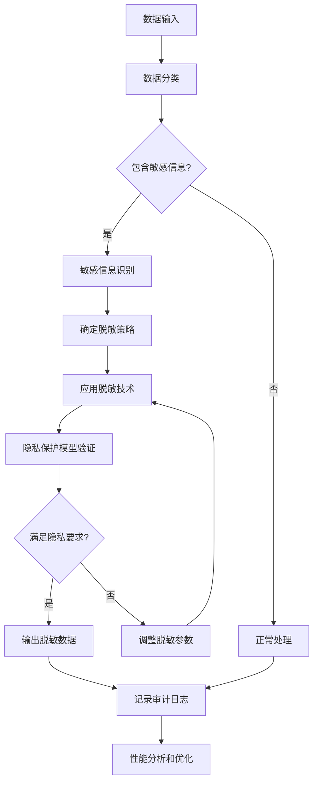
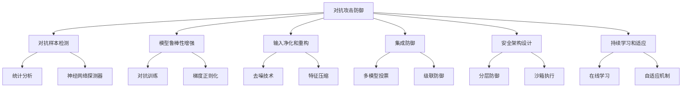
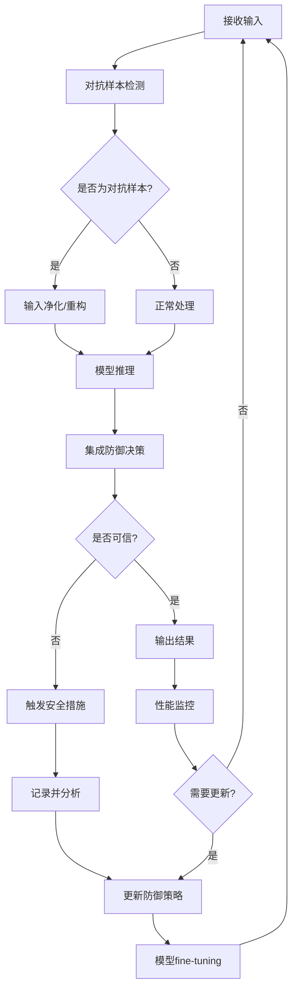
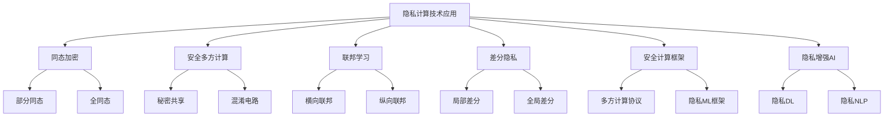
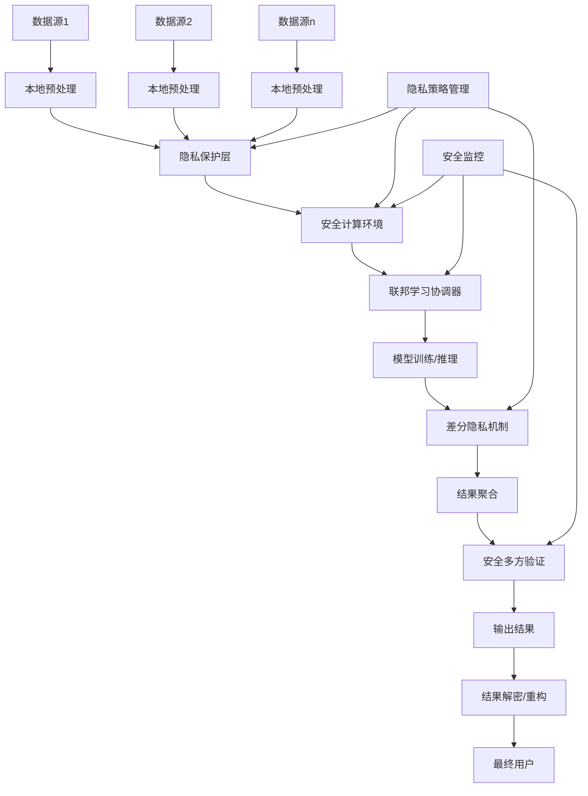

# 第13章：AI Agent 安全与隐私保护

## 13.1 数据加密与访问控制

### 核心概念

数据加密与访问控制是保护AI Agent系统中敏感信息安全的关键技术。数据加密确保数据在存储和传输过程中不被未授权方读取或篡改，而访问控制管理用户对系统资源的使用权限。这两种技术结合使用，可以有效防止数据泄露、未授权访问和其他安全威胁，是构建安全可靠的AI系统的基础。

### 问题背景

随着AI技术的广泛应用，AI Agent系统处理的数据量和敏感度都在不断增加。这些数据可能包括个人信息、商业机密、金融数据等高度敏感的内容。同时，AI系统的复杂性和开放性也增加了安全风险。数据泄露、隐私侵犯、未授权访问等安全事件不仅会造成直接的经济损失，还会严重影响用户信任和企业声誉。此外，各国不断加强的数据保护法规（如GDPR、CCPA等）也对AI系统的数据安全提出了更高要求。因此，实施强有力的数据加密和访问控制措施变得至关重要。

### 问题描述

1. 如何在保证性能的同时实现高强度的数据加密
2. 如何管理大规模分布式系统中的加密密钥
3. 如何实现细粒度的访问控制，满足复杂的权限需求
4. 如何在保护数据安全的同时不影响AI模型的训练和推理效果
5. 如何处理跨境数据传输中的加密和访问控制问题
6. 如何应对量子计算对现有加密系统的潜在威胁

### 问题解决

我们将从以下几个方面详细探讨数据加密与访问控制的实现：

1. 加密技术：
    - 对称加密（AES、ChaCha20）
    - 非对称加密（RSA、椭圆曲线加密）
    - 同态加密
    - 量子抗性加密算法

2. 密钥管理：
    - 密钥生成和分发
    - 密钥轮换
    - 硬件安全模块（HSM）
    - 密钥恢复机制

3. 访问控制模型：
    - 基于角色的访问控制（RBAC）
    - 基于属性的访问控制（ABAC）
    - 零信任安全模型
    - 上下文感知访问控制

4. 身份认证：
    - 多因素认证
    - 生物识别
    - 单点登录（SSO）
    - 去中心化身份（DID）

5. 数据分类和标记：
    - 自动化数据分类
    - 敏感数据发现
    - 数据标记和跟踪
    - 数据生命周期管理

6. 安全审计和监控：
    - 实时访问日志分析
    - 异常行为检测
    - 合规性报告生成
    - 安全事件响应

### 边界与外延

虽然本节主要关注AI Agent系统的数据加密与访问控制，但这些技术和方法也广泛应用于其他信息系统，如云服务、物联网、区块链等。此外，我们还将探讨如何将数据安全措施与AI系统的其他方面（如模型训练、推理优化、系统可用性）进行平衡，以及如何应对新兴技术（如边缘计算、5G网络）带来的安全挑战。

### 概念结构与核心要素组成



### 概念之间的关系

| 组件 | 主要功能 | 输入 | 输出 | 与其他组件的关系 |
|------|---------|------|------|------------------|
| 加密技术 | 保护数据机密性 | 原始数据 | 加密数据 | 为其他所有组件提供基础保护 |
| 密钥管理 | 管理加密密钥 | 密钥请求 | 安全的密钥 | 支持加密技术的实施 |
| 访问控制模型 | 定义访问策略 | 用户请求 | 访问决策 | 与身份认证协同工作 |
| 身份认证 | 验证用户身份 | 用户凭证 | 认证结果 | 为访问控制提供输入 |
| 数据分类和标记 | 识别敏感数据 | 原始数据 | 分类结果 | 指导加密和访问控制策略 |
| 安全审计和监控 | 检测安全事件 | 系统日志 | 安全报告 | 监督所有其他组件的运行 |

### 算法流程图

AI Agent系统数据加密与访问控制的基本流程：



### 算法源代码

以下是一个简化的AI Agent系统数据加密与访问控制示例：

```python
import hashlib
import os
from cryptography.fernet import Fernet
from typing import Dict, List

class User:
    def __init__(self, username: str, password: str, role: str):
        self.username = username
        self.password_hash = self._hash_password(password)
        self.role = role

    def _hash_password(self, password: str) -> str:
        return hashlib.sha256(password.encode()).hexdigest()

    def check_password(self, password: str) -> bool:
        return self._hash_password(password) == self.password_hash

class DataEncryptionSystem:
    def __init__(self):
        self.key = Fernet.generate_key()
        self.fernet = Fernet(self.key)

    def encrypt(self, data: str) -> bytes:
        return self.fernet.encrypt(data.encode())

    def decrypt(self, encrypted_data: bytes) -> str:
        return self.fernet.decrypt(encrypted_data).decode()

class AccessControlSystem:
    def __init__(self):
        self.users: Dict[str, User] = {}
        self.role_permissions: Dict[str, List[str]] = {
            "admin": ["read", "write", "delete"],
            "user": ["read"],
            "guest": []
        }

    def add_user(self, username: str, password: str, role: str):
        self.users[username] = User(username, password, role)

    def authenticate(self, username: str, password: str) -> bool:
        user = self.users.get(username)
        return user and user.check_password(password)

    def check_permission(self, username: str, action: str) -> bool:
        user = self.users.get(username)
        if not user:
            return False
        return action in self.role_permissions.get(user.role, [])

class SecureAIAgent:
    def __init__(self):
        self.encryption_system = DataEncryptionSystem()
        self.access_control = AccessControlSystem()
        self.sensitive_data: Dict[str, bytes] = {}

    def add_user(self, username: str, password: str, role: str):
        self.access_control.add_user(username, password, role)

    def store_sensitive_data(self, data_id: str, data: str):
        encrypted_data = self.encryption_system.encrypt(data)
        self.sensitive_data[data_id] = encrypted_data

    def access_data(self, username: str, password: str, data_id: str, action: str) -> str:
        if not self.access_control.authenticate(username, password):
            return "Authentication failed"

        if not self.access_control.check_permission(username, action):
            return "Permission denied"

        if data_id not in self.sensitive_data:
            return "Data not found"

        decrypted_data = self.encryption_system.decrypt(self.sensitive_data[data_id])
        return f"Data accessed: {decrypted_data}"

# 使用示例
agent = SecureAIAgent()

# 添加用户
agent.add_user("admin", "admin123", "admin")
agent.add_user("user1", "user123", "user")
agent.add_user("guest1", "guest123", "guest")

# 存储敏感数据
agent.store_sensitive_data("data1", "This is sensitive information")
agent.store_sensitive_data("data2", "Another piece of confidential data")

# 测试访问控制
print(agent.access_data("admin", "admin123", "data1", "read"))  # 应该成功
print(agent.access_data("user1", "user123", "data1", "read"))   # 应该成功
print(agent.access_data("user1", "user123", "data1", "write"))  # 应该失败
print(agent.access_data("guest1", "guest123", "data1", "read")) # 应该失败
print(agent.access_data("admin", "wrongpassword", "data1", "read"))  # 应该失败
```

### 实际场景应用

1. 医疗AI系统：
    - 加密患者个人健康信息
    - 基于角色的医疗记录访问控制
    - 审计日志记录所有数据访问

2. 金融AI应用：
    - 端到端加密金融交易数据
    - 多因素认证for高风险操作
    - 实时异常交易检测和警报

3. 智能家居系统：
    - 设备间通信加密
    - 基于上下文的访问控制（如位置、时间）
    - 远程访问的安全认证

4. 自动驾驶AI：
    - 车载数据实时加密
    - 基于角色的车辆控制权限管理
    - 安全的软件更新机制

5. 企业AI助手：
    - 敏感商业数据的分级加密
    - 集成企业单点登录系统
    - 细粒度的文档访问控制

### 最佳实践 tips

1. 全面的加密策略：
    - 实施全面的数据加密，包括静态、传输中和使用中的数据
    - 使用强加密算法和适当的密钥长度
    - 定期评估和更新加密方法以应对新威胁

2. 强健的密钥管理：
    - 使用硬件安全模块（HSM）保护密钥
    - 实施自动化密钥轮换机制
    - 建立安全的密钥备份和恢复流程

3. 最小权限原则：
    - 为用户和进程分配最小必要权限
    - 定期审查和更新访问权限
    - 实施职责分离，防止权限滥用

4. 多层次身份认证：
    - 实施多因素认证，特别是for敏感操作
    - 考虑使用生物识别技术增强安全性
    - 集成with企业身份管理系统

5. 持续监控和审计：
    - 实施实时安全事件监控
    - 使用AI技术检测异常访问模式
    - 定期进行安全审计和渗透测试

6. 安全意识培训：
    - 对所有用户进行定期的安全意识培训
    - 模拟钓鱼攻击测试员工警惕性
    - 建立清晰的安全事件报告流程

7. 合规性管理：
    - 确保系统符合相关数据保护法规（如GDPR、HIPAA）
    - 实施数据隐私影响评估（DPIA）
    - 保持详细的合规性文档和证据

### 行业发展与未来趋势

| 时期 | 主要特征 | 关键技术 | 挑战 | 未来展望 |
|------|---------|----------|------|----------|
| 2018-2019 | 基础加密 | AES、RSA | 性能开销 | 更高效的加密 |
| 2020-2021 | 零信任安全 | 微分段、持续认证 | 复杂性管理 | 自适应安全 |
| 2022-2023 | 隐私计算 | 同态加密、安全多方计算 | 实用性 | 广泛应用 |
| 2024-2025 (预测) | 量子安全 | 后量子密码学 | 大规模迁移 | 量子抗性系统 |
| 2026+ (展望) | 认知安全 | AI驱动的自主安全 | 伦理问题 | 自我进化的安全系统 |

数据加密与访问控制技术正在经历快速的演变。从传统的静态加密和基于角色的访问控制，到现在的动态加密、零信任架构和AI驱动的安全系统，我们看到了显著的进步。这些变化不仅提高了系统的安全性，还改变了我们设计和实施安全策略的方式。

未来的数据加密与访问控制可能会更加注重以下几个方面：

1. 量子安全加密：
    - 开发和部署抗量子计算攻击的加密算法
    - 量子密钥分发技术的实际应用
    - 混合经典-量子加密系统

2. 隐私增强计算：
    - 广泛应用同态加密技术
    - 安全多方计算在AI训练中的应用
    - 零知识证明技术的普及

3. 自适应访问控制：
    - 基于AI的实时风险评估和访问决策
    - 上下文感知和意图驱动的访问控制
    - 自学习和自优化的权限管理系统

4. 去中心化身份和访问管理：
    - 基于区块链的分布式身份验证
    - 自主身份（Self-Sovereign Identity）的广泛采用
    - 跨组织、跨平台的统一访问控制

5. 端到端加密生态系统：
    - 全生命周期的数据加密保护
    - 加密数据的高效处理和分析技术
    - 跨云、跨设备的无缝加密数据流动

6. 认知安全系统：
    - AI驱动的自主安全决策和响应
    - 预测性威胁检测和防御
    - 自我修复和进化的安全架构

7. 伦理和隐私导向的安全设计：
    - 将隐私保护作为核心设计原则
    - 可审计和可解释的安全决策
    - 平衡安全、隐私和用户体验

随着这些趋势的发展，数据加密与访问控制将从被动的防御手段演变为主动的、智能的安全管理系统。未来的系统将能够更智能地预测和应对安全威胁，同时提供更灵活、更个性化的访问控制，以适应复杂多变的应用场景。

这种进步将带来多方面的益处：

1. 增强数据保护：提供更强大的加密和更精细的访问控制。

2. 提高用户体验：实现无缝且安全的认证和授权过程。

3. 支持创新应用：为敏感数据处理和AI训练提供安全基础。

4. 增强合规性：更容易满足不断演变的隐私法规要求。

5. 降低安全风险：通过主动和智能的安全措施减少数据泄露风险。

6. 促进数据共享：在保护隐私的同时支持跨组织数据协作。

7. 提高系统弹性：增强对高级威胁的抵御能力。

然而，这种发展也带来了新的挑战，如如何平衡强大的安全措施和系统性能，如何管理日益复杂的加密和访问控制系统，以及如何确保这些先进技术的可用性和可理解性。未来的系统需要在安全性、可用性和透明度之间找到平衡，确保它们不仅技术先进，还能被广泛接受和使用。

总的来说，数据加密与访问控制将继续是AI Agent系统安全的核心支柱。通过不断创新和优化，我们将能够构建更安全、更可信的AI系统，为用户提供更好的保护，并推动整个行业向更加安全和负责任的方向发展。这不仅将改变我们保护数据和管理访问的方式，还将为AI技术在敏感领域的应用铺平道路，最终推动社会和技术的进步。

## 13.2 敏感信息识别与脱敏

### 核心概念

敏感信息识别与脱敏是保护个人隐私和商业机密的关键技术。敏感信息识别是指自动检测和标记包含敏感内容的数据，如个人身份信息、财务数据、医疗记录等。脱敏是指通过各种技术手段，如数据屏蔽、替换、加密等，降低或消除敏感信息的敏感性，同时保持数据的可用性。这两项技术结合使用，可以有效防止数据泄露和隐私侵犯，同时允许数据在合规的前提下被使用和分析。

### 问题背景

随着数据驱动决策和AI技术的广泛应用，组织处理的数据量和类型都在急剧增加。这些数据中往往包含大量敏感信息，如果不加保护，可能导致严重的隐私泄露和法律风险。同时，各国不断加强的数据保护法规（如GDPR、CCPA等）对数据处理提出了更严格的要求。然而，完全限制对敏感数据的访问又会阻碍有价值的数据分析和AI模型训练。因此，如何在保护隐私和维持数据效用之间找到平衡，成为一个关键挑战。敏感信息识别与脱敏技术为解决这一问题提供了重要途径。

### 问题描述

1. 如何准确识别各种类型的敏感信息，包括结构化和非结构化数据
2. 如何在保持数据可用性的同时，有效降低敏感信息的敏感度
3. 如何处理不同国家和地区对敏感信息定义的差异
4. 如何在大规模数据处理中高效实施敏感信息识别和脱敏
5. 如何评估脱敏后数据的安全性和有效性
6. 如何处理动态变化的敏感信息定义和脱敏需求

### 问题解决

我们将从以下几个方面详细探讨敏感信息识别与脱敏的实现：

1. 敏感信息识别技术：
    - 规则基础方法（正则表达式、模式匹配）
    - 机器学习方法（分类、命名实体识别）
    - 自然语言处理技术
    - 上下文感知识别

2. 脱敏技术：
    - 数据屏蔽
    - 数据替换
    - 数据加密
    - 数据泛化
    - 数据随机化

3. 数据分类和标记：
    - 自动化数据分类
    - 敏感度评分
    - 元数据管理
    - 数据血缘追踪

4. 隐私保护模型：
    - k-匿名性
    - l-多样性
    - t-接近度
    - 差分隐私

5. 脱敏策略管理：
    - 策略定义和执行
    - 动态策略调整
    - 合规性映射
    - 审计和报告

6. 性能优化：
    - 并行处理
    - 增量脱敏
    - 缓存机制
    - 分布式处理

### 边界与外延

虽然本节主要关注AI Agent系统中的敏感信息识别与脱敏，但这些技术和方法也广泛应用于其他数据密集型领域，如医疗信息系统、金融服务、电子商务等。此外，我们还将探讨如何将敏感信息保护与其他数据安全技术（如加密、访问控制）结合，以及如何在新兴技术环境（如边缘计算、区块链）中应用这些方法。

### 概念结构与核心要素组成



### 概念之间的关系

| 组件 | 主要功能 | 输入 | 输出 | 与其他组件的关系 |
|------|---------|------|------|------------------|
| 敏感信息识别 | 检测敏感数据 | 原始数据 | 标记的敏感信息 | 为脱敏技术提供输入 |
| 脱敏技术 | 降低数据敏感性 | 敏感数据 | 脱敏后的数据 |使用数据分类结果 |
| 数据分类和标记 | 分类和标记数据 | 原始数据 | 分类和标记结果 | 指导敏感信息识别和脱敏策略 |
| 隐私保护模型 | 保证数据隐私 | 数据集 | 隐私保护后的数据集 | 与脱敏技术协同工作 |
| 脱敏策略管理 | 管理脱敏规则 | 脱敏需求 | 脱敏策略 | 控制整个脱敏过程 |
| 性能优化 | 提高处理效率 | 处理任务 | 优化后的性能 | 影响所有其他组件的执行效率 |

### 算法流程图

敏感信息识别与脱敏的基本流程：



### 算法源代码

以下是一个简化的敏感信息识别与脱敏系统示例：

```python
import re
import hashlib
from typing import Dict, List, Any

class SensitiveDataDetector:
    def __init__(self):
        self.patterns = {
            'email': r'\b[A-Za-z0-9._%+-]+@[A-Za-z0-9.-]+\.[A-Z|a-z]{2,}\b',
            'phone': r'\b\d{3}[-.]?\d{3}[-.]?\d{4}\b',
            'ssn': r'\b\d{3}-\d{2}-\d{4}\b',
            'credit_card': r'\b(?:\d{4}[-\s]?){3}\d{4}\b'
        }

    def detect(self, text: str) -> Dict[str, List[str]]:
        results = {}
        for key, pattern in self.patterns.items():
            matches = re.findall(pattern, text)
            if matches:
                results[key] = matches
        return results

class DataMasker:
    @staticmethod
    def mask_email(email: str) -> str:
        username, domain = email.split('@')
        return f"{username[0]}{'*' * (len(username) - 1)}@{domain}"

    @staticmethod
    def mask_phone(phone: str) -> str:
        return re.sub(r'\d', '*', phone[:-4]) + phone[-4:]

    @staticmethod
    def mask_ssn(ssn: str) -> str:
        return f"***-**-{ssn[-4:]}"

    @staticmethod
    def mask_credit_card(cc: str) -> str:
        return re.sub(r'\d', '*', cc[:-4]) + cc[-4:]

class DataAnonymizer:
    def __init__(self, k: int = 5):
        self.k = k

    def anonymize(self, data: List[Dict[str, Any]]) -> List[Dict[str, Any]]:
        # 简化的k-匿名实现
        result = []
        for i in range(0, len(data), self.k):
            group = data[i:i+self.k]
            if len(group) == self.k:
                anonymized_group = self._anonymize_group(group)
                result.extend(anonymized_group)
            else:
                result.extend(group)  # 处理最后不足k个的数据
        return result

    def _anonymize_group(self, group: List[Dict[str, Any]]) -> List[Dict[str, Any]]:
        anonymized = {}
        for key in group[0].keys():
            values = [item[key] for item in group]
            if isinstance(values[0], (int, float)):
                anonymized[key] = sum(values) / len(values)  # 平均值
            else:
                anonymized[key] = '*'  # 对非数值类型，简单地用*替代
        return [anonymized.copy() for _ in range(len(group))]

class PrivacyProtectionSystem:
    def __init__(self):
        self.detector = SensitiveDataDetector()
        self.masker = DataMasker()
        self.anonymizer = DataAnonymizer()

    def process_text(self, text: str) -> str:
        sensitive_data = self.detector.detect(text)
        for data_type, instances in sensitive_data.items():
            for instance in instances:
                if data_type == 'email':
                    masked = self.masker.mask_email(instance)
                elif data_type == 'phone':
                    masked = self.masker.mask_phone(instance)
                elif data_type == 'ssn':
                    masked = self.masker.mask_ssn(instance)
                elif data_type == 'credit_card':
                    masked = self.masker.mask_credit_card(instance)
                text = text.replace(instance, masked)
        return text

    def process_structured_data(self, data: List[Dict[str, Any]]) -> List[Dict[str, Any]]:
        return self.anonymizer.anonymize(data)

# 使用示例
system = PrivacyProtectionSystem()

# 文本数据处理
sample_text = """
John Doe's email is johndoe@example.com and phone number is 123-456-7890.
His SSN is 123-45-6789 and credit card number is 1234-5678-9012-3456.
"""
protected_text = system.process_text(sample_text)
print("Protected text:")
print(protected_text)

# 结构化数据处理
sample_data = [
    {"name": "Alice", "age": 30, "salary": 50000},
    {"name": "Bob", "age": 35, "salary": 60000},
    {"name": "Charlie", "age": 40, "salary": 70000},
    {"name": "David", "age": 45, "salary": 80000},
    {"name": "Eve", "age": 50, "salary": 90000},
]
anonymized_data = system.process_structured_data(sample_data)
print("\nAnonymized structured data:")
for item in anonymized_data:
    print(item)
```

### 实际场景应用

1. 医疗数据管理：
    - 识别和脱敏患者个人信息
    - 保护医疗记录中的敏感诊断信息
    - 支持医学研究数据共享

2. 金融服务：
    - 保护客户财务信息
    - 脱敏交易数据for风险分析
    - 合规性报告生成

3. 人力资源管理：
    - 员工个人信息保护
    - 薪资数据脱敏
    - 匿名化员工调查数据

4. 电子商务：
    - 保护用户购物历史
    - 脱敏支付信息
    - 匿名化用户行为数据for分析

5. 智能城市项目：
    - 保护市民个人数据
    - 匿名化交通和位置数据
    - 支持跨部门数据共享

### 最佳实践 tips

1. 全面的数据发现和分类：
    - 定期扫描和更新数据清单
    - 使用自动化工具识别敏感数据
    - 建立数据分类标准和流程

2. 分层脱敏策略：
    - 根据数据敏感度和使用场景制定不同级别的脱敏策略
    - 实施动态脱敏，根据访问者权限调整脱敏级别
    - 定期审查和更新脱敏规则

3. 保持数据效用：
    - 选择适当的脱敏技术，平衡隐私保护和数据可用性
    - 使用高级隐私保护模型（如差分隐私）
    - 进行脱敏后数据质量评估

4. 集成化方案：
    - 将敏感信息识别和脱敏集成到数据处理流程中
    - 与访问控制和加密系统协同工作
    - 实现端到端的数据保护

5. 性能优化：
    - 使用并行处理技术提高大规模数据处理效率
    - 实施增量脱敏，只处理变化的数据
    - 优化存储和检索机制

6. 审计和合规：
    - 保持详细的脱敏操作日志
    - 定期进行隐私影响评估
    - 确保符合相关数据保护法规

7. 持续学习和改进：
    - 使用机器学习技术提高敏感信息识别的准确性
    - 收集和分析脱敏效果反馈
    - 建立敏感信息识别和脱敏的知识库

### 行业发展与未来趋势

| 时期 | 主要特征 | 关键技术 | 挑战 | 未来展望 |
|------|---------|----------|------|----------|
| 2018-2019 | 基础脱敏 | 静态规则、简单替换 | 效率低下 | 自动化识别 |
| 2020-2021 | 智能识别 | 机器学习、NLP | 准确性 | 上下文感知脱敏 |
| 2022-2023 | 隐私计算 | 同态加密、联邦学习 | 性能开销 | 无损数据利用 |
| 2024-2025 (预测) | 动态脱敏 | 实时风险评估、自适应算法 | 复杂环境适应 | 智能隐私管理 |
| 2026+ (展望) | 认知隐私 | 隐私意图理解、自主决策系统 | 伦理和法律挑战 | 个性化隐私保护 |

敏感信息识别与脱敏技术正在经历快速的演变。从早期的静态规则和简单替换，到现在的机器学习驱动的智能识别和隐私保护计算，我们看到了显著的进步。这些变化不仅提高了数据保护的效率和准确性，还改变了组织处理和利用敏感数据的方式。

未来的敏感信息识别与脱敏可能会更加注重以下几个方面：

1. 上下文感知识别：
    - 理解数据的语境和使用场景
    - 动态调整敏感度评估
    - 考虑多维度因素（如用户角色、位置、时间）

2. 智能化脱敏策略：
    - AI驱动的自适应脱敏算法
    - 实时风险评估和策略调整
    - 学习型系统，不断优化脱敏效果

3. 隐私保护数据处理：
    - 广泛应用同态加密和安全多方计算
    - 支持对加密数据直接进行分析和机器学习
    - 实现真正的数据可用不可见

4. 个性化隐私保护：
    - 基于用户偏好的定制化隐私设置
    - 隐私意图理解和自动执行
    - 动态平衡个人隐私和数据效用

5. 跨域隐私管理：
    - 支持跨组织、跨平台的一致性隐私保护
    - 智能处理不同法律管辖区的隐私要求
    - 实现全球化数据流动中的隐私保护

6. 隐私增强AI：
    - 在AI模型训练和推理中集成隐私保护机制
    - 开发隐私保护的迁移学习技术
    - 实现AI系统的隐私自我管理

7. 量子安全隐私保护：
    - 应对量子计算带来的隐私威胁
    - 开发量子安全的数据脱敏技术
    - 探索量子隐私增强协议

随着这些趋势的发展，敏感信息识别与脱敏将从被动的数据处理步骤演变为主动的、智能的隐私管理系统。未来的系统将能够更精确地识别敏感信息，更灵活地应用脱敏策略，同时最大化数据的可用性和价值。

这种进步将带来多方面的益处：

1. 增强隐私保护：提供更精细和有效的数据保护。

2. 提高数据价值：在保护隐私的同时最大化数据利用。

3. 支持创新应用：为敏感数据的安全分析和AI应用铺平道路。

4. 简化合规流程：自动化隐私保护措施，降低合规成本。

5. 增强用户信任：通过透明和有效的隐私保护赢得用户信心。

6. 促进数据共享：在保护隐私的基础上支持更广泛的数据协作。

7. 推动隐私技术创新：刺激新一代隐私增强技术的发展。

然而，这种发展也带来了新的挑战，如如何在复杂多变的环境中保持高准确性的敏感信息识别，如何平衡隐私保护强度和数据效用，以及如何应对不断演变的隐私威胁和法规要求。未来的系统需要在技术创新、用户体验和伦理考量之间找到平衡，确保它们不仅技术先进，还能被广泛接受和信任。

总的来说，敏感信息识别与脱敏将继续是数据隐私保护的核心技术。通过不断创新和优化，我们将能够构建更智能、更有效的隐私保护系统，为用户提供更好的数据安全保障，并推动整个行业向更加负责任和可持续的方向发展。这不仅将改变我们处理和利用敏感数据的方式，还将为数据驱动创新和AI技术在敏感领域的应用开辟新的可能性，最终推动社会和技术的进步。

## 13.3 对抗攻击防御

### 核心概念

对抗攻击防御是指保护AI系统免受恶意输入或操纵的技术和策略。对抗攻击是指通过精心设计的输入来欺骗或误导AI模型，使其产生错误的输出。防御机制旨在识别、抵御这些攻击，并提高AI系统的鲁棒性。这个领域涉及机器学习、安全、统计学等多个学科，对于构建可信赖的AI系统至关重要。

### 问题背景

随着AI技术的广泛应用，其安全性和可靠性成为越来越重要的问题。对抗攻击可能导致严重的后果，如自动驾驶汽车误识别交通标志、人脸识别系统被欺骗、恶意内容逃过内容过滤等。这些攻击不仅威胁系统的正常运行，还可能导致用户隐私泄露、财产损失，甚至危及生命安全。同时，随着攻击者技术的不断进步，对抗攻击变得越来越复杂和难以检测。因此，开发有效的对抗攻击防御机制成为AI安全研究的重要课题。

### 问题描述

1. 如何识别和检测各种类型的对抗攻击
2. 如何提高AI模型对对抗样本的鲁棒性
3. 如何在保持模型性能的同时增强其安全性
4. 如何应对实时、动态的对抗攻击
5. 如何在资源受限的环境（如移动设备）中实施有效的防御
6. 如何评估防御机制的有效性和可靠性

### 问题解决

我们将从以下几个方面详细探讨对抗攻击防御的实现：

1. 对抗样本检测：
    - 统计特征分析
    - 神经网络探测器
    - 输入预处理
    - 多模型一致性检查

2. 模型鲁棒性增强：
    - 对抗训练
    - 梯度正则化
    - 防御蒸馏
    - 随机化技术

3. 输入净化和重构：
    - 去噪技术
    - 图像重构
    - 特征压缩
    - 输入变换

4. 集成防御：
    - 多模型投票
    - 级联防御
    - 动态模型选择
    - 异构模型集成

5. 安全架构设计：
    - 分层防御
    - 沙箱执行
    - 安全管道
    - 动态防御策略

6. 持续学习和适应：
    - 在线对抗学习
    - 自适应防御机制
    - 攻击模式识别
    - 模型更新策略

### 边界与外延

虽然本节主要关注AI系统的对抗攻击防御，但这些技术和方法也可以应用于其他安全领域，如网络安全、恶意软件检测等。此外，我们还将探讨如何将对抗防御与其他AI安全技术（如隐私保护、可解释性）结合，以及如何在不同应用场景（如计算机视觉、自然语言处理、推荐系统）中应用这些防御策略。

### 概念结构与核心要素组成



### 概念之间的关系

| 组件 | 主要功能 | 输入 | 输出 | 与其他组件的关系 |
|------|---------|------|------|------------------|
| 对抗样本检测 | 识别恶意输入 | 输入数据 | 检测结果 | 为其他防御组件提供预警 |
| 模型鲁棒性增强 | 提高模型抗攻击能力 | 训练数据、模型 | 增强后的模型 | 与输入净化协同工作 |
| 输入净化和重构 | 清理或修复输入 | 可能受污染的输入 | 净化后的输入 | 为模型提供清洁数据 |
| 集成防御 | 综合多种防御策略 | 多个模型/策略 | 综合决策 | 整合其他防御组件的输出 |
| 安全架构设计 | 构建整体防御框架 | 系统需求 | 安全架构 | 为所有防御组件提供基础 |
| 持续学习和适应 | 动态更新防御策略 | 新的攻击数据 | 更新后的防御 | 优化所有其他组件 |

### 算法流程图

对抗攻击防御的基本流程：



### 算法源代码

以下是一个简化的对抗攻击防御系统示例：

```python
import numpy as np
from typing import List, Tuple
from sklearn.ensemble import RandomForestClassifier
from sklearn.preprocessing import StandardScaler

class AdversarialDefenseSystem:
    def __init__(self, models: List[RandomForestClassifier], threshold: float = 0.7):
        self.models = models
        self.threshold = threshold
        self.scaler = StandardScaler()
        self.attack_patterns = []

    def preprocess(self, input_data: np.ndarray) -> np.ndarray:
        # 简单的预处理：标准化
        return self.scaler.fit_transform(input_data)

    def detect_adversarial(self, input_data: np.ndarray) -> bool:
        # 简单的对抗样本检测：检查模型间的预测一致性
        predictions = [model.predict(input_data) for model in self.models]
        agreement = np.mean([np.all(pred == predictions[0]) for pred in predictions])
        return agreement < self.threshold

    def clean_input(self, input_data: np.ndarray) -> np.ndarray:
        # 简单的输入净化：裁剪异常值
        return np.clip(input_data, -3, 3)

    def ensemble_predict(self, input_data: np.ndarray) -> Tuple[int, float]:
        predictions = [model.predict(input_data) for model in self.models]
        final_prediction = np.mode(predictions)[0][0]
        confidence = np.mean([model.predict_proba(input_data).max() for model in self.models])
        return final_prediction, confidence

    def update_defense(self, input_data: np.ndarray, true_label: int):
        # 简单的防御更新：记录攻击模式
        self.attack_patterns.append((input_data, true_label))
        if len(self.attack_patterns) >= 100:
            self.retrain_models()

    def retrain_models(self):
        # 使用记录的攻击模式重新训练模型
        X, y = zip(*self.attack_patterns)
        X = np.vstack(X)
        y = np.array(y)
        for model in self.models:
            model.fit(X, y)
        self.attack_patterns = []

    def defend(self, input_data: np.ndarray) -> Tuple[int, float, bool]:
        processed_input = self.preprocess(input_data)
        is_adversarial = self.detect_adversarial(processed_input)
        
        if is_adversarial:
            cleaned_input = self.clean_input(processed_input)
        else:
            cleaned_input = processed_input
        
        prediction, confidence = self.ensemble_predict(cleaned_input)
        
        return prediction, confidence, is_adversarial

# 使用示例
# 创建一个简单的数据集和模型集合
X = np.random.rand(1000, 10)
y = (X.sum(axis=1) > 5).astype(int)

models = [RandomForestClassifier(n_estimators=100, random_state=i) for i in range(5)]
for model in models:
    model.fit(X, y)

defense_system = AdversarialDefenseSystem(models)

# 模拟正常输入
normal_input = np.random.rand(1, 10)
prediction, confidence, is_adversarial = defense_system.defend(normal_input)
print(f"Normal input - Prediction: {prediction}, Confidence: {confidence:.2f}, Is Adversarial: {is_adversarial}")

# 模拟对抗样本
adversarial_input = np.random.rand(1, 10) * 10 - 5  # 超出正常范围的输入
prediction, confidence, is_adversarial = defense_system.defend(adversarial_input)
print(f"Adversarial input - Prediction: {prediction}, Confidence: {confidence:.2f}, Is Adversarial: {is_adversarial}")

# 更新防御
true_label = 1  # 假设这是真实标签
defense_system.update_defense(adversarial_input, true_label)
```

### 实际场景应用

1. 图像识别系统防御：
    - 防御对交通标志识别的对抗攻击
    - 增强人脸识别系统的鲁棒性
    - 保护医疗图像分析免受恶意干扰

2. 自然语言处理安全：
    - 防御对文本分类器的对抗攻击
    - 增强机器翻译系统的鲁棒性
    - 保护对话系统免受恶意输入

3. 推荐系统防御：
    - 防御对商品推荐的操纵攻击
    - 增强新闻推荐的公正性和可靠性
    - 保护社交媒体算法免受恶意影响

4. 自动驾驶安全：
    - 防御对物体检测系统的对抗攻击
    - 增强路况识别的鲁棒性
    - 保护决策系统免受恶意干扰

5. 金融风控系统：
    - 防御对欺诈检测模型的逃避攻击
    - 增强信用评分系统的可靠性
    - 保护交易异常检测免受对抗样本影响

### 最佳实践 tips

1. 多层次防御策略：
    - 结合多种防御技术，如检测、净化、鲁棒训练等
    - 实施深度防御，在不同层面部署防御机制
    - 定期评估和更新防御策略

2. 持续监控和适应：
    - 实施实时监控系统检测潜在攻击
    - 使用在线学习技术动态更新防御模型
    - 建立快速响应机制应对新型攻击

3. 模型多样性：
    - 使用不同架构和训练方法的模型集成
    - 实施随机化技术增加攻击难度
    - 定期轮换或更新模型减少可预测性

4. 输入验证和净化：
    - 实施严格的输入验证和过滤机制
    - 使用高级去噪和重构技术处理输入
    - 考虑领域知识在输入处理中的应用

5. 对抗训练：
    - 在训练过程中引入对抗样本
    - 使用多样化的对抗样本生成方法
    - 定期用最新的攻击方法更新训练集

6. 性能平衡：
    - 在安全性和模型性能之间寻找平衡
    - 使用轻量级防御技术for资源受限环境
    - 实施自适应防御级别based on风险评估

7. 安全开发实践：
    - 在AI系统开发周期中集成安全考虑
    - 进行定期的安全审计和渗透测试
    - 建立安全事件响应和恢复机制

### 行业发展与未来趋势

| 时期 | 主要特征 | 关键技术 | 挑战 | 未来展望 |
|------|---------|----------|------|----------|
| 2018-2019 | 基础防御 | 对抗训练、输入净化 | 计算开销大 | 更高效的防御 |
| 2020-2021 | 检测为主 | 对抗样本检测、集成方法 | 误报率高 | 精确识别 |
| 2022-2023 | 自适应防御 | 动态防御、迁移学习 | 实时性能 | 智能化防御 |
| 2024-2025 (预测) | 生成式防御 | GAN-based防御、自我修复 | 模型复杂性 | 自主防御系统 |
| 2026+ (展望) | 认知安全 | 意图理解、上下文感知防御 | 伦理问题 | 人机协同防御 |

对抗攻击防御技术正在经历快速的演变。从早期的简单对抗训练和输入净化，到现在的自适应防御和生成式方法，我们看到了显著的进步。这些变化不仅提高了AI系统的安全性和鲁棒性，还改变了我们设计和部署AI应用的方式。

未来的对抗攻击防御可能会更加注重以下几个方面：

1. 智能化防御系统：
    - 使用元学习技术快速适应新型攻击
    - 自动生成和评估防御策略
    - 预测性防御，主动识别潜在威胁

2. 上下文感知防御：
    - 考虑输入的语境和使用场景
    - 动态调整防御强度和策略
    - 整合多源信息增强判断准确性

3. 隐私保护防御：
    - 结合联邦学习和差分隐私技术
    - 在保护用户隐私的同时提高模型鲁棒性
    - 开发不需要访问原始数据的防御方法

4. 跨模态防御：
    - 开发适用于多模态AI系统的统一防御框架
    - 利用跨模态信息增强防御能力
    - 应对跨模态对抗攻击

5. 量子增强防御：
    - 利用量子计算加速对抗样本检测
    - 开发量子resistant的AI模型
    - 探索量子-经典混合防御策略

6. 人机协同防御：
    - 结合人类专家知识和AI系统
    - 开发交互式防御系统，允许人工干预
    - 利用群体智能增强防御效果

7. 自愈性AI系统：
    - 开发能够自我修复的AI模型
    - 实时检测和纠正模型异常行为
    - 建立模型健康状态监控机制

随着这些趋势的发展，对抗攻击防御将从被动的防护措施演变为主动的、智能的安全管理系统。未来的防御系统将能够更准确地识别和应对各种复杂的对抗攻击，同时保持高效的性能和良好的用户体验。

这种进步将带来多方面的益处：

1. 增强AI系统可靠性：提高AI在关键应用领域的可信度。

2. 促进AI技术普及：降低采用AI技术的安全风险。

3. 推动创新应用：为AI在敏感领域的应用提供安全保障。

4. 提高系统韧性：增强AI系统面对未知威胁的适应能力。

5. 保护用户权益：防止AI系统被恶意利用损害用户利益。

6. 推动安全标准制定：为AI安全领域的规范化提供技术支持。

7. 促进跨学科研究：推动AI、安全、认知科学等领域的交叉创新。

然而，这种发展也带来了新的挑战，如如何在复杂多变的环境中保持高效的防御，如何平衡安全性和模型性能，以及如何应对不断演变的攻击技术。未来的防御系统需要在技术创新、实用性和伦理考量之间找到平衡，确保它们不仅技术先进，还能被广泛接受和信任。

总的来说，对抗攻击防御将继续是AI安全研究的核心主题。通过不断创新和优化，我们将能够构建更安全、更可靠的AI系统，为用户提供更好的保护，并推动整个行业向更加安全和负责任的方向发展。这不仅将改变我们设计和部署AI系统的方式，还将为AI技术在各个领域的深入应用铺平道路，最终推动社会和技术的进步。

## 13.4 隐私计算技术应用

### 核心概念

隐私计算技术是一系列允许在保护数据隐私的同时进行数据分析和计算的方法。这些技术使得多方可以在不暴露各自原始数据的情况下进行协作计算，从而实现数据的"可用不可见"。主要的隐私计算技术包括同态加密、安全多方计算、联邦学习和差分隐私等。这些技术在AI领域的应用，为解决数据孤岛、隐私保护和合规性等问题提供了新的途径。

### 问题背景

随着数据驱动决策和AI技术的广泛应用，数据的价值日益凸显。然而，数据的收集和使用也带来了严重的隐私问题。各国不断加强的数据保护法规（如GDPR、CCPA等）对数据使用提出了更严格的要求。同时，不同组织间的数据孤岛问题限制了大规模数据分析和AI模型训练的潜力。传统的数据共享和分析方法难以同时满足数据利用和隐私保护的需求。在这种背景下，隐私计算技术应运而生，旨在在保护隐私的同时最大化数据价值。

### 问题描述

1. 如何在不暴露原始数据的情况下进行多方数据分析和模型训练
2. 如何平衡数据利用效率和隐私保护强度
3. 如何处理大规模数据集的隐私计算，克服性能瓶颈
4. 如何在资源受限的环境（如移动设备、物联网设备）中应用隐私计算技术
5. 如何确保隐私计算结果的准确性和可靠性
6. 如何应对隐私计算中的安全威胁和攻击

### 问题解决

我们将从以下几个方面详细探讨隐私计算技术的应用：

1. 同态加密：
    - 部分同态加密
    - 全同态加密
    - 近似同态加密
    - 多密钥同态加密

2. 安全多方计算：
    - 秘密共享
    - 混淆电路
    - 不经意传输
    - 零知识证明

3. 联邦学习：
    - 横向联邦学习
    - 纵向联邦学习
    - 联邦迁移学习
    - 分布式联邦学习

4. 差分隐私：
    - 局部差分隐私
    - 全局差分隐私
    - 随机响应
    - 拉普拉斯机制

5. 安全计算框架：
    - 隐私保护数据分析平台
    - 多方安全计算协议
    - 隐私保护机器学习框架
    - 分布式隐私计算系统

6. 隐私增强AI：
    - 隐私保护深度学习
    - 隐私保护强化学习
    - 隐私保护推荐系统
    - 隐私保护自然语言处理

### 边界与外延

虽然本节主要关注隐私计算技术在AI领域的应用，但这些技术也广泛应用于其他领域，如金融、医疗、政务等。此外，我们还将探讨隐私计算与其他技术（如区块链、边缘计算）的结合，以及在不同应用场景（如智慧城市、个性化服务、跨境数据流动）中的实践。

### 概念结构与核心要素组成



### 概念之间的关系

| 技术 | 主要功能 | 输入 | 输出 | 与其他技术的关系 |
|------|---------|------|------|------------------|
| 同态加密 | 加密数据计算 | 原始数据 | 加密结果 | 可与联邦学习结合 |
| 安全多方计算 | 多方协作计算 | 多方数据 | 计算结果 | 可用于联邦学习中的安全聚合 |
| 联邦学习 | 分布式模型训练 | 分散数据 | 全局模型 | 可集成差分隐私 |
| 差分隐私 | 添加噪声保护 | 查询/模型 | 隐私保护结果 | 可应用于各种AI任务 |
| 安全计算框架 | 提供计算环境 | 计算任务 | 安全执行环境 | 整合多种隐私计算技术 |
| 隐私增强AI | AI模型隐私保护 | AI模型/数据 | 隐私保护模型/结果 | 综合应用多种隐私技术 |

### 算法流程图

隐私计算技术在AI中的应用流程：



### 算法源代码

以下是一个简化的隐私计算技术应用示例，结合了联邦学习和差分隐私：

```python
import numpy as np
from sklearn.linear_model import SGDClassifier
from sklearn.metrics import accuracy_score
from typing import List, Tuple

class PrivacyPreservingML:
    def __init__(self, num_clients: int, epsilon: float = 1.0):
        self.num_clients = num_clients
        self.epsilon = epsilon  # 差分隐私参数
        self.global_model = SGDClassifier(random_state=42)

    def add_noise(self, data: np.ndarray) -> np.ndarray:
        """添加拉普拉斯噪声实现差分隐私"""
        sensitivity = 1.0  # 假设敏感度为1
        noise = np.random.laplace(0, sensitivity / self.epsilon, data.shape)
        return data + noise

    def train_local_model(self, X: np.ndarray, y: np.ndarray) -> SGDClassifier:
        """训练本地模型"""
        local_model = SGDClassifier(random_state=42)
        local_model.partial_fit(X, y, classes=np.unique(y))
        return local_model

    def aggregate_models(self, models: List[SGDClassifier]) -> SGDClassifier:
        """聚合模型参数"""
        global_weights = np.mean([model.coef_ for model in models], axis=0)
        global_intercept = np.mean([model.intercept_ for model in models])
        
        self.global_model.coef_ = global_weights
        self.global_model.intercept_ = global_intercept
        
        return self.global_model

    def federated_learning(self, data: List[Tuple[np.ndarray, np.ndarray]], num_rounds: int = 5):
        """联邦学习过程"""
        for _ in range(num_rounds):
            local_models = []
            for X, y in data:
                # 添加差分隐私噪声
                X_noisy = self.add_noise(X)
                local_model = self.train_local_model(X_noisy, y)
                local_models.append(local_model)
            
            # 聚合模型
            self.global_model = self.aggregate_models(local_models)

    def predict(self, X: np.ndarray) -> np.ndarray:
        """使用全局模型进行预测"""
        return self.global_model.predict(X)

# 使用示例
# 生成模拟数据
np.random.seed(42)
X = np.random.rand(1000, 10)
y = (X.sum(axis=1) > 5).astype(int)

# 将数据分割给多个客户端
num_clients = 5
data_splits = list(zip(np.array_split(X, num_clients), np.array_split(y, num_clients)))

# 创建隐私保护ML系统
ppml = PrivacyPreservingML(num_clients=num_clients, epsilon=0.5)

# 执行联邦学习
ppml.federated_learning(data_splits, num_rounds=10)

# 评估全局模型
X_test = np.random.rand(200, 10)
y_test = (X_test.sum(axis=1) > 5).astype(int)
y_pred = ppml.predict(X_test)
accuracy = accuracy_score(y_test, y_pred)
print(f"Global model accuracy: {accuracy:.4f}")
```

### 实际场景应用

1. 医疗健康数据分析：
    - 多家医院协作进行疾病预测模型训练
    - 药物研发中的多方数据协作
    - 基因数据的隐私保护分析

2. 金融风控：
    - 跨银行的反欺诈模型训练
    - 多方参与的信用评分系统
    - 隐私保护的交易异常检测

3. 智慧城市：
    - 多部门数据协作的城市规划
    - 隐私保护的交通流量预测
    - 跨区域的环境监测数据分析

4. 电信行业：
    - 多运营商协作的网络优化
    - 用户行为分析与隐私保护
    - 跨境漫游数据的安全处理

5. 广告投放：
    - 多平台协作的精准广告定向
    - 隐私保护的用户画像构建
    - 跨设备的用户行为分析

### 最佳实践 tips

1. 隐私保护设计：
    - 采用"隐私by设计"原则
    - 实施最小化数据收集和处理
    - 使用隐私影响评估（PIA）指导设计

2. 多层次保护策略：
    - 结合多种隐私计算技术
    - 实施纵深防御，在不同层面保护隐私
    - 根据数据敏感度采用不同强度的保护措施

3. 性能优化：
    - 使用高效的密码学库
    - 采用并行计算和分布式处理
    - 优化通信协议减少网络开销

4. 安全管理：
    - 实施严格的密钥管理
    - 建立完善的访问控制机制
    - 定期进行安全审计和更新

5. 合规性考虑：
    - 确保符合相关数据保护法规
    - 建立透明的数据使用政策
    - 提供用户选择和控制机制

6. 可用性平衡：
    - 在隐私保护和数据效用间寻找平衡
    - 使用自适应隐私保护级别
    - 提供可定制的隐私设置

7. 持续改进：
    - 跟踪最新的隐私计算技术发展
    - 收集和分析隐私保护效果反馈
    - 建立隐私保护最佳实践知识库

### 行业发展与未来趋势

| 时期 | 主要特征 | 关键技术 | 挑战 | 未来展望 |
|------|---------|----------|------|----------|
| 2018-2019 | 概念验证 | 基础同态加密、简单联邦学习 | 性能瓶颈 | 实用化部署 |
| 2020-2021 | 初步应用 | 高效MPC、横向联邦学习 | 跨域协作 | 行业标准化 |
| 2022-2023 | 规模化采用 | TEE加速、垂直联邦学习 | 监管合规 | 生态系统形成 |
| 2024-2025 (预测) | 普及阶段 | 后量子隐私计算、联邦强化学习 | 隐私量化 | 无缝隐私服务 |
| 2026+ (展望) | 智能隐私 | 认知隐私计算、自适应隐私保护 | 伦理挑战 | 隐私智能基础设施 |

隐私计算技术正在经历快速的演变和应用扩展。从早期的理论研究和概念验证，到现在的实际部署和规模化应用，我们看到了显著的进步。这些变化不仅提高了数据利用的安全性和效率，还改变了组织间协作和数据共享的方式。

未来的隐私计算技术可能会更加注重以下几个方面：

1. 智能化隐私保护：
    - 自适应隐私保护级别
    - 上下文感知的隐私计算
    - AI驱动的隐私风险评估和缓解

2. 量子安全隐私计算：
    - 后量子安全的加密方案
    - 量子隐私增强协议
    - 混合经典-量子隐私计算系统

3. 边缘-云协同隐私计算：
    - 分布式隐私保护架构
    - 轻量级边缘隐私计算
    - 动态隐私计算任务调度

4. 跨域隐私计算生态：
    - 标准化的隐私计算接口和协议
    - 跨行业、跨地区的隐私数据交换平台
    - 隐私计算即服务（PCaaS）

5. 隐私增强的人工智能：
    - 端到端隐私保护的AI训练和推理
    - 隐私保护的联合决策系统
    - 可解释的隐私保护AI模型

6. 用户中心的隐私管理：
    - 个性化隐私偏好设置
    - 隐私影响可视化和控制
    - 用户友好的隐私同意管理

7. 监管科技与隐私计算：
    - 自动化隐私合规检查
    - 实时隐私审计和报告
    - 隐私保护的监管数据共享

随着这些趋势的发展，隐私计算技术将从单纯的数据保护工具演变为数据价值释放的关键推动力。未来的系统将能够更智能、更高效地平衡数据利用和隐私保护，为各行各业的数据驱动创新提供坚实的基础。

这种进步将带来多方面的益处：

1. 促进数据共享：打破数据孤岛，释放数据价值。

2. 增强隐私保护：提供更强大、更灵活的隐私保障。

3. 推动创新应用：为敏感数据的安全分析和利用开辟新途径。

4. 提高合规效率：简化数据保护法规的遵从过程。

5. 增强用户信任：通过透明和有效的隐私保护赢得用户信心。

6. 支持跨境数据流动：在遵守各地法规的同时促进全球数据经济。

7. 推动技术创新：刺激密码学、分布式系统等相关领域的发展。

然而，这种发展也带来了新的挑战，如如何确保隐私计算技术的普及不会导致新的形式的隐私侵犯，如何平衡隐私保护强度和计算效率，以及如何应对量子计算等新兴技术带来的潜在威胁。未来的隐私计算系统需要在技术创新、用户体验、伦理考量和法律合规之间找到平衡，确保它们不仅技术先进，还能被广泛接受和信任。

总的来说，隐私计算技术的应用将继续深化和扩展，成为数字经济和智能社会的重要基础设施。通过不断创新和优化，我们将能够构建一个更安全、更可信的数据使用环境，为用户提供更好的隐私保护，并推动整个行业向更加负责任和可持续的方向发展。这不仅将改变我们处理和利用数据的方式，还将为AI技术在各个领域的深入应用铺平道路，最终推动社会和技术的进步。
