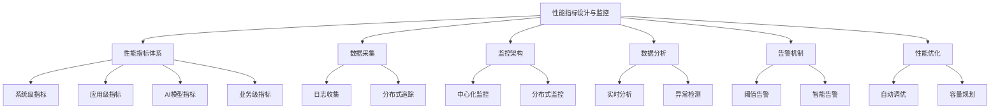
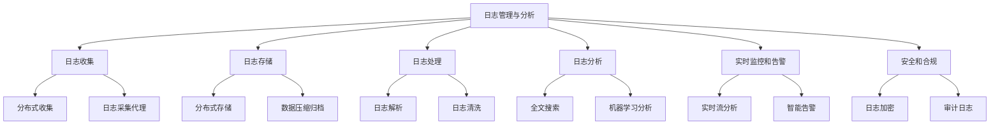
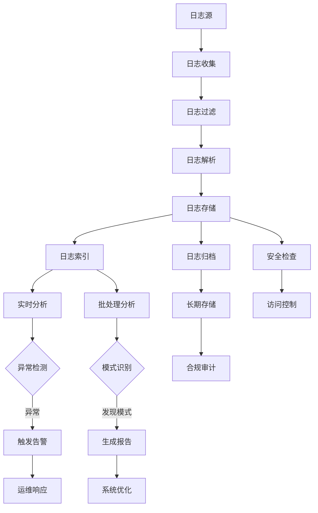
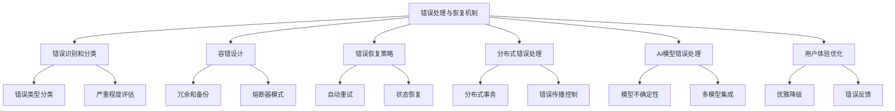
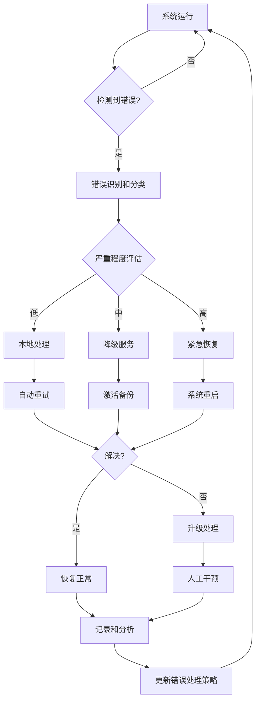
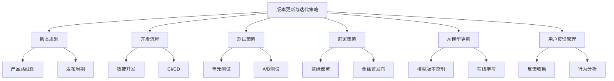
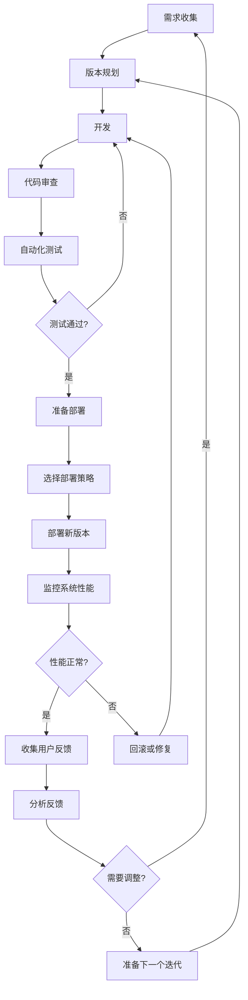

# 第14章：AI Agent 监控与维护

## 14.1 性能指标设计与监控

### 核心概念

性能指标设计与监控是AI Agent系统运维的关键环节，涉及定义、测量和跟踪系统的各项性能参数。这些指标不仅反映系统的健康状态和运行效率，还为系统优化和决策提供依据。有效的性能监控能够及时发现问题、预测潜在风险，并确保AI Agent持续提供高质量的服务。

### 问题背景

随着AI Agent在各行业的广泛应用，其性能直接影响用户体验和业务效果。然而，AI系统的复杂性和动态性使得传统的IT监控方法难以全面捕捉其性能特征。同时，AI模型的不透明性增加了性能评估的难度。此外，不同应用场景对性能的要求各不相同，需要定制化的指标体系。在这种背景下，设计全面而有针对性的性能指标，并实施有效的监控策略，成为AI Agent运维的重要挑战。

### 问题描述

1. 如何设计全面反映AI Agent性能的指标体系
2. 如何在不影响系统性能的前提下进行实时监控
3. 如何处理和分析大量的性能数据
4. 如何识别性能异常并进行根因分析
5. 如何设计适应不同应用场景的性能基准
6. 如何评估和监控AI模型的性能退化

### 问题解决

我们将从以下几个方面详细探讨性能指标设计与监控的实现：

1. 性能指标体系：
    - 系统级指标（CPU、内存、网络等）
    - 应用级指标（响应时间、吞吐量等）
    - AI模型指标（准确率、召回率、F1分数等）
    - 业务级指标（用户满意度、转化率等）

2. 数据采集：
    - 日志收集
    - 分布式追踪
    - 时序数据库
    - 采样策略

3. 监控架构：
    - 中心化监控
    - 分布式监控
    - 边缘监控
    - 多层次监控

4. 数据分析：
    - 实时分析
    - 批处理分析
    - 机器学习based异常检测
    - 可视化和报告

5. 告警机制：
    - 阈值based告警
    - 趋势based告警
    - 智能告警
    - 告警聚合和抑制

6. 性能优化：
    - 自动化性能调优
    - A/B测试
    - 容量规划
    - 性能瓶颈识别

### 边界与外延

虽然本节主要关注AI Agent的性能指标设计与监控，但这些概念和方法也适用于其他复杂系统的性能管理。此外，我们还将探讨如何将性能监控与其他运维实践（如安全监控、用户体验监控）结合，以及如何在不同部署环境（云、边缘、混合）中实施一致的监控策略。

### 概念结构与核心要素组成



### 概念之间的关系

| 组件 | 主要功能 | 输入 | 输出 | 与其他组件的关系 |
|------|---------|------|------|------------------|
| 性能指标体系 | 定义监控目标 | 系统需求 | 指标定义 | 指导数据采集和分析 |
| 数据采集 | 收集性能数据 | 原始数据 | 结构化数据 | 为数据分析提供输入 |
| 监控架构 | 组织监控系统 | 系统拓扑 | 监控部署 | 支持数据采集和分析 |
| 数据分析 | 处理性能数据 | 采集的数据 | 分析结果 | 为告警和优化提供依据 |
| 告警机制 | 发现异常 | 分析结果 | 告警信息 | 触发性能优化 |
| 性能优化 | 改善系统性能 | 分析和告警 | 优化方案 | 影响整体性能指标 |

### 算法流程图

AI Agent性能监控的基本流程```mermaid
graph TD
A[数据源] --> B[数据采集]
B --> C[数据预处理]
C --> D[实时分析]
C --> E[批处理分析]
D --> F{异常检测}
E --> F
F -->|正常| G[更新基线]
F -->|异常| H[触发告警]
H --> I[根因分析]
I --> J[自动修复]
I --> K[人工干预]
J --> L[性能优化]
K --> L
L --> M[更新监控策略]
M --> B
G --> N[性能报告生成]
N --> O[长期趋势分析]
O --> P[容量规划]
P --> M
```

### 算法源代码

以下是一个简化的AI Agent性能监控系统示例：

```python
import time
import random
from typing import Dict, List
import numpy as np
from sklearn.ensemble import IsolationForest

class PerformanceMetric:
    def __init__(self, name: str, unit: str):
        self.name = name
        self.unit = unit
        self.values: List[float] = []

    def add_value(self, value: float):
        self.values.append(value)

    def get_average(self) -> float:
        return np.mean(self.values) if self.values else 0

class AIAgent:
    def __init__(self):
        self.response_time = PerformanceMetric("Response Time", "ms")
        self.accuracy = PerformanceMetric("Accuracy", "%")
        self.cpu_usage = PerformanceMetric("CPU Usage", "%")

    def simulate_operation(self):
        # 模拟AI Agent的操作并生成性能指标
        self.response_time.add_value(random.uniform(10, 100))
        self.accuracy.add_value(random.uniform(80, 99))
        self.cpu_usage.add_value(random.uniform(20, 80))

class PerformanceMonitor:
    def __init__(self, agent: AIAgent):
        self.agent = agent
        self.anomaly_detector = IsolationForest(contamination=0.1)
        self.performance_history: List[List[float]] = []

    def collect_metrics(self) -> List[float]:
        return [
            self.agent.response_time.get_average(),
            self.agent.accuracy.get_average(),
            self.agent.cpu_usage.get_average()
        ]

    def detect_anomalies(self, metrics: List[float]) -> bool:
        self.performance_history.append(metrics)
        if len(self.performance_history) > 10:  # 需要足够的历史数据
            X = np.array(self.performance_history)
            self.anomaly_detector.fit(X)
            prediction = self.anomaly_detector.predict(X[-1].reshape(1, -1))
            return prediction[0] == -1  # -1 表示异常
        return False

    def generate_alert(self, metrics: List[float]):
        print("Performance Alert:")
        print(f"Response Time: {metrics[0]:.2f} ms")
        print(f"Accuracy: {metrics[1]:.2f} %")
        print(f"CPU Usage: {metrics[2]:.2f} %")

    def monitor(self, duration: int = 60, interval: int = 5):
        start_time = time.time()
        while time.time() - start_time < duration:
            self.agent.simulate_operation()
            metrics = self.collect_metrics()
            if self.detect_anomalies(metrics):
                self.generate_alert(metrics)
            time.sleep(interval)

# 使用示例
agent = AIAgent()
monitor = PerformanceMonitor(agent)
print("Starting performance monitoring...")
monitor.monitor(duration=60, interval=5)
print("Monitoring complete.")
```

### 实际场景应用

1. 智能客服系统：
    - 监控响应时间、问题解决率
    - 跟踪用户满意度和会话质量
    - 分析高峰期性能和资源利用

2. 推荐系统：
    - 监控推荐准确率和多样性
    - 跟踪点击率和转化率
    - 分析模型更新对性能的影响

3. 自动驾驶系统：
    - 监控决策速度和准确性
    - 跟踪传感器数据处理效率
    - 分析不同环境下的系统表现

4. 金融风控系统：
    - 监控欺诈检测准确率和召回率
    - 跟踪实时交易处理能力
    - 分析模型对新型欺诈的适应性

5. 智能制造系统：
    - 监控生产线预测准确性
    - 跟踪设备故障预警及时性
    - 分析AI优化对生产效率的影响

### 最佳实践 tips

1. 全面的指标体系：
    - 覆盖系统、应用、模型和业务层面
    - 包含leading和lagging指标
    - 定期review和更新指标体系

2. 实时监控与长期分析结合：
    - 实施实时性能监控for及时响应
    - 进行长期趋势分析for持续优化
    - 建立性能基线和动态阈值

3. 智能化告警：
    - 使用机器学习识别异常模式
    - 实施告警聚合减少噪音
    - 提供上下文信息辅助问题诊断

4. 自动化运维：
    - 实现自动化性能数据采集和分析
    - 开发自动化性能调优机制
    - 建立自动化容量规划流程

5. 可视化和报告：
    - 开发直观的性能仪表板
    - 提供多维度的性能报告
    - 支持交互式数据探索

6. 持续优化：
    - 实施A/B测试评估优化效果
    - 建立性能优化知识库
    - 定期进行性能review和优化

7. 安全性考虑：
    - 确保监控数据的安全性和隐私
    - 实施访问控制和审计机制
    - 考虑监控系统自身的性能影响

### 行业发展与未来趋势

| 时期 | 主要特征 | 关键技术 | 挑战 | 未来展望 |
|------|---------|----------|------|----------|
| 2018-2019 | 基础监控 | 日志分析、简单阈值告警 | 数据量大 | 智能化监控 |
| 2020-2021 | 分布式监控 | 追踪技术、时序数据库 | 系统复杂性 | 自动化运维 |
| 2022-2023 | AI驱动监控 | 机器学习异常检测、预测分析 | 实时性要求 | 自适应系统 |
| 2024-2025 (预测) | 自治监控 | AIOps、自我修复系统 | 可解释性 | 认知运维 |
| 2026+ (展望) | 智能协同 | 跨系统性能优化、意图驱动监控 | 伦理问题 | 全息感知系统 |

AI Agent性能指标设计与监控技术正在经历快速的演变。从早期的简单日志分析和阈值告警，到现在的AI驱动异常检测和预测性分析，我们看到了显著的进步。这些变化不仅提高了监控的效率和准确性，还改变了我们理解和管理复杂AI系统的方式。

未来的性能监控可能会更加注重以下几个方面：

1. 智能化和自适应：
    - 自学习性能模型，动态调整监控策略
    - 上下文感知的异常检测和根因分析
    - 预测性维护和自动化修复

2. 全栈可观测性：
    - 从硬件到应用层的一体化监控
    - 深入到AI模型内部的性能观测
    - 业务影响分析和关联

3. 分布式和边缘监控：
    - 适应云原生和边缘计算环境
    - 轻量级和高效的监控代理
    - 全局和局部性能优化的平衡

4. 用户体验导向：
    - 端到端用户体验监控
    - 实时用户满意度分析
    - 个性化性能优化建议

5. 安全性和隐私保护：
    - 隐私保护的性能数据收集
    - 安全态势感知与性能监控的融合
    - 合规性监控和自动报告生成

6. 跨系统协同优化：
    - 多AI Agent系统的整体性能优化
    - 跨组织的性能基准和最佳实践共享
    - 生态系统级的资源调度和负载均衡

7. 认知运维：
    - 意图驱动的性能管理
    - 自然语言交互的运维助手
    - 情境感知的决策支持系统

随着这些趋势的发展，AI Agent的性能监控将从被动的观察工具演变为主动的、智能的管理系统。未来的监控系统将能够更全面地理解AI Agent的行为和性能特征，提供更精准的诊断和优化建议，并实现高度自动化的性能管理。

这种进步将带来多方面的益处：

1. 提高系统可靠性：通过预测性维护减少故障。

2. 优化资源利用：实现更精细的资源分配和调度。

3. 增强用户体验：确保AI服务的一致性和高质量。

4. 加速创新：为AI系统的快速迭代提供支持。

5. 降低运维成本：通过自动化减少人工干预。

6. 提高决策质量：为管理者提供更全面的性能洞察。

7. 促进可持续发展：优化能源效率和资源使用。

然而，这种发展也带来了新的挑战，如如何处理海量的性能数据，如何在复杂的分布式环境中维护一致的监控质量，以及如何平衡性能监控的深度和系统的隐私保护。未来的监控系统需要在技术创新、用户体验、伦理考量和成本效益之间找到平衡，确保它们不仅技术先进，还能被广泛接受和信任。

总的来说，性能指标设计与监控将继续是AI Agent系统管理的核心组成部分。通过不断创新和优化，我们将能够构建更智能、更可靠的AI系统，为用户提供更好的服务，并推动整个行业向更加高效和可持续的方向发展。这不仅将改变我们管理AI系统的方式，还将为AI技术在各个领域的深入应用提供坚实的基础，最终推动社会和技术的进步。

## 14.2 日志管理与分析

### 核心概念

日志管理与分析是AI Agent系统运维和故障排查的关键环节，涉及日志的收集、存储、处理和分析。日志记录了系统运行的详细信息，包括事件、错误、性能指标等，是理解系统行为和诊断问题的重要数据源。有效的日志管理和分析可以帮助运维人员快速识别问题、预测潜在风险，并为系统优化提供依据。

### 问题背景

随着AI Agent系统的规模和复杂性不断增加，产生的日志数据量也呈指数级增长。这些日志来自不同的组件和层级，格式多样，内容复杂。传统的手动日志分析方法已经无法应对这种规模和复杂度。同时，AI系统的动态性和不确定性使得日志分析变得更加困难。此外，实时分析和异常检测的需求也在不断增加。在这种背景下，如何高效地管理和分析海量日志，从中提取有价值的信息，成为AI Agent运维的重要挑战。

### 问题描述

1. 如何高效收集和存储分布式系统的海量日志
2. 如何处理不同格式和结构的日志数据
3. 如何从海量日志中快速识别关键信息和异常模式
4. 如何实现实时日志分析和告警
5. 如何保证日志数据的完整性、安全性和合规性
6. 如何利用日志数据进行系统行为分析和性能优化

### 问题解决

我们将从以下几个方面详细探讨日志管理与分析的实现：

1. 日志收集：
    - 分布式日志收集架构
    - 日志采集代理
    - 日志流处理
    - 日志格式标准化

2. 日志存储：
    - 分布式存储系统
    - 日志压缩和归档
    - 数据分片和索引
    - 冷热数据分离

3. 日志处理：
    - 日志解析和结构化
    - 日志清洗和转换
    - 日志聚合和关联
    - 日志脱敏

4. 日志分析：
    - 全文搜索
    - 统计分析
    - 机器学习based异常检测
    - 日志可视化

5. 实时监控和告警：
    - 实时日志流分析
    - 模式匹配和规则引擎
    - 智能告警系统
    - 告警聚合和抑制

6. 安全和合规：
    - 日志加密和访问控制
    - 日志完整性保证
    - 审计日志
    - 合规性报告生成

### 边界与外延

虽然本节主要关注AI Agent系统的日志管理与分析，但这些概念和方法也广泛适用于其他复杂IT系统的日志处理。此外，我们还将探讨如何将日志分析与其他运维实践（如性能监控、安全分析）结合，以及如何在不同部署环境（云、边缘、混合）中实施统一的日志管理策略。

### 概念结构与核心要素组成



### 概念之间的关系

| 组件 | 主要功能 | 输入 | 输出 | 与其他组件的关系 |
|------|---------|------|------|------------------|
| 日志收集 | 采集系统日志 | 原始日志 | 结构化日志 | 为存储和处理提供数据 |
| 日志存储 | 保存日志数据 | 收集的日志 | 存储的日志 | 支持处理和分析 |
| 日志处理 | 清洗和转换日志 | 原始日志 | 处理后的日志 | 为分析准备数据 |
| 日志分析 | 提取有价值信息 | 处理后的日志 | 分析结果 | 支持监控和决策 |
| 实时监控和告警 | 及时发现问题 | 实时日志流 | 告警信息 | 触发运维响应 |
| 安全和合规 | 保护日志数据 | 全过程日志 | 安全报告 | 贯穿整个日志生命周期 |

### 算法流程图

AI Agent日志管理与分析的基本流程：



### 算法源代码

以下是一个简化的AI Agent日志管理与分析系统示例：

```python
import time
import random
from typing import List, Dict
from collections import defaultdict
import re

class LogEntry:
    def __init__(self, timestamp: float, level: str, message: str):
        self.timestamp = timestamp
        self.level = level
        self.message = message

class LogCollector:
    def __init__(self):
        self.logs: List[LogEntry] = []

    def collect(self, log: LogEntry):
        self.logs.append(log)

class LogProcessor:
    def __init__(self):
        self.patterns = {
            'error': r'error|exception|fail',
            'warning': r'warning|warn',
            'info': r'info|success'
        }

    def process(self, log: LogEntry) -> Dict[str, str]:
        processed = {
            'timestamp': time.strftime('%Y-%m-%d %H:%M:%S', time.localtime(log.timestamp)),
            'level': log.level,
            'message': log.message
        }
        for category, pattern in self.patterns.items():
            if re.search(pattern, log.message, re.IGNORECASE):
                processed['category'] = category
                break
        else:
            processed['category'] = 'other'
        return processed

class LogAnalyzer:
    def __init__(self):
        self.logs: List[Dict[str, str]] = []
        self.stats = defaultdict(int)

    def analyze(self, processed_logs: List[Dict[str, str]]):
        self.logs.extend(processed_logs)
        for log in processed_logs:
            self.stats[log['category']] += 1

    def get_summary(self) -> Dict[str, int]:
        return dict(self.stats)

    def detect_anomalies(self) -> List[Dict[str, str]]:
        # 简单的异常检测：如果错误日志数量突然增加
        error_threshold = 5  # 假设正常情况下错误数不超过5
        if self.stats['error'] > error_threshold:
            return [log for log in self.logs if log['category'] == 'error']
        return []

class LogManagementSystem:
    def __init__(self):
        self.collector = LogCollector()
        self.processor = LogProcessor()
        self.analyzer = LogAnalyzer()

    def generate_log(self):
        levels = ['INFO', 'WARNING', 'ERROR']
        messages = [
            'System started successfully',
            'Database connection established',
            'User login failed',
            'Memory usage high',
            'API request timeout',
            'Data processing completed'
        ]
        return LogEntry(
            timestamp=time.time(),
            level=random.choice(levels),
            message=random.choice(messages)
        )

    def run(self, duration: int = 60, interval: float = 0.5):
        start_time = time.time()
        while time.time() - start_time < duration:
            log = self.generate_log()
            self.collector.collect(log)
            time.sleep(interval)

        processed_logs = [self.processor.process(log) for log in self.collector.logs]
        self.analyzer.analyze(processed_logs)

        print("Log Summary:")
        for category, count in self.analyzer.get_summary().items():
            print(f"{category.capitalize()}: {count}")

        anomalies = self.analyzer.detect_anomalies()
        if anomalies:
            print("\nAnomalies Detected:")
            for anomaly in anomalies:
                print(f"{anomaly['timestamp']} - {anomaly['message']}")
        else:
            print("\nNo anomalies detected.")

# 使用示例
log_system = LogManagementSystem()
print("Starting log management system...")
log_system.run(duration=30, interval=0.2)
print("Log management complete.")
```

### 实际场景应用

1. 智能客服系统：
    - 分析用户交互日志识别常见问题
    - 监控系统响应时间和错误率
    - 追踪会话流程优化用户体验

2. 自动驾驶系统：
    - 分析传感器数据日志优化决策算法
    - 监控系统异常行为及时干预
    - 记录和分析事故相关数据

3. 金融交易系统：
    - 实时监控交易日志检测欺诈行为
    - 分析系统性能日志优化交易速度
    - 记录审计日志确保合规性

4. 智能制造系统：
    - 分析生产线日志预测设备故障
    - 监控质量控制日志优化生产流程
    - 追踪材料使用日志提高资源效率

5. 智能家居系统：
    - 分析用户行为日志个性化服务
    - 监控设备状态日志预防故障
    - 记录能源使用日志优化能效

### 最佳实践 tips

1. 统一日志格式：
    - 制定统一的日志格式标准
    - 使用结构化日志便于解析和分析
    - 包含关键信息如时间戳、级别、上下文等

2. 分布式日志收集：
    - 使用轻量级日志收集代理
    - 实现可靠的日志传输机制
    - 考虑网络带宽和存储成本

3. 智能日志分析：
    - 利用机器学习识别异常模式
    - 实施预测性分析预防问题
    - 建立日志关联分析深入理解系统行为

4. 实时监控和告警：
    - 设置多级告警阈值
    - 实现智能告警聚合减少噪音
    - 提供上下文信息辅助问题诊断

5. 日志安全和隐私：
    - 实施日志加密和访问控制
    - 进行日志脱敏保护敏感信息
    - 确保日志完整性和不可篡改性

6. 高效存储和检索：
    - 实施日志压缩和归档策略
    - 使用高效的索引机制
    - 实现冷热数据分离优化存储成本

7. 可视化和报告：
    - 开发直观的日志分析仪表板
    - 提供自定义报告生成功能
    - 支持交互式日志探索

### 行业发展与未来趋势

| 时期 | 主要特征 | 关键技术 | 挑战 | 未来展望 |
|------|---------|----------|------|----------|
| 2018-2019 | 集中式日志 | ELK栈、日志聚合 | 数据量大 | 分布式架构 |
| 2020-2021 | 分布式日志 | 微服务日志、追踪 | 复杂性管理 | 智能分析 |
| 2022-2023 | AI驱动分析 | 机器学习、异常检测 | 实时性要求 | 自动化运维 |
| 2024-2025 (预测) | 自适应日志 | AIOps、自我调整系统 | 隐私保护 | 认知日志分析 |
| 2026+ (展望) | 智能协同 | 跨系统日志关联、意图理解 | 伦理问题 | 自主决策系统 |

日志管理与分析技术正在经历快速的演变。从早期的简单文本日志和手动分析，到现在的结构化日志和AI驱动的自动化分析，我们看到了显著的进步。这些变化不仅提高了日志处理的效率和洞察力，还改变了我们理解和管理复杂系统的方式。

未来的日志管理与分析可能会更加注重以下几个方面：

1. 智能化和自适应：
    - 自学习日志模式，动态调整分析策略
    - 上下文感知的异常检测和根因分析
    - 预测性日志生成和分析

2. 全栈可观测性：
    - 日志、指标和追踪的深度集成
    - 从基础设施到业务层的端到端可视化
    - 智能关联分析across不同数据源

3. 隐私保护和合规：
    - 内置隐私保护机制的日志系统
    - 自动化合规性检查和报告生成
    - 基于区块链的不可篡改日志记录

4. 实时和流式处理：
    - 毫秒级的日志ingestion和分析
    - 复杂事件处理(CEP)集成
    - 流式机器学习模型for实时异常检测

5. 自然语言处理和交互：
    - 自然语言查询日志数据
    - 智能日志摘要和报告生成
    - 对话式日志分析助手

6. 分布式和边缘计算：
    - 边缘设备上的智能日志处理
    - 分布式日志分析和聚合
    - 跨云和多云环境的统一日志管理

7. 自动化运维和自愈：
    - 基于日志的自动问题诊断和修复
    - 智能配置管理和优化
    - 自适应系统行为调整

随着这些趋势的发展，日志管理与分析将从被动的记录工具演变为主动的、智能的系统洞察和管理平台。未来的日志系统将能够更全面地理解系统行为，提供更深入的诊断和预测，并实现高度自动化的问题解决和优化。

这种进步将带来多方面的益处：

1. 提高系统可靠性：通过预测性维护减少故障。

2. 增强安全性：更快速地检测和响应安全威胁。

3. 优化性能：通过深入的日志分析指导系统优化。

4. 改善用户体验：快速识别和解决影响用户的问题。

5. 降低运维成本：通过自动化减少人工干预。

6. 支持决策：为管理者提供数据驱动的洞察。

7. 促进创新：为系统行为分析提供丰富的数据源。

然而，这种发展也带来了新的挑战，如如何在保护隐私的同时最大化日志的价值，如何在海量数据中快速提取关键信息，以及如何确保日志系统本身的可靠性和安全性。未来的日志管理系统需要在数据价值、隐私保护、性能和成本之间找到平衡，确保它们不仅技术先进，还能被广泛接受和信任。

总的来说，日志管理与分析将继续是AI Agent系统运维和优化的核心支柱。通过不断创新和优化，我们将能够构建更智能、更可靠的系统，为用户提供更好的服务，并推动整个行业向更加高效和可持续的方向发展。这不仅将改变我们管理和优化AI系统的方式，还将为AI技术在各个领域的深入应用提供坚实的基础，最终推动社会和技术的进步。

## 14.3 错误处理与恢复机制

### 核心概念

错误处理与恢复机制是AI Agent系统可靠性和鲁棒性的关键组成部分。它涉及识别、管理和恢复系统中出现的各种错误和异常情况，以确保系统能够持续提供服务，并在出现问题时快速恢复正常运行。有效的错误处理和恢复机制不仅能够提高系统的可用性，还能增强用户体验和系统的整体性能。

### 问题背景

随着AI Agent系统在各行业的广泛应用，其复杂性和关键性不断增加。这些系统面临着多种潜在的错误源，包括硬件故障、软件bug、网络问题、数据异常、模型错误等。同时，AI系统的不确定性和黑盒特性增加了错误处理的难度。此外，在分布式和微服务架构中，错误可能会级联传播，造成更大范围的系统故障。在这种背景下，设计和实施robust的错误处理和恢复机制变得尤为重要。

### 问题描述

1. 如何全面识别和分类AI Agent系统中的潜在错误
2. 如何设计能够处理各种错误情况的容错机制
3. 如何实现快速和有效的错误恢复策略
4. 如何在分布式环境中协调错误处理和恢复
5. 如何处理AI模型特有的不确定性和错误
6. 如何在保证系统可用性的同时最小化错误对用户的影响

### 问题解决

我们将从以下几个方面详细探讨错误处理与恢复机制的实现：

1. 错误识别和分类：
    - 错误类型分类（系统错误、应用错误、模型错误等）
    - 错误严重程度评估
    - 错误模式分析
    - 异常检测算法

2. 容错设计：
    - 冗余和备份策略
    - 负载均衡
    - 熔断器模式
    - 降级策略

3. 错误恢复策略：
    - 自动重试机制
    - 回滚机制
    - 状态恢复
    - 热备份切换

4. 分布式错误处理：
    - 分布式事务管理
    - 一致性协议
    - 错误传播控制
    - 分布式日志和追踪

5. AI模型错误处理：
    - 模型不确定性量化
    - 多模型集成
    - 模型监控和动态调整
    - 人机协作错误处理

6. 用户体验优化：
    - 优雅降级
    - 错误反馈机制
    - 用户友好的错误信息
    - 自动化客户支持

### 边界与外延

虽然本节主要关注AI Agent系统的错误处理与恢复机制，但这些概念和方法也适用于其他复杂软件系统。此外，我们还将探讨如何将错误处理与其他系统设计原则（如可扩展性、安全性）结合，以及如何在不同部署环境（云、边缘、混合）中实施一致的错误处理策略。

### 概念结构与核心要素组成



### 概念之间的关系

| 组件 | 主要功能 | 输入 | 输出 | 与其他组件的关系 |
|------|---------|------|------|------------------|
| 错误识别和分类 | 检测和分类错误 | 系统状态 | 错误信息 | 为其他组件提供基础信息 |
| 容错设计 | 增强系统鲁棒性 | 系统架构 | 容错方案 | 与错误恢复策略协同工作 |
| 错误恢复策略 | 恢复正常运行 | 错误信息 | 恢复操作 | 依赖错误识别结果 |
| 分布式错误处理 | 协调多节点错误 | 分布式状态 | 一致性操作 | 影响整体系统恢复 |
| AI模型错误处理 | 处理模型特有错误 | 模型输出 | 修正策略 | 与一般错误处理集成 |
| 用户体验优化 | 最小化用户影响 | 错误状态 | 用户反馈 | 贯穿所有错误处理过程 |

### 算法流程图

AI Agent错误处理与恢复的基本流程：



### 算法源代码

以下是一个简化的AI Agent错误处理与恢复系统示例：

```python
import random
import time
from enum import Enum
from typing import List, Dict, Callable

class ErrorSeverity(Enum):
    LOW = 1
    MEDIUM = 2
    HIGH = 3

class Error:
    def __init__(self, message: str, severity: ErrorSeverity):
        self.message = message
        self.severity = severity

class AIAgent:
    def __init__(self):
        self.errors: List[Error] = []
        self.is_operational = True

    def perform_task(self) -> bool:
        if not self.is_operational:
            return False
        if random.random() < 0.1:  # 10% chance of error
            self.errors.append(Error("Task execution failed", ErrorSeverity(random.randint(1, 3))))
            return False
        return True

class ErrorHandler:
    def __init__(self, agent: AIAgent):
        self.agent = agent
        self.recovery_strategies: Dict[ErrorSeverity, Callable] = {
            ErrorSeverity.LOW: self.retry,
            ErrorSeverity.MEDIUM: self.degrade_service,
            ErrorSeverity.HIGH: self.restart_system
        }

    def handle_errors(self):
        for error in self.agent.errors:
            print(f"Handling error: {error.message} (Severity: {error.severity.name})")
            recovery_strategy = self.recovery_strategies[error.severity]
            if recovery_strategy():
                print("Error resolved")
            else:
                print("Error persists, escalating to human intervention")
        self.agent.errors.clear()

    def retry(self) -> bool:
        print("Retrying operation...")
        return self.agent.perform_task()

    def degrade_service(self) -> bool:
        print("Degrading service and activating backup...")
        time.sleep(1)  # Simulate activating backup
        return random.random() < 0.7  # 70% chance of successful degradation

    def restart_system(self) -> bool:
        print("Performing system restart...")
        self.agent.is_operational = False
        time.sleep(2)  # Simulate restart
        self.agent.is_operational = True
        return True

class ErrorMonitor:
    def __init__(self, agent: AIAgent, handler: ErrorHandler):
        self.agent = agent
        self.handler = handler

    def monitor(self, duration: int = 60):
        start_time = time.time()
        while time.time() - start_time < duration:
            if not self.agent.perform_task():
                self.handler.handle_errors()
            time.sleep(1)

# 使用示例
agent = AIAgent()
error_handler = ErrorHandler(agent)
monitor = ErrorMonitor(agent, error_handler)

print("Starting AI Agent with error handling...")
monitor.monitor(duration=30)
print("Monitoring complete.")
```

### 实际场景应用

1. 自动驾驶系统：
    - 传感器故障检测和冗余切换
    - 紧急情况下的安全降级模式
    - 实时错误报告和远程诊断

2. 金融交易系统：
    - 交易异常检测和自动回滚
    - 多级别的系统降级策略
    - 实时监控和人工干预机制

3. 智能医疗诊断：
    - 模型不确定性量化和多模型验证
    - 诊断结果的人机协作审核
    - 患者数据异常处理和隐私保护

4. 智能制造系统：
    - 生产线故障预测和预防性维护
    - 多级别的生产过程降级策略
    - 实时质量控制和错误追溯

5. 智能客服系统：
    - 对话异常检测和优雅降级
    - 情感分析错误处理和人工接管
    - 多语言支持的错误反馈机制

### 最佳实践 tips

1. 全面的错误分类：
    - 建立详细的错误分类体系
    - 实施自动化错误识别和分类
    - 定期更新错误模式库

2. 多层次的容错设计：
    - 实施冗余和负载均衡
    - 使用熔断器和舱壁模式
    - 设计灵活的降级策略

3. 智能化错误恢复：
    - 实现自适应重试机制
    - 使用机器学习优化恢复策略
    - 建立错误-解决方案知识库

4. 分布式协调：
    - 实施强一致性协议
    - 使用分布式事务管理
    - 实现跨服务的错误传播控制

5. AI模型特定处理：
    - 量化和管理模型不确定性
    - 实施模型性能监控和动态调整
    - 设计人机协作的错误处理流程

6. 用户中心的错误处理：
    - 提供清晰、有帮助的错误信息
    - 实施渐进式的用户体验降级
    - 建立用户反馈loop持续改进

7. 持续学习和改进：
    - 实施全面的错误日志和分析
    - 定期进行错误模式review和系统优化
    - 建立错误处理效果的量化评估机制

### 行业发展与未来趋势

| 时期 | 主要特征 | 关键技术 | 挑战 | 未来展望 |
|------|---------|----------|------|----------|
| 2018-2019 | 基础容错 | 重试机制、简单备份 | 单点故障 | 分布式容错 |
| 2020-2021 | 智能恢复 | 自适应重试、预测性维护 | 复杂依赖 | 自愈系统 |
| 2022-2023 | AI驱动处理 | 机器学习异常检测、自动诊断 | 模型不确定性 | 认知错误处理 |
| 2024-2025 (预测) | 自主决策 | 强化学习based恢复策略、意图理解 | 决策透明度 | 人机协作系统 |
| 2026+ (展望) | 生态系统级恢复 | 跨系统协同、自进化错误处理 | 伦理和责任 | 超级可靠AI |

错误处理与恢复机制正在经历快速的演变。从早期的简单重试和备份策略，到现在的AI驱动的智能错误处理和自愈系统，我们看到了显著的进步。这些变化不仅提高了系统的可靠性和鲁棒性，还改变了我们设计和管理复杂AI系统的方式。

未来的错误处理与恢复机制可能会更加注重以下几个方面：

1. 预测性和主动性：
    - 使用AI预测潜在故障和错误
    - 实施主动式错误预防措施
    - 动态调整系统配置以避免错误

2. 自适应和学习能力：
    - 错误处理策略的在线学习和优化
    - 基于历史数据的错误模式挖掘
    - 自动生成和测试新的恢复策略

3. 认知错误处理：
    - 理解错误的上下文和影响
    - 模拟人类专家的问题解决过程- 自然语言交互的错误诊断和修复

4. 分布式和边缘计算适应：
    - 边缘设备上的轻量级错误处理
    - 云边协同的错误检测和恢复
    - 跨地理位置的一致性错误处理

5. 安全性和隐私保护：
    - 错误处理过程中的数据安全保障
    - 隐私保护的错误日志和分析
    - 抵御利用系统错误的恶意攻击

6. 用户体验导向：
    - 个性化的错误反馈和恢复建议
    - 情感感知的用户交互during错误处理
    - 无缝的错误恢复和服务连续性

7. 跨系统协同：
    - 多AI Agent系统的协同错误处理
    - 跨组织的错误信息共享和协作恢复
    - 生态系统级的故障容错和恢复机制

随着这些趋势的发展，错误处理与恢复机制将从被动的防御措施演变为主动的、智能的系统管理组件。未来的系统将能够更全面地理解和预测错误，提供更精准和高效的恢复策略，并实现高度自动化的错误管理。

这种进步将带来多方面的益处：

1. 提高系统可靠性：通过预测和主动预防减少错误发生。

2. 加速恢复过程：智能化的错误诊断和恢复策略缩短停机时间。

3. 优化资源利用：精准的错误处理减少不必要的资源浪费。

4. 增强用户体验：更平滑和透明的错误处理过程。

5. 降低运维成本：自动化和智能化减少人工干预需求。

6. 支持创新：为更复杂和关键的AI应用提供可靠性保障。

7. 促进系统演进：通过持续学习和适应推动系统不断优化。

然而，这种发展也带来了新的挑战，如如何确保复杂AI系统的错误处理决策的可解释性和可审计性，如何在分布式环境中协调大规模的错误处理，以及如何平衡自动化错误处理与必要的人工监督。未来的错误处理系统需要在技术创新、系统可靠性、用户体验和伦理考量之间找到平衡，确保它们不仅技术先进，还能被广泛接受和信任。

总的来说，错误处理与恢复机制将继续是AI Agent系统可靠性和鲁棒性的核心支柱。通过不断创新和优化，我们将能够构建更加可靠、自适应和智能的系统，为用户提供更稳定和高质量的服务，并推动整个行业向更加成熟和可持续的方向发展。这不仅将改变我们设计和管理AI系统的方式，还将为AI技术在关键和高风险领域的应用铺平道路，最终推动社会和技术的进步。

## 14.4 版本更新与迭代策略

### 核心概念

版本更新与迭代策略是AI Agent系统持续优化和演进的关键过程。它涉及系统功能的增强、性能的改进、错误的修复，以及对新技术和用户需求的适应。有效的版本更新和迭代策略不仅能够保持系统的竞争力，还能确保系统的稳定性和可靠性。这个过程包括规划、开发、测试、部署和监控等多个环节，需要平衡创新、稳定性和用户体验。

### 问题背景

随着AI技术的快速发展和用户需求的不断变化，AI Agent系统面临着持续更新和优化的压力。同时，系统的复杂性增加了更新过程的风险和难度。在分布式和微服务架构中，版本管理和兼容性问题变得更加复杂。此外，AI模型的迭代也带来了独特的挑战，如模型性能的不确定性和数据依赖性。在这种背景下，设计一个既能快速响应变化，又能保证系统稳定性的版本更新和迭代策略变得尤为重要。

### 问题描述

1. 如何制定合理的版本更新计划，平衡新功能开发和系统稳定性
2. 如何管理复杂系统中的依赖关系和兼容性问题
3. 如何设计和实施无缝的更新部署流程，最小化服务中断
4. 如何有效管理和更新AI模型，包括模型版本控制和性能监控
5. 如何在快速迭代的同时保证代码质量和系统可靠性
6. 如何收集和利用用户反馈来指导版本更新和迭代

### 问题解决

我们将从以下几个方面详细探讨版本更新与迭代策略的实现：

1. 版本规划：
    - 产品路线图制定
    - 特性优先级排序
    - 发布周期管理
    - 版本命名和编号策略

2. 开发流程：
    - 敏捷开发方法论
    - 持续集成/持续部署(CI/CD)
    - 代码审查和质量控制
    - 测试驱动开发(TDD)

3. 测试策略：
    - 单元测试
    - 集成测试
    - 系统测试
    - A/B测试
    - 性能测试

4. 部署策略：
    - 蓝绿部署
    - 金丝雀发布
    - 滚动更新
    - 特性开关

5. AI模型更新：
    - 模型版本控制
    - 在线学习和模型更新
    - 模型性能监控
    - 模型回滚机制

6. 用户反馈管理：
    - 用户反馈收集系统
    - 用户行为分析
    - 客户支持集成
    - 社区驱动开发

### 边界与外延

虽然本节主要关注AI Agent系统的版本更新与迭代策略，但这些概念和方法也适用于其他复杂软件系统的开发和维护。此外，我们还将探讨如何将版本更新策略与其他系统管理实践（如性能优化、安全管理）结合，以及如何在不同部署环境（云、边缘、混合）中实施一致的更新策略。

### 概念结构与核心要素组成



### 概念之间的关系

| 组件 | 主要功能 | 输入 | 输出 | 与其他组件的关系 |
|------|---------|------|------|------------------|
| 版本规划 | 制定更新计划 | 市场需求、技术趋势 | 产品路线图 | 指导开发流程和测试策略 |
| 开发流程 | 实现新功能和改进 | 需求规格、代码 | 新版本软件 | 与测试策略紧密结合 |
| 测试策略 | 验证系统质量 | 软件版本 | 测试报告 | 影响部署决策 |
| 部署策略 | 安全发布新版本 | 验证后的版本 | 生产环境更新 | 依赖测试结果，影响用户体验 |
| AI模型更新 | 优化AI性能 | 新数据、算法改进 | 更新后的模型 | 与整体系统更新协调 |
| 用户反馈管理 | 收集用户意见 | 用户反馈 | 改进建议 | 影响版本规划和开发优先级 |

### 算法流程图

AI Agent版本更新与迭代的基本流程：



### 算法源代码

以下是一个简化的AI Agent版本更新与迭代系统示例：

```python
import random
from enum import Enum
from typing import List, Dict

class VersionStatus(Enum):
    PLANNING = 1
    DEVELOPMENT = 2
    TESTING = 3
    DEPLOYMENT = 4
    MONITORING = 5

class Feature:
    def __init__(self, name: str, priority: int):
        self.name = name
        self.priority = priority
        self.is_implemented = False
        self.is_tested = False

class Version:
    def __init__(self, number: str):
        self.number = number
        self.features: List[Feature] = []
        self.status = VersionStatus.PLANNING
        self.deployment_strategy = ""
        self.user_feedback: List[str] = []

class AIAgent:
    def __init__(self):
        self.current_version = "1.0.0"
        self.versions: Dict[str, Version] = {}

    def plan_version(self, version_number: str, features: List[Feature]):
        new_version = Version(version_number)
        new_version.features = features
        self.versions[version_number] = new_version
        print(f"Planned version {version_number} with {len(features)} features")

    def develop_version(self, version_number: str):
        version = self.versions[version_number]
        version.status = VersionStatus.DEVELOPMENT
        for feature in version.features:
            feature.is_implemented = True
        print(f"Developed version {version_number}")

    def test_version(self, version_number: str) -> bool:
        version = self.versions[version_number]
        version.status = VersionStatus.TESTING
        all_passed = True
        for feature in version.features:
            feature.is_tested = random.random() > 0.1  # 90% chance of passing
            all_passed &= feature.is_tested
        print(f"Tested version {version_number}. All tests passed: {all_passed}")
        return all_passed

    def deploy_version(self, version_number: str, strategy: str):
        version = self.versions[version_number]
        version.status = VersionStatus.DEPLOYMENT
        version.deployment_strategy = strategy
        self.current_version = version_number
        print(f"Deployed version {version_number} using {strategy} strategy")

    def monitor_version(self, version_number: str) -> bool:
        version = self.versions[version_number]
        version.status = VersionStatus.MONITORING
        is_stable = random.random() > 0.05  # 95% chance of stability
        print(f"Monitored version {version_number}. Stability: {is_stable}")
        return is_stable

    def collect_feedback(self, version_number: str, feedback: str):
        version = self.versions[version_number]
        version.user_feedback.append(feedback)
        print(f"Collected feedback for version {version_number}: {feedback}")

class VersionManager:
    def __init__(self, agent: AIAgent):
        self.agent = agent

    def run_iteration(self, new_version: str, features: List[Feature]):
        self.agent.plan_version(new_version, features)
        self.agent.develop_version(new_version)
        
        if self.agent.test_version(new_version):
            self.agent.deploy_version(new_version, "Blue-Green Deployment")
            if self.agent.monitor_version(new_version):
                self.agent.collect_feedback(new_version, "Users like the new features!")
            else:
                print(f"Rolling back to previous version due to instability")
                self.agent.current_version = self.get_previous_version(new_version)
        else:
            print(f"Version {new_version} failed testing. Needs rework.")

    def get_previous_version(self, version: str) -> str:
        parts = list(map(int, version.split('.')))
        parts[-1] -= 1
        return '.'.join(map(str, parts))

# 使用示例
agent = AIAgent()
manager = VersionManager(agent)

# 模拟几个迭代周期
for i in range(1, 4):
    new_version = f"1.0.{i}"
    features = [
        Feature(f"Feature A{i}", 1),
        Feature(f"Feature B{i}", 2),
        Feature(f"Feature C{i}", 3)
    ]
    print(f"\nStarting iteration for version {new_version}")
    manager.run_iteration(new_version, features)

print(f"\nFinal current version: {agent.current_version}")
```

### 实际场景应用

1. 智能助手系统：
    - 定期更新对话模型和知识库
    - 增加新的技能和集成第三方服务
    - 优化用户交互界面和体验
    - 实施A/B测试评估新功能效果

2. 自动驾驶系统：
    - 更新感知算法和决策模型
    - 增加新的驾驶场景和功能
    - 优化车辆控制和安全机制
    - 实施分阶段rollout策略

3. 金融交易系统：
    - 更新风险评估模型和交易算法
    - 增加新的金融产品和市场支持
    - 优化系统性能和安全机制
    - 实施严格的回归测试和模拟交易

4. 智能制造系统：
    - 更新生产调度算法和质量控制模型
    - 增加新的生产工艺和设备支持
    - 优化能源效率和维护预测
    - 实施分生产线的渐进式更新

5. 推荐系统：
    - 更新推荐算法和用户画像模型
    - 增加新的内容类型和个性化功能
    - 优化实时推荐性能和多样性
    - 实施特性开关和动态模型切换

### 最佳实践 tips

1. 持续集成和持续部署（CI/CD）：
    - 自动化构建、测试和部署流程
    - 实施代码质量检查和安全扫描
    - 使用环境隔离确保稳定性

2. 版本控制和分支策略：
    - 采用Git Flow或类似的分支管理策略
    - 实施语义化版本号（Semantic Versioning）
    - 使用feature flags控制功能发布

3. 测试策略：
    - 实施全面的自动化测试套件
    - 进行负载测试和性能基准测试
    - 使用混沌工程测试系统弹性

4. 灰度发布和金丝雀测试：
    - 逐步向用户群推出新版本
    - 监控关键指标进行实时评估
    - 准备快速回滚机制

5. 用户反馈循环：
    - 建立多渠道的用户反馈机制
    - 实施用户行为分析和A/B测试
    - 快速响应和迭代based on反馈

6. 文档和知识管理：
    - 维护详细的更新日志和API文档
    - 建立内部知识库记录决策和最佳实践
    - 提供清晰的升级指南for用户

7. 性能监控和优化：
    - 实施全面的性能监控系统
    - 定期进行性能审计和优化
    - 建立性能基准和回归测试

### 行业发展与未来趋势

| 时期 | 主要特征 | 关键技术 | 挑战 | 未来展望 |
|------|---------|----------|------|----------|
| 2018-2019 | 敏捷开发 | CI/CD、自动化测试 | 频繁发布 | 持续部署 |
| 2020-2021 | DevOps文化 | 容器化、微服务 | 系统复杂性 | AIOps |
| 2022-2023 | AI驱动开发 | 自动代码生成、智能测试 | 模型不确定性 | 自适应系统 |
| 2024-2025 (预测) | 自主优化 | 自我修复、动态重构 | 可解释性 | 认知系统工程 |
| 2026+ (展望) | 生态系统协同 | 跨系统演化、意图驱动开发 | 伦理和监管 | 超级智能系统 |

版本更新与迭代策略正在经历快速的演变。从传统的瀑布式开发到敏捷方法，再到现在的持续部署和AI驱动开发，我们看到了显著的进步。这些变化不仅提高了开发效率和系统质量，还改变了我们设计、构建和维护AI系统的方式。

未来的版本更新与迭代策略可能会更加注重以下几个方面：

1. 自适应和智能化：
    - 系统自主决定更新策略和时机
    - 智能化的代码重构和优化
    - 基于使用模式的自动功能调整

2. 持续学习和演进：
    - 实时模型更新和在线学习
    - 基于用户行为的动态功能调整
    - 自动生成和测试新功能

3. 生态系统协同：
    - 跨系统和服务的协调更新
    - 智能API版本管理和兼容性维护
    - 生态系统级的性能优化

4. 安全性和隐私保护：
    - 内置隐私保护的更新机制
    - 自动化安全漏洞检测和修复
    - 合规性自动检查和报告

5. 用户参与和共创：
    - 深度用户参与的开发过程
    - 基于群体智慧的功能优先级决策
    - 个性化的功能定制和更新

6. 认知系统工程：
    - 理解和模拟人类认知过程
    - 情境感知的系统行为调整
    - 自然语言驱动的系统演化

7. 可持续性和资源优化：
    - 能源效率驱动的更新策略
    - 自动化的资源分配和优化
    - 长期可持续性的架构设计

随着这些趋势的发展，版本更新与迭代策略将从人工驱动的过程演变为智能化、自主的系统演进机制。未来的系统将能够更敏捷地响应变化，更智能地进行自我优化，并与用户和环境进行更深入的交互。

这种进步将带来多方面的益处：

1. 提高开发效率：通过自动化和智能化减少人工工作。

2. 增强系统适应性：快速响应用户需求和环境变化。

3. 提升用户体验：提供更个性化和高质量的服务。

4. 优化资源利用：智能调度和分配系统资源。

5. 增强安全性：快速应对新的安全威胁。

6. 促进创新：为实验性功能提供低风险的测试环境。

7. 支持可持续发展：通过智能优化减少资源浪费。

然而，这种发展也带来了新的挑战，如如何确保自主系统的决策透明度和可控性，如何在快速迭代中保持系统的稳定性和一致性，以及如何平衡创新与用户习惯的保持。未来的版本更新与迭代策略需要在技术创新、用户体验、系统可靠性和伦理考量之间找到平衡，确保它们不仅技术先进，还能被广泛接受和信任。

总的来说，版本更新与迭代策略将继续是AI Agent系统发展的核心驱动力。通过不断创新和优化，我们将能够构建更加智能、灵活和可持续的系统，为用户提供持续改进的服务，并推动整个行业向更加成熟和负责任的方向发展。这不仅将改变我们开发和维护AI系统的方式，还将为AI技术在各个领域的深入应用和持续创新铺平道路，最终推动社会和技术的进步。
