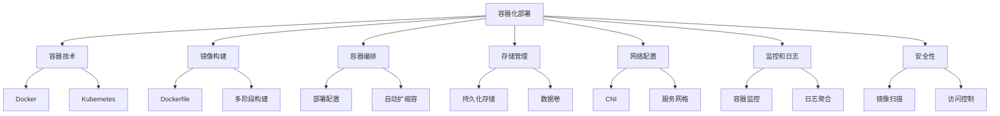
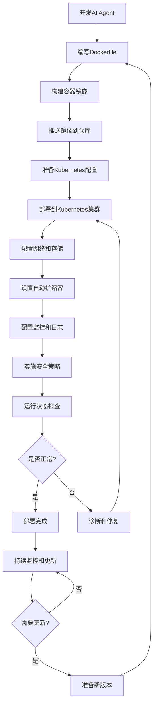
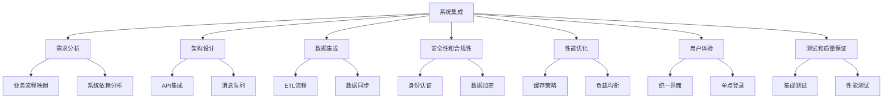
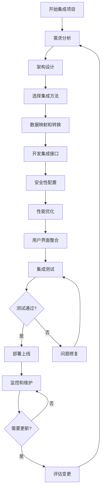
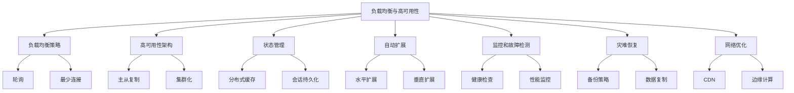
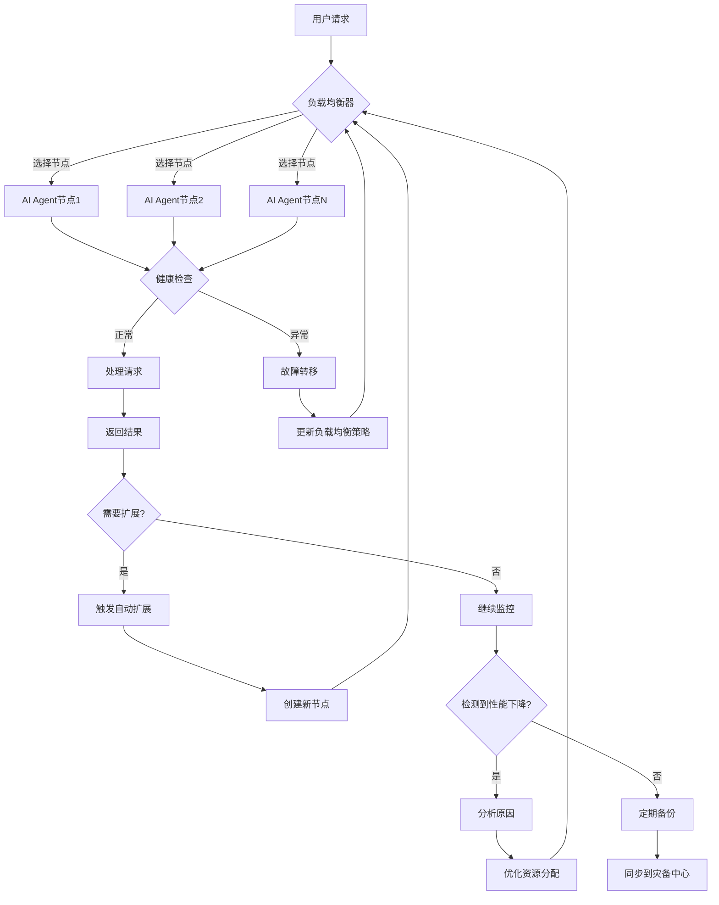

# 第15章：AI Agent 部署与集成

## 15.1 容器化部署

### 核心概念

容器化部署是一种将应用程序及其依赖项打包到一个独立的单元（称为容器）中的软件部署方法。这种方法可以确保应用程序在不同的计算环境中一致地运行。对于AI Agent系统，容器化部署提供了一种灵活、可扩展且易于管理的方式来部署复杂的AI模型和相关服务。

### 问题背景

随着AI Agent系统变得越来越复杂，传统的部署方法面临着诸多挑战：环境依赖问题、资源隔离、扩展性限制、版本控制困难等。同时，AI系统often需要在不同的环境（开发、测试、生产）之间快速迁移，并且可能需要在云、边缘设备等多种平台上运行。在这种背景下，容器化技术为AI Agent的部署提供了一个强大的解决方案。

### 问题描述

1. 如何有效管理AI Agent的复杂依赖关系
2. 如何确保AI系统在不同环境中的一致性运行
3. 如何实现AI Agent的快速部署和扩展
4. 如何优化AI系统的资源利用
5. 如何简化AI Agent的版本控制和回滚过程
6. 如何在多种计算平台上统一部署AI Agent

### 问题解决

我们将从以下几个方面详细探讨AI Agent的容器化部署实现：

1. 容器技术选择：
    - Docker容器
    - Kubernetes编排
    - 容器运行时（如containerd、CRI-O）

2. 镜像构建：
    - Dockerfile最佳实践
    - 多阶段构建
    - 基础镜像优化

3. 容器编排和管理：
    - Kubernetes部署配置
    - 服务发现和负载均衡
    - 自动扩缩容

4. 存储和数据管理：
    - 持久化存储
    - 数据卷管理
    - 状态管理

5. 网络配置：
    - 容器网络接口（CNI）
    - 服务网格（如Istio）
    - 网络策略

6. 监控和日志：
    - 容器级监控
    - 日志聚合
    - 分布式追踪

7. 安全性：
    - 镜像扫描
    - 运行时安全
    - 访问控制和认证

### 边界与外延

虽然本节主要关注AI Agent的容器化部署，但这些概念和方法也适用于其他复杂软件系统的部署。此外，我们还将探讨如何将容器化部署与云原生技术、微服务架构、DevOps实践等结合，以及如何在边缘计算和IoT场景中应用容器化技术。

### 概念结构与核心要素组成



### 概念之间的关系

| 组件 | 主要功能 | 输入 | 输出 | 与其他组件的关系 |
|------|---------|------|------|------------------|
| 容器技术 | 提供隔离环境 | 应用程序 | 容器 | 为其他所有组件提供基础 |
| 镜像构建 | 创建应用镜像 | 源代码、依赖 | 容器镜像 | 为容器运行提供基础 |
| 容器编排 | 管理容器集群 | 容器镜像、配置 | 运行中的服务 | 协调其他所有组件 |
| 存储管理 | 提供数据持久化 | 数据 | 持久化存储 | 支持有状态服务 |
| 网络配置 | 处理容器通信 | 网络策略 | 连接的容器 | 影响所有组件间通信 |
| 监控和日志 | 收集运行信息 | 系统状态 | 监控数据、日志 | 覆盖所有其他组件 |
| 安全性 | 保护系统安全 | 安全策略 | 安全的运行环境 | 贯穿整个部署过程 |

### 算法流程图

AI Agent容器化部署的基本流程：



### 算法源代码

以下是一个简化的AI Agent容器化部署示例，包括Dockerfile和Kubernetes配置：

```python
# Dockerfile
FROM python:3.8-slim

WORKDIR /app

COPY requirements.txt .
RUN pip install --no-cache-dir -r requirements.txt

COPY . .

EXPOSE 8080

CMD ["python", "ai_agent.py"]

---
# Kubernetes Deployment YAML
apiVersion: apps/v1
kind: Deployment
metadata:
  name: ai-agent
spec:
  replicas: 3
  selector:
    matchLabels:
      app: ai-agent
  template:
    metadata:
      labels:
        app: ai-agent
    spec:
      containers:
      - name: ai-agent
        image: your-registry/ai-agent:v1
        ports:
        - containerPort: 8080
        resources:
          limits:
            cpu: "1"
            memory: "1Gi"
          requests:
            cpu: "500m"
            memory: "512Mi"
        env:
        - name: MODEL_PATH
          value: "/models/ai_model.pkl"
        volumeMounts:
        - name: model-storage
          mountPath: /models
      volumes:
      - name: model-storage
        persistentVolumeClaim:
          claimName: ai-model-pvc

---
# Kubernetes Service YAML
apiVersion: v1
kind: Service
metadata:
  name: ai-agent-service
spec:
  selector:
    app: ai-agent
  ports:
    - protocol: TCP
      port: 80
      targetPort: 8080
  type: LoadBalancer

---
# Kubernetes HorizontalPodAutoscaler YAML
apiVersion: autoscaling/v2beta1
kind: HorizontalPodAutoscaler
metadata:
  name: ai-agent-hpa
spec:
  scaleTargetRef:
    apiVersion: apps/v1
    kind: Deployment
    name: ai-agent
  minReplicas: 3
  maxReplicas: 10
  metrics:
  - type: Resource
    resource:
      name: cpu
      targetAverageUtilization: 70
```

这个示例包括：
1. 一个基本的Dockerfile，用于构建AI Agent的容器镜像。
2. Kubernetes Deployment配置，定义了如何部署AI Agent。
3. Kubernetes Service配置，为AI Agent创建一个负载均衡器。
4. Kubernetes HorizontalPodAutoscaler配置，实现基于CPU使用率的自动扩缩容。

### 实际场景应用

1. 大规模机器学习模型服务：
    - 部署多个模型版本for A/B测试
    - 根据负载自动扩展推理服务
    - 管理模型更新和回滚

2. 分布式AI训练系统：
    - 容器化GPU训练环境
    - 动态分配计算资源
    - 协调多节点训练任务

3. 边缘AI部署：
    - 轻量级容器for资源受限设备
    - 边缘节点的远程管理和更新
    - 边缘-云协同计算

4. 智能客服系统：
    - 多语言模型的并行部署
    - 会话状态的持久化存储
    - 实时负载均衡和扩展

5. 实时推荐系统：
    - 特征工程和模型推理的分布式部署
    - 缓存层的容器化管理
    - 用户数据的安全存储和处理

### 最佳实践 tips

1. 镜像优化：
    - 使用多阶段构建减小镜像大小
    - 选择适当的基础镜像（如alpine版本）
    - 合理组织层以利用缓存

2. 资源管理：
    - 设置合理的资源请求和限制
    - 使用节点亲和性优化资源分配
    - 实施Pod优先级和抢占策略

3. 状态管理：
    - 使用StatefulSets for有状态应用
    - 实施适当的备份和恢复策略
    - 考虑使用分布式存储解决方案

4. 网络优化：
    - 使用服务网格for复杂的微服务架构
    - 实施网络策略增强安全性
    - 优化DNS解析和服务发现

5. 监控和日志：
    - 实施全面的监控策略（如Prometheus + Grafana）
    - 集中化日志管理（如ELK栈）
    - 使用分布式追踪（如Jaeger）for性能分析

6. 安全最佳实践：
    - 定期更新和扫描容器镜像
    - 实施最小权限原则
    - 使用secret管理敏感信息

7. CI/CD集成：
    - 自动化构建和部署流程
    - 实施金丝雀发布或蓝绿部署
    - 使用GitOps方法管理配置

### 行业发展与未来趋势

| 时期 | 主要特征 | 关键技术 | 挑战 | 未来展望 |
|------|---------|----------|------|----------|
| 2018-2019 | 容器采用 | Docker、基本K8s | 学习曲线 | 标准化部署 |
| 2020-2021 | 云原生 | 服务网格、无服务器 | 复杂性管理 | 简化操作 |
| 2022-2023 | AI特化 | GPU支持、专用调度器 | 资源优化 | 智能化运维 |
| 2024-2025 (预测) | 边缘AI | 轻量级容器、5G集成 | 安全性 | 无处不在的AI |
| 2026+ (展望) | 自主系统 | 自优化容器、量子计算集成 | 伦理问题 | AI生态系统 |

AI Agent的容器化部署技术正在经历快速的演变。从早期的简单容器化到现在的云原生和AI特化解决方案，我们看到了显著的进步。这些变化不仅提高了部署的效率和灵活性，还改变了我们设计和管理AI系统的方式。

未来的AI Agent容器化部署可能会更加注重以下几个方面：

1. 智能化和自适应：
    - 自动化资源分配和优化
    - 智能负载均衡和流量管理
    - 自我修复和自我优化的容器系统

2. 边缘计算集成：
    - 轻量级边缘容器解决方案
    - 边缘-云无缝协作部署
    - 5G网络优化的容器通信

3. 安全性和隐私保护：
    - 内置隐私保护的容器运行时
    - 基于AI的容器安全监控和威胁检测
    - 零信任架构的容器网络

4. 性能优化：
    - 专为AI工作负载优化的容器运行时
    - 硬件加速（如GPU、TPU）的深度集成
    - 超低延迟的容器间通信

5. 跨平台和混合云部署：
    - 统一的多云容器管理平台
    - 智能的跨环境工作负载调度
    - 无缝的公有云-私有云-边缘部署

6. 开发者体验提升：
    - 更直观的容器化AI开发工具
    - AI辅助的容器配置和优化
    - 无代码/低代码的容器化部署平台

7. 可持续性和绿色计算：
    - 能源效率优化的容器调度
    - 碳足迹感知的部署策略
    - 可再生能源驱动的容器集群

随着这些趋势的发展，AI Agent的容器化部署将从单纯的技术工具演变为智能化、自主的系统管理平台。未来的容器化系统将能够更好地理解和适应AI工作负载的特性，提供更高效、更安全、更灵活的部署和运行环境。

这种进步将带来多方面的益处：

1. 提高部署效率：通过自动化和智能化大幅减少人工操作。

2. 优化资源利用：实现更精细和动态的资源分配。

3. 增强系统弹性：提高系统的自我修复和适应能力。

4. 简化管理复杂性：通过智能化工具降低运维难度。

5. 提升安全性：实现更全面和主动的安全防护。

6. 支持创新：为AI技术的快速迭代和实验提供理想平台。

7. 促进可持续发展：通过智能化管理减少能源消耗和碳排放。

然而，这种发展也带来了新的挑战，如如何确保复杂AI系统在容器环境中的一致性和可预测性，如何在边缘设备的资源限制下优化容器性能，以及如何在保护隐私和数据安全的同时实现高效的分布式AI计算。未来的容器化部署解决方案需要在技术创新、系统可靠性、安全性和可持续性之间找到平衡，确保它们不仅技术先进，还能被广泛接受和信任。

总的来说，容器化部署将继续是AI Agent系统部署和管理的核心技术。通过不断创新和优化，我们将能够构建更加智能、灵活和高效的AI系统，为用户提供更好的服务，并推动整个行业向更加成熟和负责任的方向发展。这不仅将改变我们部署和运行AI系统的方式，还将为AI技术在各个领域的深入应用和持续创新铺平道路，最终推动社会和技术的进步。

## 15.2 云平台部署方案

### 核心概念

云平台部署方案是指利用云计算服务提供商的基础设施、平台和服务来部署、运行和管理AI Agent系统的策略和方法。这种方案允许组织利用云的弹性、可扩展性和丰富的服务生态系统，以更高效、更经济的方式部署和运营AI系统。云平台部署涉及IaaS（基础设施即服务）、PaaS（平台即服务）和SaaS（软件即服务）等多个层面，为AI Agent提供了从基础计算资源到高级AI服务的全方位支持。

### 问题背景

随着AI技术的快速发展和应用场景的不断扩大，传统的本地部署方式面临着诸多挑战：高昂的硬件成本、有限的可扩展性、复杂的维护需求等。同时，AI系统often需要大量的计算资源、灵活的存储方案和先进的数据处理能力。在这种背景下，云平台凭借其强大的基础设施、丰富的服务选项和灵活的计费模式，为AI Agent的部署提供了一个理想的解决方案。

### 问题描述

1. 如何选择适合AI Agent需求的云服务提供商和服务类型
2. 如何设计可扩展且高效的云架构for AI系统
3. 如何管理和优化云资源使用，控制成本
4. 如何确保云环境中AI系统的安全性和数据隐私
5. 如何实现本地环境和云环境之间的无缝集成
6. 如何利用云平台的高级AI服务增强AI Agent的能力

### 问题解决

我们将从以下几个方面详细探讨AI Agent的云平台部署方案：

1. 云服务选择：
    - 公有云vs私有云vs混合云
    - 主要云服务提供商比较（AWS、Azure、GCP等）
    - 服务模型选择（IaaS、PaaS、SaaS）

2. 架构设计：
    - 微服务架构
    - 无服务器计算
    - 容器化和容器编排

3. 资源管理：
    - 自动扩缩容
    - 负载均衡
    - 成本优化策略

4. 数据管理：
    - 云存储解决方案
    - 数据库选择（SQL vs NoSQL）
    - 大数据处理服务

5. 安全和合规：
    - 身份和访问管理
    - 加密和密钥管理
    - 合规性和治理

6. AI和机器学习服务：
    - 云端AI开发平台
    - 预训练模型和API服务
    - 分布式训练和推理服务

7. 监控和运维：
    - 云原生监控工具
    - 日志管理和分析
    - DevOps和CI/CD集成

### 边界与外延

虽然本节主要关注AI Agent的云平台部署，但这些概念和方法也适用于其他类型的应用和服务的云部署。此外，我们还将探讨如何将云部署与边缘计算、物联网（IoT）等技术结合，以及如何在多云和混合云环境中实现AI Agent的部署和管理。

### 概念结构与核心要素组成

```mermaid
graph TD
    A[云平台部署方案] --> B[云服务选择]
    A --> C[架构设计]
    A --> D[资源管理]
    A --> E[数据管理]
    A --> F[安全和合规]
    A --> G[AI和ML服务]
    A --> H[监控和运维]
    B --> I[公有云]
    B --> J[私有云]
    B --> K[混合云]
    C --> L[微服务]
    C --> M[无服务器]
    D --> N[自动扩缩容]
    D --> O[负载均衡]
    E --> P[云存储]
    E --> Q[数据库]
    F --> R[身份管理]
    F--> S[加密]
    G --> T[AI平台]
    G --> U[预训练模型]
    H --> V[监控工具]
    H --> W[CI/CD]

### 概念之间的关系

| 组件 | 主要功能 | 输入 | 输出 | 与其他组件的关系 |
|------|---------|------|------|------------------|
| 云服务选择 | 确定部署环境 | 需求规格 | 云服务方案 | 影响所有其他组件的实现 |
| 架构设计 | 定义系统结构 | 系统需求 | 架构方案 | 指导资源和数据管理 |
| 资源管理 | 优化资源使用 | 负载情况 | 资源分配 | 与架构设计和成本控制相关 |
| 数据管理 | 处理数据存储和访问 | 数据需求 | 存储方案 | 影响系统性能和安全性 |
| 安全和合规 | 保护系统和数据 | 安全需求 | 安全措施 | 贯穿所有其他组件 |
| AI和ML服务 | 提供AI能力 | 模型和数据 | AI功能 | 与架构设计和数据管理紧密相连 |
| 监控和运维 | 确保系统健康 | 系统状态 | 运维操作 | 覆盖所有其他组件 |

### 算法流程图

AI Agent云平台部署的基本流程：

```mermaid
graph TD
    A[需求分析] --> B[选择云服务提供商]
    B --> C[设计系统架构]
    C --> D[资源规划]
    D --> E[数据迁移和管理]
    E --> F[配置安全措施]
    F --> G[部署AI模型和服务]
    G --> H[设置监控和告警]
    H --> I[性能测试]
    I --> J{满足需求?}
    J -->|是| K[正式上线]
    J -->|否| L[优化调整]
    L --> D
    K --> M[持续监控和维护]
    M --> N{需要更新?}
    N -->|是| O[规划更新]
    O --> C
    N -->|否| M
```

### 算法源代码

以下是一个简化的AI Agent云平台部署示例，使用AWS服务：

```python
import boto3
import json

class AWSAIAgentDeployer:
    def __init__(self, region_name):
        self.ec2 = boto3.client('ec2', region_name=region_name)
        self.s3 = boto3.client('s3', region_name=region_name)
        self.sagemaker = boto3.client('sagemaker', region_name=region_name)

    def create_ec2_instance(self, instance_type, ami_id):
        response = self.ec2.run_instances(
            ImageId=ami_id,
            InstanceType=instance_type,
            MinCount=1,
            MaxCount=1
        )
        return response['Instances'][0]['InstanceId']

    def create_s3_bucket(self, bucket_name):
        self.s3.create_bucket(Bucket=bucket_name)

    def upload_to_s3(self, file_name, bucket_name, object_name):
        self.s3.upload_file(file_name, bucket_name, object_name)

    def create_sagemaker_endpoint(self, model_name, instance_type):
        # 假设模型已经在S3上
        model_data = f's3://{bucket_name}/{model_name}.tar.gz'
        
        # 创建模型
        self.sagemaker.create_model(
            ModelName=model_name,
            PrimaryContainer={
                'Image': '...', # SageMaker 容器镜像 URI
                'ModelDataUrl': model_data
            },
            ExecutionRoleArn='...' # SageMaker 执行角色 ARN
        )

        # 创建端点配置
        self.sagemaker.create_endpoint_config(
            EndpointConfigName=f'{model_name}-config',
            ProductionVariants=[{
                'InstanceType': instance_type,
                'InitialInstanceCount': 1,
                'ModelName': model_name,
                'VariantName': 'AllTraffic'
            }]
        )

        # 创建端点
        self.sagemaker.create_endpoint(
            EndpointName=f'{model_name}-endpoint',
            EndpointConfigName=f'{model_name}-config'
        )

    def deploy(self, config):
        instance_id = self.create_ec2_instance(config['instance_type'], config['ami_id'])
        print(f"EC2 instance created: {instance_id}")

        self.create_s3_bucket(config['bucket_name'])
        print(f"S3 bucket created: {config['bucket_name']}")

        self.upload_to_s3(config['model_file'], config['bucket_name'], config['model_name'])
        print(f"Model uploaded to S3")

        self.create_sagemaker_endpoint(config['model_name'], config['sagemaker_instance_type'])
        print(f"SageMaker endpoint created: {config['model_name']}-endpoint")

# 使用示例
deployer = AWSAIAgentDeployer('us-west-2')
config = {
    'instance_type': 't2.micro',
    'ami_id': 'ami-12345678',
    'bucket_name': 'my-ai-agent-bucket',
    'model_file': 'local_model.tar.gz',
    'model_name': 'my-ai-model',
    'sagemaker_instance_type': 'ml.t2.medium'
}
deployer.deploy(config)
```

这个示例展示了如何使用AWS SDK (boto3) 来部署一个基本的AI Agent系统，包括创建EC2实例、S3存储和SageMaker端点。

### 实际场景应用

1. 大规模自然语言处理服务：
    - 使用云端GPU集群进行模型训练
    - 部署弹性推理端点处理变化的负载
    - 利用云存储管理大量文本数据

2. 智能客户服务平台：
    - 部署多区域的对话AI服务
    - 使用云数据库存储客户交互历史
    - 集成云端分析服务优化客户体验

3. 计算机视觉应用：
    - 利用云GPU进行实时图像处理
    - 使用对象存储服务管理大量图像和视频数据
    - 部署边缘计算节点处理本地视频流

4. 金融风险评估系统：
    - 使用高性能计算集群进行复杂模型训练
    - 部署安全的私有云环境保护敏感数据
    - 利用云端大数据服务进行实时市场分析

5. IoT设备管理平台：
    - 使用云端消息队列服务处理设备数据
    - 部署无服务器函数处理设备事件
    - 利用时序数据库存储和分析设备遥测数据

### 最佳实践 tips

1. 多区域部署：
    - 利用地理分布式架构提高可用性
    - 实施跨区域负载均衡
    - 考虑数据主权和合规性要求

2. 自动化部署：
    - 使用基础设施即代码（IaC）工具如Terraform
    - 实施持续集成和持续部署（CI/CD）流程
    - 自动化配置管理和环境一致性检查

3. 成本优化：
    - 利用预留实例和Spot实例降低成本
    - 实施自动扩缩容以匹配实际负载
    - 定期审查和优化资源使用

4. 安全最佳实践：
    - 实施最小权限原则
    - 使用多因素认证和加密
    - 定期进行安全审计和渗透测试

5. 性能优化：
    - 使用内容分发网络（CDN）加速全球访问
    - 优化数据库查询和索引
    - 利用缓存服务提高响应速度

6. 监控和日志：
    - 实施全面的监控策略，包括应用和基础设施
    - 集中化日志管理和分析
    - 设置智能告警和自动化响应机制

7. 灾难恢复：
    - 实施跨区域备份策略
    - 定期测试恢复流程
    - 制定和维护详细的灾难恢复计划

### 行业发展与未来趋势

| 时期 | 主要特征 | 关键技术 | 挑战 | 未来展望 |
|------|---------|----------|------|----------|
| 2018-2019 | 云迁移 | IaaS、基本PaaS | 技能gap | 云原生应用 |
| 2020-2021 | 云原生 | 容器、微服务 | 复杂性管理 | 无服务器架构 |
| 2022-2023 | AI云服务 | MLaaS、AutoML | 模型管理 | 边缘AI |
| 2024-2025 (预测) | 混合云AI | 跨云管理、联邦学习 | 数据隐私 | 自主优化系统 |
| 2026+ (展望) | 智能云 | 认知计算、量子云 | 伦理和监管 | 泛在AI |

AI Agent的云平台部署正在经历快速的演变。从早期的简单IaaS迁移到现在的云原生AI服务，我们看到了显著的进步。这些变化不仅提高了部署的效率和灵活性，还改变了我们设计和管理AI系统的方式。

未来的AI Agent云平台部署可能会更加注重以下几个方面：

1. 智能化和自动化：
    - AI驱动的云资源管理和优化
    - 自适应的系统配置和扩展
    - 智能故障预测和自我修复

2. 边缘计算集成：
    - 云边协同的AI部署架构
    - 实时边缘推理与云端训练的无缝结合
    - 5G网络支持的低延迟AI服务

3. 多云和混合云策略：
    - 跨云平台的统一管理和部署
    - 智能工作负载分配和数据同步
    - 云间AI模型和数据的安全迁移

4. 强化安全和隐私：
    - 基于AI的安全威胁检测和响应
    - 隐私保护AI计算（如联邦学习、同态加密）
    - 合规性自动化管理和审计

5. 可持续性和绿色计算：
    - 能源效率优化的AI工作负载调度
    - 碳足迹感知的云资源分配
    - 可再生能源驱动的AI计算集群

6. 高级AI服务生态：
    - 即插即用的AI模型市场
    - 领域特定的预训练模型和服务
    - AI模型的版本控制和生命周期管理

7. 量子计算集成：
    - 混合经典-量子AI算法的云服务
    - 量子机器学习即服务（QMLaaS）
    - 量子安全的云AI部署

随着这些趋势的发展，AI Agent的云平台部署将从单纯的基础设施提供演变为智能化、自主的AI生态系统。未来的云平台将能够更好地理解和适应AI工作负载的特性，提供更高效、更安全、更灵活的部署和运行环境。

这种进步将带来多方面的益处：

1. 加速创新：通过即用即取的AI服务降低创新门槛。

2. 提高效率：智能化的资源管理大幅提升运营效率。

3. 增强可扩展性：无缝的全球部署支持快速业务扩张。

4. 强化安全性：AI驱动的安全措施提供更全面的保护。

5. 降低成本：精细化的资源优化减少不必要的开支。

6. 提升可持续性：智能调度和绿色计算减少环境影响。

7. 支持复杂AI应用：高级云服务使复杂AI系统的部署变得可行。

然而，这种发展也带来了新的挑战，如如何在多云环境中保持一致的性能和安全标准，如何管理日益复杂的AI服务依赖关系，以及如何在全球化部署中应对不同地区的法规要求。未来的云平台部署解决方案需要在技术创新、系统可靠性、安全性、合规性和可持续性之间找到平衡，确保它们不仅技术先进，还能被广泛接受和信任。

总的来说，云平台部署将继续是AI Agent系统实现和扩展的关键推动力。通过不断创新和优化，我们将能够构建更加智能、灵活和高效的AI系统，为用户提供更好的服务，并推动整个行业向更加成熟和负责任的方向发展。这不仅将改变我们部署和运行AI系统的方式，还将为AI技术在各个领域的深入应用和持续创新铺平道路，最终推动社会和技术的进步。

## 15.3 与现有系统集成

### 核心概念

与现有系统集成是指将新开发的AI Agent系统无缝地融入组织已有的IT基础设施和业务流程中的过程。这涉及技术、数据、流程和组织文化等多个层面的协调和整合。有效的系统集成不仅能够充分利用现有资源，还能够提高整体系统的效率和价值，同时最小化对现有业务运营的干扰。

###问题背景

随着AI技术的快速发展，许多组织开始引入AI Agent系统来增强其业务能力。然而，这些新系统并非在真空中运作，而是需要与现有的企业资源规划（ERP）系统、客户关系管理（CRM）系统、数据仓库、遗留应用程序等进行集成。这种集成面临着诸多挑战，如技术栈的差异、数据格式的不一致、安全性考虑、性能影响等。同时，还需要考虑到组织文化、业务流程和用户习惯等非技术因素。在这种背景下，设计一个既能充分发挥AI能力，又能与现有系统和流程和谐共存的集成方案变得尤为重要。

### 问题描述

1. 如何识别和评估AI Agent系统与现有系统的集成点
2. 如何设计可扩展且灵活的集成架构
3. 如何处理不同系统间的数据同步和一致性问题
4. 如何确保集成过程中的系统安全性和数据隐私
5. 如何最小化集成对现有系统性能和可用性的影响
6. 如何管理集成过程中的变更和风险

### 问题解决

我们将从以下几个方面详细探讨AI Agent与现有系统的集成方案：

1. 集成需求分析：
    - 业务流程映射
    - 系统依赖关系分析
    - 数据流分析

2. 集成架构设计：
    - API集成
    - 消息队列
    - 服务总线
    - 微服务架构

3. 数据集成：
    - ETL（提取、转换、加载）流程
    - 数据同步策略
    - 主数据管理

4. 安全性和合规性：
    - 身份认证和授权
    - 数据加密
    - 审计日志

5. 性能优化：
    - 缓存策略
    - 异步处理
    - 负载均衡

6. 用户体验设计：
    - 统一用户界面
    - 单点登录
    - 无缝导航

7. 测试和质量保证：
    - 集成测试
    - 端到端测试
    - 性能测试

### 边界与外延

虽然本节主要关注AI Agent与现有系统的集成，但这些概念和方法也适用于其他类型的系统集成项目。此外，我们还将探讨如何将系统集成与数字化转型、业务流程重组（BPR）等战略性举措结合，以及如何在云计算、物联网（IoT）等新兴技术环境中实现系统集成。

### 概念结构与核心要素组成



### 概念之间的关系

| 组件 | 主要功能 | 输入 | 输出 | 与其他组件的关系 |
|------|---------|------|------|------------------|
| 需求分析 | 确定集成范围和目标 | 业务需求 | 集成需求规格 | 指导架构设计和其他所有组件 |
| 架构设计 | 定义集成结构 | 集成需求 | 集成架构 | 影响数据集成和性能优化 |
| 数据集成 | 实现数据互通 | 源数据 | 集成数据 | 与安全性和性能优化紧密相关 |
| 安全性和合规性 | 保护系统和数据 | 安全需求 | 安全措施 | 贯穿所有其他组件 |
| 性能优化 | 提高系统效率 | 性能需求 | 优化方案 | 影响架构设计和数据集成 |
| 用户体验 | 提升用户满意度 | 用户需求 | 交互设计 | 与架构设计和测试相关 |
| 测试和质量保证 | 验证集成质量 | 测试需求 | 测试报告 | 覆盖所有其他组件 |

### 算法流程图

AI Agent与现有系统集成的基本流程：



### 算法源代码

以下是一个简化的AI Agent与现有系统集成示例，使用RESTful API和消息队列：

```python
import requests
import json
from flask import Flask, request, jsonify
from flask_sqlalchemy import SQLAlchemy
from redis import Redis
import pika

app = Flask(__name__)
app.config['SQLALCHEMY_DATABASE_URI'] = 'sqlite:///existing_system.db'
db = SQLAlchemy(app)
redis = Redis(host='localhost', port=6379, db=0)

# 连接到RabbitMQ
connection = pika.BlockingConnection(pika.ConnectionParameters('localhost'))
channel = connection.channel()
channel.queue_declare(queue='ai_tasks')

class ExistingSystemModel(db.Model):
    id = db.Column(db.Integer, primary_key=True)
    data = db.Column(db.String(200))

@app.route('/api/data', methods=['GET'])
def get_data():
    data = ExistingSystemModel.query.all()
    return jsonify([item.data for item in data])

@app.route('/api/ai_process', methods=['POST'])
def ai_process():
    data = request.json
    # 将任务发送到AI Agent的消息队列
    channel.basic_publish(exchange='',
                          routing_key='ai_tasks',
                          body=json.dumps(data))
    return jsonify({"status": "Task sent to AI Agent"}), 202

@app.route('/api/ai_result', methods=['POST'])
def ai_result():
    result = request.json
    # 存储AI处理结果到Redis缓存
    redis.set(f"ai_result_{result['id']}", json.dumps(result))
    return jsonify({"status": "Result stored"}), 200

def process_ai_task(ch, method, properties, body):
    data = json.loads(body)
    # 模拟AI处理
    ai_result = {"id": data['id'], "result": f"AI processed: {data['input']}"}
    # 将结果发送回主系统
    requests.post('http://localhost:5000/api/ai_result', json=ai_result)

# 启动消息队列消费者
channel.basic_consume(queue='ai_tasks',
                      auto_ack=True,
                      on_message_callback=process_ai_task)

if __name__ == '__main__':
    app.run(debug=True)
    print("AI Agent integration started")
    channel.start_consuming()
```

这个示例展示了如何使用Flask创建API端点与现有系统交互，使用RabbitMQ进行异步任务处理，以及使用Redis进行结果缓存。

### 实际场景应用

1. 客户服务增强：
    - 将AI聊天机器人集成到现有CRM系统
    - 实时访问客户历史数据进行个性化服务
    - 自动生成客户互动摘要并更新CRM记录

2. 智能供应链管理：
    - 将AI预测模型集成到ERP系统
    - 基于历史数据和实时市场信息优化库存管理
    - 自动触发采购订单和调整生产计划

3. 金融风险评估：
    - 将AI风险模型集成到现有交易系统
    - 实时评估交易风险并提供决策支持
    - 自动生成合规报告并与监管报告系统集成

4. 医疗诊断辅助：
    - 将AI诊断模型集成到医院信息系统（HIS）
    - 分析电子健康记录（EHR）提供诊断建议
    - 自动更新患者记录并生成随访计划

5. 智能制造：
    - 将AI预测性维护系统集成到工厂管理软件
    - 实时监控设备状态并预测潜在故障
    - 自动生成维护工单并与资源调度系统集成

### 最佳实践 tips

1. 采用标准化接口：
    - 使用RESTful API或GraphQL等标准化接口
    - 实施API版本控制策略
    - 提供详细的API文档和SDK

2. 实施数据治理：
    - 建立统一的数据模型和字典
    - 实施主数据管理（MDM）策略
    - 定期进行数据质量审计

3. 采用微服务架构：
    - 将大型系统分解为小型、独立的服务
    - 使用服务网格管理微服务通信
    - 实施容器化和容器编排

4. 实施强大的安全措施：
    - 使用OAuth 2.0或OpenID Connect进行身份认证
    - 实施细粒度的访问控制
    - 加密所有敏感数据和通信

5. 性能优化：
    - 实施多层缓存策略
    - 使用异步处理处理长时间运行的任务
    - 实施智能负载均衡和自动扩展

6. 持续集成和部署（CI/CD）：
    - 自动化构建、测试和部署流程
    - 实施蓝绿部署或金丝雀发布
    - 使用特性标志控制功能发布

7. 全面的监控和日志：
    - 实施端到端的分布式追踪
    - 集中化日志管理和分析
    - 设置智能告警和自动化响应机制

### 行业发展与未来趋势

| 时期 | 主要特征 | 关键技术 | 挑战 | 未来展望 |
|------|---------|----------|------|----------|
| 2018-2019 | 点对点集成 | API、ETL | 集成复杂性 | 标准化接口 |
| 2020-2021 | 服务导向架构 | 微服务、容器化 | 系统解耦 | 云原生集成 |
| 2022-2023 | AI驱动集成 | 智能API、自动化ETL | 数据质量 | 自适应集成 |
| 2024-2025 (预测) | 无缝集成 | 低代码平台、AI辅助开发 | 实时性要求 | 认知集成 |
| 2026+ (展望) | 自主集成 | 自进化API、量子集成 | 伦理和监管 | 生态系统融合 |

AI Agent与现有系统的集成正在经历快速的演变。从早期的简单API集成到现在的智能化、自动化集成解决方案，我们看到了显著的进步。这些变化不仅提高了集成的效率和灵活性，还改变了我们设计和管理企业IT生态系统的方式。

未来的系统集成可能会更加注重以下几个方面：

1. 智能化和自适应：
    - AI驱动的自动化集成配置和优化
    - 自学习的数据映射和转换
    - 智能故障检测和自我修复机制

2. 无代码/低代码集成：
    - 可视化集成设计工具
    - AI辅助的集成逻辑生成
    - 自动化测试和验证

3. 实时和事件驱动集成：
    - 基于流处理的实时数据集成
    - 事件驱动的微服务协调
    - 边缘计算与云集成的无缝结合

4. 增强的安全性和隐私保护：
    - 基于AI的异常检测和威胁防御
    - 隐私保护计算技术在集成中的应用
    - 区块链技术在数据共享和审计中的应用

5. 生态系统集成：
    - 跨组织的无缝数据和服务集成
    - 行业特定的集成标准和协议
    - 开放API经济的深化

6. 认知集成：
    - 理解业务语境的智能集成系统
    - 自然语言处理驱动的集成配置
    - 预测性集成需求分析

7. 量子计算支持：
    - 量子算法在复杂集成问题中的应用
    - 量子安全通信在集成过程中的应用
   - 量子传感器数据的实时集成

随着这些趋势的发展，AI Agent与现有系统的集成将从静态的、人工驱动的过程演变为动态的、智能化的生态系统协同。未来的集成平台将能够更好地理解业务需求，自动适应变化，并提供更高效、更安全、更灵活的集成解决方案。

这种进步将带来多方面的益处：

1. 提高集成效率：通过自动化和智能化大幅减少集成时间和成本。

2. 增强系统灵活性：快速适应业务变化和新技术的引入。

3. 改善数据质量：智能数据处理和验证提高数据一致性和可靠性。

4. 增强安全性：先进的安全技术更好地保护敏感数据和系统。

5. 优化用户体验：无缝集成带来更统一、直观的用户界面。

6. 促进创新：更容易引入和试验新的AI功能和服务。

7. 支持数字化转型：为企业提供更强大的技术基础以实现全面数字化。

然而，这种发展也带来了新的挑战，如如何管理日益复杂的集成生态系统，如何确保不同AI系统之间的协调一致，以及如何在保护隐私和数据安全的同时实现深度集成。未来的集成解决方案需要在技术创新、系统可靠性、安全性、合规性和用户体验之间找到平衡，确保它们不仅技术先进，还能被广泛接受和信任。

总的来说，与现有系统的集成将继续是AI Agent成功部署和发挥价值的关键因素。通过不断创新和优化集成策略，我们将能够构建更加智能、灵活和高效的企业IT生态系统，为用户提供更好的服务，并推动整个行业向更加成熟和负责任的方向发展。这不仅将改变我们设计和管理IT系统的方式，还将为AI技术在各个领域的深入应用和持续创新铺平道路，最终推动社会和技术的进步。

## 15.4 负载均衡与高可用性

### 核心概念

负载均衡与高可用性是确保AI Agent系统能够稳定、高效运行的关键技术。负载均衡指的是将工作负载分布到多个计算资源上，以优化资源利用、最大化吞吐量、最小化响应时间并避免任何单一资源过载。高可用性则是指系统在面对各种故障时仍能保持正常运行的能力，通常通过冗余、故障检测和自动恢复等机制来实现。

### 问题背景

随着AI Agent系统的规模和复杂性不断增加，以及用户对服务质量要求的提高，传统的单点部署方式已经无法满足需求。AI系统often需要处理大量并发请求、执行复杂的计算任务，同时还要保证服务的连续性。此外，由于AI模型的特殊性（如大型模型的资源消耗、实时推理的延迟要求等），负载均衡和高可用性策略需要特别的考虑和设计。在这种背景下，实现有效的负载均衡和高可用性成为AI Agent部署的关键挑战。

### 问题描述

1. 如何设计适合AI工作负载特性的负载均衡策略
2. 如何在保证性能的同时实现系统的高可用性
3. 如何处理AI模型的状态管理和同步问题
4. 如何实现跨地域的负载均衡和灾难恢复
5. 如何优化资源利用率，同时满足服务质量要求
6. 如何设计可扩展的架构以应对流量峰值和未来增长

### 问题解决

我们将从以下几个方面详细探讨AI Agent系统的负载均衡与高可用性实现：

1. 负载均衡策略：
    - 轮询（Round Robin）
    - 最少连接（Least Connection）
    - 加权负载均衡
    - 基于AI的动态负载均衡

2. 高可用性架构：
    - 主从复制
    - 集群化
    - 多活数据中心
    - 故障转移机制

3. 状态管理：
    - 分布式缓存
    - 会话持久化
    - 数据一致性策略

4. 自动扩展：
    - 水平扩展（Scale Out）
    - 垂直扩展（Scale Up）
    - 预测性自动扩展

5. 监控和故障检测：
    - 健康检查
    - 性能监控
    - 日志分析和告警

6. 灾难恢复：
    - 备份策略
    - 数据复制
    - 恢复时间目标（RTO）和恢复点目标（RPO）

7. 网络优化：
    - 内容分发网络（CDN）
    - 边缘计算
    - 智能DNS

### 边界与外延

虽然本节主要关注AI Agent系统的负载均衡与高可用性，但这些概念和方法也适用于其他类型的分布式系统和云服务。此外，我们还将探讨如何将负载均衡和高可用性策略与容器编排、服务网格等现代化技术结合，以及如何在边缘计算和5G网络环境中实现AI系统的负载均衡和高可用性。

### 概念结构与核心要素组成



### 概念之间的关系

| 组件 | 主要功能 | 输入 | 输出 | 与其他组件的关系 |
|------|---------|------|------|------------------|
| 负载均衡策略 | 分配请求 | 用户请求 | 分配决策 | 影响高可用性和性能 |
| 高可用性架构 | 确保服务连续性 | 系统状态 | 冗余设计 | 与负载均衡和状态管理紧密相关 |
| 状态管理 | 维护数据一致性 | 应用数据 | 同步状态 | 影响负载均衡和高可用性 |
| 自动扩展 | 动态调整资源 | 负载指标 | 扩展操作 | 与负载均衡和监控相关 |
| 监控和故障检测 | 识别问题 | 系统指标 | 告警信息 | 影响自动扩展和灾难恢复 |
| 灾难恢复 | 恢复服务 | 备份数据 | 恢复操作 | 依赖于高可用性架构 |
| 网络优化 | 提高访问速度 | 网络拓扑 | 优化策略 | 影响整体性能和用户体验 |

### 算法流程图

AI Agent系统负载均衡与高可用性的基本流程：



### 算法源代码

以下是一个简化的AI Agent系统负载均衡与高可用性实现示例：

```python
import random
import time
from threading import Thread
from queue import Queue

class AIAgent:
    def __init__(self, agent_id):
        self.agent_id = agent_id
        self.health = 100
        self.busy = False

    def process_request(self, request):
        self.busy = True
        time.sleep(random.uniform(0.1, 0.5))  # 模拟处理时间
        self.busy = False
        return f"Request {request} processed by Agent {self.agent_id}"

class LoadBalancer:
    def __init__(self, num_agents):
        self.agents = [AIAgent(i) for i in range(num_agents)]
        self.request_queue = Queue()

    def add_request(self, request):
        self.request_queue.put(request)

    def get_available_agent(self):
        available = [agent for agent in self.agents if not agent.busy and agent.health > 50]
        return random.choice(available) if available else None

    def process_requests(self):
        while True:
            if not self.request_queue.empty():
                request = self.request_queue.get()
                agent = self.get_available_agent()
                if agent:
                    result = agent.process_request(request)
                    print(result)
                else:
                    print("No available agent, request queued")
                    self.request_queue.put(request)
            time.sleep(0.1)

class HealthChecker(Thread):
    def __init__(self, load_balancer):
        Thread.__init__(self)
        self.load_balancer = load_balancer

    def run(self):
        while True:
            for agent in self.load_balancer.agents:
                agent.health = max(0, min(100, agent.health + random.randint(-10, 10)))
                if agent.health < 50:
                    print(f"Agent {agent.agent_id} health critical: {agent.health}")
            time.sleep(5)

class AutoScaler(Thread):
    def __init__(self, load_balancer):
        Thread.__init__(self)
        self.load_balancer = load_balancer

    def run(self):
        while True:
            queue_size = self.load_balancer.request_queue.qsize()
            if queue_size > len(self.load_balancer.agents) * 2:
                new_agent = AIAgent(len(self.load_balancer.agents))
                self.load_balancer.agents.append(new_agent)
                print(f"New agent added: Agent {new_agent.agent_id}")
            time.sleep(10)

# 使用示例
load_balancer = LoadBalancer(3)
health_checker = HealthChecker(load_balancer)
auto_scaler = AutoScaler(load_balancer)

health_checker.start()
auto_scaler.start()

# 模拟请求
def generate_requests():
    for i in range(100):
        load_balancer.add_request(i)
        time.sleep(random.uniform(0.1, 0.3))

request_thread = Thread(target=generate_requests)
request_thread.start()

load_balancer.process_requests()
```

这个示例实现了一个简单的负载均衡器，包括健康检查和自动扩展功能。它模拟了AI Agent处理请求、负载均衡器分配请求、健康检查器监控Agent状态以及自动扩展器根据队列长度添加新Agent的过程。

### 实际场景应用

1. 大规模推荐系统：
    - 使用一致性哈希实现用户请求的负载均衡
    - 实施预热缓存机制减少冷启动问题
    - 采用多级缓存策略优化热门内容的访问

2. 实时语音识别服务：
    - 实施基于地理位置的智能DNS路由
    - 使用边缘计算节点处理初步音频处理
    - 采用动态负载均衡策略based on模型复杂度

3. 金融交易AI系统：
    - 实现跨数据中心的主主复制架构
    - 使用FPGA加速特定算法计算
    - 采用多版本并发控制（MVCC）确保数据一致性

4. 智能客服平台：
    - 实施会话亲和性负载均衡
    - 使用分布式缓存存储会话状态
    - 采用渐进式故障转移策略最小化用户感知

5. 计算机视觉分析系统：
    - 实现GPU集群的负载均衡和任务调度
    - 使用流处理框架处理实时视频流
    - 采用模型分片技术分布大型AI模型

### 最佳实践 tips

1. 多层负载均衡：
    - 实施DNS轮询for地理级负载均衡
    - 使用应用层负载均衡for细粒度控制
   - 考虑数据库级负载均衡for读写分离

2. 智能健康检查：
    - 实施多维度健康检查（CPU、内存、网络等）
    - 使用渐进式探测机制减少误判
    - 实现自定义健康检查for特定AI任务

3. 状态管理优化：
    - 使用分布式缓存（如Redis）存储会话状态
    - 实施最终一致性模型for非关键数据
    - 考虑使用CRDT（无冲突复制数据类型）for特定场景

4. 自动扩展策略：
    - 基于多指标（CPU、内存、队列长度等）的扩展策略
    - 实施预测性自动扩展based on历史模式
    - 考虑成本优化的自动扩展算法

5. 故障隔离：
    - 实施熔断器模式防止级联故障
    - 使用舱壁模式隔离关键组件
    - 实现请求限流和降级策略

6. 数据复制和同步：
    - 使用异步复制for性能，同步复制for一致性
    - 实施变更数据捕获（CDC）for实时数据同步
    - 考虑多写入点架构for地理分布式系统

7. 网络优化：
    - 使用内容分发网络（CDN）for静态资源
    - 实施WebSocket或gRPC for长连接通信
    - 考虑使用QUIC协议for改善移动网络性能

### 行业发展与未来趋势

| 时期 | 主要特征 | 关键技术 | 挑战 | 未来展望 |
|------|---------|----------|------|----------|
| 2018-2019 | 基础负载均衡 | 硬件负载均衡器、简单轮询 | 单点故障 | 软件定义网络 |
| 2020-2021 | 云原生负载均衡 | 容器编排、服务网格 | 复杂性管理 | 智能负载均衡 |
| 2022-2023 | AI驱动的负载均衡 | 机器学习预测、自适应算法 | 实时决策 | 自主优化系统 |
| 2024-2025 (预测) | 边缘智能负载均衡 | 5G网络集成、边缘计算协同 | 异构环境 | 无缝全球分布 |
| 2026+ (展望) | 量子增强负载均衡 | 量子路由、量子加密通信 | 量子技术成熟度 | 超级智能网络 |

AI Agent系统的负载均衡与高可用性技术正在经历快速的演变。从传统的静态负载均衡策略到现在的AI驱动、自适应的负载均衡系统，我们看到了显著的进步。这些变化不仅提高了系统的性能和可靠性，还改变了我们设计和管理大规模分布式AI系统的方式。

未来的负载均衡与高可用性解决方案可能会更加注重以下几个方面：

1. 智能化和自适应：
    - 使用强化学习动态优化负载均衡策略
    - 实现自我修复和自我优化的系统架构
    - 基于上下文感知的智能资源分配

2. 边缘计算集成：
    - 实现云边协同的负载均衡策略
    - 利用5G网络特性优化移动AI应用的性能
    - 开发适用于物联网环境的轻量级高可用性方案

3. 安全性和隐私保护：
    - 将隐私计算技术集成到负载均衡决策中
    - 开发支持联邦学习的分布式负载均衡系统
    - 实现基于零信任架构的安全负载均衡

4. 超大规模系统支持：
    - 开发支持百万级节点的负载均衡算法
    - 实现跨云、跨区域的全球化负载均衡
    - 设计适用于超大规模AI模型的分布式推理架构

5. 能源效率优化：
    - 开发考虑能耗的智能负载均衡策略
    - 实现基于可再生能源可用性的动态负载调度
    - 设计支持碳中和目标的高可用性架构

6. 量子计算集成：
    - 探索量子算法在复杂负载均衡问题中的应用
    - 开发量子安全的高可用性通信协议
    - 设计混合经典-量子系统的负载均衡策略

7. 自主运维：
    - 实现AI驱动的自动故障诊断和修复
    - 开发预测性维护系统减少计划外停机
    - 设计自主学习和进化的系统架构

随着这些趋势的发展，AI Agent系统的负载均衡与高可用性将从静态的、人工管理的过程演变为动态的、自主的智能系统。未来的解决方案将能够更好地理解和预测系统行为，自动适应变化，并提供更高效、更可靠、更安全的服务。

这种进步将带来多方面的益处：

1. 提高系统性能：通过智能负载均衡显著提升响应速度和吞吐量。

2. 增强可靠性：自适应高可用性策略减少故障影响，提高系统稳定性。

3. 优化资源利用：智能资源分配提高硬件利用率，降低运营成本。

4. 改善用户体验：全球化负载均衡和边缘计算集成减少延迟，提升服务质量。

5. 增强安全性：新一代安全负载均衡技术为AI系统提供更强大的保护。

6. 支持创新：高度可靠和可扩展的基础设施为AI创新提供坚实基础。

7. 促进可持续发展：能源效率优化的负载均衡策略支持绿色计算目标。

然而，这种发展也带来了新的挑战，如如何在复杂的分布式环境中维护一致的性能和可用性，如何平衡自动化决策与人工监督，以及如何在全球化部署中应对不同地区的法规要求。未来的负载均衡与高可用性解决方案需要在技术创新、系统可靠性、性能优化、安全性、合规性和可持续性之间找到平衡，确保它们不仅技术先进，还能被广泛接受和信任。

总的来说，负载均衡与高可用性将继续是AI Agent系统成功部署和运营的关键支柱。通过不断创新和优化这些技术，我们将能够构建更加智能、可靠和高效的AI系统，为用户提供更好的服务，并推动整个行业向更加成熟和负责任的方向发展。这不仅将改变我们设计和管理大规模AI系统的方式，还将为AI技术在各个领域的深入应用和持续创新铺平道路，最终推动社会和技术的进步。
