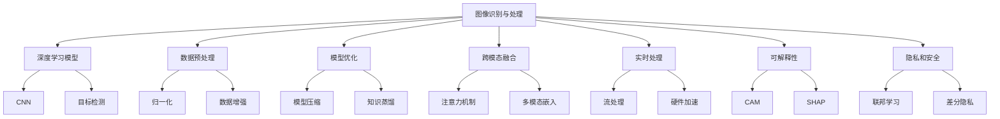
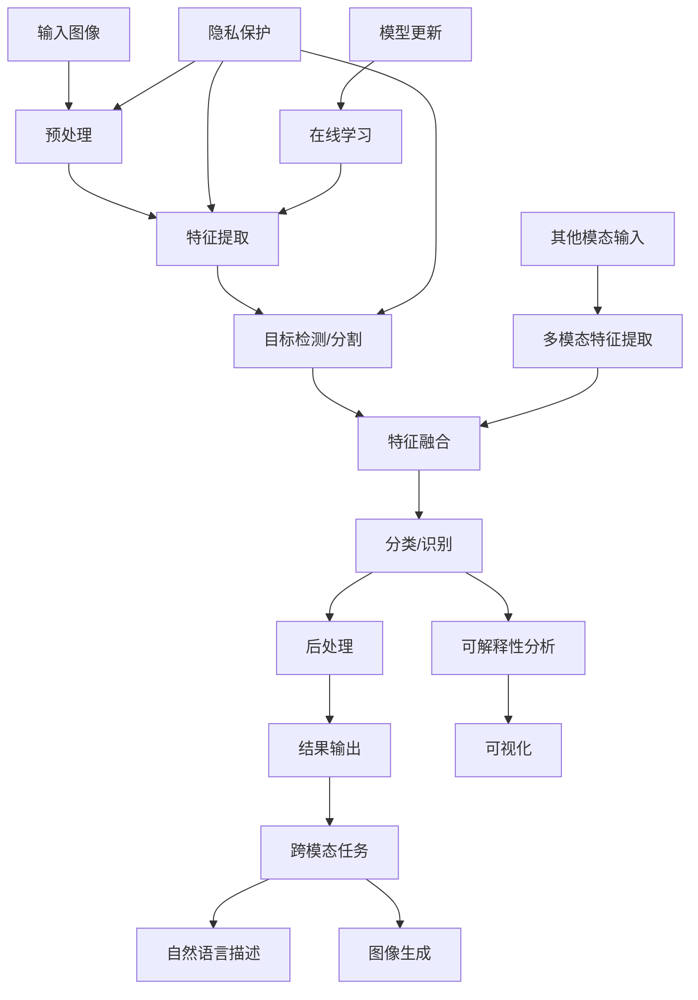
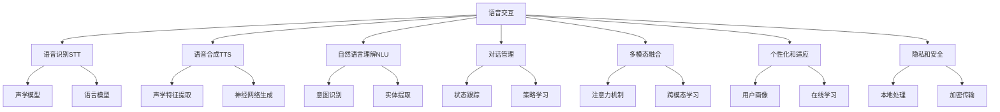
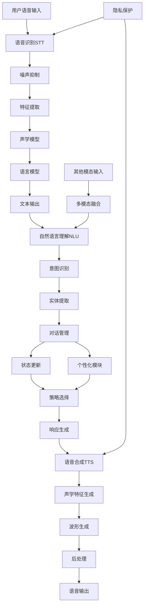
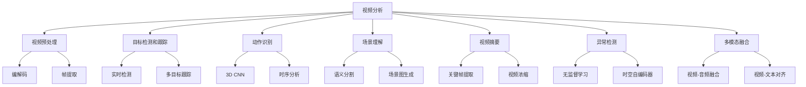
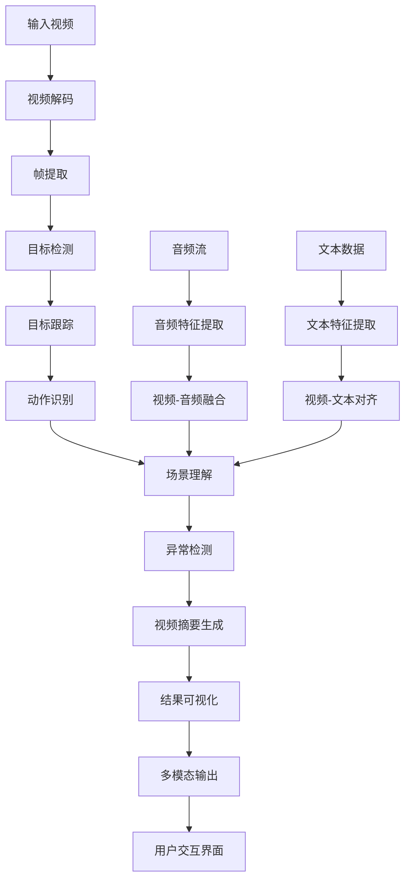
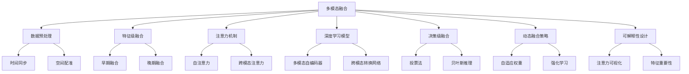
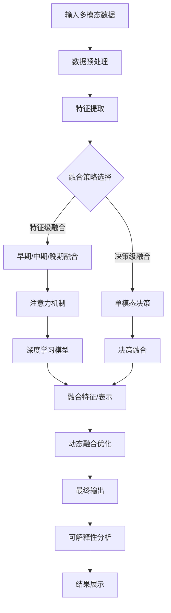

# 第五部分：AI Agent 应用前沿与展望

# 第16章：多模态 AI Agent

## 16.1 图像识别与处理

### 核心概念

图像识别与处理是多模态AI Agent中的关键组成部分，涉及使用计算机视觉技术来理解、分析和操作数字图像。这一领域包括图像分类、对象检测、图像分割、人脸识别、图像生成等多个子任务。在多模态AI Agent中，图像识别与处理能力使得系统可以理解和处理视觉信息，从而实现更全面、更自然的人机交互。

### 问题背景

随着深度学习技术的发展和大规模图像数据集的可用性，图像识别与处理技术在近年来取得了巨大进步。然而，将这些技术有效地集成到多模态AI Agent中仍面临诸多挑战。这些挑战包括如何处理实时视频流、如何在资源受限的设备上运行复杂模型、如何处理多样化和不可预测的真实世界场景、如何实现跨模态的信息融合等。同时，随着应用场景的扩大，对图像识别与处理的准确性、实时性和可解释性的要求也在不断提高。

### 问题描述

1. 如何设计高效且准确的图像识别模型，适用于多模态AI Agent的实时处理需求
2. 如何处理复杂、多变的真实世界场景，提高模型的鲁棒性
3. 如何在保证性能的同时，减少模型的计算资源需求，适应边缘设备
4. 如何实现图像信息与其他模态（如文本、语音）的有效融合
5. 如何提高图像识别结果的可解释性，增强用户信任
6. 如何处理隐私和安全问题，特别是在涉及人脸识别等敏感应用时

### 问题解决

我们将从以下几个方面详细探讨图像识别与处理在多模态AI Agent中的实现：

1. 深度学习模型：
    - 卷积神经网络（CNN）
    - 残差网络（ResNet）
    - 目标检测网络（YOLO, SSD）
    - 分割网络（U-Net, Mask R-CNN）

2. 数据预处理和增强：
    - 图像归一化
    - 数据增强技术
    - 图像去噪和增强

3. 模型优化：
    - 模型压缩和量化
    - 知识蒸馏
    - 神经网络架构搜索（NAS）

4. 跨模态融合：
    - 注意力机制
    - 多模态嵌入
    - 跨模态转换

5. 实时处理：
    - 流处理架构
    - GPU/TPU加速
    - 边缘计算优化

6. 可解释性：
    - 类激活映射（CAM）
    - SHAP值
    - 对抗样本分析

7. 隐私和安全：
    - 联邦学习
    - 差分隐私
    - 对抗性防御

### 边界与外延

虽然本节主要关注图像识别与处理在多模态AI Agent中的应用，但这些技术和方法也广泛应用于其他领域，如医疗诊断、自动驾驶、工业检测等。此外，我们还将探讨图像识别与处理如何与其他AI技术（如自然语言处理、语音识别）结合，以及在增强现实（AR）和虚拟现实（VR）等新兴领域的应用前景。

### 概念结构与核心要素组成



### 概念之间的关系

| 组件 | 主要功能 | 输入 | 输出 | 与其他组件的关系 |
|------|---------|------|------|------------------|
| 深度学习模型 | 图像特征提取和分类 | 原始图像 | 识别结果 | 为其他所有组件提供基础 |
| 数据预处理 | 增强数据质量 | 原始数据 | 处理后的数据 | 影响模型训练效果 |
| 模型优化 | 提高模型效率 | 原始模型 | 优化后的模型 | 影响实时处理性能 |
| 跨模态融合 | 整合多种信息 | 多模态数据 | 融合特征 | 增强识别准确性 |
| 实时处理 | 加速推理过程 | 模型和数据 | 实时结果 | 依赖模型优化 |
| 可解释性 | 解释模型决策 | 模型和预测 | 解释信息 | 增强用户信任 |
| 隐私和安全 | 保护数据和模型 | 敏感数据 | 安全措施 | 贯穿整个处理过程 |

### 算法流程图

多模态AI Agent中图像识别与处理的基本流程：



### 算法源代码

以下是一个简化的多模态AI Agent中图像识别与处理的示例代码：

```python
import torch
import torchvision.transforms as transforms
from torchvision.models import resnet50
from PIL import Image
import numpy as np

class MultimodalAIAgent:
    def __init__(self):
        self.device = torch.device("cuda" if torch.cuda.is_available() else "cpu")
        self.image_model = resnet50(pretrained=True).to(self.device)
        self.image_model.eval()
        self.transform = transforms.Compose([
            transforms.Resize(256),
            transforms.CenterCrop(224),
            transforms.ToTensor(),
            transforms.Normalize(mean=[0.485, 0.456, 0.406], std=[0.229, 0.224, 0.225]),
        ])

    def preprocess_image(self, image_path):
        image = Image.open(image_path).convert('RGB')
        return self.transform(image).unsqueeze(0).to(self.device)

    def extract_image_features(self, image_tensor):
        with torch.no_grad():
            features = self.image_model(image_tensor)
        return features

    def classify_image(self, image_path):
        image_tensor = self.preprocess_image(image_path)
        features = self.extract_image_features(image_tensor)
        _, predicted = torch.max(features, 1)
        return predicted.item()

    def generate_heatmap(self, image_path):
        image_tensor = self.preprocess_image(image_path)
        image_tensor.requires_grad_()
        
        features = self.extract_image_features(image_tensor)
        class_score = features[0, features.argmax()]
        
        self.image_model.zero_grad()
        class_score.backward()
        
        gradients = image_tensor.grad.data.squeeze()
        heatmap = torch.mean(gradients, dim=0).cpu().numpy()
        return heatmap

    def fuse_modalities(self, image_features, text_features):
        # 简化的多模态融合示例
        fused_features = torch.cat([image_features, text_features], dim=1)
        return fused_features

    def process_image_with_privacy(self, image_path, epsilon=1.0):
        image_tensor = self.preprocess_image(image_path)
        # 简化的差分隐私实现
        noise = torch.randn_like(image_tensor) * epsilon
        private_image_tensor = image_tensor + noise
        return private_image_tensor

# 使用示例
agent = MultimodalAIAgent()
image_path = "example_image.jpg"

# 图像分类
class_id = agent.classify_image(image_path)
print(f"Predicted class: {class_id}")

# 生成热力图
heatmap = agent.generate_heatmap(image_path)
print("Heatmap shape:", heatmap.shape)

# 隐私保护处理
private_image = agent.process_image_with_privacy(image_path)
print("Private image tensor shape:", private_image.shape)

# 多模态融合（假设我们有文本特征）
image_features = agent.extract_image_features(agent.preprocess_image(image_path))
text_features = torch.randn(1, 512).to(agent.device)  # 模拟文本特征
fused_features = agent.fuse_modalities(image_features, text_features)
print("Fused features shape:", fused_features.shape)
```

这个示例实现了基本的图像分类、特征提取、热力图生成、隐私保护处理和多模态融合功能。在实际应用中，每个组件都可以进一步优化和扩展。

### 实际场景应用

1. 智能零售：
    - 商品识别和库存管理
    - 客户行为分析
    - 个性化推荐结合图像和购物历史

2. 智能医疗：
    - 医学图像诊断（X光、CT、MRI）
    - 病理切片分析
    - 结合患者病历的多模态诊断辅助

3. 智能安防：
    - 人脸识别和行为分析
    - 异常事件检测
    - 结合音频的多模态威胁识别

4. 自动驾驶：
    - 道路场景理解
    - 交通标志和信号识别
    - 结合雷达和GPS的多传感器融合

5. 智能家居：
    - 家庭成员识别和活动监测
    - 智能家电控制结合语音和手势
    - 环境感知和自动调节

### 最佳实践 tips

1. 数据质量和多样性：
    - 收集高质量、多样化的训练数据
    - 使用数据增强技术扩展数据集
    - 定期更新数据集以适应新场景

2. 模型选择和优化：
    - 选择适合任务的预训练模型
    - 使用迁移学习加速模型训练
    - 应用模型压缩技术for边缘部署

3. 实时处理优化：
    - 使用TensorRT等推理优化工具
    - 实施模型量化减少计算需求
    - 考虑边缘-云协同处理架构

4. 多模态融合策略：
    - 设计有效的特征融合机制
    - 使用注意力机制捕捉模态间关系
    - 考虑不同模态的不确定性

5. 可解释性设计：
    - 集成可视化工具（如Grad-CAM）
    - 提供自然语言解释for模型决策
    - 设计交互式界面for结果探索

6. 隐私和安全考虑：
    - 实施数据匿名化处理
    - 使用联邦学习for分布式训练
    - 定期进行安全审计和渗透测试

7. 持续优化和更新：
    - 实施在线学习机制
    - 建立用户反馈loop持续改进
    - 定期评估模型性能和偏见

### 行业发展与未来趋势

| 时期 | 主要特征 | 关键技术 | 挑战 | 未来展望 |
|------|---------|----------|------|----------|
| 2018-2019 | 深度学习兴起 | CNN、迁移学习 | 数据需求大 | 更精准的识别 |
| 2020-2021 | 多任务学习 | 目标检测、分割网络 | 实时性要求 | 端到端解决方案 |
| 2022-2023 | 多模态融合 | 注意力机制、跨模态学习 | 模态对齐 | 自然交互界面 |
| 2024-2025 (预测) | 自适应AI | 元学习、少样本学习 | 泛化能力 | 场景理解 |
| 2026+ (展望) | 认知级视觉 | 神经符号推理、量子视觉 | 类人理解 | 通用视觉智能 |

图像识别与处理技术在多模态AI Agent中的应用正经历快速演变。从早期的单一任务识别到现在的复杂场景理解和多模态融合，我们看到了显著的进步。这些变化不仅提高了识别的准确性和效率，还改变了AI系统与现实世界交互的方式。

未来的图像识别与处理技术可能会更加注重以下几个方面：

1. 场景理解和上下文推理：
    - 从单一对象识别到整体场景语义理解
    - 结合常识知识库进行上下文推理
    - 理解和预测场景中的动态变化

2. 跨模态学习和理解：
    - 实现视觉、语言、声音等多模态的深度融合
    - 开发能够在不同模态间自由转换的模型
    - 探索多模态信息的协同增强机制

3. 自适应和持续学习：
    - 开发能够快速适应新环境的视觉系统
    - 实现在线、增量学习，持续提升性能
    - 探索元学习在视觉任务中的应用

4. 高效和轻量化处理：
    - 开发适用于边缘设备的超轻量级模型
    - 探索神经网络架构搜索在视觉任务中的应用
    - 研究新型计算范式，如类脑计算

5. 可解释性和透明度：
    - 开发直观、用户友好的可视化解释工具
    - 探索基于因果推理的可解释视觉模型
    - 研究如何在保持性能的同时提高模型透明度

6. 隐私保护和安全性：
    - 开发隐私保护的视觉分析技术
    - 研究对抗性攻击和防御在视觉系统中的应用
    - 探索去中心化的视觉智能系统

7. 与人类协作的视觉系统：
    - 开发能够理解和响应人类意图的视觉接口
    - 研究人机协作的视觉任务解决方案
    - 探索视觉系统在增强人类能力方面的应用

随着这些趋势的发展，图像识别与处理将从单纯的感知工具演变为具有认知能力的智能系统。未来的视觉AI将能够更深入地理解世界，与其他感知模态无缝协作，并能够适应复杂多变的环境。

这种进步将带来多方面的益处：

1. 增强人机交互：通过更自然、直观的视觉界面改善用户体验。

2. 提高决策质量：结合多模态信息提供更全面、准确的分析。

3. 扩展应用范围：使AI能够处理更复杂、更抽象的视觉任务。

4. 提升安全性：通过更先进的视觉分析提高安防和监控效果。

5. 促进科学研究：为医学影像、天文观测等领域提供强大工具。

6. 推动创新：为增强现实、虚拟现实等新兴技术提供基础支持。

7. 改善可访问性：帮助视障人士更好地感知和理解世界。

然而，这种发展也带来了新的挑战，如如何确保视觉AI系统的公平性和无偏见性，如何在提高性能的同时保护个人隐私，以及如何处理视觉AI可能带来的伦理问题。未来的图像识别与处理技术需要在技术创新、社会责任和伦理考量之间找到平衡，确保它们不仅技术先进，还能被社会广泛接受和信任。

总的来说，图像识别与处理将继续是多模态AI Agent的核心能力之一。通过不断创新和优化这些技术，我们将能够构建更加智能、自然和可靠的AI系统，为用户提供更丰富、更有价值的服务，并推动整个行业向更加成熟和负责任的方向发展。这不仅将改变我们与数字世界交互的方式，还将为AI技术在各个领域的深入应用和持续创新铺平道路，最终推动社会和技术的进步。

## 16.2 语音交互

### 核心概念

语音交互是多模态AI Agent中的关键组成部分，涉及使用语音识别、语音合成、自然语言处理和对话管理技术来实现人机之间的语音对话。这一领域包括语音转文本（STT）、文本转语音（TTS）、语音理解、意图识别、对话状态跟踪等多个子任务。在多模态AI Agent中，语音交互能力使系统能够通过最自然的人类交流方式与用户进行互动，从而实现更直观、更便捷的人机交互体验。

### 问题背景

随着深度学习技术的发展和大规模语音数据集的可用性，语音交互技术在近年来取得了巨大进步。然而，将这些技术有效地集成到多模态AI Agent中仍面临诸多挑战。这些挑战包括如何处理复杂的自然语言理解、如何在嘈杂环境中准确识别语音、如何生成自然流畅的语音、如何管理长期对话上下文、如何处理多语言和方言等。同时，随着应用场景的扩大，对语音交互的自然度、实时性和个性化的要求也在不断提高。

### 问题描述

1. 如何提高语音识别的准确性，特别是在复杂噪声环境下
2. 如何实现自然、富有表现力的语音合成，以增强用户体验
3. 如何设计高效的对话管理系统，实现流畅的多轮对话
4. 如何将语音交互与其他模态（如视觉、文本）有效融合
5. 如何处理多语言、方言和口音的挑战
6. 如何确保语音交互系统的隐私和安全性
7. 如何实现语音交互系统的个性化和适应性

### 问题解决

我们将从以下几个方面详细探讨语音交互在多模态AI Agent中的实现：

1. 语音识别（STT）：
    - 深度神经网络声学模型
    - 语言模型和解码器
    - 噪声抑制和回声消除

2. 语音合成（TTS）：
    - 端到端神经网络TTS模型
    - 声音克隆技术
    - 情感和韵律控制

3. 自然语言理解（NLU）：
    - 意图识别
    - 实体提取
    - 上下文理解

4. 对话管理：
    - 对话状态跟踪
    - 对话策略学习
    - 多轮对话处理

5. 多模态融合：
    - 注意力机制
    - 跨模态学习
    - 多模态对齐

6. 个性化和适应：
    - 用户画像建模
    - 在线学习和适应
    - 迁移学习

7. 隐私和安全：
    - 本地语音处理
    - 语音匿名化
    - 安全加密传输

### 边界与外延

虽然本节主要关注语音交互在多模态AI Agent中的应用，但这些技术和方法也广泛应用于其他领域，如智能家居、车载系统、客户服务等。此外，我们还将探讨语音交互如何与其他AI技术（如计算机视觉、情感计算）结合，以及在增强现实（AR）和虚拟现实（VR）等新兴领域的应用前景。

### 概念结构与核心要素组成



### 概念之间的关系

| 组件 | 主要功能 | 输入 | 输出 | 与其他组件的关系 |
|------|---------|------|------|------------------|
| 语音识别 | 将语音转为文本 | 音频信号 | 文本 | 为NLU提供输入 |
| 语音合成 | 将文本转为语音 | 文本 | 音频信号 | 输出对话管理的结果 |
| 自然语言理解 | 理解用户意图 | 文本 | 结构化意图 | 为对话管理提供输入 |
| 对话管理 | 控制对话流程 | 用户意图 | 系统行为 | 协调NLU和TTS |
| 多模态融合 | 整合多种信息 | 多模态数据 | 融合特征 | 增强NLU和对话管理 |
| 个性化和适应 | 定制用户体验 | 用户数据 | 个性化模型 | 影响所有其他组件 |
| 隐私和安全 | 保护用户数据 | 原始数据 | 安全措施 | 贯穿整个交互过程 |

### 算法流程图

多模态AI Agent中语音交互的基本流程：



### 算法源代码

以下是一个简化的多模态AI Agent中语音交互的示例代码：

```python
import speech_recognition as sr
from gtts import gTTS
import os
import numpy as np
from transformers import pipeline

class VoiceInteractionAgent:
    def __init__(self):
        self.recognizer = sr.Recognizer()
        self.nlu = pipeline("text-classification", model="distilbert-base-uncased-finetuned-sst-2-english")
        self.dialogue_state = {}

    def speech_to_text(self):
        with sr.Microphone() as source:
            print("Listening...")
            audio = self.recognizer.listen(source)
        try:
            text = self.recognizer.recognize_google(audio)
            print("You said:", text)
            return text
        except sr.UnknownValueError:
            print("Could not understand audio")
            return None

    def text_to_speech(self, text):
        tts = gTTS(text=text, lang='en')
        tts.save("response.mp3")
        os.system("mpg321 response.mp3")

    def natural_language_understanding(self, text):
        result = self.nlu(text)[0]
        intent = result['label']
        confidence = result['score']
        return intent, confidence

    def dialogue_management(self, intent):
        if intent == 'POSITIVE':
            response = "I'm glad to hear that! How can I assist you further?"
        elif intent == 'NEGATIVE':
            response = "I'm sorry to hear that. Is there anything I can do to help?"
        else:
            response = "I see. Can you tell me more about that?"
        return response

    def multimodal_fusion(self, text, other_modality_data):
        # 简化的多模态融合示例
        text_embedding = np.random.rand(100)  # 假设这是文本的嵌入表示
        other_embedding = np.random.rand(100)  # 假设这是其他模态的嵌入表示
        fused_embedding = np.concatenate([text_embedding, other_embedding])
        return fused_embedding

    def personalization(self, user_id, intent):
        # 简化的个性化示例
        if user_id not in self.dialogue_state:
            self.dialogue_state[user_id] = {'intents': []}
        self.dialogue_state[user_id]['intents'].append(intent)
        
        # 基于用户历史意图调整响应
        if len(self.dialogue_state[user_id]['intents']) > 5:
            return "Based on our conversation history, I think you might be interested in..."
        return None

    def interact(self):
        while True:
            user_input = self.speech_to_text()
            if user_input:
                intent, confidence = self.natural_language_understanding(user_input)
                print(f"Detected intent: {intent} (confidence: {confidence:.2f})")
                
                # 假设我们有其他模态的数据
                other_modality_data = np.random.rand(100)
                fused_data = self.multimodal_fusion(user_input, other_modality_data)
                print(f"Fused data shape: {fused_data.shape}")
                
                response = self.dialogue_management(intent)
                personalized_response = self.personalization("user_123", intent)
                if personalized_response:
                    response = personalized_response
                
                print("Agent:", response)
                self.text_to_speech(response)
            
            if user_input and "goodbye" in user_input.lower():
                break

# 使用示例
agent = VoiceInteractionAgent()
agent.interact()
```

这个示例实现了基本的语音识别、自然语言理解、对话管理、语音合成、多模态融合和简单的个性化功能。在实际应用中，每个组件都可以进一步优化和扩展。

### 实际场景应用

1. 智能家居控制：
    - 语音控制家电和设备
    - 多房间、多用户语音交互
    - 结合环境感知的上下文理解

2. 智能客服：
    - 24/7全天候语音客服
    - 多语言支持和实时翻译
    - 情感识别和个性化响应

3. 车载语音助手：
    - 免提导航和信息查询
    - 车辆控制和状态监测
    - 驾驶员状态感知和安全提醒

4. 教育辅助：
    - 语音交互式学习助手
    - 发音纠正和语言学习
    - 个性化学习进度跟踪

5. 医疗健康：
    - 语音控制医疗设备
    - 患者症状描述和初步诊断
    - 语音日记和心理健康监测

### 最佳实践 tips

1. 噪声处理和声音增强：
    - 使用高质量麦克风阵列
    - 实施先进的噪声抑制算法
    - 考虑多通道音频处理技术

2. 个性化和适应：
    - 实施说话人识别和适应
    - 使用增量学习更新用户模型
    - 考虑上下文和用户偏好

3. 自然对话流程：
    - 设计自然的对话策略
    - 实施上下文理解和记忆机制
    - 考虑多轮对话的连贯性

4. 多语言和方言支持：
    - 使用多语言和跨语言模型
    - 实施方言和口音自适应
    - 考虑文化背景的本地化

5. 实时性优化：
    - 使用流式处理技术
    - 优化模型for边缘计算
    - 考虑云边协同架构

6. 语音合成质量：
    - 使用最新的神经网络TTS模型
    - 实施情感和韵律控制
    - 考虑个性化声音定制

7. 隐私和安全：
    - 实施端到端加密
    - 使用联邦学习for模型更新
    - 考虑本地处理敏感信息

### 行业发展与未来趋势

| 时期 | 主要特征 | 关键技术 | 挑战 | 未来展望 |
|------|---------|----------|------|----------|
| 2018-2019 | 基础语音交互 | 深度学习ASR/TTS | 准确性 | 更自然的交互 |
| 2020-2021 | 上下文理解 | 端到端模型、注意力机制 | 多轮对话 | 个性化助手 |
| 2022-2023 | 多模态融合 | 跨模态学习、情感识别 | 模态协同 | 情感智能 |
| 2024-2025 (预测) | 认知交互 | 神经符号推理、元学习 | 常识推理 | 类人对话 |
| 2026+ (展望) | 无处不在的语音AI | 量子语音处理、脑机接口 | 伦理和隐私 | 思维层面交互 |

语音交互技术在多模态AI Agent中的应用正经历快速演变。从早期的简单命令识别到现在的自然对话和情感交互，我们看到了显著的进步。这些变化不仅提高了交互的自然度和效率，还改变了人机交互的本质。

未来的语音交互技术可能会更加注重以下几个方面：

1. 深度语境理解：
    - 从单句理解到长期对话上下文把握
    - 结合知识图谱实现常识推理
    - 理解和生成隐含意图和情感细微差别

2. 多模态协同感知：
    - 实现视觉、语音、触觉等多模态的深度融合
    - 开发能在不同感知模态间无缝切换的交互系统
    - 探索多模态信息的互补增强机制

3. 个性化和适应性：
    - 开发能快速适应个体用户的语音交互系统
    - 实现长期学习，持续优化个人助手能力
    - 探索元学习在快速适应新用户方面的应用

4. 情感和社交智能：
    - 开发具有情感理解和表达能力的语音系统
    - 实现社交场景下的得体交互
    - 研究如何建立人机之间的信任和亲和关系

5. 认知级语音交互：
    - 开发具有推理和问题解决能力的语音系统
    - 探索语音交互在创造性任务中的应用
    - 研究如何通过语音交互增强人类认知能力

6. 隐私保护和安全性：
    - 开发端到端加密的语音交互系统
    - 研究如何在保护隐私的同时实现个性化服务
    - 探索去中心化的语音AI生态系统

7. 无障碍和普惠性：
    - 开发能理解和生成手语的多模态系统
    - 研究如何通过语音技术帮助语言障碍者
    - 探索语音技术在教育平等和信息获取方面的应用

随着这些趋势的发展，语音交互将从简单的命令执行工具演变为具有认知能力的智能伙伴。未来的语音AI将能够更深入地理解人类意图，与其他感知模态无缝协作，并能够适应复杂多变的社交和情感环境。

这种进步将带来多方面的益处：

1. 提升用户体验：通过更自然、更个性化的交互方式改善用户满意度。

2. 增强可访问性：使技术更容易被老年人、残障人士等群体使用。

3. 提高工作效率：通过语音控制和信息获取简化日常任务。

4. 改善教育质量：提供个性化、交互式的语音学习体验。

5. 促进健康管理：通过语音交互实现更便捷的健康监测和医疗咨询。

6. 推动创新：为新型人机交互界面和应用场景提供基础。

7. 跨越语言障碍：实现实时、自然的多语言交流。

然而，这种发展也带来了新的挑战，如如何确保语音AI系统的公平性和包容性，如何在提供个性化服务的同时保护用户隐私，以及如何处理语音AI可能带来的伦理问题（如身份模仿、不当使用等）。未来的语音交互技术需要在技术创新、用户体验、隐私保护和伦理考量之间找到平衡，确保它们不仅技术先进，还能被社会广泛接受和信任。

总的来说，语音交互将继续是多模态AI Agent的核心能力之一。通过不断创新和优化这些技术，我们将能够构建更加智能、自然和可靠的AI系统，为用户提供更丰富、更有价值的服务，并推动整个行业向更加成熟和负责任的方向发展。这不仅将改变我们与数字世界交互的方式，还将为AI技术在各个领域的深入应用和持续创新铺平道路，最终推动社会和技术的进步。

## 16.3 视频分析

### 核心概念

视频分析是多模态AI Agent中的重要组成部分，涉及使用计算机视觉和机器学习技术来理解、分析和解释视频内容。这一领域包括目标检测和跟踪、动作识别、场景理解、视频摘要、异常检测等多个子任务。在多模态AI Agent中，视频分析能力使系统能够处理和理解动态视觉信息，从而实现更复杂、更高级的人机交互和智能决策。

### 问题背景

随着深度学习技术的发展和大规模视频数据集的可用性，视频分析技术在近年来取得了巨大进步。然而，将这些技术有效地集成到多模态AI Agent中仍面临诸多挑战。这些挑战包括如何处理大规模视频数据、如何实现实时分析、如何理解复杂的时空关系、如何处理不同质量和格式的视频、如何在边缘设备上运行高效的视频分析模型等。同时，随着应用场景的扩大，对视频分析的准确性、实时性和可解释性的要求也在不断提高。

### 问题描述

1. 如何设计高效且准确的视频分析模型，适用于多模态AI Agent的实时处理需求
2. 如何处理长时间、大规模视频数据的存储和检索问题
3. 如何实现复杂场景下的目标跟踪和行为分析
4. 如何将视频分析结果与其他模态（如音频、文本）有效融合
5. 如何在保证性能的同时，减少视频分析模型的计算资源需求，适应边缘设备
6. 如何提高视频分析结果的可解释性，增强用户信任
7. 如何处理视频分析中的隐私和安全问题

### 问题解决

我们将从以下几个方面详细探讨视频分析在多模态AI Agent中的实现：

1. 视频预处理：
    - 视频编解码
    - 帧提取和采样
    - 视频增强和去噪

2. 目标检测和跟踪：
    - 实时目标检测算法（如YOLO, SSD）
    - 多目标跟踪算法
    - 时空注意力机制

3. 动作识别和行为分析：
    - 3D卷积神经网络
    - 长短时记忆网络（LSTM）
    - 时序动作定位

4. 场景理解：
    - 语义分割
    - 场景图生成
    - 视频字幕生成

5. 视频摘要：
    - 关键帧提取
    - 视频浓缩
    - 个性化视频摘要

6. 异常检测：
    - 无监督学习方法
    - 时空自编码器
    - 基于注意力的异常检测

7. 多模态融合：
    - 视频-音频融合
    - 视频-文本对齐
    - 跨模态注意力机制

### 边界与外延

虽然本节主要关注视频分析在多模态AI Agent中的应用，但这些技术和方法也广泛应用于其他领域，如安防监控、自动驾驶、医疗诊断、体育分析等。此外，我们还将探讨视频分析如何与其他AI技术（如自然语言处理、语音识别）结合，以及在虚拟现实（VR）和增强现实（AR）等新兴领域的应用前景。

### 概念结构与核心要素组成



### 概念之间的关系

| 组件 | 主要功能 | 输入 | 输出 | 与其他组件的关系 |
|------|---------|------|------|------------------|
| 视频预处理 | 准备分析数据 | 原始视频 | 处理后的帧 | 为其他所有组件提供输入 |
| 目标检测和跟踪 | 识别和跟踪对象 | 视频帧 | 目标位置和轨迹 | 为动作识别和场景理解提供基础 |
| 动作识别 | 分析对象行为 | 目标序列 | 动作类别 | 依赖目标跟踪，影响异常检测 |
| 场景理解 | 解释视频内容 | 视频帧 | 场景描述 | 整合其他组件结果，影响摘要生成 |
| 视频摘要 | 生成视频概要 | 完整视频 | 摘要视频或关键帧 | 利用其他组件的分析结果 |
| 异常检测 | 识别异常事件 | 视频序列 | 异常标记 | 依赖动作识别和场景理解 |
| 多模态融合 | 整合多种信息 | 多模态数据 | 融合特征 | 增强所有其他组件的性能 |

### 算法流程图

多模态AI Agent中视频分析的基本流程：



### 算法源代码

以下是一个简化的多模态AI Agent中视频分析的示例代码：

```python
import cv2
import numpy as np
from tensorflow.keras.applications import ResNet50
from tensorflow.keras.applications.resnet50 import preprocess_input
from tensorflow.keras.preprocessing import image

class VideoAnalysisAgent:
    def __init__(self):
        self.model = ResNet50(weights='imagenet')
        self.object_cascade = cv2.CascadeClassifier(cv2.data.haarcascades + 'haarcascade_frontalface_default.xml')

    def preprocess_frame(self, frame):
        img = cv2.resize(frame, (224, 224))
        img = image.img_to_array(img)
        img = np.expand_dims(img, axis=0)
        img = preprocess_input(img)
        return img

    def detect_objects(self, frame):
        gray = cv2.cvtColor(frame, cv2.COLOR_BGR2GRAY)
        objects = self.object_cascade.detectMultiScale(gray, 1.3, 5)
        return objects

    def classify_frame(self, frame):
        preprocessed = self.preprocess_frame(frame)
        predictions = self.model.predict(preprocessed)
        return predictions

    def analyze_video(self, video_path):
        cap = cv2.VideoCapture(video_path)
        frame_count = 0
        while cap.isOpened():
            ret, frame = cap.read()
            if not ret:
                break

            frame_count += 1
            if frame_count % 30 == 0:  # 每秒分析一帧（假设视频为30fps）
                objects = self.detect_objects(frame)
                classifications = self.classify_frame(frame)
                
                # 处理检测和分类结果
                self.process_results(frame, objects, classifications)

        cap.release()

    def process_results(self, frame, objects, classifications):
        for (x, y, w, h) in objects:
            cv2.rectangle(frame, (x, y), (x+w, y+h), (255, 0, 0), 2)

        top_prediction = np.argmax(classifications)
        label = f"Prediction: {top_prediction}"
        cv2.putText(frame, label, (10, 30), cv2.FONT_HERSHEY_SIMPLEX, 1, (0, 255, 0), 2)

        cv2.imshow('Video Analysis', frame)
        cv2.waitKey(1)

    def audio_analysis(self, audio_data):
        # 简化的音频分析示例
        # 实际应用中，这里可以使用更复杂的音频处理技术
        return np.mean(audio_data)

    def text_analysis(self, text):
        # 简化的文本分析示例
        # 实际应用中，这里可以使用NLP技术进行更深入的分析
        return len(text.split())

    def multimodal_fusion(self, video_feature, audio_feature, text_feature):
        # 简化的多模态融合示例
        # 实际应用中，这里可以使用更复杂的融合技术，如注意力机制
        return np.concatenate([video_feature, [audio_feature], [text_feature]])

# 使用示例
agent = VideoAnalysisAgent()
agent.analyze_video('example_video.mp4')

# 多模态融合示例
video_feature = agent.classify_frame(cv2.imread('example_frame.jpg')).flatten()
audio_feature = agent.audio_analysis(np.random.rand(1000))  # 模拟音频数据
text_feature = agent.text_analysis("Example text for analysis")

fused_feature = agent.multimodal_fusion(video_feature, audio_feature, text_feature)
print("Fused feature shape:", fused_feature.shape)

cv2.destroyAllWindows()
```

这个示例实现了基本的视频分析功能，包括目标检测、帧分类和简单的多模态融合。在实际应用中，每个组件都可以进一步优化和扩展。

### 实际场景应用

1. 智能安防：
    - 实时异常行为检测
    - 人群密度分析和流动预测
    - 多摄像头协同跟踪

2. 智能零售：
    - 客户行为分析
    - 商品识别和库存管理
    - 热点区域分析

3. 智能交通：
    - 交通流量监控和预测
    - 车牌识别和车辆跟踪
    - 交通事故自动检测

4. 医疗健康：
    - 手术过程分析
    - 患者行为监测
    - 医学影像辅助诊断

5. 体育分析：
    - 运动员表现分析
    - 战术模式识别
    - 自动精彩片段生成

### 最佳实践 tips

1. 数据预处理和增强：
    - 使用高质量的视频预处理管道
    - 实施数据增强技术提高模型鲁棒性
    - 考虑场景特定的数据增强策略

2. 模型选择和优化：
    - 选择适合实时处理的轻量级模型
    - 使用模型压缩和量化技术
    - 考虑模型蒸馏for边缘设备部署

3. 多尺度处理：
    - 实施多尺度目标检测策略
    - 使用金字塔池化网络处理不同大小的目标
    - 考虑时间多尺度分析for动作识别

4. 时空建模：
    - 使用3D卷积或C3D网络捕捉时空特征
    - 实施长短时记忆网络（LSTM）for序列建模
    - 考虑时空注意力机制增强性能

5. 多模态融合策略：
    - 设计有效的特征融合机制
    - 使用跨模态注意力机制
    - 考虑晚期融合策略for灵活性

6. 实时处理优化：
    - 使用并行处理和GPU加速
    - 实施流处理架构
    - 考虑帧跳跃技术for效率提升

7. 隐私保护：
    - 实施视频匿名化技术
    - 使用联邦学习for分布式训练
    - 考虑差分隐私技术保护敏感信息

### 行业发展与未来趋势

| 时期 | 主要特征 | 关键技术 | 挑战 | 未来展望 |
|------|---------|----------|------|----------|
| 2018-2019 | 基础视频分析 | CNN、RNN | 实时性 | 更高效的模型 |
| 2020-2021 | 复杂场景理解 | 3D CNN、注意力机制 | 长时依赖 | 端到端系统 |
| 2022-2023 | 多模态融合 | 跨模态学习、图神经网络 | 模态对齐 | 上下文理解 |
| 2024-2025 (预测) | 智能决策 | 强化学习、因果推理 | 可解释性 | 认知级分析 |
| 2026+ (展望) | 自主视觉系统 | 神经符号AI、量子计算 | 伦理和隐私 | 通用视觉智能 |

视频分析技术在多模态AI Agent中的应用正经历快速演变。从早期的简单目标检测到现在的复杂场景理解和多模态融合，我们看到了显著的进步。这些变化不仅提高了分析的准确性和效率，还扩展了AI系统理解和交互with现实世界的能力。

未来的视频分析技术可能会更加注重以下几个方面：

1. 深度场景理解：
    - 从单一对象识别到整体场景语义理解
    - 结合常识知识库进行上下文推理
    - 理解和预测复杂的时空关系和事件链

2. 跨模态学习和理解：
    - 实现视频、音频、文本等多模态的深度融合
    - 开发能够在不同模态间自由转换的模型
    - 探索多模态信息的互补增强机制

3. 自适应和持续学习：
    - 开发能够快速适应新环境的视频分析系统
    - 实现在线、增量学习，持续提升性能
    - 探索元学习在视频分析任务中的应用

4. 因果推理和决策支持：
    - 从相关性分析到因果关系推断
    - 开发基于视频分析的智能决策支持系统
    - 探索视频分析在预测性维护和风险管理中的应用

5. 边缘智能和分布式处理：
    - 开发适用于边缘设备的超轻量级视频分析模型
    - 探索边缘-云协同的视频处理架构
    - 研究分布式视频分析系统的同步和一致性问题

6. 隐私保护和安全性：
    - 开发隐私保护的视频分析技术
    - 研究对抗性攻击和防御在视频系统中的应用
    - 探索去中心化的视频智能系统

7. 与人类协作的视频分析：
    - 开发可解释的视频分析模型
    - 研究人机协作的视频分析工作流
    - 探索视频分析系统在增强人类决策能力方面的应用

随着这些趋势的发展，视频分析将从单纯的感知工具演变为具有认知能力的智能系统。未来的视频分析AI将能够更深入地理解复杂场景，与其他感知模态无缝协作，并能够支持高级决策和推理任务。

这种进步将带来多方面的益处：

1. 增强安全性：通过更先进的异常检测和预测提高公共安全。

2. 优化业务运营：为零售、制造等行业提供深入的视觉分析洞察。

3. 改善医疗诊断：通过精确的医学影像分析辅助医生诊断。

4. 推动自动驾驶：提供更可靠的环境感知和决策支持。

5. 增强用户体验：在AR/VR等领域实现更自然、智能的交互。

6. 促进科研创新：为生物学、天文学等领域提供强大的视频分析工具。

7. 支持环境保护：通过大规模视频监测助力生态系统研究和保护。

然而，这种发展也带来了新的挑战，如如何确保视频分析系统的公平性和无偏见性，如何在提高性能的同时保护个人隐私，以及如何处理视频分析可能带来的伦理问题（如过度监控、滥用等）。未来的视频分析技术需要在技术创新、社会责任和伦理考量之间找到平衡，确保它们不仅技术先进，还能被社会广泛接受和信任。

总的来说，视频分析将继续是多模态AI Agent的核心能力之一。通过不断创新和优化这些技术，我们将能够构建更加智能、自然和可靠的AI系统，为用户提供更丰富、更有价值的服务，并推动整个行业向更加成熟和负责任的方向发展。这不仅将改变我们理解和交互with视觉世界的方式，还将为AI技术在各个领域的深入应用和持续创新铺平道路，最终推动社会和技术的进步。

## 16.4 多模态融合技术

### 核心概念

多模态融合技术是指将来自不同感知模态（如视觉、听觉、触觉等）的信息进行整合和协同处理的方法和技术。在多模态AI Agent中，这种融合能力使系统能够综合利用多种信息源，从而实现更全面、更准确的环境感知和决策。多模态融合涉及特征级融合、决策级融合、模型级融合等多个层面，旨在充分利用各模态信息的互补性和协同性。

### 问题背景

随着AI技术的发展，单一模态的局限性日益凸显。现实世界的信息是多模态的，人类感知和认知过程也是多模态的。因此，为了构建更接近人类认知能力的AI系统，多模态融合成为了一个关键挑战。然而，不同模态数据的异构性、时空对齐问题、模态间的互补与冲突、计算复杂度等因素都给多模态融合带来了巨大挑战。同时，如何在保证融合效果的同时保持系统的实时性和可解释性，也是需要解决的重要问题。

### 问题描述

1. 如何有效处理不同模态数据的异构性和不对齐问题
2. 如何设计能充分利用各模态互补信息的融合架构
3. 如何处理模态缺失或质量不均衡的情况
4. 如何在多模态融合中保持计算效率和实时性
5. 如何提高多模态融合结果的可解释性
6. 如何设计适应不同任务和场景的动态融合策略
7. 如何处理多模态融合中的隐私和安全问题

### 问题解决

我们将从以下几个方面详细探讨多模态融合技术在AI Agent中的实现：

1. 数据预处理和对齐：
    - 时间同步
    - 空间配准
    - 特征标准化

2. 特征级融合：
    - 早期融合（Early Fusion）
    - 中期融合（Intermediate Fusion）
    - 晚期融合（Late Fusion）

3. 注意力机制：
    - 自注意力
    - 跨模态注意力
    - 多头注意力

4. 深度学习模型：
    - 多模态自编码器
    - 跨模态转换网络
    - 图神经网络

5. 决策级融合：
    - 投票法
    - 贝叶斯推理
    - 模糊逻辑

6. 动态融合策略：
    - 自适应权重调整
    - 强化学习优化
    - 元学习方法

7. 可解释性设计：
    - 注意力可视化
    - 特征重要性分析
    - 决策路径追踪

### 边界与外延

虽然本节主要关注多模态融合在AI Agent中的应用，但这些技术和方法也广泛应用于其他领域，如医疗诊断、情感计算、人机交互等。此外，我们还将探讨多模态融合如何与其他AI技术（如强化学习、因果推理）结合，以及在新兴领域如脑机接口、量子计算等方面的潜在应用。

### 概念结构与核心要素组成



### 概念之间的关系

| 组件 | 主要功能 | 输入 | 输出 | 与其他组件的关系 |
|------|---------|------|------|------------------|
| 数据预处理 | 准备融合数据 | 原始多模态数据 | 对齐的数据 | 为其他所有组件提供基础 |
| 特征级融合 | 合并特征表示 | 多模态特征 | 融合特征 | 影响深度学习模型的输入 |
| 注意力机制 | 关注重要信息 | 多模态数据 | 注意力权重 | 增强特征融合和深度学习效果 |
| 深度学习模型 | 学习联合表示 | 预处理数据 | 高级特征 | 整合其他组件的输出 |
| 决策级融合 | 综合多模态决策 | 单模态决策 | 最终决策 | 利用其他组件的结果 |
| 动态融合策略 | 优化融合过程 | 融合参数 | 优化策略 | 调整其他所有组件的行为 |
| 可解释性设计 | 解释融合结果 | 融合过程数据 | 解释信息 | 分析其他组件的贡献 |

### 算法流程图

多模态AI Agent中的多模态融合基本流程：



### 算法源代码

以下是一个简化的多模态融合示例代码，展示了如何融合视觉和文本数据：

```python
import torch
import torch.nn as nn
import torchvision.models as models
import transformers

class MultimodalFusionModel(nn.Module):
    def __init__(self, num_classes):
        super(MultimodalFusionModel, self).__init__()
        # 视觉模型
        self.vision_model = models.resnet18(pretrained=True)
        self.vision_model.fc = nn.Identity()  # 移除最后的全连接层
        
        # 文本模型
        self.text_model = transformers.BertModel.from_pretrained('bert-base-uncased')
        
        # 融合层
        self.fusion = nn.Sequential(
            nn.Linear(768 + 512, 512),  # BERT输出768维，ResNet输出512维
            nn.ReLU(),
            nn.Dropout(0.5),
            nn.Linear(512, num_classes)
        )
        
        # 注意力机制
        self.attention = nn.MultiheadAttention(embed_dim=512, num_heads=8)

    def forward(self, image, text):
        # 提取视觉特征
        vision_features = self.vision_model(image)
        
        # 提取文本特征
        text_features = self.text_model(text)[0][:, 0, :]  # 使用[CLS]标记的输出
        
        # 注意力机制
        vision_features = vision_features.unsqueeze(0)
        attended_features, _ = self.attention(vision_features, text_features.unsqueeze(0), text_features.unsqueeze(0))
        attended_features = attended_features.squeeze(0)
        
        # 特征融合
        combined_features = torch.cat((attended_features, text_features), dim=1)
        output = self.fusion(combined_features)
        
        return output

# 使用示例
model = MultimodalFusionModel(num_classes=10)
image = torch.randn(1, 3, 224, 224)  # 假设的图像输入
text = torch.randint(0, 1000, (1, 128))  # 假设的文本输入（词索引）
output = model(image, text)
print(output.shape)

# 可解释性分析
def interpret_attention(model, image, text):
    with torch.no_grad():
        vision_features = model.vision_model(image)
        text_features = model.text_model(text)[0][:, 0, :]
        
        vision_features = vision_features.unsqueeze(0)
        _, attention_weights = model.attention(vision_features, text_features.unsqueeze(0), text_features.unsqueeze(0))
        
    return attention_weights

attention_weights = interpret_attention(model, image, text)
print("Attention weights shape:", attention_weights.shape)
```

这个示例实现了一个基本的多模态融合模型，结合了视觉（ResNet）和文本（BERT）特征，并使用注意力机制进行融合。在实际应用中，可以根据具体需求进一步优化和扩展这个模型。

### 实际场景应用

1. 多模态情感分析：
    - 结合面部表情、语音和文本内容
    - 用于客户服务质量评估和改进
    - 应用于社交媒体情感监测

2. 智能医疗诊断：
    - 融合医学影像、病历文本和生理信号
    - 辅助医生进行更准确的疾病诊断
    - 用于个性化治疗方案制定

3. 自动驾驶：
    - 整合视觉、雷达、GPS和地图数据
    - 实现精确的环境感知和路径规划
    - 提高极端天气条件下的驾驶安全性

4. 多模态搜索引擎：
    - 支持图像、文本、语音混合查询
    - 提供更直观、更精准的搜索结果
    - 应用于电子商务和数字图书馆

5. 智能安防系统：
    - 融合视频、音频和传感器数据
    - 实现更准确的异常行为检测
    - 用于大型公共场所的安全监控

### 最佳实践 tips

1. 数据预处理和对齐：
    - 确保不同模态数据的时间同步
    - 使用高质量的特征提取器
    - 考虑模态特定的数据增强技术

2. 融合架构设计：
    - 根据任务特性选择合适的融合级别
    - 使用注意力机制捕捉模态间的相关性
    - 考虑残差连接保留原始特征信息

3. 处理模态不平衡：
    - 实施模态丢失训练策略
    - 使用对抗训练提高鲁棒性
    - 考虑模态特定的正则化技术

4. 计算效率优化：
    - 使用模型压缩和量化技术
    - 实施模态特定的早停机制
    - 考虑异步处理和流水线并行

5. 可解释性增强：
    - 实施注意力可视化技术
    - 使用SHAP值分析特征重要性
    - 考虑构建可解释的中间表示

6. 动态融合策略：
    - 使用元学习自动调整融合权重
    - 实施基于不确定性的动态融合
    - 考虑任务相关的适应性融合

7. 隐私和安全考虑：
    - 使用联邦学习进行分布式训练
    - 实施差分隐私保护敏感信息
    - 考虑模态特定的隐私保护技术

### 行业发展与未来趋势

| 时期 | 主要特征 | 关键技术 | 挑战 | 未来展望 |
|------|---------|----------|------|----------|
| 2018-2019 | 基础融合 | 特征拼接、多任务学习 | 模态对齐 | 端到端模型 |
| 2020-2021 | 注意力融合 | 跨模态注意力、Transformer | 长期依赖 | 自适应融合 |
| 2022-2023 | 动态融合 | 元学习、神经架构搜索 | 计算效率 | 认知级融合 |
| 2024-2025 (预测) | 知识引导融合 | 神经符号推理、因果推断 | 可解释性 | 通用多模态AI |
| 2026+ (展望) | 量子增强融合 | 量子机器学习、脑机接口 | 伦理和隐私 | 超人类感知 |

多模态融合技术在AI Agent中的应用正经历快速演变。从早期的简单特征拼接到现在的动态自适应融合，我们看到了显著的进步。这些变化不仅提高了融合的效果和效率，还扩展了AI系统理解和交互with复杂环境的能力。

未来的多模态融合技术可能会更加注重以下几个方面：

1. 认知级融合：
    - 从数据驱动向知识驱动的融合转变
    - 结合符号推理和神经网络的混合架构
    - 实现类人的多模态理解和推理能力

2. 自适应动态融合：
    - 根据任务和环境自动调整融合策略
    - 实现跨域、跨任务的迁移学习
    - 探索持续学习在多模态融合中的应用

3. 高效低资源融合：
    - 开发适用于边缘设备的轻量级融合模型
    - 探索模态蒸馏和知识迁移技术
    - 研究新型计算范式，如类脑计算在融合中的应用

4. 鲁棒性和泛化能力：
    - 提高对模态缺失和噪声的适应能力
    - 开发跨数据集、跨领域的泛化融合模型
    - 探索对抗学习在增强融合鲁棒性方面的应用

5. 可解释性和透明度：
    - 开发直观的多模态融合可视化工具
    - 探索基于因果推理的可解释融合模型
    - 研究如何在复杂融合过程中保持决策透明度

6. 隐私保护和安全融合：
    - 开发保护隐私的多模态学习技术
    - 研究对抗性攻击和防御在多模态系统中的应用
    - 探索去中心化的多模态融合架构

7. 人机协同融合：
    - 开发能理解和整合人类反馈的融合系统
    - 研究如何利用多模态融合增强人类决策
    - 探索多模态融合在增强现实和虚拟现实中的应用

随着这些趋势的发展，多模态融合将从单纯的信息整合工具演变为具有认知能力的智能系统核心。未来的多模态AI将能够更自然地理解和处理复杂的多源信息，实现更高级的推理和决策能力。

这种进步将带来多方面的益处：

1. 增强感知能力：通过融合多种感官信息，实现超越人类的感知精度。

2. 改善决策质量：结合多源信息提供更全面、准确的分析和预测。

3. 自然人机交互：实现更直观、多样化的人机界面和交互方式。

4. 个性化服务：通过整合多维度用户数据，提供更精准的个性化体验。

5. 跨领域创新：促进不同领域知识和技术的融合，催生新的应用和发现。

6. 增强可解释性：通过多模态信息的互补，提供更全面的解释和理解。

7. 提高系统鲁棒性：减少单一模态的局限性，增强系统的适应性和可靠性。

然而，这种发展也带来了新的挑战，如如何处理日益增加的计算复杂度，如何确保多模态系统的公平性和无偏见性，以及如何在融合过程中保护个人隐私和数据安全。未来的多模态融合技术需要在技术创新、伦理考量和社会责任之间找到平衡，确保它们不仅技术先进，还能被社会广泛接受和信任。

总的来说，多模态融合将继续是AI Agent发展的核心驱动力之一。通过不断创新和优化这些技术，我们将能够构建更加智能、自然和可靠的AI系统，为用户提供更丰富、更有价值的服务，并推动整个行业向更加成熟和负责任的方向发展。这不仅将改变我们与数字世界交互的方式，还将为AI技术在各个领域的深入应用和持续创新铺平道路，最终推动社会和技术的进步。
