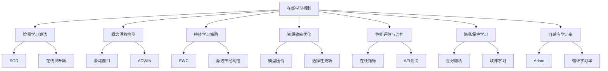
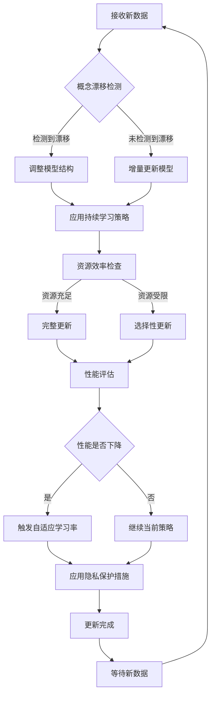
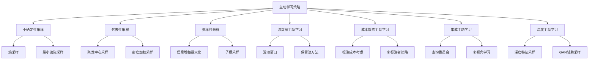
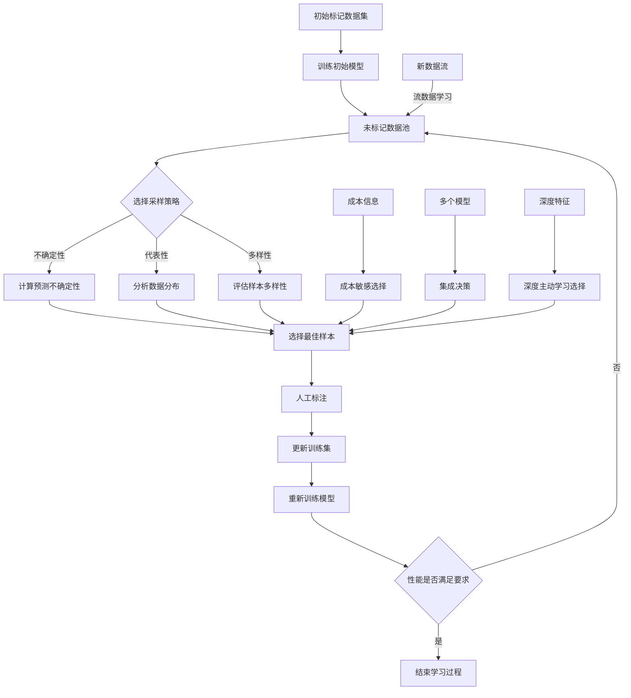
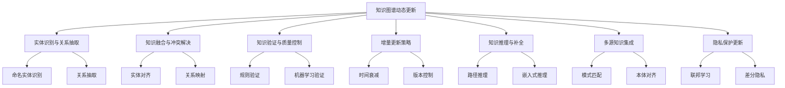
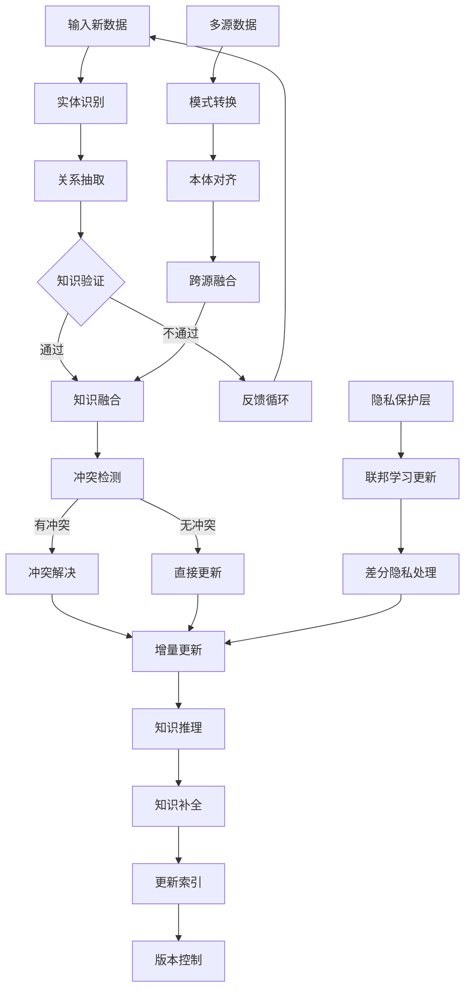
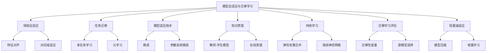
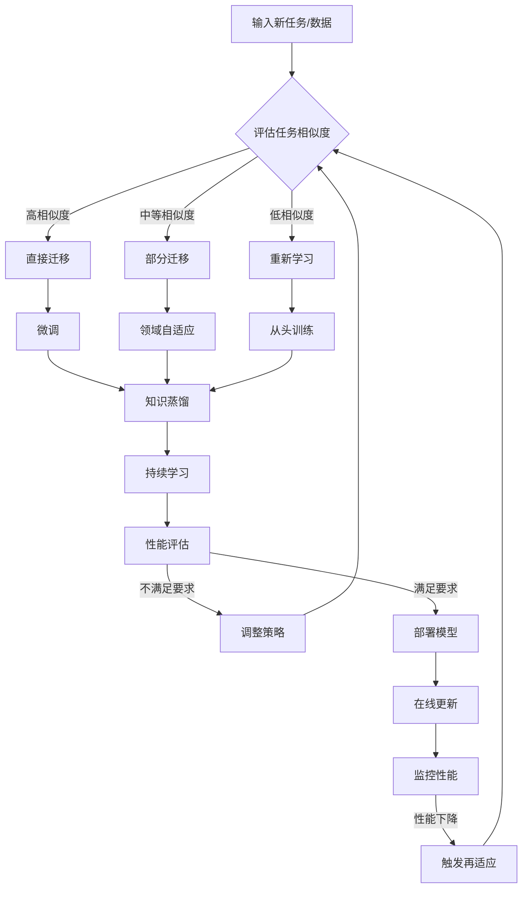

# 第17章：自主学习与持续优化的 AI Agent

## 17.1 在线学习机制

### 核心概念

在线学习机制是指AI Agent能够在接收新数据的同时不断更新其模型，而无需重新训练整个模型的能力。这种机制使得AI Agent能够适应动态变化的环境，持续优化其性能，并在新的、未见过的情况下做出合理的决策。在线学习是实现自主学习和持续优化AI Agent的关键技术之一。

### 问题背景

传统的机器学习模型通常是在固定的数据集上训练，然后部署使用。然而，在实际应用中，数据分布可能会随时间变化，新的模式可能会出现，或者初始训练数据可能不足以覆盖所有可能的情况。这就需要AI Agent具备在线学习的能力，以适应这些变化并持续改进其性能。

同时，在许多实际应用场景中，如推荐系统、金融市场预测、自动驾驶等，环境是高度动态和不可预测的，要求AI Agent能够快速适应新情况并做出实时决策。此外，在资源受限的环境中，如移动设备或边缘计算设备，可能无法存储大量历史数据或频繁进行完整的模型重训练，这更加凸显了在线学习的重要性。

### 问题描述

1. 如何设计能够有效处理流式数据的在线学习算法
2. 如何在保持模型性能的同时，避免灾难性遗忘（catastrophic forgetting）
3. 如何平衡新旧知识，实现持续学习而不过度适应最新数据
4. 如何处理在线学习中的概念漂移（concept drift）问题
5. 如何在计算资源有限的情况下实现高效的在线学习
6. 如何评估和保证在线学习模型的性能和可靠性
7. 如何处理在线学习过程中的数据隐私和安全问题

### 问题解决

我们将从以下几个方面详细探讨在线学习机制在AI Agent中的实现：

1. 增量学习算法：
    - 随机梯度下降（SGD）及其变体
    - 在线贝叶斯方法
    - 决策树的增量更新

2. 概念漂移检测与适应：
    - 滑动窗口技术
    - ADWIN算法
    - 集成方法

3. 持续学习策略：
    - 弹性权重合并（EWC）
    - 渐进神经网络
    - 记忆重放机制

4. 资源效率优化：
    - 模型压缩技术
    - 选择性更新策略
    - 分布式在线学习

5. 性能评估与监控：
    - 在线性能指标
    - A/B测试
    - 多臂老虎机算法

6. 隐私保护学习：
    - 差分隐私
    - 联邦学习
   - 安全多方计算

7. 自适应学习率：
    - Adam优化器
    - 循环学习率
    - 贝叶斯优化

### 边界与外延

虽然本节主要关注在线学习在AI Agent中的应用，但这些技术和方法也广泛应用于其他领域，如推荐系统、金融预测、网络安全等。此外，我们还将探讨在线学习如何与其他AI技术（如强化学习、迁移学习）结合，以及在新兴领域如边缘计算、物联网等方面的潜在应用。

### 概念结构与核心要素组成



### 概念之间的关系

| 组件 | 主要功能 | 输入 | 输出 | 与其他组件的关系 |
|------|---------|------|------|------------------|
| 增量学习算法 | 更新模型参数 | 新数据 | 更新后的模型 | 为其他所有组件提供基础 |
| 概念漂移检测 | 识别数据分布变化 | 数据流 | 漂移警告 | 触发模型更新和适应 |
| 持续学习策略 | 平衡新旧知识 | 模型状态 | 优化策略 | 影响增量学习的方式 |
| 资源效率优化 | 减少计算和存储需求 | 系统资源 | 优化方案 | 影响所有组件的执行效率 |
| 性能评估与监控 | 跟踪模型表现 | 预测结果 | 性能指标 | 指导其他组件的调整 |
| 隐私保护学习 | 保护数据隐私 | 原始数据 | 安全更新 | 影响数据处理和模型更新方式 |
| 自适应学习率 | 动态调整学习速度 | 梯度信息 | 学习率 | 直接影响增量学习效果 |

### 算法流程图

AI Agent中在线学习机制的基本流程：



### 算法源代码

以下是一个简化的在线学习机制示例，展示了如何实现基本的增量学习和概念漂移检测：

```python
import numpy as np
from sklearn.base import BaseEstimator
from skmultiflow.drift_detection import ADWIN

class OnlineLearningAgent(BaseEstimator):
    def __init__(self, base_estimator, drift_detector=None, window_size=1000):
        self.base_estimator = base_estimator
        self.drift_detector = drift_detector or ADWIN()
        self.window_size = window_size
        self.X_window = []
        self.y_window = []

    def partial_fit(self, X, y):
        self.X_window.extend(X)
        self.y_window.extend(y)
        
        # 保持窗口大小
        if len(self.X_window) > self.window_size:
            self.X_window = self.X_window[-self.window_size:]
            self.y_window = self.y_window[-self.window_size:]

        # 增量更新模型
        self.base_estimator.partial_fit(X, y)

        # 概念漂移检测
        for i, pred in enumerate(self.base_estimator.predict(X)):
            error = int(pred != y[i])
            drift_detected = self.drift_detector.add_element(error)
            if drift_detected:
                print("Concept drift detected. Resetting the model.")
                self.base_estimator.fit(self.X_window, self.y_window)
                self.drift_detector.reset()

    def predict(self, X):
        return self.base_estimator.predict(X)

# 使用示例
from sklearn.naive_bayes import MultinomialNB
from sklearn.datasets import make_classification

# 创建一个在线学习agent
agent = OnlineLearningAgent(MultinomialNB())

# 模拟数据流
X, y = make_classification(n_samples=10000, n_features=20, n_classes=2, n_clusters_per_class=1, flip_y=0.1)

# 在线学习过程
for i in range(0, len(X), 100):
    X_batch = X[i:i+100]
    y_batch = y[i:i+100]
    agent.partial_fit(X_batch, y_batch)

    # 性能评估
    if i % 1000 == 0:
        accuracy = agent.base_estimator.score(X[i:i+1000], y[i:i+1000])
        print(f"Batch {i//100}, Accuracy: {accuracy:.4f}")

# 最终预测
final_predictions = agent.predict(X[-1000:])
final_accuracy = np.mean(final_predictions == y[-1000:])
print(f"Final Accuracy: {final_accuracy:.4f}")
```

这个示例实现了一个基本的在线学习agent，包括增量学习和概念漂移检测。在实际应用中，可以根据具体需求进一步优化和扩展这个模型。

### 实际场景应用

1. 推荐系统：
    - 实时更新用户兴趣模型
    - 适应快速变化的流行趋势
    - 处理冷启动问题

2. 金融市场预测：
    - 实时调整交易策略
    - 适应市场情绪和宏观经济变化
    - 处理高频交易数据

3. 网络安全：
    - 实时检测新型网络攻击
    - 适应不断变化的威胁模式
    - 减少误报和漏报

4. 智能客服：
    - 持续优化对话模型
    - 学习新的问题类型和回答模式
    - 适应不同用户群的语言习惯

5. 工业物联网：
    - 实时优化生产参数
    - 预测设备故障和维护需求
    - 适应不同生产环境和原材料变化

### 最佳实践 tips

1. 数据预处理：
    - 实施实时特征工程
    - 使用增量标准化技术
    - 考虑特征选择的动态更新

2. 模型选择：
    - 选择天生支持增量学习的算法
    - 考虑使用在线集成方法
    - 权衡模型复杂度和更新速度

3. 概念漂移处理：
    - 实施多种漂移检测方法
    - 使用自适应窗口大小
    - 考虑渐进式和突变式漂移的不同策略

4. 性能监控：
    - 实施实时性能指标计算
    - 使用多指标评估方法
    - 考虑设置动态性能阈值

5. 资源管理：
    - 实施模型压缩和量化技术
    - 使用分布式计算框架
    - 考虑边缘计算和云端协同策略

6. 隐私保护：
    - 实施本地差分隐私
    - 使用安全聚合在联邦学习中
    - 考虑隐私预算的动态调整

7. 持续优化：
    - 实施自动超参数调整
    - 使用元学习优化学习策略
    - 考虑多目标优化方法

### 行业发展与未来趋势

| 时期 | 主要特征 | 关键技术 | 挑战 | 未来展望 |
|------|---------|----------|------|----------|
| 2018-2019 | 基础在线学习 | SGD、ADWIN | 概念漂移 | 自适应算法 |
| 2020-2021 | 持续学习 | EWC、记忆重放 | 灾难性遗忘 | 终身学习系统 |
| 2022-2023 | 分布式在线学习 | 联邦学习、边缘计算 | 通信效率 | 去中心化AI |
| 2024-2025 (预测) | 自主学习 | 元学习、神经架构搜索 | 自动优化 | 认知级AI |
| 2026+ (展望) | 量子增强学习 | 量子机器学习、类脑计算 | 可解释性 | 通用人工智能 |

在线学习机制在AI Agent中的应用正经历快速演变。从早期的简单增量更新到现在的复杂自适应系统，我们看到了显著的进步。这些变化不仅提高了AI系统的适应性和效率，还扩展了它们在动态和不确定环境中的应用范围。

未来的在线学习技术可能会更加注重以下几个方面：

1. 自主适应：
    - 自动选择和调整学习算法
    - 动态平衡探索与利用
    - 实现真正的终身学习能力

2. 多任务和迁移：
    - 在多个相关任务间高效迁移知识
    - 实现跨域、跨模态的在线学习
    - 探索元学习在快速适应新任务中的应用

3. 分布式和联邦学习：
    - 开发高效的分布式在线学习算法
    - 探索去中心化的知识共享机制
    - 研究隐私保护下的协作学习方法

4. 资源感知学习：
    - 开发适应不同硬件的自适应算法
    - 探索能耗感知的在线学习策略
    - 研究边缘-云协同的学习架构

5. 可解释性和透明度：
    - 开发可解释的在线学习模型
    - 探索动态决策过程的可视化方法
    - 研究如何在持续学习中保持模型透明度

6. 鲁棒性和安全性：
    - 开发对抗样本鲁棒的在线学习算法
    - 探索安全多方计算在分布式学习中的应用
    - 研究如何检测和防御在线学习中的攻击

7. 与人类协作：
    - 开发能高效整合人类反馈的学习系统
    - 探索人机协作的在线学习模式
    - 研究如何平衡自动化学习和人工干预

随着这些趋势的发展，在线学习将从单纯的模型更新机制演变为AI系统的核心认知能力。未来的AI Agent将能够更自然地适应变化，持续学习和优化，并在复杂多变的环境中做出智能决策。

这种进步将带来多方面的益处：

1. 提高适应性：使AI系统能够快速适应新环境和新任务。

2. 增强性能：通过持续学习不断提高模型的准确性和效率。

3. 资源效率：优化计算和存储资源的使用，使AI更加轻量和普及。

4. 个性化服务：实现更精准、动态的个性化用户体验。

5. 安全性提升：快速适应新的安全威胁和攻击模式。

6. 自主决策：在动态环境中实现更高级的自主决策能力。

7. 知识积累：实现类似人类的持续知识获取和技能提升。

然而，这种发展也带来了新的挑战，如如何在持续学习中保持模型的稳定性，如何平衡新旧知识，如何在分布式环境中保护数据隐私，以及如何确保在线学习系统的可解释性和可控性。未来的在线学习技术需要在性能、效率、安全性和伦理之间找到平衡，确保它们不仅技术先进，还能被社会广泛接受和信任。

总的来说，在线学习机制将继续是AI Agent发展的核心驱动力之一。通过不断创新和优化这些技术，我们将能够构建更加智能、适应性强和可靠的AI系统，为用户提供更加个性化和高效的服务，并推动整个行业向更加成熟和负责任的方向发展。这不仅将改变我们设计和部署AI系统的方式，还将为AI技术在各个领域的深入应用和持续创新铺平道路，最终推动社会和技术的进步。

## 17.2 主动学习策略

### 核心概念

主动学习是一种机器学习范式，其中学习算法能够主动选择最有价值的未标记数据点进行标注，以最小化所需的标记数据量同时最大化模型性能。在AI Agent中，主动学习策略使得系统能够有效地利用有限的资源，优先学习最关键、最不确定或最具代表性的信息，从而实现更高效的学习和适应过程。

### 问题背景

在许多实际应用场景中，获取标记数据的成本往往很高，可能涉及大量的人力、时间或金钱投入。例如，在医疗诊断、语音识别、图像分类等领域，需要专家花费大量时间来标注数据。同时，随着数据规模的不断增长，全面标注所有数据变得越来越不切实际。

此外，在动态环境中，新的、未见过的情况可能不断出现，AI Agent需要快速识别并学习这些新情况。传统的被动学习方法可能无法及时捕捉到这些关键信息，导致模型性能下降或适应不良。

在这种背景下，主动学习策略成为了提高学习效率、降低标注成本、加速模型适应的关键技术。

### 问题描述

1. 如何设计有效的采样策略，选择最有价值的数据点进行标注
2. 如何平衡探索（exploration）和利用（exploitation）以优化长期学习效果
3. 如何处理数据分布偏移（distribution shift）问题，确保采样的代表性
4. 如何在流数据环境中实现高效的在线主动学习
5. 如何评估和优化主动学习的成本效益
6. 如何将主动学习与其他学习范式（如迁移学习、多任务学习）结合
7. 如何处理主动学习中的不确定性和噪声问题

### 问题解决

我们将从以下几个方面详细探讨主动学习策略在AI Agent中的实现：

1. 不确定性采样：
    - 熵采样
    - 最小边际采样
    - 贝叶斯主动学习

2. 代表性采样：
    - 聚类中心采样
    - 密度加权采样
    - 核心集方法

3. 多样性采样：
    - 最大化期望信息增益
    - 子模采样
    - 对抗性主动学习

4. 流数据主动学习：
    - 滑动窗口策略
    - 保留池方法
    - 在线重要性采样

5. 成本敏感主动学习：
    - 标注成本考虑
    - 多标注者策略
    - 预算约束优化

6. 集成主动学习：
    - 查询委员会
    - 多视角主动学习
    - 自举主动学习

7. 深度主动学习：
    - 基于深度特征的采样
    - 生成对抗网络（GAN）辅助采样
    - 元学习for采样策略

### 边界与外延

虽然本节主要关注主动学习在AI Agent中的应用，但这些技术和方法也广泛应用于其他领域，如药物发现、遥感图像分析、自然语言处理等。此外，我们还将探讨主动学习如何与强化学习、半监督学习等其他学习范式结合，以及在人机协作、自动化科学发现等新兴领域的潜在应用。

### 概念结构与核心要素组成



### 概念之间的关系

| 组件 | 主要功能 | 输入 | 输出 | 与其他组件的关系 |
|------|---------|------|------|------------------|
| 不确定性采样 | 选择最不确定的样本 | 模型预测 | 待标注样本 | 为其他策略提供基础 |
| 代表性采样 | 选择最具代表性的样本 | 数据分布 | 待标注样本 | 与多样性采样互补 |
| 多样性采样 | 确保样本多样性 | 已选样本集 | 多样化样本 | 增强其他策略的效果 |
| 流数据主动学习 | 处理实时数据流 | 数据流 | 实时选择结果 | 适应动态环境 |
| 成本敏感主动学习 | 优化标注成本 | 成本信息 | 成本效益样本 | 影响所有采样决策 |
| 集成主动学习 | 结合多个模型或策略 | 多模型预测 | 综合选择结果 | 提高选择的鲁棒性 |
| 深度主动学习 | 利用深度学习特性 | 深度特征 | 高级表示样本 | 增强其他策略的效果 |

### 算法流程图

AI Agent中主动学习策略的基本流程：



### 算法源代码

以下是一个简化的主动学习策略示例，展示了如何实现基于不确定性的采样：

```python
import numpy as np
from sklearn.base import BaseEstimator
from sklearn.ensemble import RandomForestClassifier
from sklearn.metrics import accuracy_score

class ActiveLearningAgent(BaseEstimator):
    def __init__(self, base_estimator=None, n_query=10):
        self.base_estimator = base_estimator or RandomForestClassifier()
        self.n_query = n_query
        self.X_labeled = None
        self.y_labeled = None

    def fit(self, X, y):
        self.base_estimator.fit(X, y)
        self.X_labeled = X
        self.y_labeled = y

    def predict(self, X):
        return self.base_estimator.predict(X)

    def query(self, X_pool):
        # 使用预测概率的熵作为不确定性度量
        probas = self.base_estimator.predict_proba(X_pool)
        entropy = -np.sum(probas * np.log(probas + 1e-10), axis=1)
        
        # 选择熵最高的样本
        query_indices = np.argsort(entropy)[-self.n_query:]
        return query_indices

    def update(self, X_new, y_new):
        self.X_labeled = np.vstack((self.X_labeled, X_new))
        self.y_labeled = np.concatenate((self.y_labeled, y_new))
        self.fit(self.X_labeled, self.y_labeled)

# 使用示例
from sklearn.datasets import make_classification
from sklearn.model_selection import train_test_split

# 生成数据
X, y = make_classification(n_samples=1000, n_features=20, n_informative=2, n_redundant=2, n_classes=2, random_state=42)
X_train, X_test, y_train, y_test = train_test_split(X, y, test_size=0.3, random_state=42)

# 初始化主动学习agent
agent = ActiveLearningAgent(n_query=10)

# 初始训练集
X_init, _, y_init, _ = train_test_split(X_train, y_train, test_size=0.9, random_state=42)
agent.fit(X_init, y_init)

# 主动学习循环
for i in range(10):
    # 从剩余的训练集中选择样本
    query_indices = agent.query(X_train)
    X_query = X_train[query_indices]
    y_query = y_train[query_indices]
    
    # 更新模型
    agent.update(X_query, y_query)
    
    # 评估性能
    y_pred = agent.predict(X_test)
    accuracy = accuracy_score(y_test, y_pred)
    print(f"Iteration {i+1}, Accuracy: {accuracy:.4f}")

# 最终评估
final_accuracy = accuracy_score(y_test, agent.predict(X_test))
print(f"Final Accuracy: {final_accuracy:.4f}")
```

这个示例实现了一个基本的主动学习agent，使用不确定性采样策略。在实际应用中，可以根据具体需求进一步优化和扩展这个模型，例如添加其他采样策略、处理流数据、考虑标注成本等。

### 实际场景应用

1. 医学图像分析：
    - 选择最具挑战性的病例进行专家标注
    - 优化稀有疾病样本的采集
    - 适应新出现的疾病模式

2. 自然语言处理：
    - 选择最有歧义的文本进行人工标注
    - 优化多语言模型的样本选择
    - 适应新兴词汇和表达方式

3. 自动驾驶：
    - 识别和标注复杂交通场景
    - 优先学习罕见但关键的道路情况
    - 适应不同国家和地区的交通规则

4. 工业质量控制：
    - 选择最难分类的产品样本进行检查
    - 优化对新产品缺陷的检测能力
    - 适应生产线的动态变化

5. 金融风险评估：
    - 识别最具不确定性的信贷申请
    - 优先学习新型金融欺诈模式
    - 适应不断变化的市场条件

### 最佳实践 tips

1. 采样策略选择：
    - 结合多种采样策略以平衡不同目标
    - 根据任务特性动态调整策略权重
    - 考虑使用元学习自动选择最佳策略

2. 初始数据集设计：
    - 确保初始数据集的多样性和代表性
    - 使用领域知识指导初始样本选择
    - 考虑使用半监督方法扩充初始数据集

3. 标注过程优化：
    - 实施批量查询以提高效率
    - 设计直观的人机交互界面
    - 考虑使用众包平台分散标注任务

4. 模型更新策略：
    - 使用增量学习方法快速更新模型
    - 定期重新训练以防止性能退化
    - 考虑使用模型蒸馏保持知识连续性

5. 性能评估：
    - 使用多种评估指标全面衡量性能
    - 实施交叉验证以获得稳健的评估结果
    - 考虑使用holdout测试集评估泛化能力

6. 停止准则设计：
    - 基于性能改善幅度设置停止阈值
    - 考虑标注预算和时间限制
    - 使用统计检验评估性能稳定性

7. 处理数据偏差：
    - 监控样本分布变化并及时调整
    - 使用重要性加权校正选择偏差
    - 考虑主动学习与迁移学习相结合

### 行业发展与未来趋势

| 时期 | 主要特征 | 关键技术 | 挑战 | 未来展望 |
|------|---------|----------|------|----------|
| 2018-2019 | 基础主动学习 | 不确定性采样、代表性采样 | 采样偏差 | 多策略融合 |
| 2020-2021 | 深度主动学习 |基于深度特征的采样、GAN辅助采样 | 高维数据处理 | 自适应策略 |
| 2022-2023 | 流数据主动学习 | 在线采样、增量学习 | 实时性能 | 边缘计算集成 |
| 2024-2025 (预测) | 元主动学习 | 元学习、神经架构搜索 | 策略泛化 | 自主学习系统 |
| 2026+ (展望) | 认知主动学习 | 因果推理、概念学习 | 抽象理解 | 通用AI助手 |

主动学习策略在AI Agent中的应用正经历快速演变。从早期的简单不确定性采样到现在的复杂自适应系统，我们看到了显著的进步。这些变化不仅提高了学习效率和模型性能，还扩展了AI系统在资源受限和动态环境中的应用范围。

未来的主动学习技术可能会更加注重以下几个方面：

1. 自适应和元学习：
    - 自动选择和调整采样策略
    - 学习任务特定的最优查询策略
    - 实现跨任务和跨领域的策略迁移

2. 人机协作学习：
    - 整合人类专家知识和偏好
    - 开发更自然的人机交互接口
    - 探索主动学习在教育和培训中的应用

3. 多模态和跨模态学习：
    - 协同利用多种数据模态的信息
    - 实现跨模态的知识迁移和查询
    - 探索多模态数据的联合采样策略

4. 因果和语义理解：
    - 基于因果关系的样本选择
    - 整合领域知识和常识推理
    - 探索概念级别的主动学习

5. 分布式和联邦主动学习：
    - 在分布式环境中协调采样决策
    - 保护隐私的去中心化主动学习
    - 探索边缘设备上的轻量级主动学习

6. 可解释性和透明度：
    - 提供采样决策的可解释性
    - 可视化学习过程和知识获取
    - 研究如何平衡性能和可解释性

7. 伦理和公平性：
    - 减少采样过程中的偏见
    - 确保不同群体的公平表示
    - 探索主动学习在社会公平中的应用

随着这些趋势的发展，主动学习将从单纯的数据选择技术演变为AI系统的核心认知能力。未来的AI Agent将能够更智能地与环境和用户交互，主动寻求最有价值的信息，并持续优化其学习和决策过程。

这种进步将带来多方面的益处：

1. 提高数据效率：显著减少获取高质量标注数据的成本和时间。

2. 加速模型迭代：快速适应新情况和需求，缩短开发周期。

3. 个性化学习：根据用户特定需求和环境定制学习过程。

4. 增强探索能力：主动发现新知识和模式，推动科学发现。

5. 提升人机协作：实现更自然、更高效的人机交互和知识共享。

6. 优化资源分配：在有限资源下最大化学习效果和系统性能。

7. 增强适应性：快速适应动态变化的环境和任务要求。

然而，这种发展也带来了新的挑战，如如何在主动学习过程中保持数据的代表性和多样性，如何处理潜在的采样偏差，如何在隐私保护和性能优化之间找到平衡，以及如何确保主动学习系统的决策过程透明和可解释。未来的主动学习技术需要在效率、准确性、隐私和伦理之间寻求平衡，确保它们不仅技术先进，还能被社会广泛接受和信任。

总的来说，主动学习策略将继续是AI Agent发展的关键推动力之一。通过不断创新和优化这些技术，我们将能够构建更加智能、高效和适应性强的AI系统，为用户提供更加个性化和有价值的服务，并推动整个行业向更加成熟和负责任的方向发展。这不仅将改变我们收集和利用数据的方式，还将为AI技术在各个领域的深入应用和持续创新铺平道路，最终推动社会和技术的进步。

## 17.3 知识图谱动态更新

### 核心概念

知识图谱动态更新是指AI Agent能够持续地从新的数据源、用户交互和环境反馈中学习，并实时更新其知识库的过程。这种能力使得AI系统能够适应不断变化的信息环境，保持知识的时效性和相关性，并不断扩展其理解和推理能力。在自主学习和持续优化的AI Agent中，知识图谱动态更新是实现长期学习和知识积累的关键技术。

### 问题背景

传统的静态知识图谱面临着几个主要挑战：

1. 知识老化：随着时间推移，存储的信息可能变得过时或不准确。
2. 覆盖不足：预先构建的知识图谱可能无法涵盖所有可能的领域或新兴话题。
3. 上下文适应：静态知识难以适应不同用户或场景的特定需求。
4. 实时性要求：在快速变化的环境中，需要及时反映最新的信息和关系。

此外，随着大数据时代的到来，信息的产生速度远超人工更新的能力，这就需要AI系统能够自主地从海量数据中提取、验证和整合新知识。

在这种背景下，开发能够动态更新的知识图谱系统成为了实现持续学习和适应性AI Agent的关键挑战。

### 问题描述

1. 如何从非结构化数据中实时提取新的实体和关系
2. 如何验证和整合新知识，确保知识图谱的一致性和准确性
3. 如何处理知识图谱中的冲突和不确定性
4. 如何在保持历史知识的同时适应新的信息和模式
5. 如何优化知识图谱的结构以支持高效的查询和推理
6. 如何处理多源、多模态数据的融合和知识抽取
7. 如何在隐私保护的前提下实现分布式知识图谱更新

### 问题解决

我们将从以下几个方面详细探讨知识图谱动态更新在AI Agent中的实现：

1. 实体识别与关系抽取：
    - 命名实体识别（NER）
    - 远程监督关系抽取
    - 开放域信息抽取

2. 知识融合与冲突解决：
    - 实体对齐
    - 关系映射
    - 真值发现

3. 知识验证与质量控制：
    - 基于规则的验证
    - 众包验证
    - 机器学习based验证

4. 增量更新策略：
    - 时间衰减模型
    - 版本控制机制
    - 增量索引更新

5. 知识推理与补全：
    - 路径推理
    - 嵌入式推理
    - 规则推理

6. 多源知识集成：
    - 模式匹配与转换
    - 本体对齐
    - 跨语言知识融合

7. 隐私保护更新：
    - 联邦学习
    - 差分隐私
    - 安全多方计算

### 边界与外延

虽然本节主要关注知识图谱动态更新在AI Agent中的应用，但这些技术和方法也广泛应用于其他领域，如搜索引擎、推荐系统、智能问答等。此外，我们还将探讨知识图谱动态更新如何与其他AI技术（如强化学习、自然语言处理）结合，以及在新兴领域如物联网、智慧城市等方面的潜在应用。

### 概念结构与核心要素组成



### 概念之间的关系

| 组件 | 主要功能 | 输入 | 输出 | 与其他组件的关系 |
|------|---------|------|------|------------------|
| 实体识别与关系抽取 | 提取新知识 | 非结构化数据 | 实体和关系 | 为其他所有组件提供基础数据 |
| 知识融合与冲突解决 | 整合新旧知识 | 新旧知识 | 一致的知识 | 依赖于实体识别，影响更新策略 |
| 知识验证与质量控制 | 确保知识准确性 | 候选知识 | 验证结果 | 影响融合过程和更新决策 |
| 增量更新策略 | 高效更新知识库 | 验证后的知识 | 更新操作 | 整合其他组件的结果 |
| 知识推理与补全 | 扩展知识覆盖 | 现有知识图谱 | 推理结果 | 增强其他组件的效果 |
| 多源知识集成 | 融合不同来源知识 | 多源数据 | 统一知识 | 与融合和验证组件紧密相关 |
| 隐私保护更新 | 保护敏感信息 | 原始数据 | 安全更新 | 影响所有涉及数据处理的组件 |

### 算法流程图

AI Agent中知识图谱动态更新的基本流程：



### 算法源代码

以下是一个简化的知识图谱动态更新示例，展示了基本的实体识别、关系抽取和知识融合过程：

```python
import spacy
from py2neo import Graph, Node, Relationship

class KnowledgeGraphUpdater:
    def __init__(self, uri, user, password):
        self.nlp = spacy.load("en_core_web_sm")
        self.graph = Graph(uri, auth=(user, password))

    def extract_entities_and_relations(self, text):
        doc = self.nlp(text)
        entities = [(ent.text, ent.label_) for ent in doc.ents]
        relations = []
        for token in doc:
            if token.dep_ == "ROOT":
                for child in token.children:
                    if child.dep_ in ["nsubj", "nsubjpass"]:
                        subject = child
                        for obj in token.children:
                            if obj.dep_ in ["dobj", "pobj"]:
                                relations.append((subject.text, token.lemma_, obj.text))
        return entities, relations

    def update_knowledge_graph(self, text):
        entities, relations = self.extract_entities_and_relations(text)
        
        # 更新实体
        for entity, entity_type in entities:
            node = Node(entity_type, name=entity)
            self.graph.merge(node, entity_type, "name")

        # 更新关系
        for subject, relation, obj in relations:
            subj_node = self.graph.nodes.match(name=subject).first()
            obj_node = self.graph.nodes.match(name=obj).first()
            if subj_node and obj_node:
                rel = Relationship(subj_node, relation, obj_node)
                self.graph.merge(rel)

    def query_knowledge_graph(self, query):
        return self.graph.run(query).data()

# 使用示例
updater = KnowledgeGraphUpdater("bolt://localhost:7687", "neo4j", "password")

# 添加新知识
new_text = "Albert Einstein developed the theory of relativity. He was born in Ulm, Germany."
updater.update_knowledge_graph(new_text)

# 查询更新后的知识图谱
query = "MATCH (p:PERSON)-[r]->(o) WHERE p.name = 'Albert Einstein' RETURN p, r, o"
results = updater.query_knowledge_graph(query)
for result in results:
    print(f"{result['p']['name']} {result['r'].type} {result['o']['name']}")

# 增量更新
new_info = "Albert Einstein won the Nobel Prize in Physics in 1921."
updater.update_knowledge_graph(new_info)

# 再次查询以验证更新
results = updater.query_knowledge_graph(query)
for result in results:
    print(f"{result['p']['name']} {result['r'].type} {result['o']['name']}")
```

这个示例实现了一个基本的知识图谱动态更新系统，包括实体识别、关系抽取和知识融合。在实际应用中，需要进一步优化和扩展这个系统，例如添加更复杂的知识验证、冲突解决、推理补全等功能。

### 实际场景应用

1. 智能客服系统：
    - 实时更新产品信息和常见问题
    - 学习新的客户询问模式
    - 适应不断变化的公司政策和服务

2. 金融风险评估：
    - 动态更新市场趋势和公司关系
    - 整合实时新闻和社交媒体信息
    - 识别新兴的金融风险模式

3. 医疗诊断辅助：
    - 更新最新的医学研究发现
    - 学习新的症状-疾病关联
    - 整合多源医疗数据和病例报告

4. 智能教育系统：
    - 动态更新课程内容和学习资源
    - 适应学生的个性化学习路径
    - 整合最新的教育理论和方法

5. 智慧城市管理：
    - 实时更新城市设施和交通信息
    - 学习市民行为模式和需求变化
    - 整合多部门数据for协同决策

### 最佳实践 tips

1. 数据源管理：
    - 建立可靠的数据源评估机制
    - 实施数据源多样性策略
    - 考虑使用爬虫技术自动获取最新信息

2. 知识抽取优化：
    - 使用领域特定的预训练模型
    - 实施多级抽取策略（粗粒度到细粒度）
    - 考虑使用主动学习改进抽取质量

3. 知识融合策略：
    - 实施基于置信度的融合机制
    - 使用时间戳管理知识版本
    - 考虑使用图嵌入技术for实体对齐

4. 质量控制：
    - 建立多层次的验证机制
    - 实施定期的知识审核流程
    - 考虑使用众包方法for人工验证

5. 推理与补全：
    - 使用规则和统计相结合的推理方法
    - 实施增量式知识补全策略
    - 考虑使用强化学习优化推理路径

6. 性能优化：
    - 实施分布式存储和计算架构
    - 使用缓存机制加速频繁查询
    - 考虑使用图数据库优化存储和检索

7. 隐私和安全：
    - 实施细粒度的访问控制
    - 使用同态加密保护敏感数据
    - 考虑使用区块链技术确保更新的可追溯性

### 行业发展与未来趋势

| 时期 | 主要特征 | 关键技术 | 挑战 | 未来展望 |
|------|---------|----------|------|----------|
| 2018-2019 | 基础动态更新 | 规则based抽取、简单融合 | 准确性和一致性 | 自动化更新 |
| 2020-2021 | 深度学习集成 | 神经网络抽取、图嵌入 | 大规模处理 | 多模态融合 |
| 2022-2023 | 知识推理增强 | 神经符号推理、因果推断 | 复杂关系建模 | 认知图谱 |
| 2024-2025 (预测) | 自主学习知识 | 元学习、终身学习 | 持续适应性 | 通用知识引擎 |
| 2026+ (展望) | 认知级知识管理 | 量子计算、脑机接口 | 抽象理解 | 类人知识系统 |

知识图谱动态更新技术在AI Agent中的应用正经历快速演变。从早期的简单规则based更新到现在的复杂自适应系统，我们看到了显著的进步。这些变化不仅提高了知识获取和管理的效率，还扩展了AI系统理解和推理复杂信息的能力。

未来的知识图谱动态更新技术可能会更加注重以下几个方面：

1. 自主知识获取：
    - 主动探索和学习新知识
    - 自动识别知识缺口并填补
    - 实现类人的好奇心和学习动机

2. 多模态知识融合：
    - 整合文本、图像、视频等多种模态的知识
    - 实现跨模态的知识转换和推理
    - 探索多感官知识表示方法

3. 上下文感知更新：
    - 根据具体场景动态调整知识重要性
    - 实现个性化的知识图谱定制
    - 探索情境化知识表示和应用

4. 认知推理能力：
    - 实现高级抽象和类比推理
    - 整合常识推理和专业知识
    - 探索创造性问题解决的知识基础

5. 协作式知识构建：
    - 实现人机协作的知识图谱更新
    - 开发分布式知识共享机制
    - 探索群体智能在知识构建中的应用

6. 伦理和价值观整合：
    - 将伦理规范和价值判断纳入知识体系
    - 实现文化敏感的知识表示和应用
    - 探索道德推理的知识基础

7. 元知识管理：
    - 对知识本身进行建模和管理
    - 实现知识的自我评估和优化
    - 探索知识图谱的自我进化机制

随着这些趋势的发展，知识图谱动态更新将从单纯的信息管理工具演变为AI系统的核心认知引擎。未来的AI Agent将能够更自然地获取、整合和应用知识，实现类人的学习和推理能力。

这种进步将带来多方面的益处：

1. 增强适应性：使AI系统能够快速适应新环境和新问题。

2. 提高决策质量：通过更全面、更新的知识基础支持复杂决策。

3. 个性化服务：实现基于深度知识理解的个性化用户体验。

4. 创新能力：通过知识的新颖组合促进创新和问题解决。

5. 跨领域应用：促进不同领域知识的融合和创新应用。

6. 人机协作：为人类专家提供更智能、更有洞察力的知识支持。

7. 终身学习：实现AI系统的持续学习和知识积累。

然而，这种发展也带来了新的挑战，如如何确保大规模动态知识的一致性和可靠性，如何处理知识更新中的不确定性和矛盾，如何在开放环境中保护知识产权和隐私，以及如何处理潜在的知识偏见和伦理问题。未来的知识图谱动态更新技术需要在效率、准确性、隐私和伦理之间寻求平衡，确保它们不仅技术先进，还能被社会广泛接受和信任。

总的来说，知识图谱动态更新将继续是AI Agent发展的核心驱动力之一。通过不断创新和优化这些技术，我们将能够构建更加智能、适应性强和可靠的AI系统，为用户提供更加深入和有价值的知识服务，并推动整个行业向更加成熟和负责任的方向发展。这不仅将改变我们管理和利用知识的方式，还将为AI技术在各个领域的深入应用和持续创新铺平道路，最终推动社会和技术的进步。

## 17.4 模型自适应与迁移学习

### 核心概念

模型自适应与迁移学习是指AI Agent能够根据新的环境、任务或数据分布自动调整其内部模型，并将已学习的知识应用到新的但相关的领域或任务中的能力。这种技术使得AI系统能够更加灵活地应对变化，减少对大量标注数据的依赖，并在新场景中快速达到良好的性能。在自主学习和持续优化的AI Agent中，模型自适应与迁移学习是实现高效学习和广泛应用的关键技术。

### 问题背景

传统的机器学习模型通常假设训练数据和测试数据来自相同的分布，并且针对特定任务进行优化。然而，在实际应用中，我们经常面临以下挑战：

1. 数据分布偏移：部署环境中的数据分布可能与训练数据不同。
2. 任务变化：新的应用场景可能需要解决与原任务相似但不完全相同的问题。
3. 标注数据稀缺：在新领域获取大量标注数据可能成本高昂或不可行。
4. 计算资源限制：在某些场景下，无法进行完整的模型重训练。

此外，随着AI技术的广泛应用，需要能够快速适应不同用户、环境和任务的通用AI系统。这就要求AI Agent具备强大的自适应能力和知识迁移能力。

在这种背景下，开发高效的模型自适应和迁移学习技术成为了实现灵活、高效和通用AI Agent的关键挑战。

### 问题描述

1. 如何设计能够快速适应新数据分布的模型架构
2. 如何在不同但相关的任务之间有效地迁移知识
3. 如何在有限的标注数据下实现高效的模型适应
4. 如何处理源域和目标域之间的特征空间不一致问题
5. 如何在模型适应过程中避免灾难性遗忘
6. 如何评估和选择最适合迁移的源模型或知识
7. 如何在边缘设备等资源受限环境中实现高效的模型自适应

### 问题解决

我们将从以下几个方面详细探讨模型自适应与迁移学习在AI Agent中的实现：

1. 领域自适应：
    - 特征对齐
    - 对抗域适应
    - 渐进式迁移

2. 任务迁移：
    - 多任务学习
    - 元学习
    - 零样本/少样本学习

3. 模型适应技术：
    - 微调（Fine-tuning）
    - 参数高效微调（PEFT）
    - 适应层设计

4. 知识蒸馏：
    - 教师-学生模型
    - 在线蒸馏
    - 自蒸馏

5. 持续学习：
    - 弹性权重合并（EWC）
    - 渐进神经网络
    - 记忆重放

6. 迁移学习评估：
    - 迁移性度量
    - 源模型选择
    - 负迁移检测

7. 轻量级适应：
    - 模型压缩
    - 增量学习
    - 联邦学习

### 边界与外延

虽然本节主要关注模型自适应与迁移学习在AI Agent中的应用，但这些技术和方法也广泛应用于其他领域，如计算机视觉、自然语言处理、语音识别等。此外，我们还将探讨模型自适应与迁移学习如何与其他AI技术（如强化学习、元学习）结合，以及在新兴领域如边缘计算、个性化AI等方面的潜在应用。

### 概念结构与核心要素组成



### 概念之间的关系

| 组件 | 主要功能 | 输入 | 输出 | 与其他组件的关系 |
|------|---------|------|------|------------------|
| 领域自适应 | 适应新数据分布 | 源域和目标域数据 | 适应后的模型 | 为其他组件提供基础 |
| 任务迁移 | 迁移到新任务 | 源任务模型和目标任务数据 | 新任务模型 | 与领域自适应协同工作 |
| 模型适应技术 | 调整模型参数 | 预训练模型和新数据 | 适应后的模型 | 实现具体的适应过程 |
| 知识蒸馏 | 压缩和迁移知识 | 大模型和小模型 | 知识迁移的小模型 | 辅助其他适应技术 |
| 持续学习 | 保持旧知识 | 序列任务数据 | 持续更新的模型 | 与其他适应技术结合使用 |
| 迁移学习评估 | 评估迁移效果 | 迁移前后的模型 | 评估指标 | 指导其他组件的优化 |
| 轻量级适应 | 资源高效适应 | 大模型和资源约束 | 轻量级模型 | 在受限环境中应用其他技术 |

### 算法流程图

AI Agent中模型自适应与迁移学习的基本流程：



### 算法源代码

以下是一个简化的模型自适应与迁移学习示例，展示了如何使用预训练模型进行迁移学习和微调：

```python
import torch
import torch.nn as nn
import torch.optim as optim
from torchvision import models, transforms
from torch.utils.data import DataLoader, Dataset

class CustomDataset(Dataset):
    def __init__(self, data, labels, transform=None):
        self.data = data
        self.labels = labels
        self.transform = transform

    def __len__(self):
        return len(self.data)

    def __getitem__(self, idx):
        sample = self.data[idx]
        if self.transform:
            sample = self.transform(sample)
        return sample, self.labels[idx]

class TransferLearningAgent:
    def __init__(self, num_classes, pretrained=True):
        self.model = models.resnet18(pretrained=pretrained)
        num_ftrs = self.model.fc.in_features
        self.model.fc = nn.Linear(num_ftrs, num_classes)
        self.criterion = nn.CrossEntropyLoss()
        self.optimizer = optim.SGD(self.model.parameters(), lr=0.001, momentum=0.9)
        self.scheduler = optim.lr_scheduler.StepLR(self.optimizer, step_size=7, gamma=0.1)

    def train(self, train_loader, num_epochs=25):
        device = torch.device("cuda:0" if torch.cuda.is_available() else "cpu")
        self.model.to(device)

        for epoch in range(num_epochs):
            self.model.train()
            running_loss = 0.0
            for inputs, labels in train_loader:
                inputs = inputs.to(device)
                labels = labels.to(device)

                self.optimizer.zero_grad()
                outputs = self.model(inputs)
                loss = self.criterion(outputs, labels)
                loss.backward()
                self.optimizer.step()

                running_loss += loss.item() * inputs.size(0)
            
            epoch_loss = running_loss / len(train_loader.dataset)
            print(f'Epoch {epoch+1}/{num_epochs}, Loss: {epoch_loss:.4f}')
            
            self.scheduler.step()

    def evaluate(self, test_loader):
        device = torch.device("cuda:0" if torch.cuda.is_available() else "cpu")
        self.model.to(device)
        self.model.eval()

        correct = 0
        total = 0
        with torch.no_grad():
            for inputs, labels in test_loader:
                inputs = inputs.to(device)
                labels = labels.to(device)
                outputs = self.model(inputs)
                _, predicted = torch.max(outputs, 1)
                total += labels.size(0)
                correct += (predicted == labels).sum().item()

        accuracy = 100 * correct / total
        print(f'Accuracy on test set: {accuracy:.2f}%')
        return accuracy

    def adapt(self, new_data, new_labels, num_epochs=10):
        # 简单的领域自适应示例：微调最后几层
        for param in self.model.parameters():
            param.requires_grad = False
        for param in self.model.fc.parameters():
            param.requires_grad = True
        for param in self.model.layer4.parameters():
            param.requires_grad = True

        self.optimizer = optim.SGD(filter(lambda p: p.requires_grad, self.model.parameters()), lr=0.001, momentum=0.9)
        
        transform = transforms.Compose([
            transforms.Resize(256),
            transforms.CenterCrop(224),
            transforms.ToTensor(),
            transforms.Normalize([0.485, 0.456, 0.406], [0.229, 0.224, 0.225])
        ])
        
        adapt_dataset = CustomDataset(new_data, new_labels, transform=transform)
        adapt_loader = DataLoader(adapt_dataset, batch_size=4, shuffle=True, num_workers=4)
        
        self.train(adapt_loader, num_epochs=num_epochs)

# 使用示例
agent = TransferLearningAgent(num_classes=10)

# 假设我们有一些训练数据和测试数据
train_data, train_labels = load_train_data()  # 这些函数需要根据实际情况实现
test_data, test_labels = load_test_data()

train_dataset = CustomDataset(train_data, train_labels, transform=transforms.Compose([
    transforms.Resize(256),
    transforms.CenterCrop(224),
    transforms.ToTensor(),
    transforms.Normalize([0.485, 0.456, 0.406], [0.229, 0.224, 0.225])
]))
train_loader = DataLoader(train_dataset, batch_size=4, shuffle=True, num_workers=4)

test_dataset = CustomDataset(test_data, test_labels, transform=transforms.Compose([
    transforms.Resize(256),
    transforms.CenterCrop(224),
    transforms.ToTensor(),
    transforms.Normalize([0.485, 0.456, 0.406], [0.229, 0.224, 0.225])
]))
test_loader = DataLoader(test_dataset, batch_size=4, shuffle=False, num_workers=4)

# 训练模型
agent.train(train_loader)

# 评估模型
accuracy = agent.evaluate(test_loader)

# 假设我们有一些新的数据需要适应
new_data, new_labels = load_new_data()  # 这个函数需要根据实际情况实现

# 适应新数据
agent.adapt(new_data, new_labels)

# 再次评估
new_accuracy = agent.evaluate(test_loader)
print(f"Accuracy improvement: {new_accuracy - accuracy:.2f}%")
```

这个示例实现了一个基本的迁移学习和模型自适应系统，包括使用预训练模型、微调和简单的领域自适应。在实际应用中，可以根据具体需求进一步优化和扩展这个系统，例如添加更复杂的领域自适应技术、实现持续学习机制等。

### 实际场景应用

1. 跨语言自然语言处理：
    - 将英语NLP模型迁移到其他语言
    - 适应不同方言和地域特征
    - 处理多语言混合文本

2. 个性化推荐系统：
    - 基于通用模型快速适应个人偏好
    - 处理冷启动问题
    - 适应用户兴趣的动态变化

3. 工业设备故障诊断：
    - 将模型从一种设备迁移到相似设备
    - 适应不同工作环境和条件
    - 处理新型故障模式

4. 自动驾驶：
    - 适应不同国家的交通规则和道路情况
    - 迁移到新的车型和传感器配置
    - 处理极端天气等罕见情况

5. 医学图像分析：
    - 跨医院和设备的模型迁移
    - 适应不同人群的生理特征
    - 识别新的疾病模式

### 最佳实践 tips

1. 源模型选择：
    - 选择与目标任务相似度高的源模型
    - 考虑使用大规模预训练模型
    - 评估多个潜在源模型的迁移性

2. 特征提取和微调：
    - 根据任务相似度选择冻结/微调的层
    - 使用渐进式微调策略
    - 考虑使用适应层或领域特定的归一化

3. 领域适应技术：
    - 实施对抗训练减少域偏移
    - 使用域不变特征表示
    - 考虑循环反馈适应

4. 少样本学习：
    - 使用元学习方法快速适应
    - 实施数据增强技术
    - 考虑原型网络或关系网络

5. 持续学习策略：
    - 实施经验回放机制
    - 使用弹性权重合并（EWC）
    - 考虑动态架构方法

6. 知识蒸馏：
    - 设计有效的蒸馏损失函数
    - 使用温度缩放调整软标签
    - 考虑多教师集成蒸馏

7. 评估和监控：
    - 使用多个指标评估迁移效果
    - 实施在线性能监控
    - 考虑A/B测试验证适应效果

### 行业发展与未来趋势

| 时期 | 主要特征 | 关键技术 | 挑战 | 未来展望 |
|------|---------|----------|------|----------|
| 2018-2019 | 基础迁移学习 | 微调、特征提取 | 负迁移 | 自动化迁移 |
| 2020-2021 | 大规模预训练 | BERT、GPT | 计算资源 | 跨模态迁移 |
| 2022-2023 | 少样本学习 | 元学习、原型网络 | 泛化能力 | 持续适应 |
| 2024-2025 (预测) | 自适应AI | 神经架构搜索、AutoML | 实时适应 | 通用AI基础 |
| 2026+ (展望) | 认知迁移 | 概念学习、抽象推理 | 创造性迁移 | 类人迁移能力 |

模型自适应与迁移学习技术在AI Agent中的应用正经历快速演变。从早期的简单微调到现在的复杂自适应系统，我们看到了显著的进步。这些变化不仅提高了AI系统的灵活性和效率，还扩展了它们在多样化和动态环境中的应用范围。

未来的模型自适应与迁移学习技术可能会更加注重以下几个方面：

1. 极速适应：
    - 实现单次或零次学习适应
    - 开发动态神经架构
    - 探索量子计算在快速适应中的应用

2. 跨模态迁移：
    - 实现视觉-语言-音频等多模态间的知识迁移
    - 开发统一的多模态表示学习
    - 探索感知-认知-行动的整体迁移

3. 持续自主学习：
    - 实现长期知识积累和迁移
    - 开发自我评估和自我改进的机制
    - 探索好奇心驱动的主动适应

4. 小样本大规模适应：
    - 提高在极少标注数据下的适应能力
    - 开发更有效的数据高效学习方法
    - 探索数据生成在适应中的应用

5. 抽象和概念迁移：
    - 实现高级概念和原理的迁移
    - 开发基于因果关系的迁移学习
    - 探索类比推理在知识迁移中的应用

6. 个性化和情境化适应：
    - 实现对用户个体特征的快速适应
    - 开发情境感知的动态适应机制
    - 探索社会和文化因素在适应中的影响

7. 伦理和公平性考虑：
    - 开发保证迁移过程公平性的方法
    - 实现可解释的适应决策
    - 探索如何在迁移中保持和转移价值观

随着这些趋势的发展，模型自适应与迁移学习将从单纯的技术手段演变为AI系统的核心认知能力。未来的AI Agent将能够更自然地适应新环境、新任务和新用户，实现真正的终身学习和广泛应用。

这种进步将带来多方面的益处：

1. 提高AI的通用性：使AI系统能够应对更广泛的任务和场景。

2. 降低部署成本：减少针对每个新应用场景的大规模数据收集和训练需求。

3. 个性化体验：实现快速、精准的用户适应，提供更贴心的服务。

4. 加速创新：促进跨领域知识迁移，激发新的应用和解决方案。

5. 资源效率：通过知识复用和快速适应，优化计算和能源资源使用。

6. 增强鲁棒性：提高AI系统在不确定和动态环境中的表现。

7. 支持终身学习：使AI能够持续积累和应用知识，类似人类的学习过程。

然而，这种发展也带来了新的挑战，如如何确保迁移过程中的知识完整性和一致性，如何处理不同领域间的概念差异，如何在保持适应性的同时避免过度适应，以及如何在迁移过程中保护隐私和知识产权。未来的模型自适应与迁移学习技术需要在灵活性、稳定性、效率和伦理之间寻求平衡，确保它们不仅技术先进，还能被社会广泛接受和信任。

总的来说，模型自适应与迁移学习将继续是AI Agent发展的核心驱动力之一。通过不断创新和优化这些技术，我们将能够构建更加智能、灵活和可靠的AI系统，为用户提供更加普适和高效的智能服务，并推动整个行业向更加成熟和负责任的方向发展。这不仅将改变我们开发和部署AI系统的方式，还将为AI技术在各个领域的深入应用和持续创新铺平道路，最终推动社会和技术的进步。
