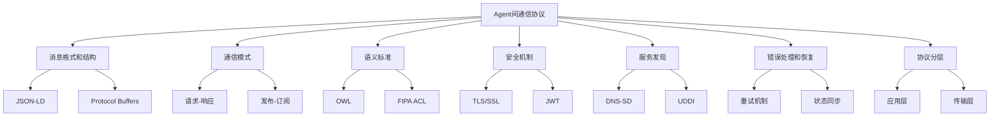
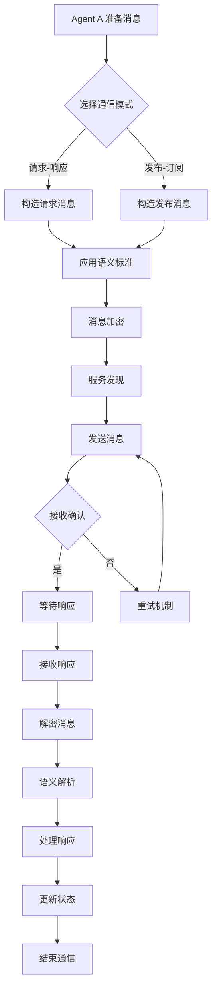
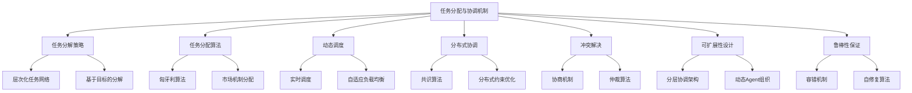
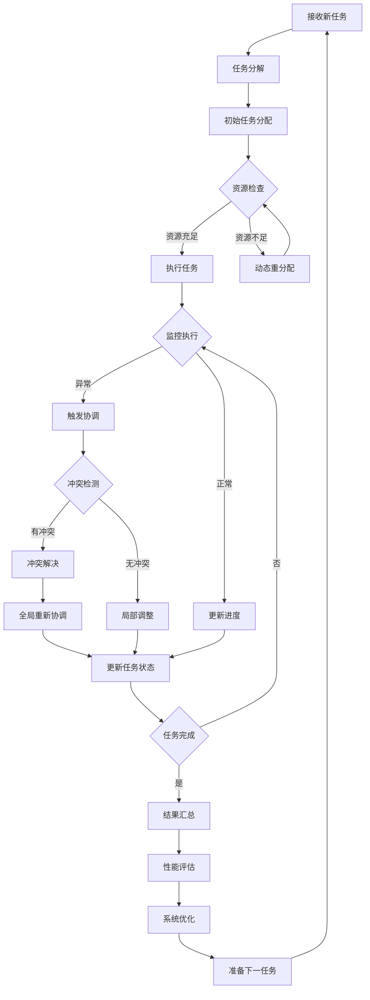
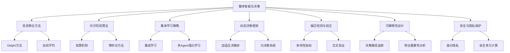
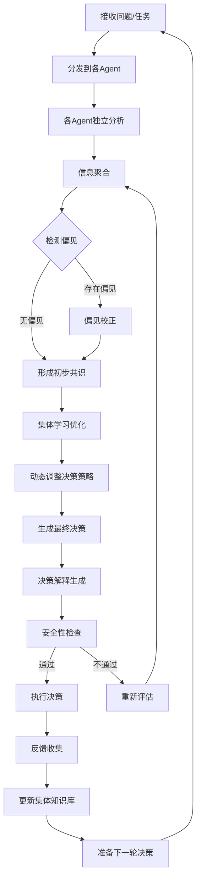
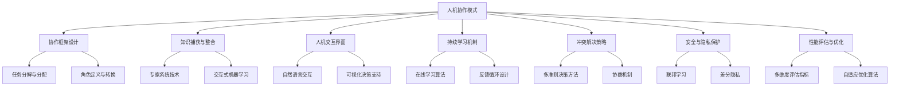
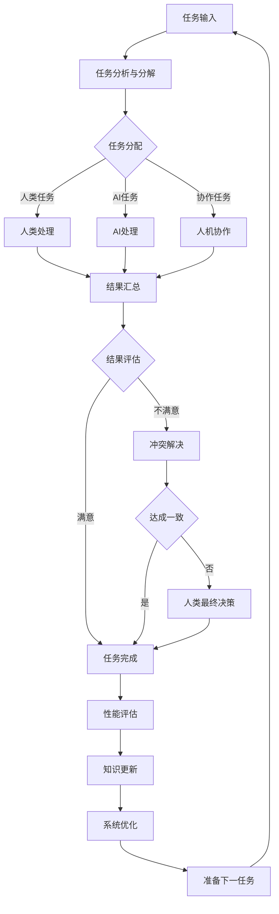

# 第18章：协作型 AI Agent 生态系统

## 18.1 Agent 间通信协议

### 核心概念

Agent间通信协议是指在协作型AI Agent生态系统中，不同Agent之间交换信息、协调行动和共享知识的标准化方法和规则。这种协议定义了Agent之间交互的语言、格式、语义和流程，确保了多个Agent能够有效地协同工作，形成一个功能强大的智能网络。在复杂的AI生态系统中，通信协议是实现分布式智能和集体决策的基础。

### 问题背景

随着AI技术的发展，单一的、孤立的AI系统已经无法满足日益复杂的实际应用需求。我们需要多个专门化的AI Agent协同工作，以处理更加复杂和多样化的任务。然而，这种协作面临着几个主要挑战：

1. 异构性：不同Agent可能使用不同的编程语言、运行在不同的平台上，或者具有不同的知识表示方式。
2. 语义理解：确保不同Agent能够准确理解彼此传递的信息的含义。
3. 协调与同步：在分布式环境中协调多个Agent的行动，保持状态的一致性。
4. 安全性：在Agent间通信过程中保护敏感信息，防止恶意干扰。
5. 可扩展性：随着生态系统中Agent数量的增加，通信协议需要能够高效处理大规模交互。

在这种背景下，设计一个高效、安全、可扩展的Agent间通信协议成为了构建协作型AI Agent生态系统的关键挑战。

### 问题描述

1. 如何设计一个通用的消息格式，以支持不同类型的Agent间交互
2. 如何实现高效的消息路由和传递机制，以支持大规模Agent网络
3. 如何确保通信的语义一致性，避免误解和错误操作
4. 如何在保证通信效率的同时，实现必要的安全和隐私保护措施
5. 如何支持动态的Agent发现和注册，以实现灵活的生态系统扩展
6. 如何处理通信中的异常情况，如Agent失效、网络中断等
7. 如何设计支持不同级别抽象的协议，从低级数据交换到高级任务协调

### 问题解决

我们将从以下几个方面详细探讨Agent间通信协议的设计和实现：

1. 消息格式和结构：
    - JSON-LD（JSON for Linked Data）
    - Protocol Buffers
    - RDF（Resource Description Framework）

2. 通信模式：
    - 请求-响应模式
    - 发布-订阅模式
    - 流式通信

3. 语义标准：
    - OWL（Web Ontology Language）
    - FIPA ACL（Agent Communication Language）
    - Schema.org vocabularies

4. 安全机制：
    - TLS/SSL加密
    - JWT（JSON Web Tokens）
    - 零知识证明

5. 服务发现：
    - DNS-SD（DNS Service Discovery）
    - UDDI（Universal Description, Discovery and Integration）
    - Decentralized Identifiers (DIDs)

6. 错误处理和恢复：
    - 重试机制
    - 断点续传
    - 状态同步

7. 协议分层：
    - 应用层协议
    - 会话层协议
    - 传输层协议

### 边界与外延

虽然本节主要关注AI Agent间的通信协议，但这些技术和方法也广泛应用于其他领域，如物联网（IoT）、微服务架构、分布式系统等。此外，我们还将探讨Agent间通信协议如何与其他技术（如区块链、5G网络）结合，以及在新兴领域如边缘计算、自主系统等方面的潜在应用。

### 概念结构与核心要素组成



### 概念之间的关系

| 组件 | 主要功能 | 输入 | 输出 | 与其他组件的关系 |
|------|---------|------|------|------------------|
| 消息格式和结构 | 定义数据表示 | 原始数据 | 结构化消息 | 为其他所有组件提供基础 |
| 通信模式 | 定义交互方式 | 通信需求 | 交互模式 | 影响消息的传递方式 |
| 语义标准 | 确保语义一致 | 领域知识 | 标准化语义 | 增强消息的理解和解释 |
| 安全机制 | 保护通信安全 | 原始消息 | 加密消息 | 作用于所有通信过程 |
| 服务发现 | 定位通信对象 | 服务需求 | Agent地址 | 支持动态通信建立 |
| 错误处理和恢复 | 提高可靠性 | 异常情况 | 恢复策略 | 作用于整个通信过程 |
| 协议分层 | 组织协议结构 | 协议需求 | 分层协议 | 为其他组件提供框架 |

### 算法流程图

Agent间通信的基本流程：



### 算法源代码

以下是一个简化的Agent间通信协议实现示例，展示了基本的消息结构、加密、发送和接收过程：

```python
import json
import uuid
from cryptography.fernet import Fernet
import asyncio

class Message:
    def __init__(self, sender, receiver, content, message_type):
        self.id = str(uuid.uuid4())
        self.sender = sender
        self.receiver = receiver
        self.content = content
        self.type = message_type
        self.timestamp = datetime.now().isoformat()

    def to_json(self):
        return json.dumps(self.__dict__)

    @classmethod
    def from_json(cls, json_str):
        data = json.loads(json_str)
        msg = cls(data['sender'], data['receiver'], data['content'], data['type'])
        msg.id = data['id']
        msg.timestamp = data['timestamp']
        return msg

class SecurityLayer:
    def __init__(self):
        self.key = Fernet.generate_key()
        self.fernet = Fernet(self.key)

    def encrypt(self, message):
        return self.fernet.encrypt(message.encode())

    def decrypt(self, encrypted_message):
        return self.fernet.decrypt(encrypted_message).decode()

class CommunicationProtocol:
    def __init__(self, agent_id):
        self.agent_id = agent_id
        self.security = SecurityLayer()
        self.message_queue = asyncio.Queue()

    async def send_message(self, receiver, content, message_type):
        message = Message(self.agent_id, receiver, content, message_type)
        encrypted_message = self.security.encrypt(message.to_json())
        # 在实际应用中，这里会涉及网络传输
        print(f"Sending message: {message.to_json()}")
        await self.message_queue.put(encrypted_message)

    async def receive_message(self):
        while True:
            encrypted_message = await self.message_queue.get()
            decrypted_message = self.security.decrypt(encrypted_message)
            message = Message.from_json(decrypted_message)
            print(f"Received message: {message.to_json()}")
            # 在这里处理接收到的消息
            await self.process_message(message)

    async def process_message(self, message):
        # 示例：简单的消息处理逻辑
        if message.type == "request":
            response_content = f"Processed request: {message.content}"
            await self.send_message(message.sender, response_content, "response")
        elif message.type == "response":
            print(f"Received response: {message.content}")

    async def run(self):
        receive_task = asyncio.create_task(self.receive_message())
        # 示例：发送一条消息
        await self.send_message("AgentB", "Hello, Agent B!", "request")
        await receive_task

# 使用示例
async def main():
    agent_a = CommunicationProtocol("AgentA")
    await agent_a.run()

asyncio.run(main())
```

这个示例实现了一个基本的Agent间通信协议，包括消息结构、加密、异步发送和接收。在实际应用中，需要进一步扩展这个系统，例如添加更复杂的路由机制、实现服务发现、增加错误处理等。

### 实际场景应用

1. 智能制造系统：
    - 协调多个生产线Agent的操作
    - 实现设备间的实时状态同步
    - 优化整体生产流程

2. 智慧城市管理：
    - 交通、能源、环境等子系统间的协作
    - 紧急情况下的跨部门协调
    - 城市服务的智能调度

3. 金融交易系统：
    - 多Agent协作进行风险评估
    - 实现跨市场、跨币种的交易协调
    - 自动化合规检查和报告

4. 分布式科学计算：
    - 大规模数据处理任务的分配和协调
    - 模型训练过程中的参数同步
    - 跨机构的安全数据共享

5. 自动驾驶车队：
    - 车辆间的实时位置和意图共享
    - 协调路径规划和交通流优化
    - 紧急情况下的集体决策

### 最佳实践 tips

1. 协议设计：
    - 采用模块化和可扩展的设计
    - 使用标准化的数据格式（如JSON-LD）
    - 考虑向后兼容性

2. 性能优化：
    - 实施消息压缩机制
    - 使用异步通信模式
    - 考虑使用高效的序列化方法（如ProtocolBuffers）

3. 安全性：
    - 实施端到端加密
    - 使用强身份验证机制
    - 定期更新安全密钥

4. 错误处理：
    - 实施重试机制with指数退避
    - 使用心跳检测保持连接活跃
    - 设计清晰的错误码和描述

5. 可扩展性：
    - 使用分布式服务发现机制
    - 实施负载均衡策略
    - 考虑使用微服务架构

6. 语义互操作性：
    - 采用标准化的本体和词汇表
    - 实施上下文感知的消息解释
    - 考虑使用语义推理引擎

7. 监控和调试：
    - 实施详细的日志记录
    - 使用分布式追踪技术
    - 考虑可视化工具for协议分析

### 行业发展与未来趋势

| 时期 | 主要特征 | 关键技术 | 挑战 | 未来展望 |
|------|---------|----------|------|----------|
| 2018-2019 | 基础协议标准化 | RESTful API、MQTT | 互操作性 | 语义Web技术集成 |
| 2020-2021 | 分布式协作 | 区块链、联邦学习 | 隐私保护 | 去中心化通信 |
| 2022-2023 | 智能协议适应 | 自适应路由、动态协议 | 复杂性管理 | 认知级通信 |
| 2024-2025 (预测) | 量子安全通信 | 量子加密、量子网络 | 技术成熟度 | 超安全生态系统 |
| 2026+ (展望) | 生物启发通信 | 神经形态计算、群体智能 | 伦理考量 | 自组织AI网络 |

Agent间通信协议在协作型AI生态系统中的应用正经历快速演变。从早期的简单消息传递到现在的复杂语义交互，我们看到了显著的进步。这些变化不仅提高了AI系统间的协作效率，还扩展了它们处理复杂任务和适应动态环境的能力。

未来的Agent间通信协议可能会更加注重以下几个方面：

1. 认知级通信：
    - 实现基于意图和目标的高级交互
    - 开发能理解上下文和隐含意义的协议
    - 探索类人对话和协商机制

2. 自适应协议：
    - 根据网络条件和任务需求动态调整协议参数
    - 实现协议的自我优化和进化
    - 探索元学习在协议设计中的应用

3. 群体智能协作：
    - 开发支持大规模Agent集群协作的协议
    - 实现基于群体决策的分布式共识机制
    - 探索生物群体行为启发的通信模式

4. 跨域语义理解：
    - 实现不同知识领域间的自动语义映射
    - 开发通用的跨领域知识表示
    - 探索基于大规模预训练模型的通信理解

5. 量子增强通信：
    - 利用量子纠缠实现超安全通信
    - 开发量子计算友好的协议
    - 探索量子网络在分布式AI中的应用

6. 情感和社交因素：
    - 在通信协议中加入情感状态传递
    - 实现社交关系感知的交互机制
    - 探索AI Agent间的"文化"和"个性"交流

7. 伦理和价值观对齐：
    - 在协议中嵌入伦理决策机制
    - 实现价值观一致性的协商和调整
    - 探索如何在Agent间传播和维护共同价值观

随着这些趋势的发展，Agent间通信协议将从单纯的信息交换机制演变为AI生态系统的神经系统。未来的协议将能够支持更复杂、更智能、更自然的Agent间交互，实现真正的分布式智能和集体决策。

这种进步将带来多方面的益处：

1. 增强协作能力：使AI系统能够处理更复杂、更大规模的任务。

2. 提高适应性：快速响应环境变化和新需求。

3. 知识共享加速：促进不同领域、不同专长Agent间的知识传播。

4. 集体智慧涌现：通过高效协作产生超越单个Agent能力的智能。

5. 系统鲁棒性：通过分布式协作提高整体系统的可靠性和容错能力。

6. 资源优化：实现更高效的任务分配和资源利用。

7. 创新能力：通过多样化Agent的交互激发新的解决方案和思路。

然而，这种发展也带来了新的挑战，如如何在复杂的交互网络中保持系统的可控性和可解释性，如何处理大规模Agent网络中的信息过载和决策冲突，如何在开放环境中确保通信的安全性和隐私保护，以及如何处理可能出现的意外涌现行为。未来的Agent间通信协议需要在效率、灵活性、安全性和伦理之间寻求平衡，确保它们不仅技术先进，还能被社会广泛接受和信任。

总的来说，Agent间通信协议将继续是构建协作型AI生态系统的核心基础。通过不断创新和优化这些协议，我们将能够构建更加智能、协调和可靠的AI网络，为解决复杂的现实世界问题提供强大工具，并推动整个AI领域向更高层次发展。这不仅将改变我们设计和部署AI系统的方式，还将为AI技术在各个领域的深入应用和持续创新铺平道路，最终推动社会和技术的进步。

## 18.2 任务分配与协调机制

### 核心概念

任务分配与协调机制是指在协作型AI Agent生态系统中，如何有效地将复杂任务分解、分配给不同的Agent，并协调它们的行动以实现整体目标的方法和策略。这种机制是实现多Agent系统高效协作的关键，它涉及任务分解、资源分配、冲突解决、进度监控等多个方面。在复杂的AI生态系统中，良好的任务分配与协调机制可以显著提高系统的整体性能、适应性和可扩展性。

### 问题背景

随着AI应用场景的复杂化和规模化，单一Agent难以独立完成所有任务。多Agent协作系统应运而生，但它也带来了一系列挑战：

1. 任务复杂性：现实世界的问题通常是多维度、多阶段的，需要精细的分解和协调。
2. 资源限制：计算能力、存储空间、通信带宽等资源都是有限的，需要高效分配。
3. 动态环境：任务要求和环境条件可能随时变化，系统需要快速适应。
4. 异构性：不同Agent可能有不同的能力和专长，需要合理匹配任务和Agent。
5. 冲突处理：多个Agent同时工作可能产生冲突，需要有效的协调机制。
6. 可扩展性：系统应能够轻松地添加或移除Agent，而不影响整体性能。
7. 鲁棒性：即使部分Agent失效，系统也应能继续运行并完成任务。

在这种背景下，设计一个高效、灵活、可靠的任务分配与协调机制成为了构建协作型AI Agent生态系统的核心挑战。

### 问题描述

1. 如何设计一个能够有效分解复杂任务的算法
2. 如何在考虑Agent能力和资源限制的情况下进行最优任务分配
3. 如何实现动态任务重分配以应对环境变化和Agent状态变化
4. 如何设计分布式决策机制以实现高效的任务协调
5. 如何处理和解决Agent之间的任务冲突和资源竞争
6. 如何实现可扩展的任务分配机制以支持大规模Agent网络
7. 如何在任务分配和协调过程中保证系统的整体性能和稳定性

### 问题解决

我们将从以下几个方面详细探讨任务分配与协调机制的设计和实现：

1. 任务分解策略：
    - 层次化任务网络（HTN）
    - 基于目标的任务分解
    - 动态任务图生成

2. 任务分配算法：
    - 匈牙利算法
    - 遗传算法
    - 市场机制based分配

3. 动态调度：
    - 实时调度算法
    - 自适应负载均衡
    - 优先级based重分配

4. 分布式协调：
    - 共识算法（如Paxos、Raft）
    - 分布式约束优化
    - 多Agent强化学习

5. 冲突解决：
    - 协商机制
    - 仲裁算法
    - 基于规则的冲突处理

6. 可扩展性设计：
    - 分层协调架构
    - 动态Agent组织
    - 云-边协同计算

7. 鲁棒性保证：
    - 容错机制
    - 备份策略
    - 自修复算法

### 边界与外延

虽然本节主要关注AI Agent生态系统中的任务分配与协调，但这些技术和方法也广泛应用于其他领域，如分布式计算、供应链管理、智能交通系统等。此外，我们还将探讨任务分配与协调机制如何与其他技术（如区块链、5G网络）结合，以及在新兴领域如智慧城市、自主机器人集群等方面的潜在应用。

### 概念结构与核心要素组成



### 概念之间的关系

| 组件 | 主要功能 | 输入 | 输出 | 与其他组件的关系 |
|------|---------|------|------|------------------|
| 任务分解策略 | 将复杂任务分解 | 整体任务 | 子任务集 | 为任务分配提供基础 |
| 任务分配算法 | 匹配任务和Agent | 子任务、Agent能力 | 分配方案 | 使用分解结果，影响调度 |
| 动态调度 | 实时调整任务执行 | 系统状态、新任务 | 更新的调度计划 | 基于分配结果，影响协调 |
| 分布式协调 | 确保一致性决策 | Agent状态、局部信息 | 全局一致的决策 | 影响所有其他组件 |
| 冲突解决 | 处理资源竞争 | 冲突情况 | 解决方案 | 与协调机制紧密相关 |
| 可扩展性设计 | 支持系统扩展 | 系统规模、拓扑 | 可扩展架构 | 影响整体系统设计 |
| 鲁棒性保证 | 确保系统可靠性 | 故障情况、风险 | 容错策略 | 作用于所有其他组件 |

### 算法流程图

协作型AI Agent生态系统中任务分配与协调的基本流程：



### 算法源代码

以下是一个简化的任务分配与协调机制的实现示例，展示了基本的任务分解、分配和动态调整过程：

```python
import random
from typing import List, Dict

class Task:
    def __init__(self, task_id: str, complexity: int, required_skills: List[str]):
        self.task_id = task_id
        self.complexity = complexity
        self.required_skills = required_skills
        self.status = "pending"

class Agent:
    def __init__(self, agent_id: str, skills: List[str], capacity: int):
        self.agent_id = agent_id
        self.skills = skills
        self.capacity = capacity
        self.current_tasks = []

class TaskManager:
    def __init__(self):
        self.tasks = []
        self.agents = []

    def add_task(self, task: Task):
        self.tasks.append(task)

    def add_agent(self, agent: Agent):
        self.agents.append(agent)

    def decompose_task(self, task: Task) -> List[Task]:
        # 简化的任务分解：根据复杂度将任务分解为多个子任务
        subtasks = []
        for i in range(task.complexity):
            subtask = Task(f"{task.task_id}_sub{i}", 1, [random.choice(task.required_skills)])
            subtasks.append(subtask)
        return subtasks

    def allocate_tasks(self):
        for task in self.tasks:
            if task.status == "pending":
                subtasks = self.decompose_task(task)
                for subtask in subtasks:
                    allocated = False
                    for agent in self.agents:
                        if set(subtask.required_skills).issubset(set(agent.skills)) and len(agent.current_tasks) < agent.capacity:
                            agent.current_tasks.append(subtask)
                            subtask.status = "allocated"
                            allocated = True
                            break
                    if not allocated:
                        print(f"Unable to allocate subtask {subtask.task_id}")
                if all(subtask.status == "allocated" for subtask in subtasks):
                    task.status = "in_progress"

    def monitor_and_adjust(self):
        for agent in self.agents:
            for task in agent.current_tasks:
                # 模拟任务执行
                if random.random() < 0.8:  # 80% 的概率任务成功完成
                    task.status = "completed"
                else:
                    task.status = "failed"
                    self.reallocate_task(task)
            agent.current_tasks = [task for task in agent.current_tasks if task.status == "in_progress"]

    def reallocate_task(self, task: Task):
        for agent in self.agents:
            if set(task.required_skills).issubset(set(agent.skills)) and len(agent.current_tasks) < agent.capacity:
                agent.current_tasks.append(task)
                task.status = "in_progress"
                print(f"Task {task.task_id} reallocated to agent {agent.agent_id}")
                return
        print(f"Failed to reallocate task {task.task_id}")

    def run_simulation(self, steps: int):
        for _ in range(steps):
            self.allocate_tasks()
            self.monitor_and_adjust()
            self.print_status()

    def print_status(self):
        print("\nCurrent Status:")
        for agent in self.agents:
            print(f"Agent {agent.agent_id}: {len(agent.current_tasks)} tasks")
        completed = sum(1 for task in self.tasks if task.status == "completed")
        print(f"Completed tasks: {completed}/{len(self.tasks)}")

# 使用示例
manager = TaskManager()

# 添加任务
for i in range(10):
    task = Task(f"Task_{i}", random.randint(1, 5), ["skill_A", "skill_B", "skill_C"])
    manager.add_task(task)

# 添加Agent
for i in range(5):
    skills = random.sample(["skill_A", "skill_B", "skill_C", "skill_D"], 2)
    agent = Agent(f"Agent_{i}", skills, random.randint(2, 5))
    manager.add_agent(agent)

# 运行模拟
manager.run_simulation(10)
```

这个示例实现了一个基本的任务分配与协调系统，包括任务分解、初始分配、执行监控和动态重分配。在实际应用中，需要进一步优化和扩展这个系统，例如添加更复杂的任务依赖关系处理、实现分布式协调机制、增加高级的冲突解决策略等。

### 实际场景应用

1. 智能制造系统：
    - 协调多个生产线和机器人的任务
    - 动态调整生产计划应对设备故障或订单变化
    - 优化资源利用和生产效率

2. 智慧物流：
    - 实时分配和调度运输任务
    - 协调仓储、配送和客户服务
    - 优化路线规划和负载均衡

3. 分布式计算：
    - 大规模数据处理任务的分配
    - 动态负载均衡和任务迁移
    - 容错和失败恢复机制

4. 智能电网管理：
    - 协调发电、输电和配电系统
    - 动态调整能源分配应对需求波动
    - 故障检测和自动恢复

5. 智慧城市管理：
    - 跨部门任务协调（如交通、环境、安全）
    - 紧急情况下的资源动态分配
    - 优化城市服务和资源利用

### 最佳实践 tips

1. 任务建模：
    - 使用标准化的任务描述语言
    - 考虑任务间的依赖关系和优先级
    - 实施动态任务分解机制

2. Agent能力评估：
    - 建立全面的Agent能力模型
    - 实施动态能力评估机制
    - 考虑Agent的学习和进步

3. 分配算法选择：
    - 根据问题规模选择适当的算法
    - 考虑使用启发式方法处理大规模问题
    - 实施多目标优化以平衡不同需求

4. 动态调整策略：
    - 实施实时监控和预测机制
    - 使用滚动时域优化方法
    - 考虑设置触发阈值for重分配

5. 分布式协调：
    - 选择适合系统规模的共识算法
    - 实施分层协调架构
    - 考虑使用gossip协议for信息传播

6. 冲突解决：
    - 设计清晰的冲突分类体系
    - 实施多层次的冲突解决机制
    - 考虑使用博弈论方法for复杂冲突

7. 系统可扩展性：
    - 采用模块化设计
    - 实施动态Agent加入/退出机制
    - 考虑使用分布式存储和计算框架

### 行业发展与未来趋势

| 时期 | 主要特征 | 关键技术 | 挑战 | 未来展望 |
|------|---------|----------|------|----------|
| 2018-2019 | 中心化协调 | 启发式算法、规则based系统 | 可扩展性 | 分布式协调 |
| 2020-2021 | 智能优化 | 强化学习、进化算法 | 实时性 | 自适应系统 |
| 2022-2023 | 去中心化协作 | 区块链、联邦学习 | 一致性 | 自组织网络 |
| 2024-2025 (预测) | 认知协调 | 元学习、因果推理 | 复杂性 | 意图理解 |
| 2026+ (展望) | 自主生态系统 | 群体智能、涌现行为 | 可控性 | 类生命系统 |

任务分配与协调机制在协作型AI Agent生态系统中的应用正经历快速演变。从早期的简单规则based分配到现在的智能化、自适应协调，我们看到了显著的进步。这些变化不仅提高了系统的效率和灵活性，还扩展了AI生态系统处理复杂、动态任务的能力。

未来的任务分配与协调机制可能会更加注重以下几个方面：

1. 认知协调：
    - 理解任务和Agent的深层语义和意图
    - 实现基于目标和上下文的智能分配
    - 探索类人推理在任务规划中的应用

2. 自组织网络：
    - 实现Agent自主形成动态协作网络
    - 开发基于局部信息的全局优化方法
    - 探索生物群体行为启发的协调机制

3. 预测性协调：
    - 利用预测模型进行前瞻性任务分配
    - 实现基于风险评估的鲁棒协调
    - 探索因果推理在复杂任务规划中的应用

4. 多目标动态优化：
    - 实现实时多目标权衡和决策
    - 开发动态约束下的适应性优化方法
    - 探索在线学习在持续优化中的应用

5. 人机协作协调：
    - 整合人类专家知识和AI决策
    - 开发直观的人机交互接口for协调调整
    - 探索混合智能系统在复杂任务管理中的潜力

6. 伦理感知协调：
    - 在任务分配中考虑伦理因素
    - 实现价值对齐的多Agent协作
    - 探索如何在协调过程中平衡效率和公平

7. 跨域协调：
    - 实现不同领域、不同类型Agent间的协作
    - 开发通用的跨域任务描述和匹配机制
    - 探索知识迁移在跨域协调中的应用

随着这些趋势的发展，任务分配与协调机制将从单纯的资源管理工具演变为AI生态系统的"大脑"和"神经系统"。未来的机制将能够更智能、更灵活地组织和调度资源，实现类似生物系统的自组织、自适应和自优化。

这种进步将带来多方面的益处：

1. 提高系统效率：通过智能协调显著提升资源利用率和任务完成速度。

2. 增强适应性：快速响应环境变化和新需求，实现动态任务管理。

3. 扩展处理能力：协调更大规模、更复杂的任务网络。

4. 提升鲁棒性：通过分布式协调和自修复机制增强系统可靠性。

5. 促进创新：通过跨域协作激发新的问题解决方式。

6. 优化资源分配：实现更精细、更公平的资源分配。

7. 支持可持续发展：通过智能协调减少资源浪费，提高系统整体效能。

然而，这种发展也带来了新的挑战，如如何在复杂的协调过程中保持系统的可解释性和可控性，如何处理大规模分布式系统中的不确定性和延迟，如何在开放环境中确保协调的安全性和隐私保护，以及如何平衡局部优化和全局优化。未来的任务分配与协调机制需要在效率、灵活性、可靠性和伦理之间寻求平衡，确保它们不仅技术先进，还能被社会广泛接受和信任。

总的来说，任务分配与协调机制将继续是构建高效、智能的协作型AI Agent生态系统的核心。通过不断创新和优化这些机制，我们将能够构建更加智能、协调和可靠的AI网络，为解决复杂的现实世界问题提供强大工具，并推动整个AI领域向更高层次发展。这不仅将改变我们组织和管理复杂系统的方式，还将为AI技术在各个领域的深入应用和持续创新铺平道路，最终推动社会和技术的进步。

## 18.3 集体智能与决策

### 核心概念

集体智能与决策是指在协作型AI Agent生态系统中，通过整合多个Agent的知识、能力和观点，形成超越单个Agent能力的集体智慧，并基于这种集体智慧做出更优决策的过程。这种机制利用了群体的多样性和协同效应，能够处理更复杂的问题，做出更准确、更可靠的决策。在复杂的AI生态系统中，集体智能与决策是实现高级认知功能和自主决策的关键。

### 问题背景

随着AI技术的发展和应用场景的复杂化，单一Agent的决策能力往往无法满足实际需求。同时，现实世界的许多问题具有多维度、高度不确定性和动态变化的特点，这就要求决策系统能够整合多源信息，考虑多方面因素，并能够快速适应环境变化。此外，在某些关键领域（如医疗诊断、金融投资、城市管理等），决策的准确性和可靠性至关重要，需要集体智慧来降低错误风险。

在这种背景下，我们面临以下挑战：

1. 信息聚合：如何有效整合来自不同Agent的异构信息。
2. 观点融合：如何处理可能存在的冲突观点和偏见。
3. 决策质量：如何确保集体决策优于个体决策。
4. 动态适应：如何在环境变化时快速调整决策策略。
5. 可解释性：如何使集体决策过程透明和可解释。
6. 效率与规模：如何在大规模Agent网络中高效实现集体决策。
7. 鲁棒性：如何应对个别Agent失效或提供错误信息的情况。

### 问题描述

1. 如何设计有效的信息聚合机制，整合多个Agent的知识和观点
2. 如何在考虑Agent可靠性和专业度的情况下进行加权决策
3. 如何识别和处理Agent间的认知偏差和信息冲突
4. 如何实现动态的决策策略，以适应不断变化的环境和任务需求
5. 如何在保证决策质量的同时，提高集体决策的效率和可扩展性
6. 如何设计分布式的集体决策机制，以支持大规模Agent网络
7. 如何在集体决策过程中保证系统的安全性和隐私保护

### 问题解决

我们将从以下几个方面详细探讨集体智能与决策机制的设计和实现：

1. 信息聚合方法：
    - Delphi方法
    - 加权平均
    - 贝叶斯融合

2. 共识形成算法：
    - 投票机制
    - 博弈论方法
    - 分布式共识协议

3. 集体学习策略：
    - 集成学习
    - 多Agent强化学习
    - 联邦学习

4. 动态决策框架：
    - 自适应决策树
    - 元决策系统
    - 在线学习算法

5. 偏见检测与校正：
    - 多样性指标
    - 交叉验证
    - 对抗性验证

6. 可解释性设计：
    - 决策路径追踪
    - 特征重要性分析
    - 可视化技术

7. 安全与隐私保护：
    - 差分隐私
    - 安全多方计算
    - 零知识证明

### 边界与外延

虽然本节主要关注AI Agent生态系统中的集体智能与决策，但这些技术和方法也广泛应用于其他领域，如群体决策支持系统、社交网络分析、公共政策制定等。此外，我们还将探讨集体智能与决策机制如何与其他技术（如区块链、量子计算）结合，以及在新兴领域如智慧城市、全球治理等方面的潜在应用。

### 概念结构与核心要素组成



### 概念之间的关系

| 组件 | 主要功能 | 输入 | 输出 | 与其他组件的关系 |
|------|---------|------|------|------------------|
| 信息聚合方法 | 整合多源信息 | 各Agent输入 | 综合信息 | 为其他所有组件提供基础 |
| 共识形成算法 | 达成一致决策 | 各Agent意见 | 集体决策 | 基于聚合信息，影响最终决策 |
| 集体学习策略 | 提升整体能力 | 历史数据和决策 | 优化模型 | 持续改进其他组件效果 |
| 动态决策框架 | 适应环境变化 | 当前状态、目标 | 决策策略 | 协调其他组件的动态行为 |
| 偏见检测与校正 | 提高决策公正性 | 决策过程数据 | 校正建议 | 作用于信息聚合和共识形成 |
| 可解释性设计 | 增加透明度 | 决策过程 | 解释信息 | 贯穿于所有其他组件 |
| 安全与隐私保护 | 保护敏感信息 | 原始数据 | 安全决策 | 影响所有涉及数据处理的组件 |

### 算法流程图

协作型AI Agent生态系统中集体智能与决策的基本流程：



### 算法源代码

以下是一个简化的集体智能与决策系统的实现示例，展示了基本的信息聚合、共识形成和动态调整过程：

```python
import numpy as np
from typing import List, Dict
from sklearn.ensemble import RandomForestClassifier
from sklearn.metrics import accuracy_score

class Agent:
    def __init__(self, agent_id: str, expertise: float):
        self.agent_id = agent_id
        self.expertise = expertise
        self.model = RandomForestClassifier(n_estimators=10)

    def analyze(self, data: np.ndarray) -> np.ndarray:
        return self.model.predict(data)

    def learn(self, X: np.ndarray, y: np.ndarray):
        self.model.fit(X, y)

class CollectiveIntelligenceSystem:
    def __init__(self):
        self.agents: List[Agent] = []
        self.meta_learner = RandomForestClassifier(n_estimators=50)

    def add_agent(self, agent: Agent):
        self.agents.append(agent)

    def aggregate_information(self, data: np.ndarray) -> np.ndarray:
        predictions = np.array([agent.analyze(data) for agent in self.agents])
        weights = np.array([agent.expertise for agent in self.agents])
        weighted_predictions = predictions * weights[:, np.newaxis]
        return np.sum(weighted_predictions, axis=0) / np.sum(weights)

    def form_consensus(self, aggregated_info: np.ndarray) -> np.ndarray:
        # 简化的共识形成：使用多数投票
        return np.round(aggregated_info).astype(int)

    def detect_bias(self, decisions: np.ndarray, ground_truth: np.ndarray) -> bool:
        accuracy = accuracy_score(ground_truth, decisions)
        return accuracy < 0.7  # 简化的偏见检测：如果准确率低于70%，认为存在偏见

    def correct_bias(self, decisions: np.ndarray, ground_truth: np.ndarray) -> np.ndarray:
        # 简化的偏见校正：使用元学习器
        self.meta_learner.fit(decisions.reshape(-1, 1), ground_truth)
        return self.meta_learner.predict(decisions.reshape(-1, 1))

    def collective_learning(self, X: np.ndarray, y: np.ndarray):
        for agent in self.agents:
            # 简化的集体学习：每个Agent使用全部数据学习
            agent.learn(X, y)

    def make_decision(self, data: np.ndarray) -> np.ndarray:
        aggregated_info = self.aggregate_information(data)
        consensus = self.form_consensus(aggregated_info)
        return consensus

    def explain_decision(self, decision: np.ndarray, data: np.ndarray) -> Dict[str, float]:
        # 简化的决策解释：使用特征重要性
        feature_importance = self.meta_learner.feature_importances_
        return dict(zip(range(len(feature_importance)), feature_importance))

    def run_simulation(self, X: np.ndarray, y: np.ndarray, test_X: np.ndarray, test_y: np.ndarray, iterations: int):
        for i in range(iterations):
            print(f"\nIteration {i+1}")
            
            # 做出决策
            decisions = self.make_decision(test_X)
            
            # 检测和校正偏见
            if self.detect_bias(decisions, test_y):
                print("Bias detected, correcting...")
                decisions = self.correct_bias(decisions, test_y)
            
            # 评估性能
            accuracy = accuracy_score(test_y, decisions)
            print(f"Accuracy: {accuracy:.4f}")
            
            # 解释决策
            explanation = self.explain_decision(decisions, test_X)
            print("Decision explanation:", explanation)
            
            # 集体学习
            self.collective_learning(X, y)

# 使用示例
np.random.seed(42)
X = np.random.rand(1000, 5)
y = (X[:, 0] + X[:, 1] > 1).astype(int)
test_X = np.random.rand(200, 5)
test_y = (test_X[:, 0] + test_X[:, 1] > 1).astype(int)

system = CollectiveIntelligenceSystem()
for i in range(5):
    agent = Agent(f"Agent_{i}", np.random.uniform(0.5, 1.0))
    system.add_agent(agent)

system.run_simulation(X, y, test_X, test_y, iterations=5)
```

这个示例实现了一个基本的集体智能与决策系统，包括信息聚合、共识形成、偏见检测和校正、集体学习以及决策解释。在实际应用中，需要进一步优化和扩展这个系统，例如添加更复杂的共识算法、实现分布式决策机制、增强安全性和隐私保护等。

### 实际场景应用

1. 医疗诊断系统：
    - 整合多位专家的诊断意见
    - 考虑不同检查结果的权重
    - 动态调整诊断策略应对新疾病

2. 金融投资决策：
    - 融合多种市场分析模型
    - 动态调整投资组合
    - 识别和校正市场偏见

3. 智慧城市管理：
    - 整合交通、环境、安全等多个领域的数据
    - 协调多个部门的决策
    - 预测和应对城市问题

4. 供应链优化：
    - 汇总多个供应商和物流节点的信息
    - 动态调整库存和配送策略
    - 预测和应对供应链风险

5. 科学研究协作：
    - 整合多个研究团队的发现
    - 集体评估研究假设
    - 动态调整研究方向

### 最佳实践 tips

1. 多样性保证：
    - 确保Agent群体的多样性
    - 考虑使用不同类型的模型和算法
    - 定期评估和调整Agent组合

2. 权重动态调整：
    - 基于历史表现动态调整Agent权重
    - 考虑任务特性进行专门化权重分配
    - 实施自适应权重学习机制

3. 异常检测：
    - 实施多层次的异常检测机制
    - 考虑使用统计方法和机器学习相结合的方法
    - 建立动态更新的正常行为模型

4. 决策质量保证：
    - 实施交叉验证和holdout测试
    - 使用多种评估指标
    - 考虑引入人类专家进行定期审核

5. 可解释性增强：
    - 使用直观的可视化技术
    - 提供多层次的解释（从高级概述到详细分析）
    - 考虑使用反事实解释方法

6. 隐私保护：
    - 实施数据最小化原则
    - 使用联邦学习等分布式学习方法
    - 考虑同态加密技术for敏感数据处理

7. 持续优化：
    - 建立反馈循环机制
    - 实施在线学习和增量更新
    - 考虑使用元学习优化整体决策框架

### 行业发展与未来趋势

| 时期 | 主要特征 | 关键技术 | 挑战 | 未来展望 |
|------|---------|----------|------|----------|
| 2018-2019 | 基础集成 | 集成学习、投票机制 | 异构性 | 动态集成 |
| 2020-2021 | 分布式决策 | 联邦学习、区块链 | 通信效率 | 边缘智能 |
| 2022-2023 | 自适应系统 | 元学习、神经架构搜索 | 实时性 | 认知决策 |
| 2024-2025 (预测) | 认知协同 | 因果推理、概念学习 | 语义理解 | 群体智慧 |
| 2026+ (展望) | 涌现智能 | 量子集体计算、脑机接口 | 伦理约束 | 超人类决策 |

集体智能与决策在协作型AI Agent生态系统中的应用正经历快速演变。从早期的简单集成方法到现在的复杂自适应系统，我们看到了显著的进步。这些变化不仅提高了决策的质量和效率，还扩展了AI系统处理复杂、不确定问题的能力。

未来的集体智能与决策机制可能会更加注重以下几个方面：

1. 认知协同：
    - 实现基于深层语义理解的信息融合
    - 开发模拟人类认知过程的集体决策模型
    - 探索概念级别的知识整合和推理

2. 动态自组织：
    - 实现基于任务和环境的动态Agent组织
    - 开发自适应的决策结构和流程
    - 探索群体涌现行为在决策中的应用

3. 多模态融合：
    - 整合视觉、语言、数值等多种模态的信息
    - 开发跨模态的知识表示和推理方法
    - 探索多感官决策在复杂环境中的应用

4. 长期记忆与持续学习：
    - 实现集体知识的长期积累和演化
    - 开发增量学习和遗忘机制
    - 探索类人的经验传承和文化形成过程

5. 分布式共识与协作：
    - 开发高效的大规模分布式决策算法
    - 实现跨域、跨组织的协作决策
    - 探索去中心化自治组织(DAO)在集体决策中的应用

6. 伦理感知决策：
    - 将伦理考量纳入决策过程
    - 开发价值对齐的集体决策机制
    - 探索如何在AI系统中实现道德推理

7. 人机共生决策：
    - 设计高效的人机协作决策接口
    - 开发互补性人机决策模型
    - 探索增强人类决策能力的AI辅助系统

随着这些趋势的发展，集体智能与决策将从单纯的信息处理和选择机制演变为AI生态系统的"集体意识"。未来的系统将能够更自然、更智能地整合多源信息，进行复杂推理，并做出高质量的决策。

这种进步将带来多方面的益处：

1. 决策质量提升：通过整合多样化的知识和视角，显著提高决策准确性和可靠性。

2. 适应性增强：快速响应复杂、动态的环境变化，实现智能化的策略调整。

3. 创新能力提升：通过多元化的知识融合，激发新的思路和解决方案。

4. 风险管理优化：综合考虑多方面因素，更好地识别和应对潜在风险。

5. 效率提升：通过并行处理和智能分工，加速复杂问题的解决过程。

6. 公平性增强：通过多方参与和偏见校正，减少决策中的偏见和不公。

7. 知识积累加速：实现集体学习和知识传承，促进整个系统的持续进化。

然而，这种发展也带来了新的挑战，如如何在复杂的集体决策过程中保持透明度和可解释性，如何平衡个体Agent的自主性和集体一致性，如何处理大规模分布式系统中的信息不对称和延迟问题，以及如何确保集体决策的伦理性和责任归属。未来的集体智能与决策机制需要在效率、准确性、公平性和伦理之间寻求平衡，确保它们不仅技术先进，还能被社会广泛接受和信任。

总的来说，集体智能与决策将继续是构建高级AI系统的核心能力之一。通过不断创新和优化这些机制，我们将能够构建更加智能、协调和可靠的AI生态系统，为解决复杂的现实世界问题提供强大工具，并推动整个AI领域向更高层次发展。这不仅将改变我们制定决策和解决问题的方式，还将为AI技术在各个领域的深入应用和持续创新铺平道路，最终推动社会和技术的进步。

## 18.4 人机协作模式

### 核心概念

人机协作模式是指在协作型AI Agent生态系统中，人类与AI系统共同工作、相互补充、协同决策的方式和框架。这种模式旨在结合人类的创造力、直觉和经验与AI的快速计算、大数据处理和模式识别能力，以实现比单独人类或AI更优的性能和结果。在复杂的AI生态系统中，人机协作模式是实现高级认知任务、解决复杂问题和确保AI系统可控可信的关键。

### 问题背景

随着AI技术的快速发展，AI系统在许多领域已经达到或超过了人类的能力。然而，AI仍然存在一些固有的局限性，如缺乏常识推理、难以处理高度不确定和模糊的情况、缺乏创造性思维等。同时，在某些关键决策领域（如医疗诊断、金融投资、法律判断等），完全依赖AI决策可能带来严重的风险和伦理问题。另一方面，人类虽然具有独特的认知能力和判断力，但在处理大规模数据、执行重复性任务等方面不如AI高效。

在这种背景下，我们面临以下挑战：

1. 角色定位：如何合理分配人类和AI的任务和职责。
2. 交互设计：如何设计直观、高效的人机交互界面和流程。
3. 信任建立：如何增强人类对AI系统的理解和信任。
4. 能力互补：如何最大化发挥人类和AI各自的优势。
5. 动态适应：如何根据任务和情境动态调整人机协作模式。
6. 性能评估：如何评估和优化人机协作的整体效果。
7. 伦理考量：如何在协作过程中处理伦理和责任问题。

### 问题描述

1. 如何设计一个灵活的人机协作框架，适应不同的任务类型和复杂度
2. 如何实现人类专家知识的有效捕获和整合到AI系统中
3. 如何设计直观、响应迅速的人机交互接口，减少认知负担
4. 如何在人机协作过程中实现连续学习和能力提升
5. 如何处理人类决策者与AI系统之间的分歧和冲突
6. 如何在保护隐私和安全的前提下实现高效的人机信息交换
7. 如何评估和量化人机协作的效果，并持续优化协作模式

### 问题解决

我们将从以下几个方面详细探讨人机协作模式的设计和实现：

1. 协作框架设计：
    - 任务分解与分配
    - 角色定义与转换
    - 协作流程建模

2. 知识捕获与整合：
    - 专家系统技术
    - 交互式机器学习
    - 知识图谱构建

3. 人机交互界面：
    - 自然语言交互
    - 可视化决策支持
    - 增强现实接口

4. 持续学习机制：
    - 在线学习算法
    - 反馈循环设计
    - 人机共同进化

5. 冲突解决策略：
    - 多准则决策方法
    - 协商机制
    - 解释性反馈

6. 安全与隐私保护：
    - 联邦学习
    - 差分隐私
    - 安全多方计算

7. 性能评估与优化：
    - 多维度评估指标
    - A/B测试框架
    - 自适应优化算法

### 边界与外延

虽然本节主要关注AI Agent生态系统中的人机协作模式，但这些技术和方法也广泛应用于其他领域，如人机交互设计、认知工程、组织行为学等。此外，我们还将探讨人机协作模式如何与其他技术（如脑机接口、虚拟现实）结合，以及在新兴领域如智能教育、个性化医疗等方面的潜在应用。

### 概念结构与核心要素组成



### 概念之间的关系

| 组件 | 主要功能 | 输入 | 输出 | 与其他组件的关系 |
|------|---------|------|------|------------------|
| 协作框架设计 | 定义协作结构 | 任务需求、资源 | 协作方案 | 为其他所有组件提供基础 |
| 知识捕获与整合 | 融合人类知识 | 专家输入、数据 | 知识库 | 增强AI能力，支持决策 |
| 人机交互界面 | 实现有效交互 | 用户操作、系统状态 | 交互结果 | 连接人类和AI系统 |
| 持续学习机制 | 不断优化系统 | 交互数据、反馈 | 更新模型 | 提升整体性能 |
| 冲突解决策略 | 处理分歧 | 人机意见 | 一致决策 | 确保协作顺畅 |
| 安全与隐私保护 | 保护敏感信息 | 原始数据 | 安全处理结果 | 贯穿所有数据交互过程 |
| 性能评估与优化 | 评估和改进 | 系统表现数据 | 优化建议 | 指导其他组件的改进 |

### 算法流程图

人机协作模式的基本流程：



### 算法源代码

以下是一个简化的人机协作系统的实现示例，展示了基本的任务分配、协作处理和学习优化过程：

```python
import numpy as np
from typing import List, Dict, Tuple
from sklearn.ensemble import RandomForestClassifier
from sklearn.metrics import accuracy_score

class HumanAgent:
    def __init__(self, expertise: float, error_rate: float):
        self.expertise = expertise
        self.error_rate = error_rate

    def process(self, task: np.ndarray) -> np.ndarray:
        # 模拟人类处理任务，引入一些随机错误
        result = task.copy()
        mask = np.random.random(task.shape) < self.error_rate
        result[mask] = 1 - result[mask]
        return result

class AIAgent:
    def __init__(self):
        self.model = RandomForestClassifier(n_estimators=10)

    def train(self, X: np.ndarray, y: np.ndarray):
        self.model.fit(X, y)

    def process(self, task: np.ndarray) -> np.ndarray:
        return self.model.predict(task)

class HumanAICollaboration:
    def __init__(self, human: HumanAgent, ai: AIAgent):
        self.human = human
        self.ai = ai
        self.confidence_threshold = 0.7

    def collaborate(self, task: np.ndarray) -> np.ndarray:
        ai_result = self.ai.process(task)
        ai_confidence = np.max(self.ai.model.predict_proba(task), axis=1)
        
        final_result = np.zeros_like(ai_result)
        for i in range(len(task)):
            if ai_confidence[i] >= self.confidence_threshold:
                final_result[i] = ai_result[i]
            else:
                final_result[i] = self.human.process(task[i].reshape(1, -1))[0]
        
        return final_result

    def update_model(self, task: np.ndarray, true_labels: np.ndarray):
        self.ai.train(task, true_labels)

    def evaluate_performance(self, task: np.ndarray, true_labels: np.ndarray) -> float:
        collaborative_result = self.collaborate(task)
        return accuracy_score(true_labels, collaborative_result)

def simulate_tasks(num_tasks: int, task_size: int, feature_dim: int) -> Tuple[np.ndarray, np.ndarray]:
    X = np.random.rand(num_tasks * task_size, feature_dim)
    y = (X[:, 0] + X[:, 1] > 1).astype(int)
    return X, y

def main():
    # 初始化agents
    human = HumanAgent(expertise=0.8, error_rate=0.2)
    ai = AIAgent()
    collaboration = HumanAICollaboration(human, ai)

    # 生成任务
    X, y = simulate_tasks(num_tasks=100, task_size=10, feature_dim=5)

    # 初始训练
    train_size = int(0.7 * len(X))
    ai.train(X[:train_size], y[:train_size])

    # 模拟协作过程
    for i in range(10):
        start = train_size + i * 100
        end = start + 100
        task = X[start:end]
        true_labels = y[start:end]

        # 协作处理任务
        result = collaboration.collaborate(task)

        # 评估性能
        performance = collaboration.evaluate_performance(task, true_labels)
        print(f"Iteration {i+1}, Performance: {performance:.4f}")

        # 更新模型
        collaboration.update_model(task, true_labels)

if __name__ == "__main__":
    main()
```

这个示例实现了一个基本的人机协作系统，包括任务处理、协作决策、性能评估和模型更新。在实际应用中，需要进一步优化和扩展这个系统，例如添加更复杂的交互机制、实现动态任务分配、增强冲突解决策略等。

### 实际场景应用

1. 医疗诊断辅助：
    - AI分析医学图像和患者数据
    - 医生审核AI建议并做出最终诊断
    - 系统从医生反馈中学习和改进

2. 金融投资决策：
    - AI进行市场分析和风险评估
    - 投资专家根据AI分析调整投资策略
    - 系统记录决策结果，持续优化模型

3. 智能客户服务：
    - AI处理常规查询和简单问题
    - 人工客服处理复杂问题和特殊情况
    - 系统学习人工处理方式，提高自动化水平

4. 智慧城市管理：
    - AI监控和预测城市问题（如交通拥堵、环境污染）
    - 管理人员根据AI建议制定政策和措施
    - 系统评估措施效果，优化预测和建议模型

5. 教育个性化学习：
    - AI分析学生学习数据，推荐学习内容
    - 教师根据AI建议和个人判断调整教学计划
    - 系统从学生进步和教师反馈中优化推荐算法

### 最佳实践 tips

1. 任务分配优化：
    - 基于任务特性和难度动态分配
    - 考虑人类和AI的当前状态和负载
    - 实施自适应任务切换机制

2. 交互界面设计：
    - 提供直观、响应迅速的用户界面
    - 使用多模态交互（语音、视觉、触觉）
    - 考虑用户认知负荷，避免信息过载

3. 信任建立：
    - 提供AI决策的清晰解释
    - 展示历史性能和可靠性数据
    - 允许用户调整AI参与度

4. 知识整合：
    - 使用交互式机器学习捕获人类知识
    - 实施持续的知识更新机制
    - 考虑使用知识图谱表示复杂领域知识

5. 冲突解决：
    - 设计结构化的分歧解决流程
    - 提供多角度的问题分析
    - 实施动态的决策权重调整

6. 性能监控与优化：
    - 使用多维度的评估指标
    - 实施实时性能监控和报警机制
    - 考虑使用A/B测试持续优化协作模式

7. 伦理和责任：
    - 明确定义人类和AI的责任边界
    - 实施透明的决策审计机制
    - 考虑建立伦理审查委员会

### 行业发展与未来趋势

| 时期 | 主要特征 | 关键技术 | 挑战 | 未来展望 |
|------|---------|----------|------|----------|
| 2018-2019 | 基础协作 | 专家系统、决策支持 | 交互效率 | 自然交互 |
| 2020-2021 | 智能辅助 | 深度学习、NLP | 信任建立 | 情境感知 |
| 2022-2023 | 自适应协作 | 强化学习、元学习 | 动态适应 | 认知增强 |
| 2024-2025 (预测) | 认知协同 | 脑机接口、情感计算 | 深度理解 | 思维融合 |
| 2026+ (展望) | 共生智能 | 量子认知、意识模拟 | 伦理边界 | 超人类智能 |

人机协作模式在AI Agent生态系统中的应用正经历快速演变。从早期的简单辅助工具到现在的智能协作伙伴，我们看到了显著的进步。这些变化不仅提高了人类的工作效率和决策质量，还扩展了人类认知和问题解决的边界。

未来的人机协作模式可能会更加注重以下几个方面：

1. 深度认知融合：
    - 实现人类思维和AI推理的无缝结合
    - 开发模拟人类直觉和创造力的AI模型
    - 探索增强人类认知能力的AI辅助系统

2. 情境感知协作：
    - 根据任务环境和用户状态动态调整协作模式
    - 开发能理解复杂社会和文化背景的AI系统
    - 探索在高度不确定环境中的人机协同决策

3. 多模态交互：
    - 整合视觉、语音、触觉等多种交互方式
    - 开发能理解和表达微妙情感的AI接口
    - 探索虚拟现实和增强现实在人机协作中的应用

4. 持续学习与适应：
    - 实现从人机交互中持续学习和进化的AI系统
    - 开发能快速适应新任务和新环境的协作模式
    - 探索人机共同学习和知识创造的机制

5. 伦理和信任框架：
    - 建立人机协作的伦理准则和责任机制
    - 开发可解释、可审计的AI决策系统
    - 探索如何在人机协作中平衡效率和人类价值观

6. 集体智能增强：
    - 扩展人机协作到多人多AI的复杂网络
    - 开发支持大规模分布式协作的平台
    - 探索如何通过人机协作实现群体智慧的涌现

7. 认知增强与人类潜能开发：
    - 设计能扩展人类认知边界的AI工具
    - 开发个性化的认知训练和增强系统
    - 探索AI辅助下的人类创造力和问题解决能力提升

随着这些趋势的发展，人机协作模式将从简单的工具使用关系演变为深度的智能共生关系。未来的系统将能够更自然、更智能地与人类互动，实现真正的协同增效。

这种进步将带来多方面的益处：

1. 决策质量提升：结合人类洞察力和AI分析能力，做出更明智的决策。

2. 效率大幅提高：AI处理繁琐任务，人类专注于创造性工作。

3. 创新能力增强：AI提供新视角和可能性，激发人类创新思维。

4. 个性化体验：AI根据个人特点和需求，提供定制化的协作体验。

5. 技能快速提升：通过与AI协作，人类可以更快地学习和掌握新技能。

6. 认知边界扩展：AI辅助人类理解和处理更复杂的问题和概念。

7. 工作满意度提升：减少重复性工作，增加有意义和创造性的任务。

然而，这种发展也带来了新的挑战，如如何在深度协作中保持人类的自主性和创造力，如何处理人机协作中可能出现的责任和伦理问题，如何确保AI系统不会加剧社会不平等，以及如何在提高效率的同时保护人类的隐私和数据安全。未来的人机协作模式需要在效率、创新、伦理和人文关怀之间寻求平衡，确保技术进步能够真正造福人类社会。

总的来说，人机协作模式将继续是AI技术与人类社会深度融合的关键桥梁。通过不断创新和优化这些协作模式，我们将能够构建更加智能、人性化和可持续的工作和生活方式，为解决人类面临的复杂挑战提供新的可能性，并推动整个社会向更高层次发展。这不仅将改变我们的工作方式和生活方式，还将重新定义人类与技术的关系，最终推动人类文明的进步。