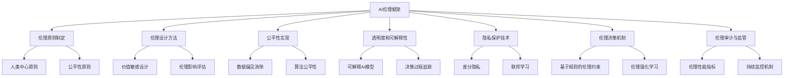
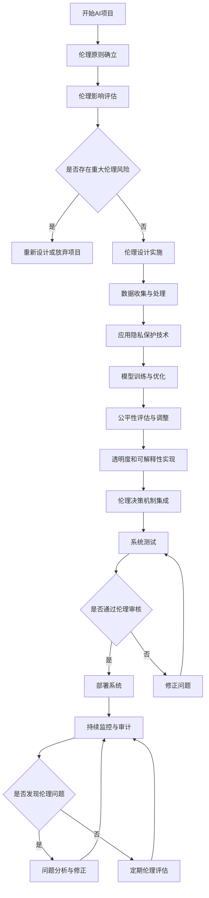
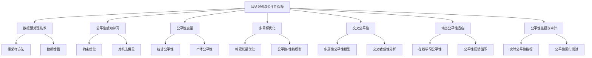
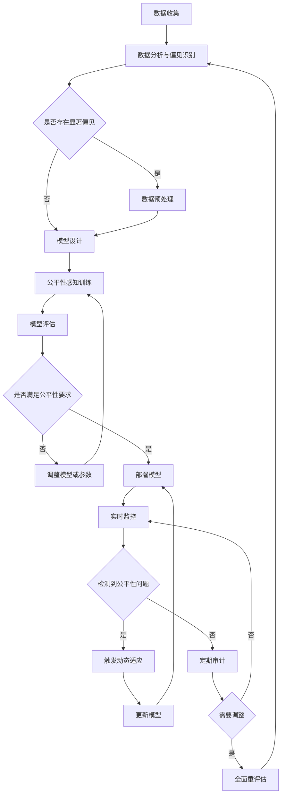
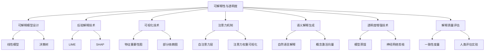
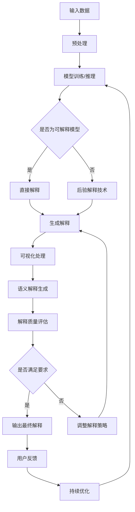
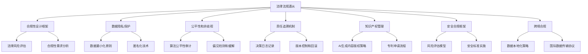
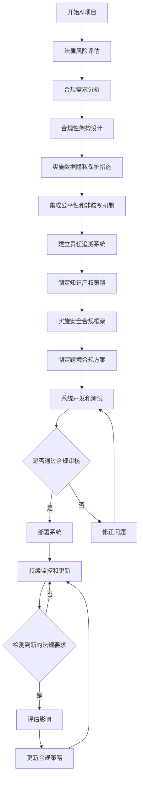

# 第19章：AI Agent 伦理与监管

## 19.1 AI 伦理框架

### 核心概念

AI伦理框架是指在设计、开发、部署和使用AI Agent系统时，用以指导和规范相关行为的一套原则、标准和实践指南。这个框架旨在确保AI技术的发展和应用符合人类的价值观和道德标准，保护个人权益，促进社会公平，并最大化AI对人类社会的积极影响。在复杂的AI生态系统中，伦理框架是确保AI Agent行为可控、可信和负责任的基础。

### 问题背景

随着AI技术的快速发展和广泛应用，其对社会、经济和个人生活的影响日益深远。然而，AI系统的决策过程往往缺乏透明度，可能存在偏见，甚至可能被滥用。同时，AI的自主性和学习能力也带来了一系列新的伦理挑战。主要问题包括：

1. 隐私保护：AI系统收集和处理大量个人数据的伦理问题。
2. 公平性：AI决策可能存在的偏见和歧视问题。
3. 透明度：AI决策过程的可解释性和可审计性。
4. 责任归属：当AI系统造成损害时，如何确定责任。
5. 人类自主性：AI系统可能对人类行为产生过度影响。
6. 安全性：AI系统可能被滥用或出现意外行为。
7. 长期影响：AI技术对就业、社会结构等的长期影响。

在这种背景下，建立一个全面、有效的AI伦理框架变得至关重要。

### 问题描述

1. 如何制定普适性的AI伦理原则，适用于不同文化和价值观背景
2. 如何将抽象的伦理原则转化为可操作的技术实践
3. 如何在AI系统中实现公平性和非歧视性
4. 如何平衡AI系统的性能提升与伦理约束
5. 如何设计AI系统的伦理决策机制
6. 如何评估和监控AI系统的伦理表现
7. 如何处理AI伦理与现有法律法规之间的冲突

### 问题解决

我们将从以下几个方面详细探讨AI伦理框架的设计和实施：

1. 伦理原则制定：
    - 人类中心原则
    - 公平性原则
    - 透明度原则
    - 责任原则
    - 隐私保护原则

2. 伦理设计方法：
    - 价值敏感设计
    - 伦理影响评估
    - 参与式设计

3. 公平性实现：
    - 数据偏见消除
    - 算法公平性
    - 结果公平性评估

4. 透明度和可解释性：
    - 可解释AI模型
    - 决策过程追踪
    - 用户友好的解释生成

5. 隐私保护技术：
    - 差分隐私
    - 联邦学习
    - 安全多方计算

6. 伦理决策机制：
    - 基于规则的伦理约束
    - 伦理强化学习
    - 多目标优化

7. 伦理审计与监管：
    - 伦理性能指标
    - 持续监控机制
    - 第三方审计

### 边界与外延

虽然本节主要关注AI Agent系统的伦理框架，但这些原则和方法也广泛适用于其他技术领域，如生物技术、数据科学等。此外，我们还将探讨AI伦理如何与其他学科（如哲学、法学、社会学）交叉，以及在新兴领域如脑机接口、基因编辑等方面的潜在应用。

### 概念结构与核心要素组成



### 概念之间的关系

| 组件 | 主要功能 | 输入 | 输出 | 与其他组件的关系 |
|------|---------|------|------|------------------|
| 伦理原则制定 | 确立基本准则 | 社会价值观、法律法规 | 伦理原则集 | 为其他所有组件提供指导 |
| 伦理设计方法 | 指导系统设计 | 伦理原则、系统需求 | 伦理设计方案 | 影响所有技术实现组件 |
| 公平性实现 | 确保决策公平 | 数据、算法 | 公平性评估结果 | 与透明度和决策机制紧密相关 |
| 透明度和可解释性 | 提高系统透明度 | 模型、决策过程 | 解释和追踪信息 | 支持伦理审计和监管 |
| 隐私保护技术 | 保护用户隐私 | 原始数据 | 隐私保护数据/模型 | 影响数据处理和模型训练 |
| 伦理决策机制 | 实现伦理决策 | 决策场景、伦理规则 | 伦理决策结果 | 整合其他组件的输出 |
| 伦理审计与监管 | 评估和监督 | 系统行为数据 | 审计报告、改进建议 | 对所有其他组件进行评估 |

### 算法流程图

AI伦理框架的实施流程：



### 算法源代码

以下是一个简化的AI伦理框架实现示例，展示了基本的公平性评估、隐私保护和伦理决策机制：

```python
import numpy as np
from sklearn.base import BaseEstimator, ClassifierMixin
from sklearn.utils.validation import check_X_y, check_array, check_is_fitted
from sklearn.utils.multiclass import unique_labels
from sklearn.metrics import confusion_matrix
from typing import List, Dict

class EthicalAIClassifier(BaseEstimator, ClassifierMixin):
    def __init__(self, base_classifier, sensitive_features: List[int], epsilon: float = 0.1):
        self.base_classifier = base_classifier
        self.sensitive_features = sensitive_features
        self.epsilon = epsilon  # 差分隐私参数

    def fit(self, X, y):
        # 检查数据
        X, y = check_X_y(X, y)
        self.classes_ = unique_labels(y)

        # 应用差分隐私
        X_private = self._apply_differential_privacy(X)

        # 训练基础分类器
        self.base_classifier.fit(X_private, y)

        # 存储训练数据信息
        self.X_ = X
        self.y_ = y

        return self

    def predict(self, X):
        # 检查是否已经训练
        check_is_fitted(self)

        # 数据验证
        X = check_array(X)

        # 使用基础分类器进行预测
        y_pred = self.base_classifier.predict(X)

        # 应用伦理决策机制
        y_pred = self._apply_ethical_constraints(X, y_pred)

        return y_pred

    def _apply_differential_privacy(self, X):
        # 简化的差分隐私实现：添加拉普拉斯噪声
        noise = np.random.laplace(0, self.epsilon, X.shape)
        return X + noise

    def _apply_ethical_constraints(self, X, y_pred):
        # 简化的伦理约束：确保敏感特征不会导致预测结果的显著差异
        for feature in self.sensitive_features:
            unique_values = np.unique(X[:, feature])
            if len(unique_values) > 1:
                predictions = [y_pred[X[:, feature] == value] for value in unique_values]
                if np.abs(np.mean(predictions[0]) - np.mean(predictions[1])) > 0.1:
                    # 如果差异显著，平衡预测结果
                    y_pred[X[:, feature] == unique_values[0]] = np.random.choice(
                        self.classes_, size=sum(X[:, feature] == unique_values[0])
                    )
        return y_pred

    def evaluate_fairness(self, X, y_true):
        y_pred = self.predict(X)
        cm = confusion_matrix(y_true, y_pred)
        tnr = cm[0, 0] / (cm[0, 0] + cm[0, 1])
        tpr = cm[1, 1] / (cm[1, 0] + cm[1, 1])
        return abs(tpr - tnr)  # 返回真阳性率和真阴性率的差异作为公平性指标

    def get_ethical_report(self) -> Dict[str, float]:
        return {
            "fairness_score": self.evaluate_fairness(self.X_, self.y_),
            "privacy_level": self.epsilon,
        }

# 使用示例
from sklearn.datasets import make_classification
from sklearn.model_selection import train_test_split
from sklearn.tree import DecisionTreeClassifier

# 生成示例数据
X, y = make_classification(n_samples=1000, n_features=20, n_informative=2, n_redundant=2,
                           n_classes=2, n_clusters_per_class=2, random_state=42)

# 假设第0个特征是敏感特征
sensitive_features = [0]

# 分割数据
X_train, X_test, y_train, y_test = train_test_split(X, y, test_size=0.3, random_state=42)

# 创建和训练伦理AI分类器
ethical_clf = EthicalAIClassifier(DecisionTreeClassifier(), sensitive_features)
ethical_clf.fit(X_train, y_train)

# 进行预测
y_pred = ethical_clf.predict(X_test)

# 评估性能和伦理指标
from sklearn.metrics import accuracy_score

accuracy = accuracy_score(y_test, y_pred)
ethical_report = ethical_clf.get_ethical_report()

print(f"Accuracy: {accuracy:.4f}")
print(f"Ethical Report: {ethical_report}")
```

这个示例实现了一个基本的伦理AI框架，包括简化的差分隐私、公平性评估和伦理约束机制。在实际应用中，需要进一步优化和扩展这个系统，例如添加更复杂的公平性度量、实现更强大的隐私保护机制、增强伦理决策的灵活性等。

### 实际场景应用

1. 医疗诊断系统：
    - 确保不同人群获得公平的诊断结果
    - 保护患者隐私数据
    - 提供可解释的诊断建议

2. 金融信贷评估：
    - 消除贷款审批中的性别、种族偏见
    - 保护申请人的敏感财务信息
    - 提供透明的信贷评分解释

3. 智能招聘系统：
    - 确保招聘过程的公平性和多样性
    - 保护应聘者的个人信息
    - 提供可审计的候选人筛选过程

4. 自动驾驶车辆：
    - 实现紧急情况下的伦理决策
    - 保护乘客和行人的隐私
    - 提供事故责任的可追溯性

5. 社交媒体内容推荐：
    - 减少信息茧房效应
    - 保护用户的浏览和互动数据
    - 提供推荐理由的透明度

### 最佳实践 tips

1. 伦理原则融入：
    - 在项目初期就考虑伦理问题
    - 建立跨学科的伦理咨询团队- 定期进行伦理培训和意识提升

2. 公平性保障：
    - 使用多样化的训练数据
    - 实施预处理和后处理公平性技术
    - 定期进行偏见审计和修正

3. 透明度提升：
    - 采用可解释的AI模型
    - 提供决策过程的详细日志
    - 开发用户友好的解释界面

4. 隐私保护：
    - 实施数据最小化原则
    - 使用高级加密技术
    - 采用去中心化的数据处理方法

5. 伦理决策机制：
    - 建立明确的伦理决策规则
    - 实施多目标优化框架
    - 定期更新伦理约束条件

6. 持续监控与改进：
    - 建立实时伦理性能监控系统
    - 设置伦理警报机制
    - 实施定期的伦理审计和评估

7. 利益相关者参与：
    - 邀请用户参与伦理设计过程
    - 建立多方利益相关者咨询机制
    - 保持与监管机构的积极沟通

### 行业发展与未来趋势

| 时期 | 主要特征 | 关键技术 | 挑战 | 未来展望 |
|------|---------|----------|------|----------|
| 2018-2019 | 伦理意识觉醒 | 基础公平性算法 | 概念定义 | 伦理框架标准化 |
| 2020-2021 | 伦理实践探索 | 可解释AI、差分隐私 | 实施难度 | 伦理AI工具链 |
| 2022-2023 | 伦理监管加强 | 伦理强化学习、联邦学习 | 跨文化适应 | 全球伦理标准 |
| 2024-2025 (预测) | 伦理AI主流化 | 认知伦理模型、量子伦理计算 | 复杂场景处理 | 自主伦理决策 |
| 2026+ (展望) | 伦理智能共生 | 通用伦理框架、意识伦理 | 人机伦理边界 | 超越人类伦理 |

AI伦理框架在AI Agent生态系统中的应用正经历快速演变。从早期的简单原则声明到现在的复杂技术实现，我们看到了显著的进步。这些变化不仅提高了AI系统的可信度和可接受性，还推动了整个AI行业向更负责任、更可持续的方向发展。

未来的AI伦理框架可能会更加注重以下几个方面：

1. 动态伦理适应：
    - 实现根据社会变化自动调整的伦理标准
    - 开发跨文化、跨领域的通用伦理框架
    - 探索AI系统自主学习和更新伦理规范的机制

2. 认知伦理模型：
    - 模拟人类道德推理过程的AI伦理决策系统
    - 开发能理解复杂伦理困境的AI模型
    - 探索AI系统的道德直觉和情感因素

3. 分布式伦理共识：
    - 实现多个AI系统之间的伦理协商和共识
    - 开发去中心化的伦理标准制定机制
    - 探索基于区块链的伦理决策记录和审计系统

4. 伦理-性能权衡优化：
    - 开发自动平衡伦理约束和系统性能的方法
    - 实现多目标优化下的伦理决策
    - 探索在不同场景下动态调整伦理权重的技术

5. 人机伦理协作：
    - 设计人类和AI系统共同参与的伦理决策流程
    - 开发增强人类伦理判断的AI辅助工具
    - 探索人机伦理学习和知识传承的机制

6. 元伦理学习：
    - 实现AI系统自主学习和生成伦理规则的能力
    - 开发能够理解和应用抽象伦理原则的AI模型
    - 探索AI系统在新情境下的伦理推理和泛化能力

7. 量子伦理计算：
    - 利用量子计算解决复杂的伦理决策问题
    - 开发基于量子纠缠的隐私保护技术
    - 探索量子优势在伦理框架中的潜在应用

随着这些趋势的发展，AI伦理框架将从静态的规则集合演变为动态、自适应的伦理智能系统。未来的框架将能够更灵活、更全面地处理复杂的伦理问题，并与人类价值观和社会期望保持同步。

这种进步将带来多方面的益处：

1. 增强社会信任：通过透明、负责任的AI系统，提高公众对AI技术的接受度。

2. 促进创新：在明确的伦理边界内，鼓励负责任的AI创新和应用。

3. 减少偏见：通过系统化的公平性保障，减少AI决策中的歧视和不平等。

4. 保护隐私：采用先进的隐私保护技术，在数据利用和个人权益间找到平衡。

5. 提高透明度：通过可解释AI技术，增加AI决策过程的透明度和可理解性。

6. 伦理决策能力：使AI系统能够处理复杂的伦理困境，辅助人类做出更好的决策。

7. 全球协作：推动建立全球AI伦理标准，促进国际合作和技术交流。

然而，这种发展也带来了新的挑战，如如何在不同文化背景下定义普适的伦理标准，如何平衡AI系统的自主性和人类控制，如何处理AI伦理决策可能带来的意外后果，以及如何确保伦理框架本身不会成为创新的障碍。未来的AI伦理框架需要在原则性和灵活性、普适性和特殊性、约束和创新之间寻求平衡，确保它们能够有效指导AI技术的发展，同时适应快速变化的社会需求。

总的来说，AI伦理框架将继续是AI技术发展和应用的核心指导原则。通过不断完善和创新这些框架，我们将能够构建更加负责任、可信赖和有益于人类的AI系统，为解决全球性挑战提供强大工具，并推动整个社会向更加公平、透明和可持续的方向发展。这不仅将改变我们开发和使用AI技术的方式，还将深刻影响人类社会的伦理观念和价值体系，最终推动人类文明的进步。

## 19.2 偏见识别与公平性保障

### 核心概念

偏见识别与公平性保障是指在AI Agent系统中，识别和消除可能存在的不公平或歧视性决策，并确保系统对不同群体和个体提供公平对待的过程和机制。这个概念涉及数据、算法和结果三个层面的公平性，旨在防止AI系统强化或放大社会中已存在的偏见和不平等。在复杂的AI生态系统中，偏见识别与公平性保障是实现负责任AI的关键组成部分。

### 问题背景

随着AI系统在社会各领域的广泛应用，其决策对个人和群体的影响日益深远。然而，AI系统可能会无意中继承或放大训练数据中的偏见，或者由于算法设计不当而产生新的歧视。这些偏见可能导致不公平的结果，影响就业、教育、金融、司法等多个领域。主要问题包括：

1. 数据偏见：训练数据中的历史偏见或样本不平衡。
2. 算法偏见：模型设计或特征选择中的隐含偏见。
3. 结果偏见：系统输出对特定群体的不公平影响。
4. 反馈循环：AI决策强化现有社会偏见。
5. 隐蔽性：难以识别和量化的潜在偏见。
6. 多维度公平：不同公平性定义之间的冲突。
7. 权衡取舍：公平性与其他性能指标（如准确性）之间的平衡。

在这种背景下，开发有效的偏见识别和公平性保障机制变得至关重要。

### 问题描述

1. 如何在数据预处理阶段识别和消除潜在的偏见
2. 如何设计和实现公平性感知的机器学习算法
3. 如何定义和量化AI系统决策结果的公平性
4. 如何在保证公平性的同时维持系统的性能和效率
5. 如何处理多个受保护属性（如种族、性别、年龄）的交叉公平性
6. 如何设计动态适应的公平性机制以应对社会变化
7. 如何在实际部署中持续监控和调整AI系统的公平性

### 问题解决

我们将从以下几个方面详细探讨偏见识别与公平性保障的实现：

1. 数据预处理技术：
    - 重采样方法
    - 数据增强
    - 偏见消除算法

2. 公平性感知学习：
    - 约束优化
    - 对抗去偏见
    - 公平表示学习

3. 公平性度量：
    - 统计公平性
    - 个体公平性
    - 因果公平性

4. 多目标优化：
    - 帕累托最优化
    - 公平性-性能权衡
    - 动态权重调整

5. 交叉公平性：
    - 多属性公平性模型
    - 交叉敏感性分析
    - 分层公平性优化

6. 动态公平性适应：
    - 在线学习公平性
    - 公平性反馈循环
    - 社会规范集成

7. 公平性监控与审计：
    - 实时公平性指标
    - 公平性回归测试
    - 第三方公平性审计

### 边界与外延

虽然本节主要关注AI Agent系统中的偏见识别与公平性保障，但这些概念和方法也广泛适用于其他领域，如社会政策制定、教育资源分配、司法系统等。此外，我们还将探讨公平AI如何与其他技术（如联邦学习、区块链）结合，以及在新兴领域如个性化医疗、智慧城市等方面的潜在应用。

### 概念结构与核心要素组成



### 概念之间的关系

| 组件 | 主要功能 | 输入 | 输出 | 与其他组件的关系 |
|------|---------|------|------|------------------|
| 数据预处理技术 | 消除数据偏见 | 原始数据集 | 平衡数据集 | 为其他所有组件提供基础 |
| 公平性感知学习 | 训练公平模型 | 处理后数据、学习目标 | 公平AI模型 | 使用预处理数据，影响公平性度量 |
| 公平性度量 | 评估模型公平性 | 模型预测结果 | 公平性指标 | 指导学习过程，用于监控和审计 |
| 多目标优化 | 平衡公平与性能 | 多个目标函数 | 最优解集 | 整合公平性度量和其他性能指标 |
| 交叉公平性 | 处理多维度公平 | 多属性数据 | 综合公平性评估 | 扩展公平性度量，影响优化过程 |
| 动态公平性适应 | 适应环境变化 | 实时数据流、社会反馈 | 更新的公平性策略 | 持续影响学习过程和优化策略 |
| 公平性监控与审计 | 持续评估系统 | 系统运行数据 | 审计报告、警报 | 对所有其他组件进行监督和反馈 |

### 算法流程图


AI系统中偏见识别与公平性保障的基本流程：



### 算法源代码

以下是一个简化的偏见识别与公平性保障系统的实现示例，展示了基本的数据预处理、公平性感知学习和公平性评估过程：

```python
import numpy as np
from sklearn.base import BaseEstimator, ClassifierMixin
from sklearn.utils.validation import check_X_y, check_array, check_is_fitted
from sklearn.utils.multiclass import unique_labels
from sklearn.metrics import confusion_matrix
from typing import List, Dict

class FairClassifier(BaseEstimator, ClassifierMixin):
    def __init__(self, base_classifier, sensitive_feature: int, fairness_threshold: float = 0.1):
        self.base_classifier = base_classifier
        self.sensitive_feature = sensitive_feature
        self.fairness_threshold = fairness_threshold

    def fit(self, X, y):
        # 检查数据
        X, y = check_X_y(X, y)
        self.classes_ = unique_labels(y)

        # 数据预处理：重采样以平衡敏感特征
        X_resampled, y_resampled = self._resample_data(X, y)

        # 训练基础分类器
        self.base_classifier.fit(X_resampled, y_resampled)

        # 存储训练数据信息
        self.X_ = X
        self.y_ = y

        return self

    def predict(self, X):
        # 检查是否已经训练
        check_is_fitted(self)

        # 数据验证
        X = check_array(X)

        # 使用基础分类器进行预测
        y_pred = self.base_classifier.predict(X)

        # 应用公平性约束
        y_pred = self._apply_fairness_constraints(X, y_pred)

        return y_pred

    def _resample_data(self, X, y):
        # 简化的重采样方法：对少数类进行过采样
        sensitive_values = X[:, self.sensitive_feature]
        unique_values, counts = np.unique(sensitive_values, return_counts=True)
        max_count = np.max(counts)
        
        X_resampled, y_resampled = [], []
        for value in unique_values:
            mask = sensitive_values == value
            X_value, y_value = X[mask], y[mask]
            n_samples = len(X_value)
            
            if n_samples < max_count:
                indices = np.random.choice(n_samples, max_count - n_samples, replace=True)
                X_value = np.vstack([X_value, X_value[indices]])
                y_value = np.hstack([y_value, y_value[indices]])
            
            X_resampled.append(X_value)
            y_resampled.append(y_value)
        
        return np.vstack(X_resampled), np.hstack(y_resampled)

    def _apply_fairness_constraints(self, X, y_pred):
        sensitive_values = X[:, self.sensitive_feature]
        unique_values = np.unique(sensitive_values)
        
        positive_rates = []
        for value in unique_values:
            mask = sensitive_values == value
            positive_rate = np.mean(y_pred[mask] == 1)
            positive_rates.append(positive_rate)
        
        max_diff = np.max(positive_rates) - np.min(positive_rates)
        if max_diff > self.fairness_threshold:
            # 如果不公平，调整预测结果
            target_rate = np.mean(positive_rates)
            for value, rate in zip(unique_values, positive_rates):
                if rate != target_rate:
                    mask = sensitive_values == value
                    n_to_flip = int(abs(rate - target_rate) * np.sum(mask))
                    if rate > target_rate:
                        flip_mask = np.random.choice(np.where(y_pred[mask] == 1)[0], n_to_flip, replace=False)
                        y_pred[mask][flip_mask] = 0
                    else:
                        flip_mask = np.random.choice(np.where(y_pred[mask] == 0)[0], n_to_flip, replace=False)
                        y_pred[mask][flip_mask] = 1
        
        return y_pred

    def evaluate_fairness(self, X, y_true):
        y_pred = self.predict(X)
        sensitive_values = X[:, self.sensitive_feature]
        unique_values = np.unique(sensitive_values)
        
        tpr_diff = []
        for value in unique_values:
            mask = sensitive_values == value
            cm = confusion_matrix(y_true[mask], y_pred[mask])
            tpr = cm[1, 1] / (cm[1, 0] + cm[1, 1]) if (cm[1, 0] + cm[1, 1]) > 0 else 0
            tpr_diff.append(tpr)
        
        return max(tpr_diff) - min(tpr_diff)  # 返回真阳性率差异作为公平性指标

    def get_fairness_report(self) -> Dict[str, float]:
        fairness_score = self.evaluate_fairness(self.X_, self.y_)
        return {
            "fairness_score": fairness_score,
            "is_fair": fairness_score <= self.fairness_threshold
        }

# 使用示例
from sklearn.datasets import make_classification
from sklearn.model_selection import train_test_split
from sklearn.tree import DecisionTreeClassifier

# 生成示例数据
X, y = make_classification(n_samples=1000, n_features=20, n_informative=2, n_redundant=2,
                           n_classes=2, n_clusters_per_class=2, random_state=42)

# 假设第0个特征是敏感特征
sensitive_feature = 0

# 分割数据
X_train, X_test, y_train, y_test = train_test_split(X, y, test_size=0.3, random_state=42)

# 创建和训练公平分类器
fair_clf = FairClassifier(DecisionTreeClassifier(), sensitive_feature)
fair_clf.fit(X_train, y_train)

# 进行预测
y_pred = fair_clf.predict(X_test)

# 评估性能和公平性
from sklearn.metrics import accuracy_score

accuracy = accuracy_score(y_test, y_pred)
fairness_report = fair_clf.get_fairness_report()

print(f"Accuracy: {accuracy:.4f}")
print(f"Fairness Report: {fairness_report}")
```

这个示例实现了一个基本的公平分类器，包括数据重采样、公平性约束和评估。在实际应用中，需要进一步优化和扩展这个系统，例如添加更复杂的公平性度量、实现多属性公平性、增强动态适应能力等。

### 实际场景应用

1. 信贷评估系统：
    - 确保不同人口群体获得公平的贷款机会
    - 识别和消除历史数据中的性别、种族偏见
    - 持续监控信贷决策的公平性指标

2. 招聘筛选系统：
    - 消除简历筛选中的性别、年龄、种族偏见
    - 实现多维度的公平性（教育背景、工作经验等）
    - 动态调整筛选标准以适应社会期望变化

3. 刑事司法预测：
    - 确保再犯风险评估对不同群体的公平性
    - 识别和消除历史数据中的系统性偏见
    - 提供可解释的风险评估结果

4. 医疗资源分配：
    - 公平分配医疗资源和治疗机会
    - 考虑多重因素（年龄、疾病严重程度、社会需求）
    - 动态调整分配策略以应对紧急情况

5. 教育资源分配：
    - 确保不同背景学生获得公平的教育机会
    - 识别和消除入学评估中的潜在偏见
    - 动态调整资源分配以缩小教育差距

### 最佳实践 tips

1. 全面数据审计：
    - 定期进行数据偏见分析
    - 使用多种统计方法评估数据代表性
    - 考虑历史和社会背景解释数据偏差

2. 多维度公平性：
    - 同时考虑多个受保护属性
    - 使用交叉敏感性分析
    - 平衡不同公平性指标

3. 动态适应机制：
    - 实施持续学习和更新的公平性模型
    - 建立公平性反馈循环
    - 定期调整公平性阈值和权重

4. 透明度和可解释性：
    - 提供清晰的公平性评估报告
    - 开发用户友好的公平性可视化工具
    - 解释模型决策和公平性调整的原因

5. 人机协作：
    - 结合人类专家判断和AI分析
    - 建立人类监督和干预机制
    - 促进跨学科团队合作（技术、伦理、法律等）

6. 持续监控和审计：
    - 实施实时公平性监控系统
    - 定期进行全面的公平性审计
    - 建立公平性问题的快速响应机制

7. 法规遵从和伦理考量：
    - 密切关注公平AI相关法规的发展
    - 建立内部伦理审查流程
    - 积极参与行业标准和最佳实践的制定

### 行业发展与未来趋势

| 时期 | 主要特征 | 关键技术 | 挑战 | 未来展望 |
|------|---------|----------|------|----------|
| 2018-2019 | 偏见识别意识 | 基础统计分析 | 定义公平 | 公平性度量标准化 |
| 2020-2021 | 算法去偏见 | 对抗去偏见、公平表示学习 | 性能权衡 | 多目标公平优化 |
| 2022-2023 | 动态公平性 | 在线学习、联邦公平学习 | 实时适应 | 自适应公平系统 |
| 2024-2025 (预测) | 情境化公平 | 因果公平性、元学习 | 复杂场景 | 通用公平框架 |
| 2026+ (展望) | 认知公平 | 伦理AI、公平性意识模型 | 价值对齐 | 超越人类公平 |

偏见识别与公平性保障在AI系统中的应用正经历快速演变。从早期的简单统计分析到现在的复杂动态系统，我们看到了显著的进步。这些变化不仅提高了AI决策的公平性和可信度，还推动了整个社会对算法公平的认识和期望。

未来的偏见识别与公平性保障机制可能会更加注重以下几个方面：

1. 情境化公平：
    - 根据具体场景和文化背景动态定义公平
    - 开发能理解复杂社会语境的公平性模型
    - 探索在不同领域间迁移公平性知识的方法

2. 因果公平性：
    - 深入理解偏见产生的根本原因
    - 开发基于因果推理的公平性干预方法
    - 探索长期和间接影响的公平性评估

3. 分布式公平学习：
    - 实现在保护隐私的前提下的公平性优化
    - 开发跨组织、跨数据集的公平性协作机制
    - 探索去中心化的公平性标准制定和执行

4. 多智能体公平性：
    - 研究多个AI系统互动中的整体公平性
    - 开发协调多个决策者的公平性协议
    - 探索群体决策中的公平性涌现现象

5. 认知公平模型：
    - 模拟人类对公平的认知和判断过程
    - 开发能理解和解释复杂公平性概念的AI系统
    - 探索AI系统自主形成公平观念的可能性

6. 公平性-隐私权衡：
    - 研究公平性保障和隐私保护之间的平衡
    - 开发在有限信息下保证公平性的技术
    - 探索使用安全多方计算实现公平决策

7. 长期公平性：
    - 评估和优化AI决策的长期公平影响
    - 开发预测和缓解累积不公平效应的方法
    - 探索跨代际公平性的概念和实现机制

随着这些趋势的发展，偏见识别与公平性保障将从单纯的技术问题演变为跨学科、多维度的复杂系统工程。未来的机制将能够更全面、更灵活地处理现实世界中的公平性挑战，并与社会价值观和伦理标准保持同步。

这种进步将带来多方面的益处：

1. 社会公平促进：通过消除AI决策中的偏见，减少社会不平等。

2. 信任增强：提高公众对AI系统的信任度，促进AI技术的广泛接受。

3. 法律合规：帮助组织满足日益严格的反歧视法规要求。

4. 创新推动：激发新的算法和系统设计，以实现更高水平的公平性。

5. 道德AI发展：将伦理考量纳入AI开发的核心，推动负责任的AI创新。

6. 多样性增强：通过公平决策，促进社会和组织的多样性和包容性。

7. 长期社会效益：减少由于AI偏见可能导致的长期社会问题。

然而，这种发展也带来了新的挑战，如如何在不同文化和价值观背景下定义和实现公平，如何平衡公平性与其他重要目标（如效率、准确性），如何处理公平性要求可能带来的意外后果，以及如何在快速变化的社会环境中保持公平性标准的相关性。未来的偏见识别与公平性保障机制需要在技术创新、伦理考量和社会期望之间寻求平衡，确保它们能够有效指导AI系统的发展，同时适应复杂多变的社会需求。

总的来说，偏见识别与公平性保障将继续是AI技术发展和应用的核心议题之一。通过不断完善和创新这些机制，我们将能够构建更加公平、包容和负责任的AI系统，为创造一个更加公正的社会提供强大工具，并推动整个技术行业向更加负责任和可持续的方向发展。这不仅将改变我们开发和使用AI技术的方式，还将深刻影响社会的公平观念和价值体系，最终推动人类文明的进步。

## 19.3 可解释性与透明度

### 核心概念

可解释性与透明度是指AI Agent系统能够以人类可理解的方式解释其决策过程和结果，并使其内部工作机制对外部观察者保持透明的特性。这个概念涉及模型结构、决策逻辑和输出解释三个层面，旨在增加AI系统的可信度、可审核性和可控性。在复杂的AI生态系统中，可解释性与透明度是实现负责任AI和促进人机协作的关键要素。

### 问题背景

随着AI系统在关键决策领域（如医疗诊断、金融风控、自动驾驶等）的广泛应用，其"黑箱"特性引发了广泛的担忧。不透明的决策过程可能导致以下问题：

1. 信任缺失：用户难以信任无法解释的决策。
2. 责任归属：当AI系统出错时，难以确定责任。
3. 偏见隐藏：难以识别和纠正系统中的潜在偏见。
4. 安全风险：不透明的系统更容易受到恶意攻击和操纵。
5. 监管挑战：监管机构难以评估AI系统的合规性。
6. 改进困难：开发者难以有针对性地优化不透明的模型。
7. 伦理问题：不透明的决策可能违背伦理原则。

在这种背景下，提高AI系统的可解释性和透明度变得至关重要。

### 问题描述

1. 如何在保持高性能的同时提高复杂AI模型的可解释性
2. 如何设计直观、准确的解释生成机制
3. 如何平衡模型透明度和知识产权保护
4. 如何处理不同层次（如技术专家、普通用户）的解释需求
5. 如何在实时决策系统中实现高效的可解释性
6. 如何评估和验证解释的质量和可靠性
7. 如何在分布式AI系统中实现端到端的透明度

### 问题解决

我们将从以下几个方面详细探讨可解释性与透明度的实现：

1. 可解释模型设计：
    - 线性模型
    - 决策树
    - 规则based系统

2. 后验解释技术：
    - LIME (Local Interpretable Model-agnostic Explanations)
    - SHAP (SHapley Additive exPlanations)
    - 反事实解释

3. 可视化技术：
    - 特征重要性图
    - 部分依赖图
    - 决策边界可视化

4. 注意力机制：
    - 自注意力层
    - 可视化注意力权重
    - 多模态注意力

5. 语义解释生成：
    - 自然语言解释
    - 概念激活向量
    - 语义属性解释

6. 透明度增强技术：
    - 模型蒸馏
    - 神经网络剪枝
    - 可解释的特征工程

7. 解释质量评估：
    - 一致性度量
    - 人类评估实验
    - 反向工程测试

### 边界与外延

虽然本节主要关注AI Agent系统的可解释性与透明度，但这些概念和方法也广泛适用于其他复杂系统，如金融模型、政策制定过程等。此外，我们还将探讨可解释AI如何与其他技术（如联邦学习、区块链）结合，以及在新兴领域如个性化医疗、智能合约等方面的潜在应用。

### 概念结构与核心要素组成



### 概念之间的关系

| 组件 | 主要功能 | 输入 | 输出 | 与其他组件的关系 |
|------|---------|------|------|------------------|
| 可解释模型设计 | 构建本质可解释的模型 | 数据、任务需求 | 可解释模型 | 为其他解释技术提供基础 |
| 后验解释技术 | 为黑箱模型提供解释 | 模型、预测结果 | 局部/全局解释 | 补充可解释模型的不足 |
| 可视化技术 | 直观展示模型行为 | 模型参数、预测 | 可视化图表 | 增强其他解释方法的效果 |
| 注意力机制 | 突出关键信息 | 输入数据 | 注意力权重 | 为语义解释提供基础 |
| 语义解释生成 | 生成人类可理解的解释 | 模型输出、上下文 | 自然语言解释 | 整合其他解释方法的结果 |
| 透明度增强技术 | 简化模型结构 | 复杂模型 | 简化模型 | 提高整体可解释性 |
| 解释质量评估 | 评估解释的有效性 | 解释结果 | 质量指标 | 指导其他组件的改进 |

### 算法流程图

AI系统中实现可解释性与透明度的基本流程：



### 算法源代码

以下是一个简化的可解释性与透明度实现示例，展示了基本的模型训练、解释生成和评估过程：

```python
import numpy as np
import pandas as pd
from sklearn.model_selection import train_test_split
from sklearn.ensemble import RandomForestClassifier
from sklearn.tree import DecisionTreeClassifier
import shap
from lime import lime_tabular
import matplotlib.pyplot as plt

class ExplainableAISystem:
    def __init__(self, use_interpretable_model=False):
        self.use_interpretable_model = use_interpretable_model
        if use_interpretable_model:
            self.model = DecisionTreeClassifier(max_depth=5)
        else:
            self.model = RandomForestClassifier(n_estimators=100)
        self.explainer = None

    def train(self, X, y):
        self.X_train, self.X_test, self.y_train, self.y_test = train_test_split(X, y, test_size=0.2, random_state=42)
        self.model.fit(self.X_train, self.y_train)
        if not self.use_interpretable_model:
            self.explainer = shap.TreeExplainer(self.model)

    def predict(self, X):
        return self.model.predict(X)

    def explain(self, X):
        if self.use_interpretable_model:
            return self._explain_decision_tree(X)
        else:
            return self._explain_random_forest(X)

    def _explain_decision_tree(self, X):
        feature_importance = self.model.feature_importances_
        feature_names = [f"Feature {i}" for i in range(X.shape[1])]
        explanation = dict(zip(feature_names, feature_importance))
        return explanation

    def _explain_random_forest(self, X):
        shap_values = self.explainer.shap_values(X)
        feature_names = [f"Feature {i}" for i in range(X.shape[1])]
        explanation = dict(zip(feature_names, np.abs(shap_values).mean(0)))
        return explanation

    def visualize_explanation(self, explanation):
        plt.figure(figsize=(10, 6))
        plt.bar(explanation.keys(), explanation.values())
        plt.title("Feature Importance")
        plt.xlabel("Features")
        plt.ylabel("Importance")
        plt.xticks(rotation=45)
        plt.tight_layout()
        plt.show()

    def evaluate_explanation(self, X, num_samples=100):
        consistency_scores = []
        for _ in range(num_samples):
            sample_indices = np.random.choice(X.shape[0], 2, replace=False)
            exp1 = self.explain(X[sample_indices[0]].reshape(1, -1))
            exp2 = self.explain(X[sample_indices[1]].reshape(1, -1))
            consistency = self._calculate_consistency(exp1, exp2)
            consistency_scores.append(consistency)
        return np.mean(consistency_scores)

    def _calculate_consistency(self, exp1, exp2):
        features = set(exp1.keys()).union(set(exp2.keys()))
        diff_sum = sum(abs(exp1.get(f, 0) - exp2.get(f, 0)) for f in features)
        return 1 - (diff_sum / len(features))

# 使用示例
# 生成示例数据
np.random.seed(42)
X = np.random.rand(1000, 10)
y = (X[:, 0] + X[:, 1] > 1).astype(int)

# 创建可解释AI系统
explainable_system = ExplainableAISystem(use_interpretable_model=False)

# 训练模型
explainable_system.train(X, y)

# 生成解释
sample_instance = X[0].reshape(1, -1)
explanation = explainable_system.explain(sample_instance)

# 可视化解释
explainable_system.visualize_explanation(explanation)

# 评估解释质量
consistency_score = explainable_system.evaluate_explanation(X)
print(f"Explanation Consistency Score: {consistency_score:.4f}")
```

这个示例实现了一个基本的可解释AI系统，包括可解释模型（决策树）和黑箱模型（随机森林）的训练、解释生成、可视化和质量评估。在实际应用中，需要进一步优化和扩展这个系统，例如添加更多的解释技术、实现更复杂的可视化方法、增强语义解释生成能力等。

### 实际场景应用

1. 医疗诊断辅助：
    - 解释AI诊断建议的依据
    - 可视化关键医学指标的影响
    - 生成医生和患者都能理解的报告

2. 金融风险评估：
    - 解释信用评分模型的决策因素
    - 可视化不同财务指标对风险的影响
    - 生成符合监管要求的透明评估报告

3. 自动驾驶决策：
    - 解释车辆行为决策的原因
    - 可视化环境感知和路径规划
    - 生成紧急情况下的决策解释

4. 推荐系统：
    - 解释个性化推荐的依据
    - 可视化用户兴趣与推荐项目的关联
    - 生成用户友好的推荐理由

5. 法律辅助系统：
    - 解释案例分析和判决建议的依据
    - 可视化法律条文与案件事实的关联
    - 生成符合法律专业要求的解释报告

6. 智能客服：
    - 解释问题分类和解决方案的选择逻辑
    - 可视化客户问题与知识库的匹配过程
    - 生成客户容易理解的解答说明

7. 教育个性化学习：
    - 解释学习进度评估和课程推荐的依据
    - 可视化学生表现与学习目标的关系
    - 生成适合学生和家长理解的学习报告

### 最佳实践 tips

1. 多层次解释：
    - 提供技术层面和非技术层面的解释
    - 根据用户背景调整解释的复杂度
    - 支持交互式探索，允许用户深入了解细节

2. 结合领域知识：
    - 将AI解释与领域专家知识相结合
    - 使用领域特定的术语和概念
    - 验证解释的领域相关性

3. 动态和上下文相关解释：
    - 根据具体情境生成解释
    - 考虑用户的历史交互和偏好
    - 提供比较性解释，突出关键差异

4. 可视化增强：
    - 使用直观的图表和图像
    - 提供交互式可视化工具
    - 结合多媒体元素增强解释效果

5. 持续评估和改进：
    - 收集用户对解释的反馈
    - 定期评估解释的质量和有效性
    - 根据新数据和用户需求更新解释模型

6. 安全性和隐私考虑：
    - 确保解释不会泄露敏感信息
    - 实施差分隐私等技术保护个人数据
    - 考虑解释可能带来的安全风险

7. 伦理和法律合规：
    - 确保解释符合相关法规要求
    - 考虑解释的潜在社会影响
    - 建立解释审核机制

### 行业发展与未来趋势

| 时期 | 主要特征 | 关键技术 | 挑战 | 未来展望 |
|------|---------|----------|------|----------|
| 2018-2019 | 基础解释方法 | LIME, SHAP | 性能权衡 | 标准化解释框架 |
| 2020-2021 | 多模态解释 | 注意力可视化、概念激活向量 | 解释一致性 | 跨模态解释技术 |
| 2022-2023 | 交互式解释 | 对抗性解释、反事实解释 | 实时性能 | 自适应解释系统 |
| 2024-2025 (预测) | 语境感知解释 | 元学习解释、因果推理 | 复杂系统解释 | 认知级解释模型 |
| 2026+ (展望) | 自主解释智能 | 解释生成AI、意识模拟 | 伦理边界 | 超人类可解释性 |

可解释性与透明度在AI系统中的应用正经历快速演变。从早期的简单特征重要性分析到现在的复杂交互式解释系统，我们看到了显著的进步。这些变化不仅提高了AI系统的可信度和可用性，还推动了整个AI行业向更负责任、更透明的方向发展。

未来的可解释性与透明度技术可能会更加注重以下几个方面：

1. 语境感知解释：
    - 根据用户背景和具体情境动态生成解释
    - 开发能理解复杂社会和文化语境的解释模型
    - 探索在不同领域间迁移解释知识的方法

2. 因果解释：
    - 从相关性解释转向因果关系解释
    - 开发基于因果推理的解释生成方法
    - 探索长期和间接影响的解释机制

3. 交互式和对话式解释：
    - 实现用户与解释系统的自然语言交互
    - 开发能够回答跟进问题的解释系统
    - 探索个性化和适应性解释对话

4. 多智能体系统解释：
    - 解释复杂的多智能体交互和决策过程
    - 开发分布式系统的端到端透明度技术
    - 探索群体决策中的解释机制

5. 认知模型解释：
    - 模拟人类认知过程生成解释
    - 开发能理解和解释抽象概念的AI系统
    - 探索AI系统自主形成解释能力的可能性

6. 解释的隐私和安全：
    - 研究解释与模型安全性之间的关系
    - 开发在保护隐私的同时提供有意义解释的技术
    - 探索抵抗对抗性攻击的鲁棒解释方法

7. 跨模态解释：
    - 实现文本、图像、语音等多模态数据的统一解释
    - 开发能够解释多模态融合决策的技术
    - 探索不同模态间的解释映射和转换

随着这些趋势的发展，可解释性与透明度将从单纯的技术特性演变为AI系统的核心能力。未来的AI系统将能够更自然、更全面地解释其行为和决策，使人类用户能够更好地理解、信任和控制这些系统。

这种进步将带来多方面的益处：

1. 信任增强：通过清晰的解释，增加用户对AI系统的信任。

2. 决策支持改进：帮助人类决策者更好地理解和利用AI建议。

3. 错误诊断：便于识别和纠正AI系统中的错误和偏见。

4. 知识发现：通过解释AI决策，揭示新的领域洞察。

5. 合规性：满足日益严格的AI透明度法规要求。

6. 教育价值：利用AI解释作为教育工具，提高公众的AI素养。

7. 伦理AI：促进负责任和道德的AI开发和使用。

然而，这种发展也带来了新的挑战，如如何在提供详细解释的同时保护知识产权和系统安全，如何处理解释可能带来的信息过载，如何在不同利益相关者之间平衡解释的需求，以及如何确保解释本身不会引入新的偏见或误导。未来的可解释性与透明度技术需要在深度、广度、准确性和可理解性之间寻求平衡，确保它们能够有效地服务于不同用户群体和应用场景。

总的来说，可解释性与透明度将继续是AI技术发展和应用的核心主题之一。通过不断创新和完善这些技术，我们将能够构建更加透明、可信和负责任的AI系统，为人机协作提供坚实基础，并推动整个AI行业向更加开放和负责任的方向发展。这不仅将改变我们与AI系统交互的方式，还将深刻影响社会对AI技术的理解和接受，最终推动AI技术与人类社会的和谐共存与共同进步。

## 19.4 法律法规遵从

### 核心概念

法律法规遵从是指AI Agent系统在设计、开发、部署和运营过程中，严格遵守相关法律、法规、标准和政策要求的行为和机制。这个概念涉及数据保护、隐私、公平性、安全性、责任归属等多个方面，旨在确保AI系统的合法性、合规性和社会责任。在复杂的AI生态系统中，法律法规遵从是保护用户权益、维护社会秩序和促进AI技术健康发展的关键保障。

### 问题背景

随着AI技术的快速发展和广泛应用，其对个人权益、社会秩序和经济发展的影响日益显著。然而，AI系统的复杂性、自主性和不确定性也带来了一系列法律和监管挑战。主要问题包括：

1. 数据隐私：AI系统收集和处理大量个人数据的合法性问题。
2. 算法歧视：AI决策可能导致的不公平待遇和歧视问题。
3. 责任归属：当AI系统造成损害时，如何确定法律责任。
4. 知识产权：AI生成内容的版权和专利问题。
5. 安全合规：AI系统在关键领域应用的安全标准问题。
6. 跨境数据流动：国际AI应用中的数据传输和管辖权问题。
7. 伦理合规：AI决策的伦理标准和社会价值观遵从问题。

在这种背景下，建立全面、有效的AI法律法规遵从机制变得至关重要。

### 问题描述

1. 如何设计AI系统以满足不同司法管辖区的法律要求
2. 如何实现动态的法规遵从，适应快速变化的法律环境
3. 如何在AI系统中实现隐私保护和数据合规
4. 如何确保AI决策的公平性和非歧视性以符合法律要求
5. 如何处理AI系统的知识产权问题，特别是AI生成内容的版权
6. 如何建立AI系统的安全合规框架，特别是在关键领域的应用
7. 如何处理跨境AI应用中的法律冲突和管辖权问题

### 问题解决

我们将从以下几个方面详细探讨AI系统的法律法规遵从实现：

1. 合规性设计框架：
    - 法律风险评估
    - 合规性需求分析
    - 合规性架构设计

2. 数据隐私保护：
    - 数据最小化原则
    - 匿名化和假名化技术
    - 同态加密

3. 公平性和非歧视：
    - 算法公平性审计
    - 偏见检测和缓解
    - 多样性增强技术

4. 责任追溯机制：
    - 决策日志记录
    - 版本控制和回滚
    - 责任保险机制

5. 知识产权管理：
    - AI生成内容版权策略
    - 专利申请流程
    - 开源合规

6. 安全合规框架：
    - 风险评估模型
    - 安全标准实施
    - 定期安全审计

7. 跨境合规：
    - 数据本地化策略
    - 国际数据传输协议
    - 多司法管辖区合规方案

### 边界与外延

虽然本节主要关注AI Agent系统的法律法规遵从，但这些概念和方法也广泛适用于其他技术领域，如物联网、区块链等。此外，我们还将探讨AI法律法规遵从如何与其他学科（如伦理学、社会学、国际关系）交叉，以及在新兴领域如自动驾驶、智慧城市等方面的潜在应用。

### 概念结构与核心要素组成



### 概念之间的关系

| 组件 | 主要功能 | 输入 | 输出 | 与其他组件的关系 |
|------|---------|------|------|------------------|
| 合规性设计框架 | 整体合规策略 | 法律要求、系统需求 | 合规设计方案 | 指导其他所有组件 |
| 数据隐私保护 | 保护用户隐私 | 原始数据、隐私政策 | 合规数据处理方案 | 影响公平性和安全合规 |
| 公平性和非歧视 | 确保决策公平 | 模型、数据、决策结果 | 公平性评估报告 | 与责任追溯和安全合规相关 |
| 责任追溯机制 | 明确责任归属 | 系统行为、决策过程 | 可追溯的决策记录 | 支持知识产权管理和安全合规 |
| 知识产权管理 | 保护创新成果 | AI生成内容、技术创新 | 知识产权策略 | 影响跨境合规和责任追溯 |
| 安全合规框架 | 确保系统安全 | 系统架构、威胁模型 | 安全合规报告 | 与所有其他组件密切相关 |
| 跨境合规 | 处理国际法律问题 | 跨国业务需求、各国法规 | 跨境合规方案 | 影响数据隐私和安全合规 |

### 算法流程图

AI系统法律法规遵从的基本流程：



### 算法源代码

以下是一个简化的AI系统法律法规遵从框架的实现示例，展示了基本的合规检查、数据隐私保护和公平性评估过程：

```python
import numpy as np
from sklearn.base import BaseEstimator, ClassifierMixin
from sklearn.utils.validation import check_X_y, check_array, check_is_fitted
from sklearn.utils.multiclass import unique_labels
from typing import List, Dict
import hashlib

class LegalComplianceAISystem(BaseEstimator, ClassifierMixin):
    def __init__(self, base_classifier, sensitive_features: List[int], epsilon: float = 0.1):
        self.base_classifier = base_classifier
        self.sensitive_features = sensitive_features
        self.epsilon = epsilon  # 差分隐私参数
        self.compliance_checks = {
            "data_privacy": self._check_data_privacy,
            "fairness": self._check_fairness,
            "transparency": self._check_transparency,
            "accountability": self._check_accountability
        }

    def fit(self, X, y):
        # 检查数据
        X, y = check_X_y(X, y)
        self.classes_ = unique_labels(y)

        # 数据隐私保护
        X_private = self._apply_differential_privacy(X)

        # 训练基础分类器
        self.base_classifier.fit(X_private, y)

        # 存储训练数据信息
        self.X_ = X
        self.y_ = y

        return self

    def predict(self, X):
        # 检查是否已经训练
        check_is_fitted(self)

        # 数据验证
        X = check_array(X)

        # 使用基础分类器进行预测
        y_pred = self.base_classifier.predict(X)

        # 记录决策日志
        self._log_decision(X, y_pred)

        return y_pred

    def _apply_differential_privacy(self, X):
        # 简化的差分隐私实现：添加拉普拉斯噪声
        noise = np.random.laplace(0, self.epsilon, X.shape)
        return X + noise

    def _log_decision(self, X, y_pred):
        # 简化的决策日志记录
        decision_log = {
            "timestamp": np.datetime64('now'),
            "input_hash": hashlib.sha256(X.tobytes()).hexdigest(),
            "output_hash": hashlib.sha256(y_pred.tobytes()).hexdigest()
        }
        # 在实际应用中，这里应该将日志安全地存储
        print("Decision logged:", decision_log)

    def _check_data_privacy(self) -> bool:
        # 简化的数据隐私检查
        return self.epsilon <= 0.1

    def _check_fairness(self) -> bool:
        # 简化的公平性检查
        y_pred = self.predict(self.X_)
        for feature in self.sensitive_features:
            unique_values = np.unique(self.X_[:, feature])
            if len(unique_values) > 1:
                predictions = [y_pred[self.X_[:, feature] == value] for value in unique_values]
                if np.abs(np.mean(predictions[0]) - np.mean(predictions[1])) > 0.1:
                    return False
        return True

    def _check_transparency(self) -> bool:
        # 简化的透明度检查
        return hasattr(self.base_classifier, "feature_importances_")

    def _check_accountability(self) -> bool:
        # 简化的责任追溯检查
        return hasattr(self, "_log_decision")

    def compliance_audit(self) -> Dict[str, bool]:
        return {check: func() for check, func in self.compliance_checks.items()}

# 使用示例
from sklearn.datasets import make_classification
from sklearn.model_selection import train_test_split
from sklearn.ensemble import RandomForestClassifier

# 生成示例数据
X, y = make_classification(n_samples=1000, n_features=20, n_informative=2, n_redundant=2,
                           n_classes=2, n_clusters_per_class=2, random_state=42)

# 假设第0个特征是敏感特征
sensitive_features = [0]

# 分割数据
X_train, X_test, y_train, y_test = train_test_split(X, y, test_size=0.3, random_state=42)

# 创建合规AI系统
compliant_system = LegalComplianceAISystem(RandomForestClassifier(), sensitive_features)

# 训练模型
compliant_system.fit(X_train, y_train)

# 进行预测
y_pred = compliant_system.predict(X_test)

# 进行合规性审计
audit_results = compliant_system.compliance_audit()
print("Compliance Audit Results:", audit_results)
```

这个示例实现了一个基本的法律法规遵从AI系统框架，包括简化的数据隐私保护、公平性检查、透明度检查和责任追溯机制。在实际应用中，需要进一步优化和扩展这个系统，例如添加更复杂的合规检查、实现更强大的数据保护机制、增强跨境合规能力等。

### 实际场景应用

1. 金融服务：
    - 确保信贷评估模型符合反歧视法规
    - 实施严格的客户数据保护措施
    - 建立AI交易决策的审计追踪系统

2. 医疗健康：
    - 确保AI诊断系统符合医疗器械法规
    - 实施严格的患者隐私保护措施
    - 建立医疗AI决策的责任追溯机制

3. 人力资源：
    - 确保AI招聘系统符合劳动法和反歧视法规
    - 保护求职者个人信息
    - 提供AI筛选决策的解释和申诉机制

4. 自动驾驶：
    - 确保AI系统符合交通安全法规
    - 实施事故责任认定的数据记录系统
    - 建立符合各地区法规的数据处理和存储机制

5. 智能家居：
    - 确保设备和系统符合消费者保护法规
    - 实施用户隐私数据的加密和本地处理
    - 建立清晰的用户数据使用同意机制

### 最佳实践 tips

1. 法律专业合作：
    - 与法律专家密切合作，定期更新法律知识
    - 建立跨学科团队，包括技术、法律和伦理专家
    - 参与行业标准和法规制定过程

2. 持续监控与更新：
    - 建立法规变化的实时监控机制
    - 定期进行合规性审计和更新
    - 实施快速响应机制应对新法规要求

3. 隐私设计：
    - 采用隐私by设计原则
    - 实施数据最小化和用途限制
    - 使用高级加密和匿名化技术

4. 透明度和可解释性：
    - 提供AI决策的清晰解释
    - 建立用户友好的隐私政策和使用条款
    - 实施AI系统的公开审计机制

5. 责任机制：
    - 明确定义AI系统的责任边界
    - 建立详细的决策日志和版本控制系统
    - 考虑AI责任保险等风险转移机制

6. 跨境合规：
    - 了解并遵守不同司法管辖区的法规
    - 实施灵活的数据本地化和跨境传输策略
    - 建立多区域合规团队

7. 用户权利保护：
    - 提供清晰的用户选择和控制机制
    - 实施有效的用户申诉和纠正程序
    - 定期进行用户权利保护的培训和审核

### 行业发展与未来趋势

| 时期 | 主要特征 | 关键技术 | 挑战 | 未来展望 |
|------|---------|----------|------|----------|
| 2018-2019 | 基础合规意识 | 数据加密、访问控制 | 法规理解 | 合规框架标准化 |
| 2020-2021 | 主动合规管理 | 差分隐私、联邦学习 | 跨境数据流 | 自动化合规工具 |
| 2022-2023 | 智能合规系统 | AI审计、区块链追踪 | 法规复杂性 | 预测性合规 |
| 2024-2025 (预测) | 动态合规适应 | 法规AI、量子加密 | 技术与法律融合 | 全球AI治理框架 |
| 2026+ (展望) | 自主合规智能 | 认知法律系统、伦理AI | 人机法律边界 | 超越传统法律范式 |

AI系统的法律法规遵从正经历快速演变。从早期的被动合规到现在的主动智能合规，我们看到了显著的进步。这些变化不仅提高了AI系统的合法性和可信度，还推动了整个AI行业向更负责任、更可持续的方向发展。

未来的AI法律法规遵从机制可能会更加注重以下几个方面：

1. 动态合规：
    - 实时监控和适应不断变化的法律环境
    - 开发能自动解释和应用新法规的AI系统
    - 探索预测性合规，提前应对潜在的法律风险

2. 全球化合规：
    - 开发适应多个司法管辖区的灵活合规框架
    - 推动国际AI治理标准的制定和实施
    - 探索跨文化、跨法系的AI合规策略

3. 伦理法律融合：
    - 将伦理考量纳入法律合规框架
    - 开发能处理复杂伦理-法律问题的AI系统
    - 探索AI在法律和伦理边界上的决策机制

4. 人机协作合规：
    - 设计人类专家和AI系统协作的合规管理模式
    - 开发增强人类法律专业人士能力的AI工具
    - 探索AI辅助下的法律制定和执行机制

5. 隐私增强技术：
    - 开发更先进的隐私保护算法和架构
    - 实现在保护隐私的同时满足监管要求的技术
    - 探索量子技术在数据保护中的应用

6. 责任和透明度增强：
    - 开发更精细的AI决策追踪和解释系统
    - 实现AI系统的自动化审计和报告生成
    - 探索分布式责任模型在复杂AI生态系统中的应用

7. 认知法律系统：
    - 开发能理解和应用法律概念的AI系统
    - 实现自然语言法律文本到可执行代码的自动转换
    - 探索AI在法律推理和判例分析中的应用

随着这些趋势的发展，AI法律法规遵从将从单纯的合规检查演变为智能化、主动式的法律风险管理系统。未来的AI系统将能够更灵活、更全面地应对复杂的法律环境，并与人类法律专家协作，共同确保AI技术的合法和负责任使用。

这种进步将带来多方面的益处：

1. 风险降低：通过主动合规，显著降低法律风险和潜在损失。

2. 创新促进：在明确的法律框架内，鼓励负责任的AI创新。

3. 信任增强：提高用户和社会对AI系统的信任度。

4. 全球化支持：便于AI技术和服务的跨境应用和扩展。

5. 效率提升：自动化合规流程，减少人力成本和错误。

6.伦理提升：将法律合规与伦理考量结合，推动更负责任的AI发展。

7. 社会影响：促进AI技术与社会价值观的协调，推动可持续发展。

然而，这种发展也带来了新的挑战，如如何在快速变化的技术环境中保持法规的相关性和有效性，如何平衡创新与监管，如何处理AI系统可能带来的新型法律问题，以及如何在全球范围内协调不同的法律体系和文化背景。未来的AI法律法规遵从机制需要在灵活性和严谨性、普适性和特殊性、技术创新和法律稳定性之间寻求平衡，确保它们能够有效指导AI技术的发展，同时适应快速变化的社会需求和技术环境。

总的来说，AI法律法规遵从将继续是AI技术发展和应用的核心支柱之一。通过不断完善和创新这些机制，我们将能够构建更加负责任、可信赖和有益于社会的AI系统，为解决复杂的法律和伦理挑战提供新的方法，并推动整个AI行业向更加规范、透明和可持续的方向发展。这不仅将改变我们开发和使用AI技术的方式，还将深刻影响法律体系和社会治理模式，最终推动人类社会在技术进步与法治精神之间找到平衡，实现和谐共生。
