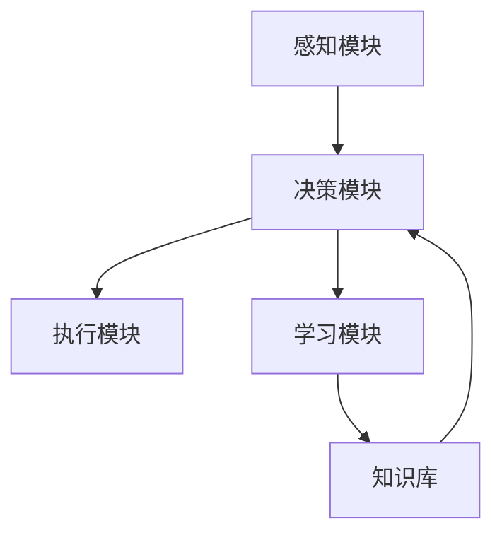
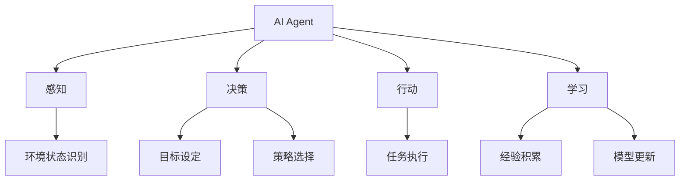
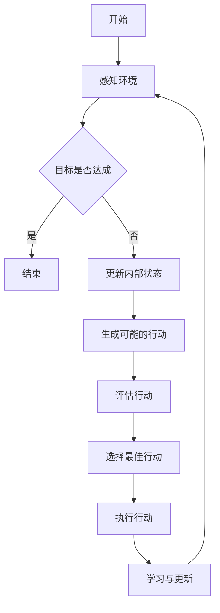
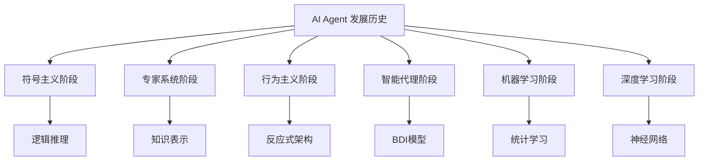
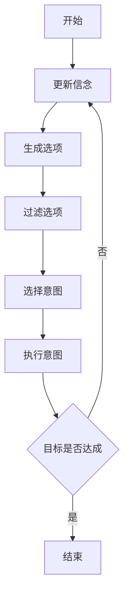
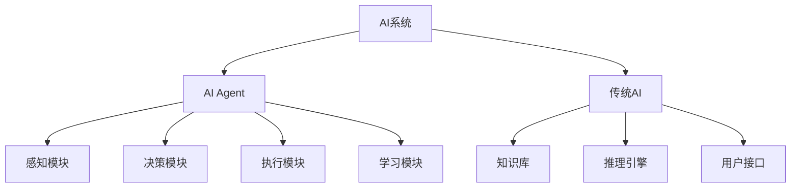
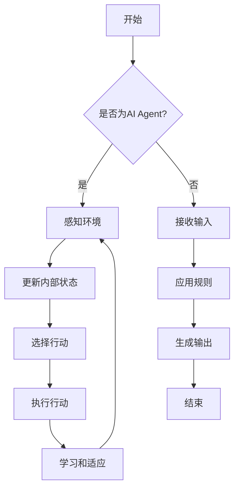
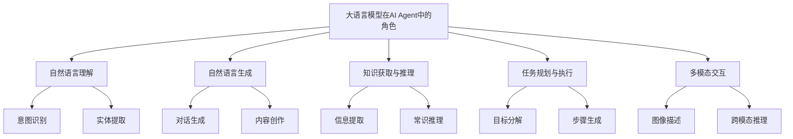
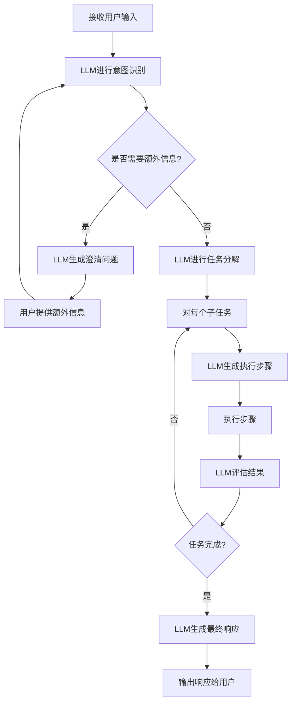

# 第一部分：AI Agent 与大语言模型基础

# 第1章：AI Agent 概述

本章将深入探讨 AI Agent 的核心概念、发展历程、特征以及其与传统 AI 的区别。我们还将重点介绍大语言模型在 AI Agent 中的关键作用，为后续章节奠定基础。

## 1.1 AI Agent 的定义与特征

### 核心概念：

AI Agent（人工智能代理）是一种能够感知环境、做出决策并采取行动以实现特定目标的智能系统。它是人工智能研究和应用的一个重要分支，旨在创造能够自主完成任务的智能实体。

### 问题背景

随着人工智能技术的快速发展，特别是在机器学习、自然语言处理和决策理论等领域的突破，AI Agent 的概念和应用已经从学术研究走向实际应用。然而，对于 AI Agent 的准确定义和特征，业界仍存在一些争议和不同理解。

### 问题描述

1. AI Agent 的定义范围不清晰
2. AI Agent 的核心特征需要明确界定
3. 不同类型 AI Agent 的分类标准不统一
4. AI Agent 与其他 AI 系统的界限模糊

### 问题解决

为了解决上述问题，我们将从以下几个方面来定义和描述 AI Agent：

1. 定义：AI Agent 是一个能够自主感知环境、做出决策并采取行动以实现预定目标的计算机系统或程序。

2. 核心特征：
   a) 自主性：能够在没有直接人类干预的情况下运行
   b) 反应性：能够及时响应环境的变化
   c) 主动性：能够采取主动行动以实现目标
   d) 社交能力：能够与其他 Agent 或人类进行交互和协作

3. AI Agent 的基本结构：



4. AI Agent 的类型分类：

| 类型 | 特点 | 示例应用 |
|------|------|----------|
| 反应式Agent | 基于当前感知直接做出反应 | 简单的游戏AI |
| 基于模型的Agent | 维护内部状态模型 | 自动驾驶系统 |
| 目标导向Agent | 明确的目标驱动行为 | 智能家居控制 |
| 效用基础Agent | 基于效用函数优化决策 | 金融交易系统 |
| 学习型Agent | 能从经验中学习和改进 | 推荐系统 |

### 边界与外延

AI Agent 的概念涵盖了从简单的反应式系统到复杂的学习型系统的广泛范围。它与机器人技术、专家系统、智能助手等领域有密切关联，但不完全等同。AI Agent 的核心在于其自主决策和行动的能力，而不仅仅是执行预定程序。

### 概念结构与核心要素组成



### 数学模型

AI Agent 的决策过程可以用马尔可夫决策过程（MDP）来形式化描述：

$$
\pi^*(s) = \arg\max_a \sum_{s'} P(s'|s,a)[R(s,a,s') + \gamma V^*(s')]
$$

其中：
- $\pi^*(s)$ 是最优策略
- $s$ 是当前状态
- $a$ 是可能的动作
- $P(s'|s,a)$ 是状态转移概率
- $R(s,a,s')$ 是即时奖励
- $\gamma$ 是折扣因子
- $V^*(s')$ 是下一状态的最优值函数

### 算法流程图



### 算法源代码

```python
class AIAgent:
    def __init__(self):
        self.state = None
        self.goal = None
        self.knowledge_base = {}

    def perceive(self, environment):
        self.state = self.process_perception(environment)

    def think(self):
        possible_actions = self.generate_actions()
        best_action = self.evaluate_actions(possible_actions)
        return best_action

    def act(self, action):
        self.execute_action(action)

    def learn(self, experience):
        self.update_knowledge(experience)

    def run(self, environment):
        while not self.goal_achieved():
            self.perceive(environment)
            action = self.think()
            self.act(action)
            experience = self.get_experience()
            self.learn(experience)

    # 以下方法需要根据具体应用场景实现
    def process_perception(self, environment):
        pass

    def generate_actions(self):
        pass

    def evaluate_actions(self, actions):
        pass

    def execute_action(self, action):
        pass

    def update_knowledge(self, experience):
        pass

    def goal_achieved(self):
        pass

    def get_experience(self):
        pass
```

### 实际场景应用

AI Agent 在多个领域有广泛应用，例如：

1. 智能客服：处理客户查询，提供 24/7 支持
2. 个人助理：管理日程，回答问题，执行简单任务
3. 游戏 AI：作为玩家的对手或队友
4. 自动驾驶：感知环境，做出驾驶决策
5. 金融交易：分析市场，执行交易策略

### 最佳实践 tips

1. 明确定义 Agent 的目标和约束条件
2. 设计灵活的感知-思考-行动循环
3. 实现强大的学习机制以持续改进性能
4. 注重 Agent 的可解释性和透明度
5. 考虑伦理因素，确保 Agent 的行为符合道德标准
6. 进行充分的测试和验证，特别是在关键应用场景中
7. 设计适当的人机交互接口，便于监控和干预

### 行业发展与未来趋势

| 时期 | 主要特征 | 技术突破 | 典型应用 |
|------|---------|----------|----------|
| 1950s-1970s | 符号主义AI | 逻辑推理、专家系统 | 定理证明、棋类游戏 |
| 1980s-1990s | 行为主义AI | 反应式架构、进化算法 | 机器人控制、优化问题 |
| 2000s-2010s | 统计学习 | 机器学习、深度学习 | 图像识别、自然语言处理 |
| 2010s-现在 | 混合智能 | 深度强化学习、大语言模型 | 自动驾驶、智能助手 |
| 未来展望 | 通用人工智能 | 元学习、因果推理 | 科学发现、复杂问题解决 |

## 1.2 AI Agent 的发展历史

### 核心概念

AI Agent 的发展历史反映了人工智能领域的整体进展，从早期的符号主义方法到现代的混合智能系统，经历了多次范式转换和技术革新。

### 问题背景

了解 AI Agent 的发展历史对于理解当前技术的优势和局限性至关重要。它能帮助我们避免重复过去的错误，并为未来的发展方向提供启示。

### 问题描述

1. AI Agent 发展的关键里程碑需要梳理
2. 不同时期 AI Agent 的特征和局限性需要分析
3. 技术演进对 AI Agent 能力的影响需要评估
4. 历史经验对当前 AI Agent 开发的启示需要总结

### 问题解决

我们将 AI Agent 的发展历史分为以下几个关键阶段：

1. 早期探索阶段（1950s-1970s）
    - 特征：基于符号处理和逻辑推理
    - 代表性工作：通用问题求解器（GPS）、STRIPS 规划系统

2. 专家系统时代（1970s-1980s）
    - 特征：基于规则的知识表示和推理
    - 代表性工作：MYCIN 医疗诊断系统、DENDRAL 分子结构分析系统

3. 行为主义 AI 兴起（1980s-1990s）
    - 特征：强调感知-行动循环，减少内部表示
    - 代表性工作：Brooks 的 Subsumption 架构、Braitenberg 车

4. 智能代理和多代理系统（1990s-2000s）
    - 特征：强调自主性、反应性和社交能力
    - 代表性工作：BDI（信念-欲望-意图）架构、JADE 多代理平台

5. 机器学习驱动的 AI Agent（2000s-2010s）
    - 特征：数据驱动的学习和决策
    - 代表性工作：IBM Watson、AlphaGo

6. 深度学习和强化学习时代（2010s-现在）
    - 特征：端到端学习、大规模神经网络
    - 代表性工作：DeepMind 的 DQN、OpenAI 的 GPT 系列

### 边界与外延

AI Agent 的发展与整个 AI 领域的进展密切相关，但更侧重于能够自主行动和决策的系统。它涉及了从符号主义到连接主义，从专家系统到深度学习的多个 AI 范式。

### 概念结构与核心要素组成



### 概念之间的关系

| 时期 | 主要范式 | 核心技术 | 优势 | 局限性 |
|------|---------|----------|------|--------|
| 1950s-1970s | 符号主义 | 逻辑推理 | 可解释性强 | 难以处理不确定性 |
| 1970s-1980s | 专家系统 | 规则推理 | 领域知识集成 | 知识获取瓶颈 |
| 1980s-1990s | 行为主义 | 反应式控制 | 实时性好 | 难以处理复杂任务 |
| 1990s-2000s | 智能代理 | BDI 架构 | 灵活性高 | 计算复杂度高 |
| 2000s-2010s | 机器学习 | 统计学习 | 自适应能力强 | 需要大量数据 |
| 2010s-现在 | 深度学习 | 神经网络 | 强大的表示学习 | 黑盒特性，难以解释 |

### 算法流程图

以 BDI（信念-欲望-意图）架构为例：



### 算法源代码

以简化的 BDI Agent 为例：

```python
class BDIAgent:
    def __init__(self):
        self.beliefs = set()
        self.desires = set()
        self.intentions = set()

    def update_beliefs(self, percepts):
        # 根据感知更新信念
        self.beliefs.update(percepts)

    def generate_options(self):
        # 根据当前信念和欲望生成选项
        options = set()
        for desire in self.desires:
            if self.is_achievable(desire):
                options.add(desire)
        return options

    def filter_options(self, options):
        # 过滤和优先排序选项
        return sorted(options, key=self.evaluate_option)

    def select_intention(self, filtered_options):
        # 选择最优选项作为意图
        if filtered_options:
            return filtered_options[0]
        return None

    def execute_intention(self, intention):
        # 执行选定的意图
        success = self.perform_action(intention)
        if success:
            self.intentions.remove(intention)
            self.desires.remove(intention)

    def is_achievable(self, desire):
        # 检查欲望是否可实现
        return True  # 简化实现，实际应根据当前信念和能力判断

    def evaluate_option(self, option):
        # 评估选项的价值
        return 1  # 简化实现，实际应考虑多个因素

    def perform_action(self, intention):
        # 执行具体行动
        print(f"Executing intention: {intention}")
        return True  # 简化实现，实际应执行具体动作并返回结果

    def run(self):
        while True:
            percepts = self.perceive()
            self.update_beliefs(percepts)
            options = self.generate_options()
            filtered_options = self.filter_options(options)
            intention = self.select_intention(filtered_options)
            if intention:
                self.execute_intention(intention)
            if not self.desires:
                break

    def perceive(self):
        # 感知环境
        return set()  # 简化实现，实际应返回环境状态

# 使用示例
agent = BDIAgent()
agent.beliefs = {"at_home", "hungry"}
agent.desires = {"eat_food", "go_to_work"}
agent.run()
```

### 实际场景应用

AI Agent 的发展历史在不同时期产生了多种实际应用：

1. 早期符号主义：定理证明系统、棋类游戏 AI
2. 专家系统时代：医疗诊断系统、地质勘探系统
3. 行为主义 AI：简单机器人控制、反应式游戏 AI
4. 智能代理时期：智能个人助理、多代理协作系统
5. 机器学习驱动：推荐系统、自然语言处理应用
6. 深度学习时代：自动驾驶、大规模语言模型应用

### 最佳实践 tips

1. 学习历史，避免重复过去的错误和局限
2. 结合多种 AI 范式，发挥各自优势
3. 注重 AI Agent 的可解释性和透明度
4. 考虑任务特性，选择合适的 Agent 架构
5. 重视知识表示和推理能力的重要性
6. 利用现代机器学习技术提升 Agent 的适应性
7. 关注 AI 伦理和安全问题，吸取历史教训

### 行业发展与未来趋势

| 时期 | 主要特征 | 关键技术 | 代表性应用 | 未来展望 |
|------|---------|----------|------------|----------|
| 1950s-1970s | 逻辑推理 | 符号处理 | 定理证明 | 与现代方法结合 |
| 1970s-1980s | 知识工程 | 规则系统 | 专家系统 | 知识图谱与深度学习融合 |
| 1980s-1990s | 实时反应 | 行为架构 | 移动机器人 | 复杂环境中的快速决策 |
| 1990s-2000s | 目标导向 | BDI 模型 | 智能助理 | 认知架构与神经网络结合 |
| 2000s-2010s | 数据驱动 | 机器学习 | 推荐系统 | 大规模个性化服务 |
| 2010s-现在 | 端到端学习 | 深度学习 | 自动驾驶 | 通用人工智能的基础 |

## 1.3 AI Agent 与传统 AI 的区别

### 核心概念

AI Agent 是一种能够自主感知环境、做出决策并采取行动的智能系统，而传统 AI 通常指早期以规则和符号处理为主的人工智能方法。

### 问题背景

随着 AI 技术的快速发展，AI Agent 与传统 AI 的界限有时变得模糊。理解它们之间的区别对于选择合适的技术方案和评估系统性能至关重要。

### 问题描述

1. AI Agent 和传统 AI 在设计理念上的差异
2. 两者在技术实现方面的不同
3. 应用场景和能力范围的区别
4. 性能评估标准的差异

### 问题解决

我们将从多个维度比较 AI Agent 和传统 AI：

1. 设计理念：
    - AI Agent：强调自主性、适应性和目标导向
    - 传统 AI：注重逻辑推理和知识表示

2. 技术实现：
    - AI Agent：通常采用感知-决策-行动循环
    - 传统 AI：多基于规则引擎或专家系统

3. 学习能力：
    - AI Agent：通常具有在线学习和适应能力
    - 传统 AI：学习能力有限，主要依赖预定义知识

4. 环境交互：
    - AI Agent：能够持续感知和影响环境
    - 传统 AI：通常是基于固定输入的批处理模式

5. 决策过程：
    - AI Agent：考虑长期目标和环境动态变化
    - 传统 AI：主要基于当前状态和固定规则

### 边界与外延

AI Agent 和传统 AI 并非完全对立，现代 AI 系统常常结合两者的优势。例如，结合符号推理和深度学习的神经符号系统就是一个融合的例子。

### 概念结构与核心要素组成



### 概念之间的关系

| 特征 | AI Agent | 传统 AI |
|------|----------|---------|
| 自主性 | 高 | 低 |
| 适应性 | 强 | 弱 |
| 学习能力 | 通常具备 | 有限或无 |
| 环境交互 | 持续、动态 | 静态、批处理 |
| 决策模式 | 目标导向 | 规则驱动 |
| 知识表示 | 多样化 | 主要是符号化 |
| 扩展性 | 较好 | 受限 |

### 算法流程图

AI Agent vs 传统 AI 的典型处理流程：



### 算法源代码

简化的 AI Agent 和传统 AI 对比示例：

```python
class AIAgent:
    def __init__(self):
        self.state = {}
        self.learning_rate = 0.1

    def perceive(self, environment):
        self.state.update(environment)

    def decide(self):
        # 简化的决策逻辑
        return max(self.state, key=self.state.get)

    def act(self, action):
        print(f"Executing action: {action}")

    def learn(self, reward):
        # 简化的学习过程
        self.state[self.decide()] += self.learning_rate * reward

    def run(self, environment):
        self.perceive(environment)
        action = self.decide()
        self.act(action)
        reward = environment.get('reward', 0)
        self.learn(reward)

class TraditionalAI:
    def __init__(self):
        self.rules = {
            'condition1': 'action1',
            'condition2': 'action2'
        }

    def process(self, input_data):
        for condition, action in self.rules.items():
            if condition in input_data:
                return action
        return 'default_action'

# 使用示例
agent = AIAgent()
agent.run({'state1': 0.5, 'state2': 0.7, 'reward': 1})

trad_ai = TraditionalAI()
result = trad_ai.process('condition1')
print(f"Traditional AI result: {result}")
```

### 实际场景应用

1. AI Agent 应用：
    - 自动驾驶汽车
    - 智能家居系统
    - 个人助理（如 Siri、Alexa）
    - 自适应学习系统

2. 传统 AI 应用：
    - 专家系统（如医疗诊断）
    - 规则基础的欺诈检测系统
    - 简单的问答系统
    - 基于决策树的推荐系统

### 最佳实践 tips

1. 根据任务复杂性和环境动态性选择合适的 AI 方法
2. 考虑结合 AI Agent 和传统 AI 的优势，如神经符号系统
3. 对于需要高度自适应的场景，优先考虑 AI Agent 方法
4. 在需要清晰解释和可控性的领域，传统 AI 可能更合适
5. 注重 AI 系统的可解释性和透明度
6. 定期评估和更新 AI 系统，以适应不断变化的需求
7. 考虑使用混合方法，如在 AI Agent 中集成符号推理能力

## 1.4 大语言模型在 AI Agent 中的角色

### 核心概念

大语言模型（Large Language Models, LLMs）是基于深度学习技术训练的大规模神经网络，能够理解和生成人类语言。在 AI Agent 中，LLMs 可以作为核心组件，提供强大的自然语言处理能力。

### 问题背景

随着 GPT、BERT 等大语言模型的出现，AI Agent 的能力得到了显著提升。然而，如何有效地将 LLMs 集成到 AI Agent 架构中，以及如何充分发挥 LLMs 的潜力，仍然是一个重要的研究课题。

### 问题描述

1. LLMs 如何增强 AI Agent 的能力
2. AI Agent 中 LLMs 的具体应用场景
3. 集成 LLMs 到 AI Agent 架构的挑战
4. LLMs 在 AI Agent 决策过程中的作用

### 问题解决

我们将从以下几个方面探讨 LLMs 在 AI Agent 中的角色：

1. 增强自然语言理解（NLU）能力：
    - 意图识别
    - 实体提取
    - 情感分析

2. 提升自然语言生成（NLG）能力：
    - 对话生成
    - 内容创作
    - 摘要生成

3. 知识获取与推理：
    - 信息提取
    - 常识推理
    - 知识图谱构建

4. 任务规划与执行：
    - 目标分解
    - 步骤生成
    - 结果评估

5. 多模态交互：
    - 图像描述
    - 视频理解
    - 跨模态推理

### 边界与外延

LLMs 在 AI Agent 中的应用不仅限于自然语言处理任务，还可以扩展到决策支持、创意生成、代码编写等多个领域。然而，LLMs 也面临着一些局限性，如计算资源需求大、可解释性差等问题。

### 概念结构与核心要素组成



### 概念之间的关系

| 功能 | LLM 贡献 | AI Agent 集成方式 | 潜在挑战 |
|------|----------|-------------------|----------|
| 自然语言理解 | 高准确度的语义理解 | 作为 NLU 模块的核心 | 领域适应性 |
| 自然语言生成 | 流畅、连贯的文本生成 | NLG 模块的基础 | 控制生成内容的相关性 |
| 知识获取 | 从非结构化文本中提取信息 | 知识库更新和扩展 | 知识一致性维护 |
| 任务规划 | 生成详细的任务步骤 | 决策模块的辅助工具 | 与环境模型的协调 |
| 多模态交互 | 跨模态信息的理解和生成 | 增强感知和表达能力 | 模态间的一致性 |

### 算法流程图

LLM 增强的 AI Agent 决策流程：



### 算法源代码

使用 LLM 增强的 AI Agent 示例：

```python
import openai

class LLMEnhancedAgent:
    def __init__(self, api_key):
        openai.api_key = api_key
        self.conversation_history = []

    def process_input(self, user_input):
        self.conversation_history.append({"role": "user", "content": user_input})
        
        # 意图识别
        intent = self.identify_intent(user_input)
        
        # 任务分解
        tasks = self.decompose_task(intent)
        
        for task in tasks:
            # 生成执行步骤
            steps = self.generate_steps(task)
            
            # 执行步骤
            result = self.execute_steps(steps)
            
            # 评估结果
            evaluation = self.evaluate_result(result)
            
            if not evaluation['success']:
                # 如果失败，重新生成步骤
                steps = self.generate_steps(task, evaluation['feedback'])
                result = self.execute_steps(steps)
        
        # 生成最终响应
        response = self.generate_response(intent, tasks)
        
        self.conversation_history.append({"role": "assistant", "content": response})
        return response

    def identify_intent(self, user_input):
        prompt = f"Identify the intent of the following user input: '{user_input}'"
        response = self.query_llm(prompt)
        return response

    def decompose_task(self, intent):
        prompt = f"Decompose the following intent into subtasks: '{intent}'"
        response = self.query_llm(prompt)
        return response.split(', ')

    def generate_steps(self, task, feedback=None):
        prompt = f"Generate steps to accomplish the following task: '{task}'"
        if feedback:
            prompt += f" Consider this feedback: '{feedback}'"
        response = self.query_llm(prompt)
        return response.split('\n')

    def execute_steps(self, steps):
        # 这里应该是实际执行步骤的逻辑
        # 简化示例仅返回执行成功的消息
        return "Steps executed successfully"

    def evaluate_result(self, result):
        prompt = f"Evaluate the following result: '{result}'. Respond with a JSON object containing 'success' (boolean) and 'feedback' (string)."
        response = self.query_llm(prompt)
        # 假设 LLM 返回了有效的 JSON 字符串
        import json
        return json.loads(response)

    def generate_response(self, intent, tasks):
        prompt = f"Generate a response for the user based on the following intent: '{intent}' and completed tasks: {tasks}"
        return self.query_llm(prompt)

    def query_llm(self, prompt):
        response = openai.Completion.create(
            engine="text-davinci-002",
            prompt=prompt,
            max_tokens=150
        )
        return response.choices[0].text.strip()

# 使用示例
agent = LLMEnhancedAgent("your-api-key-here")
response = agent.process_input("What's the weather like today?")
print(response)
```

### 实际场景应用

1. 智能客服：LLM 可以理解复杂的客户查询，生成个性化回复。
2. 内容创作助手：帮助作者生成创意、扩展文章大纲。
3. 代码助手：理解编程需求，生成代码片段，解释复杂算法。
4. 数据分析：将自然语言查询转换为数据库查询，生成分析报告。
5. 多语言翻译：提供上下文感知的高质量翻译。

### 最佳实践 tips

1. 精心设计 prompts，以充分发挥 LLM 的能力。
2. 实现有效的上下文管理，以维持连贯的对话。
3. 结合领域特定知识，提高 LLM 在特定任务上的表现。
4. 实施内容过滤和安全检查，防止不适当的输出。
5. 优化 API 调用，减少延迟和成本。
6. 实现错误处理和回退机制，提高系统稳定性。
7. 持续监控和评估 LLM 的输出质量，并进行必要的微调。

### 行业发展与未来趋势

| 时期 | LLM 特征 | AI Agent 集成方式 | 应用领域 | 未来展望 |
|------|----------|-------------------|----------|----------|
| 2018-2020 | 基础文本生成 | 简单的问答系统 | 客户服务、内容生成 | 更深入的语义理解 |
| 2020-2022 | 上下文理解增强 | 多轮对话管理 | 个人助理、教育辅助 | 跨模态能力提升 |
| 2022-2024 | 少样本学习能力 | 任务规划与执行 | 代码生成、创意写作 | 持续学习与适应 |
| 2024-2026 (预测) | 强大的推理能力 | 决策支持系统 | 科学研究、复杂问题解决 | 与专家系统深度融合 |
| 2026+ (展望) | 通用智能萌芽 | 自主学习与决策 | 全面的智能辅助 | 趋近人类级别的认知能力 |

通过将大语言模型集成到 AI Agent 中，我们可以显著提升 Agent 的语言理解、生成和推理能力。这不仅扩展了 AI Agent 的应用范围，还为实现更高级的人工智能系统铺平了道路。然而，我们也需要注意 LLM 的局限性，如计算资源需求、偏见问题等，并在实际应用中采取相应的缓解措施。随着技术的不断进步，我们可以期待看到更多创新的 LLM 增强型 AI Agent 在各个领域发挥重要作用。