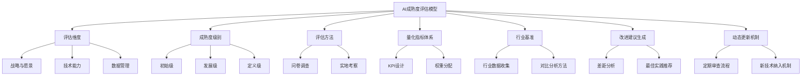
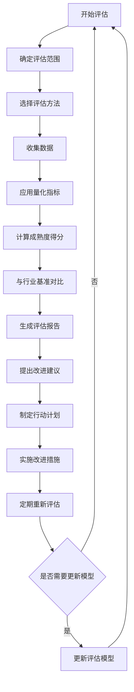
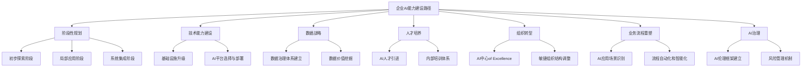
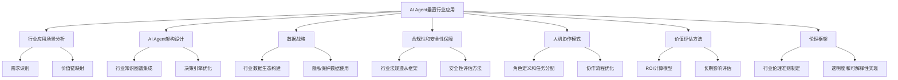
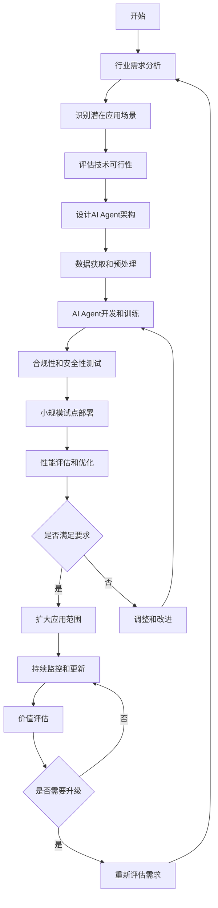
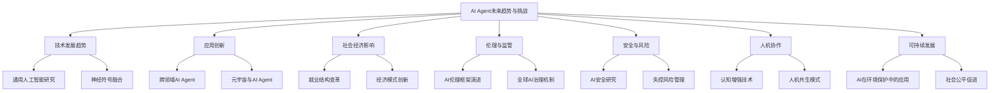
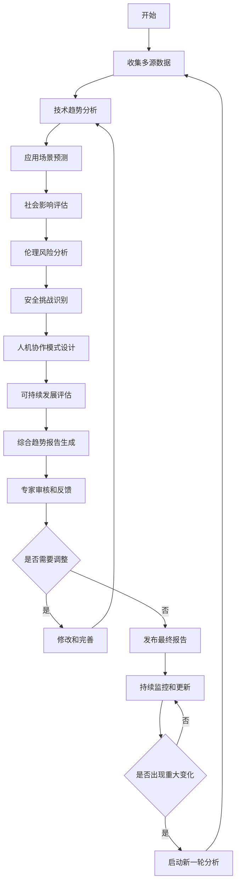

# 第20章：企业 AI 转型与 AI Agent 应用展望

## 20.1 AI 成熟度评估模型

### 核心概念

AI成熟度评估模型是一个用于评估和衡量企业在AI技术采用和应用方面进展程度的框架。这个模型通常包括多个维度和层级，用于全面评估企业在AI战略、技术能力、数据管理、人才储备、组织文化等方面的发展水平。AI成熟度评估模型不仅帮助企业了解自身在AI领域的当前位置，还为制定未来AI发展路线图提供指导。

### 问题背景

随着AI技术的快速发展和广泛应用，越来越多的企业开始探索AI转型。然而，不同企业在AI采用和应用方面的进展差异很大，面临的挑战也各不相同。主要问题包括：

1. 缺乏标准：企业难以客观评估自身AI能力水平。
2. 方向不明：不清楚AI发展的下一步应该怎么走。
3. 资源分配：难以确定AI投资的优先领域。
4. 能力差距：无法准确识别AI能力的短板。
5. 行业对标：缺乏与同行业其他企业比较的基准。
6. 进展跟踪：难以量化AI转型的进展。
7. 价值实现：不清楚如何最大化AI投资的回报。

在这种背景下，建立一个全面、客观的AI成熟度评估模型变得至关重要。

### 问题描述

1. 如何定义全面涵盖AI能力各个方面的评估维度
2. 如何设计适用于不同行业和规模企业的通用评估标准
3. 如何量化AI成熟度，使评估结果具有可比性
4. 如何确保评估过程的客观性和一致性
5. 如何将评估结果与具体的改进建议相结合
6. 如何设计动态评估机制，反映AI技术的快速发展
7. 如何将AI成熟度评估与企业整体数字化转型战略相结合

### 问题解决

我们将从以下几个方面详细探讨AI成熟度评估模型的设计和实施：

1. 评估维度设计：
    - 战略与愿景
    - 技术能力
    - 数据管理
    - 人才与文化
    - 流程与治理
    - 价值创造

2. 成熟度级别定义：
    - 初始级
    - 发展级
    - 定义级
    - 管理级
    - 优化级

3. 评估方法：
    - 问卷调查
    - 实地考察
    - 数据分析
    - 专家评审

4. 量化指标体系：
    - 关键性能指标（KPI）设计
    - 权重分配
    - 得分计算方法

5. 行业基准：
    - 行业数据收集
    - 标准化处理
    - 对比分析方法

6. 改进建议生成：
    - 差距分析
    - 最佳实践推荐
    - 优先级排序

7. 动态更新机制：
    - 定期审查流程
    - 新技术纳入机制
    - 反馈循环设计

### 边界与外延

虽然本节主要关注企业AI成熟度评估，但这个模型的思想和方法也可以扩展到其他技术领域的成熟度评估，如数字化转型、物联网应用等。此外，我们还将探讨AI成熟度评估如何与其他管理工具（如平衡计分卡、CMMI模型）结合，以及在新兴领域如智慧城市、数字政府等方面的潜在应用。

### 概念结构与核心要素组成



### 概念之间的关系

| 组件 | 主要功能 | 输入 | 输出 | 与其他组件的关系 |
|------|---------|------|------|------------------|
| 评估维度 | 定义评估范围 | 企业AI应用领域 | 评估框架 | 指导其他所有组件 |
| 成熟度级别 | 划分发展阶段 | 行业最佳实践 | 级别标准 | 与量化指标体系结合 |
| 评估方法 | 收集评估数据 | 企业信息 | 原始评估数据 | 为量化指标体系提供输入 |
| 量化指标体系 | 计算成熟度得分 | 评估数据 | 成熟度得分 | 结合成熟度级别，输出到行业基准 |
| 行业基准 | 提供对比参考 | 行业数据 | 对比报告 | 为改进建议提供依据 |
| 改进建议生成 | 提供发展指导 | 评估结果、行业基准 | 改进建议 | 利用所有其他组件的输出 |
| 动态更新机制 | 保持模型先进性 | 技术发展、反馈 | 更新后的模型 | 影响所有其他组件 |

### 算法流程图

AI成熟度评估的基本流程：



### 算法源代码

以下是一个简化的AI成熟度评估模型的实现示例，展示了基本的评估流程和计算方法：

```python
import numpy as np
from typing import List, Dict

class AIMaturityModel:
    def __init__(self):
        self.dimensions = ['Strategy', 'Technology', 'Data', 'Talent', 'Process', 'Value']
        self.levels = ['Initial', 'Developing', 'Defined', 'Managed', 'Optimizing']
        self.weights = {dim: 1/len(self.dimensions) for dim in self.dimensions}
        self.questions = self._generate_questions()

    def _generate_questions(self) -> Dict[str, List[str]]:
        # 简化的问题生成，实际应用中需要更详细的问题设计
        return {dim: [f"{dim} Question {i+1}" for i in range(5)] for dim in self.dimensions}

    def assess(self, responses: Dict[str, List[int]]) -> Dict[str, float]:
        scores = {}
        for dim in self.dimensions:
            dim_score = np.mean(responses[dim]) * self.weights[dim]
            scores[dim] = dim_score
        return scores

    def calculate_maturity_level(self, scores: Dict[str, float]) -> str:
        total_score = sum(scores.values())
        level_index = int(total_score * len(self.levels) / 5)  # 假设满分为5
        return self.levels[min(level_index, len(self.levels) - 1)]

    def generate_recommendations(self, scores: Dict[str, float]) -> List[str]:
        recommendations = []
        for dim, score in scores.items():
            if score < 0.6:  # 假设0.6为及格线
                recommendations.append(f"Improve {dim} capability")
        return recommendations

    def compare_to_benchmark(self, scores: Dict[str, float], benchmark: Dict[str, float]) -> Dict[str, float]:
        return {dim: scores[dim] - benchmark[dim] for dim in self.dimensions}

    def evaluate(self, responses: Dict[str, List[int]], benchmark: Dict[str, float]) -> Dict[str, any]:
        scores = self.assess(responses)
        maturity_level = self.calculate_maturity_level(scores)
        recommendations = self.generate_recommendations(scores)
        comparison = self.compare_to_benchmark(scores, benchmark)
        
        return {
            "scores": scores,
            "maturity_level": maturity_level,
            "recommendations": recommendations,
            "benchmark_comparison": comparison
        }

# 使用示例
model = AIMaturityModel()

# 模拟企业响应
responses = {
    'Strategy': [4, 3, 4, 3, 4],
    'Technology': [3, 3, 3, 2, 3],
    'Data': [2, 2, 3, 2, 2],
    'Talent': [3, 3, 2, 3, 3],
    'Process': [2, 2, 2, 2, 3],
    'Value': [3, 3, 3, 3, 2]
}

# 模拟行业基准
benchmark = {dim: 0.7 for dim in model.dimensions}

# 进行评估
result = model.evaluate(responses, benchmark)

print("AI Maturity Assessment Result:")
print(f"Maturity Level: {result['maturity_level']}")
print("Dimension Scores:")
for dim, score in result['scores'].items():
    print(f"  {dim}: {score:.2f}")
print("Recommendations:")
for rec in result['recommendations']:
    print(f"  - {rec}")
print("Benchmark Comparison:")
for dim, diff in result['benchmark_comparison'].items():
    print(f"  {dim}: {'Above' if diff > 0 else 'Below'} benchmark by {abs(diff):.2f}")
```

这个示例实现了一个基本的AI成熟度评估模型，包括维度评分、成熟度级别计算、改进建议生成和行业基准对比。在实际应用中，需要进一步优化和扩展这个模型，例如添加更详细的问题设计、实现更复杂的评分算法、增强可视化报告功能等。

### 实际场景应用

1. 制造业AI转型：
    - 评估智能制造能力
    - 识别自动化和预测性维护的机会
    - 提供AI在供应链优化中的应用建议

2. 金融服务AI成熟度：
    - 评估AI在风险管理中的应用水平
    - 分析智能客户服务的实施程度
    - 提供AI驱动的个性化金融产品建议

3. 医疗健康AI能力评估：
    - 评估AI辅助诊断系统的应用程度
    - 分析医疗数据管理和隐私保护能力
    - 提供AI在医疗研究中的应用建议

4. 零售业AI成熟度：
    - 评估智能库存管理系统的实施情况
    - 分析AI驱动的个性化营销能力
    - 提供AI在供应链优化和需求预测中的应用建议

5. 教育行业AI应用评估：
    - 评估AI在个性化学习中的应用水平
    - 分析智能教学辅助系统的实施程度
    - 提供AI在教育管理和资源分配中的应用建议

### 最佳实践 tips

1. 全面性与针对性平衡：
    - 确保评估维度全面覆盖AI能力各方面
    - 根据行业特点调整评估重点
    - 保持评估模型的灵活性，适应不同规模企业

2. 数据驱动评估：
    - 尽可能使用客观数据支持评估
    - 结合定量和定性方法
    - 建立可靠的数据收集和验证机制

3. 持续改进机制：
    - 定期审查和更新评估模型
    - 收集用户反馈，不断优化评估流程
    - 跟踪AI技术发展，及时调整评估标准

4. 结果可视化：
    - 使用直观的图表展示评估结果
    - 提供多维度的成熟度分析视图
    - 开发交互式仪表板，便于深入分析

5. 行动导向：
    - 将评估结果与具体改进建议相结合
    - 提供分阶段的AI发展路线图
    - 设定可衡量的改进目标

6. 跨部门协作：
    - 鼓励IT、业务和管理层共同参与评估
    - 促进不同部门间的AI最佳实践分享
    - 建立跨部门的AI治理机制

7. 外部对标：
    - 建立行业AI成熟度基准数据库
    - 提供与行业领先企业的对比分析
    - 组织行业内的AI成熟度评估交流活动

### 行业发展与未来趋势

| 时期 | 主要特征 | 关键技术 | 挑战 | 未来展望 |
|------|---------|----------|------|----------|
| 2018-2019 | 基础评估框架 | 问卷调查、专家评估 | 标准化 | 通用评估模型 |
| 2020-2021 | 数据驱动评估 | 大数据分析、自动化评分 | 数据质量 | 实时评估系统 |
| 2022-2023 | 智能化评估 | AI辅助分析、预测性建议 | 模型复杂性 | 自适应评估框架 |
| 2024-2025 (预测) | 生态系统评估 | 区块链验证、联邦学习 | 跨组织协作 | 行业生态评估 |
| 2026+ (展望) | 认知评估系统 | 量子计算、AGI辅助 | 评估伦理 | 超越传统评估范式 |

AI成熟度评估模型的发展正经历快速演变。从早期的简单问卷调查到现在的智能化、数据驱动的评估系统，我们看到了显著的进步。这些变化不仅提高了评估的准确性和效率，还为企业提供了更有价值的洞察和指导。

未来的AI成熟度评估模型可能会更加注重以下几个方面：

1. 动态实时评估：
    - 从周期性评估转向持续实时监控
    - 开发能自动捕捉企业AI能力变化的系统
    - 探索预测性评估，提前识别潜在的AI发展机会和风险

2. 生态系统视角：
    - 扩展评估范围，包括企业的AI合作伙伴和供应链
    - 开发评估企业在AI生态系统中位置和影响力的方法
    - 探索跨组织、跨行业的AI成熟度协同评估机制

3. 深度学习增强：
    - 利用深度学习技术自动化评估过程
    - 开发能从非结构化数据中提取AI成熟度信号的模型
    - 探索AI系统自我评估和持续优化的可能性

4. 量化价值评估：
    - 更精确地量化AI投资的回报
    - 开发链接AI成熟度与业务绩效的模型
    - 探索AI对无形资产（如创新能力、组织灵活性）影响的评估方法

5. 伦理和责任维度：
    - 将AI伦理和负责任AI实践纳入评估框架
    - 开发评估AI系统社会影响的方法
    - 探索AI成熟度与企业社会责任的关联评估

6. 认知评估系统：
    - 开发能理解和评估复杂AI系统的认知模型
    - 实现自然语言交互的评估过程
    - 探索模拟人类专家判断的AI评估顾问

7. 跨学科融合：
    - 整合组织行为学、心理学等学科知识到评估模型
    - 开发评估AI对组织文化和员工技能影响的方法
    - 探索AI成熟度与其他数字化转型指标的综合评估

随着这些趋势的发展，AI成熟度评估模型将从单纯的技术评估工具演变为全面的企业AI能力诊断和发展指导系统。未来的模型将能够更全面、更深入地评估企业的AI能力，并提供更精准、更具操作性的发展建议。

这种进步将带来多方面的益处：

1. 决策优化：为企业AI战略和投资决策提供更可靠的依据。

2. 风险管理：帮助企业更好地识别和管理AI相关风险。

3. 创新加速：通过识别AI能力差距，促进有针对性的创新。

4. 资源优化：指导企业更有效地分配AI资源和人才。

5. 竞争优势：帮助企业准确定位自身在AI领域的竞争地位。

6. 协作增强：促进企业内部和企业间的AI知识和最佳实践分享。

7. 行业标准：推动形成行业公认的AI能力评估标准。

然而，这种发展也带来了新的挑战，如如何确保评估模型的公平性和包容性，如何平衡标准化与个性化，如何处理日益复杂的AI生态系统评估，以及如何在保护企业机密的同时实现有效的对标分析。未来的AI成熟度评估模型需要在全面性和针对性、客观性和灵活性、深度和效率之间寻求平衡，确保它们能够有效服务于不同类型和规模的企业，并适应快速变化的AI技术和商业环境。

总的来说，AI成熟度评估模型将继续是企业AI转型和发展的重要工具。通过不断完善和创新这些模型，我们将能够为企业提供更精准、更有价值的AI能力评估和发展指导，推动整个产业向更高水平的AI应用迈进。这不仅将改变企业评估和发展AI能力的方式，还将深刻影响整个商业生态系统对AI的理解和应用，最终推动AI技术与商业实践的深度融合，创造更大的经济和社会价值。

## 20.2 企业 AI 能力建设路径

### 核心概念

企业AI能力建设路径是指企业在AI技术应用和转型过程中，系统性地提升其AI相关能力的战略规划和实施方案。这个路径涵盖了从初步探索到全面AI驱动的各个阶段，包括技术基础设施建设、数据战略制定、人才培养、组织结构调整、业务流程重塑等多个方面。企业AI能力建设路径旨在指导企业有序、高效地发展AI能力，实现业务创新和竞争优势的提升。

### 问题背景

随着AI技术的快速发展和广泛应用，企业面临着巨大的机遇和挑战。然而，许多企业在AI能力建设过程中遇到了各种困难：

1. 起点不明：不清楚从哪里开始AI转型。
2. 方向混乱：缺乏清晰的AI发展战略和路线图。
3. 资源限制：AI投资成本高，人才稀缺。
4. 技术障碍：难以选择和整合适合的AI技术。
5. 组织阻力：传统组织结构和文化不适应AI转型。
6. 价值实现：难以量化AI投资的回报。
7. 风险管理：对AI应用的潜在风险缺乏认识和控制。

在这种背景下，制定一个系统、可行的企业AI能力建设路径变得至关重要。

### 问题描述

1. 如何设计适合不同发展阶段企业的AI能力建设路径
2. 如何平衡短期价值实现和长期能力建设
3. 如何有效整合技术、数据、人才和业务流程的能力建设
4. 如何克服组织结构和文化障碍，推动AI转型
5. 如何建立有效的AI治理机制，确保AI应用的合规性和伦理性
6. 如何设计动态调整机制，使AI能力建设路径能够适应快速变化的技术和市场环境
7. 如何衡量和评估AI能力建设的进展和成效

### 问题解决

我们将从以下几个方面详细探讨企业AI能力建设路径的设计和实施：

1. 阶段性规划：
    - 初步探索阶段
    - 局部应用阶段
    - 系统集成阶段
    - 全面AI驱动阶段

2. 技术能力建设：
    - 基础设施升级
    - AI平台选择与部署
    - 技术栈整合

3. 数据战略：
    - 数据治理体系建立
    - 数据采集和处理能力提升
    - 数据价值挖掘

4. 人才培养：
    - AI人才引进
    - 内部培训体系
    - 跨学科团队建设

5. 组织转型：
    - AI中心of Excellence建立
    - 敏捷组织结构调整
    - AI文化培养

6. 业务流程重塑：
    - AI应用场景识别
    - 流程自动化和智能化
    - 新业务模式探索

7. AI治理：
    - AI伦理框架建立
    - 风险管理机制
    - 合规性保障

### 边界与外延

虽然本节主要关注企业AI能力建设路径，但这些概念和方法也可以扩展到其他技术领域的能力建设，如物联网、区块链等。此外，我们还将探讨AI能力建设如何与企业的整体数字化转型战略相结合，以及在新兴领域如智慧城市、数字政府等方面的潜在应用。

### 概念结构与核心要素组成



### 概念之间的关系

| 组件 | 主要功能 | 输入 | 输出 | 与其他组件的关系 |
|------|---------|------|------|------------------|
| 阶段性规划 | 制定总体路线图 | 企业现状、战略目标 | 分阶段实施计划 | 指导其他所有组件 |
| 技术能力建设 | 构建AI技术基础 | 技术需求、预算 | AI技术架构 | 支持数据战略和业务流程重塑 |
| 数据战略 | 管理和利用数据资产 | 数据资源、业务需求 | 数据价值创造 | 为技术能力和业务应用提供基础 |
| 人才培养 | 建设AI人才队伍 | 人才需求、培训资源 | 高素质AI团队 | 支持所有其他能力建设 |
| 组织转型 | 优化组织结构和文化 | 现有组织结构、AI战略 | 适应AI的组织形态 | 影响所有其他能力的实施效果 |
| 业务流程重塑 | 优化业务运营 | 现有流程、AI技术 | AI驱动的新流程 | 实现AI能力的业务价值 |
| AI治理 | 确保AI应用的合规性和伦理性 | 法规要求、伦理准则 | 治理框架和机制 | 贯穿于所有AI能力建设过程 |

### 算法流程图

企业AI能力建设的基本流程：

```mermaid
graph TDA[开始AI能力建设] --> B[评估当前AI成熟度]
    B --> C[制定AI战略和目标]
    C --> D[设计分阶段实施计划]
    D --> E[技术基础设施升级]
    E --> F[数据治理体系建立]
    F --> G[AI人才引进和培养]
    G --> H[选择和实施试点项目]
    H --> I[评估试点结果]
    I --> J{是否成功}
    J -->|是| K[扩大AI应用范围]
    J -->|否| L[调整策略和方法]
    L --> H
    K --> M[组织结构和文化调整]
    M --> N[全面业务流程重塑]
    N --> O[建立AI治理机制]
    O --> P[持续优化和创新]
    P --> Q{是否需要战略调整}
    Q -->|是| R[重新评估和规划]
    R --> C
    Q -->|否| P
```

### 算法源代码

以下是一个简化的企业AI能力建设路径规划和跟踪系统的实现示例：

```python
import random
from typing import List, Dict

class AICapabilityBuildingSystem:
    def __init__(self):
        self.stages = ['Exploration', 'Partial Application', 'System Integration', 'AI-Driven']
        self.dimensions = ['Technology', 'Data', 'Talent', 'Organization', 'Process', 'Governance']
        self.current_stage = 0
        self.capabilities = {dim: 0 for dim in self.dimensions}
        self.projects = []

    def assess_current_maturity(self):
        # 简化的成熟度评估
        self.capabilities = {dim: random.randint(0, 100) for dim in self.dimensions}
        self.current_stage = sum(self.capabilities.values()) // (len(self.dimensions) * 25)
        return self.capabilities, self.stages[min(self.current_stage, len(self.stages)-1)]

    def set_targets(self, targets: Dict[str, int]):
        self.targets = targets

    def generate_roadmap(self) -> List[Dict]:
        roadmap = []
        for dim in self.dimensions:
            if self.targets[dim] > self.capabilities[dim]:
                roadmap.append({
                    'dimension': dim,
                    'current': self.capabilities[dim],
                    'target': self.targets[dim],
                    'gap': self.targets[dim] - self.capabilities[dim]
                })
        return sorted(roadmap, key=lambda x: x['gap'], reverse=True)

    def propose_projects(self, roadmap: List[Dict]) -> List[Dict]:
        projects = []
        for item in roadmap:
            projects.append({
                'name': f"Improve {item['dimension']} Capability",
                'dimension': item['dimension'],
                'effort': item['gap'] * random.uniform(0.5, 1.5),
                'impact': item['gap']
            })
        return sorted(projects, key=lambda x: x['impact'] / x['effort'], reverse=True)

    def execute_project(self, project: Dict):
        dimension = project['dimension']
        improvement = random.uniform(0.5, 1.0) * project['impact']
        self.capabilities[dimension] = min(100, self.capabilities[dimension] + improvement)
        return improvement

    def update_stage(self):
        total_capability = sum(self.capabilities.values())
        self.current_stage = min(total_capability // (len(self.dimensions) * 25), len(self.stages) - 1)

    def run_simulation(self, num_iterations: int):
        for i in range(num_iterations):
            print(f"\nIteration {i+1}:")
            current_capabilities, current_stage = self.assess_current_maturity()
            print(f"Current Stage: {current_stage}")
            print("Current Capabilities:", current_capabilities)

            if all(v >= 95 for v in current_capabilities.values()):
                print("AI capability building completed!")
                break

            roadmap = self.generate_roadmap()
            projects = self.propose_projects(roadmap)

            if projects:
                selected_project = projects[0]
                print(f"Executing project: {selected_project['name']}")
                improvement = self.execute_project(selected_project)
                print(f"Improved {selected_project['dimension']} by {improvement:.2f}")

            self.update_stage()

# 使用示例
system = AICapabilityBuildingSystem()

# 设置目标
targets = {dim: random.randint(80, 100) for dim in system.dimensions}
system.set_targets(targets)

print("AI Capability Building Targets:", targets)

# 运行模拟
system.run_simulation(20)
```

这个示例实现了一个基本的企业AI能力建设路径规划和跟踪系统，包括成熟度评估、路线图生成、项目提议和执行模拟。在实际应用中，需要进一步优化和扩展这个系统，例如添加更详细的项目管理功能、实现更复杂的能力提升模型、增强可视化和报告功能等。

### 实际场景应用

1. 制造业AI转型：
    - 建立预测性维护能力
    - 实施智能供应链管理
    - 开发AI辅助设计系统

2. 金融服务AI能力建设：
    - 构建智能风控系统
    - 开发个性化金融产品推荐
    - 实施AI驱动的反欺诈解决方案

3. 零售业AI能力提升：
    - 建立智能库存管理系统
    - 实施AI驱动的客户洞察和个性化营销
    - 开发智能定价系统

4. 医疗健康AI能力发展：
    - 构建AI辅助诊断系统
    - 实施智能医疗影像分析
    - 开发个性化治疗方案推荐

5. 教育行业AI能力建设：
    - 开发智能学习内容推荐系统
    - 实施AI驱动的学生表现分析
    - 建立智能教学辅助平台

### 最佳实践 tips

1. 战略引领：
    - 确保AI能力建设与企业整体战略一致
    - 获得高层领导的支持和参与
    - 制定清晰的AI愿景和目标

2. 循序渐进：
    - 从小规模试点项目开始
    - 逐步扩大AI应用范围
    - 建立快速迭代和学习的机制

3. 数据为本：
    - 优先建立强大的数据基础设施
    - 实施全面的数据治理策略
    - 培养数据驱动的决策文化

4. 人才优先：
    - 制定全面的AI人才战略
    - 投资持续的AI技能培训
    - 创造吸引和留住AI人才的环境

5. 敏捷方法：
    - 采用敏捷开发方法论
    - 建立跨职能AI团队
    - 鼓励快速实验和失败学习

6. 价值导向：
    - 优先考虑能带来明显业务价值的AI项目
    - 建立清晰的AI投资回报衡量机制
    - 持续评估和优化AI项目组合

7. 伦理和治理：
    - 建立AI伦理框架和指导原则
    - 实施全面的AI风险管理策略
    - 确保AI应用的透明度和可解释性

### 行业发展与未来趋势

| 时期 | 主要特征 | 关键技术 | 挑战 | 未来展望 |
|------|---------|----------|------|----------|
| 2018-2019 | 初步探索 | 机器学习基础应用 | 技术理解 | AI战略规划 |
| 2020-2021 | 局部应用 | 深度学习、NLP | 人才短缺 | AI中心建设 |
| 2022-2023 | 系统集成 | 联邦学习、AutoML | 数据整合 | 全面AI转型 |
| 2024-2025 (预测) | AI驱动创新 | 认知计算、量子机器学习 | 伦理挑战 | AI生态系统 |
| 2026+ (展望) | 智能自治 | AGI、脑机接口 | 人机协作 | 超越传统企业形态 |

企业AI能力建设路径正经历快速演变。从早期的试点探索到现在的系统化转型，我们看到了显著的进步。这些变化不仅提高了企业的运营效率和创新能力，还推动了整个行业向智能化、数字化方向发展。

未来的企业AI能力建设路径可能会更加注重以下几个方面：

1. 生态系统思维：
    - 从单一企业AI能力建设转向构建AI生态系统
    - 开发跨组织、跨行业的AI协作平台
    - 探索开放创新和共享AI资源的新模式

2. 认知增强：
    - 将AI能力建设与人类认知增强相结合
    - 开发增强人类决策和创造力的AI工具
    - 探索AI与人类专家协作的新模式

3. 自适应学习系统：
    - 构建能自主学习和进化的AI系统
    - 开发动态适应业务环境变化的AI能力
    - 探索持续自我优化的AI架构

4. 伦理AI设计：
    - 将伦理考量融入AI能力建设的每个阶段
    - 开发可审计、可解释的AI系统
    - 探索AI系统的社会责任和可持续发展模式

5. 量子AI：
    - 利用量子计算加速AI能力建设
    - 开发量子机器学习算法和应用
    - 探索量子AI在复杂问题解决中的潜力

6. 情感和社交AI：
    - 构建具有情感理解和社交能力的AI系统
    - 开发增强人机交互和协作的AI技术
    - 探索AI在组织文化塑造中的应用

7. 超个性化：
    - 构建能提供极致个性化体验的AI系统
    - 开发实时、动态的个性化推荐和服务
    - 探索AI驱动的个性化业务模式创新

随着这些趋势的发展，企业AI能力建设将从单纯的技术应用转变为全面的智能化转型过程。未来的企业将不仅仅是应用AI技术，而是成为由AI赋能的智能化组织，能够更敏捷、更创新地应对复杂多变的商业环境。

这种进步将带来多方面的益处：

1. 创新加速：AI能力将显著提升企业的创新速度和质量。

2. 决策优化：数据驱动和AI辅助的决策将成为常态。

3. 效率提升：AI驱动的自动化将大幅提高运营效率。

4. 个性化服务：企业将能提供前所未有的个性化客户体验。

5. 预测能力：AI将增强企业的预测和风险管理能力。

6. 知识管理：AI将革新企业的知识创造和传播方式。

7. 生态协同：AI将促进更广泛、更深入的跨组织协作。

然而，这种发展也带来了新的挑战，如如何在AI驱动的环境中保持人性化，如何平衡效率提升和就业影响，如何处理AI系统可能带来的新型风险，以及如何在全球化背景下处理AI技术的伦理和监管问题。未来的企业AI能力建设路径需要在技术创新和人文关怀、效率提升和社会责任、全球化和本地化之间寻求平衡，确保AI技术的发展能够真正造福企业和整个社会。

总的来说，企业AI能力建设将继续是企业数字化转型和未来竞争力构建的核心。通过系统、持续的AI能力建设，企业将能够在快速变化的商业环境中保持竞争优势，创造新的价值，并推动整个行业和社会向更智能、更可持续的方向发展。这不仅将改变企业的运营方式和商业模式，还将深刻影响人们的工作方式和生活方式，最终推动人类社会迈向一个更智能、更繁荣的新时代。

## 20.3 AI Agent 在垂直行业的应用前景

### 核心概念

AI Agent在垂直行业的应用前景是指人工智能代理系统在特定行业或领域中的潜在使用场景、可能带来的变革以及未来发展方向。AI Agent作为一种能够感知环境、做出决策并采取行动的智能系统，具有自主性、学习能力和适应性，可以在各个垂直行业中发挥重要作用，提高效率、优化流程、创新服务模式。

### 问题背景

随着AI技术的快速发展，特别是大语言模型（LLM）和强化学习等技术的突破，AI Agent在各个垂直行业的应用潜力日益显现。然而，将AI Agent成功应用于特定行业面临诸多挑战：

1. 行业特殊性：每个行业都有其独特的知识体系、规则和流程。
2. 数据可用性：某些行业可能缺乏高质量、结构化的数据。
3. 监管合规：不同行业面临不同的法规和合规要求。
4. 人机协作：如何实现AI Agent与人类专家的有效协作。
5. 可解释性：在某些关键决策领域，需要AI Agent提供清晰的决策依据。
6. 安全性和可靠性：某些行业对系统的安全性和可靠性有极高要求。
7. 伦理考量：AI Agent的决策和行为需要符合行业伦理标准。

在这种背景下，探索AI Agent在各垂直行业的应用前景，并制定相应的实施策略变得至关重要。

### 问题描述

1. 如何识别各垂直行业中AI Agent的最佳应用场景
2. 如何设计适应特定行业需求的AI Agent架构
3. 如何解决行业特定的数据获取和处理挑战
4. 如何确保AI Agent在特定行业的合规性和安全性
5. 如何实现AI Agent与行业专家的有效协作
6. 如何评估和量化AI Agent在垂直行业应用的价值
7. 如何处理AI Agent在不同行业应用中可能遇到的伦理问题

### 问题解决

我们将从以下几个方面详细探讨AI Agent在垂直行业的应用前景：

1. 行业应用场景分析：
    - 需求识别
    - 价值链映射
    - 痛点解决方案设计

2. AI Agent架构设计：
    - 行业知识图谱集成
    - 多模态感知系统
    - 决策引擎优化

3. 数据战略：
    - 行业数据生态构建
    - 数据质量提升方法
    - 隐私保护数据使用

4. 合规性和安全性保障：
    - 行业法规遵从框架
    - 安全性评估方法
    - 持续监控机制

5. 人机协作模式：
    - 角色定义和任务分配
    - 交互界面设计
    - 协作流程优化

6. 价值评估方法：
    - ROI计算模型
    - 性能指标体系
    - 长期影响评估

7. 伦理框架：
    - 行业伦理准则制定
    - 伦理决策机制
    - 透明度和可解释性实现

### 边界与外延

虽然本节主要关注AI Agent在垂直行业的应用，但这些概念和方法也可以扩展到跨行业场景和新兴领域。此外，我们还将探讨AI Agent如何推动行业融合和新业态的产生，以及在未来智能社会中可能扮演的角色。

### 概念结构与核心要素组成



### 概念之间的关系

| 组件 | 主要功能 | 输入 | 输出 | 与其他组件的关系 |
|------|---------|------|------|------------------|
| 行业应用场景分析 | 识别最佳应用机会 | 行业数据、专家知识 | 应用场景清单 | 指导其他所有组件 |
| AI Agent架构设计 | 构建适应行业的AI系统 | 应用需求、技术能力 | AI Agent架构 | 与数据战略和人机协作紧密相关 |
| 数据战略 | 确保数据可用性和质量 | 数据源、隐私要求 | 数据管理方案 | 支持AI Agent架构和价值评估 |
| 合规性和安全性保障 | 确保系统合规和安全 | 法规要求、安全标准 | 合规性框架 | 影响AI Agent设计和伦理框架 |
| 人机协作模式 | 优化人机交互 | 用户需求、任务特性 | 协作方案 | 与AI Agent架构和价值评估相关 |
| 价值评估方法 | 量化应用效果 | 性能数据、业务指标 | 价值评估报告 | 指导场景选择和持续优化 |
| 伦理框架 | 确保AI应用符合伦理 | 行业伦理标准、社会期望 | 伦理指南 | 贯穿于所有其他组件 |

### 算法流程图

AI Agent在垂直行业应用的基本流程：



### 算法源代码

以下是一个简化的AI Agent在垂直行业应用的模拟系统实现示例：

```python
import random
from typing import List, Dict

class IndustryAIAgent:
    def __init__(self, industry: str):
        self.industry = industry
        self.knowledge_base = self._initialize_knowledge_base()
        self.performance = 0
        self.compliance_score = 0
        self.ethical_score = 0

    def _initialize_knowledge_base(self) -> Dict:
        # 简化的行业知识库初始化
        return {
            "rules": ["Rule 1", "Rule 2", "Rule 3"],
            "best_practices": ["Practice 1", "Practice 2", "Practice 3"],
            "data_sources": ["Source 1", "Source 2", "Source 3"]
        }

    def train(self, data: List[Dict]) -> None:
        # 简化的训练过程
        self.performance = min(100, self.performance + random.randint(5, 15))
        print(f"Agent for {self.industry} trained. New performance: {self.performance}")

    def make_decision(self, input_data: Dict) -> Dict:
        # 简化的决策过程
        decision = {
            "action": random.choice(["Action A", "Action B", "Action C"]),
            "confidence": random.uniform(0.5, 1.0)
        }
        return decision

    def evaluate_compliance(self) -> None:
        # 简化的合规性评估
        self.compliance_score = random.uniform(0.7, 1.0)
        print(f"Compliance score for {self.industry}: {self.compliance_score:.2f}")

    def evaluate_ethics(self) -> None:
        # 简化的伦理评估
        self.ethical_score = random.uniform(0.7, 1.0)
        print(f"Ethical score for {self.industry}: {self.ethical_score:.2f}")

class IndustryAIAgentSystem:
    def __init__(self):
        self.agents = {}
        self.industries = ["Healthcare", "Finance", "Manufacturing", "Retail", "Education"]

    def create_agent(self, industry: str) -> None:
        if industry not in self.agents:
            self.agents[industry] = IndustryAIAgent(industry)
            print(f"Created AI Agent for {industry}")

    def train_all_agents(self, training_data: Dict[str, List[Dict]]) -> None:
        for industry, data in training_data.items():
            if industry in self.agents:
                self.agents[industry].train(data)

    def evaluate_all_agents(self) -> Dict[str, Dict]:
        results = {}
        for industry, agent in self.agents.items():
            agent.evaluate_compliance()
            agent.evaluate_ethics()
            results[industry] = {
                "performance": agent.performance,
                "compliance": agent.compliance_score,
                "ethics": agent.ethical_score
            }
        return results

    def simulate_industry_application(self, num_iterations: int) -> None:
        for i in range(num_iterations):
            print(f"\nIteration {i+1}:")
            
            # 模拟新数据获取
            training_data = {industry: [{"data": "sample"}] for industry in self.industries}
            
            # 训练所有Agent
            self.train_all_agents(training_data)
            
            # 评估所有Agent
            evaluation_results = self.evaluate_all_agents()
            
            # 输出评估结果
            for industry, results in evaluation_results.items():
                print(f"{industry} Agent - Performance: {results['performance']}, "
                      f"Compliance: {results['compliance']:.2f}, Ethics: {results['ethics']:.2f}")

# 使用示例
system = IndustryAIAgentSystem()

# 为每个行业创建AI Agent
for industry in system.industries:
    system.create_agent(industry)

# 运行模拟
system.simulate_industry_application(5)
```

这个示例实现了一个基本的AI Agent在垂直行业应用的模拟系统，包括Agent创建、训练、决策、合规性和伦理评估等功能。在实际应用中，需要进一步优化和扩展这个系统，例如添加更详细的行业知识库、实现更复杂的决策逻辑、增强数据处理和学习能力等。

### 实际场景应用

1. 医疗健康行业：
    - AI诊断助手：辅助医生进行疾病诊断和治疗方案制定
    - 智能护理系统：监控患者状态，优化护理流程
    - 药物研发Agent：加速新药发现和临床试验过程

2. 金融服务业：
    - 智能投资顾问：提供个性化投资建议和组合管理
    - 风险评估Agent：实时监控和预警金融风险
    - 反欺诈系统：检测和预防金融欺诈行为

3. 制造业：
    - 智能生产调度：优化生产线运行和资源分配
    - 预测性维护Agent：预测设备故障，安排最优维护时间
    - 质量控制系统：实时监控产品质量，自动调整生产参数

4. 零售业：
    - 个性化推荐引擎：提供精准的商品和服务推荐
    - 库存管理Agent：优化库存水平，预测需求波动
    - 智能客服系统：提供24/7全天候的客户服务和支持

5. 教育行业：
    - 自适应学习系统：根据学生表现动态调整教学内容
    - 智能教学助手：辅助教师进行课程设计和学生评估
    - 学习分析Agent：分析学生数据，提供个性化学习建议

### 最佳实践 tips

1. 深入行业理解：
    - 与行业专家密切合作，深入理解行业特性
    - 建立全面的行业知识图谱
    - 持续更新行业趋势和最新实践

2. 数据驱动设计：
    - 优先考虑数据可用性和质量
    - 建立行业特定的数据预处理流程
    - 实施严格的数据治理和隐私保护措施

3. 渐进式部署：
    - 从小规模试点项目开始
    - 建立清晰的评估指标和反馈机制
    - 逐步扩大应用范围，持续优化性能

4. 人机协作优化：
    - 明确定义AI Agent和人类专家的角色
    - 设计直观、高效的人机交互界面
    - 建立持续的培训和适应机制

5. 合规性和安全性保障：
    - 深入研究行业特定的法规要求
    - 实施全面的安全性和隐私保护措施
    - 建立定期的合规性审计机制

6. 可解释性和透明度：
    - 开发行业特定的解释性AI模型
    - 提供清晰的决策依据和过程说明
    - 建立AI决策的审核和申诉机制

7. 持续学习和适应：
    - 实施在线学习机制，不断更新AI Agent知识
    - 建立快速响应机制，适应行业变化
    - 鼓励跨行业知识共享和最佳实践交流

### 行业发展与未来趋势

| 时期 | 主要特征 | 关键技术 | 挑战 | 未来展望 |
|------|---------|----------|------|----------|
| 2018-2019 | 单点应用 | 机器学习、专家系统 | 技术集成 | 行业定制化AI |
| 2020-2021 | 流程自动化 | 深度学习、NLP | 数据质量 | 端到端AI解决方案 |
| 2022-2023 | 智能决策支持 | 强化学习、知识图谱 | 可解释性 | AI驱动的业务创新 |
| 2024-2025 (预测) | 自主系统 | 联邦学习、元学习 | 人机协作 | AI生态系统 |
| 2026+ (展望) | 认知增强 | AGI、脑机接口 | 伦理边界 | 行业重塑 |

AI Agent在垂直行业的应用正经历快速演变。从早期的单点应用到现在的智能决策支持系统，我们看到了显著的进步。这些变化不仅提高了行业效率和创新能力，还推动了整个产业向智能化、数字化方向发展。

未来的AI Agent在垂直行业的应用可能会更加注重以下几个方面：

1. 跨行业协同：
    - 开发能在多个相关行业间无缝切换的通用AI Agent
    - 促进不同行业间的数据和知识共享
    - 探索AI驱动的新型跨行业业务模式

2. 认知增强与人机共生：
    - 开发增强人类专业能力的AI辅助工具
    - 设计更自然、更直观的人机交互模式
    - 探索AI与人类专家深度协作的新范式

3. 自适应学习系统：
    - 构建能快速适应行业变化的动态AI系统
    - 开发持续学习和自我优化的AI Agent
    - 探索跨场景、跨任务的知识迁移技术

4. 可解释性与透明度：
    - 开发行业特定的可解释AI模型
    - 设计直观的AI决策解释机制
    - 探索AI系统的自我反思和纠错能力

5. 伦理AI与社会责任：
    - 将行业伦理准则编码到AI系统中
    - 开发能权衡多方利益的AI决策机制
    - 探索AI在推动行业可持续发展中的角色

6. 生态系统整合：
    - 构建行业级的AI Agent生态系统
    - 开发支持多Agent协作的框架和协议
    - 探索去中心化的行业智能网络

7. 前沿技术融合：
    - 整合量子计算、边缘计算等新兴技术
    - 开发结合物联网和区块链的AI解决方案
    - 探索生物计算在特定行业的应用潜力

随着这些趋势的发展，AI Agent在垂直行业的应用将从单一功能工具演变为全面的智能化解决方案。未来的AI Agent将能够更深入地理解行业特性，更灵活地应对复杂场景，并与人类专家形成更紧密的协作关系。

这种进步将带来多方面的益处：

1. 效率提升：大幅提高行业运营效率和资源利用率。

2. 创新加速：促进新产品、新服务和新业务模式的快速开发。

3. 决策优化：提供更准确、更及时的决策支持。

4. 个性化服务：实现极致的客户体验和服务定制。

5. 风险管理：增强对复杂风险的识别、评估和管理能力。

6. 知识传承：有效捕捉和传播行业专家知识。

7. 可持续发展：推动行业向更环保、更可持续的方向发展。

然而，这种发展也带来了新的挑战，如如何确保AI系统在特定行业的可靠性和安全性，如何平衡自动化与就业影响，如何处理AI决策可能带来的法律和伦理问题，以及如何在保护商业机密的同时促进行业创新。未来的AI Agent应用需要在技术创新和社会责任、效率提升和伦理考量、通用化和专业化之间寻求平衡，确保AI技术的发展能够真正造福行业和整个社会。

总的来说，AI Agent在垂直行业的应用前景广阔，将继续是推动行业数字化转型和创新的核心动力。通过持续的技术创新和应用实践，AI Agent将能够在各个垂直行业中发挥越来越重要的作用，不仅优化现有的业务流程和服务模式，还有可能彻底重塑某些行业的运作方式。这不仅将改变企业的竞争格局和价值创造方式，还将深刻影响整个社会的经济结构和就业形态，最终推动人类社会向更智能、更高效、更可持续的方向发展。

## 20.4 未来趋势与挑战

### 核心概念

未来趋势与挑战是指在AI Agent技术发展和应用过程中，可能出现的新方向、机遇以及需要克服的困难。这个概念涵盖了技术进步、应用创新、社会影响、伦理考量等多个维度，旨在预测和分析AI Agent未来的发展路径，并为相关决策提供参考。理解和应对这些趋势与挑战对于企业、政府和研究机构制定长期战略至关重要。

### 问题背景

随着AI技术的快速发展和广泛应用，AI Agent正在各个领域展现出巨大的潜力。然而，这一领域的发展也面临着诸多不确定性和挑战：

1. 技术瓶颈：如何突破现有AI技术的限制，实现更高级的智能。
2. 应用范围：AI Agent可能在哪些新领域发挥重要作用。
3. 社会影响：AI Agent的广泛应用可能对就业、隐私、社会结构产生什么影响。
4. 伦理问题：如何确保AI Agent的决策和行为符合伦理标准。
5. 安全风险：AI Agent可能带来哪些新的安全威胁，如何防范。
6. 监管挑战：如何制定适当的法律法规来规范AI Agent的发展和使用。
7. 人机关系：AI Agent与人类的关系将如何演变。

在这种背景下，系统性地分析和预测AI Agent的未来趋势与挑战变得尤为重要。

### 问题描述

1. 如何预测AI Agent技术的长期发展路径
2. 如何识别AI Agent在新领域的潜在应用机会
3. 如何评估AI Agent对社会经济结构的长期影响
4. 如何构建适应未来AI Agent发展的伦理和法律框架
5. 如何预防和应对AI Agent可能带来的安全风险
6. 如何设计人机协作的新模式以适应AI Agent的发展
7. 如何平衡AI Agent的创新发展与社会稳定

### 问题解决

我们将从以下几个方面详细探讨AI Agent的未来趋势与挑战：

1. 技术发展趋势：
    - 通用人工智能（AGI）研究
    - 神经符号融合
    - 量子AI

2. 应用创新：
    - 跨领域AI Agent
    - 元宇宙与AI Agent
    - 生物计算与AI融合

3. 社会经济影响：
    - 就业结构变革
    - 经济模式创新
    - 教育体系重构

4. 伦理与监管：
    - AI伦理框架演进
    - 全球AI治理机制
    - 算法公平与透明

5. 安全与风险：
    - AI安全研究
    - 对抗性攻击防御
    - 失控风险管理

6. 人机协作：
    - 认知增强技术
    - 脑机接口发展
    - 人机共生模式

7. 可持续发展：
    - AI在环境保护中的应用
    - 能源效率优化
    - 社会公平促进

### 边界与外延

虽然本节主要关注AI Agent的未来趋势与挑战，但这些讨论也可以扩展到整个AI领域，甚至更广泛的科技发展前景。此外，我们还将探讨AI Agent如何与其他新兴技术（如区块链、5G/6G、生物技术）融合，以及在未来智能社会中可能产生的新型社会形态和文化现象。

### 概念结构与核心要素组成



### 概念之间的关系

| 组件 | 主要功能 | 输入 | 输出 | 与其他组件的关系 |
|------|---------|------|------|------------------|
| 技术发展趋势 | 预测技术方向 | 研究数据、专家意见 | 技术路线图 | 影响所有其他组件 |
| 应用创新 | 探索新应用场景 | 市场需求、技术能力 | 创新应用方案 | 受技术趋势影响，影响社会经济 |
| 社会经济影响 | 评估长期影响 | 经济数据、社会趋势 | 影响评估报告 | 与伦理监管、可持续发展相关 |
| 伦理与监管 | 制定规范标准 | 伦理问题、法律框架 | 伦理指南、法规 | 影响技术发展和应用创新 |
| 安全与风险 | 识别和管理风险 | 威胁情报、安全研究 | 风险管理策略 | 影响技术发展和应用部署 |
| 人机协作 | 优化人机关系 | 认知科学、交互技术 | 协作模式设计 | 与技术趋势和应用创新紧密相关 |
| 可持续发展 | 促进长期可持续性 | 环境数据、社会需求 | 可持续发展方案 | 影响技术方向和应用选择 |

### 算法流程图

AI Agent未来发展趋势分析的基本流程：



### 算法源代码

以下是一个简化的AI Agent未来趋势分析系统的实现示例：

```python
import random
from typing import List, Dict

class TrendAnalysisSystem:
    def __init__(self):
        self.trends = {
            "Technology": ["AGI", "Neural-Symbolic AI", "Quantum AI"],
            "Application": ["Cross-domain AI", "Metaverse AI", "Bio-AI Integration"],
            "SocioEconomic": ["Job Transformation", "Economic Innovation", "Education Restructuring"],
            "Ethics": ["AI Ethics Framework", "Global AI Governance", "Algorithmic Fairness"],
            "Security": ["AI Safety Research", "Adversarial Defense", "Existential Risk Management"],
            "HumanAICollaboration": ["Cognitive Enhancement", "Brain-Computer Interface", "Human-AI Symbiosis"],
            "Sustainability": ["Environmental AI", "Energy Efficiency", "Social Equity"]
        }
        self.impact_levels = ["Low", "Medium", "High", "Very High"]
        self.time_horizons = ["Near-term", "Mid-term", "Long-term"]

    def analyze_trend(self, category: str, trend: str) -> Dict:
        return {
            "impact": random.choice(self.impact_levels),
            "time_horizon": random.choice(self.time_horizons),
            "certainty": random.uniform(0.5, 1.0)
        }

    def generate_report(self) -> Dict[str, List[Dict]]:
        report = {}
        for category, trend_list in self.trends.items():
            category_report = []
            for trend in trend_list:
                analysis = self.analyze_trend(category, trend)
                category_report.append({"trend": trend, "analysis": analysis})
            report[category] = category_report
        return report

    def identify_key_trends(self, report: Dict[str, List[Dict]], threshold: float = 0.8) -> List[str]:
        key_trends = []
        for category, trends in report.items():
            for trend in trends:
                if trend["analysis"]["impact"] in ["High","Very High"] and trend["analysis"]["certainty"] >= threshold:
                    key_trends.append(f"{category}: {trend['trend']}")
        return key_trends

    def simulate_trend_evolution(self, iterations: int) -> List[Dict]:
        evolution = []
        for _ in range(iterations):
            report = self.generate_report()
            key_trends = self.identify_key_trends(report)
            evolution.append({
                "iteration": _ + 1,
                "key_trends": key_trends
            })
        return evolution

def print_trend_report(report: Dict[str, List[Dict]]):
    for category, trends in report.items():
        print(f"\n{category} Trends:")
        for trend in trends:
            analysis = trend["analysis"]
            print(f"  - {trend['trend']}:")
            print(f"    Impact: {analysis['impact']}")
            print(f"    Time Horizon: {analysis['time_horizon']}")
            print(f"    Certainty: {analysis['certainty']:.2f}")

# 使用示例
system = TrendAnalysisSystem()

# 生成单次报告
print("AI Agent Future Trends Analysis Report:")
report = system.generate_report()
print_trend_report(report)

# 识别关键趋势
key_trends = system.identify_key_trends(report)
print("\nKey Trends:")
for trend in key_trends:
    print(f"  - {trend}")

# 模拟趋势演化
print("\nTrend Evolution Simulation:")
evolution = system.simulate_trend_evolution(5)
for step in evolution:
    print(f"\nIteration {step['iteration']}:")
    for trend in step['key_trends']:
        print(f"  - {trend}")
```

这个示例实现了一个基本的AI Agent未来趋势分析系统，包括趋势生成、影响评估、关键趋势识别和趋势演化模拟。在实际应用中，需要进一步优化和扩展这个系统，例如添加更复杂的预测模型、整合真实数据源、实现交互式可视化等。

### 实际场景应用

1. 技术路线图规划：
    - 预测AI Agent核心技术的发展方向
    - 识别潜在的技术突破点和瓶颈
    - 指导研发资源的优化分配

2. 产业政策制定：
    - 评估AI Agent对不同产业的影响
    - 制定针对性的产业扶持和监管政策
    - 预测和应对可能的产业结构变革

3. 教育体系改革：
    - 预测AI时代所需的关键技能
    - 设计适应未来的课程体系
    - 规划终身学习和再培训策略

4. 伦理框架构建：
    - 识别AI Agent应用中的潜在伦理问题
    - 制定动态更新的AI伦理准则
    - 设计AI伦理审核和监督机制

5. 风险管理与安全策略：
    - 预测AI Agent可能带来的新型安全威胁
    - 制定全面的AI安全防御策略
    - 设计AI系统的应急响应机制

### 最佳实践 tips

1. 多维度分析：
    - 综合考虑技术、经济、社会、伦理等多个维度
    - 利用跨学科专家团队进行全面评估
    - 建立系统性的趋势分析框架

2. 数据驱动决策：
    - 收集和分析大量的研究数据和市场信息
    - 使用高级数据分析和预测模型
    - 持续更新和验证数据源

3. 情景规划：
    - 构建多种可能的未来情景
    - 进行"假设-检验"分析
    - 制定适应不同情景的策略

4. 持续监控与调整：
    - 建立实时趋势监控系统
    - 定期回顾和更新预测结果
    - 保持策略的灵活性和适应性

5. 利益相关者参与：
    - 邀请多方利益相关者参与趋势分析
    - 考虑不同群体的需求和关切
    - 促进社会各界对AI未来的共识形成

6. 伦理与责任考量：
    - 将伦理考虑纳入趋势分析的核心
    - 评估每个趋势的潜在社会影响
    - 强调负责任的AI发展路径

7. 国际合作与交流：
    - 参与全球AI趋势研究网络
    - 促进国际间的数据和洞见共享
    - 探讨全球性AI治理机制

### 行业发展与未来趋势

| 时期 | 主要特征 | 关键技术 | 挑战 | 未来展望 |
|------|---------|----------|------|----------|
| 2024-2025 | AI Agent普及 | 大规模预训练模型、联邦学习 | 数据隐私、模型解释性 | 个性化AI助手 |
| 2026-2027 | 跨域AI融合 | 多模态AI、迁移学习 | 知识整合、跨领域应用 | 通用型AI Agent |
| 2028-2030 | 认知AI突破 | 神经符号AI、元学习 | 常识推理、创造性思维 | 类人智能系统 |
| 2031-2035 | 人机深度协作 | 脑机接口、认知计算 | 伦理边界、人机共生 | 增强型人类 |
| 2036-2040 | 智能社会形成 | AGI、量子AI | 社会重构、存在风险 | 后人类文明 |

AI Agent的发展正经历快速演变。从当前的专用AI系统到未来可能出现的通用人工智能，我们预计将看到一系列重大突破和社会变革。这些变化不仅将彻底改变我们的工作和生活方式，还可能重新定义人类的角色和价值。

未来的AI Agent发展可能会更加注重以下几个方面：

1. 认知智能：
    - 开发具有类人推理和创造能力的AI系统
    - 实现跨领域知识的自主学习和整合
    - 探索AI的自我意识和情感模拟

2. 人机共生：
    - 设计无缝集成的人机协作模式
    - 开发增强人类认知和身体能力的AI技术
    - 探索AI与人类意识的深度融合可能性

3. 社会智能：
    - 开发具有高度社会适应性的AI Agent
    - 构建AI参与的新型社会治理模式
    - 探索AI在文化传承和创新中的角色

4. 伦理AI：
    - 将道德推理能力编码到AI系统中
    - 开发能自主做出伦理决策的AI Agent
    - 探索AI系统的权利和责任界定

5. 生态智能：
    - 开发全面理解和管理生态系统的AI
    - 实现AI驱动的全球资源优化分配
    - 探索AI在应对气候变化中的潜力

6. 量子AI：
    - 利用量子计算突破现有AI的计算瓶颈
    - 开发基于量子原理的新型AI算法
    - 探索量子AI在模拟复杂系统中的应用

7. 宇宙尺度AI：
    - 开发用于空间探索和宇宙研究的AI系统
    - 构建模拟和理解宇宙级复杂性的AI模型
    - 探索AI在寻找外星智慧中的应用

这些发展趋势将带来深远的影响和重大挑战：

1. 技术突破：AI可能在认知能力、创造力等方面超越人类，带来科技爆炸式发展。

2. 经济重构：AI驱动的自动化可能导致大规模失业，需要重新定义工作和价值创造。

3. 社会变革：AI可能改变社会结构、权力分配和人际关系，需要新的社会契约。

4. 伦理挑战：AI的决策权和道德责任问题将变得更加复杂，需要新的伦理框架。

5. 存在风险：超人类AI的出现可能带来生存风险，需要严格的安全措施和控制机制。

6. 认知革命：人机融合可能改变人类的认知方式和自我认识，引发哲学和心理学的重大问题。

7. 文明演进：AI可能推动人类文明向全新的形态发展，甚至导致"后人类"时代的到来。

面对这些趋势和挑战，我们需要在以下方面做出努力：

1. 前瞻性研究：加强对AI长期发展的前瞻性研究，提前应对可能的挑战。

2. 跨学科合作：促进AI与其他学科的深度融合，应对复杂的社会技术问题。

3. 全球治理：建立全球性的AI治理机制，协调各国在AI发展中的利益和责任。

4. 教育革新：重塑教育体系，培养适应AI时代的创新型、跨学科人才。

5. 伦理框架：构建动态、包容的AI伦理框架，指导AI的负责任发展。

6. 安全保障：加强AI安全研究，建立多层次的风险防控体系。

7. 公众参与：促进公众对AI未来的理解和讨论，形成社会共识。

总的来说，AI Agent的未来发展充满了机遇和挑战。通过前瞻性思考、负责任的开发和全球合作，我们有望引导AI朝着造福人类和推动文明进步的方向发展。这不仅需要技术创新，还需要社会制度、伦理规范和哲学思想的与时俱进。在这个过程中，保持人类的核心价值观和尊严，同时拥抱AI带来的新可能性，将是我们面临的最大挑战和最重要的任务。


在这个充满不确定性的AI未来中，我们需要保持警惕和开放的态度。一方面，我们要充分认识到AI可能带来的巨大变革和潜在风险，未雨绸缪，做好各种准备。另一方面，我们也要保持乐观和创新精神，积极探索AI为人类带来的新机遇和可能性。

以下是一些关键的行动建议：

1. 持续投资基础研究：
    - 加大对AGI、神经符号AI等前沿领域的研究投入
    - 鼓励跨学科研究，特别是AI与认知科学、脑科学的交叉研究
    - 建立长期、稳定的研究资助机制

2. 完善法律和政策框架：
    - 制定适应AI发展的新法律法规，如算法公平法、AI责任法等
    - 建立灵活的政策调整机制，以应对快速变化的AI技术
    - 推动国际间的法律协调，应对AI带来的跨境挑战

3. 重塑教育和培训体系：
    - 将AI素养教育纳入基础教育课程
    - 发展终身学习平台，帮助工人适应AI时代的技能需求
    - 培养具有跨学科背景的AI伦理专家和政策制定者

4. 构建包容性AI生态系统：
    - 鼓励中小企业和创业者参与AI创新
    - 确保AI技术和资源的公平获取
    - 重视AI在解决社会问题和促进可持续发展中的应用

5. 加强国际合作与对话：
    - 建立全球AI治理论坛，协调各国AI政策
    - 促进AI研究和数据的国际共享
    - 共同应对AI可能带来的全球性挑战，如气候变化、疾病防控等

6. 发展人机协作新模式：
    - 研究AI增强人类能力的新方法
    - 设计促进人机协作的工作流程和组织结构
    - 探索AI与人类创造力结合的新可能性

7. 加强公众参与和沟通：
    - 提高公众对AI的理解和参与度
    - 建立透明的AI决策过程和公众监督机制
    - 鼓励关于AI未来的广泛社会对话

8. 建立AI安全和伦理审核机制：
    - 成立独立的AI伦理委员会
    - 开发AI系统的安全性和伦理性评估工具
    - 建立AI事故调查和问责机制

9. 探索新的经济和社会模式：
    - 研究AI时代的新经济形态，如数据经济、共享经济等
    - 探讨AI背景下的社会保障制度改革
    - 考虑实施普遍基本收入等创新政策

10. 保护和增强人类价值：
    - 重视人文教育，培养批判性思维和创造力
    - 探讨AI时代人类存在的意义和价值
    - 确保AI发展服务于人类福祉和价值观

面对AI Agent的未来发展，我们既要保持谨慎和理性，又要充满希望和创造力。通过积极应对挑战，明智地引导AI的发展方向，我们有可能开创一个人类与AI和谐共处、共同进步的新时代。这个未来不仅充满了技术的奇迹，更应该体现人类的智慧、同情和对更美好世界的追求。

在这个转型期，每个人都有责任参与塑造我们的AI未来。无论是研究人员、政策制定者、企业家还是普通公民，我们都需要积极思考、讨论并采取行动，确保AI的发展方向与人类的长远利益相一致。只有这样，我们才能真正实现AI的承诺，创造一个更智能、更公平、更可持续的世界。

最后，我们要记住，尽管AI可能在许多方面超越人类，但人类的创造力、情感、道德判断和对意义的追求仍然是独特和宝贵的。在拥抱AI带来的变革的同时，我们也要珍惜和发扬人类的这些特质。未来的挑战是巨大的，但机遇同样令人振奋。让我们携手共创一个人类与AI共同繁荣的美好未来。
