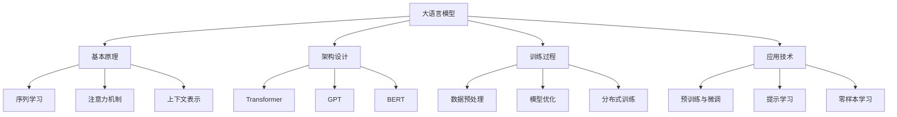
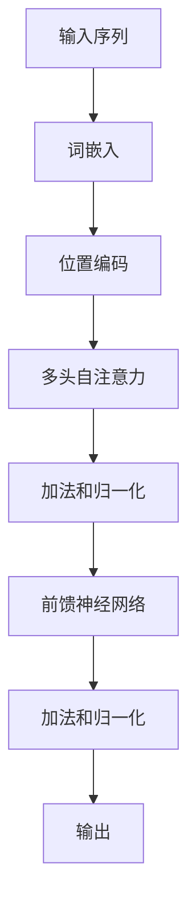
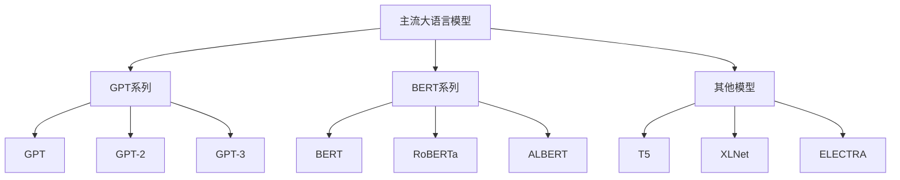
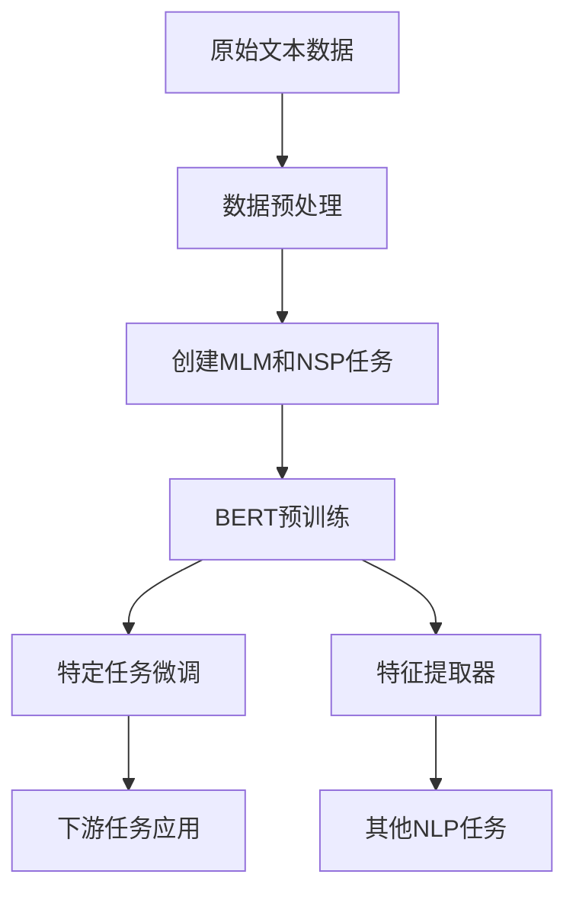
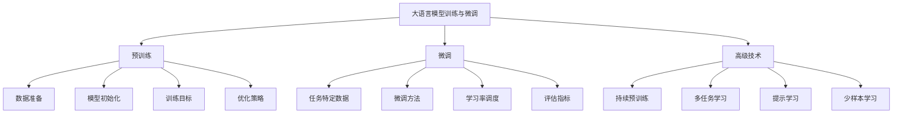
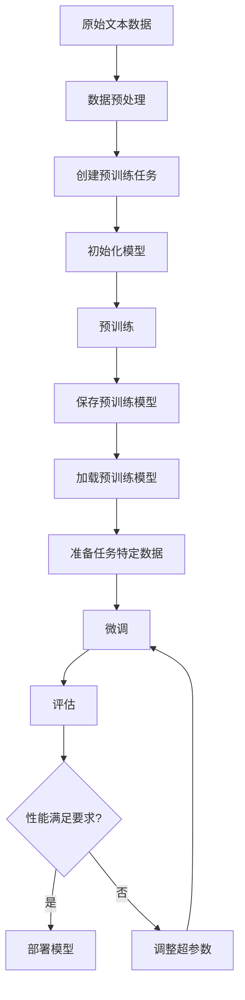
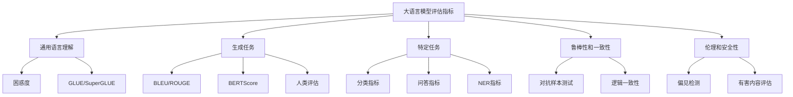
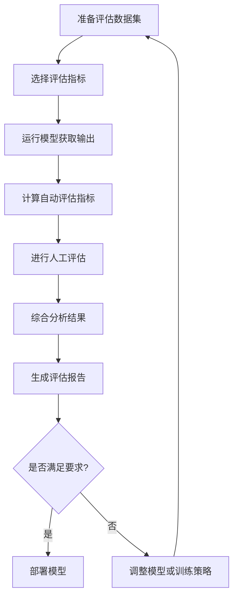

# 第2章：大语言模型（LLM）技术基础

## 2.1 大语言模型的原理与架构

### 核心概念

大语言模型（Large Language Models, LLMs）是基于深度学习技术，通过海量文本数据训练而成的大规模神经网络。它们能够理解和生成人类语言，执行各种自然语言处理任务。

### 问题背景

随着计算能力的提升和数据规模的扩大，LLMs 在近年来取得了突破性进展。理解 LLMs 的原理和架构对于有效利用和改进这些模型至关重要。

### 问题描述

1. LLMs 的基本工作原理
2. 主流 LLM 架构的特点和优势
3. LLMs 的训练过程和关键技术
4. LLMs 面临的主要挑战和局限性

### 问题解决

我们将从以下几个方面深入探讨 LLMs 的原理与架构：

1. 基本原理：
    - 序列到序列学习
    - 自注意力机制
    - 上下文表示学习

2. 主流架构：
    - Transformer 架构
    - GPT（自回归语言模型）
    - BERT（双向编码器）
    - T5（文本到文本转换）

3. 关键技术：
    - 预训练与微调
    - 提示学习（Prompt Learning）
    - 零样本和少样本学习

4. 训练过程：
    - 数据预处理
    - 模型初始化
    - 优化算法
    - 分布式训练

### 边界与外延

LLMs 的应用范围广泛，从文本生成到机器翻译，从问答系统到代码生成。然而，它们也面临着计算资源需求大、可解释性差、潜在偏见等挑战。

### 概念结构与核心要素组成



### 概念之间的关系

| 概念 | 核心思想 | 优势 | 局限性 |
|------|---------|------|--------|
| 序列学习 | 捕捉序列数据中的依赖关系 | 适合处理文本等序列数据 | 长序列处理困难 |
| 注意力机制 | 动态关注输入的不同部分 | 提高长距离依赖的建模能力 | 计算复杂度高 |
| Transformer | 完全基于注意力的架构 | 并行性好，性能优越 | 模型规模大，训练成本高 |
| GPT | 单向自回归语言模型 | 生成能力强 | 无法利用双向上下文 |
| BERT | 双向编码器表示 | 理解能力强 | 生成任务表现相对较弱 |
| 预训练与微调 | 通用预训练，特定任务微调 | 提高模型泛化能力 | 可能存在灾难性遗忘 |

### 数学模型

以自注意力机制为例，其核心计算公式如下：

$$
\text{Attention}(Q, K, V) = \text{softmax}\left(\frac{QK^T}{\sqrt{d_k}}\right)V
$$

其中：
- $Q$, $K$, $V$ 分别是查询、键和值矩阵
- $d_k$ 是键的维度
- softmax 函数用于将注意力分数归一化

### 算法流程图

Transformer 模型的前向传播过程：



### 算法源代码

简化版的自注意力机制实现：

```python
import torch
import torch.nn as nn
import torch.nn.functional as F

class SelfAttention(nn.Module):
    def __init__(self, embed_size, heads):
        super(SelfAttention, self).__init__()
        self.embed_size = embed_size
        self.heads = heads
        self.head_dim = embed_size // heads

        assert (self.head_dim * heads == embed_size), "Embed size needs to be divisible by heads"

        self.values = nn.Linear(self.head_dim, self.head_dim, bias=False)
        self.keys = nn.Linear(self.head_dim, self.head_dim, bias=False)
        self.queries = nn.Linear(self.head_dim, self.head_dim, bias=False)
        self.fc_out = nn.Linear(heads * self.head_dim, embed_size)

    def forward(self, values, keys, query, mask):
        N = query.shape[0]
        value_len, key_len, query_len = values.shape[1], keys.shape[1], query.shape[1]

        # Split the embedding into self.heads pieces
        values = values.reshape(N, value_len, self.heads, self.head_dim)
        keys = keys.reshape(N, key_len, self.heads, self.head_dim)
        query = query.reshape(N, query_len, self.heads, self.head_dim)

        values = self.values(values)
        keys = self.keys(keys)
        queries = self.queries(query)

        # Einsum does matrix mult. for query*keys for each training example
        # with every other training example, don't be confused by einsum
        # it's just how I like doing matrix multiplication & bmm

        energy = torch.einsum("nqhd,nkhd->nhqk", [queries, keys])
        # queries shape: (N, query_len, heads, heads_dim),
        # keys shape: (N, key_len, heads, heads_dim)
        # energy: (N, heads, query_len, key_len)

        # Mask padded indices so their weights become 0
        if mask is not None:
            energy = energy.masked_fill(mask == 0, float("-1e20"))

        # Normalize energy values
        # (values sum up to 1, can be interpreted as percentages)
        attention = torch.softmax(energy / (self.embed_size ** (1/2)), dim=3)
        # attention shape: (N, heads, query_len, key_len)

        out = torch.einsum("nhql,nlhd->nqhd", [attention, values]).reshape(
            N, query_len, self.heads * self.head_dim
        )
        # attention shape: (N, heads, query_len, key_len)
        # values shape: (N, value_len, heads, heads_dim)
        # out after einsum: (N, query_len, heads, head_dim), then
        # we reshape and flatten the last two dimensions.

        out = self.fc_out(out)
        return out
```

### 实际场景应用

1. 文本生成：创意写作、自动摘要、对话系统
2. 机器翻译：高质量的多语言翻译
3. 问答系统：智能客服、知识问答
4. 情感分析：社交媒体监测、用户反馈分析
5. 代码生成：辅助编程、自动化测试用例生成

### 最佳实践 tips

1. 选择合适的预训练模型作为起点，如 GPT 系列或 BERT 系列
2. 针对特定任务进行微调，使用领域相关的数据集
3. 实施有效的提示工程（Prompt Engineering）策略
4. 注意模型的偏见和伦理问题，实施必要的过滤和安全措施
5. 优化推理过程，如使用量化技术或知识蒸馏
6. 持续监控模型性能，定期更新和改进
7. 结合传统 NLP 技术，如规则基础系统，以增强特定任务的表现

### 行业发展与未来趋势

| 时期 | 主要特征 | 代表模型 | 关键技术 | 未来展望 |
|------|---------|----------|----------|----------|
| 2017-2018 | 注意力机制兴起 | Transformer | 自注意力 | 更高效的注意力计算 |
| 2018-2019 | 预训练模型崛起 | BERT, GPT | 预训练与微调 | 领域特定预训练 |
| 2020-2021 | 模型规模激增 | GPT-3, T5 | 零样本学习 | 降低计算资源需求 |
| 2022-2023 | 多模态整合 | DALL-E, Flamingo | 跨模态学习 | 更自然的人机交互 |
| 2024+ (预测) | 持续学习与适应 | - | 终身学习 | 趋近人类级别的语言理解 |

大语言模型技术的快速发展正在重塑自然语言处理领域，并对人工智能的整体发展产生深远影响。通过深入理解 LLMs 的原理和架构，我们可以更好地利用这一强大工具，推动各行各业的智能化转型。然而，我们也需要正视 LLMs 面临的挑战，如计算资源需求、模型偏见、可解释性等问题，并在未来的研究中着力解决这些问题。随着技术的不断进步，我们可以期待看到更加智能、高效且负责任的语言模型应用于更广泛的场景。

## 2.2 主流大语言模型介绍（GPT、BERT 等）

### 核心概念

主流大语言模型是指在自然语言处理领域具有广泛影响力和应用的大规模预训练模型。其中最具代表性的包括 GPT（Generative Pre-trained Transformer）系列和 BERT（Bidirectional Encoder Representations from Transformers）系列。

### 问题背景

随着深度学习技术的发展和计算能力的提升，各种大语言模型层出不穷，每个模型都有其独特的设计理念和应用场景。了解这些主流模型的特点和优势对于选择合适的模型进行特定任务至关重要。

### 问题描述

1. 主流大语言模型的核心架构和设计理念
2. 各模型的优势和局限性
3. 模型之间的比较和选择标准
4. 不同模型在实际应用中的表现

### 问题解决

我们将详细介绍以下主流大语言模型：

1. GPT 系列（GPT, GPT-2, GPT-3）
2. BERT 及其变体（RoBERTa, ALBERT）
3. T5（Text-to-Text Transfer Transformer）
4. XLNet
5. ELECTRA

对于每个模型，我们将从以下几个方面进行分析：

- 架构设计
- 训练方法
- 主要创新点
- 适用任务
- 优势和局限性

### 边界与外延

虽然本节主要关注于基于 Transformer 的大语言模型，但也会简要提及其他类型的模型，如基于 LSTM 的 ELMo。此外，我们还将讨论这些模型在多模态和跨语言应用中的扩展。

### 概念结构与核心要素组成



### 概念之间的关系

| 模型 | 架构特点 | 训练目标 | 主要优势 | 局限性 |
|------|---------|----------|----------|--------|
| GPT | 单向自回归 | 下一个词预测 | 强大的生成能力 | 无法利用双向上下文 |
| BERT | 双向编码器 | 掩码语言模型 | 强大的理解能力 | 生成任务表现较弱 |
| T5 | 统一的文本到文本 | 多任务预训练 | 灵活性高 | 需要大量计算资源 |
| XLNet | 排列语言模型 | 双向上下文建模 | 结合了 GPT 和 BERT 的优势 | 训练复杂度高 |
| ELECTRA | 判别器-生成器 | 替换词检测 | 训练效率高 | 在某些生成任务上表现不佳 |

### 数学模型

以 BERT 的掩码语言模型（MLM）目标为例：

$$
L_{MLM} = -\mathbb{E}_{x\sim X}\left[\sum_{i\in M}\log P(x_i|x_{\setminus M})\right]
$$

其中：
- $x$ 是输入序列
- $M$ 是被掩码的词的集合
- $x_{\setminus M}$ 表示除了被掩码的词之外的所有词

### 算法流程图

BERT 的预训练和微调过程：



### 算法源代码

以下是一个简化的 BERT 模型实现示例：

```python
import torch
import torch.nn as nn

class BERT(nn.Module):
    def __init__(self, vocab_size, hidden_size, num_layers, num_heads, max_seq_length):
        super(BERT, self).__init__()
        self.embedding = nn.Embedding(vocab_size, hidden_size)
        self.position_embedding = nn.Embedding(max_seq_length, hidden_size)
        self.layers = nn.ModuleList([
            TransformerLayer(hidden_size, num_heads)
            for _ in range(num_layers)
        ])
        self.fc = nn.Linear(hidden_size, vocab_size)

    def forward(self, x, mask=None):
        seq_length = x.size(1)
        pos = torch.arange(seq_length, device=x.device).unsqueeze(0)
        
        x = self.embedding(x) + self.position_embedding(pos)
        
        for layer in self.layers:
            x = layer(x, mask)
        
        return self.fc(x)

class TransformerLayer(nn.Module):
    def __init__(self, hidden_size, num_heads):
        super(TransformerLayer, self).__init__()
        self.attention = MultiHeadAttention(hidden_size, num_heads)
        self.norm1 = nn.LayerNorm(hidden_size)
        self.feed_forward = nn.Sequential(
            nn.Linear(hidden_size, hidden_size * 4),
            nn.ReLU(),
            nn.Linear(hidden_size * 4, hidden_size)
        )
        self.norm2 = nn.LayerNorm(hidden_size)

    def forward(self, x, mask=None):
        attention_output = self.attention(x, x, x, mask)
        x = self.norm1(x + attention_output)
        ff_output = self.feed_forward(x)
        x = self.norm2(x + ff_output)
        return x

class MultiHeadAttention(nn.Module):
    def __init__(self, hidden_size, num_heads):
        super(MultiHeadAttention, self).__init__()
        self.num_heads = num_heads
        self.head_dim = hidden_size // num_heads
        
        self.query = nn.Linear(hidden_size, hidden_size)
        self.key = nn.Linear(hidden_size, hidden_size)
        self.value = nn.Linear(hidden_size, hidden_size)
        self.fc = nn.Linear(hidden_size, hidden_size)

    def forward(self, query, key, value, mask=None):
        batch_size = query.size(0)
        
        query = self.query(query).view(batch_size, -1, self.num_heads, self.head_dim).transpose(1, 2)
        key = self.key(key).view(batch_size, -1, self.num_heads, self.head_dim).transpose(1, 2)
        value = self.value(value).view(batch_size, -1, self.num_heads, self.head_dim).transpose(1, 2)
        
        scores = torch.matmul(query, key.transpose(-2, -1)) / (self.head_dim ** 0.5)
        if mask is not None:
            scores = scores.masked_fill(mask == 0, float('-inf'))
        
        attention = torch.softmax(scores, dim=-1)
        out = torch.matmul(attention, value)
        out = out.transpose(1, 2).contiguous().view(batch_size, -1, self.num_heads * self.head_dim)
        
        return self.fc(out)
```

### 实际场景应用

1. GPT 系列：
    - 文本生成：创意写作、自动摘要
    - 对话系统：聊天机器人、虚拟助手
    - 代码生成：辅助编程、自动化测试

2. BERT 系列：
    - 文本分类：情感分析、主题分类
    - 命名实体识别：信息抽取、实体链接
    - 问答系统：阅读理解、知识库问答

3. T5：
    - 多语言翻译：一个模型处理多种语言对
    - 文本摘要：长文档压缩
    - 问答生成：自动生成问题和答案对

4. XLNet：
    - 长文本理解：文档分类、长文本情感分析
    - 序列标注：词性标注、依存句法分析

5. ELECTRA：
    - 效率敏感场景：移动设备上的 NLP 应用
    - 低资源语言处理：利用有限数据进行预训练

### 最佳实践 tips

1. 模型选择：
    - 对于生成任务，优先考虑 GPT 系列
    - 对于理解任务，BERT 系列通常表现更好
    - 资源受限场景可以考虑 ALBERT 或 ELECTRA

2. 微调策略：
    - 使用领域特定数据进行继续预训练
    - 采用渐进式微调，先微调底层，再微调高层
    - 实施对抗训练提高模型鲁棒性

3. 推理优化：
    - 使用模型量化减小模型大小
    - 实施知识蒸馏，将大模型知识迁移到小模型
    - 利用 ONNX 或 TensorRT 进行推理加速

4. 评估与监控：
    - 使用多样化的评估指标，不仅关注准确率
    - 持续监控模型在实际应用中的表现
    - 定期更新模型以适应数据分布的变化

5. 伦理与安全：
    - 实施内容过滤，防止生成不适当的内容
    - 注意模型的偏见问题，采取去偏见措施
    - 确保数据隐私和模型安全

### 行业发展与未来趋势

| 时期 | 主要特征 | 代表模型 | 关键技术 | 未来展望 |
|------|---------|----------|----------|----------|
| 2018-2019 | 预训练模型兴起 | BERT, GPT-2 | 双向编码、自回归生成 | 更大规模的预训练 |
| 2020-2021 | 模型规模激增 | GPT-3, T5 | 少样本学习、多任务学习 | 提高计算效率 |
| 2022-2023 | 指令微调与对齐 | InstructGPT, ChatGPT | RLHF、对话系统 | 更好的人机交互 |
| 2024-2025 (预测) | 多模态融合 | - | 跨模态学习、知识整合 | 通用智能基础 |
| 2026+ (展望) | 持续学习与适应 | - | 在线学习、终身学习 | 趋近人类级别的语言理解与生成 |

主流大语言模型的发展正在推动自然语言处理技术向更高水平迈进。每种模型都有其独特的优势和适用场景，选择合适的模型并正确应用对于解决实际问题至关重要。随着技术的不断进步，我们可以预期看到更加强大、高效且易于使用的语言模型出现，这将为人工智能在各个领域的应用带来革命性的变化。

然而，我们也需要注意大语言模型带来的挑战，如计算资源需求、模型偏见、隐私保护等问题。未来的研究方向可能会更多地关注如何提高模型的效率、可解释性和可控性，以及如何更好地将大语言模型与领域知识和其他 AI 技术相结合，从而创造出更加智能和负责任的 AI 系统。

## 2.3 大语言模型的训练与微调

### 核心概念

大语言模型的训练与微调是指通过大规模数据集对模型进行初始训练（预训练），然后针对特定任务或领域进行适应性调整（微调）的过程。这种方法能够充分利用通用语言知识，同时适应特定应用场景的需求。

### 问题背景

随着模型规模的不断增大，直接从头训练大语言模型变得越来越困难和昂贵。预训练加微调的范式能够有效地解决这个问题，但如何高效地进行预训练和微调仍然是一个重要的研究课题。

### 问题描述

1. 大语言模型预训练的数据准备和处理
2. 预训练的计算资源需求和优化策略
3. 不同微调方法的比较和选择
4. 如何避免灾难性遗忘和过拟合
5. 评估预训练和微调效果的方法

### 问题解决

我们将从以下几个方面详细探讨大语言模型的训练与微调：

1. 预训练阶段：
    - 数据收集与清洗
    - 预训练目标设计（如掩码语言模型、下一句预测）
    - 分布式训练策略
    - 优化器选择和超参数调整

2. 微调阶段：
    - 任务特定数据准备
    - 微调策略（如全参数微调、适配器微调）
    - 学习率调度
    - 正则化技术

3. 高级技术：
    - 持续预训练
    - 多任务学习
    - 提示学习（Prompt Learning）
    - 零样本和少样本学习

### 边界与外延

虽然本节主要关注基于 Transformer 的大语言模型，但许多原则和技术也适用于其他类型的深度学习模型。此外，我们还将简要讨论模型压缩和知识蒸馏等相关技术。

### 概念结构与核心要素组成



### 概念之间的关系

| 阶段 | 主要目标 | 关键技术 | 挑战 | 评估方法 |
|------|---------|----------|------|----------|
| 预训练 | 学习通用语言表示 | 自监督学习、大规模数据 | 计算资源、收敛性 | 困惑度、MLM准确率 |
| 微调 | 适应特定任务 | 迁移学习、正则化 | 过拟合、灾难性遗忘 | 任务特定指标（如F1分数） |
| 持续预训练 | 适应领域知识 | 领域数据集成、参数高效微调 | 平衡通用性和特异性 | 领域特定评估 |
| 提示学习 | 提高少样本性能 | 模板设计、示例选择 | 提示工程复杂性 | 跨任务泛化能力 |

### 数学模型

以 BERT 的预训练目标为例，结合掩码语言模型（MLM）和下一句预测（NSP）：

$$
L = L_{MLM} + L_{NSP}
$$

其中：

$$
L_{MLM} = -\mathbb{E}_{x\sim X}\left[\sum_{i\in M}\log P(x_i|x_{\setminus M})\right]
$$

$$
L_{NSP} = -\mathbb{E}_{(s_1,s_2)\sim D}\left[y\log P(IsNext|s_1,s_2) + (1-y)\log(1-P(IsNext|s_1,s_2))\right]
$$

- $L_{MLM}$ 是掩码语言模型损失
- $L_{NSP}$ 是下一句预测损失
- $x$ 是输入序列，$M$ 是被掩码的词的集合
- $(s_1,s_2)$ 是句子对，$y$ 是真实标签（是否为连续的下一句）

### 算法流程图

大语言模型的预训练和微调流程：



### 算法源代码

以下是一个简化的 BERT 预训练和微调示例：

```python
import torch
import torch.nn as nn
from transformers import BertTokenizer, BertForMaskedLM, BertForSequenceClassification

# 预训练
def pretrain_bert():
    tokenizer = BertTokenizer.from_pretrained('bert-base-uncased')
    model = BertForMaskedLM.from_pretrained('bert-base-uncased')
    optimizer = torch.optim.Adam(model.parameters(), lr=1e-4)

    for epoch in range(num_epochs):
        for batch in dataloader:
            inputs, labels = batch
            outputs = model(inputs, labels=labels)
            loss = outputs.loss
            loss.backward()
            optimizer.step()
            optimizer.zero_grad()

    model.save_pretrained('pretrained_bert')

# 微调
def finetune_bert(task='classification'):
    model = BertForSequenceClassification.from_pretrained('pretrained_bert')
    optimizer = torch.optim.AdamW(model.parameters(), lr=2e-5)

    for epoch in range(num_epochs):
        for batch in task_dataloader:
            inputs, labels = batch
            outputs = model(inputs, labels=labels)
            loss = outputs.loss
            loss.backward()
            optimizer.step()
            optimizer.zero_grad()

    return model

# 使用示例
pretrain_bert()
finetuned_model = finetune_bert()
```

### 实际场景应用

1. 文本分类：
    - 情感分析：预训练模型微调用于产品评论情感分类
    - 新闻分类：对新闻文章进行主题分类

2. 命名实体识别：
    - 医疗领域：识别病历中的疾病、药物、症状等实体
    - 金融领域：识别财报中的公司名称、金额、日期等信息

3. 问答系统：
    - 客户服务：微调模型用于回答产品相关问题
    - 知识图谱问答：结合知识图谱进行复杂问题解答

4. 文本生成：
    - 自动摘要：为长文档生成简洁摘要
    - 对话系统：开发任务导向的对话机器人

5. 机器翻译：
    - 低资源语言翻译：利用预训练模型提升翻译质量
    - 专业领域翻译：针对特定领域进行微调

### 最佳实践 tips

1. 数据质量控制：
    - 仔细清洗和预处理预训练数据
    - 确保任务特定数据的质量和多样性

2. 计算资源管理：
    - 使用混合精度训练减少内存使用
    - 实施模型并行和数据并行以加速训练

3. 微调策略选择：
    - 对于小数据集，考虑只微调顶层或使用适配器
    - 大数据集可以考虑全参数微调

4. 学习率调整：
    - 使用学习率预热和衰减策略
    - 对不同层使用不同的学习率（如差分学习率）

5. 正则化技术：
    - 应用 dropout 和权重衰减防止过拟合
    - 考虑使用对抗训练提高模型鲁棒性

6. 评估与监控：
    - 使用多个评估指标，不仅关注准确率
    - 监控验证集性能，及时停止训练避免过拟合

7. 持续优化：
    - 定期使用新数据进行持续预训练
    - 实施模型版本控制和 A/B 测试

### 行业发展与未来趋势

| 时期 | 主要特征 | 关键技术 | 挑战 | 未来展望 |
|------|---------|----------|------|----------|
| 2018-2019 | 预训练-微调范式确立 | BERT, GPT | 计算资源需求大 | 更高效的预训练方法 |
| 2020-2021 | 大规模预训练模型 | GPT-3, T5 | 微调效率低 | 参数高效微调技术 |
| 2022-2023 | 指令微调与对齐 | InstructGPT, RLHF | 人类偏好对齐 | 更好的人机协作训练 |
| 2024-2025 (预测) | 持续学习与适应 | 在线学习、元学习 | 灾难性遗忘 | 终身学习系统 |
| 2026+ (展望) | 自主学习与优化 | 自动架构搜索、神经架构进化 | 模型可解释性 | 自适应AI系统 |

大语言模型的训练与微调技术正在快速发展，为自然语言处理带来了革命性的变化。通过有效的预训练和灵活的微调策略，我们可以创建出适应各种任务和领域的强大模型。然而，这一领域仍面临着诸多挑战，如计算资源需求、模型偏见、可解释性等问题。

未来的研究方向可能会更多地关注如何提高训练效率、减少对大规模标注数据的依赖、增强模型的持续学习能力，以及如何更好地将大语言模型与领域知识和其他 AI 技术相结合。此外，如何确保模型的公平性、透明度和可控性也将成为重要的研究课题。

随着技术的不断进步，我们可以期待看到更加智能、高效且易于使用的语言模型训练和微调方法，这将为 AI 在各个领域的应用带来更多可能性。同时，研究人员和开发者需要继续关注伦理和社会影响，确保这些强大的技术能够负责任地应用，为人类社会带来积极的影响。

## 2.4 大语言模型的评估指标

### 核心概念

大语言模型的评估指标是用来衡量模型性能和质量的各种量化标准。这些指标涵盖了模型在不同任务和场景下的表现，包括语言理解、生成质量、任务特定性能等多个方面。

### 问题背景

随着大语言模型的快速发展和广泛应用，如何全面、客观地评估这些模型的性能变得越来越重要。传统的评估方法可能无法完全捕捉大语言模型的复杂性和多功能性，因此需要开发新的评估框架和指标。

### 问题描述

1. 如何评估大语言模型的通用语言理解能力
2. 生成任务的评估指标及其局限性
3. 特定任务（如分类、问答）的评估方法
4. 如何衡量模型的鲁棒性和一致性
5. 人类评估与自动评估的权衡

### 问题解决

我们将从以下几个方面详细探讨大语言模型的评估指标：

1. 通用语言理解评估：
    - 困惑度（Perplexity）
    - GLUE 和 SuperGLUE 基准测试

2. 生成任务评估：
    - BLEU、ROUGE、METEOR 等
    - BERTScore
    - 人类评估（流畅度、相关性、一致性）

3. 特定任务评估：
    - 分类任务：准确率、精确率、召回率、F1 分数
    - 问答任务：精确匹配、F1 分数
    - 命名实体识别：实体级 F1 分数

4. 鲁棒性和一致性评估：
    - 对抗性样本测试
    - 逻辑一致性检查
    - 跨域泛化能力测试

5. 伦理和安全性评估：
    - 偏见检测
    - 有害内容生成评估
    - 隐私保护能力测试

### 边界与外延

虽然本节主要关注文本领域的评估指标，但也会涉及多模态模型的评估方法。此外，我们还将讨论评估指标的局限性和未来发展方向。

### 概念结构与核心要素组成



### 概念之间的关系

| 评估类型 | 主要指标 | 优势 | 局限性 | 适用场景 |
|----------|---------|------|--------|----------|
| 通用语言理解 | 困惑度、GLUE 分数 | 全面性、可比性 | 可能忽视实际应用性能 | 模型间比较、预训练评估 |
| 生成任务 | BLEU、ROUGE、人类评分 | 直观、广泛使用 | 可能不反映语义理解 | 机器翻译、文本摘要 |
| 特定任务 | 准确率、F1 分数 | 任务相关性强 | 可能过于简化 | 分类、问答、NER 等 |
| 鲁棒性和一致性 | 对抗性准确率、逻辑一致性分数 | 评估模型稳定性 | 设计对抗样本困难 | 安全关键应用、逻辑推理任务 |
| 伦理和安全性 | 偏见分数、有害内容比率 | 关注社会影响 | 标准难以统一 | 公开部署的模型、对话系统 |

### 数学模型

以 BLEU 分数为例，其计算公式如下：

$$
BLEU = BP \cdot \exp\left(\sum_{n=1}^N w_n \log p_n\right)
$$

其中：
- $BP$ 是简短惩罚因子
- $w_n$ 是 n-gram 权重
- $p_n$ 是 n-gram 精确度

简短惩罚因子 $BP$ 定义为：

$$
BP = \begin{cases}
1 & \text{if } c > r \\
e^{1-r/c} & \text{if } c \leq r
\end{cases}
$$

其中 $c$ 是候选翻译的长度，$r$ 是参考翻译的长度。

### 算法流程图

评估大语言模型的一般流程：



### 算法源代码

以下是一个使用 NLTK 库计算 BLEU 分数的示例：

```python
from nltk.translate.bleu_score import sentence_bleu, SmoothingFunction

def calculate_bleu(reference, candidate):
    smoothie = SmoothingFunction().method4
    return sentence_bleu([reference.split()], candidate.split(), smoothing_function=smoothie)

# 使用示例
reference = "The cat is on the mat."
candidate = "There is a cat on the mat."

bleu_score = calculate_bleu(reference, candidate)
print(f"BLEU score: {bleu_score}")

# 批量评估
def batch_evaluate(references, candidates):
    scores = []
    for ref, cand in zip(references, candidates):
        scores.append(calculate_bleu(ref, cand))
    return sum(scores) / len(scores)

# 使用示例
references = ["The cat is on the mat.", "The dog is in the yard."]
candidates = ["There is a cat on the mat.", "A dog is playing in the yard."]

average_bleu = batch_evaluate(references, candidates)
print(f"Average BLEU score: {average_bleu}")
```

### 实际场景应用

1. 模型选择：
    - 使用 GLUE 和 SuperGLUE 基准测试比较不同预训练模型的性能
    - 根据特定任务的评估指标选择最适合的模型

2. 机器翻译：
    - 使用 BLEU、METEOR 等指标评估翻译质量
    - 结合人工评估确保翻译的流畅性和准确性

3. 对话系统：
    - 使用困惑度评估语言模型的质量
    - 采用人工评估方法评价对话的连贯性和相关性

4. 文本分类：
    - 使用准确率、F1 分数等指标评估分类性能
    - 通过混淆矩阵分析模型在不同类别上的表现

5. 问答系统：
    - 使用精确匹配和 F1 分数评估答案的准确性
    - 结合人工评估判断答案的完整性和相关性

### 最佳实践 tips

1. 多指标评估：
    - 综合使用多个评估指标，避免单一指标的局限性
    - 根据任务特性选择最相关的指标

2. 人机结合：
    - 将自动评估与人工评估相结合，以获得全面的性能评估
    - 设计合理的人工评估标准和流程

3. 持续监控：
    - 在模型部署后持续监控性能指标- 定期使用新数据进行评估，检测模型性能是否随时间变化

4. 对抗性测试：
    - 设计对抗性样本来测试模型的鲁棒性
    - 使用边缘案例和罕见输入来评估模型的泛化能力

5. 任务特定评估：
    - 为特定应用场景设计定制的评估指标
    - 考虑业务需求和用户体验在评估中的权重

6. 错误分析：
    - 深入分析模型的错误案例，识别系统性问题
    - 利用错误分析结果指导模型改进和数据增强

7. 基准测试：
    - 参与公开的基准测试，与其他模型进行比较
    - 建立内部基准，跟踪模型版本间的性能变化

### 行业发展与未来趋势

| 时期 | 主要特征 | 关键技术 | 挑战 | 未来展望 |
|------|---------|----------|------|----------|
| 2018-2019 | 基于 n-gram 的指标 | BLEU, ROUGE | 无法捕捉语义相似性 | 语义级别的评估方法 |
| 2020-2021 | 基于预训练模型的指标 | BERTScore, MoverScore | 计算成本高 | 更高效的语义评估 |
| 2022-2023 | 多维度评估框架 | Holistic Evaluation of Language Models (HELM) | 评估标准的统一 | 自适应评估系统 |
| 2024-2025 (预测) | 任务无关的通用评估 | 跨任务迁移能力评估 | 评估结果的可解释性 | 认知科学启发的评估方法 |
| 2026+ (展望) | 人机协作评估 | 交互式评估、持续学习评估 | 主观性和一致性 | 模拟真实世界的综合评估 |

大语言模型的评估指标正在经历快速的发展和变革。传统的基于 n-gram 的指标正逐渐被更复杂、更能捕捉语义信息的指标所补充或替代。同时，研究人员也在探索如何更全面地评估模型的各个方面，包括语言理解、生成质量、任务性能、鲁棒性、伦理性等。

未来的评估方法可能会更加注重以下几个方面：

1. 语义理解：开发能够更准确捕捉语义相似性和差异的评估指标。

2. 多任务能力：评估模型在多个任务间迁移和泛化的能力。

3. 上下文理解：设计能够评估模型长文本和复杂上下文理解能力的指标。

4. 创造性和新颖性：开发评估模型创造性输出的方法。

5. 人类对齐：评估模型输出与人类期望的一致性程度。

6. 安全性和伦理性：更系统地评估模型的偏见、有害输出风险等。

7. 计算效率：在评估模型性能的同时，也考虑其计算资源需求。

8. 持续学习能力：评估模型在部署后持续学习和适应新信息的能力。

随着大语言模型在各个领域的广泛应用，开发更全面、更可靠的评估方法将变得越来越重要。这不仅有助于推动模型性能的提升，也能帮助我们更好地理解这些模型的能力和局限性，从而更负责任地部署和使用它们。

同时，我们也需要认识到，单一的评估指标或方法可能无法完全捕捉大语言模型的所有方面。因此，综合使用多种评估方法，结合自动评估和人工评估，并根据具体应用场景定制评估策略，将成为未来评估实践的重要趋势。

此外，随着模型变得越来越复杂和强大，评估方法也需要不断演进。我们可能需要开发更加动态和自适应的评估框架，能够随着模型能力的提升而相应调整。这可能涉及到更多的跨学科合作，结合语言学、认知科学、社会学等领域的知识，以全面评估大语言模型对人类语言和认知的模拟程度。

最后，随着大语言模型在实际应用中的深入使用，我们还需要更多地关注长期性能、稳定性和社会影响等方面的评估。这可能包括监测模型在实际部署环境中的表现、评估模型对用户行为和决策的影响、以及分析模型在不同文化和语言背景下的适用性等。

总的来说，大语言模型的评估是一个复杂而动态的领域，需要研究人员、开发者和用户的共同努力。通过不断改进和创新评估方法，我们可以推动大语言模型技术的健康发展，最大化其积极影响，同时最小化潜在风险。
