# 第3章：企业级 AI Agent 应用场景分析

## 3.1 客户服务与支持

随着人工智能技术的快速发展，AI Agent在企业级应用中的潜力日益显现，尤其是在客户服务与支持领域。本节将深入探讨AI Agent如何革新传统客户服务模式，提升服务质量和效率。

### 核心概念：
AI Agent在客户服务中是指能够自主理解和响应客户查询、提供个性化支持的智能系统。它结合了自然语言处理、机器学习和知识图谱等技术，实现全天候、多语言的客户服务。

### 问题背景：
传统客户服务面临着人力成本高、响应时间长、服务质量不稳定等问题。随着客户期望的提高和业务复杂性的增加，企业迫切需要更智能、高效的客户服务解决方案。

### 问题描述：
如何设计和实现一个能够理解复杂客户需求、提供准确及时响应、持续学习和改进的AI客服系统？该系统如何与现有的客户服务流程无缝集成，并在处理复杂问题时实现人机协作？

### 问题解决：
1. 自然语言理解：使用先进的NLP模型理解客户意图和情感
2. 知识库集成：构建全面的知识图谱，支持精准信息检索
3. 个性化响应：基于客户历史和上下文生成定制化回复
4. 多轮对话管理：维护对话状态，实现连贯的交互体验
5. 情感分析与处理：识别客户情绪，适当调整响应策略
6. 人机协作机制：智能分流，复杂问题转人工处理
7. 持续学习：从交互数据中学习，不断优化响应质量

### 边界与外延：
- 应用范围：从简单的FAQ到复杂的技术支持和销售咨询
- 交互渠道：文本聊天、语音通话、邮件、社交媒体等
- 集成系统：CRM、工单系统、知识库、业务系统等

### 概念结构与核心要素组成：

1. 自然语言处理引擎：
   - 意图识别
   - 实体提取
   - 情感分析

2. 知识管理系统：
   - 知识图谱
   - 信息检索
   - 知识更新

3. 对话管理：
   - 上下文跟踪
   - 对话状态管理
   - 对话策略生成

4. 个性化模块：
   - 用户画像
   - 偏好学习
   - 推荐系统

5. 人机协作接口：
   - 智能分流
   - 人工接入
   - 协作工具

6. 学习与优化：
   - 反馈收集
   - 模型更新
   - 性能分析

### 概念之间的关系：

#### 概念核心属性维度对比

| 属性维度 | 传统客服 | AI客服 | 人机协作客服 |
|----------|----------|--------|--------------|
| 响应速度 | 慢 | 快 | 中-快 |
| 可扩展性 | 低 | 高 | 中-高 |
| 一致性 | 中 | 高 | 中-高 |
| 个性化 | 高 | 中-高 | 高 |
| 复杂问题处理 | 高 | 中 | 高 |
| 情感交互 | 高 | 中 | 高 |
| 成本 | 高 | 低 | 中 |
| 24/7可用性 | 低 | 高 | 高 |

#### 概念联系的ER 实体关系

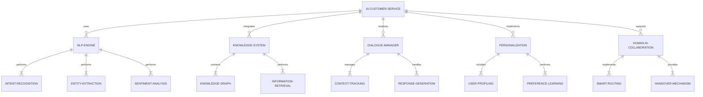

#### AI客服系统架构图

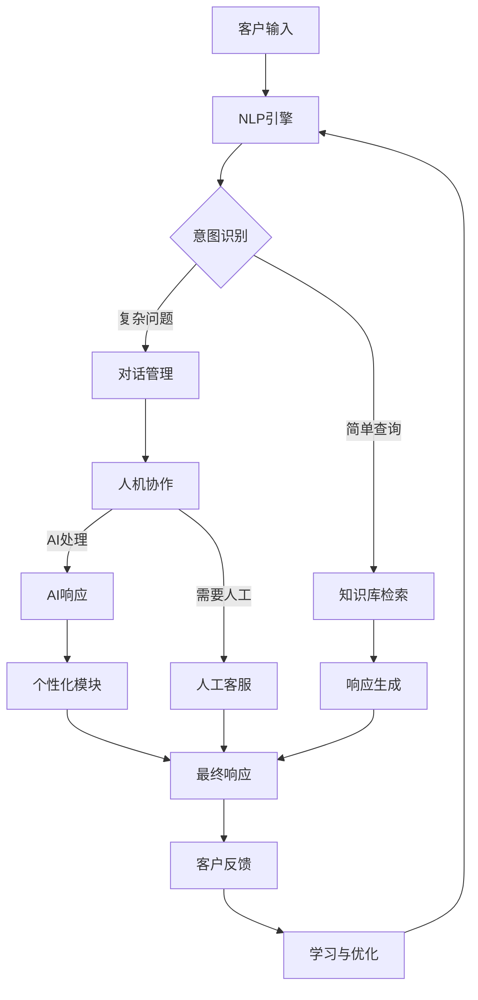

### 数学模型：
以意图识别为例，可以使用多类分类模型。假设使用softmax函数，其公式为：

$$P(y=j|\mathbf{x}) = \frac{e^{\mathbf{w}_j^T\mathbf{x}}}{\sum_{k=1}^K e^{\mathbf{w}_k^T\mathbf{x}}}$$

其中，$\mathbf{x}$ 是输入特征，$\mathbf{w}_j$ 是第 $j$ 类的权重向量，$K$ 是类别总数。

对于情感分析，可以使用词向量和LSTM模型。LSTM的核心公式如下：

$$
\begin{aligned}
f_t &= \sigma(W_f \cdot [h_{t-1}, x_t] + b_f) \\
i_t &= \sigma(W_i \cdot [h_{t-1}, x_t] + b_i) \\
\tilde{C}_t &= \tanh(W_C \cdot [h_{t-1}, x_t] + b_C) \\
C_t &= f_t * C_{t-1} + i_t * \tilde{C}_t \\
o_t &= \sigma(W_o \cdot [h_{t-1}, x_t] + b_o) \\
h_t &= o_t * \tanh(C_t)
\end{aligned}
$$

其中，$f_t$, $i_t$, $o_t$ 分别是遗忘门、输入门和输出门，$C_t$ 是单元状态，$h_t$ 是隐藏状态。

### 算法流程图：

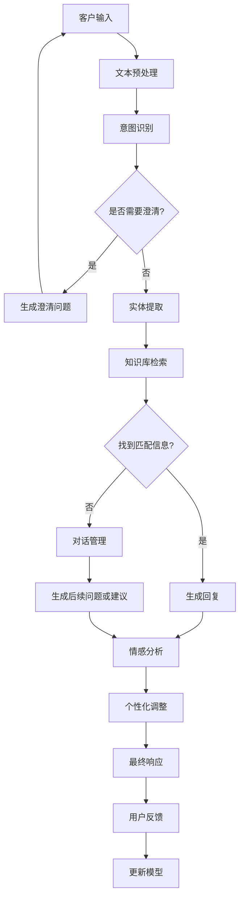

### 算法源代码：
以下是一个简化的AI客服系统的Python实现示例：

```python
import numpy as np
from sklearn.feature_extraction.text import TfidfVectorizer
from sklearn.naive_bayes import MultinomialNB
from sklearn.model_selection import train_test_split
import nltk
from nltk.sentiment import SentimentIntensityAnalyzer
import random

class AICustomerService:
    def __init__(self):
        self.intent_classifier = None
        self.vectorizer = TfidfVectorizer()
        self.sentiment_analyzer = SentimentIntensityAnalyzer()
        self.knowledge_base = {
            "product_info": "Our product is a state-of-the-art AI system.",
            "pricing": "The price starts at $99 per month.",
            "support": "We offer 24/7 customer support."
        }
        self.conversation_history = []

    def train_intent_classifier(self, X, y):
        X_train, X_test, y_train, y_test = train_test_split(X, y, test_size=0.2, random_state=42)
        X_train_vectorized = self.vectorizer.fit_transform(X_train)
        self.intent_classifier = MultinomialNB()
        self.intent_classifier.fit(X_train_vectorized, y_train)

    def classify_intent(self, text):
        vectorized_text = self.vectorizer.transform([text])
        intent = self.intent_classifier.predict(vectorized_text)[0]
        return intent

    def extract_entities(self, text):
        # 简化的实体提取
        words = nltk.word_tokenize(text)
        tagged = nltk.pos_tag(words)
        entities = [word for word, pos in tagged if pos in ['NN', 'NNP']]
        return entities

    def get_response(self, intent, entities):
        if intent in self.knowledge_base:
            return self.knowledge_base[intent]
        elif "product" in entities:
            return self.knowledge_base["product_info"]
        elif "price" in entities:
            return self.knowledge_base["pricing"]
        else:
            return "I'm not sure about that. Can you please provide more information?"

    def analyze_sentiment(self, text):
        sentiment_scores = self.sentiment_analyzer.polarity_scores(text)
        if sentiment_scores['compound'] > 0.05:
            return "positive"
        elif sentiment_scores['compound'] < -0.05:
            return "negative"
        else:
            return "neutral"

    def personalize_response(self, response, sentiment):
        if sentiment == "negative":
            return "I apologize for any inconvenience. " + response
        elif sentiment == "positive":
            return "Great! I'm glad to help. " + response
        else:
            return response

    def handle_conversation(self, user_input):
        intent = self.classify_intent(user_input)
        entities = self.extract_entities(user_input)
        sentiment = self.analyze_sentiment(user_input)
        
        base_response = self.get_response(intent, entities)
        personalized_response = self.personalize_response(base_response, sentiment)
        
        self.conversation_history.append((user_input, personalized_response))
        return personalized_response

    def human_handover(self):
        return "I'm transferring you to a human agent for further assistance."

# 使用示例
ai_service = AICustomerService()

# 训练意图分类器
intents = ["greeting", "product_inquiry", "pricing", "support", "complaint"]
texts = [
    "Hello", "Hi there", "What products do you offer?", "Tell me about your service",
    "How much does it cost?", "What's the price?", "I need help", "Support please",
    "I have a problem", "This is not working"
]
labels = [intents[i//2] for i in range(len(texts))]
ai_service.train_intent_classifier(texts, labels)

# 模拟对话
while True:
    user_input = input("User: ")
    if user_input.lower() == 'quit':
        break
    response = ai_service.handle_conversation(user_input)
    print("AI:", response)
    
    # 模拟复杂查询转人工
    if random.random() < 0.2:  # 20% 概率转人工
        print("AI:", ai_service.human_handover())
        break

print("Conversation history:")
for user, ai in ai_service.conversation_history:
    print(f"User: {user}")
    print(f"AI: {ai}")
    print()
```

### 实际场景应用：
1. 电商客服：处理订单查询、退换货请求、产品咨询等
2. 金融服务：回答账户查询、交易处理、投资建议等
3. 技术支持：解答软件使用问题、故障诊断、升级指导等
4. 旅游预订：处理机票酒店预订、行程规划、旅游信息咨询等
5. 医疗咨询：提供初步症状评估、预约安排、健康建议等

### 项目介绍：
开发一个多功能AI客服平台，支持多渠道接入、多语言处理、知识库管理和人机协作。

### 环境安装：
```bash
pip install numpy scikit-learn nltk transformers torch pandas flask
```

### 系统功能设计：
1. 多渠道接入模块：支持网页、移动APP、社交媒体等
2. 自然语言处理模块：意图识别、实体提取、情感分析
3. 知识库管理模块：知识图谱构建、信息检索、动态更新
4. 对话管理模块：上下文跟踪、多轮对话处理
5. 个性化推荐模块：用户画像、个性化响应生成
6. 人机协作模块：智能分流、人工接入接口
7. 分析报告模块：性能监控、用户满意度分析
8. 系统管理模块：配置管理、用户权限控制

### 系统架构设计：

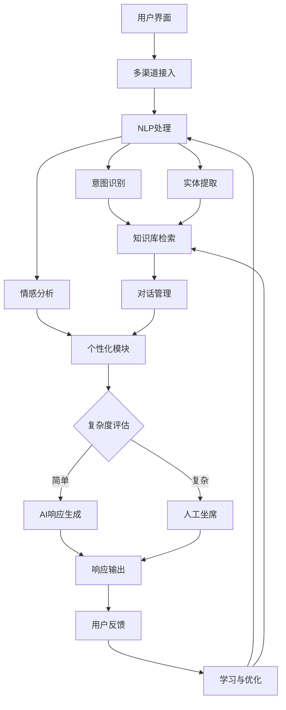

### 系统接口设计：
1. 用户输入接口：接收多渠道的用户查询
2. NLP处理接口：提供意图识别、实体提取、情感分析服务
3. 知识库查询接口：根据意图和实体检索相关信息
4. 对话状态管理接口：维护和更新对话上下文
5. 响应生成接口：根据检索结果和上下文生成回复
6. 人工坐席接口：将复杂查询转接给人工处理
7. 反馈收集接口：收集用户满意度和改进建议
8. 系统监控接口：实时监控系统性能和负载

### 系统核心实现源代码：

```python
from flask import Flask, request, jsonify
from transformers import pipeline
import numpy as np
from sklearn.feature_extraction.text import TfidfVectorizer
from sklearn.naive_bayes import MultinomialNB
import nltk
from nltk.sentiment import SentimentIntensityAnalyzer

app = Flask(__name__)

class AICustomerServicePlatform:
    def __init__(self):
        self.nlp = pipeline("text-classification", model="distilbert-base-uncased-finetuned-sst-2-english")
        self.intent_classifier = MultinomialNB()
        self.vectorizer = TfidfVectorizer()
        self.sentiment_analyzer = SentimentIntensityAnalyzer()
        self.knowledge_base = {}
        self.conversation_history = {}

    def train_intent_classifier(self, X, y):
        X_vectorized = self.vectorizer.fit_transform(X)
        self.intent_classifier.fit(X_vectorized, y)

    def classify_intent(self, text):
        vectorized_text = self.vectorizer.transform([text])
        intent = self.intent_classifier.predict(vectorized_text)[0]
        return intent

    def extract_entities(self, text):
        words = nltk.word_tokenize(text)
        tagged = nltk.pos_tag(words)
        entities = [word for word, pos in tagged if pos in ['NN', 'NNP']]
        return entities

    def analyze_sentiment(self, text):
        return self.nlp(text)[0]['label']

    def get_response(self, intent, entities):
        if intent in self.knowledge_base:
            return self.knowledge_base[intent]
        else:
            return "I don't have specific information about that. Can you please provide more details?"

    def update_conversation_history(self, user_id, user_input, ai_response):
        if user_id not in self.conversation_history:
            self.conversation_history[user_id] = []
        self.conversation_history[user_id].append((user_input, ai_response))

    def handle_query(self, user_id, user_input):
        intent = self.classify_intent(user_input)
        entities = self.extract_entities(user_input)
        sentiment = self.analyze_sentiment(user_input)
        
        response = self.get_response(intent, entities)
        
        if sentiment == 'NEGATIVE':
            response = "I apologize for any inconvenience. " + response
        
        self.update_conversation_history(user_id, user_input, response)
        return response

ai_platform = AICustomerServicePlatform()

@app.route('/query', methods=['POST'])
def handle_query():
    data = request.json
    user_id = data['user_id']
    user_input = data['input']
    
    response = ai_platform.handle_query(user_id, user_input)
    return jsonify({'response': response})

@app.route('/train', methods=['POST'])
def train_model():
    data = request.json
    X = data['texts']
    y = data['intents']
    ai_platform.train_intent_classifier(X, y)
    return jsonify({'status': 'success', 'message': 'Model trained successfully'})

@app.route('/update_knowledge', methods=['POST'])
def update_knowledge():
    data = request.json
    ai_platform.knowledge_base.update(data['knowledge'])
    return jsonify({'status': 'success', 'message': 'Knowledge base updated'})

if __name__ == '__main__':
    app.run(debug=True)
```

### 最佳实践tips：
1. 持续学习：定期更新模型，适应新的查询模式和知识
2. 多样化测试：使用多样的测试集，包括边缘案例和异常输入
3. 人机协作：设置清晰的人工接入触发条件，确保复杂问题得到妥善处理
4. 个性化调优：根据用户历史和偏好动态调整响应策略
5. 多语言支持：使用多语言模型或翻译服务扩展语言覆盖
6. 安全性考虑：实施敏感信息过滤和用户认证机制
7. 性能优化：使用缓存和异步处理提高响应速度
8. 错误恢复：实现健壮的错误处理和回退机制
9. 用户反馈：积极收集和分析用户反馈，持续改进系统
10. 道德伦理：确保AI行为符合道德标准，避免偏见和不当回应

### 行业发展与未来趋势：

| 时期 | 主要特征 | 技术焦点 | 应用方向 | 挑战 |
|------|----------|----------|----------|------|
| 现在 | 多渠道集成、个性化服务 | NLP、知识图谱 | 客服自动化、智能推荐 | 复杂查询处理、多语言支持 |
| 近期 | 情感智能、多模态交互 | 情感计算、跨模态学习 | 情感关怀、视觉辅助服务 | 情感理解准确性、多模态融合 |
| 中期 | 认知智能、场景理解 | 常识推理、上下文学习 | 复杂问题解决、预测性服务 | 抽象推理能力、知识更新 |
| 远期 | 通用智能客服、自主决策 | AGI、自主学习 | 全方位业务支持、创新服务模式 | 伦理决策、人机协作平衡 |

### 本章小结：
本节深入探讨了AI Agent在客户服务与支持领域的应用。我们详细分析了AI客服系统的核心组件、关键技术和实现方法，并通过实际的代码示例展示了如何构建一个基础的AI客服平台。

AI客服系统的优势在于其全天候可用性、快速响应能力和处理大量并发请求的能力。通过结合NLP、知识图谱和机器学习技术，AI客服能够理解客户意图、提供个性化服务，并在处理复杂问题时无缝转接人工支持。

然而，实现高质量的AI客服系统仍面临诸多挑战，如处理复杂多轮对话、理解细微的情感变化、保持响应的一致性和准确性等。未来的发展方向可能包括增强情感智能、引入多模态交互、提升认知推理能力等。

随着技术的不断进步，我们可以预见AI客服将在更多行业和场景中发挥重要作用，不仅提高服务效率，还能创造新的服务模式和客户体验。但同时，我们也需要关注AI应用中的伦理问题，确保AI系统的行为符合道德标准，保护用户隐私，并在人机协作中找到适当的平衡。

总的来说，AI在客户服务领域的应用前景广阔，它不仅能够显著提升服务质量和效率，还能为企业带来竞争优势。然而，成功的AI客服系统不仅需要先进的技术，还需要深入的业务理解和持续的优化改进。在未来的发展中，如何将AI与人类专业知识和情感智慧有机结合，将是推动客户服务创新的关键。

## 3.2 智能办公与协作

随着数字化转型的深入，AI Agent在智能办公与协作领域的应用正在revolutionize传统的工作方式。本节将探讨AI如何提升办公效率、促进团队协作，以及在企业管理中的创新应用。

### 核心概念：
智能办公AI Agent是指能够辅助或自动化办公任务、促进团队协作、优化工作流程的人工智能系统。它结合了自然语言处理、机器学习、知识管理等技术，为现代办公环境提供智能支持。

### 问题背景：
传统办公模式面临效率低下、信息孤岛、协作困难等挑战。随着远程办公的普及和业务复杂性的增加，企业迫切需要更智能、更灵活的办公解决方案。

### 问题描述：
如何设计和实现一个全面的智能办公AI Agent系统，使其能够有效管理日程、自动化文档处理、促进团队协作、优化决策过程，同时保证数据安全和用户隐私？该系统如何与现有的办公软件和工作流程无缝集成，并适应不同规模和类型的组织需求？

### 问题解决：
1. 智能日程管理：自动安排会议、提醒重要事项、优化时间分配
2. 文档智能处理：自动分类、摘要生成、关键信息提取
3. 协作增强：智能任务分配、进度跟踪、团队沟通辅助
4. 知识管理：构建企业知识图谱、智能信息检索、经验共享
5. 决策支持：数据分析、预测模型、情景模拟
6. 流程自动化：识别重复任务、设计和执行自动化工作流
7. 个性化助手：根据个人工作习惯提供定制化服务
8. 安全与隐私：数据加密、访问控制、隐私保护机制

### 边界与外延：
- 应用范围：从个人效率工具到企业级管理系统
- 集成对象：办公套件、项目管理工具、CRM系统、ERP系统等
- 部署方式：云端服务、本地部署、混合模式

### 概念结构与核心要素组成：

1. 自然语言处理引擎：
    - 意图识别
    - 实体提取
    - 语义理解

2. 智能调度系统：
    - 日程优化算法
    - 资源分配
    - 冲突检测

3. 文档处理模块：
    - OCR技术
    - 文本分类
    - 信息提取

4. 协作平台：
    - 实时通信
    - 任务管理
    - 版本控制

5. 知识库系统：
    - 知识图谱
    - 语义搜索
    - 自动更新机制

6. 决策支持系统：
    - 数据可视化
    - 预测分析
    - 风险评估

7. 自动化工作流引擎：
    - 流程设计工具
    - 触发器机制
    - 执行监控

8. 安全与隐私模块：
    - 身份认证
    - 数据加密
    - 审计日志

### 概念之间的关系：

#### 概念核心属性维度对比

| 属性维度 | 传统办公 | 智能办公 | AI增强办公 |
|----------|----------|----------|------------|
| 效率 | 低 | 中 | 高 |
| 个性化 | 低 | 中 | 高 |
| 协作能力 | 有限 | 改善 | 显著提升 |
| 决策支持 | 基于经验 | 数据驱动 | 智能预测 |
| 自动化程度 | 低 | 部分任务 | 大部分任务 |
| 学习能力 | 无 | 有限 | 持续学习 |
| 适应性 | 低 | 中 | 高 |
| 成本 | 高（人力） | 中 | 低（长期） |

#### 概念联系的ER 实体关系

```mermaid
erDiagram
    AI-OFFICE-ASSISTANT ||--o{ NLP-ENGINE : uses
    AI-OFFICE-ASSISTANT ||--o{ SMART-SCHEDULER : employs
    AI-OFFICE-ASSISTANT ||--o{ DOCUMENT-PROCESSOR : integrates
    AI-OFFICE-ASSISTANT ||--o{ COLLABORATION-PLATFORM : facilitates
    AI-OFFICE-ASSISTANT ||--o{ KNOWLEDGE-BASE : maintains
    AI-OFFICE-ASSISTANT ||--o{ DECISION-SUPPORT : provides
    AI-OFFICE-ASSISTANT ||--o{ WORKFLOW-AUTOMATION : implements
    AI-OFFICE-ASSISTANT ||--o{ SECURITY-PRIVACY : ensures
    NLP-ENGINE ||--|{ INTENT-RECOGNITION : performs
    NLP-ENGINE ||--|{ ENTITY-EXTRACTION : executes
    SMART-SCHEDULER ||--|{ CALENDAR-OPTIMIZATION : runs
    SMART-SCHEDULER ||--|{ RESOURCE-ALLOCATION : manages
    DOCUMENT-PROCESSOR ||--|{ OCR : applies
    DOCUMENT-PROCESSOR ||--|{ TEXT-CLASSIFICATION : conducts
    COLLABORATION-PLATFORM ||--|{ REAL-TIME-COMMUNICATION : enables
    COLLABORATION-PLATFORM ||--|{ TASK-TRACKING : supports
    KNOWLEDGE-BASE ||--|{ KNOWLEDGE-GRAPH : contains
    KNOWLEDGE-BASE ||--|{ SEMANTIC-SEARCH : offers
    DECISION-SUPPORT ||--|{ DATA-VISUALIZATION : generates
    DECISION-SUPPORT ||--|{ PREDICTIVE-ANALYTICS : performs
    WORKFLOW-AUTOMATION ||--|{ PROCESS-DESIGN : allows
    WORKFLOW-AUTOMATION ||--|{ EXECUTION-MONITORING : conducts
    SECURITY-PRIVACY ||--|{ DATA-ENCRYPTION : implements
    SECURITY-PRIVACY ||--|{ ACCESS-CONTROL : enforces
```

#### 智能办公系统架构图

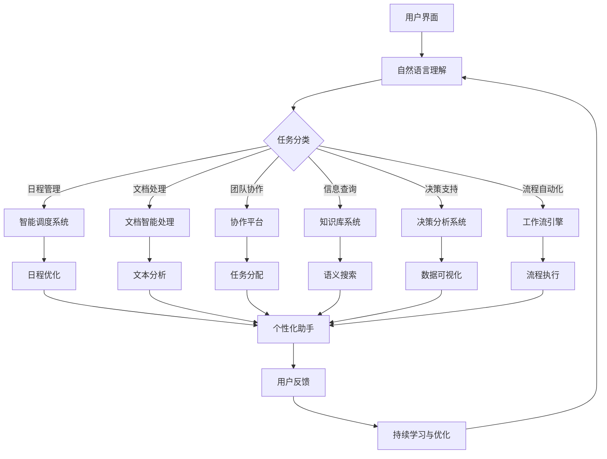

### 数学模型：
以智能调度为例，可以使用约束满足问题（CSP）模型。定义变量集 $X = \{x_1, ..., x_n\}$，每个变量代表一个待安排的任务，域 $D = \{d_1, ..., d_n\}$ 表示可用时间槽，约束集 $C$ 包含时间冲突、优先级等约束。目标是找到一个赋值 $a: X \rightarrow D$，使得所有约束都得到满足。

形式化表示：
$$\text{find } a: X \rightarrow D \text{ such that } \forall c_i \in C: c_i(a) = true$$

对于文档分类，可以使用支持向量机（SVM）模型。给定训练数据 $(x_1, y_1), ..., (x_n, y_n)$，其中 $x_i \in \mathbb{R}^d$ 是文档特征向量，$y_i \in \{-1, 1\}$ 是类别标签，SVM 的目标函数为：

$$\min_{w, b} \frac{1}{2} \|w\|^2 + C \sum_{i=1}^n \max(0, 1 - y_i(w^T x_i + b))$$

其中 $w$ 是权重向量，$b$ 是偏置项，$C$ 是正则化参数。

### 算法流程图：

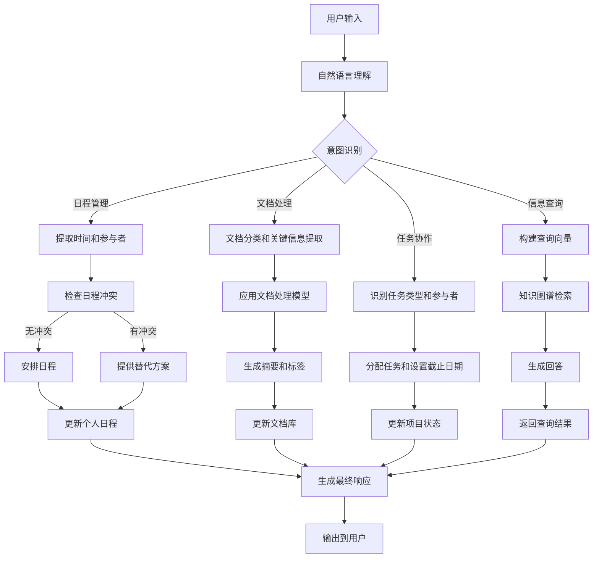

### 算法源代码：
以下是一个简化的智能办公助手系统的Python实现示例：

```python
import datetime
import nltk
from nltk.tokenize import word_tokenize
from nltk.corpus import stopwords
from sklearn.feature_extraction.text import TfidfVectorizer
from sklearn.svm import SVC
import networkx as nx

class SmartOfficeAssistant:
    def __init__(self):
        self.nlp_engine = NLPEngine()
        self.scheduler = SmartScheduler()
        self.document_processor = DocumentProcessor()
        self.collaboration_platform = CollaborationPlatform()
        self.knowledge_base = KnowledgeBase()
        
    def process_request(self, user_input):
        intent = self.nlp_engine.classify_intent(user_input)
        if intent == 'schedule':
            return self.scheduler.manage_schedule(user_input)
        elif intent == 'document':
            return self.document_processor.process_document(user_input)
        elif intent == 'task':
            return self.collaboration_platform.manage_task(user_input)
        elif intent == 'query':
            return self.knowledge_base.answer_query(user_input)
        else:
            return "I'm sorry, I didn't understand that request."

class NLPEngine:
    def __init__(self):
        self.stop_words = set(stopwords.words('english'))
        self.vectorizer = TfidfVectorizer(stop_words=self.stop_words)
        self.classifier = SVC(kernel='linear')
        
    def classify_intent(self, text):
        # 简化的意图分类，实际应用中需要训练分类器
        keywords = {
            'schedule': ['meeting', 'appointment', 'schedule', 'calendar'],
            'document': ['document', 'file', 'report', 'analysis'],
            'task': ['task', 'project', 'assign', 'collaborate'],
            'query': ['question', 'how', 'what', 'when', 'where', 'why']
        }
        tokens = word_tokenize(text.lower())
        for intent, words in keywords.items():
            if any(word in tokens for word in words):
                return intent
        return 'unknown'

class SmartScheduler:
    def __init__(self):
        self.schedule = {}
        
    def manage_schedule(self, request):
        # 简化的日程管理逻辑
        date = datetime.date.today()
        time = datetime.time(9, 0)  # Default to 9 AM
        event = "Meeting"
        
        # 实际应用中，应该从请求中提取日期、时间和事件详情
        self.schedule[date] = self.schedule.get(date, []) + [(time, event)]
        return f"Scheduled {event} for {date} at {time}"

class DocumentProcessor:
    def __init__(self):
        self.vectorizer = TfidfVectorizer()
        self.classifier = SVC(kernel='linear')
        
    def process_document(self, document):
        # 简化的文档处理逻辑
        summary = " ".join(document.split()[:10])  # 简单地取前10个词作为摘要
        category = "Report"  # 实际应用中应该使用分类器
        return f"Document processed. Summary: {summary}. Category: {category}"

class CollaborationPlatform:
    def __init__(self):
        self.tasks = []
        
    def manage_task(self, task_description):
        # 简化的任务管理逻辑
        self.tasks.append(task_description)
        return f"Task added: {task_description}"

class KnowledgeBase:
    def __init__(self):
        self.graph = nx.Graph()
        
    def answer_query(self, query):
        # 简化的知识库查询逻辑
        return "Based on the available information, the answer to your query is not found."

# 使用示例
assistant = SmartOfficeAssistant()

while True:
    user_input = input("How can I assist you today? ")
    if user_input.lower() == 'exit':
        break
    response = assistant.process_request(user_input)
    print("Assistant:", response)
```

### 实际场景应用：
1. 智能日程管理：自动安排会议、提醒截止日期、优化时间分配
2. 文档智能处理：自动分类归档、生成报告摘要、提取关键信息
3. 项目协作：智能分配任务、跟踪项目进度、识别潜在风险
4. 知识管理：构建企业知识图谱、智能问答系统、经验共享平台
5. 智能决策支持：数据可视化、预测分析、情景模拟
6. 流程自动化：识别重复任务、设计和执行自动化工作流
7. 智能会议助手：会议记录、行动项跟踪、自动生成会议纪要
8. 个性化工作台：根据个人偏好和工作习惯定制界面和功能

### 项目介绍：
开发一个综合性的智能办公助手平台，集成日程管理、文档处理、协作工具、知识库和决策支持系统，为企业提供全方位的智能办公解决方案。

### 环境安装：
```bash
pip install nltk scikit-learn networkx pandas numpy matplotlib flask sqlalchemy
```

### 系统功能设计：
1. 智能日程管理模块：日程安排、提醒系统、资源分配
2. 文档智能处理模块：OCR、文本分类、信息提取、摘要生成
3. 协作平台模块：任务管理、实时通信、进度跟踪
4. 知识库系统模块：知识图谱构建、语义搜索、自动更新
5. 决策支持模块：数据分析、可视化、预测模型
6. 工作流自动化模块：流程设计工具、触发器机制、执行监控
7. 个性化助手模块：用户偏好学习、定制化推荐
8. 安全与隐私模块：访问控制、数据加密、审计日志

### 系统架构设计：

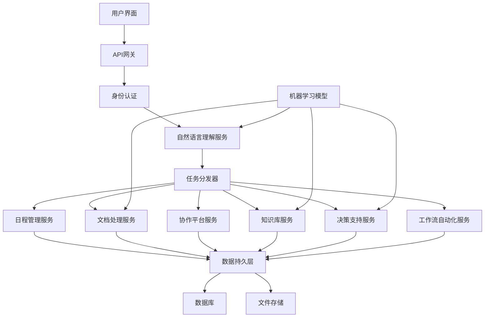

### 系统接口设计：
1. 用户认证接口：处理登录、注销、权限验证
2. 日程管理接口：创建、更新、删除日程，查询空闲时间
3. 文档处理接口：上传、分类、提取信息、生成摘要
4. 任务管理接口：创建、分配、更新任务状态
5. 知识查询接口：提交问题、返回答案、反馈机制
6. 数据分析接口：提交分析请求、返回可视化结果
7. 工作流定义接口：创建、修改、执行自动化工作流
8. 个性化设置接口：更新用户偏好、获取个性化建议

### 系统核心实现源代码：

```python
from flask import Flask, request, jsonify
from flask_sqlalchemy import SQLAlchemy
from flask_jwt_extended import JWTManager, jwt_required, create_access_token
from werkzeug.security import generate_password_hash, check_password_hash
import nltk
from nltk.tokenize import word_tokenize
from sklearn.feature_extraction.text import TfidfVectorizer
from sklearn.svm import SVC
import datetime
import networkx as nx

app = Flask(__name__)
app.config['SQLALCHEMY_DATABASE_URI'] = 'sqlite:///smart_office.db'
app.config['JWT_SECRET_KEY'] = 'your-secret-key'  # 更改为安全的密钥
db = SQLAlchemy(app)
jwt = JWTManager(app)

class User(db.Model):
    id = db.Column(db.Integer, primary_key=True)
    username = db.Column(db.String(80), unique=True, nullable=False)
    password_hash = db.Column(db.String(120), nullable=False)

class Schedule(db.Model):
    id = db.Column(db.Integer, primary_key=True)
    user_id = db.Column(db.Integer, db.ForeignKey('user.id'), nullable=False)
    event = db.Column(db.String(200), nullable=False)
    date = db.Column(db.Date, nullable=False)
    time = db.Column(db.Time, nullable=False)

class Document(db.Model):
    id = db.Column(db.Integer, primary_key=True)
    user_id = db.Column(db.Integer, db.ForeignKey('user.id'), nullable=False)
    filename = db.Column(db.String(200), nullable=False)
    content = db.Column(db.Text, nullable=False)
    category = db.Column(db.String(50))
    summary = db.Column(db.Text)

class Task(db.Model):
    id = db.Column(db.Integer, primary_key=True)
    user_id = db.Column(db.Integer, db.ForeignKey('user.id'), nullable=False)
    description = db.Column(db.String(500), nullable=False)
    status = db.Column(db.String(20), default='pending')
    due_date = db.Column(db.Date)

class NLPEngine:
    def __init__(self):
        self.vectorizer = TfidfVectorizer(stop_words='english')
        self.classifier = SVC(kernel='linear')
        
    def classify_intent(self, text):
        # 简化的意图分类，实际应用中需要训练分类器
        keywords = {
            'schedule': ['meeting', 'appointment', 'schedule', 'calendar'],
            'document': ['document', 'file', 'report', 'analysis'],
            'task': ['task', 'project', 'assign', 'collaborate'],
            'query': ['question', 'how', 'what', 'when', 'where', 'why']
        }
        tokens = word_tokenize(text.lower())
        for intent, words in keywords.items():
            if any(word in tokens for word in words):
                return intent
        return 'unknown'

nlp_engine = NLPEngine()

@app.route('/login', methods=['POST'])
def login():
    username = request.json.get('username', None)
    password = request.json.get('password', None)
    user = User.query.filter_by(username=username).first()
    if user and check_password_hash(user.password_hash, password):
        access_token = create_access_token(identity=username)
        return jsonify(access_token=access_token), 200
    return jsonify({"msg": "Bad username or password"}), 401

@app.route('/schedule', methods=['POST'])
@jwt_required()
def manage_schedule():
    user_id = User.query.filter_by(username=get_jwt_identity()).first().id
    event = request.json.get('event')
    date = datetime.datetime.strptime(request.json.get('date'), '%Y-%m-%d').date()
    time = datetime.datetime.strptime(request.json.get('time'), '%H:%M').time()
    new_schedule = Schedule(user_id=user_id, event=event, date=date, time=time)
    db.session.add(new_schedule)
    db.session.commit()
    return jsonify({"msg": "Schedule added successfully"}), 201

@app.route('/document', methods=['POST'])
@jwt_required()
def process_document():
    user_id = User.query.filter_by(username=get_jwt_identity()).first().id
    filename = request.json.get('filename')
    content = request.json.get('content')
    # 实际应用中，这里应该有文档处理的逻辑
    category = "Report"  # 简化处理，实际应该用分类器
    summary = content[:100]  # 简化的摘要生成
    new_document = Document(user_id=user_id, filename=filename, content=content, category=category, summary=summary)
    db.session.add(new_document)
    db.session.commit()
    return jsonify({"msg": "Document processed successfully", "category": category, "summary": summary}), 201

@app.route('/task', methods=['POST'])
@jwt_required()
def manage_task():
    user_id = User.query.filter_by(username=get_jwt_identity()).first().id
    description = request.json.get('description')
    due_date = datetime.datetime.strptime(request.json.get('due_date'), '%Y-%m-%d').date()
    new_task = Task(user_id=user_id, description=description, due_date=due_date)
    db.session.add(new_task)
    db.session.commit()
    return jsonify({"msg": "Task added successfully"}), 201

@app.route('/query', methods=['POST'])
@jwt_required()
def answer_query():
    query = request.json.get('query')
    # 简化的查询处理，实际应用中应该连接到知识图谱或其他高级查询系统
    return jsonify({"answer": "I'm sorry, I don't have enough information to answer that query."}), 200

@app.route('/process', methods=['POST'])
@jwt_required()
def process_request():
    user_input = request.json.get('input')
    intent = nlp_engine.classify_intent(user_input)
    if intent == 'schedule':
        return manage_schedule()
    elif intent == 'document':
        return process_document()
    elif intent == 'task':
        return manage_task()
    elif intent == 'query':
        return answer_query()
    else:
        return jsonify({"msg": "I'm sorry, I didn't understand that request."}), 400

if __name__ == '__main__':
    db.create_all()
    app.run(debug=True)
```

### 最佳实践tips：
1. 模块化设计：将系统分为独立的模块，便于维护和扩展
2. 持续学习：实现模型的在线学习机制，不断优化性能
3. 用户反馈：设计直观的反馈机制，收集用户意见以改进系统
4. 安全第一：实施强大的身份验证和数据加密措施
5. 性能优化：使用缓存、异步处理等技术提高系统响应速度
6. 可扩展性：设计支持水平扩展的架构，以应对增长的用户需求
7. 多模态交互：支持文本、语音、图像等多种输入方式
8. 个性化体验：根据用户行为和偏好动态调整系统行为
9. 错误处理：实现健壮的错误处理和日志记录机制
10. 合规性：确保系统符合数据保护和隐私法规要求

### 行业发展与未来趋势：

| 时期 | 主要特征 | 技术焦点 | 应用方向 | 挑战 |
|------|----------|----------|----------|------|
| 现在 | 任务自动化、智能辅助 | NLP、机器学习 | 日程管理、文档处理 | 系统集成、用户适应 |
| 近期 | 深度协作、预测分析 | 深度学习、知识图谱 | 智能决策支持、预测性维护 | 数据安全、模型解释性 |
| 中期 | 认知办公、场景理解 | 强化学习、多模态AI | 自主决策、创意辅助 | 伦理问题、人机协作 |
| 远期 | 全面智能化、自适应系统 | AGI、量子计算 | 虚拟员工、创新加速 | 就业影响、系统控制 |

### 本章小结：
本节深入探讨了AI Agent在智能办公与协作领域的应用。我们详细分析了智能办公系统的核心组件、关键技术和实现方法，并通过实际的代码示例展示了如何构建一个基础的智能办公助手平台。

智能办公AI Agent的优势在于其能够自动化重复性任务、优化工作流程、提供智能决策支持，从而显著提高办公效率和协作质量。通过结合NLP、机器学习、知识图谱等技术，这些系统能够理解复杂的用户需求，提供个性化的办公体验，并在处理复杂任务时实现人机协作。

然而，实现高质量的智能办公系统仍面临诸多挑战，如系统集成的复杂性、数据安全和隐私保护、用户适应性等。未来的发展方向可能包括更深度的人机协作、更强大的预测分析能力、以及向认知办公和全面智能化的演进。

随着技术的不断进步，我们可以预见AI在办公领域将扮演越来越重要的角色，不仅提高工作效率，还能激发创新、优化决策过程。但同时，我们也需要关注AI应用带来的伦理问题和潜在的就业影响，确保技术发展与人类利益相协调。

总的来说，AI在智能办公与协作领域的应用前景广阔，它有潜力彻底改变我们的工作方式和组织结构。然而，成功的智能办公系统不仅需要先进的技术，还需要深入的业务理解和持续的优化改进。在未来的发展中，如何平衡技术创新与人文关怀，如何在提高效率的同时增强人的创造力和决策能力，将是推动智能办公创新的关键。

## 3.3 数据分析与决策支持

在当今数据驱动的商业环境中，AI Agent在数据分析与决策支持领域的应用正在revolutionize企业的决策过程。本节将探讨AI如何增强数据分析能力、提供洞察，并支持更明智、更及时的决策制定。

### 核心概念：
数据分析与决策支持AI Agent是指能够自动化数据处理、执行高级分析、生成洞察，并为决策者提供建议的智能系统。它结合了机器学习、自然语言处理、预测分析等技术，将原始数据转化为可操作的商业智能。

### 问题背景：
传统的数据分析方法往往耗时耗力，难以应对大规模、高维度的数据。决策者常常面临信息过载，难以从海量数据中提取关键洞察。随着市场环境的快速变化，企业需要更快速、更准确的决策支持工具。

### 问题描述：
如何设计和实现一个全面的数据分析与决策支持AI Agent系统，使其能够自动化数据处理、识别模式和趋势、生成预测模型，并以直观的方式呈现分析结果？该系统如何适应不同行业和决策场景的需求，并与现有的商业智能工具无缝集成？

### 问题解决：
1. 数据集成与预处理：自动化数据清洗、转换和集成
2. 高级分析模型：应用机器学习算法进行预测和分类
3. 自然语言查询：支持使用自然语言进行数据查询和分析
4. 可视化与报告：自动生成直观的数据可视化和报告
5. 异常检测：识别数据中的异常模式和离群值
6. 预测分析：基于历史数据构建预测模型
7. 决策优化：使用运筹学方法优化资源分配8. 实时监控：持续监控关键指标，及时发出警报
9. 情景模拟：允许用户模拟不同决策的潜在结果

### 边界与外延：
- 应用范围：从财务分析到市场研究，从运营优化到风险管理
- 数据源：结构化数据库、非结构化文本、外部API、物联网设备等
- 决策层级：从战略决策到日常运营决策

### 概念结构与核心要素组成：

1. 数据处理引擎：
    - ETL（提取、转换、加载）工具
    - 数据清洗算法
    - 特征工程

2. 分析模型库：
    - 统计分析模型
    - 机器学习算法
    - 深度学习网络

3. 自然语言处理模块：
    - 意图识别
    - 实体提取
    - 语义分析

4. 可视化引擎：
    - 交互式图表生成
    - 仪表盘设计
    - 报告模板

5. 预测分析系统：
    - 时间序列分析
    - 回归模型
    - 分类模型

6. 决策优化模块：
    - 线性规划
    - 遗传算法
    - 蒙特卡洛模拟

7. 实时监控系统：
    - 流数据处理
    - 阈值警报
    - 异常检测

8. 知识库：
    - 领域知识图谱
    - 最佳实践库
    - 决策规则引擎

### 概念之间的关系：

#### 概念核心属性维度对比

| 属性维度 | 传统BI工具 | AI增强分析 | 全面AI决策支持 |
|----------|------------|------------|----------------|
| 数据处理能力 | 中 | 高 | 极高 |
| 分析复杂度 | 低-中 | 高 | 极高 |
| 预测能力 | 有限 | 强 | 极强 |
| 自动化程度 | 低 | 中 | 高 |
| 实时性 | 低 | 中-高 | 高 |
| 可解释性 | 高 | 中 | 中-低 |
| 适应性 | 低 | 中 | 高 |
| 用户友好度 | 中 | 高 | 极高 |

#### 概念联系的ER 实体关系

```mermaid
erDiagram
    AI-DECISION-SUPPORT ||--o{ DATA-PROCESSING-ENGINE : uses
    AI-DECISION-SUPPORT ||--o{ ANALYSIS-MODEL-LIBRARY : employs
    AI-DECISION-SUPPORT ||--o{ NLP-MODULE : integrates
    AI-DECISION-SUPPORT ||--o{ VISUALIZATION-ENGINE : utilizes
    AI-DECISION-SUPPORT ||--o{ PREDICTIVE-ANALYTICS : performs
    AI-DECISION-SUPPORT ||--o{ DECISION-OPTIMIZATION : executes
    AI-DECISION-SUPPORT ||--o{ REAL-TIME-MONITORING : implements
    AI-DECISION-SUPPORT ||--o{ KNOWLEDGE-BASE : consults
    DATA-PROCESSING-ENGINE ||--|{ ETL-TOOLS : contains
    DATA-PROCESSING-ENGINE ||--|{ DATA-CLEANING : performs
    ANALYSIS-MODEL-LIBRARY ||--|{ STATISTICAL-MODELS : includes
    ANALYSIS-MODEL-LIBRARY ||--|{ MACHINE-LEARNING : includes
    NLP-MODULE ||--|{ INTENT-RECOGNITION : performs
    NLP-MODULE ||--|{ ENTITY-EXTRACTION : executes
    VISUALIZATION-ENGINE ||--|{ INTERACTIVE-CHARTS : generates
    VISUALIZATION-ENGINE ||--|{ DASHBOARD : creates
    PREDICTIVE-ANALYTICS ||--|{ TIME-SERIES-ANALYSIS : conducts
    PREDICTIVE-ANALYTICS ||--|{ REGRESSION-MODELS : builds
    DECISION-OPTIMIZATION ||--|{ LINEAR-PROGRAMMING : applies
    DECISION-OPTIMIZATION ||--|{ GENETIC-ALGORITHMS : uses
    REAL-TIME-MONITORING ||--|{ STREAM-PROCESSING : performs
    REAL-TIME-MONITORING ||--|{ ANOMALY-DETECTION : implements
    KNOWLEDGE-BASE ||--|{ DOMAIN-KNOWLEDGE-GRAPH : contains
    KNOWLEDGE-BASE ||--|{ DECISION-RULES : manages
```

#### AI决策支持系统架构图

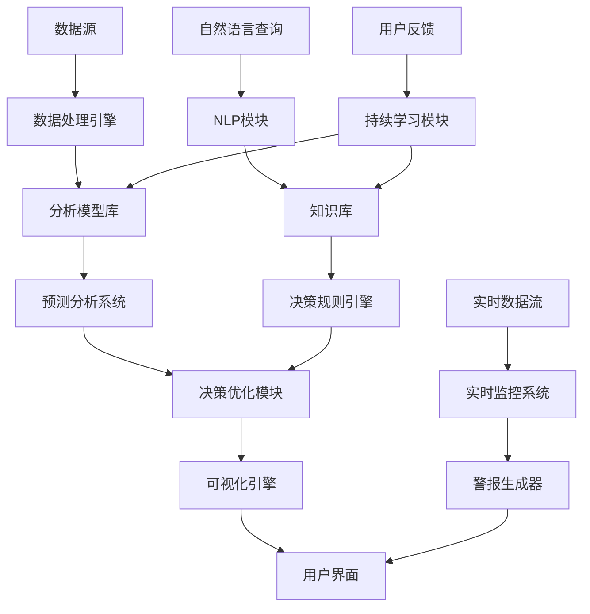

### 数学模型：
以预测分析为例，可以使用时间序列模型ARIMA（自回归集成移动平均模型）。ARIMA(p,d,q)模型的一般形式为：

$$(1-\sum_{i=1}^p \phi_i L^i)(1-L)^d y_t = (1+\sum_{i=1}^q \theta_i L^i)\epsilon_t$$

其中，$L$ 是滞后算子，$\phi_i$ 是自回归参数，$\theta_i$ 是移动平均参数，$d$ 是差分阶数，$\epsilon_t$ 是白噪声。

对于决策优化，可以使用线性规划模型。一般形式为：

$$\text{maximize } c^T x$$
$$\text{subject to } Ax \leq b$$
$$x \geq 0$$

其中，$c$ 是目标函数系数向量，$x$ 是决策变量向量，$A$ 是约束条件系数矩阵，$b$ 是约束条件右侧常数向量。

### 算法流程图：

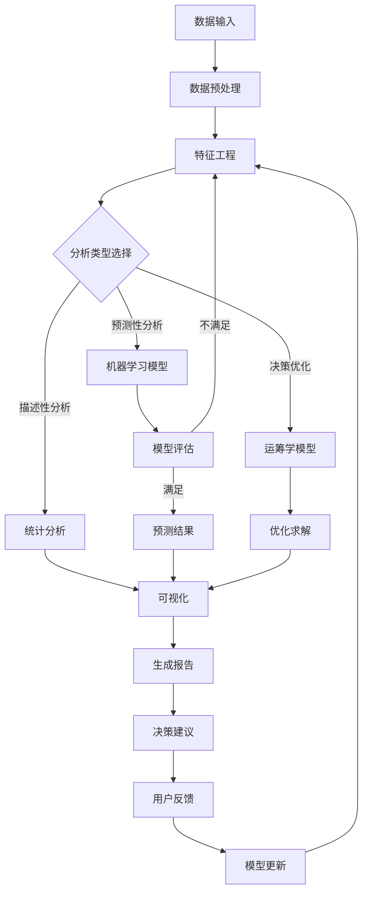

### 算法源代码：
以下是一个简化的数据分析与决策支持系统的Python实现示例：

```python
import pandas as pd
import numpy as np
from sklearn.model_selection import train_test_split
from sklearn.preprocessing import StandardScaler
from sklearn.ensemble import RandomForestRegressor
from sklearn.metrics import mean_squared_error
import matplotlib.pyplot as plt
from scipy.optimize import linprog

class AIDecisionSupport:
    def __init__(self):
        self.data = None
        self.model = None
        self.scaler = StandardScaler()
        
    def load_data(self, file_path):
        self.data = pd.read_csv(file_path)
        print("Data loaded successfully. Shape:", self.data.shape)
        
    def preprocess_data(self, target_column):
        X = self.data.drop(columns=[target_column])
        y = self.data[target_column]
        X_scaled = self.scaler.fit_transform(X)
        return train_test_split(X_scaled, y, test_size=0.2, random_state=42)
        
    def train_model(self, X_train, y_train):
        self.model = RandomForestRegressor(n_estimators=100, random_state=42)
        self.model.fit(X_train, y_train)
        print("Model trained successfully.")
        
    def evaluate_model(self, X_test, y_test):
        predictions = self.model.predict(X_test)
        mse = mean_squared_error(y_test, predictions)
        print(f"Model MSE: {mse}")
        return mse
        
    def make_prediction(self, input_data):
        scaled_input = self.scaler.transform(input_data)
        return self.model.predict(scaled_input)
        
    def visualize_results(self, actual, predicted):
        plt.figure(figsize=(10, 6))
        plt.scatter(actual, predicted)
        plt.plot([actual.min(), actual.max()], [actual.min(), actual.max()], 'r--', lw=2)
        plt.xlabel('Actual Values')
        plt.ylabel('Predicted Values')
        plt.title('Actual vs Predicted Values')
        plt.show()
        
    def optimize_decision(self, objective, constraints, bounds):
        result = linprog(c=objective, A_ub=constraints[0], b_ub=constraints[1],
                         A_eq=constraints[2], b_eq=constraints[3], bounds=bounds)
        if result.success:
            print("Optimization successful.")
            print("Optimal solution:", result.x)
            print("Optimal value:", result.fun)
        else:
            print("Optimization failed:", result.message)

# 使用示例
ai_support = AIDecisionSupport()

# 加载数据
ai_support.load_data('sample_data.csv')

# 预处理数据
X_train, X_test, y_train, y_test = ai_support.preprocess_data('target_column')

# 训练模型
ai_support.train_model(X_train, y_train)

# 评估模型
mse = ai_support.evaluate_model(X_test, y_test)

# 进行预测
new_data = pd.DataFrame({'feature1': [1, 2], 'feature2': [3, 4]})
predictions = ai_support.make_prediction(new_data)
print("Predictions:", predictions)

# 可视化结果
ai_support.visualize_results(y_test, ai_support.model.predict(X_test))

# 决策优化示例
objective = [-1, -2]  # 最大化 x + 2y
constraints = [
    [[1, 1], [2, 1]], # 约束条件左侧
    [5, 4],           # 约束条件右侧
    [],               # 等式约束左侧（本例无）
    []                # 等式约束右侧（本例无）
]
bounds = [(0, None), (0, None)]  # x >= 0, y >= 0
ai_support.optimize_decision(objective, constraints, bounds)
```

### 实际场景应用：
1. 财务预测：预测未来收入、成本和现金流
2. 市场分析：识别市场趋势、客户细分和产品定位
3. 供应链优化：预测需求、优化库存和物流路线
4. 风险评估：识别潜在风险并提供缓解策略
5. 客户行为分析：预测客户流失、个性化推荐
6. 运营效率：识别效率瓶颈、优化资源分配
7. 产品开发：分析市场需求、预测产品性能
8. 定价策略：动态定价、竞争对手分析

### 项目介绍：
开发一个综合性的AI驱动数据分析与决策支持平台，集成数据处理、高级分析、可视化和决策优化功能，为企业提供全方位的智能决策支持。

### 环境安装：
```bash
pip install pandas numpy scikit-learn matplotlib scipy flask sqlalchemy plotly dash
```

### 系统功能设计：
1. 数据集成模块：支持多源数据导入和清洗
2. 分析模型库：包含各种统计和机器学习模型
3. 预测分析模块：时间序列预测、回归分析等
4. 决策优化模块：线性规划、遗传算法等
5. 可视化模块：交互式图表、仪表盘生成
6. 自然语言查询接口：支持使用自然语言进行数据分析
7. 实时监控模块：KPI跟踪、异常检测和警报
8. 报告生成器：自动生成分析报告和决策建议

### 系统架构设计：

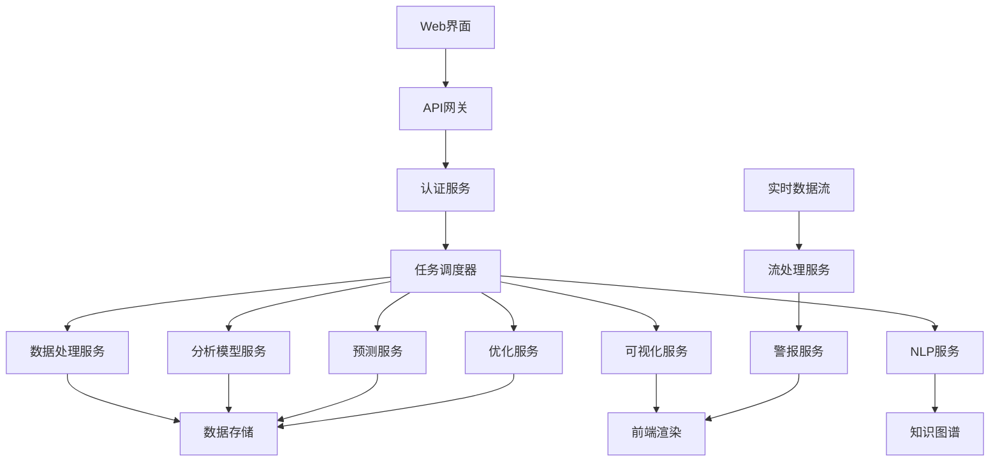

### 系统接口设计：
1. 数据导入接口：支持CSV、JSON、数据库连接等
2. 模型训练接口：选择模型、设置参数、启动训练
3. 预测接口：输入特征，返回预测结果
4. 优化接口：定义目标函数和约束条件，返回优化结果
5. 可视化接口：指定数据和图表类型，生成可视化
6. 自然语言查询接口：接收自然语言问题，返回分析结果
7. 报告生成接口：指定报告类型和内容，生成报告
8. 警报设置接口：设置监控指标和阈值

### 系统核心实现源代码：

```python
from flask import Flask, request, jsonify
from flask_sqlalchemy import SQLAlchemy
from flask_jwt_extended import JWTManager, jwt_required, create_access_token
import pandas as pd
import numpy as np
from sklearn.model_selection import train_test_split
from sklearn.ensemble import RandomForestRegressor
from sklearn.preprocessing import StandardScaler
from scipy.optimize import linprog
import plotly.express as px
import jsonapp = Flask(__name__)
app.config['SQLALCHEMY_DATABASE_URI'] = 'sqlite:///ai_decision_support.db'
app.config['JWT_SECRET_KEY'] = 'your-secret-key'  # 更改为安全的密钥
db = SQLAlchemy(app)
jwt = JWTManager(app)

class User(db.Model):
    id = db.Column(db.Integer, primary_key=True)
    username = db.Column(db.String(80), unique=True, nullable=False)
    password = db.Column(db.String(120), nullable=False)

class Dataset(db.Model):
    id = db.Column(db.Integer, primary_key=True)
    name = db.Column(db.String(100), nullable=False)
    data = db.Column(db.LargeBinary, nullable=False)

class Model(db.Model):
    id = db.Column(db.Integer, primary_key=True)
    name = db.Column(db.String(100), nullable=False)
    model_type = db.Column(db.String(50), nullable=False)
    parameters = db.Column(db.Text, nullable=False)

class AIDecisionSupport:
    def __init__(self):
        self.data = None
        self.model = None
        self.scaler = StandardScaler()

    def load_data(self, data):
        self.data = pd.read_json(data)
        return "Data loaded successfully. Shape: " + str(self.data.shape)

    def preprocess_data(self, target_column):
        X = self.data.drop(columns=[target_column])
        y = self.data[target_column]
        X_scaled = self.scaler.fit_transform(X)
        return train_test_split(X_scaled, y, test_size=0.2, random_state=42)

    def train_model(self, X_train, y_train, model_type='random_forest', params=None):
        if model_type == 'random_forest':
            self.model = RandomForestRegressor(**(params or {}))
        else:
            raise ValueError("Unsupported model type")
        self.model.fit(X_train, y_train)
        return "Model trained successfully."

    def make_prediction(self, input_data):
        scaled_input = self.scaler.transform(input_data)
        return self.model.predict(scaled_input).tolist()

    def optimize_decision(self, objective, constraints, bounds):
        result = linprog(c=objective, A_ub=constraints[0], b_ub=constraints[1],
                         A_eq=constraints[2], b_eq=constraints[3], bounds=bounds)
        if result.success:
            return {
                "status": "success",
                "optimal_solution": result.x.tolist(),
                "optimal_value": float(result.fun)
            }
        else:
            return {"status": "failed", "message": result.message}

    def generate_visualization(self, x, y, chart_type='scatter'):
        if chart_type == 'scatter':
            fig = px.scatter(x=x, y=y)
        elif chart_type == 'line':
            fig = px.line(x=x, y=y)
        else:
            raise ValueError("Unsupported chart type")
        return fig.to_json()

ai_support = AIDecisionSupport()

@app.route('/login', methods=['POST'])
def login():
    username = request.json.get('username', None)
    password = request.json.get('password', None)
    user = User.query.filter_by(username=username).first()
    if user and user.password == password:
        access_token = create_access_token(identity=username)
        return jsonify(access_token=access_token), 200
    return jsonify({"msg": "Bad username or password"}), 401

@app.route('/upload_data', methods=['POST'])
@jwt_required()
def upload_data():
    data = request.json.get('data')
    name = request.json.get('name')
    new_dataset = Dataset(name=name, data=json.dumps(data).encode())
    db.session.add(new_dataset)
    db.session.commit()
    return jsonify({"msg": "Data uploaded successfully"}), 201

@app.route('/train_model', methods=['POST'])
@jwt_required()
def train_model():
    dataset_id = request.json.get('dataset_id')
    target_column = request.json.get('target_column')
    model_type = request.json.get('model_type', 'random_forest')
    params = request.json.get('params', {})

    dataset = Dataset.query.get(dataset_id)
    if not dataset:
        return jsonify({"msg": "Dataset not found"}), 404

    ai_support.load_data(dataset.data.decode())
    X_train, X_test, y_train, y_test = ai_support.preprocess_data(target_column)
    result = ai_support.train_model(X_train, y_train, model_type, params)

    new_model = Model(name=f"{model_type}_{dataset.name}", model_type=model_type, parameters=json.dumps(params))
    db.session.add(new_model)
    db.session.commit()

    return jsonify({"msg": result, "model_id": new_model.id}), 200

@app.route('/predict', methods=['POST'])
@jwt_required()
def predict():
    model_id = request.json.get('model_id')
    input_data = request.json.get('input_data')

    model = Model.query.get(model_id)
    if not model:
        return jsonify({"msg": "Model not found"}), 404

    predictions = ai_support.make_prediction(pd.DataFrame(input_data))
    return jsonify({"predictions": predictions}), 200

@app.route('/optimize', methods=['POST'])
@jwt_required()
def optimize():
    objective = request.json.get('objective')
    constraints = request.json.get('constraints')
    bounds = request.json.get('bounds')

    result = ai_support.optimize_decision(objective, constraints, bounds)
    return jsonify(result), 200

@app.route('/visualize', methods=['POST'])
@jwt_required()
def visualize():
    x = request.json.get('x')
    y = request.json.get('y')
    chart_type = request.json.get('chart_type', 'scatter')

    visualization = ai_support.generate_visualization(x, y, chart_type)
    return jsonify({"visualization": visualization}), 200

if __name__ == '__main__':
    db.create_all()
    app.run(debug=True)
```

### 最佳实践tips：
1. 数据质量：确保输入数据的质量和一致性
2. 模型选择：根据问题类型和数据特征选择合适的模型
3. 特征工程：创建有意义的特征以提高模型性能
4. 交叉验证：使用交叉验证来评估模型的泛化能力
5. 可解释性：选择可解释的模型或使用解释技术（如SHAP值）
6. 实时更新：实现模型的在线学习和定期重训练
7. 可视化设计：创建直观、信息丰富的可视化
8. 用户反馈：收集和整合用户反馈以持续改进系统
9. 安全性：实施严格的数据访问控制和加密措施
10. 性能优化：使用缓存、并行处理等技术提高系统响应速度

### 行业发展与未来趋势：

| 时期 | 主要特征 | 技术焦点 | 应用方向 | 挑战 |
|------|----------|----------|----------|------|
| 现在 | 预测分析、自动化报告 | 机器学习、数据可视化 | 财务预测、市场分析 | 数据质量、模型可解释性 |
| 近期 | 实时决策、场景模拟 | 强化学习、数字孪生 | 动态定价、供应链优化 | 实时性能、复杂系统建模 |
| 中期 | 认知决策支持、自主学习 | 因果推理、迁移学习 | 战略规划、创新管理 | 不确定性处理、领域知识整合 |
| 远期 | 全面智能决策、人机协作 | AGI、量子计算 | 企业全面管理、新业务模式创新 | 伦理决策、人机协作平衡 |

### 本章小结：
本节深入探讨了AI Agent在数据分析与决策支持领域的应用。我们详细分析了智能决策支持系统的核心组件、关键技术和实现方法，并通过实际的代码示例展示了如何构建一个基础的AI驱动决策支持平台。

AI在数据分析与决策支持中的优势在于其能够处理大规模、高维度的数据，识别复杂的模式和关系，并提供实时、个性化的决策建议。通过结合机器学习、自然语言处理、优化算法等技术，这些系统能够自动化数据处理流程，生成深入的洞察，并支持更科学、更及时的决策制定。

然而，实现高质量的AI决策支持系统仍面临诸多挑战，如确保数据质量、提高模型可解释性、处理不确定性和动态环境等。未来的发展方向可能包括更强大的实时决策能力、更复杂的场景模拟、认知决策支持，以及向全面智能决策系统的演进。

随着技术的不断进步，我们可以预见AI在企业决策中将扮演越来越重要的角色，不仅提高决策效率和质量，还能帮助企业发现新的机会和创新方向。但同时，我们也需要关注AI应用带来的伦理问题和潜在风险，确保AI辅助决策的透明度和公平性。

总的来说，AI在数据分析与决策支持领域的应用前景广阔，它有潜力彻底改变企业的决策方式和管理模式。然而，成功的AI决策支持系统不仅需要先进的技术，还需要深入的业务理解和持续的优化改进。在未来的发展中，如何将AI的分析能力与人类的直觉和经验有机结合，如何在提高决策效率的同时确保决策的可靠性和道德性，将是推动智能决策支持创新的关键。

## 3.4 研发与创新辅助

在当今快速变化的技术环境中，AI Agent在研发与创新领域的应用正在revolutionize传统的研发流程和创新方法。本节将探讨AI如何加速研发过程、激发创新思维，并在复杂的技术挑战中提供智能支持。

### 核心概念：
研发与创新辅助AI Agent是指能够协助科研人员和工程师进行文献检索、实验设计、数据分析、创意生成和专利分析等任务的智能系统。它结合了自然语言处理、机器学习、知识图谱等技术，为研发和创新过程提供全方位的智能支持。

### 问题背景：
传统的研发流程往往耗时长、成本高，且创新过程中的灵感和突破点难以系统化产生。随着科技的快速发展和跨学科研究的增加，研发人员面临着信息过载和知识碎片化的挑战。企业和研究机构迫切需要更高效、更智能的研发和创新支持工具。

### 问题描述：
如何设计和实现一个全面的研发与创新辅助AI Agent系统，使其能够有效支持文献综述、实验设计、数据分析、创意生成、专利分析等研发创新活动？该系统如何整合和利用跨学科知识，促进创新思维，并加速从概念到产品的转化过程？

### 问题解决：
1. 智能文献检索：自动检索相关文献，生成文献综述
2. 实验设计辅助：基于已有知识推荐实验方案，优化实验参数
3. 数据分析自动化：应用机器学习算法进行数据处理和模式识别
4. 创意生成：利用生成模型产生新颖的创意和解决方案
5. 专利分析：自动化专利检索、分类和趋势分析
6. 跨学科知识整合：构建跨领域知识图谱，发现潜在的创新点
7. 协作平台：支持团队协作、知识共享和版本控制
8. 原型设计辅助：提供快速原型设计建议和可视化工具

### 边界与外延：
- 应用范围：从基础研究到应用开发，从产品创新到工艺改进
- 学科覆盖：跨越自然科学、工程技术、社会科学等多个领域
- 创新阶段：从创意孵化到概念验证，从原型开发到商业化

### 概念结构与核心要素组成：

1. 知识库系统：
    - 科技文献数据库
    - 专利数据库
    - 跨学科知识图谱

2. 自然语言处理引擎：
    - 文本分类
    - 信息提取
    - 语义分析

3. 机器学习模块：
    - 预测模型
    - 聚类分析
    - 异常检测

4. 创意生成器：
    - 生成对抗网络（GAN）
    - 强化学习模型
    - 组合创新算法

5. 实验设计优化器：
    - 实验参数优化
    - 实验方案推荐
    - 结果预测模型

6. 数据分析平台：
    - 自动化数据处理
    - 可视化工具
    - 统计分析包

7. 协作与管理系统：
    - 项目管理工具
    - 版本控制系统
    - 知识共享平台

8. 原型设计助手：
    - CAD集成工具
    - 3D建模辅助
    - 材料推荐系统

### 概念之间的关系：

#### 概念核心属性维度对比

| 属性维度 | 传统研发方法 | AI辅助研发 | AI驱动创新 |
|----------|--------------|--------------|--------------|
| 效率 | 低 | 中-高 | 高 |
| 创新潜力 | 受限于人类经验 | 人机结合 | 突破性高 |
| 知识整合能力 | 有限 | 强 | 极强 |
| 实验优化 | 经验驱动 | 数据辅助 | 自动化优化 |
| 跨学科协作 | 困难 | 改善 | 无缝集成 |
| 创意生成速度 | 慢 | 快 | 极快 |
| 专利分析深度 | 浅 | 中 | 深 |
| 原型迭代速度 | 慢 | 中-快 | 快 |

#### 概念联系的ER 实体关系

```mermaid
erDiagram
    AI-RD-ASSISTANT ||--o{ KNOWLEDGE-BASE : utilizes
    AI-RD-ASSISTANT ||--o{ NLP-ENGINE : employs
    AI-RD-ASSISTANT ||--o{ MACHINE-LEARNING-MODULE : integrates
    AI-RD-ASSISTANT ||--o{ IDEA-GENERATOR : uses
    AI-RD-ASSISTANT ||--o{ EXPERIMENT-OPTIMIZER : applies
    AI-RD-ASSISTANT ||--o{ DATA-ANALYSIS-PLATFORM : incorporates
    AI-RD-ASSISTANT ||--o{ COLLABORATION-SYSTEM : implements
    AI-RD-ASSISTANT ||--o{ PROTOTYPE-ASSISTANT : includes
    KNOWLEDGE-BASE ||--|{ SCIENTIFIC-LITERATURE : contains
    KNOWLEDGE-BASE ||--|{ PATENT-DATABASE : includes
    KNOWLEDGE-BASE ||--|{ INTERDISCIPLINARY-KNOWLEDGE-GRAPH : maintains
    NLP-ENGINE ||--|{ TEXT-CLASSIFICATION : performs
    NLP-ENGINE ||--|{ INFORMATION-EXTRACTION : executes
    MACHINE-LEARNING-MODULE ||--|{ PREDICTIVE-MODELS : builds
    MACHINE-LEARNING-MODULE ||--|{ CLUSTERING-ANALYSIS : conducts
    IDEA-GENERATOR ||--|{ GAN : uses
    IDEA-GENERATOR ||--|{ REINFORCEMENT-LEARNING : applies
    EXPERIMENT-OPTIMIZER ||--|{ PARAMETER-OPTIMIZATION : performs
    EXPERIMENT-OPTIMIZER ||--|{ EXPERIMENT-DESIGN : recommends
    DATA-ANALYSIS-PLATFORM ||--|{ AUTOMATED-DATA-PROCESSING : executes
    DATA-ANALYSIS-PLATFORM ||--|{ VISUALIZATION-TOOLS : provides
    COLLABORATION-SYSTEM ||--|{ PROJECT-MANAGEMENT : supports
    COLLABORATION-SYSTEM ||--|{ VERSION-CONTROL : manages
    PROTOTYPE-ASSISTANT ||--|{ CAD-INTEGRATION : offers
    PROTOTYPE-ASSISTANT ||--|{ MATERIAL-RECOMMENDATION : generates
```

#### AI研发创新辅助系统架构图

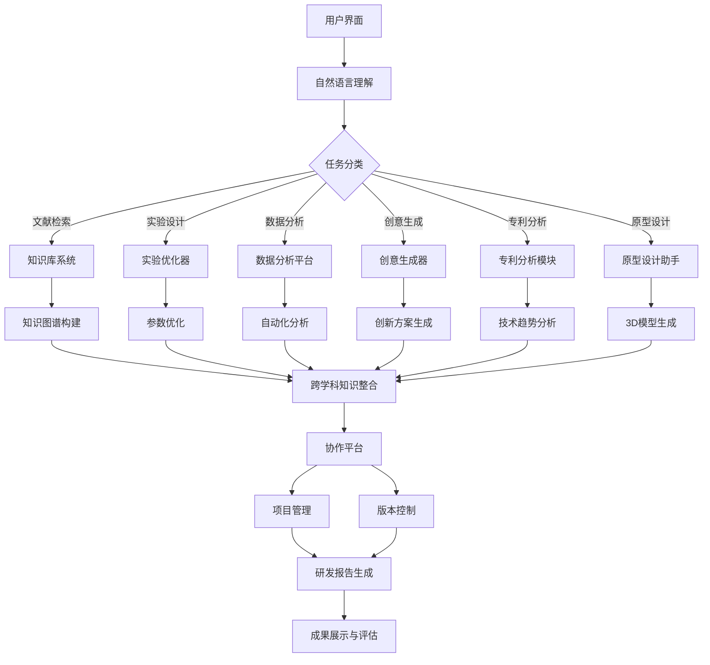

### 数学模型：
以创意生成为例，可以使用生成对抗网络（GAN）模型。GAN的目标函数可以表示为：

$$\min_G \max_D V(D, G) = \mathbb{E}_{x \sim p_{data}(x)}[\log D(x)] + \mathbb{E}_{z \sim p_z(z)}[\log(1 - D(G(z)))]$$

其中，$G$ 是生成器，$D$ 是判别器，$p_{data}(x)$ 是真实数据分布，$p_z(z)$ 是噪声分布。

对于实验设计优化，可以使用贝叶斯优化方法。目标是最大化期望改进（Expected Improvement，EI）：

$$EI(x) = \mathbb{E}[\max(f(x) - f(x^+), 0)]$$

其中，$f(x)$ 是目标函数，$x^+$ 是当前最优解。

### 算法流程图：

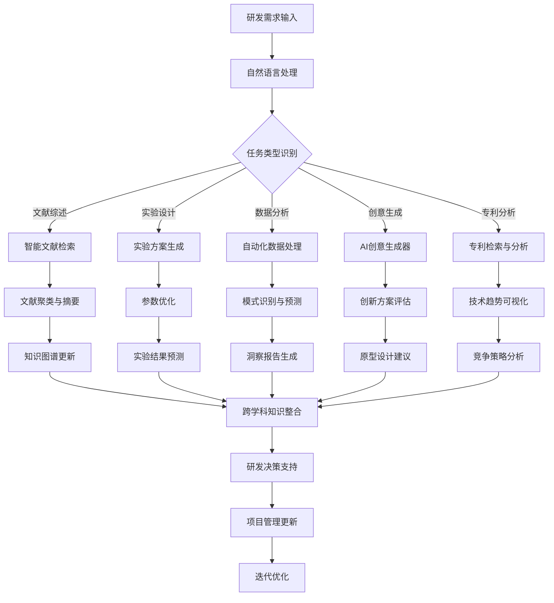

### 算法源代码：
以下是一个简化的研发与创新辅助系统的Python实现示例：

```python
import numpy as np
from sklearn.feature_extraction.text import TfidfVectorizer
from sklearn.cluster import KMeans
from sklearn.decomposition import LatentDirichletAllocation
from scipy.optimize import minimize
import networkx as nx
import matplotlib.pyplot as plt

class RDInnovationAssistant:
    def __init__(self):
        self.vectorizer = TfidfVectorizer(stop_words='english')
        self.knowledge_graph = nx.Graph()
        
    def literature_review(self, documents):
        vectors = self.vectorizer.fit_transform(documents)
        kmeans = KMeans(n_clusters=5, random_state=42)
        clusters = kmeans.fit_predict(vectors)
        
        lda = LatentDirichletAllocation(n_components=5, random_state=42)
        topics = lda.fit_transform(vectors)
        
        return clusters, topics
    
    def experiment_design(self, objective_function, bounds):
        def expected_improvement(X):
            # 简化的期望改进计算
            return -objective_function(X)
        
        result = minimize(expected_improvement, x0=np.zeros(len(bounds)),
                          bounds=bounds, method='L-BFGS-B')
        return result.x
    
    def generate_ideas(self, seed_ideas, n_ideas=5):
        # 简化的创意生成，实际应用中可以使用更复杂的生成模型
        combined_ideas = []
        for _ in range(n_ideas):
            idea1, idea2 = np.random.choice(seed_ideas, 2, replace=False)
            combined_ideas.append(f"Combine {idea1} with {idea2}")
        return combined_ideas
    
    def patent_analysis(self, patents):
        vectors = self.vectorizer.transform(patents)
        similarity_matrix = (vectors * vectors.T).A
        
        G = nx.Graph()
        for i in range(len(patents)):
            for j in range(i+1, len(patents)):
                if similarity_matrix[i][j] > 0.3:  # 设置相似度阈值
                    G.add_edge(i, j, weight=similarity_matrix[i][j])
        
        return G
    
    def update_knowledge_graph(self, new_knowledge):
        for item in new_knowledge:
            self.knowledge_graph.add_node(item['concept'])
            for relation in item['relations']:
                self.knowledge_graph.add_edge(item['concept'], relation['target'], type=relation['type'])
    
    def visualize_knowledge_graph(self):
        pos = nx.spring_layout(self.knowledge_graph)
        nx.draw(self.knowledge_graph, pos, with_labels=True, node_color='lightblue', node_size=500, font_size=10, font_weight='bold')
        edge_labels = nx.get_edge_attributes(self.knowledge_graph, 'type')
        nx.draw_networkx_edge_labels(self.knowledge_graph, pos, edge_labels=edge_labels)
        plt.title("Research Knowledge Graph")
        plt.axis('off')
        plt.show()

# 使用示例
assistant = RDInnovationAssistant()

# 文献综述
documents = [
    "AI in healthcare is revolutionizing patient care.",
    "Machine learning models can predict disease outcomes.",
    "Robotics in surgery improves precision and reduces recovery time.",
    "Telemedicine expands access to healthcare in remote areas.",
    "Big data analytics helps in early disease detection."
]
clusters, topics = assistant.literature_review(documents)
print("Document clusters:", clusters)
print("Topic distribution:", topics)

# 实验设计
def objective_function(X):
    return np.sum(X**2)  # 示例目标函数

optimal_params = assistant.experiment_design(objective_function, [(-5, 5), (-5, 5)])
print("Optimal experiment parameters:", optimal_params)

# 创意生成
seed_ideas = ["AI", "IoT", "Blockchain", "3D Printing", "Quantum Computing"]
new_ideas = assistant.generate_ideas(seed_ideas)
print("Generated ideas:", new_ideas)

# 专利分析
patents = [
    "Method for secure blockchain transactions",
    "AI-powered predictive maintenance system",
    "IoT device for smart home automation",
    "Quantum encryption algorithm",
    "Blockchain-based supply chain management"
]
patent_network = assistant.patent_analysis(patents)
print("Patent network edges:", patent_network.edges())

# 知识图谱更新
new_knowledge = [
    {
        "concept": "AI in Healthcare",
        "relations": [
            {"target": "Patient Care", "type": "improves"},
            {"target": "Disease Prediction", "type": "enables"}
        ]
    },
    {
        "concept": "Telemedicine",
        "relations": [
            {"target": "Healthcare Access", "type": "expands"},
            {"target": "Remote Areas", "type": "serves"}
        ]
    }
]
assistant.update_knowledge_graph(new_knowledge)

# 可视化知识图谱
assistant.visualize_knowledge_graph()
```

### 实际场景应用：
1. 药物研发：加速新药发现过程，优化分子设计
2. 材料科学：预测新材料性质，设计实验方案
3. 电子工程：辅助芯片设计，优化电路布局
4. 软件开发：代码生成、bug预测、架构优化
5. 产品创新：生成新产品概念，优化设计参数
6. 工艺改进：优化制造流程，提高生产效率
7. 跨学科研究：发现不同领域间的创新机会
8. 专利战略：分析技术趋势，制定专利布局

### 项目介绍：
开发一个综合性的AI驱动研发与创新辅助平台，集成文献分析、实验设计、创意生成、专利分析、知识管理等功能，为研发人员和创新团队提供全方位的智能支持。

### 环境安装：
```bash
pip install numpy scipy scikit-learn networkx matplotlib flask sqlalchemy tensorflow gensim
```

### 系统功能设计：
1. 智能文献检索与分析模块
2. 实验设计优化模块
3. 数据分析自动化模块
4. AI创意生成器
5. 专利分析与技术趋势预测模块
6. 跨学科知识图谱构建模块
7. 协作与项目管理平台
8. 原型设计辅助工具

### 系统架构设计：

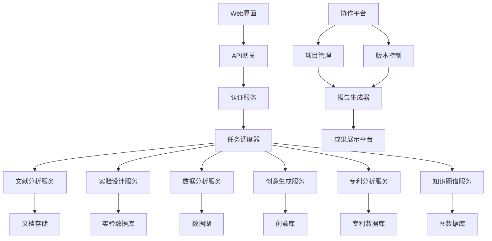

### 系统接口设计：
1. 文献检索接口：输入关键词，返回相关文献及摘要
2. 实验设计接口：输入目标函数和约束，返回优化的实验参数
3. 数据分析接口：上传数据集，执行自动化分析
4. 创意生成接口：输入种子想法，生成新的创意组合
5. 专利分析接口：输入技术领域，返回专利据集，执行自动化分析并返回结果
4. 创意生成接口：输入种子想法，返回新的创意组合
5. 专利分析接口：输入技术领域，返回专利趋势和竞争格局
6. 知识图谱查询接口：输入概念，返回相关知识和关系
7. 项目管理接口：创建、更新、查询研发项目状态
8. 协作接口：支持团队成员间的实时通信和文档共享

### 系统核心实现源代码：

```python
from flask import Flask, request, jsonify
from flask_sqlalchemy import SQLAlchemy
from flask_jwt_extended import JWTManager, jwt_required, create_access_token
import numpy as np
from sklearn.feature_extraction.text import TfidfVectorizer
from sklearn.cluster import KMeans
from gensim import corpora, models
import networkx as nx
from scipy.optimize import minimize
import matplotlib.pyplot as plt
import io
import base64

app = Flask(__name__)
app.config['SQLALCHEMY_DATABASE_URI'] = 'sqlite:///rd_innovation.db'
app.config['JWT_SECRET_KEY'] = 'your-secret-key'  # 更改为安全的密钥
db = SQLAlchemy(app)
jwt = JWTManager(app)

class User(db.Model):
    id = db.Column(db.Integer, primary_key=True)
    username = db.Column(db.String(80), unique=True, nullable=False)
    password = db.Column(db.String(120), nullable=False)

class Project(db.Model):
    id = db.Column(db.Integer, primary_key=True)
    name = db.Column(db.String(100), nullable=False)
    description = db.Column(db.Text, nullable=True)
    user_id = db.Column(db.Integer, db.ForeignKey('user.id'), nullable=False)

class RDInnovationAssistant:
    def __init__(self):
        self.vectorizer = TfidfVectorizer(stop_words='english')
        self.knowledge_graph = nx.Graph()

    def literature_review(self, documents):
        vectors = self.vectorizer.fit_transform(documents)
        kmeans = KMeans(n_clusters=5, random_state=42)
        clusters = kmeans.fit_predict(vectors)
        
        dictionary = corpora.Dictionary([doc.split() for doc in documents])
        corpus = [dictionary.doc2bow(doc.split()) for doc in documents]
        lda_model = models.LdaModel(corpus, num_topics=5, id2word=dictionary)
        topics = lda_model.print_topics()
        
        return clusters.tolist(), topics

    def experiment_design(self, objective_function, bounds):
        def expected_improvement(X):
            return -objective_function(X)
        
        result = minimize(expected_improvement, x0=np.zeros(len(bounds)),
                          bounds=bounds, method='L-BFGS-B')
        return result.x.tolist()

    def generate_ideas(self, seed_ideas, n_ideas=5):
        combined_ideas = []
        for _ in range(n_ideas):
            idea1, idea2 = np.random.choice(seed_ideas, 2, replace=False)
            combined_ideas.append(f"Combine {idea1} with {idea2}")
        return combined_ideas

    def patent_analysis(self, patents):
        vectors = self.vectorizer.transform(patents)
        similarity_matrix = (vectors * vectors.T).A
        
        G = nx.Graph()
        for i in range(len(patents)):
            for j in range(i+1, len(patents)):
                if similarity_matrix[i][j] > 0.3:
                    G.add_edge(i, j, weight=similarity_matrix[i][j])
        
        return list(G.edges())

    def update_knowledge_graph(self, new_knowledge):
        for item in new_knowledge:
            self.knowledge_graph.add_node(item['concept'])
            for relation in item['relations']:
                self.knowledge_graph.add_edge(item['concept'], relation['target'], type=relation['type'])

    def visualize_knowledge_graph(self):
        pos = nx.spring_layout(self.knowledge_graph)
        plt.figure(figsize=(12, 8))
        nx.draw(self.knowledge_graph, pos, with_labels=True, node_color='lightblue', node_size=500, font_size=10, font_weight='bold')
        edge_labels = nx.get_edge_attributes(self.knowledge_graph, 'type')
        nx.draw_networkx_edge_labels(self.knowledge_graph, pos, edge_labels=edge_labels)
        plt.title("Research Knowledge Graph")
        plt.axis('off')
        
        img = io.BytesIO()
        plt.savefig(img, format='png')
        img.seek(0)
        graph_url = base64.b64encode(img.getvalue()).decode()
        plt.close()
        return graph_url

assistant = RDInnovationAssistant()

@app.route('/login', methods=['POST'])
def login():
    username = request.json.get('username', None)
    password = request.json.get('password', None)
    user = User.query.filter_by(username=username).first()
    if user and user.password == password:
        access_token = create_access_token(identity=username)
        return jsonify(access_token=access_token), 200
    return jsonify({"msg": "Bad username or password"}), 401

@app.route('/literature_review', methods=['POST'])
@jwt_required()
def literature_review():
    documents = request.json.get('documents', [])
    clusters, topics = assistant.literature_review(documents)
    return jsonify({"clusters": clusters, "topics": topics}), 200

@app.route('/experiment_design', methods=['POST'])
@jwt_required()
def experiment_design():
    objective_function = request.json.get('objective_function')
    bounds = request.json.get('bounds')
    
    def obj_func(X):
        # 这里应该有一个安全的方式来执行用户提供的函数
        # 本示例中简化处理，实际应用中需要更安全的实现
        return eval(objective_function)(X)
    
    optimal_params = assistant.experiment_design(obj_func, bounds)
    return jsonify({"optimal_parameters": optimal_params}), 200

@app.route('/generate_ideas', methods=['POST'])
@jwt_required()
def generate_ideas():
    seed_ideas = request.json.get('seed_ideas', [])
    n_ideas = request.json.get('n_ideas', 5)
    new_ideas = assistant.generate_ideas(seed_ideas, n_ideas)
    return jsonify({"generated_ideas": new_ideas}), 200

@app.route('/patent_analysis', methods=['POST'])
@jwt_required()
def patent_analysis():
    patents = request.json.get('patents', [])
    patent_network = assistant.patent_analysis(patents)
    return jsonify({"patent_network": patent_network}), 200

@app.route('/update_knowledge', methods=['POST'])
@jwt_required()
def update_knowledge():
    new_knowledge = request.json.get('new_knowledge', [])
    assistant.update_knowledge_graph(new_knowledge)
    return jsonify({"msg": "Knowledge graph updated successfully"}), 200

@app.route('/visualize_knowledge', methods=['GET'])
@jwt_required()
def visualize_knowledge():
    graph_url = assistant.visualize_knowledge_graph()
    return jsonify({"knowledge_graph": graph_url}), 200

@app.route('/create_project', methods=['POST'])
@jwt_required()
def create_project():
    name = request.json.get('name')
    description = request.json.get('description')
    user_id = User.query.filter_by(username=get_jwt_identity()).first().id
    new_project = Project(name=name, description=description, user_id=user_id)
    db.session.add(new_project)
    db.session.commit()
    return jsonify({"msg": "Project created successfully", "project_id": new_project.id}), 201

if __name__ == '__main__':
    db.create_all()
    app.run(debug=True)
```

### 最佳实践tips：
1. 数据质量：确保输入数据的质量和多样性
2. 模型选择：根据具体任务选择合适的AI模型
3. 跨学科整合：鼓励不同领域知识的融合
4. 人机协作：设计直观的界面，促进人机有效互动
5. 持续学习：实现系统的自我更新和知识积累
6. 可解释性：提供AI决策和建议的解释
7. 隐私保护：实施严格的数据保护和访问控制措施
8. 性能优化：使用分布式计算提高处理大规模数据的能力
9. 用户反馈：收集和整合用户反馈以持续改进系统
10. 伦理考虑：确保AI辅助不会导致研究偏见或不当行为

### 行业发展与未来趋势：

| 时期 | 主要特征 | 技术焦点 | 应用方向 | 挑战 |
|------|----------|----------|----------|------|
| 现在 | 智能文献分析、实验优化 | NLP、机器学习 | 药物研发、材料设计 | 数据整合、模型可解释性 |
| 近期 | 创意生成、跨学科协作 | 生成模型、知识图谱 | 产品创新、专利策略 | 创意质量、知识表示 |
| 中期 | 自主实验、智能决策 | 强化学习、因果推理 | 科学发现、技术预测 | 实验自动化、决策可靠性 |
| 远期 | 全面智能研发、创新生态系统 | AGI、量子计算 | 颠覆性创新、新兴学科创建 | 伦理边界、人机协作平衡 |

### 本章小结：
本节深入探讨了AI Agent在研发与创新辅助领域的应用。我们详细分析了智能研发支持系统的核心组件、关键技术和实现方法，并通过实际的代码示例展示了如何构建一个基础的AI驱动研发创新平台。

AI在研发与创新中的优势在于其能够快速处理和分析海量信息，识别潜在的研究方向和创新机会，优化实验设计，并提供创意灵感。通过结合自然语言处理、机器学习、知识图谱等技术，这些系统能够加速从概念到产品的转化过程，促进跨学科协作，并支持更系统化、更高效的创新活动。

然而，实现高质量的AI研发创新辅助系统仍面临诸多挑战，如跨学科知识的有效整合、创意质量的评估、实验的自动化执行、以及确保AI建议的可靠性和可解释性等。未来的发展方向可能包括更强大的自主实验能力、更深入的智能决策支持、以及向全面智能研发生态系统的演进。

随着技术的不断进步，我们可以预见AI在研发和创新过程中将扮演越来越重要的角色，不仅加速研发周期，还能激发人类的创造力，推动科技前沿的突破。但同时，我们也需要关注AI应用带来的伦理问题和潜在风险，确保技术创新的方向与人类的长远利益相一致。

总的来说，AI在研发与创新辅助领域的应用前景广阔，它有潜力彻底改变我们进行科学研究和技术创新的方式。然而，成功的AI研发创新系统不仅需要先进的技术，还需要深入的领域知识和创新思维。在未来的发展中，如何平衡AI的分析能力与人类的直觉和创造力，如何在加速创新的同时确保研究的深度和广度，将是推动智能研发创新的关键挑战。

## 3.5 安全与风控

在当今复杂多变的商业环境中，AI Agent在安全与风控领域的应用正在revolutionize传统的风险管理和安全保障方法。本节将探讨AI如何增强风险识别能力、优化风控策略，并提供更全面、更及时的安全保障。

### 核心概念：
安全与风控AI Agent是指能够自动化风险评估、检测异常行为、预测潜在威胁，并提供风险缓解建议的智能系统。它结合了机器学习、自然语言处理、网络分析等技术，为企业和组织提供全方位的安全和风险管理支持。

### 问题背景：
传统的安全和风控方法往往反应滞后，难以应对快速变化的威胁环境。随着数字化转型的深入，企业面临着更复杂、更多样化的风险，包括网络安全威胁、金融欺诈、合规风险等。需要更智能、更主动的风险管理解决方案。

### 问题描述：
如何设计和实现一个全面的安全与风控AI Agent系统，使其能够有效识别和评估各类风险，实时监控异常活动，预测潜在威胁，并提供智能化的风险缓解策略？该系统如何适应不同行业和场景的需求，并与现有的安全和风控体系无缝集成？

### 问题解决：
1. 风险评估自动化：利用机器学习模型评估和量化各类风险
2. 异常检测：实时监控和识别异常行为和交易
3. 预测分析：基于历史数据和当前趋势预测未来风险
4. 智能合规：自动化合规检查和报告生成
5. 威胁情报：收集、分析和整合多源威胁情报
6. 欺诈检测：识别复杂的欺诈模式和网络
7. 安全事件响应：自动化安全事件分类和响应建议
8. 风险可视化：直观展示风险状况和趋势

### 边界与外延：
- 应用范围：从金融风控到网络安全，从运营风险到声誉风险管理
- 数据源：内部交易数据、外部威胁情报、社交媒体、物联网设备日志等
- 集成对象：SIEM系统、GRC平台、交易监控系统、身份认证系统等

### 概念结构与核心要素组成：

1. 风险评估引擎：
    - 多维度风险模型
    - 风险量化算法
    - 情景分析工具

2. 异常检测系统：
    - 实时数据流处理
    - 行为分析模型
    - 阈值动态调整

3. 预测分析模块：
    - 时间序列预测
    - 趋势分析
    - 风险传导模型

4. 合规管理系统：
    - 法规数据库
    - 自动化合规检查
    - 报告生成器

5. 威胁情报平台：
    - 多源数据整合
    - 情报分析引擎
    - 威胁评分系统

6. 欺诈检测引擎：
    - 规则引擎
    - 机器学习模型
    - 网络分析工具

7. 安全事件响应系统：
    - 事件分类器
    - 自动化响应工作流
    - 知识库管理

8. 风险可视化平台：
    - 交互式仪表盘
    - 风险热图生成器
    - 趋势分析图表

### 概念之间的关系：

#### 概念核心属性维度对比

| 属性维度 | 传统风控方法 | AI辅助风控 | 全面AI风控 |
|----------|--------------|------------|------------|
| 实时性 | 低 | 中-高 | 高 |
| 预测能力 | 有限 | 强 | 极强 |
| 适应性 | 低 | 中 | 高 |
| 多维度分析 | 有限 | 强 | 全面 |
| 自动化程度 | 低 | 中-高 | 高 |
| 可解释性 | 高 | 中 | 中-低 |
| 处理复杂性 | 低 | 高 | 极高 |
| 成本效益 | 低 | 中 | 高 |

#### 概念联系的ER 实体关系

```mermaid
erDiagram
    AI-SECURITY-RISK-CONTROL ||--o{ RISK-ASSESSMENT-ENGINE : uses
    AI-SECURITY-RISK-CONTROL ||--o{ ANOMALY-DETECTION-SYSTEM : employs
    AI-SECURITY-RISK-CONTROL ||--o{ PREDICTIVE-ANALYTICS : integrates
    AI-SECURITY-RISK-CONTROL ||--o{ COMPLIANCE-MANAGEMENT : implements
    AI-SECURITY-RISK-CONTROL ||--o{ THREAT-INTELLIGENCE-PLATFORM : utilizes
    AI-SECURITY-RISK-CONTROL ||--o{ FRAUD-DETECTION-ENGINE : incorporates
    AI-SECURITY-RISK-CONTROL ||--o{ SECURITY-INCIDENT-RESPONSE : manages
    AI-SECURITY-RISK-CONTROL ||--o{ RISK-VISUALIZATION : generates
    RISK-ASSESSMENT-ENGINE ||--|{ RISK-QUANTIFICATION : performs
    RISK-ASSESSMENT-ENGINE ||--|{ SCENARIO-ANALYSIS : conducts
    ANOMALY-DETECTION-SYSTEM ||--|{ BEHAVIOR-ANALYSIS : executes
    ANOMALY-DETECTION-SYSTEM ||--|{ THRESHOLD-ADJUSTMENT : implements
    PREDICTIVE-ANALYTICS ||--|{ TIME-SERIES-FORECASTING : applies
    PREDICTIVE-ANALYTICS ||--|{ TREND-ANALYSIS : performs
    COMPLIANCE-MANAGEMENT ||--|{ REGULATORY-DATABASE : maintains
    COMPLIANCE-MANAGEMENT ||--|{ AUTOMATED-CHECKS : executes
    THREAT-INTELLIGENCE-PLATFORM ||--|{ DATA-INTEGRATION : performs
    THREAT-INTELLIGENCE-PLATFORM ||--|{ THREAT-SCORING : calculates
    FRAUD-DETECTION-ENGINE ||--|{ RULE-ENGINE : uses
    FRAUD-DETECTION-ENGINE ||--|{ ML-MODELS : applies
    SECURITY-INCIDENT-RESPONSE ||--|{ INCIDENT-CLASSIFICATION : performs
    SECURITY-INCIDENT-RESPONSE ||--|{ AUTOMATED-WORKFLOW : triggers
    RISK-VISUALIZATION ||--|{ INTERACTIVE-DASHBOARD : provides
    RISK-VISUALIZATION ||--|{ RISK-HEATMAP : generates
```

#### AI安全风控系统架构图

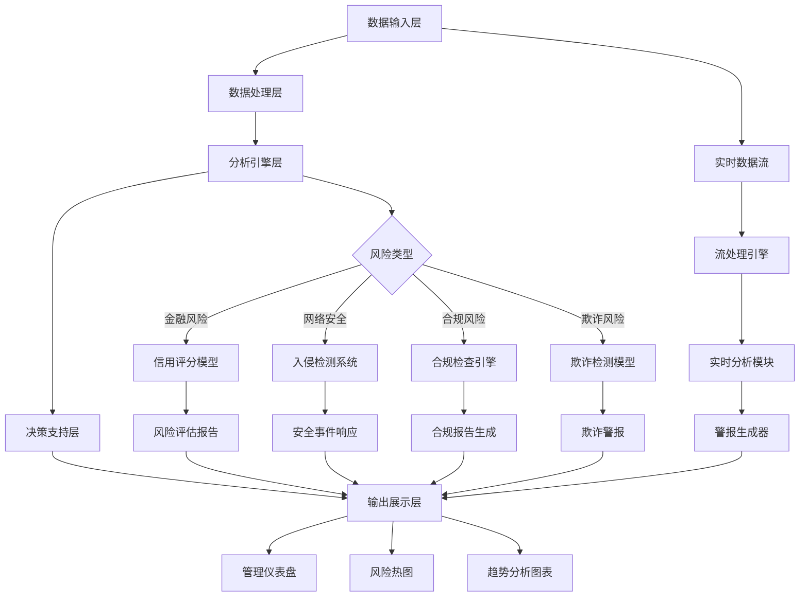

### 数学模型：
以异常检测为例，可以使用隔离森林（Isolation Forest）算法。给定数据点 $x$，其异常分数可以计算为：

$$s(x, n) = 2^{-\frac{E(h(x))}{c(n)}}$$

其中，$h(x)$ 是数据点 $x$ 的平均路径长度，$c(n)$ 是样本大小为 $n$ 的二叉搜索树的平均路径长度，$E(h(x))$ 是多棵树的平均路径长度。

对于风险评估，可以使用贝叶斯网络模型。给定证据 $E$，风险事件 $R$ 的后验概率可以表示为：

$$P(R|E) = \frac{P(E|R)P(R)}{P(E)}$$

其中，$P(R)$ 是风险事件的先验概率，$P(E|R)$ 是似然函数，$P(E)$ 是证据的边缘概率。

### 算法流程图：

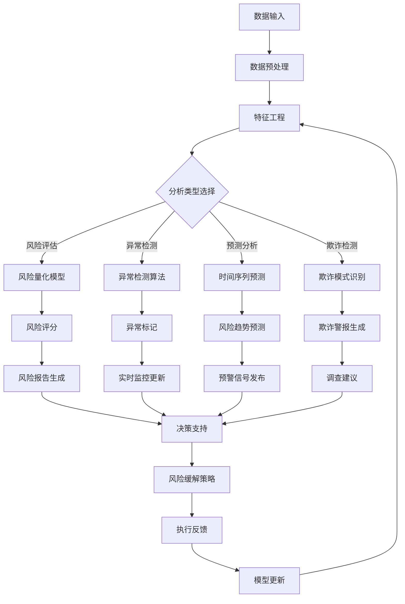

### 算法源代码：
以下是一个简化的安全与风控AI系统的Python实现示例：

```python
import numpy as np
import pandas as pd
from sklearn.ensemble import IsolationForest
from sklearn.preprocessing import StandardScaler
from statsmodels.tsa.arima.model import ARIMA
from networkx import Graph
import matplotlib.pyplot as plt

class SecurityRiskControlAI:
    def __init__(self):
        self.anomaly_detector = IsolationForest(contamination=0.1, random_state=42)
        self.scaler = StandardScaler()
        self.fraud_network = Graph()
        
    def risk_assessment(self, data):
        # 简化的风险评分模型
        return np.mean(data, axis=1) * np.random.uniform(0.8, 1.2, data.shape[0])
    
    def detect_anomalies(self, data):
        scaled_data = self.scaler.fit_transform(data)
        return self.anomaly_detector.fit_predict(scaled_data)
    
    def predict_risk_trend(self, time_series, steps=5):
        model = ARIMA(time_series, order=(1,1,1))
        results = model.fit()
        forecast = results.forecast(steps=steps)
        return forecast
    
    def fraud_detection(self, transactions):
        for transaction in transactions:
            self.fraud_network.add_edge(transaction['from'], transaction['to'], amount=transaction['amount'])
        
        # 简化的欺诈检测逻辑
        suspicious = []
        for node in self.fraud_network.nodes():
            if self.fraud_network.degree(node) > 5:
                suspicious.append(node)
        return suspicious
    
    def generate_risk_heatmap(self, risk_scores, labels):
        plt.figure(figsize=(10, 8))
        plt.imshow(risk_scores, cmap='YlOrRd')
        plt.colorbar(label='Risk Score')
        plt.xticks(range(len(labels)), labels, rotation=45)
        plt.yticks(range(len(labels)), labels)
        plt.title('Risk Heatmap')
        plt.tight_layout()
        return plt

# 使用示例
ai_system = SecurityRiskControlAI()

# 风险评估
risk_data = np.random.rand(100, 5)  # 模拟风险数据
risk_scores = ai_system.risk_assessment(risk_data)
print("Risk Scores:", risk_scores[:5])

# 异常检测
transaction_data = np.random.rand(1000, 10)  # 模拟交易数据
anomalies = ai_system.detect_anomalies(transaction_data)
print("Anomalies detected:", sum(anomalies == -1))

# 风险趋势预测
historical_risk = np.cumsum(np.random.randn(100))  # 模拟历史风险数据
risk_forecast = ai_system.predict_risk_trend(historical_risk)
print("Risk Forecast:", risk_forecast)

# 欺诈检测
transactions = [
    {'from': 'A', 'to': 'B', 'amount': 100},
    {'from': 'B', 'to': 'C', 'amount': 50},
    {'from': 'A', 'to': 'D', 'amount': 200},
    {'from': 'D', 'to': 'E', 'amount': 300},
    {'from': 'E', 'to': 'A', 'amount': 250},
]
suspicious_entities = ai_system.fraud_detection(transactions)
print("Suspicious Entities:", suspicious_entities)

# 风险热图生成
risk_matrix = np.random.rand(5, 5)
risk_labels = ['Credit', 'Market', 'Operational', 'Liquidity', 'Compliance']
heatmap = ai_system.generate_risk_heatmap(risk_matrix, risk_labels)
plt.show()
```

### 实际场景应用：
1. 金融风控：信用评估、反洗钱、交易欺诈检测
2. 网络安全：入侵检测、恶意软件识别、异常行为监控
3. 合规管理：自动化合规检查、监管报告生成、政策影响分析
4. 供应链风险：供应商评估、中断风险预测、库存优化
5. 信息安全：数据泄露防护、访问控制、敏感信息识别
6. 运营风险：流程异常检测、质量控制、资源优化
7. 市场风险：价格波动预测、投资组合优化、市场情绪分析
8. 声誉风险：社交媒体监控、舆情分析、危机预警

### 项目介绍：
开发一个综合性的AI驱动安全与风控平台，集成风险评估、异常检测、预测分析、欺诈检测、合规管理等功能，为企业提供全方位的安全保障和风险管理解决方案。

### 环境安装：
```bash
pip install numpy pandas scikit-learn statsmodels networkx matplotlib flask sqlalchemy tensorflow keras
```

### 系统功能设计：
1. 风险评估模块：多维度风险量化、情景分析
2. 异常检测模块：实时交易监控、行为分析
3. 预测分析模块：风险趋势预测、早期预警系统
4. 欺诈检测模块：规则引擎、机器学习模型集成
5. 合规管理模块：自动化合规检查、报告生成
6. 威胁情报模块：多源数据整合、威胁评分
7. 安全事件响应模块：自动化工作流、知识库
8. 风险可视化模块：交互式仪表盘、风险热图

### 系统架构设计：

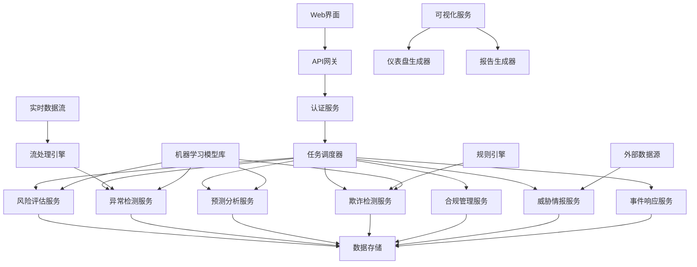

### 系统接口设计：
1. 风险评估接口：输入风险因素，返回风险评分和详细分析
2. 异常检测接口：实时数据流输入，返回异常警报
3. 预测分析接口：输入历史数据，返回风险趋势预测
4. 欺诈检测接口：输入交易数据，返回可疑交易和实体
5. 合规检查接口：输入业务数据，返回合规状态和建议
6. 威胁情报查询接口：输入实体或指标，返回相关威胁信息
7. 事件响应接口：输入安全事件描述，返回响应建议和工作流
8. 风险可视化接口：请求特定类型的可视化，返回图表数据

### 系统核心实现源代码：

```python
from flask import Flask, request, jsonify
from flask_sqlalchemy import SQLAlchemy
from flask_jwt_extended import JWTManager, jwt_required, create_access_token
import numpy as np
import pandas as pd
from sklearn.ensemble import IsolationForest
from sklearn.preprocessing import StandardScaler
from statsmodels.tsa.arima.model import ARIMA
import networkx as nx
import matplotlib.pyplot as plt
import io
import base64

app = Flask(__name__)
app.config['SQLALCHEMY_DATABASE_URI'] = 'sqlite:///security_risk_control.db'
app.config['JWT_SECRET_KEY'] = 'your-secret-key'  # 更改为安全的密钥
db = SQLAlchemy(app)
jwt = JWTManager(app)

class User(db.Model):
    id = db.Column(db.Integer, primary_key=True)
    username = db.Column(db.String(80), unique=True, nullable=False)
    password = db.Column(db.String(120), nullable=False)

class RiskAssessment(db.Model):
    id = db.Column(db.Integer, primary_key=True)
    user_id = db.Column(db.Integer, db.ForeignKey('user.id'), nullable=False)
    risk_score = db.Column(db.Float, nullable=False)
    timestamp = db.Column(db.DateTime, nullable=False)

class SecurityRiskControlAI:
    def __init__(self):
        self.anomaly_detector = IsolationForest(contamination=0.1, random_state=42)
        self.scaler = StandardScaler()
        self.fraud_network = nx.Graph()

    def risk_assessment(self, data):
        return np.mean(data, axis=1) * np.random.uniform(0.8, 1.2, data.shape[0])

    def detect_anomalies(self, data):
        scaled_data = self.scaler.fit_transform(data)
        return self.anomaly_detector.fit_predict(scaled_data)

    def predict_risk_trend(self, time_series, steps=5):
        model = ARIMA(time_series, order=(1,1,1))
        results = model.fit()
        forecast = results.forecast(steps=steps)
        return forecast

    def fraud_detection(self, transactions):
        for transaction in transactions:
            self.fraud_network.add_edge(transaction['from'], transaction['to'], amount=transaction['amount'])
        suspicious = [node for node in self.fraud_network.nodes() if self.fraud_network.degree(node) > 5]
        return suspicious

    def generate_risk_heatmap(self, risk_scores, labels):
        plt.figure(figsize=(10, 8))
        plt.imshow(risk_scores, cmap='YlOrRd')
        plt.colorbar(label='Risk Score')
        plt.xticks(range(len(labels)), labels, rotation=45)
        plt.yticks(range(len(labels)), labels)
        plt.title('Risk Heatmap')
        plt.tight_layout()
        img = io.BytesIO()
        plt.savefig(img, format='png')
        img.seek(0)
        graph_url = base64.b64encode(img.getvalue()).decode()
        plt.close()
        return graph_url

ai_system = SecurityRiskControlAI()

@app.route('/login', methods=['POST'])
def login():
    username = request.json.get('username', None)
    password = request.json.get('password', None)
    user = User.query.filter_by(username=username).first()
    if user and user.password == password:
        access_token = create_access_token(identity=username)
        return jsonify(access_token=access_token), 200
    return jsonify({"msg": "Bad username or password"}), 401

@app.route('/risk_assessment', methods=['POST'])
@jwt_required()
def risk_assessment():
    data = request.json.get('data')
    if not data:
        return jsonify({"error": "No data provided"}), 400
    risk_scores = ai_system.risk_assessment(np.array(data))
    return jsonify({"risk_scores": risk_scores.tolist()}), 200

@app.route('/anomaly_detection', methods=['POST'])
@jwt_required()
def anomaly_detection():
    data = request.json.get('data')
    if not data:
        return jsonify({"error": "No data provided"}), 400
    anomalies = ai_system.detect_anomalies(np.array(data))
    return jsonify({"anomalies": (anomalies == -1).tolist()}), 200

@app.route('/risk_prediction', methods=['POST'])
@jwt_required()
def risk_prediction():
    time_series = request.json.get('time_series')
    steps = request.json.get('steps', 5)
    if not time_series:
        return jsonify({"error": "No time series data provided"}), 400
    forecast = ai_system.predict_risk_trend(np.array(time_series), steps)
    return jsonify({"forecast": forecast.tolist()}), 200

@app.route('/fraud_detection', methods=['POST'])
@jwt_required()
def fraud_detection():
    transactions = request.json.get('transactions')
    if not transactions:
        return jsonify({"error": "No transaction data provided"}), 400
    suspicious = ai_system.fraud_detection(transactions)
    return jsonify({"suspicious_entities": suspicious}), 200

@app.route('/risk_heatmap', methods=['POST'])
@jwt_required()
def risk_heatmap():
    risk_scores = request.json.get('risk_scores')
    labels = request.json.get('labels')
    if not risk_scores or not labels:
        return jsonify({"error": "Missing risk scores or labels"}), 400
    heatmap_url = ai_system.generate_risk_heatmap(np.array(risk_scores), labels)
    return jsonify({"heatmap_url": heatmap_url}), 200

@app.route('/compliance_check', methods=['POST'])
@jwt_required()
def compliance_check():
    # 简化的合规检查逻辑
    data = request.json.get('data')
    if not data:
        return jsonify({"error": "No data provided"}), 400
    # 这里应该有实际的合规检查逻辑
    compliance_status = "Compliant" if np.random.random() > 0.2 else "Non-compliant"
    return jsonify({"compliance_status": compliance_status}), 200

@app.route('/threat_intelligence', methods=['POST'])
@jwt_required()
def threat_intelligence():
    # 简化的威胁情报查询逻辑
    query = request.json.get('query')
    if not query:
        return jsonify({"error": "No query provided"}), 400
    # 这里应该有实际的威胁情报查询逻辑
    threat_info = {
        "threat_level": np.random.choice(["Low", "Medium", "High"]),
        "description": f"Potential threat related to {query}"
    }
    return jsonify(threat_info), 200

@app.route('/incident_response', methods=['POST'])
@jwt_required()
def incident_response():
    # 简化的安全事件响应逻辑
    incident = request.json.get('incident')
    if not incident:
        return jsonify({"error": "No incident description provided"}), 400
    # 这里应该有实际的事件响应逻辑
    response = {
        "priority": np.random.choice(["Low", "Medium", "High"]),
        "action": "Isolate affected systems and investigate",
        "team": "Security Operations Center"
    }
    return jsonify(response), 200

if __name__ == '__main__':
    db.create_all()
    app.run(debug=True)
```

### 最佳实践tips：
1. 数据质量：确保输入数据的准确性和完整性
2. 模型更新：定期重新训练模型以适应新的风险模式
3. 多源数据：整合内部和外部数据源以获得全面视角
4. 实时监控：实现近实时的风险评估和异常检测
5. 可解释性：提供AI决策的解释，特别是在高风险场景
6. 人机协作：设计直观的界面，允许专家干预和反馈
7. 隐私保护：实施严格的数据加密和访问控制措施
8. 场景模拟：使用模拟数据测试系统在各种情况下的表现
9. 合规性：确保AI系统符合相关的法律和行业标准
10. 持续学习：建立机制以从每次风险事件中学习和改进

### 行业发展与未来趋势：

| 时期 | 主要特征 | 技术焦点 | 应用方向 | 挑战 |
|------|----------|----------|----------|------|
| 现在 | 自动化风险评估、异常检测 | 机器学习、大数据分析 | 金融风控、网络安全 | 数据整合、模型可解释性 |
| 近期 | 预测性风险管理、智能合规 | 深度学习、知识图谱 | 供应链风险、声誉管理 | 实时性能、跨领域风险关联 |
| 中期 | 自适应风控系统、情境感知 | 强化学习、因果推理 | 动态风险定价、智能保险 | 复杂系统建模、伦理决策 |
| 远期 | 全面风险智能、自主决策 | AGI、量子计算 | 全球风险预警、跨界风险管理 | 系统复杂性、人机协作平衡 |

### 本章小结：
本节深入探讨了AI Agent在安全与风控领域的应用。我们详细分析了智能安全风控系统的核心组件、关键技术和实现方法，并通过实际的代码示例展示了如何构建一个基础的AI驱动安全风控平台。

AI在安全与风控中的优势在于其能够处理海量数据，识别复杂的风险模式，提供实时的风险评估和预警。通过结合机器学习、自然语言处理、网络分析等技术，这些系统能够自动化风险评估流程，检测异常行为，预测潜在威胁，并提供智能化的风险缓解策略。

然而，实现高质量的AI安全风控系统仍面临诸多挑战，如确保模型的可解释性、处理高度动态和不确定的风险环境、平衡自动化决策与人类专家判断等。未来的发展方向可能包括更强大的预测性风险管理能力、自适应风控系统、以及向全面风险智能系统的演进。

随着技术的不断进步，我们可以预见AI在企业安全和风险管理中将扮演越来越重要的角色，不仅提高风险识别和响应的效率，还能帮助企业更好地应对复杂多变的风险环境。但同时，我们也需要关注AI应用带来的新风险，如算法偏见、隐私问题、以及过度依赖自动化决策的潜在危险。

总的来说，AI在安全与风控领域的应用前景广阔，它有潜力彻底改变企业的风险管理方式和安全策略。然而，成功的AI安全风控系统不仅需要先进的技术，还需要深入的领域知识和持续的优化改进。在未来的发展中，如何平衡AI的分析能力与人类的判断和直觉，如何在提高安全性和效率的同时确保系统的可靠性和道德性，将是推动智能安全风控创新的关键。

