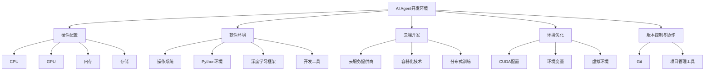
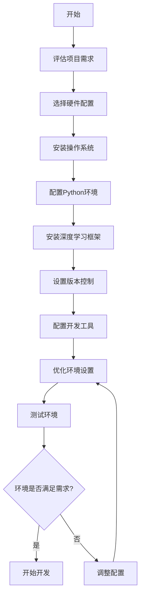
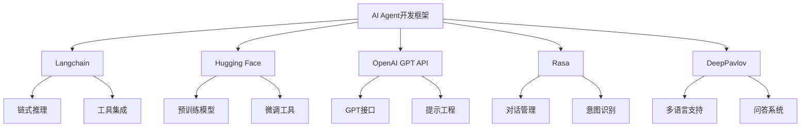
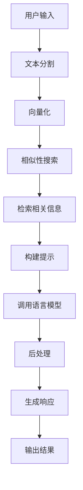
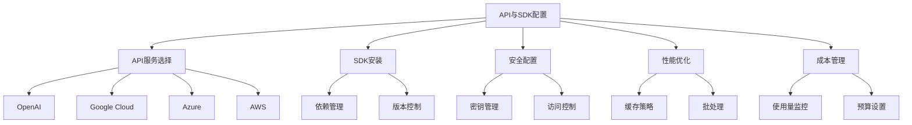
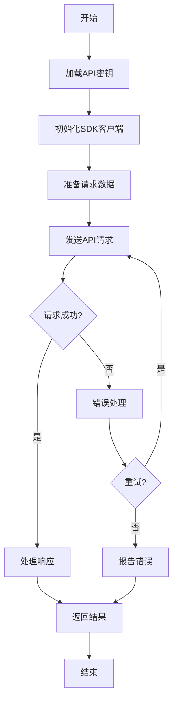
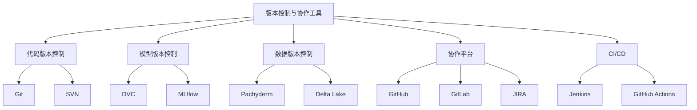
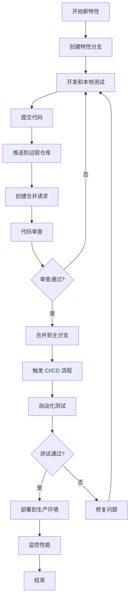

# 第二部分：AI Agent 开发基础

# 第4章：AI Agent 开发环境搭建

## 4.1 硬件与软件需求

### 核心概念

AI Agent 开发环境搭建涉及配置适当的硬件和软件资源，以支持大规模语言模型的训练、微调和部署。合适的开发环境对于提高开发效率、优化模型性能至关重要。

### 问题背景

随着 AI Agent 复杂度的增加和大语言模型规模的扩大，开发环境的要求也随之提高。选择合适的硬件和软件配置不仅影响开发效率，还直接关系到模型的训练速度和推理性能。

### 问题描述

1. 如何选择适合 AI Agent 开发的硬件配置
2. 开发所需的关键软件和框架
3. 本地开发环境 vs 云端开发环境的权衡
4. 如何优化开发环境以提高效率
5. 开发环境的可扩展性和未来升级路径

### 问题解决

我们将从以下几个方面详细探讨 AI Agent 开发环境的搭建：

1. 硬件配置：
    - CPU 选择
    - GPU 配置
    - 内存需求
    - 存储解决方案

2. 软件环境：
    - 操作系统选择
    - Python 环境设置
    - 深度学习框架（如 PyTorch, TensorFlow）
    - 大语言模型库（如 Hugging Face Transformers）
    - 开发工具和 IDE

3. 云端开发环境：
    - 主流云服务提供商比较（AWS, Google Cloud, Azure）
    - 容器化技术（Docker, Kubernetes）
    - 分布式训练配置

4. 开发环境优化：
    - CUDA 和 cuDNN 配置
    - 环境变量设置
    - 虚拟环境管理

5. 版本控制和协作工具：
    - Git 和 GitHub/GitLab
    - 项目管理工具（如 JIRA, Trello）

### 边界与外延

虽然本节主要关注基于大语言模型的 AI Agent 开发环境，但许多原则也适用于其他类型的 AI 项目。此外，我们还将简要讨论开发环境的安全性和数据隐私保护措施。

### 概念结构与核心要素组成



### 概念之间的关系

| 组件 | 主要功能 | 选择考虑因素 | 与其他组件的关系 |
|------|---------|--------------|------------------|
| CPU | 通用计算、数据预处理 | 核心数、频率、缓存 | 与 GPU 协同工作 |
| GPU | 并行计算、模型训练 | CUDA 核心数、显存大小 | 影响训练速度和模型规模 |
| 内存 | 数据加载、中间结果存储 | 容量、速度 | 影响数据处理效率 |
| 存储 | 数据集和模型存储 | 容量、读写速度 | 影响数据加载和模型保存效率 |
| 操作系统 | 提供基础运行环境 | 兼容性、稳定性 | 影响软件安装和配置 |
| 深度学习框架 | 模型构建和训练 | 易用性、性能、社区支持 | 与 Python 环境和 GPU 驱动相关 |
| 云服务 | 提供可扩展计算资源 | 成本、性能、服务种类 | 可替代或补充本地开发环境 |

### 算法流程图

AI Agent 开发环境搭建流程：



### 算法源代码

以下是一个 Python 脚本，用于检查和设置 AI Agent 开发环境：

```python
import sys
import subprocess
import pkg_resources

def check_python_version():
    if sys.version_info < (3, 7):
        print("警告：Python 版本应不低于 3.7")
    else:
        print(f"Python 版本: {sys.version}")

def check_gpu():
    try:
        import torch
        print(f"PyTorch 版本: {torch.__version__}")
        print(f"CUDA 是否可用: {torch.cuda.is_available()}")
        if torch.cuda.is_available():
            print(f"CUDA 版本: {torch.version.cuda}")
            print(f"GPU 型号: {torch.cuda.get_device_name(0)}")
    except ImportError:
        print("未安装 PyTorch")

def check_required_packages():
    required_packages = [
        'numpy',
        'pandas',
        'scikit-learn',
        'transformers',
        'tensorboard',
    ]
    for package in required_packages:
        try:
            version = pkg_resources.get_distribution(package).version
            print(f"{package} 版本: {version}")
        except pkg_resources.DistributionNotFound:
            print(f"警告：未安装 {package}")

def setup_virtual_env():
    subprocess.run(["python", "-m", "venv", "ai_agent_env"])
    print("虚拟环境 'ai_agent_env' 已创建")

def main():
    print("检查 AI Agent 开发环境...")
    check_python_version()
    check_gpu()
    check_required_packages()
    
    setup = input("是否要设置新的虚拟环境？(y/n): ")
    if setup.lower() == 'y':
        setup_virtual_env()

if __name__ == "__main__":
    main()
```

### 实际场景应用

1. 本地开发环境：
    - 个人项目或小型团队开发
    - 原型设计和初步实验

2. 云端开发环境：
    - 大规模模型训练
    - 分布式计算任务
    - 团队协作项目

3. 混合环境：
    - 本地进行开发和小规模实验
    - 云端进行大规模训练和部署

4. 专用 AI 开发工作站：
    - 高性能计算需求
    - 需要本地数据处理的场景

5. 容器化开发环境：
    - 确保环境一致性
    - 简化部署和扩展

### 最佳实践 tips

1. 硬件选择：
    - 优先选择支持 CUDA 的 NVIDIA GPU
    - 考虑 CPU 与 GPU 的平衡，避免瓶颈
    - 选择高速 SSD 作为主存储，提高数据读写速度

2. 软件配置：
    - 使用 Anaconda 或 virtualenv 管理 Python 环境
    - 定期更新深度学习框架和相关库
    - 配置 CUDA 和 cuDNN 以优化 GPU 性能

3. 云端资源利用：
    - 利用 spot 实例降低成本
    - 使用自动扩展功能应对负载变化
    - 注意数据传输和存储成本

4. 开发工具选择：
    - 使用支持远程开发的 IDE（如 VSCode 或 PyCharm Professional）
    - 配置代码自动格式化工具（如 Black）
    - 使用 Jupyter Notebook 进行交互式开发和实验

5. 版本控制：
    - 使用 Git 进行代码版本管理
    - 采用分支策略（如 Git Flow）管理开发流程
    - 利用 Git LFS 管理大文件和模型

6. 环境文档化：
    - 使用 requirements.txt 或 environment.yml 记录依赖
    - 编写详细的环境搭建文档
    - 考虑使用 Docker 容器化整个开发环境

7. 性能监控：
    - 使用 NVIDIA-SMI 或 GPU-Z 监控 GPU 使用情况
    - 配置 TensorBoard 可视化训练过程
    - 使用性能分析工具（如 cProfile, py-spy）优化代码

8. 安全性考虑：
    - 加密敏感数据和模型文件
    - 使用 VPN 或专用网络进行远程访问
    - 定期更新和补丁系统和软件

### 行业发展与未来趋势

| 时期 | 主要特征 | 关键技术 | 挑战 | 未来展望 |
|------|---------|----------|------|----------|
| 2018-2019 | 本地 GPU 工作站为主 | CUDA, Docker | 硬件成本高 | 云端开发普及 |
| 2020-2021 | 云端开发兴起 | Kubernetes, Jupyter Hub | 数据安全性 | 混合云方案 |
| 2022-2023 | 大规模分布式训练 | Horovod, DeepSpeed | 训练效率 | 自动化环境配置 |
| 2024-2025 (预测) | AI 专用硬件普及 | TPU, NPU | 兼容性 | 智能化开发环境 |
| 2026+ (展望) | 量子计算应用 | 量子机器学习 | 技术成熟度 | 革命性计算范式 |

AI Agent 开发环境正在经历快速的演变。从早期以本地 GPU 工作站为主的开发模式，逐渐向云端和分布式环境过渡。这种转变不仅提高了资源利用效率，也为团队协作和大规模模型训练提供了更好的支持。

未来的 AI Agent 开发环境可能会更加注重以下几个方面：

1. 自动化和智能化：
    - 自动环境配置和优化
    - 智能资源分配和调度
    - 自适应计算能力

2. 可持续性：
    - 能源效率更高的硬件
    - 碳足迹跟踪和优化
    - 绿色 AI 开发实践

3. 安全性和隐私：
    - 联邦学习支持
    - 差分隐私技术集成
    - 端到端加密开发环境

4. 跨平台兼容性：
    - 支持多种硬件加速器（GPU, TPU, NPU 等）
    - 跨云平台的一致性开发体验
    - 移动和边缘设备的开发支持

5. 协作和知识共享：
    - 增强的版本控制和代码审查工具
    - 集成的文档和知识管理系统
    - 实时协作编程环境

6. 可解释性和可视化：
    - 高级模型解释工具
    - 交互式训练过程可视化
    - 决策过程追踪和分析

7. 法规遵从：
    - 内置的合规性检查工具
    - 数据治理和审计跟踪
    - 模型公平性评估框架

随着 AI 技术的不断进步和应用范围的扩大，开发环境的重要性将进一步凸显。一个良好的开发环境不仅能够提高开发效率，还能确保 AI Agent 的质量、安全性和可靠性。因此，持续优化和升级开发环境将成为 AI 工程实践中的重要组成部分。

同时，我们也需要关注开发环境的标准化和最佳实践的形成。这将有助于降低入门门槛，促进知识共享，并推动整个 AI 生态系统的健康发展。随着更多专业人士和组织参与到 AI Agent 的开发中，我们可以期待看到更多创新的开发工具和方法论的出现，进一步推动 AI 技术的普及和应用。

## 4.2 开发框架选择（如 Langchain、Hugging Face）

### 核心概念

AI Agent 开发框架是一套工具和库的集合，旨在简化和加速基于大语言模型的 AI Agent 的开发过程。主流框架如 Langchain 和 Hugging Face Transformers 提供了丰富的功能和预训练模型，使开发者能够更容易地构建复杂的 AI 应用。

### 问题背景

随着大语言模型的快速发展，直接使用原始模型进行开发变得越来越复杂。开发框架的出现大大降低了入门门槛，提高了开发效率，但同时也带来了框架选择的问题。

### 问题描述

1. 主流 AI Agent 开发框架的功能对比
2. 不同框架的优势和局限性
3. 如何根据项目需求选择合适的框架
4. 框架的学习曲线和社区支持
5. 框架的可扩展性和自定义能力

### 问题解决

我们将详细比较以下主流开发框架：

1. Langchain
2. Hugging Face Transformers
3. OpenAI GPT API
4. Rasa
5. DeepPavlov

对于每个框架，我们将从以下几个方面进行分析：

- 核心功能
- 易用性
- 性能
- 可扩展性
- 社区支持
- 适用场景

### 边界与外延

虽然本节主要关注基于大语言模型的 AI Agent 开发框架，但也会涉及一些通用的 NLP 和对话系统框架。此外，我们还将讨论这些框架与其他 AI 技术（如计算机视觉、语音识别）的集成能力。

### 概念结构与核心要素组成



### 概念之间的关系

| 框架 | 核心优势 | 主要应用场景 | 与其他框架的关系 |
|------|---------|--------------|------------------|
| Langchain | 链式推理、工具集成 | 复杂任务分解、多模态交互 | 可与 Hugging Face 模型集成 |
| Hugging Face | 丰富的预训练模型、易用的 API | 文本分类、命名实体识别、文本生成 | 为其他框架提供模型支持 |
| OpenAI GPT API | 强大的语言生成能力、简单的 API | 对话系统、内容生成 | 可与 Langchain 结合使用 |
| Rasa | 开源对话管理、意图识别 | 任务型对话系统、客户服务机器人 | 可集成外部 NLU 模型 |
| DeepPavlov | 多语言支持、问答系统 | 开放域对话、信息检索 | 可与 Hugging Face 模型兼容 |

### 算法流程图

使用 Langchain 构建 AI Agent 的典型流程：



### 算法源代码

以下是使用 Langchain 构建简单 QA 系统的示例代码：

```python
from langchain.llms import OpenAI
from langchain.chains.question_answering import load_qa_chain
from langchain.document_loaders import TextLoader
from langchain.indexes import VectorstoreIndexCreator

# 加载文档
loader = TextLoader('data.txt')
index = VectorstoreIndexCreator().from_loaders([loader])

# 初始化 OpenAI 模型
llm = OpenAI(temperature=0)

# 创建问答链
chain = load_qa_chain(llm, chain_type="stuff")

# 用户查询
query = "What is the capital of France?"

# 检索相关文档并生成答案
docs = index.vectorstore.similarity_search(query)
response = chain.run(input_documents=docs, question=query)

print(response)
```

### 实际场景应用

1. Langchain：
    - 多步骤任务规划和执行
    - 集成外部工具和 API 的复杂 AI 助手

2. Hugging Face Transformers：
    - 文本分类和情感分析系统
    - 多语言机器翻译服务

3. OpenAI GPT API：
    - 创意写作助手
    - 智能客服对话系统

4. Rasa：
    - 企业级客户服务聊天机器人
    - 多轮对话管理系统

5. DeepPavlov：
    - 开放域问答系统
    - 多语言信息检索服务

### 最佳实践 tips

1. 框架选择：
    - 根据项目需求和团队技能选择合适的框架
    - 考虑框架的长期维护和社区活跃度

2. 性能优化：
    - 使用框架提供的缓存和批处理功能
    - 针对特定任务微调预训练模型

3. 安全性：
    - 实施输入验证和输出过滤
    - 使用框架提供的安全特性（如 API 密钥管理）

4. 可扩展性：
    - 设计模块化的架构，便于扩展
    - 利用框架的插件系统或自定义组件

5. 测试和监控：
    - 编写单元测试和集成测试
    - 使用框架提供的日志和监控工具

6. 持续学习：
    - 关注框架的更新和新特性
    - 参与社区讨论和贡献

7. 伦理考虑：
    - 使用框架提供的偏见检测工具
    - 实施透明度和可解释性措施

### 行业发展与未来趋势

| 时期 | 主要特征 | 代表框架 | 关键技术 | 未来展望 |
|------|---------|----------|----------|----------|
| 2018-2019 | 基础 NLP 工具集 | NLTK, SpaCy | 词向量、命名实体识别 | 更易用的高级框架 |
| 2020-2021 | 预训练模型框架 | Hugging Face Transformers | BERT、GPT | 大规模模型应用 |
| 2022-2023 | AI Agent 专用框架 | Langchain, AutoGPT | 链式推理、工具集成 | 更智能的任务规划 |
| 2024-2025 (预测) | 多模态 AI 框架 | - | 跨模态学习、知识图谱集成 | 通用 AI 助手开发 |
| 2026+ (展望) | 自主学习框架 | - | 持续学习、元学习 | 接近 AGI 的系统 |

AI Agent 开发框架正在经历快速的演变和创新。从早期的基础 NLP 工具集，到现在的专门针对大语言模型和 AI Agent 的高级框架，我们看到了显著的进步。这些框架不仅简化了开发过程，还推动了 AI 技术的民主化，使更多开发者能够构建复杂的 AI 应用。

未来的 AI Agent 开发框架可能会更加注重以下几个方面：

1. 智能化和自动化：
    - 自动任务分解和规划
    - 智能提示优化
    - 自动化模型选择和配置

2. 多模态集成：
    - 无缝集成视觉、语音和文本处理
    - 跨模态推理能力
    - 统一的多模态表示学习

3. 知识整合：
    - 深度集成知识图谱
    - 动态知识更新机制
    - 常识推理能力

4. 可解释性和透明度：
    - 内置的决策解释工具
    - 可视化推理过程
    - 偏见检测和缓解机制

5. 效率和性能：
    - 更高效的模型压缩技术
    - 分布式和边缘计算支持
    - 自适应资源分配

6. 安全性和隐私：
    - 联邦学习支持
    - 差分隐私技术集成
    - 端到端加密通信

7. 跨语言和跨文化：
    - 增强的多语言支持
    - 文化敏感性处理
    - 动态语言适应

8. 持续学习和适应：
    - 在线学习机制
    - 增量更新能力
    - 长期记忆管理

随着这些框架的不断发展，我们可以预期 AI Agent 的开发将变得更加高效和智能。开发者将能够更容易地构建具有复杂推理能力、多模态交互和持续学习能力的 AI 系统。这不仅会推动 AI 技术在各个领域的应用，还可能为通用人工智能的实现铺平道路。

然而，随着 AI Agent 变得越来越复杂和强大，我们也需要更加关注伦理和责任问题。未来的开发框架可能会内置更多的伦理指导和安全机制，以确保 AI Agent 的行为符合人类价值观和社会规范。

此外，随着 AI 技术的普及，我们可能会看到更多针对特定垂直领域的专业化框架出现，如医疗 AI、金融 AI、教育 AI 等。这些专业框架将集成领域知识和最佳实践，进一步降低开发门槛，推动 AI 在各行各业的深入应用。

总的来说，AI Agent 开发框架的未来发展将继续推动 AI 技术的创新和应用。通过提供更强大、更易用的工具，这些框架将使更多人能够参与到 AI 的开发和应用中，从而加速人工智能技术的进步和普及。

## 4.3 API 与 SDK 配置

### 核心概念

API（应用程序接口）和 SDK（软件开发工具包）是 AI Agent 开发中不可或缺的组成部分。它们提供了访问大语言模型、外部服务和工具的标准化接口，使开发者能够更容易地集成各种功能到 AI Agent 中。

### 问题背景

随着 AI 技术的快速发展，各种 AI 服务提供商推出了丰富的 API 和 SDK。如何正确选择、配置和使用这些接口，对于构建高效、可靠的 AI Agent 至关重要。

### 问题描述

1. 主流 AI 服务提供商的 API 和 SDK 对比
2. API 密钥管理和安全性考虑
3. 如何有效集成多个 API 和 SDK
4. API 调用限制和成本优化策略
5. 本地部署 vs 云服务 API 的选择

### 问题解决

我们将详细探讨以下几个方面：

1. 主要 AI 服务提供商及其 API/SDK：
    - OpenAI GPT API
    - Google Cloud AI
    - Azure Cognitive Services
    - AWS AI Services
    - Hugging Face Inference API

2. API 配置和管理：
    - API 密钥获取和存储
    - 环境变量设置
    - 版本控制中的安全实践

3. SDK 安装和使用：
    - 依赖管理
    - 版本兼容性
    - 文档和示例代码

4. API 调用优化：
    - 批处理请求
    - 缓存策略
    - 错误处理和重试机制

5. 成本控制：
    - 使用量监控
    - 预算设置
    - 资源分配优化

### 边界与外延

除了 AI 特定的 API 和 SDK，我们还将简要讨论其他可能与 AI Agent 集成的服务，如数据库 API、消息队列服务等。此外，我们还将探讨 API 网关和服务编排在复杂 AI Agent 系统中的应用。

### 概念结构与核心要素组成



### 概念之间的关系

| 组件 | 主要功能 | 配置考虑因素 | 与其他组件的关系 |
|------|---------|--------------|------------------|
| API | 提供服务访问接口 | 认证、限流、版本 | 与 SDK 配合使用 |
| SDK | 简化 API 调用 | 语言支持、更新频率 | 封装 API 调用 |
| 密钥管理 | 保护 API 访问 | 轮换策略、存储方式 | 影响所有 API 调用 |
| 性能优化 | 提高调用效率 | 并发、缓存 | 影响整体系统性能 |
| 成本管理 | 控制 API 使用成本 | 预算、使用量 | 影响 API 选择和使用策略 |

### 算法流程图

API 调用的典型流程：



### 算法源代码

以下是一个使用 OpenAI GPT API 的示例代码：

```python
import os
import openai
from dotenv import load_dotenv

# 加载环境变量
load_dotenv()

# 配置 API 密钥
openai.api_key = os.getenv("OPENAI_API_KEY")

def generate_text(prompt, max_tokens=100):
    try:
        response = openai.Completion.create(
            engine="text-davinci-002",
            prompt=prompt,
            max_tokens=max_tokens,
            n=1,
            stop=None,
            temperature=0.7,
        )
        return response.choices[0].text.strip()
    except openai.error.OpenAIError as e:
        print(f"An error occurred: {e}")
        return None

# 使用示例
prompt = "Translate the following English text to French: 'Hello, how are you?'"
result = generate_text(prompt)
print(result)
```

### 实际场景应用

1. 多语言翻译服务：
    - 集成 Google Translate API 和 DeepL API
    - 使用 Hugging Face Transformers 进行本地翻译

2. 智能客服系统：
    - 使用 OpenAI GPT API 生成回复
    - 集成 Dialogflow 进行意图识别

3. 图像分析 AI 助手：
    - 使用 Azure Computer Vision API 进行图像分析
    - 集成 OpenAI DALL-E API 生成图像

4. 语音交互系统：
    - 使用 Google Cloud Speech-to-Text API 进行语音识别
    - 集成 Amazon Polly 进行文本到语音转换

5. 多模态 AI Agent：
    - 结合 OpenAI GPT API 和 CLIP 模型进行图文理解
    - 使用 Hugging Face Inference API 进行多任务处理

### 最佳实践 tips

1. API 密钥管理：
    - 使用环境变量或安全的密钥管理服务存储 API 密钥
    - 定期轮换 API 密钥
    - 避免在代码或版本控制系统中直接存储密钥

2. 错误处理：
    - 实现健壮的错误处理机制
    - 使用指数退避策略进行重试
    - 记录详细的错误日志以便调试

3. 性能优化：
    - 使用连接池管理 API 连接
    - 实现请求批处理以减少 API 调用次数
    - 使用缓存减少重复请求

4. 版本控制：
    - 明确指定 API 和 SDK 的版本
    - 定期更新到最新版本以获取新功能和安全修复
    - 在更新前进行充分的测试

5. 监控和日志：
    - 实施 API 调用监控
    - 设置警报以检测异常使用情况
    - 保留详细的 API 使用日志以进行审计和优化

6. 成本优化：
    - 使用 API 提供商的定价计算器估算成本
    - 实施使用量配额和预算警报
    - 考虑使用预付费或承诺使用折扣

7. 安全性：
    - 使用 HTTPS 进行所有 API 通信
    - 实施 IP 白名单（如果可能）
    - 遵循最小权限原则配置 API 访问权限

### 行业发展与未来趋势

| 时期 | 主要特征 | 关键技术 | 挑战 | 未来展望 |
|------|---------|----------|------|----------|
| 2018-2019 | 基础 AI API | REST API, 单一模型 | 集成复杂性 | 更丰富的 AI 服务 |
| 2020-2021 | 综合 AI 平台 | 多模型 API, 自动扩展 | API 版本管理 | 端到端 AI 解决方案 |
| 2022-2023 | 专业化 AI API | 领域特定模型, 低代码集成 | 成本控制 | 更智能的 API 编排 |
| 2024-2025 (预测) | 自适应 AI API | 动态模型选择, 联邦学习 | 隐私和合规 | 个性化 AI 服务 |
| 2026+ (展望) | 认知 API | AGI 接口, 跨模态理解 | 伦理和控制 | 类人 AI 交互 |

API 和 SDK 在 AI Agent 开发中的角色正在不断演变。从早期的基础 AI 功能 API，到现在的综合 AI 平台和专业化 API，我们看到了显著的进步。这些接口不仅提供了更强大的功能，还大大简化了 AI 技术的集成过程。

未来的 API 和 SDK 可能会更加注重以下几个方面：

1. 智能化和自动化：
    - 自动选择最佳模型和参数
    - 智能负载均衡和资源分配
    - 自适应定价和使用优化

2. 隐私和安全：
    - 内置的数据加密和匿名化
    - 联邦学习 API
    - 符合 GDPR 等法规的数据处理

3. 可解释性和透明度：
    - 提供决策解释和置信度
    - 模型行为审计工具
    - 偏见检测和缓解 API

4. 多模态和跨领域集成：
    - 无缝集成文本、图像、语音等多模态数据
    - 跨领域知识迁移 API
    - 通用任务理解和执行接口

5. 实时学习和适应：
    - 在线学习 API
    - 个性化模型微调接口
    - 动态知识库更新

6. 开发者体验优化：
    - 更直观的 API 设计
    - 增强的文档和示例
    - 交互式 API 探索工具

7. 生态系统和互操作性：
    - 标准化的 AI API 协议
    - 跨平台 AI 服务编排
    - AI 模型和服务市场

随着这些趋势的发展，AI API 和 SDK 将成为构建更智能、更灵活的 AI Agent 的关键推动力。它们将使开发者能够更容易地访问和组合各种 AI 能力，从而创造出更加复杂和强大的 AI 系统。

然而，这种发展也带来了新的挑战，如 API 依赖管理、成本控制、隐私保护等。未来的 AI 开发工具和实践需要更加注重这些方面，以确保 AI Agent 的可持续发展和负责任使用。

总的来说，API 和 SDK 的进化将继续推动 AI 技术的民主化和普及。通过提供更易用、更强大的工具，它们将使更多开发者能够参与到 AI 创新中来，从而加速人工智能技术在各个领域的应用和发展。

## 4.4 版本控制与协作工具

### 核心概念

版本控制和协作工具是 AI Agent 开发过程中不可或缺的组成部分。它们不仅帮助开发团队管理代码和资源，还促进了团队成员之间的有效沟通和协作。在 AI 项目中，这些工具的重要性更加凸显，因为它们需要处理代码、数据、模型和实验结果等多种类型的资源。

### 问题背景

AI Agent 开发通常涉及多人协作、迭代实验和频繁的模型更新。如何有效地管理这些复杂的工作流程，确保团队成员能够高效协作，同时保持项目的可追溯性和可重现性，是 AI 开发团队面临的重要挑战。

### 问题描述

1. 如何选择适合 AI 项目的版本控制系统
2. 大文件和模型的版本控制策略
3. 实验跟踪和结果管理
4. 团队协作和代码审查流程
5. 持续集成和持续部署（CI/CD）在 AI 项目中的应用

### 问题解决

我们将从以下几个方面详细探讨版本控制与协作工具的应用：

1. 版本控制系统：
    - Git 及其扩展（如 Git LFS）
    - 分布式版本控制 vs 集中式版本控制
    - 分支策略（如 Git Flow, GitHub Flow）

2. 协作平台：
    - GitHub / GitLab / Bitbucket
    - 项目管理工具（如 JIRA, Trello）
    - 文档协作工具（如 Confluence, Google Docs）

3. AI 特定工具：
    - 模型版本控制（如 DVC, MLflow）
    - 实验跟踪工具（如 Weights & Biases, Neptune.ai）
    - 数据版本控制（如 Pachyderm, Delta Lake）

4. 代码质量和审查：
    - 代码审查工具（如 Gerrit, Review Board）
    - 静态代码分析工具（如 SonarQube, Pylint）
    - 自动化测试框架

5. CI/CD 工具：
    - Jenkins, GitLab CI, GitHub Actions
    - Docker 和容器化部署
    - Kubernetes 用于大规模部署

### 边界与外延

虽然本节主要关注 AI Agent 开发中的版本控制和协作，但许多原则和工具也适用于其他类型的软件开发。此外，我们还将简要讨论数据隐私和安全性在协作过程中的考虑。

### 概念结构与核心要素组成



### 概念之间的关系

| 工具类型 | 主要功能 | 与其他工具的关系 | 在 AI 开发中的特殊应用 |
|----------|---------|-------------------|------------------------|
| 代码版本控制 | 跟踪代码变更 | 与 CI/CD 工具集成 | 管理模型代码和配置文件 |
| 模型版本控制 | 跟踪模型变更 | 与代码版本控制配合使用 | 管理模型权重和超参数 |
| 数据版本控制 | 跟踪数据集变更 | 与模型版本控制关联 | 管理训练数据和测试数据 |
| 协作平台 | 团队沟通和任务管理 | 整合其他工具的信息 | 跟踪实验结果和模型性能 |
| CI/CD | 自动化构建和部署 | 与版本控制系统紧密集成 | 自动化模型训练和部署 |

### 算法流程图

AI 项目的典型工作流程：



### 算法源代码

以下是一个使用 Git 和 DVC 进行代码和模型版本控制的示例脚本：

```python
import os
import subprocess

def run_command(command):
    process = subprocess.Popen(command, stdout=subprocess.PIPE, shell=True)
    output, error = process.communicate()
    return output.decode('utf-8').strip()

def init_repo():
    run_command("git init")
    run_command("dvc init")
    print("Repository initialized with Git and DVC")

def add_and_commit(file_path, message):
    run_command(f"git add {file_path}")
    run_command(f"git commit -m '{message}'")
    print(f"Changes committed: {message}")

def add_model_to_dvc(model_path):
    run_command(f"dvc add {model_path}")
    run_command(f"git add {model_path}.dvc")
    print(f"Model added to DVC: {model_path}")

def push_changes():
    run_command("git push origin main")
    run_command("dvc push")
    print("Changes pushed to remote repository")

# 使用示例
init_repo()
add_and_commit("src/model.py", "Add initial model code")
add_model_to_dvc("models/model_v1.pkl")
add_and_commit("models/model_v1.pkl.dvc", "Add model v1")
push_changes()
```

### 实际场景应用

1. 多人协作的 AI 研究项目：
    - 使用 Git 进行代码版本控制
    - 使用 DVC 管理大型数据集和模型文件
    - 使用 MLflow 跟踪实验结果

2. 企业级 AI 产品开发：
    - 使用 GitLab 进行代码托管和 CI/CD
    - 使用 JIRA 进行任务管理和 bug 跟踪
    - 使用 Docker 和 Kubernetes 进行模型部署

3. 开源 AI 项目：
    - 使用 GitHub 进行代码托管和社区协作
    - 使用 GitHub Actions 进行持续集成
    - 使用 ReadTheDocs 生成和托管文档

4. AI 竞赛团队：
    - 使用 Weights & Biases 跟踪实验结果
    - 使用 Google Colab 进行协作编程
    - 使用 Slack 进行团队沟通

5. AI 教育和培训：
    - 使用 GitHub Classroom 管理作业和项目
    - 使用 Jupyter Notebooks 进行交互式教学
    - 使用 Binder 创建可复现的研究环境

### 最佳实践 tips

1. 版本控制策略：
    - 使用语义化版本号（Semantic Versioning）
    - 为每个实验创建单独的分支
    - 使用有意义的提交信息

2. 大文件管理：
    - 使用 Git LFS 或 DVC 管理大型模型文件
    - 考虑使用对象存储服务（如 S3）存储大型数据集

3. 代码审查：
    - 实施强制性代码审查政策
    - 使用自动化工具进行代码质量检查
    - 鼓励建设性的反馈和知识共享

4. 文档管理：
    - 使用 Markdown 编写文档，并将其纳入版本控制
    - 保持 README 文件的更新，包括环境设置和使用说明
    - 使用自动化工具生成 API 文档

5. CI/CD 最佳实践：
    - 自动化单元测试和集成测试
    - 实施持续部署，但使用特性标志控制新功能的发布
    - 监控部署后的模型性能

6. 实验管理：
    - 使用实验跟踪工具记录所有实验参数和结果
    - 为重要的实验结果创建标签或里程碑
    - 定期清理和归档旧的实验数据

7. 安全性考虑：
    - 使用密钥管理服务存储敏感信息
    - 实施强访问控制和身份验证
    - 定期审计访问日志和权限设置

### 行业发展与未来趋势

| 时期 | 主要特征 | 关键技术 | 挑战 | 未来展望 |
|------|---------|----------|------|----------|
| 2018-2019 | 基础版本控制 | Git, GitHub | 大文件管理 | AI 特定版本控制工具 |
| 2020-2021 | AI 专用工具兴起 | DVC, MLflow | 实验可重现性 | 一体化 AI 开发平台 |
| 2022-2023 | 协作和自动化 | GitHub Copilot, AutoML | 知识管理 | 智能辅助开发 |
| 2024-2025 (预测) | 智能版本控制 | 自动代码合并, 智能冲突解决 | 大规模协作 | 自适应工作流程 |
| 2026+ (展望) | 认知协作系统 | AI 辅助决策, 自动化重构 | 人机协作平衡 | 类人 AI 开发助手 |

版本控制和协作工具在 AI Agent 开发中的角色正在不断演变。从传统的代码版本控制，到现在的全方位资源管理和智能协作，我们看到了显著的进步。这些工具不仅提高了开发效率，还极大地增强了 AI 项目的可重现性和可追溯性。

未来的版本控制和协作工具可能会更加注重以下几个方面：

1. 智能化和自动化：
    - AI 辅助的代码审查和优化建议
    - 自动化的实验结果分析和报告生成
    - 智能冲突解决和代码合并

2. 全生命周期管理：
    - 从数据收集到模型部署的端到端版本控制
    - 实验、模型和部署的完整追踪
    - 自动化的文档生成和更新

3. 协作增强：
    - 实时协作编程和调试工具
    - 基于 AR/VR 的远程协作环境
    - 跨团队和跨组织的知识共享平台

4. 安全性和合规性：
    - 内置的数据隐私保护机制
    - 自动化的合规性检查和报告
    - 细粒度的访问控制和审计跟踪

5. 可解释性和透明度：
    - 决策过程和模型演变的可视化
    - 自动生成的模型和实验文档
    - 代码和模型的影响分析工具

6. 资源优化：
    - 智能资源分配和调度
    - 自动化的成本优化建议
    - 环境友好型开发实践指导

7. 跨平台和多模态：
    - 无缝集成各种 AI 开发工具和平台
    - 支持多模态数据和模型的版本控制
    - 跨设备和跨平台的一致开发体验

随着这些趋势的发展，版本控制和协作工具将成为 AI 开发生态系统中更加核心和智能的组件。它们将不仅仅是被动的工具，而是主动参与到开发过程中，提供智能建议、自动化日常任务、促进知识共享，从而使 AI 开发团队能够更加专注于创新和问题解决。

然而，这种演变也带来了新的挑战，如如何平衡自动化和人为控制、如何确保 AI 辅助不会导致技能退化、如何处理日益复杂的依赖关系等。未来的 AI 开发实践需要在利用这些先进工具的同时，也培养开发者的核心技能和批判性思维。

总的来说，版本控制和协作工具的进化将继续推动 AI 开发的效率和质量提升。通过提供更智能、更集成的解决方案，它们将使 AI 开发变得更加可管理、可追踪和可扩展，从而加速 AI 技术在各个领域的创新和应用。