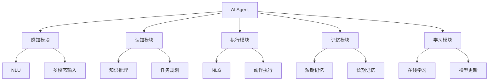
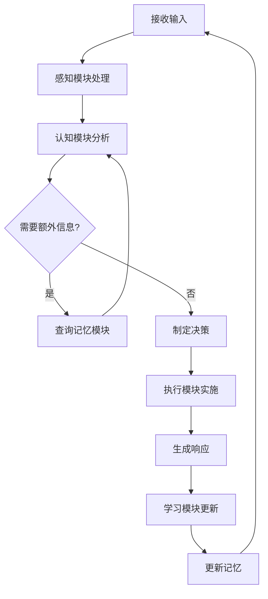
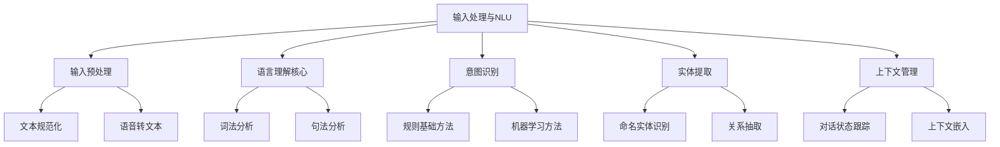
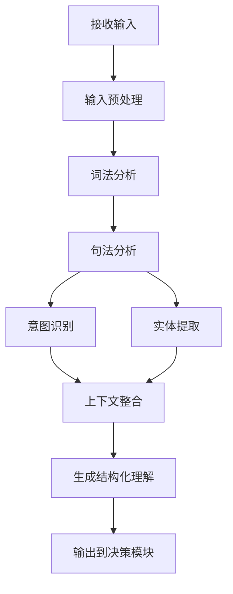
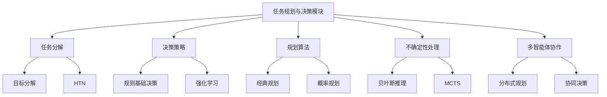
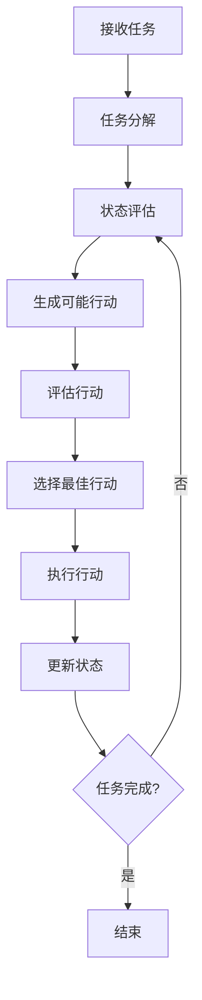
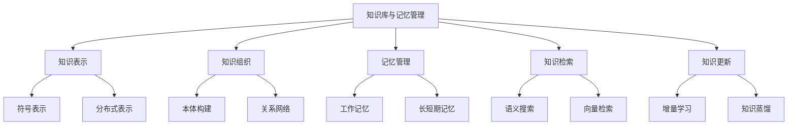
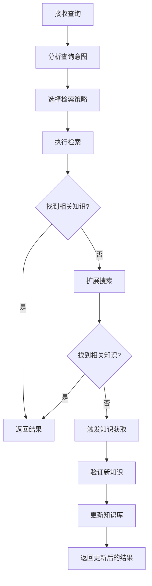
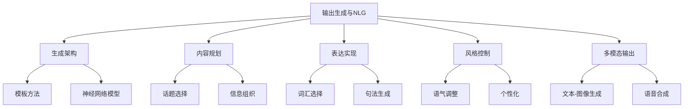
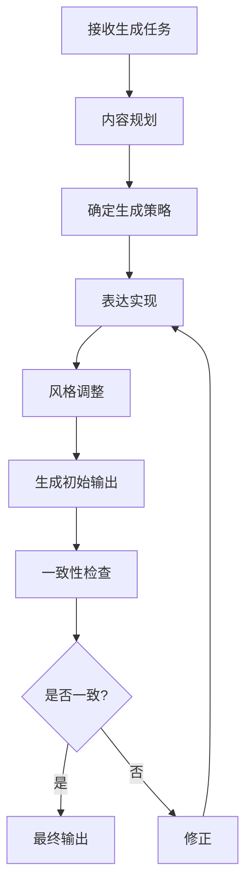

# 第5章：AI Agent 架构设计

## 5.1 AI Agent 的核心组件

### 核心概念

AI Agent 的核心组件是构成智能代理系统的基本单元，它们共同工作以实现感知、推理、决策和行动的功能。这些组件的设计和集成对 AI Agent 的整体性能和能力至关重要。

### 问题背景

随着 AI 技术的快速发展，特别是大语言模型的出现，AI Agent 的架构设计面临新的挑战和机遇。如何有效地组织和集成各个组件，以充分利用先进的 AI 技术，同时保持系统的灵活性和可扩展性，是当前 AI Agent 开发中的关键问题。

### 问题描述

1. AI Agent 的基本架构模型
2. 核心组件的功能和相互关系
3. 如何集成大语言模型到 AI Agent 架构中
4. 组件间通信和数据流设计
5. 可扩展性和模块化设计原则

### 问题解决

我们将从以下几个方面详细探讨 AI Agent 的核心组件：

1. 感知模块：
    - 自然语言理解（NLU）
    - 多模态输入处理（如图像、语音）
    - 环境状态识别

2. 认知模块：
    - 知识表示和推理
    - 任务规划
    - 决策制定

3. 执行模块：
    - 自然语言生成（NLG）
    - 动作执行
    - 外部系统接口

4. 记忆模块：
    - 短期记忆
    - 长期记忆
    - 工作记忆

5. 学习模块：
    - 在线学习
    - 经验积累
    - 模型更新

### 边界与外延

虽然本节主要关注基于大语言模型的 AI Agent，但许多原则也适用于其他类型的智能系统。此外，我们还将简要讨论 AI Agent 与外部系统和环境的交互接口设计。

### 概念结构与核心要素组成



### 概念之间的关系

| 组件 | 主要功能 | 输入 | 输出 | 与其他组件的关系 |
|------|---------|------|------|------------------|
| 感知模块 | 理解输入 | 用户输入、环境数据 | 结构化信息 | 为认知模块提供输入 |
| 认知模块 | 推理和决策 | 结构化信息 | 决策结果 | 调用记忆模块，指导执行模块 |
| 执行模块 | 生成输出和执行动作 | 决策结果 | 响应、动作 | 实现认知模块的决策 |
| 记忆模块 | 存储和检索信息 | 各模块的数据 | 存储的信息 | 支持其他所有模块 |
| 学习模块 | 改进性能 | 经验数据 | 更新的模型 | 优化其他模块的性能 |

### 算法流程图

AI Agent 的基本工作流程：



### 算法源代码

以下是一个简化的 AI Agent 核心架构示例：

```python
class AIAgent:
    def __init__(self):
        self.perception_module = PerceptionModule()
        self.cognition_module = CognitionModule()
        self.execution_module = ExecutionModule()
        self.memory_module = MemoryModule()
        self.learning_module = LearningModule()

    def process_input(self, input_data):
        # 感知阶段
        perceived_data = self.perception_module.process(input_data)
        
        # 认知阶段
        decision = self.cognition_module.analyze(perceived_data)
        
        # 执行阶段
        response = self.execution_module.execute(decision)
        
        # 学习阶段
        self.learning_module.update(input_data, decision, response)
        
        # 更新记忆
        self.memory_module.store(input_data, decision, response)
        
        return response

class PerceptionModule:
    def process(self, input_data):
        # 实现输入处理逻辑
        pass

class CognitionModule:
    def analyze(self, perceived_data):
        # 实现决策逻辑
        pass

class ExecutionModule:
    def execute(self, decision):
        # 实现动作执行逻辑
        pass

class MemoryModule:
    def store(self, input_data, decision, response):
        # 实现记忆存储逻辑
        pass
    
    def retrieve(self, query):
        # 实现记忆检索逻辑
        pass

class LearningModule:
    def update(self, input_data, decision, response):
        # 实现学习更新逻辑
        pass

# 使用示例
agent = AIAgent()
response = agent.process_input("Hello, what's the weather like today?")
print(response)
```

### 实际场景应用

1. 智能客服系统：
    - 感知模块：理解客户查询
    - 认知模块：分析问题并制定回答策略
    - 执行模块：生成回复并执行相关操作（如创建工单）
    - 记忆模块：存储客户历史交互
    - 学习模块：从交互中学习改进回答质量

2. 智能家居助手：
    - 感知模块：处理语音命令和环境传感器数据
    - 认知模块：理解用户意图并规划动作
    - 执行模块：控制家电设备
    - 记忆模块：记住用户偏好和日常习惯
    - 学习模块：适应用户行为模式

3. 自动驾驶系统：
    - 感知模块：处理视觉、雷达和其他传感器数据
    - 认知模块：进行路况分析和决策
    - 执行模块：控制车辆行驶
    - 记忆模块：存储地图和历史驾驶数据
    - 学习模块：优化驾驶策略

4. 智能教育助手：
    - 感知模块：理解学生输入和学习行为
    - 认知模块：评估学生水平并制定教学策略
    - 执行模块：生成个性化学习内容
    - 记忆模块：跟踪学生的学习进度
    - 学习模块：优化教学方法

5. 金融交易 AI：
    - 感知模块：实时市场数据处理
    - 认知模块：市场分析和交易决策
    - 执行模块：执行交易指令
    - 记忆模块：存储历史交易和市场数据
    - 学习模块：优化交易策略

### 最佳实践 tips

1. 模块化设计：
    - 采用松耦合的组件设计
    - 定义清晰的组件接口
    - 使用依赖注入简化组件集成

2. 可扩展性：
    - 设计可插拔的组件架构
    - 使用策略模式允许不同算法的灵活切换
    - 考虑未来可能的功能扩展

3. 性能优化：
    - 使用异步处理提高响应速度
    - 实现缓存机制减少重复计算
    - 考虑分布式架构以处理大规模数据

4. 鲁棒性：
    - 实现错误处理和恢复机制
    - 设计故障隔离策略
    - 进行充分的异常情况测试

5. 可解释性：
    - 实现详细的日志记录
    - 设计可视化工具展示决策过程
    - 提供查询接口以检查内部状态

6. 安全性：
    - 实施输入验证和消毒
    - 加密敏感数据
    - 实现访问控制和认证机制

7. 持续学习：
    - 设计在线学习机制
    - 实现模型版本控制
    - 建立反馈循环以持续改进

### 行业发展与未来趋势

| 时期 | 主要特征 | 关键技术 | 挑战 | 未来展望 |
|------|---------|----------|------|----------|
| 2018-2019 | 基于规则的系统 | 专家系统、决策树 | 扩展性限制 | 更灵活的架构 |
| 2020-2021 | 机器学习集成 | 深度学习、强化学习 | 数据依赖 | 端到端学习系统 |
| 2022-2023 | 大语言模型应用 | GPT、BERT | 计算资源需求 | 更高效的模型 |
| 2024-2025 (预测) | 多模态融合 | 跨模态学习、联合推理 | 模态对齐 | 通用智能雏形 |
| 2026+ (展望) | 认知架构 | 元学习、因果推理 | 抽象思维 | 接近人类水平的 AI |

AI Agent 的核心组件设计正在经历快速的演变。从早期的基于规则的系统，到现在的基于大语言模型的智能架构，我们看到了显著的进步。这些变化不仅提高了 AI Agent 的能力，还改变了我们设计和构建这些系统的方式。

未来的 AI Agent 核心组件可能会更加注重以下几个方面：

1. 自适应架构：
    - 动态组件配置
    - 自优化的模块间通信
    - 根据任务自动调整架构

2. 深度集成的大语言模型：
    - 将 LLM 作为中央推理引擎
    - 基于 LLM 的动态任务分解
    - LLM 辅助的组件间协调

3. 强化认知能力：
    - 抽象推理和类比能力
    - 元认知和自我监控
    - 长期规划和目标管理

4. 情感和社交智能：
    - 情感识别和生成
    - 社交规范理解
    - 个性化交互策略

5. 持续学习和适应：
    - 终身学习架构
    - 快速适应新任务
    - 知识迁移和综合

6. 多模态和跨模态处理：
    - 无缝集成视觉、听觉、文本等多种模态
    - 跨模态推理和生成
    - 模态间的知识转换

7. 伦理和安全框架：
    - 内置的伦理决策模块
    - 隐私保护机制
    - 可审核的决策过程

随着这些趋势的发展，AI Agent 的核心组件将变得更加智能、灵活和强大。它们将能够处理更复杂的任务，适应更多样的环境，并与人类进行更自然的交互。这种进步将使 AI Agent 在更广泛的领域发挥作用，从个人助理到复杂的决策支持系统。

然而，这种发展也带来了新的挑战，如如何确保 AI Agent 的行为符合伦理标准，如何管理日益复杂的系统，以及如何平衡自主性和人类控制。未来的 AI Agent 设计需要在提高能力的同时，也注重透明度、可解释性和可控性。

总的来说，AI Agent 核心组件的演进将继续推动人工智能向着更高级、更通用的方向发展。通过整合先进的 AI 技术和创新的架构设计，未来的 AI Agent 有望实现更接近人类水平的智能，为各行各业带来革命性的变革。

## 5.2 输入处理与自然语言理解

### 核心概念

输入处理与自然语言理解（NLU）是 AI Agent 与用户和环境交互的关键入口。这个模块负责接收、解析和理解各种形式的输入，特别是自然语言输入，将其转化为 AI Agent 可以处理的结构化信息。

### 问题背景

随着大语言模型的发展，NLU 技术取得了巨大进步。然而，如何有效地将这些先进技术集成到 AI Agent 中，以处理复杂、多样和可能存在歧义的用户输入，仍然是一个重要挑战。

### 问题描述

1. 如何处理多模态输入（文本、语音、图像等）
2. 自然语言理解中的意图识别和实体提取
3. 上下文理解和对话管理
4. 处理语言的歧义性和复杂性
5. 多语言支持和跨语言理解

### 问题解决

我们将从以下几个方面详细探讨输入处理与自然语言理解：

1. 输入预处理：
    - 文本规范化
    - 语音转文本（ASR）
    - 图像预处理和特征提取

2. 语言理解核心：
    - 词法分析和词性标注
    - 句法分析和依存关系解析
    - 语义角色标注

3. 意图识别：
    - 基于规则的方法
    - 机器学习方法（如SVM、深度学习）
    - 基于大语言模型的方法

4. 实体提取：
    - 命名实体识别（NER）
    - 关系抽取
    - 属性提取

5. 上下文管理：
    - 对话状态跟踪
    - 上下文嵌入
    - 长短期记忆整合

### 边界与外延

虽然本节主要关注基于文本的自然语言理解，但也会涉及多模态输入的处理。此外，我们还将讨论 NLU 与其他 AI Agent 组件（如决策模块和知识库）的接口设计。

### 概念结构与核心要素组成



### 概念之间的关系

| 组件 | 主要功能 | 输入 | 输出 | 与其他组件的关系 |
|------|---------|------|------|------------------|
| 输入预处理 | 标准化输入 | 原始输入 | 规范化文本 | 为语言理解核心提供输入 |
| 语言理解核心 | 基础语言分析 | 规范化文本 | 语言结构 | 支持意图识别和实体提取 |
| 意图识别 | 确定用户意图 | 语言结构 | 意图标签 | 指导后续处理流程 |
| 实体提取 | 识别关键信息 | 语言结构 | 结构化实体 | 提供任务所需具体信息 |
| 上下文管理 | 维护对话状态 | 当前输入和历史 | 更新后的上下文 | 影响整体理解过程 |

### 算法流程图

NLU 处理流程：



### 算法源代码

以下是一个简化的 NLU 处理流程示例：

```python
import spacy
from sklearn.feature_extraction.text import TfidfVectorizer
from sklearn.svm import SVC

class NLUProcessor:
    def __init__(self):
        self.nlp = spacy.load("en_core_web_sm")
        self.intent_classifier = self.train_intent_classifier()
        self.context = {}

    def train_intent_classifier(self):
        # 简化的意图分类器训练
        X = ["What's the weather like?", "Set an alarm for 7 AM", "Tell me a joke"]
        y = ["get_weather", "set_alarm", "tell_joke"]
        vectorizer = TfidfVectorizer()
        X_vectorized = vectorizer.fit_transform(X)
        classifier = SVC()
        classifier.fit(X_vectorized, y)
        return classifier, vectorizer

    def preprocess(self, text):
        return text.lower().strip()

    def extract_entities(self, doc):
        entities = {}
        for ent in doc.ents:
            entities[ent.label_] = ent.text
        return entities

    def classify_intent(self, text):
        classifier, vectorizer = self.intent_classifier
        X_vectorized = vectorizer.transform([text])
        intent = classifier.predict(X_vectorized)[0]
        return intent

    def process_input(self, text):
        preprocessed_text = self.preprocess(text)
        doc = self.nlp(preprocessed_text)
        
        intent = self.classify_intent(preprocessed_text)
        entities = self.extract_entities(doc)
        
        # 更新上下文
        self.context.update(entities)
        
        return {
            "intent": intent,
            "entities": entities,
            "context": self.context
        }

# 使用示例
nlu = NLUProcessor()
result = nlu.process_input("What's the weather like in New York tomorrow?")
print(result)
```

### 实际场景应用

1. 智能客服系统：
    - 识别客户查询的意图（如退款、产品信息、投诉）
    - 提取关键实体（如订单号、产品名称、日期）
    - 维护对话上下文以处理多轮交互

2. 智能家居控制：
    - 理解语音命令（如"打开客厅的灯"）
    - 识别设备和位置实体
    - 处理上下文相关的命令（如"把它调亮一点"）

3. 旅行规划助手：
    - 识别旅行相关意图（如预订机票、查找酒店、规划行程）
    - 提取地点、日期、预算等关键信息
    - 维护用户偏好和旅行计划的上下文

4. 健康咨询 AI：
    - 理解症状描述和健康查询
    - 识别医学术语和症状实体
    - 管理病史和诊断上下文

5. 教育辅导系统：
    - 理解学生的问题和学习需求
    - 提取学科、概念等关键实体
    - 跟踪学习进度和难点

### 最佳实践 tips

1. 数据预处理：
    - 实施强大的文本清理和规范化流程
    - 使用适当的分词技术，特别是对于非空格分隔的语言
    - 考虑使用词干提取或词形还原以减少词形变化

2. 意图识别：
    - 使用分层意图分类以处理复杂查询
    - 结合规则基础和机器学习方法
    - 定期更新意图模型以适应新的用例

3. 实体提取：
    - 使用预训练的 NER 模型并根据领域特定数据进行微调
    - 实现自定义实体识别器以处理特定领域实体
    - 利用上下文信息提高实体识别的准确性

4. 上下文管理：
    - 实现有效的对话状态跟踪机制
    - 使用滑动窗口或注意力机制处理长期上下文
    - 定期清理和更新上下文信息以避免干扰

5. 错误处理：
    - 实现健壮的错误处理机制，优雅地处理异常输入
    - 使用置信度阈值，在不确定时请求澄清
    - 提供用户友好的错误消息和纠正建议

6. 多语言支持：
    - 使用多语言模型或为每种支持的语言训练单独的模型
    - 实现语言检测以自动切换处理流程
    - 考虑文化差异对语言理解的影响

7. 持续改进：
    - 收集和分析用户交互日志以识别改进机会
    - 实施主动学习策略，重点关注难以分类的案例
    - 定期进行人工审核以评估和提高系统性能

### 行业发展与未来趋势

| 时期 | 主要特征 | 关键技术 | 挑战 | 未来展望 |
|------|---------|----------|------|----------|
| 2018-2019 | 基于规则和统计 | CRF, SVM | 领域适应性 | 更灵活的模型 |
| 2020-2021 | 深度学习普及 | BERT, RoBERTa | 计算资源需求 | 轻量级高效模型 |
| 2022-2023 | 大规模预训练 | GPT-3, T5 | 微调效率 | 少样本学习 |
| 2024-2025 (预测) | 多模态融合 | 跨模态Transformer | 模态对齐 | 通用理解框架 |
| 2026+ (展望) | 认知理解 | 神经符号系统 | 常识推理 | 接近人类理解 |

输入处理与自然语言理解技术正在经历快速的演变。从早期的基于规则和统计的方法，到现在的基于大规模预训练模型的方法，我们看到了显著的进步。这些进展不仅提高了 NLU 的准确性和鲁棒性，还扩展了其应用范围。

未来的输入处理与 NLU 技术可能会更加注重以下几个方面：

1. 上下文感知理解：
    - 长期对话历史建模
    - 跨会话知识传递
    - 动态上下文适应

2. 多模态融合理解：
    - 文本、语音、图像的联合理解
    - 跨模态信息对齐和互补
    - 多模态上下文推理

3. 低资源语言和领域：
    - 零样本和少样本跨语言迁移
    - 快速领域适应技术
    - 数据高效的学习方法

4. 鲁棒性和泛化能力：
    - 对抗训练增强模型鲁棒性
    - 处理噪声和不完整输入
    - 跨领域和跨场景泛化

5. 可解释性和透明度：
    - 可解释的意图分类和实体识别
    - 决策过程的可视化
    - 置信度估计和不确定性量化

6. 实时处理和效率：
    - 边缘设备上的轻量级 NLU
    - 增量处理和流式理解
    - 自适应计算复杂度

7. 伦理和隐私考虑：
    - 偏见检测和缓解
    - 隐私保护的 NLU 技术
    - 符合道德的语言理解框架

随着这些趋势的发展，输入处理与 NLU 技术将变得更加智能、高效和可靠。它们将能够处理更复杂的语言现象，理解更深层的语义和语用信息，并在各种复杂的实际应用场景中表现出色。这种进步将使 AI Agent 能够进行更自然、更有意义的人机交互，从而在更广泛的领域发挥作用。

然而，这种发展也带来了新的挑战，如如何在提高模型复杂性的同时保持效率，如何确保 NLU 系统的公平性和包容性，以及如何在隐私和性能之间取得平衡。未来的 NLU 研究和应用需要在技术创新和负责任的 AI 原则之间找到平衡点。

总的来说，输入处理与自然语言理解技术的进步将继续推动 AI Agent 向着更智能、更自然的方向发展。通过更好地理解人类语言和意图，未来的 AI 系统将能够提供更个性化、更有价值的服务，并在解决复杂问题和辅助决策方面发挥越来越重要的作用。

## 5.3 任务规划与决策模块

### 核心概念

任务规划与决策模块是 AI Agent 的核心智能单元，负责根据理解的输入和当前状态制定行动计划，并做出相应的决策。这个模块将 NLU 的输出转化为具体的行动指令，是 AI Agent 自主性和智能性的关键体现。

### 问题背景

随着 AI 技术的发展，特别是大语言模型的出现，任务规划与决策模块面临着如何有效利用这些先进技术来提高决策质量和效率的挑战。同时，如何在复杂和不确定的环境中做出合理决策，也是一个持续的研究课题。

### 问题描述

1. 如何将用户意图转化为具体的任务计划
2. 在多目标和约束条件下的决策优化
3. 处理不确定性和部分可观察环境
4. 长期规划与短期决策的平衡
5. 决策的可解释性和透明度

### 问题解决

我们将从以下几个方面详细探讨任务规划与决策模块：

1. 任务分解：
    - 目标分解技术
    - 层次任务网络（HTN）
    - 基于大语言模型的任务分解

2. 决策策略：
    - 基于规则的决策系统
    - 强化学习方法
    - 基于效用的决策理论

3. 规划算法：
    - 经典规划（如 A* 搜索）
    - 概率规划
    - 在线规划和重规划

4. 不确定性处理：
    - 贝叶斯推理
    - 蒙特卡洛树搜索（MCTS）
    - 模糊逻辑

5. 多智能体协作：
    - 分布式规划
    - 协同决策机制
    - 冲突解决策略

### 边界与外延

虽然本节主要关注基于语言的任务规划和决策，但也会涉及多模态输入的处理和跨领域决策。此外，我们还将讨论任务规划与决策模块如何与其他 AI Agent 组件（如知识库和执行模块）进行交互。

### 概念结构与核心要素组成



### 概念之间的关系

| 组件 | 主要功能 | 输入 | 输出 | 与其他组件的关系 |
|------|---------|------|------|------------------|
| 任务分解 | 将复杂任务分解为子任务 | 用户意图、任务描述 | 任务结构 | 为决策策略提供基础 |
| 决策策略 | 选择最佳行动 | 当前状态、可能行动 | 决策 | 指导规划算法 |
| 规划算法 | 生成行动序列 | 初始状态、目标状态 | 行动计划 | 实现决策策略 |
| 不确定性处理 | 管理不确定信息 | 概率分布、部分观察 | 风险评估 | 影响决策和规划过程 |
| 多智能体协作 | 协调多个智能体 | 各智能体状态和目标 | 协作策略 | 扩展单体决策到群体层面 |

### 算法流程图

任务规划与决策过程：



### 算法源代码

以下是一个简化的任务规划与决策模块示例：

```python
import random
from typing import List, Dict

class TaskPlannerDecisionMaker:
    def __init__(self):
        self.task_hierarchy = {}
        self.current_state = {}
        self.goal_state = {}

    def decompose_task(self, task: str) -> List[str]:
        # 简化的任务分解
        if task == "make coffee":
            return ["boil water", "add coffee grounds", "pour in cup"]
        return [task]  # 如果没有分解规则，返回原任务

    def generate_actions(self, state: Dict) -> List[str]:
        # 根据当前状态生成可能的行动
        actions = ["boil water", "add coffee grounds", "pour in cup", "wait"]
        return actions

    def evaluate_action(self, action: str, state: Dict) -> float:
        # 简化的行动评估
        if action == "wait":
            return 0.1
        return random.random()  # 在实际应用中，这里应该有更复杂的评估逻辑

    def update_state(self, state: Dict, action: str) -> Dict:
        # 根据执行的行动更新状态
        new_state = state.copy()
        if action == "boil water":
            new_state["water"] = "hot"
        elif action == "add coffee grounds":
            new_state["coffee_grounds"] = "added"
        elif action == "pour in cup":
            new_state["coffee"] = "ready"
        return new_state

    def is_goal_reached(self, state: Dict) -> bool:
        return state.get("coffee") == "ready"

    def plan_and_decide(self, task: str):
        subtasks = self.decompose_task(task)
        for subtask in subtasks:
            while not self.is_goal_reached(self.current_state):
                possible_actions = self.generate_actions(self.current_state)
                best_action = max(possible_actions, key=lambda a: self.evaluate_action(a, self.current_state))
                print(f"Executing action: {best_action}")
                self.current_state = self.update_state(self.current_state, best_action)
        print("Task completed. Final state:", self.current_state)

# 使用示例
planner = TaskPlannerDecisionMaker()
planner.plan_and_decide("make coffee")
```

### 实际场景应用

1. 智能家居系统：
    - 任务分解：将"准备晚餐"分解为开灯、预热烤箱、设置温度等子任务
    - 决策：根据用户偏好和当前环境状态决定最佳的家电控制策略
    - 不确定性处理：处理传感器数据的不确定性，如温度波动

2. 自动驾驶车辆：
    - 任务分解：将"到达目的地"分解为路线规划、变道、转弯等子任务
    - 规划：生成考虑交通规则和其他车辆的行驶路径
    - 多智能体协作：与其他车辆和交通系统协调

3. 智能客服系统：
    - 任务分解：将复杂查询分解为多个简单问题
    - 决策：选择最佳的回答策略（直接回答、转人工、请求更多信息）
    - 不确定性处理：处理语音识别和自然语言理解的不确定性

4. 金融投资助手：
    - 任务分解：将投资目标分解为资产配置、风险管理等子任务
    - 规划：生成长期投资策略和短期交易计划
    - 不确定性处理：使用概率模型处理市场波动

5. 智能教育系统：
    - 任务分解：将学习目标分解为具体的学习单元和练习
    - 决策：根据学生表现动态调整教学策略
    - 多智能体协作：协调不同学习资源和辅导员

### 最佳实践 tips

1. 任务分解：
    - 使用领域知识构建任务层次结构
    - 考虑任务间的依赖关系和并行可能性
    - 利用大语言模型生成灵活的任务分解

2. 决策策略：
    - 结合规则基础和学习基础的方法
    - 使用多准则决策分析处理复杂情况
    - 实现自适应决策策略以应对环境变化

3. 规划算法：
    - 选择适合问题规模和特性的规划算法
    - 使用启发式函数提高搜索效率
    - 实现在线规划以处理动态环境

4. 不确定性处理：
    - 使用概率图模型表示不确定知识
    - 实现主动感知策略减少不确定性
    - 考虑决策的风险和鲁棒性

5. 多智能体协作：
    - 设计有效的通信协议
    - 实现分布式共识算法
    - 考虑智能体间的激励机制

6. 可解释性：
    - 生成决策过程的解释
    - 可视化规划和决策过程
    - 提供决策置信度估计

7. 性能优化：
    - 使用近似算法处理大规模问题
    - 实现并行计算加速规划过程
    - 使用缓存机制重用之前的计算结果

### 行业发展与未来趋势

| 时期 | 主要特征 | 关键技术 | 挑战 | 未来展望 |
|------|---------|----------|------|----------|
| 2018-2019 | 基于规则的系统 | 专家系统、决策树 | 扩展性限制 | 更灵活的决策框架 |
| 2020-2021 | 数据驱动决策 | 强化学习、深度学习 | 样本效率 | 结合知识和学习 |
| 2022-2023 | 大模型辅助决策 | GPT、few-shot learning | 计算资源需求 | 更高效的模型应用 |
| 2024-2025 (预测) | 多模态决策 | 跨模态推理、因果推断 | 模态融合 | 通用决策框架 |
| 2026+ (展望) | 认知决策系统 | 元学习、自主规划 | 抽象推理 | 接近人类水平决策 |

任务规划与决策模块正在经历快速的演变。从早期的基于规则的系统，到现在的数据驱动和大模型辅助决策，我们看到了显著的进步。这些变化不仅提高了 AI Agent 的决策能力，还改变了我们设计和实现这些系统的方式。

未来的任务规划与决策模块可能会更加注重以下几个方面：

1. 认知架构集成：
    - 结合符号推理和神经网络
    - 实现类人的推理和决策过程
    - 长期目标导向的行为规划

2. 元学习和快速适应：
    - 学习如何学习新任务
    - 快速适应新环境和新目标
    - 持续学习和知识积累

3. 因果推理：
    - 构建和利用因果模型
    - 进行反事实推理
    - 提高决策的可解释性和泛化能力

4. 多智能体协作决策：
    - 群体智能涌现
    - 分布式决策协议
    - 大规模协作系统

5. 伦理决策框架：
    - 将伦理考虑纳入决策过程
    - 价值对齐和安全保障
    - 公平和无偏见的决策系统

6. 情境感知决策：
    - 深度上下文理解
    - 动态环境适应
    - 多模态信息整合

7. 计算效率优化：
    - 神经符号系统的高效实现
    - 边缘计算和分布式决策
    - 量子计算在决策中的应用

随着这些趋势的发展，任务规划与决策模块将变得更加智能、灵活和强大。它们将能够处理更复杂的任务，适应更多样的环境，并做出更接近人类水平的决策。这种进步将使 AI Agent 在更广泛的领域发挥作用，从个人助理到复杂的决策支持系统。

然而，这种发展也带来了新的挑战，如如何确保 AI 决策的公平性和透明度，如何在自主性和人类控制之间取得平衡，以及如何处理决策的长期影响和伦理问题。未来的任务规划与决策系统需要在提高能力的同时，也注重责任和可信赖性。

总的来说，任务规划与决策模块的演进将继续推动 AI 向着更高级、更通用的方向发展。通过整合先进的 AI 技术和创新的决策框架，未来的 AI Agent 有望实现更智能、更负责任的决策能力，为各行各业带来革命性的变革。

## 5.4 知识库与记忆管理

### 核心概念

知识库与记忆管理是 AI Agent 智能系统的基础支撑，负责存储、组织和检索各种类型的信息。这个模块不仅包含静态的领域知识，还管理动态的交互历史和上下文信息，为 AI Agent 的理解、推理和决策提供必要的知识支持。

### 问题背景

随着 AI 技术的发展，特别是大语言模型的出现，知识库与记忆管理面临着如何有效整合和利用海量信息的挑战。同时，如何在保持知识丰富性的同时确保检索效率，以及如何管理短期和长期记忆，也是需要解决的关键问题。

### 问题描述

1. 如何构建和维护大规模知识库
2. 短期记忆和长期记忆的管理策略
3. 知识表示方法的选择和优化
4. 高效的知识检索和推理机制
5. 知识更新和冲突解决

### 问题解决

我们将从以下几个方面详细探讨知识库与记忆管理：

1. 知识表示：
    - 符号表示（如语义网络、框架）
    - 分布式表示（如词嵌入、知识图谱嵌入）
    - 神经符号混合表示

2. 知识组织：
    - 本体构建
    - 分类体系
    - 关系网络

3. 记忆管理：
    - 工作记忆模型
    - 长短期记忆交互
    - 记忆衰减和强化机制

4. 知识检索：
    - 语义搜索
    - 向量检索
    - 推理based检索

5. 知识更新：
    - 增量学习
    - 知识蒸馏
    - 冲突检测和解决

### 边界与外延

虽然本节主要关注基于语言的知识和记忆管理，但也会涉及多模态知识的表示和管理。此外，我们还将讨论知识库与记忆管理模块如何与其他 AI Agent 组件（如自然语言理解和决策模块）进行交互。

### 概念结构与核心要素组成



### 概念之间的关系

| 组件 | 主要功能 | 输入 | 输出 | 与其他组件的关系 |
|------|---------|------|------|------------------|
| 知识表示 | 编码知识 | 原始信息 | 结构化知识 | 为知识组织和检索提供基础 |
| 知识组织 | 构建知识结构 | 结构化知识 | 知识网络 | 支持高效检索和推理 |
| 记忆管理 | 管理动态信息 | 交互历史、上下文 | 可访问记忆 | 为决策和对话提供上下文 |
| 知识检索 | 快速访问相关知识 | 查询 | 相关知识 | 支持理解和决策模块 |
| 知识更新 | 维护知识的时效性 | 新信息、反馈 | 更新后的知识库 | 确保知识库的准确性和完整性 |

### 算法流程图

知识检索和更新过程：



### 算法源代码

以下是一个简化的知识库与记忆管理模块示例：

```python
import numpy as np
from sklearn.metrics.pairwise import cosine_similarity

class KnowledgeAndMemoryManager:
    def __init__(self):
        self.knowledge_base = {}
        self.short_term_memory = []
        self.long_term_memory = {}

    def add_knowledge(self, key, value, embedding):
        self.knowledge_base[key] = {"value": value, "embedding": embedding}

    def query_knowledge(self, query_embedding, top_k=1):
        if not self.knowledge_base:
            return []

        similarities = []
        for key, item in self.knowledge_base.items():
            similarity = cosine_similarity([query_embedding], [item["embedding"]])[0][0]
            similarities.append((key, similarity))

        similarities.sort(key=lambda x: x[1], reverse=True)
        return similarities[:top_k]

    def update_short_term_memory(self, item):
        self.short_term_memory.append(item)
        if len(self.short_term_memory) > 10:  # 限制短期记忆大小
            self.short_term_memory.pop(0)

    def consolidate_memory(self):
        for item in self.short_term_memory:
            if item in self.long_term_memory:
                self.long_term_memory[item] += 1
            else:
                self.long_term_memory[item] = 1

    def get_relevant_memory(self, query_embedding, top_k=3):
        memories = []
        for memory, count in self.long_term_memory.items():
            memory_embedding = self.get_embedding(memory)  # 假设有这个函数
            similarity = cosine_similarity([query_embedding], [memory_embedding])[0][0]
            memories.append((memory, similarity, count))

        memories.sort(key=lambda x: x[1] * np.log(x[2] + 1), reverse=True)
        return memories[:top_k]

    def get_embedding(self, text):
        # 这里应该实现文本到嵌入的转换
        # 简化起见，我们返回一个随机向量
        return np.random.rand(300)

# 使用示例
km = KnowledgeAndMemoryManager()

# 添加知识
km.add_knowledge("Python", "Python是一种高级编程语言", km.get_embedding("Python是一种高级编程语言"))
km.add_knowledge("Machine Learning", "机器学习是AI的一个子领域", km.get_embedding("机器学习是AI的一个子领域"))

# 查询知识
query = "What is Python?"
query_embedding = km.get_embedding(query)
results = km.query_knowledge(query_embedding)
print("Knowledge query results:", results)

# 更新短期记忆
km.update_short_term_memory("User asked about Python")

# 合并到长期记忆
km.consolidate_memory()

# 获取相关记忆
relevant_memories = km.get_relevant_memory(query_embedding)
print("Relevant memories:", relevant_memories)
```

### 实际场景应用

1. 智能客服系统：
    - 知识库：存储产品信息、常见问题解答
    - 短期记忆：记录当前对话上下文
    - 长期记忆：学习用户偏好和常见问题模式

2. 个人助理：
    - 知识库：用户个人信息、日程安排、兴趣爱好
    - 短期记忆：最近的交互和任务
    - 长期记忆：用户习惯和长期目标

3. 教育辅导系统：
    - 知识库：课程内容、教学资源
    - 短期记忆：学生当前学习进度
    - 长期记忆：学生的学习历史和能力评估

4. 医疗诊断助手：
    - 知识库：疾病症状、治疗方案、药物信息
    - 短期记忆：患者当前症状和检查结果
    - 长期记忆：患者病史和治疗记录

5. 智能家居系统：
    - 知识库：设备操作指南、家庭成员信息
    - 短期记忆：当前环境状态和用户指令
    - 长期记忆：家庭成员习惯和偏好

### 最佳实践 tips

1. 知识表示：
    - 使用混合表示方法，结合符号和分布式表示的优势
    - 考虑领域特性选择合适的知识表示方法
    - 使用标准化的知识表示格式便于知识共享和集成

2. 知识组织：
    - 构建层次化的知识结构，便于快速定位和推理
    - 使用本体工程方法确保知识的一致性和完整性
    - 建立多维度的关系网络，支持复杂查询和推理

3. 记忆管理：
    - 实现动态的记忆强化和衰减机制
    - 设计有效的短期记忆到长期记忆的转换策略
    - 考虑情感因素在记忆形成和检索中的作用

4. 知识检索：
    - 实现多策略检索，结合关键词、语义和向量检索
    - 使用上下文信息优化检索结果的相关性
    - 实现渐进式检索，允许用户交互式细化查询

5. 知识更新：
    - 建立知识验证机制，确保新增知识的准确性
    - 实现增量学习，高效整合新知识
    - 设计冲突解决策略，处理不一致的信息

6. 性能优化：
    - 使用高效的索引结构加速检索
    - 实现分布式存储和检索以处理大规模知识库
    - 使用缓存机制优化频繁访问的知识

7. 隐私和安全：
    - 实施访问控制机制保护敏感信息
    - 使用加密技术保护存储和传输中的数据
    - 提供知识溯源功能，跟踪知识的来源和变更历史

### 行业发展与未来趋势

| 时期 | 主要特征 | 关键技术 | 挑战 | 未来展望 |
|------|---------|----------|------|----------|
| 2018-2019 | 结构化知识库 | 关系数据库、本体 | 知识获取瓶颈 | 自动化知识抽取 |
| 2020-2021 | 神经知识表示 | 知识图谱嵌入、BERT | 知识融合 | 多模态知识表示 |
| 2022-2023 | 大规模语言模型 | GPT-3、CLIP | 知识一致性 | 自监督知识学习 |
| 2024-2025 (预测) | 动态知识管理 | 终身学习、元学习 | 知识遗忘 | 认知架构集成 |
| 2026+ (展望) | 通用知识引擎 | 神经符号系统、量子计算 | 常识推理 | 类人知识处理 |

知识库与记忆管理技术正在经历快速的演变。从早期的静态、结构化知识库，到现在的动态、分布式知识表示，我们看到了显著的进步。这些变化不仅提高了 AI 系统的知识处理能力，还改变了我们对机器智能的理解和实现方式。

未来的知识库与记忆管理系统可能会更加注重以下几个方面：

1. 持续学习与适应：
    - 实时知识更新和整合
    - 上下文相关的知识激活
    - 知识的自我修正和优化

2. 多模态知识融合：
    - 跨模态知识表示和推理
    - 视觉-语言-行为知识统一
    - 多感官信息的综合处理

3. 大规模知识推理：
    - 结合神经网络和符号推理
    - 可扩展的知识图谱推理
    - 概率推理和因果推断

4. 个性化知识管理：
    - 用户特定的知识适配
    - 情境感知的知识检索
    - 隐私保护的个人知识库

5. 元认知能力：
    - 知识可信度评估
    - 知识缺口识别和主动学习
    - 反思和自我改进机制

6. 分布式协作知识系统：
    - 去中心化的知识共享
    - 群体智能的知识聚合
    - 跨域知识的动态集成

7. 伦理和负责任的知识管理：
    - 知识偏见检测和缓解
    - 可解释的知识推理
    - 伦理约束下的知识应用

随着这些趋势的发展，知识库与记忆管理系统将变得更加智能、动态和适应性强。它们将能够处理更复杂、更抽象的知识，支持更高级的推理和决策，并与人类知识系统更好地协作和互补。这种进步将使 AI 系统在更广泛的领域发挥作用，从个人助理到科学发现支持系统。

然而，这种发展也带来了新的挑战，如如何管理和整合海量、异构的知识，如何确保知识的准确性和时效性，以及如何在开放性和安全性之间取得平衡。未来的知识库与记忆管理系统需要在提高能力的同时，也注重可靠性、可解释性和伦理性。

总的来说，知识库与记忆管理的演进将继续推动 AI 向着更智能、更通用的方向发展。通过更好地模拟人类的知识获取、组织和应用过程，未来的 AI 系统有望实现更深入的理解和更智能的行为，为人类知识的扩展和应用开辟新的可能性。

## 5.5 输出生成与自然语言生成

### 核心概念

输出生成与自然语言生成（NLG）是 AI Agent 与用户和环境进行交互的关键输出环节。这个模块负责将 AI 系统的内部表示、决策结果或检索到的信息转化为人类可理解的自然语言或其他形式的输出。

### 问题背景

随着大语言模型的发展，NLG 技术取得了巨大进步。然而，如何生成连贯、准确、自然且符合特定场景需求的输出仍然是一个重要挑战。同时，如何控制生成内容的风格、情感和个性化程度，以及如何确保生成内容的可靠性和安全性，也是需要解决的关键问题。

### 问题描述

1. 如何生成连贯且符合上下文的自然语言输出
2. 控制生成内容的风格、语气和个性化
3. 确保生成内容的准确性和可靠性
4. 多模态输出的生成和协调
5. 处理长文本生成中的一致性问题

### 问题解决

我们将从以下几个方面详细探讨输出生成与自然语言生成：

1. 生成架构：
    - 基于模板的方法
    - 基于规则的方法
    - 神经网络生成模型（如Seq2Seq, Transformer）

2. 内容规划：
    - 话题选择
    - 信息组织
    - 篇章结构设计

3. 表达实现：
    - 词汇选择
    - 句法结构生成
    - 修辞手法应用

4. 风格控制：
    - 语气调整
    - 个性化表达
    - 情感注入

5. 多模态输出：
    - 文本-图像协同生成
    - 语音合成
    - 手势和表情生成（用于虚拟人物）

### 边界与外延

虽然本节主要关注基于文本的自然语言生成，但也会涉及多模态输出的生成。此外，我们还将讨论 NLG 与其他 AI Agent 组件（如决策模块和知识库）的接口设计。

### 概念结构与核心要素组成



### 概念之间的关系

| 组件 | 主要功能 | 输入 | 输出 | 与其他组件的关系 |
|------|---------|------|------|------------------|
| 生成架构 | 确定生成方法 | 任务需求、数据类型 | 生成模型 | 为其他组件提供基础框架 |
| 内容规划 | 组织输出结构 | 待表达信息、上下文 | 内容大纲 | 指导表达实现 |
| 表达实现 | 生成具体语言 | 内容大纲、语言资源 | 初始文本 | 实现内容规划的具体表达 |
| 风格控制 | 调整输出特征 | 初始文本、风格参数 | 风格化文本 | 对表达实现的输出进行调整 |
| 多模态输出 | 生成非文本输出 | 文本内容、多模态数据 | 多模态输出 | 与文本生成协同工作 |

### 算法流程图

NLG 处理流程：



### 算法源代码

以下是一个简化的 NLG 处理流程示例：

```python
import random
from transformers import GPT2LMHeadModel, GPT2Tokenizer

class NLGProcessor:
    def __init__(self):
        self.tokenizer = GPT2Tokenizer.from_pretrained("gpt2")
        self.model = GPT2LMHeadModel.from_pretrained("gpt2")
        self.templates = {
            "greeting": ["Hello!", "Hi there!", "Greetings!"],
            "weather": ["The weather is {condition} today.", "It's a {condition} day."],
            "farewell": ["Goodbye!", "See you later!", "Have a great day!"]
        }

    def plan_content(self, intent, entities):
        content_plan = []
        if intent == "greet":
            content_plan.append(("greeting", {}))
        elif intent == "weather_query":
            content_plan.append(("weather", {"condition": entities.get("condition", "nice")}))
        content_plan.append(("farewell", {}))
        return content_plan

    def realize_expression(self, content_plan):
        realized_text = []
        for item, params in content_plan:
            template = random.choice(self.templates[item])
            realized_text.append(template.format(**params))
        return " ".join(realized_text)

    def adjust_style(self, text, style="formal"):
        # 使用GPT-2模型调整文本风格
        prompt = f"Rewrite the following in a {style} style: {text}"
        input_ids = self.tokenizer.encode(prompt, return_tensors="pt")
        output = self.model.generate(input_ids, max_length=100, num_return_sequences=1)
        return self.tokenizer.decode(output[0], skip_special_tokens=True)

    def generate_output(self, intent, entities, style="casual"):
        content_plan = self.plan_content(intent, entities)
        initial_text = self.realize_expression(content_plan)
        styled_text = self.adjust_style(initial_text, style)
        return styled_text

# 使用示例
nlg = NLGProcessor()
output = nlg.generate_output("weather_query", {"condition": "sunny"}, style="casual")
print(output)
```

### 实际场景应用

1. 智能客服系统：
    - 生成个性化的问候和回复
    - 根据用户情绪调整语气
    - 生成结构化的问题解答

2. 新闻写作助手：
    - 根据事实生成新闻报道
    - 调整文章风格以适应不同受众
    - 生成多语言版本的新闻

3. 教育辅导系统：
    - 生成个性化的学习反馈
    - 根据学生水平调整解释的复杂度
    - 生成练习题和测试题

4. 医疗报告生成：
    - 将医疗数据转化为易懂的报告
    - 生成专业术语和通俗解释的双版本
    - 根据严重程度调整语气

5. 游戏对话系统：
    - 生成符合角色设定的对话
    - 根据游戏情节动态调整对话内容
    - 生成多样化的NPC回应

### 最佳实践 tips

1. 内容规划：
    - 使用知识图谱辅助内容组织
    - 考虑用户背景和偏好进行个性化规划
    - 实现动态调整的内容计划

2. 表达实现：
    - 使用大规模语言模型提高生成质量
    - 实现多样化的表达方式以避免重复
    - 考虑领域特定的表达习惯和术语

3. 风格控制：
    - 建立风格参数库，支持细粒度的风格调整
    - 使用风格迁移技术实现灵活的风格转换
    - 考虑上下文和用户特征进行动态风格选择

4. 一致性保证：
    - 实现跨段落的一致性检查机制
    - 使用指代消解技术确保代词使用的准确性
    - 建立事实一致性验证流程

5. 多模态协调：
    - 确保文本和其他模态（如图像、语音）的语义一致性
    - 实现跨模态的风格匹配
    - 考虑不同模态之间的互补性

6. 安全性和伦理：
    - 实施内容过滤机制，避免生成不适当内容
    - 建立偏见检测和缓解流程
    - 确保生成内容的可追溯性和可解释性

7. 性能优化：
    - 使用缓存机制存储常用表达
    - 实现增量生成以提高响应速度
    - 考虑使用模型压缩技术以适应资源受限环境

### 行业发展与未来趋势

| 时期 | 主要特征 | 关键技术 | 挑战 | 未来展望 |
|------|---------|----------|------|----------|
| 2018-2019 | 基于规则和模板 | 预定义模板、规则系统 | 表达灵活性 | 更自然的生成 |
| 2020-2021 | 神经网络生成 | Seq2Seq, Transformer | 一致性控制 | 长文本生成 |
| 2022-2023 | 大规模语言模型 | GPT-3, T5 | 可控性 | 多模态协同生成 |
| 2024-2025 (预测) | 上下文感知生成 | 动态内存网络、元学习 | 个性化 | 情境适应性生成 |
| 2026+ (展望) | 认知NLG | 神经符号系统、因果推理 | 常识整合 | 类人对话能力 |

输出生成与自然语言生成技术正在经历快速的演变。从早期的基于规则和模板的方法，到现在的基于大规模神经网络的生成模型，我们看到了显著的进步。这些变化不仅提高了生成文本的质量和自然度，还极大地扩展了 NLG 的应用范围。

未来的输出生成与 NLG 技术可能会更加注重以下几个方面：

1. 上下文理解与长期一致性：
    - 更深入的对话历史理解
    - 长文档生成中的主题连贯性
    - 跨会话的知识积累和应用

2. 多模态协同生成：
    - 文本-图像-视频的联合生成
    - 多模态内容的语义一致性
    - 跨模态风格转换

3. 个性化和情感智能：
    - 基于用户画像的个性化生成
    - 情感感知和表达能力
    - 动态调整交互风格

4. 知识整合与推理：
    - 结合外部知识源的生成
    - 基于常识推理的内容生成
    - 事实性和逻辑性验证

5. 可控性和可解释性：
    - 细粒度的生成控制参数
    - 生成过程的可视化和解释
    - 可追溯的知识来源

6. 伦理和安全考虑：
    - 偏见检测和公平性增强
    - 内容安全性和适当性过滤
    - 隐私保护生成技术

7. 效率和资源优化：
    - 低资源环境下的高质量生成
    - 增量生成和实时响应
    - 模型压缩和边缘部署

随着这些趋势的发展，输出生成与 NLG 技术将变得更加智能、自然和适应性强。它们将能够生成更加复杂、连贯和个性化的内容，支持更自然的人机交互，并在更广泛的应用场景中发挥作用。这种进步将使 AI 系统能够进行更加深入和有意义的交流，从简单的信息传递到复杂的知识共享和创意表达。

然而，这种发展也带来了新的挑战，如如何确保生成内容的真实性和可靠性，如何平衡创造性和可控性，以及如何处理潜在的伦理问题。未来的 NLG 系统需要在提高生成能力的同时，也注重责任和可信赖性。

总的来说，输出生成与自然语言生成技术的演进将继续推动 AI 向着更高级、更自然的交互方向发展。通过更好地模拟人类的语言表达和交流过程，未来的 AI 系统有望实现更深入的理解和更智能的表达，为人机交互和信息传播开辟新的可能性。
