# 第三部分：企业级 AI Agent 开发实战

# 第7章：智能客服 Agent 开发

## 7.1 需求分析与系统设计

### 核心概念

智能客服 Agent 是一种基于 AI 技术的自动化客户服务系统，旨在提供 24/7 的客户支持，处理各种查询、投诉和请求。系统设计的目标是创建一个能够理解客户需求、提供准确信息、解决问题，并在必要时无缝转接人工客服的智能代理。

### 问题背景

随着电子商务和在线服务的快速发展，企业面临着日益增长的客户服务需求。传统的人工客服模式在成本、效率和可扩展性方面面临挑战。智能客服 Agent 的出现为解决这些问题提供了新的可能性，但如何设计一个既能满足客户需求又能提高企业运营效率的系统仍然是一个复杂的问题。

### 问题描述

1. 如何准确理解客户的多样化需求和查询
2. 如何设计能够处理复杂对话流程的系统架构
3. 如何整合企业知识库和业务系统
4. 如何确保系统的可扩展性和性能
5. 如何设计人机协作机制，实现无缝转接

### 问题解决

我们将从以下几个方面详细探讨智能客服 Agent 的需求分析与系统设计：

1. 用户需求分析：
    - 客户群体特征分析
    - 常见查询类型识别
    - 服务质量期望调研

2. 功能需求设计：
    - 多轮对话管理
    - 意图识别和实体提取
    - 知识库查询和信息检索
    - 问题解决和任务执行
    - 情感分析和个性化响应

3. 系统架构设计：
    - 前端交互界面
    - 自然语言处理模块
    - 对话管理系统
    - 知识库管理系统
    - 业务系统集成接口
    - 人工坐席协作模块

4. 数据流设计：
    - 用户输入处理流程
    - 意图分类和实体提取流程
    - 知识检索和响应生成流程
    - 会话状态更新流程

5. 性能需求：
    - 响应时间要求
    - 并发处理能力
    - 系统可用性和可靠性

### 边界与外延

虽然本节主要关注基于文本的智能客服 Agent，但也会涉及语音交互和多模态输入的处理。此外，我们还将讨论智能客服 Agent 与企业其他系统（如 CRM、ERP）的集成。

### 概念结构与核心要素组成

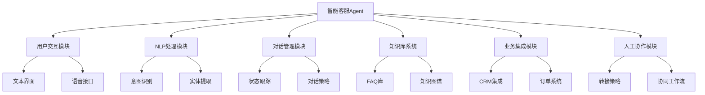

### 概念之间的关系

| 模块 | 主要功能 | 输入 | 输出 | 与其他模块的关系 |
|------|---------|------|------|------------------|
| 用户交互模块 | 处理用户输入输出 | 用户查询 | 系统响应 | 为NLP模块提供输入 |
| NLP处理模块 | 理解用户意图 | 文本/语音 | 结构化数据 | 为对话管理提供分析结果 |
| 对话管理模块 | 控制对话流程 | 意图/实体 | 下一步行动 | 协调其他模块的工作 |
| 知识库系统 | 存储和检索信息 | 查询 | 相关信息 | 为响应生成提供内容 |
| 业务集成模块 | 连接后端系统 | 业务请求 | 业务数据 | 提供实时业务信息 |
| 人工协作模块 | 管理人机交接 | 复杂查询 | 转接决策 | 在自动化和人工间切换 |

### 算法流程图

智能客服 Agent 的基本工作流程：

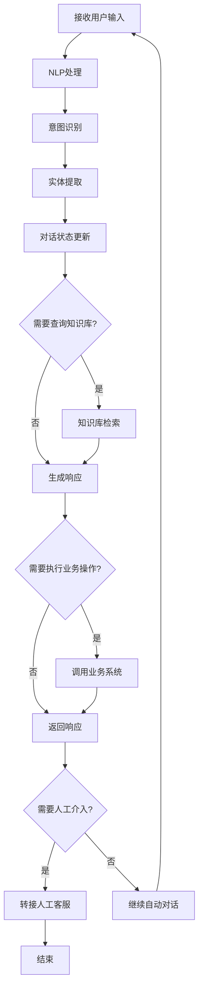

### 算法源代码

以下是一个简化的智能客服 Agent 核心逻辑示例：

```python
import random
from typing import Dict, List

class CustomerServiceAgent:
    def __init__(self):
        self.intents = {
            "greeting": ["hello", "hi", "hey"],
            "farewell": ["bye", "goodbye", "see you"],
            "product_inquiry": ["product", "item", "goods"],
            "order_status": ["order", "delivery", "shipping"]
        }
        self.knowledge_base = {
            "product_inquiry": "We offer a wide range of products. Can you specify which category you're interested in?",
            "order_status": "To check your order status, please provide your order number."
        }
        self.conversation_history = []

    def identify_intent(self, user_input: str) -> str:
        user_input = user_input.lower()
        for intent, keywords in self.intents.items():
            if any(keyword in user_input for keyword in keywords):
                return intent
        return "unknown"

    def generate_response(self, intent: str, user_input: str) -> str:
        if intent == "greeting":
            return random.choice(["Hello!", "Hi there!", "Welcome!"])
        elif intent == "farewell":
            return random.choice(["Goodbye!", "Have a great day!", "See you later!"])
        elif intent in self.knowledge_base:
            return self.knowledge_base[intent]
        else:
            return "I'm not sure how to help with that. Would you like to speak to a human agent?"

    def should_transfer_to_human(self, intent: str, conversation_length: int) -> bool:
        return intent == "unknown" or conversation_length > 5

    def process_input(self, user_input: str) -> str:
        intent = self.identify_intent(user_input)
        self.conversation_history.append({"user": user_input, "intent": intent})
        
        if self.should_transfer_to_human(intent, len(self.conversation_history)):
            return "I'll transfer you to a human agent for better assistance."
        
        response = self.generate_response(intent, user_input)
        self.conversation_history.append({"agent": response})
        return response

# 使用示例
agent = CustomerServiceAgent()
while True:
    user_input = input("User: ")
    if user_input.lower() == "quit":
        break
    response = agent.process_input(user_input)
    print("Agent:", response)
```

### 实际场景应用

1. 电子商务客服：
    - 处理产品查询、订单状态查询、退换货请求
    - 提供个性化产品推荐
    - 处理支付相关问题

2. 银行客服：
    - 账户查询和交易处理
    - 信用卡服务和贷款咨询
    - 安全验证和欺诈预防

3. 技术支持：
    - 故障诊断和问题解决
    - 软件使用指导
    - 升级和维护建议

4. 旅游服务：
    - 旅行计划咨询和预订协助
    - 航班和酒店信息查询
    - 旅游建议和推荐

5. 医疗咨询：
    - 初步症状评估
    - 医疗预约安排
    - 健康信息提供和药物咨询

### 最佳实践 tips

1. 用户体验设计：
    - 提供清晰的使用指南和示例
    - 设计友好的错误处理和反馈机制
    - 支持多种输入方式（文本、语音、图像）

2. 对话流程优化：
    - 设计简洁明了的对话路径
    - 提供上下文相关的建议和选项
    - 实现有效的澄清和确认机制

3. 知识库管理：
    - 建立结构化和易于维护的知识库
    - 实现知识的自动更新和版本控制
    - 利用用户反馈持续优化知识内容

4. 个性化和情感智能：
    - 根据用户历史和偏好调整响应
    - 实现情感识别和相应的情感响应
    - 保持一致的个性和语气

5. 安全性和隐私保护：
    - 实施强大的用户认证机制
    - 确保敏感信息的加密和安全处理
    - 遵守数据保护法规（如GDPR）

6. 性能优化：
    - 使用缓存机制提高响应速度
    - 实现负载均衡以处理高并发
    - 优化NLP模型以减少处理时间

7. 持续学习和改进：
    - 收集和分析用户反馈
    - 实施A/B测试以优化对话策略
    - 定期审查和更新系统功能

### 行业发展与未来趋势

| 时期 | 主要特征 | 关键技术 | 挑战 | 未来展望 |
|------|---------|----------|------|----------|
| 2018-2019 | 基础问答系统 | 规则基础、简单NLP | 理解能力有限 | 更智能的对话 |
| 2020-2021 | 智能对话系统 | 深度学习、意图识别 | 上下文理解 | 个性化服务 |
| 2022-2023 | 多模态交互 | 大语言模型、语音识别 | 跨模态理解 | 情感智能 |
| 2024-2025 (预测) | 认知智能客服 | 知识图谱、因果推理 | 复杂问题解决 | 自主学习能力 |
| 2026+ (展望) | 拟人化智能助手 | AGI技术、脑机接口 | 伦理和信任问题 | 全方位生活助手 |

智能客服 Agent 的发展正经历快速的演变。从早期的简单规则基础系统，到现在的基于大语言模型的智能对话系统，我们看到了显著的进步。这些变化不仅提高了客户服务的质量和效率，还改变了企业与客户互动的方式。

未来的智能客服 Agent 可能会更加注重以下几个方面：

1. 深度个性化：
    - 基于用户画像的定制化服务
    - 预测性需求分析和主动服务
    - 跨渠道一致的个性化体验

2. 情感智能和同理心：
    - 精确的情绪识别和响应
    - 模拟人类情感的交互方式
    - 处理复杂情感状况的能力

3. 多模态和沉浸式体验：
    - 整合文本、语音、视觉的全方位交互
    - AR/VR技术在客服中的应用
    - 自然语言、手势和表情的协同理解

4. 自主学习和持续优化：
    - 从交互中不断学习和改进
    - 自动发现和填补知识gaps
    - 适应新的业务场景和客户需求

5. 高级问题解决能力：
    - 复杂查询的推理和解决
    - 跨领域知识的整合和应用
    - 创造性问题解决方案的生成

6. 无缝人机协作：
    - 智能分流和精准转接
    - 人工客服的AI辅助工具
    - 混合智能服务模式

7. 预测性和主动式服务：
    - 基于数据分析的问题预测
    - 主动提供个性化建议和解决方案
    - 预防性客户关怀策略

随着这些趋势的发展，智能客服 Agent 将从简单的问答系统演变为全方位的客户关系管理助手。它们将能够处理更复杂的查询，提供更个性化的服务，并在企业运营中发挥更重要的角色。这种进步不仅将提高客户满意度，还将帮助企业降低成本，提高运营效率，并获得宝贵的客户洞察。

然而，这种发展也带来了新的挑战，如如何确保AI系统的决策透明度和公平性，如何保护用户隐私，以及如何在自动化和人性化之间取得平衡。未来的智能客服系统需要在提高效率的同时，也注重伦理和可信赖性。

总的来说，智能客服 Agent 的演进将继续重塑企业与客户之间的互动方式。通过提供更智能、更个性化、更有同理心的服务，未来的智能客服系统有望成为企业与客户之间的重要桥梁，为双方创造更大的价值。

## 7.2 意图识别与实体提取

### 核心概念

意图识别和实体提取是自然语言理解（NLU）的核心任务，对于智能客服 Agent 的性能至关重要。意图识别旨在理解用户查询的目的或意图，而实体提取则是从用户输入中识别和提取关键信息。这两个任务共同为 Agent 提供了理解和响应用户查询所需的基础信息。

### 问题背景

随着客户查询的复杂性和多样性不断增加，传统的基于规则或简单机器学习的方法已经难以满足需求。现代智能客服系统需要更先进的NLU技术来准确理解用户意图并提取相关实体，以提供精准的服务。

### 问题描述

1. 如何处理复杂和模糊的用户表达
2. 如何识别多意图查询
3. 如何处理领域特定的实体和术语
4. 如何在意图识别和实体提取之间建立联系
5. 如何处理上下文相关的意图和实体

### 问题解决

我们将从以下几个方面详细探讨意图识别与实体提取：

1. 意图识别方法：
    - 基于规则的方法
    - 机器学习方法（如SVM、随机森林）
    - 深度学习方法（如CNN、LSTM、BERT）

2. 实体提取技术：
    - 基于词典的方法
    - 条件随机场（CRF）
    - 命名实体识别（NER）神经网络模型

3. 多意图识别：
    - 层次分类模型
    - 多标签分类方法
    - 意图排序策略

4. 联合学习模型：
    - 意图-实体联合模型
    - 多任务学习框架

5. 上下文理解：
    - 对话状态跟踪
    - 上下文嵌入技术
    - 长短期记忆管理

### 边界与外延

虽然本节主要关注文本输入的意图识别和实体提取，但也会涉及多模态输入（如语音、图像）的处理。此外，我们还将讨论这些技术如何与对话管理和知识库查询系统集成。

### 概念结构与核心要素组成

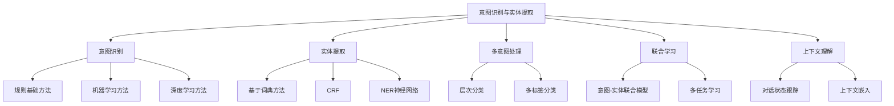

### 概念之间的关系

| 组件 | 主要功能 | 输入 | 输出 | 与其他组件的关系 |
|------|---------|------|------|------------------|
| 意图识别 | 确定用户意图 | 用户查询 | 意图标签 | 指导实体提取和响应生成 |
| 实体提取 | 识别关键信息 | 用户查询 | 结构化实体 | 为意图识别提供补充信息 |
| 多意图处理 | 处理复杂查询 | 用户查询 | 多个意图标签 | 增强意图识别的能力 |
| 联合学习 | 优化意图和实体识别 | 用户查询 | 意图和实体 | 提高整体NLU性能 |
| 上下文理解 | 考虑对话历史 | 当前查询和历史 | 上下文相关的理解 | 增强所有组件的准确性 |

### 算法流程图

意图识别与实体提取的基本流程：

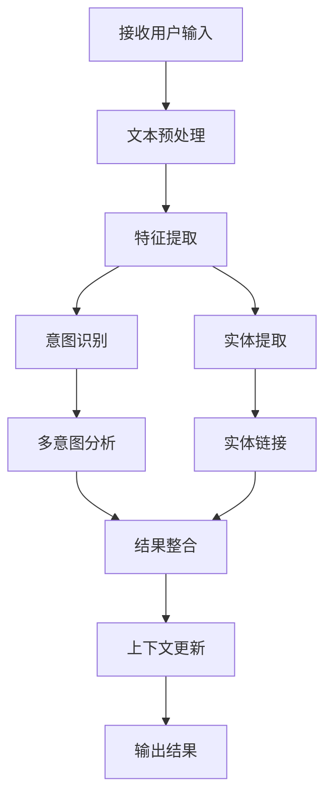

### 算法源代码

以下是一个简化的意图识别和实体提取示例，使用spaCy进行NER和基于规则的意图识别：

```python
import spacy
from typing import Dict, List, Tuple

class IntentEntityExtractor:
    def __init__(self):
        self.nlp = spacy.load("en_core_web_sm")
        self.intent_keywords = {
            "greeting": ["hello", "hi", "hey"],
            "farewell": ["bye", "goodbye", "see you"],
            "product_inquiry": ["product", "item", "price"],
            "order_status": ["order", "delivery", "shipping"]
        }

    def preprocess(self, text: str) -> str:
        return text.lower().strip()

    def identify_intent(self, text: str) -> str:
        for intent, keywords in self.intent_keywords.items():
            if any(keyword in text for keyword in keywords):
                return intent
        return "unknown"

    def extract_entities(self, text: str) -> List[Tuple[str, str]]:
        doc = self.nlp(text)
        return [(ent.text, ent.label_) for ent in doc.ents]

    def process(self, text: str) -> Dict:
        preprocessed_text = self.preprocess(text)
        intent = self.identify_intent(preprocessed_text)
        entities = self.extract_entities(text)
        return {
            "intent": intent,
            "entities": entities
        }

# 使用示例
extractor = IntentEntityExtractor()
user_input = "I want to know the price of the new smartphone"
result = extractor.process(user_input)
print(f"Intent: {result['intent']}")
print(f"Entities: {result['entities']}")
```

### 实际场景应用

1. 客户查询分类：
    - 识别产品信息、订单状态、技术支持等不同类型的查询
    - 提取产品名称、订单号等关键实体

2. 复杂问题解析：
    - 识别多步骤请求中的多个意图
    - 提取请求中的条件和约束实体

3. 个性化服务：
    - 识别用户偏好和习惯相关的意图
    - 提取用户特征和背景信息作为实体

4. 情感分析：
    - 识别投诉、赞美等情感相关意图
    - 提取情感触发词和对象作为实体

5. 多语言支持：
    - 跨语言意图识别
    - 适应不同语言的实体提取模式

### 最佳实践 tips

1. 数据准备：
    - 收集大量真实用户查询数据
    - 确保数据集覆盖各种意图和实体类型
    - 进行细致的数据标注和质量控制

2. 模型选择：
    - 对比不同模型在特定领域的性能
    - 考虑计算资源和响应时间的平衡
    - 选择可解释性强的模型便于调试和优化

3. 特征工程：
    - 利用领域知识设计相关特征
    - 考虑上下文信息作为特征
    - 使用预训练词嵌入提高泛化能力

4. 模型训练：
    - 使用交叉验证评估模型性能
    - 实施正则化技术防止过拟合
    - 采用迁移学习方法提高小样本学习效果

5. 错误分析：
    - 定期进行错误案例分析
    - 识别常见错误模式并针对性优化
    - 建立持续改进的反馈循环

6. 上下文集成：
    - 设计有效的对话状态表示
    - 实现动态的上下文权重调整
    - 考虑长期和短期上下文的影响

7. 实时优化：
    - 实施在线学习机制
    - 利用用户反馈进行实时调整
    - 建立模型性能监控系统

### 行业发展与未来趋势

| 时期 | 主要特征 | 关键技术 | 挑战 | 未来展望 |
|------|---------|----------|------|----------|
| 2018-2019 | 基础NLU | 规则基础、传统ML | 领域适应性 | 更灵活的模型 |
| 2020-2021 | 深度学习NLU | BERT、XLNet | 计算资源需求 | 轻量级高效模型 |
| 2022-2023 | 大规模预训练 | GPT-3、T5 | 微调效率 | 少样本学习 |
| 2024-2025 (预测) | 多模态NLU | 跨模态Transformer | 模态融合 | 通用理解框架 |
| 2026+ (展望) | 认知NLU | 神经符号系统 | 常识推理 | 类人理解能力 |

意图识别和实体提取技术正在经历快速的演变。从早期的基于规则和简单机器学习的方法，到现在的基于深度学习和大规模预训练模型的方法，我们看到了显著的进步。这些进展不仅提高了NLU的准确性和鲁棒性，还扩展了其应用范围。

未来的意图识别和实体提取技术可能会更加注重以下几个方面：

1. 上下文感知理解：
    - 长期对话历史建模
    - 跨会话知识传递
    - 动态上下文适应

2. 多模态融合理解：
    - 文本、语音、图像的联合理解
    - 跨模态信息对齐和互补
    - 多模态上下文推理

3. 低资源和零样本学习：
    - 快速领域适应技术
    - 跨语言和跨领域迁移
    - 元学习和少样本学习方法

4. 可解释性和透明度：
    - 可解释的意图分类和实体识别
    - 决策过程的可视化
    - 置信度估计和不确定性量化

5. 实时学习和适应：
    - 在线学习和持续优化
    - 主动学习策略
    - 动态知识更新

6. 复杂语言现象处理：
    - 隐含意图识别
    - 讽刺和委婉语理解
    - 文化和语境相关表达理解

7. 认知推理集成：
    - 结合常识推理能力
    - 因果关系理解
    - 抽象概念处理

随着这些趋势的发展，意图识别和实体提取技术将变得更加智能、灵活和强大。它们将能够处理更复杂的语言现象，理解更深层的语义和语用信息，并在各种复杂的实际应用场景中表现出色。这种进步将使智能客服系统能够提供更自然、更精准的服务，大大提升用户体验和客户满意度。

然而，这种发展也带来了新的挑战，如如何在提高模型复杂性的同时保持效率，如何确保NLU系统的公平性和包容性，以及如何在隐私和性能之间取得平衡。未来的NLU研究和应用需要在技术创新和负责任的AI原则之间找到平衡点。

总的来说，意图识别和实体提取技术的进步将继续推动智能客服系统向着更智能、更自然的方向发展。通过更好地理解用户需求和上下文，未来的系统将能够提供更个性化、更有价值的服务，并在解决复杂问题和提供决策支持方面发挥越来越重要的作用。

## 7.3 知识库集成与查询

### 核心概念

知识库集成与查询是智能客服 Agent 系统的关键组成部分，它为 Agent 提供回答用户问题所需的信息和知识。一个高效的知识库系统不仅需要存储大量结构化和非结构化数据，还需要能够快速、准确地检索相关信息，并将其与用户查询进行匹配。

### 问题背景

随着企业信息的日益复杂和客户查询的多样化，传统的静态FAQ系统已经无法满足需求。现代智能客服系统需要一个动态、可扩展且智能的知识库解决方案，能够处理各种类型的信息，并支持复杂的查询和推理。### 问题描述

1. 如何构建和组织大规模、多领域的知识库
2. 如何实现高效、准确的知识检索
3. 如何处理非结构化数据和多媒体内容
4. 如何保持知识的时效性和一致性
5. 如何实现知识推理和复杂查询处理

### 问题解决

我们将从以下几个方面详细探讨知识库集成与查询：

1. 知识表示：
    - 本体模型
    - 知识图谱
    - 向量表示

2. 知识组织：
    - 分类体系
    - 标签系统
    - 关系网络

3. 检索技术：
    - 全文搜索（如Elasticsearch）
    - 语义搜索
    - 向量检索

4. 查询处理：
    - 自然语言转结构化查询
    - 查询扩展和重写
    - 多跳推理

5. 知识更新：
    - 自动抽取和集成
    - 版本控制
    - 冲突检测和解决

### 边界与外延

虽然本节主要关注文本基础的知识库，但也会涉及多模态知识（如图像、视频）的管理。此外，我们还将讨论知识库系统如何与其他AI技术（如机器学习、自然语言处理）集成，以提供更智能的服务。

### 概念结构与核心要素组成

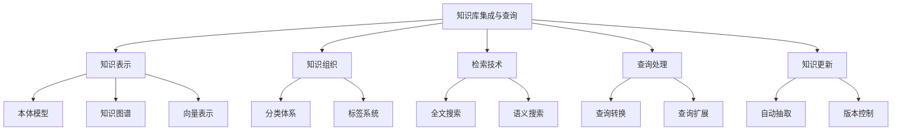

### 概念之间的关系

| 组件 | 主要功能 | 输入 | 输出 | 与其他组件的关系 |
|------|---------|------|------|------------------|
| 知识表示 | 定义知识结构 | 原始数据 | 结构化知识 | 为知识组织和检索提供基础 |
| 知识组织 | 系统化知识 | 结构化知识 | 组织化知识库 | 支持高效检索和查询 |
| 检索技术 | 快速定位信息 | 查询、知识库 | 相关信息 | 为查询处理提供候选答案 |
| 查询处理 | 理解和执行查询 | 用户查询 | 精确答案 | 利用检索结果生成回答 |
| 知识更新 | 维护知识时效性 | 新信息、反馈 | 更新后的知识库 | 确保知识库的准确性和完整性 |

### 算法流程图

知识库查询处理流程：

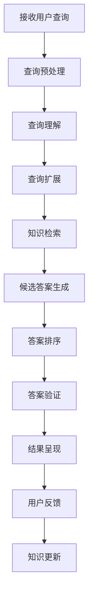

### 算法源代码

以下是一个简化的知识库查询系统示例，使用ElasticSearch作为后端：

```python
from elasticsearch import Elasticsearch
from typing import List, Dict

class KnowledgeBase:
    def __init__(self, index_name: str):
        self.es = Elasticsearch()
        self.index = index_name

    def add_document(self, doc: Dict):
        self.es.index(index=self.index, body=doc)

    def search(self, query: str, top_k: int = 5) -> List[Dict]:
        body = {
            "query": {
                "multi_match": {
                    "query": query,
                    "fields": ["title", "content"]
                }
            }
        }
        res = self.es.search(index=self.index, body=body, size=top_k)
        return [hit["_source"] for hit in res["hits"]["hits"]]

    def update_document(self, doc_id: str, update_data: Dict):
        self.es.update(index=self.index, id=doc_id, body={"doc": update_data})

class QueryProcessor:
    def __init__(self, knowledge_base: KnowledgeBase):
        self.kb = knowledge_base

    def process_query(self, query: str) -> str:
        # 简化的查询处理
        results = self.kb.search(query)
        if results:
            return results[0]["content"]
        return "Sorry, I couldn't find an answer to your question."

# 使用示例
kb = KnowledgeBase("customer_service_kb")

# 添加一些示例文档
kb.add_document({
    "title": "Return Policy",
    "content": "You can return items within 30 days of purchase."
})

kb.add_document({
    "title": "Shipping Information",
    "content": "We offer free shipping on orders over $50."
})

query_processor = QueryProcessor(kb)

# 处理用户查询
user_query = "What is your return policy?"
answer = query_processor.process_query(user_query)
print(f"User Query: {user_query}")
print(f"Answer: {answer}")
```

### 实际场景应用

1. 产品支持：
    - 存储产品规格、使用说明、常见问题等
    - 支持技术问题诊断和解决方案推荐

2. 客户服务政策：
    - 管理退换货政策、保修信息、账户管理规则等
    - 处理政策相关的复杂查询

3. 多语言支持：
    - 维护多语言版本的知识库
    - 支持跨语言查询和答案生成

4. 个性化推荐：
    - 基于用户历史和偏好的知识推荐
    - 动态调整知识展示顺序

5. 实时信息更新：
    - 集成实时数据源（如库存、价格、促销信息）
    - 确保客户获得最新、最准确的信息

### 最佳实践 tips

1. 知识组织：
    - 建立清晰的知识分类体系
    - 使用标准化的元数据标记
    - 建立知识单元之间的关联关系

2. 检索优化：
    - 实现多字段和多维度搜索
    - 使用同义词扩展提高召回率
    - 实施高级排序算法提高精确度

3. 知识更新：
    - 建立定期审核和更新机制
    - 实现自动化的知识抽取和集成
    - 利用用户反馈持续优化知识内容

4. 性能优化：
    - 使用缓存技术加速常见查询
    - 实施分布式索引提高并发处理能力
    - 优化大规模数据的存储和检索策略

5. 安全性：
    - 实施细粒度的访问控制
    - 加密敏感信息
    - 建立审计日志系统

6. 集成性：
    - 设计标准化的API接口
    - 支持多种数据格式和协议
    - 实现与其他系统的无缝集成

7. 可扩展性：
    - 采用模块化设计
    - 支持动态扩展知识领域
    - 设计支持大规模数据的架构

### 行业发展与未来趋势

| 时期 | 主要特征 | 关键技术 | 挑战 | 未来展望 |
|------|---------|----------|------|----------|
| 2018-2019 | 结构化知识库 | 关系数据库、全文搜索 | 知识组织 | 更灵活的知识表示 |
| 2020-2021 | 语义知识库 | 知识图谱、向量检索 | 知识关联 | 多模态知识融合 |
| 2022-2023 | 智能知识库 | 神经检索、预训练模型 | 知识推理 | 自主学习能力 |
| 2024-2025 (预测) | 认知知识库 | 神经符号系统、元学习 | 常识整合 | 类人知识处理 |
| 2026+ (展望) | 自适应知识生态 | AGI技术、群体智能 | 知识创新 | 自主知识进化 |

知识库集成与查询技术正在经历快速的演变。从早期的静态、结构化知识库，到现在的动态、智能化知识系统，我们看到了显著的进步。这些变化不仅提高了知识管理和检索的效率，还扩展了知识应用的范围和深度。

未来的知识库系统可能会更加注重以下几个方面：

1. 动态知识获取与更新：
    - 实时知识抽取和集成
    - 主动学习和知识gap填充
    - 知识时效性的自动管理

2. 多模态知识表示：
    - 文本、图像、视频等多模态知识的统一表示
    - 跨模态知识关联和推理
    - 多感官信息的综合处理

3. 深度语义理解：
    - 上下文感知的知识检索
    - 隐含知识的推断
    - 跨领域知识迁移

4. 认知推理能力：
    - 复杂问题的多步推理
    - 因果关系的理解和应用
    - 抽象概念的处理

5. 个性化知识服务：
    - 用户特定的知识定制
    - 知识推荐的个性化
    - 学习曲线适应

6. 协作式知识构建：
    - 群体智能的知识聚合
    - 知识众包和验证机制
    - 专家-AI协作的知识创新

7. 伦理和隐私考虑：
    - 知识来源的透明度
    - 隐私保护的知识处理
    - 公平和无偏见的知识应用

随着这些趋势的发展，知识库系统将从静态的信息存储转变为动态的知识生态系统。它们将能够自主学习、推理和创新，为AI系统提供更深层次的智能支持。这种进步将使智能客服系统能够处理更复杂的查询，提供更精准的答案，并在解决问题和决策支持方面发挥更大的作用。

然而，这种发展也带来了新的挑战，如如何管理和整合海量、异构的知识，如何确保知识的准确性和可靠性，以及如何在开放性和安全性之间取得平衡。未来的知识库系统需要在提高能力的同时，也注重可解释性、可信度和伦理性。

总的来说，知识库集成与查询技术的演进将继续推动智能客服系统向着更智能、更全面的方向发展。通过提供更丰富、更精准的知识支持，未来的系统将能够更好地满足客户的多样化需求，提供更高质量的服务体验，并为企业创造更大的价值。

## 7.4 多轮对话管理

### 核心概念

多轮对话管理是智能客服 Agent 系统的核心功能之一，它负责维护对话的上下文，跟踪对话状态，并决定系统在每一轮交互中的最佳响应策略。有效的多轮对话管理能够使 Agent 在复杂的交互过程中保持连贯性和目标导向性，提供更自然、更有效的用户体验。

### 问题背景

随着用户需求的复杂化和 AI 技术的进步，简单的单轮问答已经无法满足现代客服系统的需求。用户往往需要通过多轮交互来澄清需求、获取信息或解决问题。这就要求系统能够理解和维护对话上下文，处理复杂的对话流程，并在整个交互过程中保持连贯性和相关性。### 问题描述

1. 如何有效地表示和更新对话状态
2. 如何处理上下文依赖的查询和指代消解
3. 如何设计灵活的对话策略以适应不同场景
4. 如何处理对话中的主题转换和多任务并行
5. 如何在长对话中保持一致性和相关性

### 问题解决

我们将从以下几个方面详细探讨多轮对话管理：

1. 对话状态跟踪：
    - 基于规则的方法
    - 统计学习方法
    - 深度学习方法（如LSTM、Transformer）

2. 上下文理解：
    - 指代消解
    - 省略补全
    - 上下文相关的意图识别

3. 对话策略：
    - 基于规则的策略
    - 强化学习方法
    - 混合策略

4. 对话流程控制：
    - 状态机模型
    - 基于框架的对话管理
    - 目标导向的对话规划

5. 多任务处理：
    - 任务分解和优先级管理
    - 并行任务执行
    - 任务切换策略

### 边界与外延

虽然本节主要关注文本对话的管理，但也会涉及多模态交互（如语音、图像）的对话管理。此外，我们还将讨论多轮对话管理如何与其他模块（如NLU、知识库查询）协同工作，以提供整体的智能客服解决方案。

### 概念结构与核心要素组成

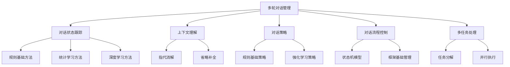

### 概念之间的关系

| 组件 | 主要功能 | 输入 | 输出 | 与其他组件的关系 |
|------|---------|------|------|------------------|
| 对话状态跟踪 | 维护对话信息 | 用户输入、系统动作 | 更新后的状态 | 为其他组件提供上下文 |
| 上下文理解 | 解析上下文相关表达 | 当前输入、历史状态 | 完整语义表示 | 增强NLU的理解能力 |
| 对话策略 | 决定下一步行动 | 当前状态、目标 | 系统动作 | 指导对话流程控制 |
| 对话流程控制 | 管理对话进程 | 系统动作、对话状态 | 执行指令 | 协调各组件的工作 |
| 多任务处理 | 处理并行任务 | 多个用户目标 | 任务执行计划 | 影响对话策略和流程 |

### 算法流程图

多轮对话管理的基本流程：

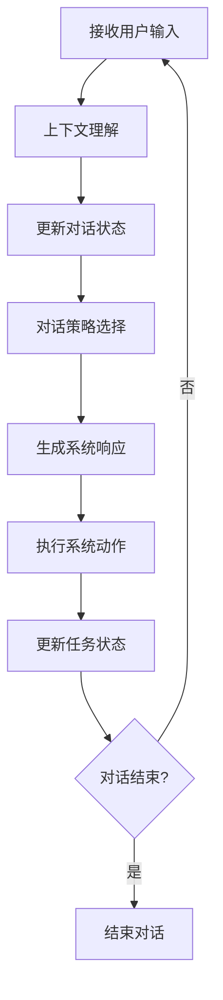

### 算法源代码

以下是一个简化的多轮对话管理系统示例：

```python
from typing import Dict, List

class DialogueManager:
    def __init__(self):
        self.state = {}
        self.history = []

    def update_state(self, user_input: str, nlu_result: Dict):
        # 更新对话状态
        self.state.update(nlu_result)
        self.history.append({"user": user_input, "nlu": nlu_result})

    def get_context(self) -> List[Dict]:
        # 返回最近的对话历史作为上下文
        return self.history[-3:]

    def select_action(self) -> str:
        # 简化的对话策略
        if "intent" not in self.state:
            return "I'm not sure what you mean. Can you please clarify?"
        
        intent = self.state["intent"]
        if intent == "greeting":
            return "Hello! How can I assist you today?"
        elif intent == "product_inquiry":
            if "product" in self.state:
                return f"Sure, I can help you with information about {self.state['product']}. What would you like to know?"
            else:
                return "Which product are you interested in?"
        elif intent == "farewell":
            return "Thank you for chatting with me. Have a great day!"
        else:
            return "I'm sorry, I don't have information about that. Is there anything else I can help with?"

    def process_turn(self, user_input: str, nlu_result: Dict) -> str:
        self.update_state(user_input, nlu_result)
        action = self.select_action()
        self.history.append({"system": action})
        return action

# 使用示例
dm = DialogueManager()

# 模拟对话
turns = [
    ("Hello", {"intent": "greeting"}),
    ("I want to know about your smartphones", {"intent": "product_inquiry", "product": "smartphones"}),
    ("What's the battery life?", {"intent": "product_inquiry", "aspect": "battery_life"}),
    ("Thank you, goodbye", {"intent": "farewell"})
]

for user_input, nlu_result in turns:
    print(f"User: {user_input}")
    response = dm.process_turn(user_input, nlu_result)
    print(f"System: {response}")
    print()
```

### 实际场景应用

1. 复杂查询处理：
    - 分步骤收集用户需求信息
    - 处理多个相关问题的连续查询
    - 澄清和确认模糊或不完整的信息

2. 个性化推荐：
    - 基于对话历史进行产品或服务推荐
    - 动态调整推荐策略
    - 处理用户偏好的变化

3. 问题诊断和故障排除：
    - 引导用户完成多步骤的诊断流程
    - 根据用户反馈动态调整诊断路径
    - 处理复杂的条件分支和异常情况

4. 订单处理和跟踪：
    - 管理从询价到下单的完整流程
    - 处理订单修改和取消请求
    - 提供多阶段的订单状态更新

5. 客户投诉处理：
    - 引导用户详细描述问题
    - 协调多部门参与的复杂投诉处理
    - 跟踪和更新投诉解决进度

### 最佳实践 tips

1. 状态表示：
    - 使用结构化的状态表示方法
    - 包含显式和隐式的对话信息
    - 定期清理和更新状态以避免信息过载

2. 上下文管理：
    - 实现滑动窗口机制管理对话历史
    - 使用注意力机制关注相关上下文
    - 考虑长期和短期记忆的平衡

3. 策略设计：
    - 结合规则和学习方法的混合策略
    - 实现渐进式的信息获取策略
    - 设计错误恢复和回退机制

4. 流程控制：
    - 使用灵活的对话框架支持复杂交互
    - 实现动态的子对话管理
    - 设计清晰的对话终止条件

5. 多任务协调：
    - 实现任务优先级队列
    - 设计平滑的任务切换机制
    - 支持任务的暂停和恢复

6. 用户体验优化：
    - 提供清晰的对话进度指示
    - 实现适当的主动澄清和确认
    - 保持对话的自然流畅性

7. 性能和可扩展性：
    - 优化状态更新和策略选择的效率
    - 实现分布式对话管理以支持高并发
    - 使用缓存机制提高响应速度

### 行业发展与未来趋势

| 时期 | 主要特征 | 关键技术 | 挑战 | 未来展望 |
|------|---------|----------|------|----------|
| 2018-2019 | 基于规则的对话管理 | 状态机、对话树 | 灵活性限制 | 更智能的对话流程 |
| 2020-2021 | 数据驱动的对话系统 | 端到端神经网络、强化学习 | 长对话一致性 | 上下文感知对话 |
| 2022-2023 | 大模型辅助对话 | GPT-3、few-shot learning | 控制和可解释性 | 认知对话系统 |
| 2024-2025 (预测) | 多模态对话管理 | 跨模态学习、情境感知 | 模态融合 | 拟人化交互 |
| 2026+ (展望) | 认知对话系统 | AGI技术、心智理论模型 | 通用对话能力 | 类人对话智能 |

多轮对话管理技术正在经历快速的演变。从早期的基于规则的简单系统，到现在的基于深度学习和大规模语言模型的复杂系统，我们看到了显著的进步。这些变化不仅提高了系统处理复杂对话的能力，还改变了我们对人机对话本质的理解。

未来的多轮对话管理系统可能会更加注重以下几个方面：

1. 深度上下文理解：
    - 长期对话历史的有效建模
    - 隐含信息的推理和利用
    - 跨会话知识的积累和应用

2. 动态策略适应：
    - 实时学习和策略调整
    - 个性化的对话风格适应
    - 多目标优化的对话策略

3. 情感和社交智能：
    - 情感状态的识别和响应
    - 社交规范和礼仪的遵守
    - 建立和维护长期"关系"

4. 多模态交互管理：
    - 语音、文本、视觉信息的综合处理
    - 手势和表情的理解和生成
    - 虚拟和增强现实中的对话管理

5. 认知推理能力：
    - 常识推理在对话中的应用
    - 因果关系的理解和利用
    - 抽象概念的处理和交流

6. 自主学习和适应：
    - 从交互中持续学习新知识
    - 自动发现和纠正对话策略的错误
    - 适应新的领域和任务

7. 伦理和安全考虑：
    - 隐私保护的对话管理
    - 偏见检测和公平性保证
    - 安全和道德边界的自我监管

随着这些趋势的发展，多轮对话管理系统将变得更加智能、自然和适应性强。它们将能够处理更复杂的对话场景，理解更深层的语境和意图，并提供更人性化的交互体验。这种进步将使智能客服系统能够处理更复杂的查询，提供更精准的服务，并在解决问题和决策支持方面发挥更大的作用。

然而，这种发展也带来了新的挑战，如如何在复杂性和可控性之间取得平衡，如何确保AI系统在长期交互中保持一致性和可靠性，以及如何处理潜在的伦理问题。未来的对话系统需要在提高能力的同时，也注重透明度、可解释性和道德责任。

总的来说，多轮对话管理技术的演进将继续推动智能客服系统向着更智能、更自然的方向发展。通过提供更流畅、更有意义的对话体验，未来的系统将能够更好地理解和满足用户需求，提供更高质量的服务，并为企业创造更大的价值。这不仅将改变客户服务的方式，还可能对人机交互的未来产生深远的影响。

## 7.5 情感分析与个性化回复

### 核心概念

情感分析与个性化回复是智能客服 Agent 系统的高级功能，旨在提升用户体验和服务质量。情感分析涉及识别和理解用户在对话中表达的情绪和态度，而个性化回复则是根据用户的特征、偏好和当前情感状态来定制 Agent 的响应。这两个方面的结合使得 Agent 能够更加贴近人类客服的服务水平，提供更有同理心和针对性的支持。

### 问题背景

随着用户对客服体验要求的提高，仅仅提供准确的信息已经不足以满足现代客户的需求。用户期望得到更人性化、更体贴的服务。同时，企业也意识到，通过理解客户情感和提供个性化服务，可以显著提高客户满意度和忠诚度。然而，在大规模客服系统中实现准确的情感分析和恰当的个性化回复仍然面临诸多挑战。

### 问题描述

1. 如何准确识别文本中的情感和态度
2. 如何处理复杂和微妙的情感表达
3. 如何在保持一致性的同时实现个性化回复
4. 如何平衡情感回应和问题解决
5. 如何在隐私保护和个性化之间取得平衡

### 问题解决

我们将从以下几个方面详细探讨情感分析与个性化回复：

1. 情感分析技术：
    - 基于词典的方法
    - 机器学习方法（如SVM、随机森林）
    - 深度学习方法（如CNN、LSTM、BERT）

2. 情感维度：
    - 极性分析（正面、负面、中性）
    - 多类别情感分类
    - 情感强度估计

3. 个性化模型：
    - 用户画像构建
    - 协同过滤推荐
    - 上下文感知的个性化

4. 回复生成策略：
    - 基于模板的方法
    - 检索式方法
    - 生成式方法（如Seq2Seq、Transformer）

5. 情感调节：
    - 情感状态转换策略
    - 同理心表达技巧
    - 情绪缓解方法

### 边界与外延

虽然本节主要关注基于文本的情感分析和个性化回复，但也会涉及多模态情感识别（如语音、面部表情）。此外，我们还将讨论如何将情感分析和个性化技术与其他客服系统组件（如对话管理、知识库查询）集成。

### 概念结构与核心要素组成

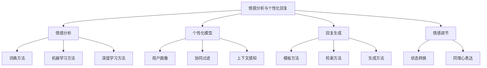

### 概念之间的关系

| 组件 | 主要功能 | 输入 | 输出 | 与其他组件的关系 |
|------|---------|------|------|------------------|
| 情感分析 | 识别用户情感 | 用户文本 | 情感标签/分数 | 为个性化和情感调节提供基础 |
| 个性化模型 | 构建用户特征 | 用户历史、偏好 | 用户画像 | 指导回复生成的个性化 |
| 回复生成 | 创建响应内容 | 查询、上下文、用户画像 | 回复文本 | 整合情感和个性化信息 |
| 情感调节 | 调整回复情感 | 当前情感、目标情感 | 调节策略 | 优化回复的情感效果 |

### 算法流程图

情感分析与个性化回复的基本流程：

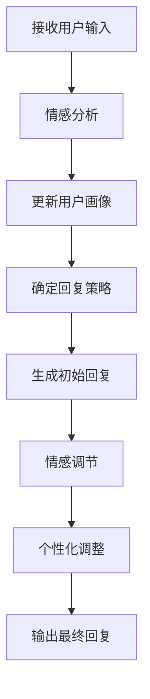

### 算法源代码

以下是一个简化的情感分析与个性化回复系统示例：

```python
import random
from typing import Dict, List

class EmotionAnalyzer:
    def __init__(self):
        self.positive_words = set(["happy", "glad", "satisfied", "great"])
        self.negative_words = set(["sad", "angry", "frustrated", "disappointed"])

    def analyze(self, text: str) -> str:
        words = text.lower().split()
        positive_count = sum(1 for word in words if word in self.positive_words)
        negative_count = sum(1 for word in words if word in self.negative_words)
        
        if positive_count > negative_count:
            return "positive"
        elif negative_count > positive_count:
            return "negative"
        else:
            return "neutral"

class PersonalizationModel:
    def __init__(self):
        self.user_profiles = {}

    def update_profile(self, user_id: str, interaction: Dict):
        if user_id not in self.user_profiles:
            self.user_profiles[user_id] = {"interactions": []}
        self.user_profiles[user_id]["interactions"].append(interaction)

    def get_profile(self, user_id: str) -> Dict:
        return self.user_profiles.get(user_id, {})

class ResponseGenerator:
    def __init__(self):
        self.templates = {
            "positive": [
                "I'm glad to hear that! {}", 
                "That's great news! {}"
            ],
            "negative": [
                "I'm sorry to hear that. {}",
                "I understand your frustration. {}"
            ],
            "neutral": [
                "I see. {}",
                "Understood. {}"
            ]
        }

    def generate(self, emotion: str, message: str) -> str:
        templates = self.templates.get(emotion, self.templates["neutral"])
        return random.choice(templates).format(message)

class EmotionalPersonalizedAgent:
    def __init__(self):
        self.emotion_analyzer = EmotionAnalyzer()
        self.personalization_model = PersonalizationModel()
        self.response_generator = ResponseGenerator()

    def process_input(self, user_id: str, user_input: str) -> str:
        # 分析情感
        emotion = self.emotion_analyzer.analyze(user_input)
        
        # 更新用户画像
        self.personalization_model.update_profile(user_id, {
            "input": user_input,
            "emotion": emotion
        })
        
        # 生成回复
        base_response = "How can I assist you further?"
        personalized_response = self.response_generator.generate(emotion, base_response)
        
        return personalized_response

# 使用示例
agent = EmotionalPersonalizedAgent()

# 模拟对话
conversations = [
    ("user1", "I'm really happy with your service!"),
    ("user2", "This product is terrible, I'm very disappointed."),
    ("user1", "Can you help me with a refund?"),
]

for user_id, user_input in conversations:
    print(f"User {user_id}: {user_input}")
    response = agent.process_input(user_id, user_input)
    print(f"Agent: {response}\n")
```

### 实际场景应用

1. 客户投诉处理：
    - 识别客户的不满情绪
    - 提供同理心回应
    - 根据客户历史定制解决方案

2. 产品推荐：
    - 分析客户对产品的情感倾向
    - 基于客户偏好进行个性化推荐
    - 调整推荐语气以匹配客户情绪

3. 售后支持：
    - 识别客户的急迫或沮丧情绪
    - 提供针对性的技术支持
    - 根据客户技术水平调整解释方式

4. 客户关系管理：
    - 跟踪客户长期情感变化
    - 提供个性化的关怀和回访
    - 预测并主动处理可能的客户流失

5. 营销互动：
    - 分析用户对营销信息的情感反应
    - 个性化营销内容和表达方式
    - 根据用户情感调整营销策略

### 最佳实践 tips

1. 情感分析：
    - 使用多维度情感模型，不仅考虑正负面，还包括具体情绪类别
    - 考虑上下文信息，避免单句误判
    - 定期更新情感词典和模型，适应语言变化

2. 个性化模型：
    - 动态更新用户画像，反映用户偏好的变化
    - 平衡短期和长期用户特征
    - 考虑隐私保护，允许用户控制个人信息使用

3. 回复生成：
    - 保持回复的多样性，避免重复和单调
    - 确保生成内容的准确性和相关性
    - 实现风格一致性，与品牌调性匹配

4. 情感调节：
    - 根据情境选择适当的情感调节策略
    - 避免过度情感化，保持专业性
    - 设置情感升级机制，及时转人工处理

5. 系统集成：
    - 将情感分析结果整合到对话管理流程中
    - 使用情感信息优化知识库检索
    - 将个性化信息用于优化整体服务流程

6. 伦理考虑：
    - 明确告知用户个性化和情感分析的使用
    - 避免操纵用户情绪或利用情感弱点
    - 定期审核系统输出，防止不当或有偏见的回应

7. 持续优化：
    - 收集用户反馈，持续评估情感分析和个性化效果
    - 进行A/B测试，优化情感回应策略
    - 定期分析异常案例，改进系统弱点

### 行业发展与未来趋势

| 时期 | 主要特征 | 关键技术 | 挑战 | 未来展望 |
|------|---------|----------|------|----------|
| 2018-2019 | 基础情感分析 | 词典方法、简单ML | 准确性限制 | 更细粒度的情感识别 |
| 2020-2021 | 深度学习情感分析 | BERT、情感词嵌入 | 上下文理解 | 多模态情感分析 |
| 2022-2023 | 个性化情感交互 | 大规模预训练模型 | 实时性和效率 | 情感智能对话 |
| 2024-2025 (预测) | 情感认知系统 | 神经符号融合、元学习 | 跨文化情感理解 | 同理心AI助手 |
| 2026+ (展望) | 情感智能生态 | AGI、脑机接口 | 情感伦理 | 真正的情感交互 |

情感分析与个性化回复技术正在经历快速的演变。从早期的简单情感极性判断，到现在的复杂情感理解和个性化情感交互，我们看到了显著的进步。这些变化不仅提高了系统理解和回应人类情感的能力，还改变了我们对AI系统在情感交互中角色的认知。

未来的情感分析与个性化回复系统可能会更加注重以下几个方面：

1. 深度情感理解：
    - 微妙情感和复杂情绪的识别
    - 情感的时序动态分析
    - 潜在情感和隐含态度的推断

2. 跨模态情感融合：
    - 整合文本、语音、面部表情的多模态情感分析
    - 情境和环境因素在情感理解中的应用
    - 生理信号在情感识别中的应用

3. 情感智能对话：
    - 长期情感状态的跟踪和管理
    - 情感导向的对话策略
    - 情感共鸣和情感调节能力

4. 超个性化体验：
    - 实时适应用户情感状态的交互方式
    - 基于深度用户洞察的预测性情感响应
    - 跨平台、跨场景的一致性情感体验

5. 情感伦理和隐私：
    - 情感数据的伦理使用框架
    - 用户可控的情感隐私设置
    - 防止情感操纵的安全机制

6. 文化适应性情感交互：
    - 跨文化情感表达的理解和生成
    - 文化特定的情感调节策略
    - 多语言、多文化的情感智能系统

7. 情感健康和福祉：
    - 情感支持和心理健康辅助功能
    - 压力和负面情绪的早期检测和干预
    - 促进积极情绪和心理韧性的交互策略

随着这些趋势的发展，情感分析与个性化回复系统将从简单的情感识别工具演变为复杂的情感智能生态系统。它们将能够更深入地理解人类情感，提供更自然、更有同理心的交互体验，并在各种复杂的社交和服务场景中发挥重要作用。这种进步不仅将提升客户服务质量，还可能对心理健康、教育、娱乐等多个领域产生深远影响。

然而，这种发展也带来了新的挑战，如如何确保AI系统在处理敏感的情感数据时的伦理性和安全性，如何平衡个性化和隐私保护，以及如何处理可能出现的情感依赖等问题。未来的情感智能系统需要在提高能力的同时，也注重责任和可信赖性。

总的来说，情感分析与个性化回复技术的演进将继续推动智能客服系统向着更人性化、更智能的方向发展。通过提供更贴心、更有针对性的服务，未来的系统将能够更好地满足用户的情感需求，提供更高质量的客户体验，并为企业创造更大的价值。这不仅将改变客户服务的方式，还可能对人机交互的本质产生深远的影响，推动我们朝着更加情感智能的技术未来迈进。

## 7.6 与人工坐席协作机制

### 核心概念

与人工坐席协作机制是智能客服 Agent 系统中的关键组成部分，它旨在实现 AI 与人类客服之间的无缝协作，以提供最佳的客户服务体验。这种机制涉及智能分流、实时监控、平滑交接以及协同工作等多个方面，目的是充分发挥 AI 的效率和人类的专业判断能力。

### 问题背景

尽管 AI 技术在客服领域取得了显著进步，但仍然存在许多复杂、敏感或需要人为判断的情况，这些情况需要人工坐席的介入。同时，人工坐席的资源是有限且昂贵的。因此，如何有效地分配和利用这些资源，在 AI 和人工之间建立高效的协作机制，成为现代客服系统面临的重要挑战。

### 问题描述

1. 如何准确判断需要人工介入的情况
2. 如何实现 AI 到人工的平滑交接
3. 如何在人工处理过程中提供 AI 辅助
4. 如何管理和优化 AI-人工混合工作流程
5. 如何评估和持续改进协作机制的效果

### 问题解决

我们将从以下几个方面详细探讨与人工坐席协作机制：

1. 智能分流：
    - 基于规则的分流
    - 机器学习分类模型
    - 实时负载均衡

2. 交接策略：
    - 上下文信息传递
    - 情感状态同步
    - 无缝对话衔接

3. AI 辅助功能：
    - 实时信息检索
    - 回复建议生成
    - 情感分析辅助

4. 协同工作流：
    - 任务分配和管理
    - 实时通信机制
    - 性能监控和评估

5. 持续优化：
    - 反馈收集和分析
    - 模型更新和调优
    - A/B 测试和迭代

### 边界与外延

虽然本节主要关注文本客服的协作机制，但也会涉及语音和视频客服的协作模式。此外，我们还将讨论如何将这种协作机制扩展到其他领域，如技术支持、销售咨询等。

### 概念结构与核心要素组成

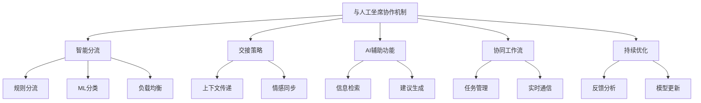

### 概念之间的关系

| 组件 | 主要功能 | 输入 | 输出 | 与其他组件的关系 |
|------|---------|------|------|------------------|
| 智能分流 | 决定处理方式 | 用户查询、系统状态 | 处理决策 | 触发交接策略 |
| 交接策略 | 管理 AI-人工转换 | 对话历史、用户状态 | 交接指令 | 为 AI 辅助提供基础 |
| AI 辅助功能 | 支持人工操作 | 当前查询、知识库 | 辅助信息 | 增强协同工作流 |
| 协同工作流 | 协调 AI 和人工 | 任务信息、资源状态 | 工作安排 | 整合其他所有组件 |
| 持续优化 | 改进系统性能 | 运行数据、反馈 | 优化策略 | 影响所有其他组件 |

### 算法流程图

AI-人工协作的基本流程：

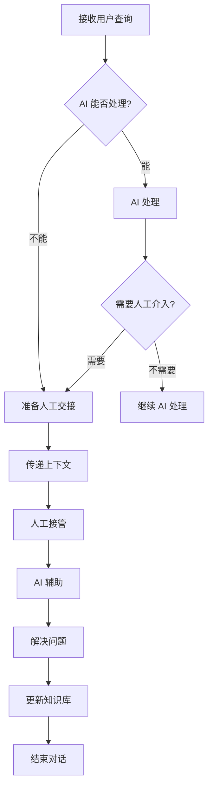

### 算法源代码

以下是一个简化的 AI-人工协作系统示例：

```python
import random
from typing import Dict, List

class AIHumanCollaborationSystem:
    def __init__(self):
        self.ai_capability_threshold = 0.7
        self.human_intervention_threshold = 0.9
        self.knowledge_base = {
            "simple_queries": ["How to reset password", "Check account balance", "Update personal information"],
            "complex_queries": ["Dispute a transaction", "Apply for a loan", "Report fraud"]
        }

    def ai_can_handle(self, query: str) -> bool:
        # 简化的 AI 能力评估
        return any(q in query.lower() for q in self.knowledge_base["simple_queries"])

    def needs_human_intervention(self, query: str, ai_confidence: float) -> bool:
        # 判断是否需要人工介入
        if any(q in query.lower() for q in self.knowledge_base["complex_queries"]):
            return True
        return ai_confidence < self.human_intervention_threshold

    def ai_process(self, query: str) -> Dict:
        # 模拟 AI 处理
        confidence = random.uniform(self.ai_capability_threshold, 1.0)
        response = "Here's the information you requested about: " + query
        return {"response": response, "confidence": confidence}

    def prepare_human_handover(self, query: str, ai_response: Dict) -> Dict:
        # 准备人工交接
        return {
            "original_query": query,
            "ai_response": ai_response["response"],
            "ai_confidence": ai_response["confidence"],
            "context": "User asked about " + query
        }

    def human_process(self, handover_info: Dict) -> str:
        # 模拟人工处理
        return f"Human agent: I've reviewed your query about {handover_info['original_query']}. How can I assist you further?"

    def process_query(self, query: str) -> str:
        if self.ai_can_handle(query):
            ai_response = self.ai_process(query)
            if self.needs_human_intervention(query, ai_response["confidence"]):
                handover_info = self.prepare_human_handover(query, ai_response)
                return self.human_process(handover_info)
            else:
                return ai_response["response"]
        else:
            handover_info = self.prepare_human_handover(query, {"response": "", "confidence": 0})
            return self.human_process(handover_info)

# 使用示例
collaboration_system = AIHumanCollaborationSystem()

queries = [
    "How to reset password",
    "I want to dispute a transaction on my account",
    "What's the weather like today?",
    "I think someone has stolen my credit card"
]

for query in queries:
    print(f"User: {query}")
    response = collaboration_system.process_query(query)
    print(f"System: {response}\n")
```

### 实际场景应用

1. 复杂问题解决：
    - AI 处理初步查询和信息收集
    - 在需要专业判断时无缝转接人工
    - 人工处理时 AI 提供相关信息支持

2. 情感危机处理：
    - AI 识别用户的负面情绪
    - 及时转接到经验丰富的人工坐席
    - AI 辅助人工进行情绪安抚

3. 销售咨询：
    - AI 处理基础产品信息查询
    - 对于复杂定制需求转接销售专员
    - AI 为销售专员提供实时产品对比和建议

4. 技术支持：
    - AI 引导用户进行基本故障排查
    - 对于复杂技术问题转接专业技术人员
    - AI 为技术人员提供相关文档和解决方案

5. 投诉处理：
    - AI 记录初步投诉信息
    - 根据投诉严重程度智能分流到相应级别的人工坐席
    - AI 协助人工快速检索相关政策和处理流程

### 最佳实践 tips

1. 智能分流：
    - 建立动态更新的分流规则库
    - 使用多因素决策模型，考虑查询复杂度、用户情绪、历史交互等
    - 实时监控系统负载，动态调整分流策略

2. 平滑交接：
    - 设计标准化的交接协议，确保信息完整传递
    - 实现对话历史的可视化，帮助人工快速理解上下文
    - 在交接过程中保持对用户的及时反馈

3. AI 辅助：
    - 开发直观的 AI 辅助界面，方便人工坐席快速获取信息
    - 实现智能建议的实时生成和排序
    - 提供 AI 建议的可解释性，帮助人工理解建议依据

4. 协作流程：
    - 设计灵活的任务分配机制，支持动态调整
    - 建立 AI 和人工之间的实时通信渠道
    - 实现任务进度的可视化监控

5. 性能评估：
    - 建立全面的评估指标体系，包括效率、准确性、用户满意度等
    - 实施 A/B 测试，持续优化协作策略
    - 定期进行人工审核，识别系统的优势和不足

6. 持续学习：
    - 建立知识库更新机制，从人工处理中学习新知识
    - 利用人工反馈改进 AI 模型
    - 鼓励人工坐席参与到 AI 系统的改进过程中

7. 隐私和安全：
    - 严格控制敏感信息的访问权限
    - 实施对话内容的加密传输和存储
    - 建立完善的数据使用审计机制

### 行业发展与未来趋势

| 时期 | 主要特征 | 关键技术 | 挑战 | 未来展望 |
|------|---------|----------|------|----------|
| 2018-2019 | 基础协作 | 规则基础分流、简单交接 | 协作效率低 | 更智能的分工 |
| 2020-2021 | 智能协作 | ML分类、上下文传递 | 信息整合 | 无缝衔接 |
| 2022-2023 | 深度协作 | NLP辅助、实时优化 | 协作流畅度 | 主动协作 |
| 2024-2025 (预测) | 认知协作 | 情境感知、预测性分析 | 决策透明度 | 拟人化协作 |
| 2026+ (展望) | 共生协作 | AGI、人机融合界面 | 角色定位 | 真正的人机共生 |

AI 与人工坐席的协作机制正在经历快速的演变。从早期的简单任务分配，到现在的智能化、深度协作模式，我们看到了显著的进步。这些变化不仅提高了客服系统的整体效率和服务质量，还重新定义了 AI 和人类在服务过程中的角色。

未来的 AI-人工协作系统可能会更加注重以下几个方面：

1. 预测性协作：
    - 基于历史数据预测可能需要人工介入的情况
    - 主动准备相关资源和信息
    - 实现更加前瞻性的任务分配

2. 情境感知协作：
    - 深度理解当前服务情境和用户需求
    - 动态调整 AI 和人工的角色和职责
    - 根据实时情况优化协作策略

3. 增强人工能力：
    - 开发更先进的 AI 辅助工具，如实时语言翻译、情感分析等
    - 利用 AR/VR 技术增强人工坐席的信息获取和处理能力
    - 智能培训系统，持续提升人工坐席的技能

4. 自适应学习系统：
    - AI 系统从人工处理中持续学习和改进
    - 动态更新知识库和处理策略
    - 实现 AI 能力的渐进式提升

5. 无缝用户体验：
    - 消除 AI 和人工之间交接的感知断层
    - 个性化的服务连续性，跨越 AI 和人工坐席
    - 统一的服务品质和风格

6. 协作伦理和信任：
    - 建立 AI-人工协作的伦理准则
    - 提高 AI 决策的透明度和可解释性
   - 培养用户对 AI-人工混合服务模式的信任

7. 全渠道协作：
    - 跨平台、跨设备的无缝协作
    - 整合语音、文本、视频等多种交互方式
    - 实现全渠道的一致性服务体验

随着这些趋势的发展，AI 与人工坐席的协作将变得更加智能、自然和高效。未来的协作系统将不再是简单的任务分配和交接，而是一个高度集成、相互增强的共生系统。AI 将成为人工坐席的得力助手和智能伙伴，而人工坐席则为 AI 系统提供难以复制的专业判断和情感智慧。

这种深度协作模式将带来多方面的益处：

1. 服务质量提升：通过结合 AI 的效率和人类的洞察力，提供更高质量、更个性化的服务。

2. 资源优化：更精准的任务分配和 AI 辅助将大幅提高人力资源的利用效率。

3. 员工体验改善：AI 承担重复性工作，使人工坐席能够专注于更有价值、更具挑战性的任务。

4. 持续学习和进化：人机协作将创造一个不断学习和改进的生态系统，推动服务能力的持续提升。

5. 创新服务模式：深度协作将催生新的服务模式和业务机会，如超个性化咨询、预测性客户关怀等。

然而，这种发展也带来了新的挑战，如如何在提高自动化程度的同时保持服务的人性化，如何平衡效率和个性化，以及如何处理可能出现的伦理问题。未来的 AI-人工协作系统需要在技术创新和人文关怀之间找到平衡，确保技术进步能够真正增强而不是取代人类的价值。

总的来说，AI 与人工坐席的协作机制的演进将继续重塑客户服务行业。通过建立更智能、更协调的协作模式，未来的客服系统将能够提供前所未有的服务体验，满足日益增长的客户期望，同时也为企业创造更大的价值。这不仅将提高客户满意度和忠诚度，还将为整个服务行业带来革命性的变革，推动我们迈向一个人机协作的新时代。
