# 第8章：智能办公助手 Agent 开发

## 8.1 日程管理与提醒

### 核心概念

智能办公助手中的日程管理与提醒功能是一个关键组件，旨在帮助用户有效地规划时间、管理任务和保持工作生活的平衡。这个模块不仅仅是简单的日历应用，而是一个智能系统，能够理解用户的习惯、优先级和上下文，主动提供个性化的日程安排和及时的提醒服务。

### 问题背景

在当今快节奏的工作环境中，有效的时间管理变得越来越重要。传统的日程管理工具往往缺乏智能性和灵活性，无法适应现代职场人士复杂多变的需求。用户需要一个能够理解他们个人和职业生活nuances的智能助手，不仅能够帮助他们管理时间，还能预测潜在的冲突，提供智能建议，并与其他工作流程无缝集成。

### 问题描述

1. 如何智能地解析和理解用户的日程需求
2. 如何处理复杂的重复性事件和例外情况
3. 如何在多个日历和时区之间同步和协调日程
4. 如何根据用户的行为模式和偏好提供个性化的日程建议
5. 如何实现智能的提醒机制，既不打扰用户，又能确保重要事项不被遗漏

### 问题解决

我们将从以下几个方面详细探讨日程管理与提醒功能的开发：

1. 自然语言处理：
    - 意图识别
    - 实体提取（日期、时间、地点、人物等）
    - 上下文理解

2. 智能日程规划：
    - 优先级分析
    - 时间冲突检测和解决
    - 智能时间分配

3. 个性化推荐：
    - 用户行为分析
    - 基于历史数据的模式识别
    - 动态调整建议策略

4. 多源数据集成：
    - 日历同步
    - 外部数据源整合（如天气、交通信息）
    - 跨平台数据一致性维护

5. 智能提醒系统：
    - 上下文感知提醒
    - 多模态提醒（文本、语音、推送等）
    - 提醒优先级和频率自适应

### 边界与外延

虽然本节主要关注日程管理与提醒功能，但也会涉及与其他办公功能的集成，如任务管理、会议安排等。此外，我们还将讨论如何将这些功能与企业现有的工作流程和系统进行无缝对接。

### 概念结构与核心要素组成

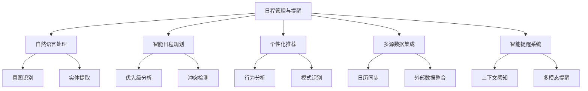

### 概念之间的关系

| 组件 | 主要功能 | 输入 | 输出 | 与其他组件的关系 |
|------|---------|------|------|------------------|
| 自然语言处理 | 理解用户指令 | 用户文本/语音输入 | 结构化日程数据 | 为智能规划提供基础 |
| 智能日程规划 | 优化日程安排 | 结构化日程数据 | 优化后的日程计划 | 利用个性化推荐进行调整 |
| 个性化推荐 | 提供定制建议 | 用户历史数据 | 推荐结果 | 影响日程规划和提醒策略 |
| 多源数据集成 | 整合各类信息 | 多个数据源 | 统一的数据视图 | 为其他所有组件提供数据支持 |
| 智能提醒系统 | 发送智能提醒 | 日程数据、上下文信息 | 定制化提醒 | 基于其他组件的输出执行提醒 |

### 算法流程图

日程管理与提醒的基本流程：

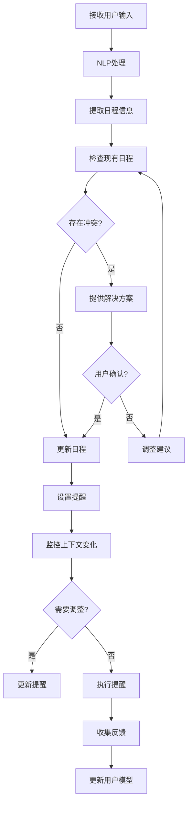

### 算法源代码

以下是一个简化的日程管理与提醒系统示例：

```python
import datetime
from typing import List, Dict

class ScheduleManager:
    def __init__(self):
        self.schedules = []
        self.reminders = []

    def add_event(self, event: Dict):
        # 检查冲突
        if self.check_conflict(event):
            return False
        self.schedules.append(event)
        self.set_reminder(event)
        return True

    def check_conflict(self, new_event: Dict) -> bool:
        for event in self.schedules:
            if (event['start'] <= new_event['start'] < event['end']) or \
               (event['start'] < new_event['end'] <= event['end']):
                return True
        return False

    def set_reminder(self, event: Dict):
        reminder_time = event['start'] - datetime.timedelta(minutes=30)
        self.reminders.append({
            'time': reminder_time,
            'message': f"Reminder: {event['title']} starts in 30 minutes"
        })

    def get_upcoming_events(self, days: int = 7) -> List[Dict]:
        now = datetime.datetime.now()
        future = now + datetime.timedelta(days=days)
        return [event for event in self.schedules if now <= event['start'] < future]

    def get_due_reminders(self) -> List[Dict]:
        now = datetime.datetime.now()
        due_reminders = [r for r in self.reminders if r['time'] <= now]
        self.reminders = [r for r in self.reminders if r['time'] > now]
        return due_reminders

class NLPProcessor:
    def extract_event_info(self, text: str) -> Dict:
        # 这里应该使用更复杂的NLP技术，这只是一个简化示例
        words = text.split()
        return {
            'title': ' '.join(words[2:]),
            'start': datetime.datetime.now() + datetime.timedelta(hours=1),
            'end': datetime.datetime.now() + datetime.timedelta(hours=2)
        }

class IntelligentScheduleAssistant:
    def __init__(self):
        self.schedule_manager = ScheduleManager()
        self.nlp_processor = NLPProcessor()

    def process_command(self, command: str) -> str:
        event_info = self.nlp_processor.extract_event_info(command)
        if self.schedule_manager.add_event(event_info):
            return f"Event '{event_info['title']}' has been scheduled."
        else:
            return "Sorry, there is a conflict with existing events."

    def check_reminders(self) -> List[str]:
        return [r['message'] for r in self.schedule_manager.get_due_reminders()]

# 使用示例
assistant = IntelligentScheduleAssistant()

# 添加事件
print(assistant.process_command("Schedule a meeting with John tomorrow"))

# 检查提醒
reminders = assistant.check_reminders()
for reminder in reminders:
    print(reminder)

# 获取未来事件
upcoming_events = assistant.schedule_manager.get_upcoming_events()
for event in upcoming_events:
    print(f"Upcoming: {event['title']} at {event['start']}")
```

### 实际场景应用

1. 智能会议安排：
    - 自动找出与会者的共同可用时间
    - 考虑travel time和准备时间
    - 根据会议性质选择合适的地点或虚拟会议平台

2. 工作-生活平衡管理：
    - 智能分配工作和个人时间
    - 提醒用户休息和锻炼时间
    - 根据用户的压力水平调整日程密度

3. 项目截止日期管理：
    - 自动分解大型项目为小任务
    - 根据优先级和依赖关系安排任务
    - 动态调整计划以应对延迟或变更

4. 旅行规划助手：
    - 整合航班、酒店和会议信息
    - 考虑时区变化自动调整日程
    - 提供当地天气和交通信息的智能提醒

5. 团队协作日程：
    - 协调多人日程，找出最佳会面时间
    - 智能分配团队任务和资源
    - 提供团队进度和里程碑的可视化视图

### 最佳实践 tips

1. 用户习惯学习：
    - 分析用户的日程模式和偏好
    - 使用机器学习算法预测用户行为
    - 逐步调整系统以适应用户的独特需求

2. 上下文感知：
    - 考虑位置、设备使用情况等上下文信息
    - 根据当前活动调整提醒方式和时机
    - 利用传感器数据增强情境理解

3. 智能冲突解决：
    - 提供多个备选方案解决日程冲突
    - 学习用户的冲突解决偏好
    - 自动协商和重新安排低优先级事项

4. 自然语言交互优化：
    - 支持多语言和方言理解
    - 处理模糊和不完整的时间表达
    - 提供友好的对话式交互体验

5. 隐私和安全：
    - 实施强大的数据加密和访问控制
    - 允许用户精细控制数据共享设置
    - 遵守数据保护法规（如GDPR）

6. 与其他系统集成：
    - 无缝对接企业邮件和协作工具
    - 集成项目管理和任务跟踪系统
    - 支持第三方插件和自定义扩展

7. 性能和可靠性：
    - 优化算法以处理大量日程数据
    - 实现高可用性和数据同步机制
    - 提供离线访问和操作能力

### 行业发展与未来趋势

| 时期 | 主要特征 | 关键技术 | 挑战 | 未来展望 |
|------|---------|----------|------|----------|
| 2018-2019 | 基础智能日历 | 简单NLP、规则基础推荐 | 用户采纳度 | 更智能的个性化 |
| 2020-2021 | AI辅助调度 | 机器学习、预测分析 | 准确性和隐私 | 跨平台集成 |
| 2022-2023 | 上下文感知系统 | 深度学习、IoT集成 | 复杂场景处理 | 全方位生活助手 |
| 2024-2025 (预测) | 认知日程管理 | 强化学习、知识图谱 | 伦理决策 | 自主决策能力 |
| 2026+ (展望) | 拟人化时间管家 | AGI、脑机接口 | 人机协作平衡 | 无缝生活-工作整合 |

日程管理与提醒技术正在经历快速的演变。从简单的电子日历到现在的AI驱动的智能时间管理系统，我们看到了显著的进步。这些变化不仅提高了个人和团队的工作效率，还改变了人们管理时间和平衡生活的方式。

未来的日程管理与提醒系统可能会更加注重以下几个方面：

1. 预测性规划：
    - 基于历史数据和外部因素预测未来工作负载
    - 主动建议任务重新安排以优化整体效率
    - 预测并提前解决潜在的日程冲突

2. 全面生活管理：
    - 整合工作、个人和家庭生活的全方位日程
    - 智能平衡各个生活领域，促进整体幸福感
    - 考虑心理健康和压力管理的智能建议

3. 协作智能：
    - 跨团队和组织的智能日程协调
    - 考虑团队动态和个人偏好的最优会议安排
    - 智能资源分配和任务分派

4. 情境自适应：
    - 根据位置、活动和生理状态动态调整日程
    - 考虑环境因素（如交通、天气）自动优化安排
    - 实时响应突发事件，灵活调整计划

5. 增强现实集成：
    - AR界面提供直观的时间管理可视化
    - 实时导航到下一个日程地点
    - 虚拟助手提供面对面的日程建议和提醒

6. 认知负荷管理：
    - 智能评估和分配认知密集型任务
    - 根据用户的注意力和能量水平优化日程
    - 提供专注时间和休息建议以最大化生产力

7. 伦理时间管理：
    - 考虑个人价值观和长期目标的日程安排
    - 平衡效率和人际关系的智能决策
    - 促进可持续和有意义的时间利用

随着这些趋势的发展，日程管理与提醒系统将从简单的时间跟踪工具演变为全面的生活管理平台。它们将能够更深入地理解用户的需求和目标，提供更智能、更个性化的时间管理解决方案，并在工作效率和生活质量之间取得更好的平衡。

这种进步将带来多方面的益处：

1. 提高生产力：通过智能规划和优化，帮助用户更有效地利用时间。

2. 减少压力：自动化日常规划任务，减轻认知负担。

3. 改善决策：提供数据驱动的洞察，帮助用户做出更明智的时间分配决策。

4. 促进协作：优化团队互动和资源利用，提高组织效率。

5. 增强生活质量：帮助用户在工作、个人发展和休闲之间取得更好的平衡。

然而，这种发展也带来了新的挑战，如如何在提供个性化服务的同时保护用户隐私，如何平衡自动化和用户控制，以及如何处理复杂的伦理决策。未来的日程管理系统需要在技术创新和人文关怀之间找到平衡，确保技术进步能够真正增强人类的能力和幸福感。

总的来说，日程管理与提醒技术的演进将继续深刻影响人们的工作和生活方式。通过提供更智能、更全面的时间管理解决方案，这些系统将帮助人们更好地掌控自己的时间，实现个人和职业目标，并在快节奏的现代生活中找到平衡和满足感。这不仅将提高个人和组织的效率，还将为创造更健康、更充实的生活方式铺平道路。

## 8.2 邮件处理与自动回复

### 核心概念

邮件处理与自动回复是智能办公助手的关键功能之一，旨在帮助用户高效管理电子邮件，减少处理邮件的时间和精力。这个模块不仅仅是简单的邮件分类或模板回复，而是一个智能系统，能够理解邮件内容、识别重要性和紧急程度、自动生成合适的回复，并协助用户进行后续操作。

### 问题背景

在当今的商业环境中，电子邮件仍然是主要的通信方式之一。然而，随着邮件数量的激增，管理和回复邮件已成为许多职场人士的一大负担。传统的邮件客户端缺乏智能处理能力，无法有效地过滤垃圾邮件、识别重要信息、或生成个性化回复。用户需要一个能够理解邮件上下文、自动处理常规邮件、并为复杂邮件提供智能建议的助手。

### 问题描述

1. 如何准确分类和优先排序大量incoming邮件
2. 如何有效识别邮件的意图和关键信息
3. 如何生成自然、个性化且符合上下文的自动回复
4. 如何处理复杂的多轮邮件对话
5. 如何在自动化和用户控制之间取得平衡

### 问题解决

我们将从以下几个方面详细探讨邮件处理与自动回复功能的开发：

1. 邮件分类与优先级排序：
    - 基于内容的分类
    - 发件人重要性分析
    - 紧急度评估

2. 自然语言理解：
    - 意图识别
    - 实体提取
    - 情感分析

3. 自动回复生成：
    - 基于模板的生成
    - 神经网络生成模型
    - 上下文感知的回复定制

4. 智能邮件管理：
    - 自动归档和标签
    - 任务提取和日程集成
    - 跟进提醒

5. 用户交互与控制：
    - 可解释的AI决策
    - 用户反馈学习
    - 自定义规则设置

### 边界与外延

虽然本节主要关注文本邮件的处理，但也会涉及附件处理、多语言支持等扩展功能。此外，我们还将讨论如何将邮件处理系统与其他办公工具（如日程管理、任务跟踪）进行集成，以提供全面的办公自动化解决方案。

### 概念结构与核心要素组成

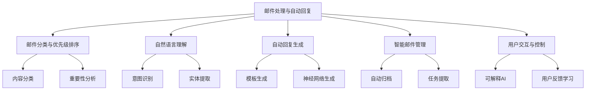

### 概念之间的关系

| 组件 | 主要功能 | 输入 | 输出 | 与其他组件的关系 |
|------|---------|------|------|------------------|
| 邮件分类与优先级排序 | 组织邮件 | 原始邮件 | 分类标签、优先级 | 为其他组件提供基础信息 |
| 自然语言理解 | 解析邮件内容 | 邮件正文 | 结构化信息 | 为自动回复和管理提供输入 |
| 自动回复生成 | 创建回复 | 邮件内容、上下文 | 回复文本 | 使用NLU结果，考虑用户偏好 |
| 智能邮件管理 | 组织和跟进 | 邮件元数据、内容 | 管理操作 | 整合其他组件的输出 |
| 用户交互与控制 | 用户界面和设置 | 用户输入、偏好 | 系统配置、反馈 | 影响所有其他组件的行为 |

### 算法流程图

邮件处理与自动回复的基本流程：

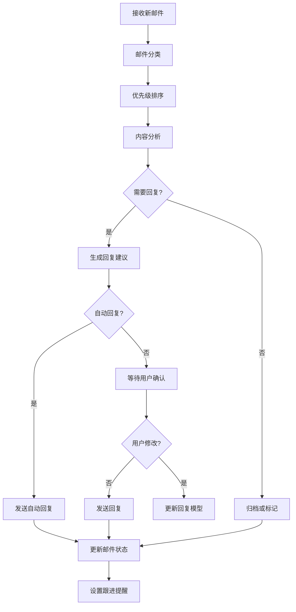

### 算法源代码

以下是一个简化的邮件处理与自动回复系统示例：

```python
import random
from typing import Dict, List

class EmailProcessor:
    def __init__(self):
        self.categories = ["工作", "个人", "新闻订阅", "垃圾邮件"]
        self.priority_levels = ["高", "中", "低"]
        self.auto_reply_templates = {
            "工作": "感谢您的邮件。我已收到并会尽快处理。",
            "个人": "谢谢你的来信，我会在方便的时候回复你。",
            "新闻订阅": "感谢您的订阅，我们会继续为您提供最新资讯。",
        }

    def classify_email(self, email: Dict) -> str:
        # 简化的分类逻辑，实际应使用更复杂的算法
        return random.choice(self.categories)

    def prioritize_email(self, email: Dict, category: str) -> str:
        # 简化的优先级排序逻辑
        if category == "工作":
            return "高"
        elif category == "个人":
            return "中"
        else:
            return "低"

    def generate_reply(self, email: Dict, category: str) -> str:
        return self.auto_reply_templates.get(category, "")

    def process_email(self, email: Dict) -> Dict:
        category = self.classify_email(email)
        priority = self.prioritize_email(email, category)
        reply = self.generate_reply(email, category)
        
        return {
            "category": category,
            "priority": priority,
            "auto_reply": reply,
            "needs_human_attention": category in ["工作", "个人"]
        }

class EmailManager:
    def __init__(self):
        self.processor = EmailProcessor()
        self.inbox = []

    def receive_email(self, email: Dict):
        processed = self.processor.process_email(email)
        self.inbox.append(processed)
        if processed["auto_reply"]:
            self.send_auto_reply(email["from"], processed["auto_reply"])

    def send_auto_reply(self, to: str, reply: str):
        print(f"Sending auto-reply to {to}: {reply}")

    def get_high_priority_emails(self) -> List[Dict]:
        return [e for e in self.inbox if e["priority"] == "高"]

    def get_emails_needing_attention(self) -> List[Dict]:
        return [e for e in self.inbox if e["needs_human_attention"]]

# 使用示例
manager = EmailManager()

# 模拟接收邮件
emails = [
    {"from": "boss@company.com", "subject": "Urgent meeting", "body": "We need to discuss the project ASAP."},
    {"from": "friend@personal.com", "subject": "Weekend plans", "body": "Are you free this Saturday?"},
    {"from": "newsletter@tech.com", "subject": "Weekly Tech News", "body": "Here are the top stories this week."},
]

for email in emails:
    manager.receive_email(email)

# 获取需要注意的邮件
attention_needed = manager.get_emails_needing_attention()
print("\nEmails needing attention:")
for email in attention_needed:
    print(f"Category: {email['category']}, Priority: {email['priority']}")

# 获取高优先级邮件
high_priority = manager.get_high_priority_emails()
print("\nHigh priority emails:")
for email in high_priority:
    print(f"Category: {email['category']}, Subject: {email['subject']}")
```

### 实际场景应用

1. 客户服务邮件处理：
    - 自动分类客户查询类型
    - 生成个性化的初步回复
    - 为复杂问题准备背景信息供人工处理

2. 销售线索管理：
    - 识别潜在客户邮件并优先处理
    - 自动提取关键信息（如预算、时间线）
    - 与CRM系统集成，更新客户状态

3. 项目协调沟通：
    - 自动识别项目相关邮件并分类
    - 提取任务和截止日期信息
    - 生成项目进度报告和提醒

4. 人力资源管理：
    - 处理常见的员工查询（如休假申请、福利问题）
    - 自动回复标准政策相关问题
    - 识别需要保密处理的敏感邮件

5. 新闻媒体监控：
    - 自动分类和汇总新闻稿
    - 识别重要事件和趋势
    - 生成简报供决策者快速浏览

### 最佳实践 tips

1. 智能分类策略：
    - 使用多层分类模型，考虑内容、发件人、上下文等因素
    - 定期更新分类模型以适应新的邮件模式
    - 允许用户轻松纠正错误分类

2. 个性化处理：
    - 学习用户的处理模式和偏好
    - 根据用户角色和职责调整优先级算法
    - 提供个性化的自动回复选项

3. 上下文感知：
    - 考虑邮件线程的历史信息
    - 识别并处理多主题邮件
    - 根据当前工作状态调整处理策略

4. 安全和隐私：
    - 实施强大的加密和访问控制机制
    - 提供敏感信息检测和脱敏功能
    - 遵守数据保护法规（如GDPR）

5. 持续学习和改进：
    - 收集用户反馈以改进自动回复质量
    - 使用A/B测试优化分类和优先级算法
    - 定期审核系统性能并调整策略

6. 无缝集成：
    - 与日历、任务管理等其他办公工具集成
    - 支持多平台和多设备访问
    - 提供API以便与企业现有系统对接

7. 用户控制和透明度：
    - 提供清晰的自动化操作日志
    - 允许用户自定义规则和偏好
    - 为自动决策提供简单的解释和撤销选项

### 行业发展与未来趋势

| 时期 | 主要特征 | 关键技术 | 挑战 | 未来展望 |
|------|---------|----------|------|----------|
| 2018-2019 | 基础自动分类 | 规则基础、简单ML | 准确性有限 | 更智能的分类 |
| 2020-2021 | 智能回复建议 | NLP、深度学习 | 个性化程度 | 上下文理解 |
| 2022-2023 | 自动化工作流 | 大语言模型、知识图谱 | 复杂任务处理 | 全面邮件助手 |
| 2024-2025 (预测) | 认知邮件管理 | 强化学习、因果推理 | 决策透明度 | 自主决策能力 |
| 2026+ (展望) | 拟人化邮件助理 | AGI、情感计算 | 伦理和信任 | 真正的数字秘书 |

邮件处理与自动回复技术正在经历快速的演变。从简单的垃圾邮件过滤到现在的智能邮件管理系统，我们看到了显著的进步。这些变化不仅提高了邮件处理的效率，还改变了人们管理通信和信息的方式。

未来的邮件处理与自动回复系统可能会更加注重以下几个方面：

1. 深度语义理解：
    - 理解复杂的上下文和隐含意图
    - 处理多语言和文化特定的表达
    - 识别讽刺、幽默等微妙的语言特征

2. 预测性邮件管理：
    - 预测可能的后续通信需求
    - 主动建议可能需要的信息或行动
    - 基于历史模式优化邮件处理流程

3. 高度个性化的交互：
    - 适应个人写作风格和沟通偏好
    - 考虑收件人特征定制回复内容
    - 根据用户情绪和工作状态调整互动方式

4. 跨平台智能协作：
    - 无缝整合邮件、即时通讯、项目管理等多个平台
    - 智能协调不同沟通渠道的信息流
    - 提供统一的沟通和任务管理界面

5. 增强现实邮件体验：
    - 使用AR技术可视化邮件数据和工作流
    - 提供沉浸式的邮件组织和浏览体验
    - 支持手势和语音控制的邮件互动

6. 情感智能通信：
    - 识别和响应邮件中的情感因素
    - 提供情感适当的回复建议
    - 帮助用户管理沟通中的情绪影响

7. 自主决策和执行：
    - 自动处理常规邮件和请求
    - 执行复杂的多步骤任务
    - 在授权范围内做出决策并采取行动

随着这些趋势的发展，邮件处理与自动回复系统将从简单的通信工具演变为全面的智能工作助手。它们将能够更深入地理解通信内容和上下文，提供更智能、更个性化的邮件管理解决方案，并在提高工作效率和改善沟通质量方面发挥重要作用。

这种进步将带来多方面的益处：

1. 提高生产力：通过自动化处理常规邮件，让用户专注于高价值任务。

2. 改善沟通质量：提供上下文相关的回复建议，提高沟通的清晰度和效果。

3. 减少压力：帮助用户更好地管理信息过载，减轻邮件处理的心理负担。

4. 增强决策支持：通过智能分析和汇总邮件信息，辅助决策制定。

5. 优化时间管理：将邮件任务与日程安排无缝集成，提高时间利用效率。

然而，这种发展也带来了新的挑战，如如何确保自动化决策的准确性和适当性，如何在效率和个人触感之间取得平衡，以及如何处理涉及隐私和安全的敏感通信。未来的邮件管理系统需要在技术创新和人文关怀之间找到平衡，确保技术进步能够真正增强人类的沟通能力和工作效率。

总的来说，邮件处理与自动回复技术的演进将继续深刻影响现代工作方式。通过提供更智能、更全面的通信管理解决方案，这些系统将帮助用户更有效地处理信息，改善工作流程，并在数字化时代保持高效和有意义的沟通。这不仅将提高个人和组织的生产力，还将为创造更平衡、更有满足感的工作环境铺平道路。

## 8.3 文档摘要与信息提取

### 核心概念

文档摘要与信息提取是智能办公助手的重要功能，旨在帮助用户快速理解和处理大量文本信息。文档摘要涉及自动生成文档的简洁概述，而信息提取则是从文档中识别和抽取特定类型的信息。这两个功能结合起来，可以大大提高信息处理的效率，使用户能够快速把握文档的核心内容和关键信息。

### 问题背景

在信息爆炸的时代，职场人士每天都面临着大量需要阅读和处理的文档，包括报告、论文、新闻文章、合同等。传统的手动阅读和分析方法既耗时又费力，难以应对日益增长的信息量。因此，需要一个能够自动化这个过程的智能系统，帮助用户快速获取文档的要点和关键信息，从而提高工作效率和决策质量。

### 问题描述

1. 如何生成准确、简洁且包含关键信息的文档摘要
2. 如何从不同类型的文档中提取特定的结构化信息
3. 如何处理多语言和跨领域的文档
4. 如何保持摘要的连贯性和可读性
5. 如何根据用户需求和上下文定制摘要和信息提取

### 问题解决

我们将从以下几个方面详细探讨文档摘要与信息提取功能的开发：

1. 文档预处理：
    - 文本清洗和标准化
    - 语言检测
    - 文档结构分析

2. 摘要生成技术：
    - 抽取式摘要
    - 生成式摘要
    - 混合方法

3. 信息提取方法：
    - 命名实体识别（NER）
    - 关系抽取
    - 事件抽取

4. 多语言和跨领域处理：
    - 多语言模型
    - 领域适应技术
    - 迁移学习

5. 用户交互与定制：
    - 摘要长度和风格调整
    - 关键词和主题提取
    - 个性化信息过滤

### 边界与外延

虽然本节主要关注文本文档的处理，但也会涉及多模态文档（如包含图表的报告）的摘要和信息提取。此外，我们还将讨论如何将这些功能与其他办公工具（如知识管理系统、决策支持系统）进行集成，以提供更全面的智能办公解决方案。

### 概念结构与核心要素组成

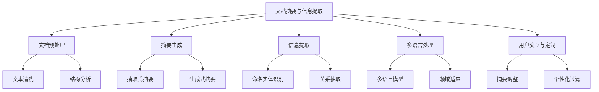

### 概念之间的关系

| 组件 | 主要功能 | 输入 | 输出 | 与其他组件的关系 |
|------|---------|------|------|------------------|
| 文档预处理 | 准备文本 | 原始文档 | 清洗后的结构化文本 | 为其他组件提供基础数据 |
| 摘要生成 | 创建概述 | 预处理后的文本 | 文档摘要 | 使用预处理结果，考虑用户偏好 |
| 信息提取 | 抽取特定信息 | 预处理后的文本 | 结构化信息 | 与摘要生成协同工作 |
| 多语言处理 | 处理不同语言 | 多语言文本 | 统一格式的处理结果 | 影响所有其他组件的处理方式 |
| 用户交互与定制 | 个性化输出 | 用户偏好、反馈 | 定制化结果 | 调整其他组件的行为和输出 |

### 算法流程图

文档摘要与信息提取的基本流程：

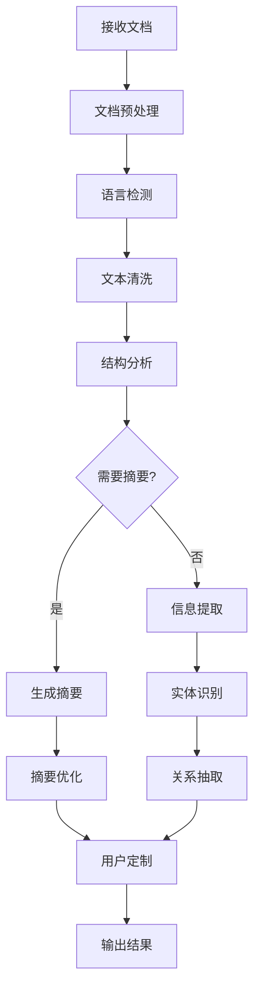

### 算法源代码

以下是一个简化的文档摘要与信息提取系统示例：

```python
import nltk
from nltk.corpus import stopwords
from nltk.tokenize import sent_tokenize, word_tokenize
from nltk.probability import FreqDist
from typing import List, Dict

class DocumentProcessor:
    def __init__(self):
        nltk.download('punkt')
        nltk.download('stopwords')
        self.stop_words = set(stopwords.words('english'))

    def preprocess(self, text: str) -> List[str]:
        sentences = sent_tokenize(text)
        return [self.clean_sentence(sentence) for sentence in sentences]

    def clean_sentence(self, sentence: str) -> str:
        words = word_tokenize(sentence.lower())
        return ' '.join([word for word in words if word.isalnum() and word not in self.stop_words])

    def generate_summary(self, text: str, num_sentences: int = 3) -> str:
        sentences = self.preprocess(text)
        word_freq = FreqDist(word_tokenize(' '.join(sentences)))
        sentence_scores = {sentence: sum(word_freq[word] for word in word_tokenize(sentence))
                           for sentence in sentences}
        summary_sentences = sorted(sentence_scores, key=sentence_scores.get, reverse=True)[:num_sentences]
        return ' '.join(summary_sentences)

    def extract_entities(self, text: str) -> Dict[str, List[str]]:
        # 简化的实体提取，实际应使用更复杂的NER模型
        words = word_tokenize(text)
        entities = {
            'PERSON': [word for word in words if word.istitle() and len(word) > 1],
            'ORGANIZATION': [word for word in words if word.isupper() and len(word) > 1],
            'DATE': [word for word in words if word.replace('/', '').isdigit()]
        }
        return entities

class DocumentAnalyzer:
    def __init__(self):
        self.processor = DocumentProcessor()

    def analyze_document(self, text: str, summary_length: int = 3) -> Dict:
        summary = self.processor.generate_summary(text, summary_length)
        entities = self.processor.extract_entities(text)
        return {
            'summary': summary,
            'entities': entities
        }

# 使用示例
analyzer = DocumentAnalyzer()

sample_text = """
The Eiffel Tower is a wrought-iron lattice tower on the Champ de Mars in Paris, France. 
It is named after the engineer Gustave Eiffel, whose company designed and built the tower. 
Constructed from 1887 to 1889 as the entrance arch to the 1889 World's Fair, it was initially criticized 
by some of France's leading artists and intellectuals for its design, but it has become a global 
cultural icon of France and one of the most recognizable structures in the world. 
The Eiffel Tower is the most-visited paid monument in the world; 6.91 million people ascended it in 2015. 
The tower is 324 metres (1,063 ft) tall, about the same height as an 81-storey building, and the tallest 
structure in Paris. Its base is square, measuring 125 metres (410 ft) on each side.
"""

result = analyzer.analyze_document(sample_text)
print("Summary:")
print(result['summary'])
print("\nExtracted Entities:")
for entity_type, entities in result['entities'].items():
    print(f"{entity_type}: {', '.join(entities)}")
```

### 实际场景应用

1. 新闻摘要：
    - 自动生成新闻文章的简短摘要
    - 提取关键事件、人物和日期信息
    - 根据用户兴趣定制新闻摘要

2. 研究报告分析：
    - 提取研究报告的主要发现和结论
    - 识别关键数据和统计信息
    - 生成报告的执行摘要

3. 法律文档处理：
    - 从合同中提取关键条款和日期
    - 生成法律案例的简要概述
    - 识别文档中的法律实体和关系

4. 客户反馈分析：
    - 从大量客户评论中生成摘要
    - 提取情感倾向和关键问题
    - 识别产品或服务的优势和劣势

5. 技术文档管理：
    - 生成技术规范的简明摘要
    - 提取关键参数和性能指标
    - 识别文档中的技术术语和定义

### 最佳实践 tips

1. 多样化的摘要技术：
    - 结合抽取式和生成式方法
    - 使用不同的算法处理不同类型的文档
    - 实现多级摘要（如标题、短摘要、长摘要）

2. 上下文感知：
    - 考虑文档的结构和格式（如标题、章节）
    - 利用文档元数据增强摘要质量
    - 根据用户的阅读历史调整摘要重点

3. 信息可视化：
    - 使用图表展示关键实体和关系
    - 提供交互式的摘要浏览界面
    - 实现关键词高亮和快速导航

4. 质量控制：
    - 实施摘要评估指标（如ROUGE分数）
    - 使用人工反馈改进摘要质量
    - 定期更新和微调模型

5. 多语言支持：
    - 使用多语言预训练模型
    - 实现跨语言摘要和信息提取
    - 提供语言检测和自动翻译功能

6. 隐私和安全：
    - 实施敏感信息检测和脱敏
    - 提供文档访问控制和审计跟踪
    - 确保摘要不泄露机密信息

7. 与其他系统集成：
    - 与知识管理系统集成，支持知识图谱构建
    - 与搜索引擎集成，提高检索效率
    - 与协作工具集成，支持团队信息共享

### 行业发展与未来趋势

| 时期 | 主要特征 | 关键技术 | 挑战 | 未来展望 |
|------|---------|----------|------|----------|
| 2018-2019 | 基础文本摘要 | 抽取式方法、规则基础NER | 摘要质量 | 更自然的摘要 |
| 2020-2021 | 神经网络摘要 | Seq2Seq、Transformer | 长文本处理 | 多模态摘要 |
| 2022-2023 | 上下文感知摘要 | BERT、GPT | 领域适应 | 个性化摘要 |
| 2024-2025 (预测) | 多模态理解 | 跨模态Transformer | 信息融合 | 智能文档助手 |
| 2026+ (展望) | 认知文档分析 | AGI技术、知识图谱 | 深度理解 | 自主学习系统 |

文档摘要与信息提取技术正在经历快速的演变。从早期的简单关键词提取和句子排序，到现在的深度学习驱动的生成式摘要和复杂信息抽取，我们看到了显著的进步。这些变化不仅提高了摘要的质量和信息提取的准确性，还扩展了这些技术的应用范围。

未来的文档摘要与信息提取系统可能会更加注重以下几个方面：

1. 深度语义理解：
    - 理解文档的隐含意图和上下文
    - 捕捉复杂的逻辑关系和论证结构
    - 处理抽象概念和隐喻表达

2. 多模态融合：
    - 整合文本、图像、表格等多种信息源
    - 生成多模态摘要（如文本+图表）
    - 从视频和音频中提取关键信息

3. 交互式摘要：
    - 允许用户通过对话方式探索文档内容
    - 提供动态调整的摘要视图
    - 支持实时的问答和信息检索

4. 知识增强摘要：
    - 集成外部知识库以增强摘要内容
    - 生成解释性摘要，提供背景信息
    - 自动链接相关文档和资源

5. 个性化和适应性：
    - 根据用户角色和专业水平定制摘要
    - 学习用户偏好，持续优化摘要策略
    - 适应不同场景的摘要需求（如快速浏览vs深入研究）

6. 跨语言和跨文化摘要：
    - 实现高质量的跨语言摘要生成
    - 考虑文化背景差异的信息提取
    - 支持多语言文档的统一分析

7. 伦理和可解释性：
    - 提供摘要生成过程的透明度
    - 确保信息提取的公平性和无偏见
    - 实现可追溯和可审核的摘要系统

随着这些趋势的发展，文档摘要与信息提取系统将从简单的文本处理工具演变为智能的文档理解和知识管理助手。它们将能够更深入地理解文档内容，提供更有洞察力的摘要，并在各种复杂的信息处理任务中发挥关键作用。

这种进步将带来多方面的益处：

1. 提高信息处理效率：帮助用户快速把握大量文档的核心内容。

2. 增强决策支持：通过提供关键信息和见解，辅助更明智的决策制定。

3. 促进知识发现：揭示文档间的隐藏联系，推动新知识的产生。

4. 改善信息获取：使专业知识更容易被理解和获取。

5. 支持跨领域协作：通过智能摘要bridging不同专业领域的沟通。

然而，这种发展也带来了新的挑战，如如何确保摘要的准确性和公正性，如何处理高度专业化或创意性的文本，以及如何在自动化和人工判断之间找到平衡。未来的系统需要在提高技术能力的同时，也注重伦理考量和人文价值。

总的来说，文档摘要与信息提取技术的演进将继续深刻影响知识工作者的工作方式。通过提供更智能、更全面的文档理解和信息管理解决方案，这些系统将帮助人们更有效地处理和利用海量信息，推动知识创新，并在信息时代保持竞争力。这不仅将提高个人和组织的生产力，还将为创造更智能、更有洞察力的工作环境铺平道路。

## 8.4 会议记录与行动项跟踪

### 核心概念

会议记录与行动项跟踪是智能办公助手的重要功能，旨在自动化会议过程中的信息捕获、总结和后续任务管理。这个模块不仅仅是简单的语音转文字或笔记工具，而是一个智能系统，能够理解会议内容、识别关键决策和行动项，并协助团队成员有效地跟进和执行会议成果。

### 问题背景

在现代企业环境中，会议是信息交流和决策制定的重要场合。然而，传统的会议记录方法往往耗时费力，且容易遗漏重要信息。同时，会议后的行动项跟踪常常因缺乏系统性而效率低下。随着远程和混合工作模式的普及，有效的会议记录和行动项管理变得更加重要，但也面临着新的挑战。

### 问题描述

1. 如何准确捕获和总结会议内容，包括关键讨论点和决策
2. 如何从会议记录中自动识别和提取行动项
3. 如何处理多人发言、重叠对话等复杂会议场景
4. 如何实现多语言和跨文化会议的有效记录
5. 如何将会议记录与行动项无缝集成到现有的项目管理和协作工具中

### 问题解决

我们将从以下几个方面详细探讨会议记录与行动项跟踪功能的开发：

1. 语音识别与转录：
    - 实时语音转文字
    - 说话人识别
    - 噪音消除和音质增强

2. 会议内容理解：
    - 关键词提取
    - 主题建模
    - 情感分析

3. 摘要生成：
    - 抽取式摘要
    - 生成式摘要
    - 多模态摘要（包含图表、白板内容等）

4. 行动项识别：
    - 意图识别
    - 任务提取
    - 责任人分配

5. 跟踪与提醒系统：
    - 任务状态跟踪
    - 智能提醒
    - 进度报告生成

### 边界与外延

虽然本节主要关注语音会议的记录和跟踪，但也会涉及视频会议、远程协作等场景。此外，我们还将讨论如何将这些功能与项目管理、知识库管理等其他系统集成，以提供全面的会议效率解决方案。

### 概念结构与核心要素组成

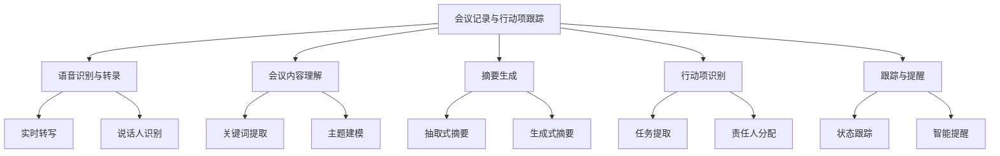

### 概念之间的关系

| 组件 | 主要功能 | 输入 | 输出 | 与其他组件的关系 |
|------|---------|------|------|------------------|
| 语音识别与转录 | 将语音转为文本 | 会议音频 | 文字记录 | 为其他组件提供基础数据 |
| 会议内容理解 | 分析会议内容 | 文字记录 | 结构化信息 | 为摘要和行动项识别提供输入 |
| 摘要生成 | 创建会议概要 | 结构化信息 | 会议摘要 | 使用内容理解结果 |
| 行动项识别 | 提取任务和责任 | 结构化信息 | 行动项列表 | 基于内容理解，影响跟踪系统 |
| 跟踪与提醒 | 管理后续任务 | 行动项列表 | 提醒和报告 | 使用行动项信息，与外部系统集成 |

### 算法流程图

会议记录与行动项跟踪的基本流程：

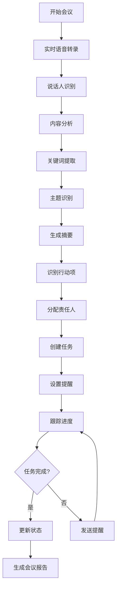

### 算法源代码

以下是一个简化的会议记录与行动项跟踪系统示例：

```python
import datetime
from typing import List, Dict

class SpeechToText:
    def transcribe(self, audio: bytes) -> str:
        # 简化的语音转文字，实际应使用专业的ASR系统
        return "This is a simulated transcription of the meeting audio."

class MeetingAnalyzer:
    def extract_keywords(self, text: str) -> List[str]:
        # 简化的关键词提取
        return ["project", "deadline", "budget", "team"]

    def identify_topics(self, text: str) -> List[str]:
        # 简化的主题识别
        return ["Project Planning", "Resource Allocation"]

    def generate_summary(self, text: str) -> str:
        # 简化的摘要生成
        return "This is a summary of the meeting discussing project planning and resource allocation."

class ActionItemExtractor:
    def extract_actions(self, text: str) -> List[Dict]:
        # 简化的行动项提取
        return [
            {"task": "Prepare project proposal", "assignee": "John", "deadline": "2023-12-31"},
            {"task": "Schedule team meeting", "assignee": "Sarah", "deadline": "2023-12-15"}
        ]

class TaskTracker:
    def __init__(self):
        self.tasks = []

    def add_task(self, task: Dict):
        self.tasks.append(task)

    def update_status(self, task_id: int, status: str):
        if 0 <= task_id < len(self.tasks):
            self.tasks[task_id]["status"] = status

    def get_pending_tasks(self) -> List[Dict]:
        return [task for task in self.tasks if task.get("status") != "Completed"]

class MeetingAssistant:
    def __init__(self):
        self.speech_to_text = SpeechToText()
        self.analyzer = MeetingAnalyzer()
        self.action_extractor = ActionItemExtractor()
        self.task_tracker = TaskTracker()

    def process_meeting(self, audio: bytes) -> Dict:
        transcript = self.speech_to_text.transcribe(audio)
        keywords = self.analyzer.extract_keywords(transcript)
        topics = self.analyzer.identify_topics(transcript)
        summary = self.analyzer.generate_summary(transcript)
        actions = self.action_extractor.extract_actions(transcript)

        for action in actions:
            self.task_tracker.add_task(action)

        return {
            "summary": summary,
            "keywords": keywords,
            "topics": topics,
            "action_items": actions
        }

    def get_pending_actions(self) -> List[Dict]:
        return self.task_tracker.get_pending_tasks()

# 使用示例
assistant = MeetingAssistant()

# 模拟处理会议
meeting_result = assistant.process_meeting(b"simulated audio data")
print("Meeting Summary:", meeting_result["summary"])
print("Keywords:", ", ".join(meeting_result["keywords"]))
print("Topics:", ", ".join(meeting_result["topics"]))
print("Action Items:")
for item in meeting_result["action_items"]:
    print(f"- {item['task']} (Assigned to: {item['assignee']}, Deadline: {item['deadline']})")

# 获取待处理的行动项
pending_actions = assistant.get_pending_actions()
print("\nPending Action Items:")
for action in pending_actions:
    print(f"- {action['task']} (Assigned to: {action['assignee']}, Deadline: {action['deadline']})")
```

### 实际场景应用

1. 项目启动会议：
    - 自动记录项目目标、范围和关键里程碑
    - 提取团队成员的角色和责任
    - 生成项目初始任务列表和时间线

2. 客户会议：
    - 捕获客户需求和反馈
    - 识别潜在的销售机会和跟进点
    - 自动更新CRM系统中的客户信息

3. 战略规划会议：
    - 总结关键决策和战略方向
    - 提取长期和短期目标
    - 生成战略实施路线图和责任分配

4. 日常站会：
    - 快速记录每个团队成员的进展和阻碍
    - 自动更新任务管理系统中的状态
    - 生成每日团队进度摘要

5. 问题解决会议：
    - 记录问题描述和根本原因分析
    - 提取解决方案和行动步骤
    - 跟踪解决进展和效果评估

### 最佳实践 tips

1. 提高语音识别准确性：
    - 使用高质量的麦克风和降噪技术
    - 针对特定领域和术语进行模型微调
    - 实现实时的错误纠正机制

2. 增强内容理解：
    - 利用上下文信息改善理解质量
    - 整合行业知识图谱以增强语义理解
    - 实现多模态理解，结合语音、文本和视觉信息

3. 个性化摘要生成：
    - 根据不同角色和需求定制摘要内容
    - 提供多级摘要（如执行摘要、详细记录）
    - 支持交互式摘要，允许用户动态调整内容

4. 智能行动项管理：
    - 自动与现有任务管理系统集成
    - 实现智能任务分配，考虑团队成员的专长和工作负载
    - 提供任务依赖关系分析和优先级建议

5. 增强用户体验：
    - 设计直观的界面，便于会议期间和之后的内容浏览
    - 提供实时反馈，允许参会者即时纠正或补充信息
    - 支持多平台访问，确保移动设备的良好体验

6. 安全性和隐私保护：
    - 实施端到端加密，保护敏感会议内容
    - 提供细粒度的访问控制，管理不同级别的信息共享
    - 遵守数据保护法规，如GDPR

7. 持续学习和改进：
    - 收集用户反馈，不断优化系统性能
    - 利用机器学习技术，从历史会议中学习模式和最佳实践
    - 定期更新语言模型，适应新的术语和表达方式

### 行业发展与未来趋势

| 时期 | 主要特征 | 关键技术 | 挑战 | 未来展望 |
|------|---------|----------|------|----------|
| 2018-2019 | 基础语音转文字 | 传统ASR、规则基础NLP | 准确性有限 | 更智能的会议助手 |
| 2020-2021 | 智能会议记录 | 深度学习ASR、BERT | 远程会议适应 | 多模态理解 |
| 2022-2023 | AI驱动的会议管理 | 端到端神经网络、GPT | 复杂对话理解 | 自主决策支持 |
| 2024-2025 (预测) | 沉浸式会议体验 | AR/VR集成、情境感知AI | 跨文化交流 | 全方位会议生态 |
| 2026+ (展望) | 认知会议助手 | AGI、脑机接口 | 人机协作平衡 | 无缝思维捕捉 |

会议记录与行动项跟踪技术正在经历快速的演变。从简单的语音转文字到现在的AI驱动的全方位会议管理系统，我们看到了显著的进步。这些变化不仅提高了会议的效率和效果，还改变了团队协作和知识管理的方式。

未来的会议记录与行动项跟踪系统可能会更加注重以下几个方面：

1. 全面的情境理解：
    - 整合语音、视觉、文本等多模态信息
    - 理解非语言线索，如肢体语言和表情
    - 捕捉会议氛围和参与者情绪状态

2. 预测性洞察：
    - 基于历史数据预测可能的讨论方向
    - 提供实时的决策支持和建议
    - 识别潜在的问题和机会

3. 智能参与辅助：
    - 为参会者提供实时的背景信息和建议
    - 自动生成跟进问题和讨论点
    - 促进更加平衡和高效的讨论

4. 增强现实集成：
    - 使用AR技术增强现场和远程参会体验
    - 提供虚拟白板和3D可视化工具
    - 实现沉浸式的远程协作环境

5. 自适应学习系统：
    - 从每次会议中学习和改进
    - 适应不同的会议风格和组织文化
    - 持续优化摘要生成和行动项提取

6. 深度知识集成：
    - 与组织知识库和业务系统深度集成
    - 自动关联相关文档和历史决策
    - 构建动态的组织知识图谱

7. 伦理和隐私增强：
    - 实现更高级的隐私保护机制
    - 提供透明的AI决策解释
    - 确保公平和包容的会议参与

随着这些趋势的发展，会议记录与行动项跟踪系统将从被动的记录工具演变为主动的会议智能助手。它们将能够更深入地理解会议动态，提供更有价值的洞察，并在会议效率和后续执行方面发挥关键作用。

这种进步将带来多方面的益处：

1. 提高会议效率：通过智能辅助，使会议更加聚焦和有成效。

2. 增强决策质量：提供全面的信息支持和分析，辅助更明智的决策。

3. 改善团队协作：促进更好的信息共享和任务协调。

4. 加速知识积累：将会议见解有效转化为组织知识。

5. 优化资源利用：通过更好的行动项跟踪，提高执行效率。

然而，这种发展也带来了新的挑战，如如何在技术辅助和人际互动之间保持平衡，如何确保AI系统不会过度影响会议动态，以及如何处理跨文化交流中的微妙差异。未来的系统需要在增强会议效率的同时，也尊重和促进人类创造力和社交互动的价值。

总的来说，会议记录与行动项跟踪技术的演进将继续深刻影响现代工作方式。通过提供更智能、更全面的会议管理解决方案，这些系统将帮助组织更有效地利用集体智慧，加速决策过程，并确保会议成果得到有效执行。这不仅将提高组织的整体效率，还将为创造更具协作性、更有洞察力的工作环境铺平道路。

## 8.5 任务分配与进度监控

### 核心概念

任务分配与进度监控是智能办公助手的关键功能，旨在优化团队工作流程，提高项目管理效率。这个模块不仅仅是简单的任务列表或甘特图工具，而是一个智能系统，能够理解任务的上下文、团队成员的能力和工作负载，自动进行最优的任务分配，并实时监控进度，预测潜在的风险和延迟。

### 问题背景

在现代企业环境中，项目和任务管理变得越来越复杂。团队规模的扩大、远程工作的普及、跨部门协作的增加，都给传统的任务管理方法带来了挑战。管理者需要在确保任务高效完成的同时，还要平衡团队成员的工作负载，避免资源浪费或瓶颈。同时，及时准确的进度监控对于项目的成功至关重要，但传统的手动

跟踪方法往往耗时费力且容易出错。

### 问题描述

1. 如何根据任务特性和团队成员能力进行智能任务分配
2. 如何实时监控任务进度并预测潜在的延迟或风险
3. 如何处理任务依赖关系和资源冲突
4. 如何在保持灵活性的同时确保项目整体进度
5. 如何有效地可视化和报告项目状态，支持决策制定

### 问题解决

我们将从以下几个方面详细探讨任务分配与进度监控功能的开发：

1. 智能任务分析：
    - 任务分解
    - 优先级评估
    - 复杂度估算

2. 资源管理：
    - 团队成员能力评估
    - 工作负载平衡
    - 资源可用性预测

3. 任务分配算法：
    - 基于规则的分配
    - 机器学习优化
    - 多目标优化

4. 进度跟踪：
    - 实时数据收集
    - 进度可视化
    - 偏差分析

5. 风险预测：
    - 历史数据分析
    - 预测模型构建
    - 早期预警机制

### 边界与外延

虽然本节主要关注任务级别的管理，但也会涉及项目组合管理和战略级别的资源分配。此外，我们还将讨论如何将这些功能与其他系统（如时间跟踪、文档管理）集成，以提供全面的项目管理解决方案。

### 概念结构与核心要素组成

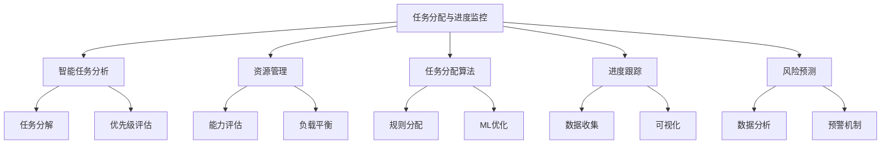

### 概念之间的关系

| 组件 | 主要功能 | 输入 | 输出 | 与其他组件的关系 |
|------|---------|------|------|------------------|
| 智能任务分析 | 理解任务特性 | 任务描述 | 结构化任务信息 | 为任务分配提供基础 |
| 资源管理 | 评估和分配资源 | 团队信息、任务需求 | 资源分配建议 | 影响任务分配决策 |
| 任务分配算法 | 优化任务分配 | 任务信息、资源信息 | 分配方案 | 使用分析和资源信息 |
| 进度跟踪 | 监控任务执行 | 实时进度数据 | 进度报告 | 为风险预测提供输入 |
| 风险预测 | 识别潜在问题 | 历史数据、当前进度 | 风险警报 | 影响任务重新分配 |

### 算法流程图

任务分配与进度监控的基本流程：

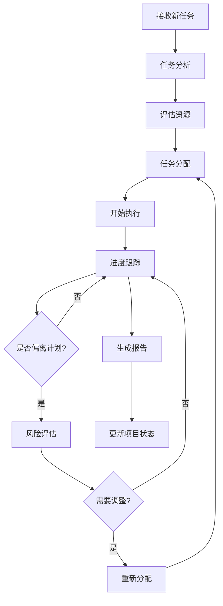

### 算法源代码

以下是一个简化的任务分配与进度监控系统示例：

```python
import random
from typing import List, Dict

class Task:
    def __init__(self, name: str, estimated_hours: float, required_skill: str):
        self.name = name
        self.estimated_hours = estimated_hours
        self.required_skill = required_skill
        self.assigned_to = None
        self.progress = 0.0

class Employee:
    def __init__(self, name: str, skills: List[str], capacity: float):
        self.name = name
        self.skills = skills
        self.capacity = capacity
        self.assigned_tasks = []

class ProjectManager:
    def __init__(self):
        self.tasks = []
        self.employees = []

    def add_task(self, task: Task):
        self.tasks.append(task)

    def add_employee(self, employee: Employee):
        self.employees.append(employee)

    def assign_tasks(self):
        for task in self.tasks:
            if task.assigned_to is None:
                suitable_employees = [e for e in self.employees if task.required_skill in e.skills and e.capacity >= task.estimated_hours]
                if suitable_employees:
                    assigned_employee = min(suitable_employees, key=lambda e: e.capacity)
                    task.assigned_to = assigned_employee
                    assigned_employee.assigned_tasks.append(task)
                    assigned_employee.capacity -= task.estimated_hours

    def update_progress(self):
        for employee in self.employees:
            for task in employee.assigned_tasks:
                # 模拟进度更新
                task.progress += random.uniform(0, 0.2)
                task.progress = min(task.progress, 1.0)

    def get_project_status(self) -> Dict:
        total_tasks = len(self.tasks)
        completed_tasks = sum(1 for task in self.tasks if task.progress == 1.0)
        overall_progress = sum(task.progress for task in self.tasks) / total_tasks
        return {
            "total_tasks": total_tasks,
            "completed_tasks": completed_tasks,
            "overall_progress": overall_progress
        }

    def identify_risks(self) -> List[str]:
        risks = []
        for task in self.tasks:
            if task.assigned_to is None:
                risks.append(f"Task '{task.name}' is unassigned")
            elif task.progress < 0.5 and task.estimated_hours > 20:
                risks.append(f"Task '{task.name}' might be delayed")
        return risks

# 使用示例
pm = ProjectManager()

# 添加员工
pm.add_employee(Employee("Alice", ["coding", "design"], 40))
pm.add_employee(Employee("Bob", ["testing", "documentation"], 30))

# 添加任务
pm.add_task(Task("Develop feature X", 20, "coding"))
pm.add_task(Task("Design UI", 15, "design"))
pm.add_task(Task("Write documentation", 10, "documentation"))

# 分配任务
pm.assign_tasks()

# 模拟项目进行
for _ in range(5):  # 模拟5个时间单位
    pm.update_progress()
    status = pm.get_project_status()
    print(f"Project Status: {status['completed_tasks']}/{status['total_tasks']} tasks completed, "
          f"Overall progress: {status['overall_progress']:.2%}")
    risks = pm.identify_risks()
    if risks:
        print("Risks identified:")
        for risk in risks:
            print(f"- {risk}")
    print()
```

### 实际场景应用

1. 软件开发项目：
    - 根据开发者技能和经验分配编码任务
    - 跟踪各个功能模块的开发进度
    - 预测潜在的集成问题和延迟风险

2. 市场营销活动：
    - 根据团队成员专长分配不同的营销任务
    - 监控各个营销渠道的执行情况
    - 实时调整资源分配以优化活动效果

3. 产品研发：
    - 协调跨部门团队的任务分配
    - 跟踪从概念到上市的各个阶段进度
    - 识别可能影响上市时间的风险因素

4. 客户服务改进项目：
    - 分配客户反馈分析和解决方案开发任务
    - 监控服务质量改进指标
    - 预测可能的客户满意度下降风险

5. 企业数字化转型：
    - 管理跨多个部门的复杂任务网络
    - 跟踪各个系统集成和流程改造的进度
    - 识别可能影响整体转型时间表的瓶颈

### 最佳实践 tips

1. 智能任务分解：
    - 使用AI技术自动分解复杂任务
    - 考虑任务间的依赖关系和优先级
    - 允许灵活调整任务结构

2. 动态资源分配：
    - 实时更新团队成员的技能矩阵
    - 考虑个人偏好和发展需求
    - 实施动态负载均衡机制

3. 预测性分析：
    - 利用机器学习预测任务完成时间
    - 分析历史数据识别常见延迟原因
    - 提供提前干预的建议

4. 自适应进度跟踪：
    - 根据任务类型选择合适的进度指标
    - 实现自动化的进度报告机制
    - 提供个性化的进度视图

5. 协作增强：
    - 集成实时通讯工具促进团队沟通
    - 提供任务相关的上下文信息共享
    - 支持虚拟团队的远程协作

6. 用户体验优化：
    - 设计直观的任务管理界面
    - 提供可定制的仪表板和报告
    - 支持移动设备访问和操作

7. 持续学习和改进：
    - 收集用户反馈不断优化算法
    - 分析成功项目模式，形成最佳实践
    - 定期评估和更新风险预测模型

### 行业发展与未来趋势

| 时期 | 主要特征 | 关键技术 | 挑战 | 未来展望 |
|------|---------|----------|------|----------|
| 2018-2019 | 基础任务管理 | 甘特图、看板 | 手动更新繁琐 | 自动化任务跟踪 |
| 2020-2021 | 智能任务分配 | ML算法、数据分析 | 准确性和适应性 | 预测性项目管理 |
| 2022-2023 | AI驱动的项目管理 | 深度学习、NLP | 复杂项目建模 | 自主决策支持 |
| 2024-2025 (预测) | 全面集成的管理生态 | 物联网、区块链 | 跨系统协同 | 无缝项目生命周期管理 |
| 2026+ (展望) | 认知项目管理 | AGI、量子计算 | 人机协作平衡 | 自适应组织管理 |

任务分配与进度监控技术正在经历快速的演变。从传统的手动管理工具到现在的AI驱动的智能项目管理系统，我们看到了显著的进步。这些变化不仅提高了项目管理的效率和准确性，还改变了团队协作和资源利用的方式。

未来的任务分配与进度监控系统可能会更加注重以下几个方面：

1. 超个性化任务分配：
    - 考虑个人的学习曲线和职业发展目标
    - 根据生物节奏和工作模式优化任务安排
    - 平衡挑战性和可达性以提高员工参与度

2. 实时动态调整：
    - 基于实时数据持续优化资源分配
    - 自动识别和解决资源冲突
    - 适应突发事件和变化的优先级

3. 预测性项目智能：
    - 使用高级AI模型预测项目结果
    - 模拟不同场景下的项目轨迹
    - 提供主动式风险缓解建议

4. 全方位项目洞察：
    - 整合财务、质量、客户满意度等多维度数据
    - 提供holistic的项目健康评估
    - 支持多项目组合的战略决策

5. 增强现实项目可视化：
    - 使用AR/VR技术创建沉浸式项目仪表板
    - 实现虚拟项目空间中的团队协作
    - 直观展示复杂的项目依赖关系和进度

6. 自主学习和优化：
    - 从过去的项目中学习最佳实践
    - 自动调整估算模型和分配算法
    - 持续优化工作流程和团队结构

7. 情感智能和团队动态：
    - 监控和管理团队情绪和压力水平
    - 优化团队组成以提高协作效率
    - 提供个性化的激励和支持策略

随着这些趋势的发展，任务分配与进度监控系统将从被动的跟踪工具演变为主动的项目智能助手。它们将能够更深入地理解项目动态，提供更有价值的洞察，并在项目成功方面发挥关键作用。

这种进步将带来多方面的益处：

1. 提高资源利用效率：通过智能分配，最大化团队潜力。

2. 增强决策质量：提供数据驱动的洞察，支持更明智的项目决策。

3. 改善风险管理：早期识别和缓解潜在问题。

4. 提升团队满意度：通过个性化任务分配和工作负载平衡，提高员工参与度。

5. 加速项目交付：优化工作流程，减少延迟和瓶颈。

然而，这种发展也带来了新的挑战，如如何在自动化和人为判断之间保持平衡，如何确保AI系统的决策透明度和可解释性，以及如何处理复杂的跨文化和跨时区项目管理问题。未来的系统需要在提高效率的同时，也尊重人类的创造力、直觉和领导力的价值。

总的来说，任务分配与进度监控技术的演进将继续深刻影响项目管理实践。通过提供更智能、更全面的项目管理解决方案，这些系统将帮助组织更有效地执行战略，加速创新过程，并在竞争激烈的市场中保持敏捷性。这不仅将提高项目成功率，还将为创造更具协作性、更有成效的工作环境铺平道路，最终推动整个组织的转型和成长。

## 8.6 智能办公助手的系统集成与部署

### 核心概念

智能办公助手的系统集成与部署是将前面讨论的各个功能模块（如日程管理、邮件处理、文档摘要、会议记录、任务管理等）整合成一个统一、协调的系统，并将其成功部署到实际工作环境中的过程。这个过程不仅涉及技术层面的整合，还包括与现有企业系统的对接、用户培训、数据迁移、安全保障等多个方面。

### 问题背景

随着各种智能办公功能的发展，企业面临着如何将这些先进技术有效整合并无缝融入现有工作流程的挑战。传统的办公系统往往是孤立的，难以实现跨功能的数据共享和协同。同时，新技术的引入也带来了用户适应、数据安全、系统兼容性等一系列问题。因此，需要一个全面的集成和部署策略，以确保智能办公助手能够真正提高工作效率，而不是成为额外的负担。

### 问题描述

1. 如何实现各功能模块之间的无缝集成和数据共享
2. 如何确保与现有企业系统（如ERP、CRM）的兼容性和数据同步
3. 如何设计直观、统一的用户界面，提供一致的用户体验
4. 如何保障系统的安全性、可靠性和可扩展性
5. 如何管理部署过程，包括用户培训、数据迁移和系统切换

### 问题解决

我们将从以下几个方面详细探讨智能办公助手的系统集成与部署：

1. 架构设计：
    - 微服务架构
    - API设计和管理
    - 数据模型统一

2. 集成策略：
    - 功能模块间集成
    - 与企业现有系统集成
    - 第三方服务集成

3. 用户界面设计：
    - 统一的UI/UX设计
    - 响应式设计
    - 个性化定制

4. 安全与合规：
    - 身份认证和授权
    - 数据加密和隐私保护
    - 合规性管理

5. 部署与维护：
    - 云部署vs本地部署
    - 持续集成/持续部署（CI/CD）
    - 监控和日志管理

### 边界与外延

虽然本节主要关注智能办公助手的集成与部署，但也会涉及更广泛的企业数字化转型策略。此外，我们还将讨论如何为未来的技术发展和业务需求变化预留扩展空间。

### 概念结构与核心要素组成

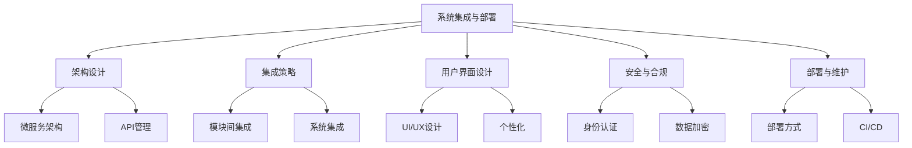

### 概念之间的关系

| 组件 | 主要功能 | 输入 | 输出 | 与其他组件的关系 |
|------|---------|------|------|------------------|
| 架构设计 | 定义系统结构 | 需求规格 | 系统架构 | 为所有其他组件提供基础 |
| 集成策略 | 协调各部分工作 | 模块信息、系统信息 | 集成方案 | 影响部署和UI设计 |
| 用户界面设计 | 创建用户交互 | 用户需求、功能规格 | UI/UX设计 | 基于集成策略，影响用户体验 |
| 安全与合规 | 保护系统和数据 | 安全需求、法规要求 | 安全策略 | 贯穿所有其他组件 |
| 部署与维护 | 实施和运营系统 | 系统组件、环境需求 | 运行中的系统 | 整合所有组件的最终步骤 |

### 算法流程图

智能办公助手系统集成与部署的基本流程：

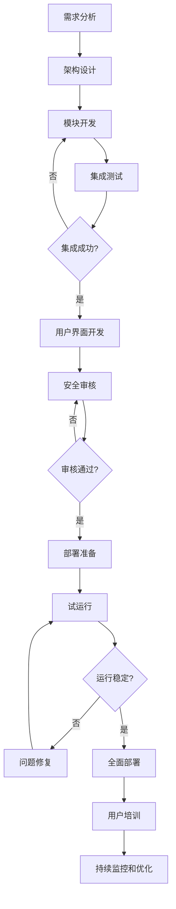

### 算法源代码

以下是一个简化的智能办公助手系统集成框架示例：

```python
from typing import Dict, List
import json

class Module:
    def __init__(self, name: str):
        self.name = name
        self.data = {}

    def process(self, input_data: Dict) -> Dict:
        # 模拟模块处理逻辑
        return {"result": f"Processed by {self.name}", "data": input_data}

class IntegrationSystem:
    def __init__(self):
        self.modules = {}
        self.workflows = {}

    def add_module(self, module: Module):
        self.modules[module.name] = module

    def define_workflow(self, name: str, steps: List[str]):
        self.workflows[name] = steps

    def execute_workflow(self, workflow_name: str, input_data: Dict) -> Dict:
        if workflow_name not in self.workflows:
            raise ValueError(f"Workflow {workflow_name} not found")

        result = input_data
        for step in self.workflows[workflow_name]:
            if step not in self.modules:
                raise ValueError(f"Module {step} not found")
            result = self.modules[step].process(result)
        return result

class SecurityLayer:
    @staticmethod
    def encrypt(data: Dict) -> str:
        # 简化的加密示例
        return json.dumps(data)[::-1]

    @staticmethod
    def decrypt(data: str) -> Dict:
        # 简化的解密示例
        return json.loads(data[::-1])

class UserInterface:
    def __init__(self, integration_system: IntegrationSystem, security: SecurityLayer):
        self.integration_system = integration_system
        self.security = security

    def process_user_request(self, workflow: str, data: Dict) -> Dict:
        encrypted_input = self.security.encrypt(data)
        # 模拟数据传输
        received_data = encrypted_input
        decrypted_input = self.security.decrypt(received_data)
        
        result = self.integration_system.execute_workflow(workflow, decrypted_input)
        
        encrypted_output = self.security.encrypt(result)
        # 模拟数据传输
        received_output = encrypted_output
        return self.security.decrypt(received_output)

# 使用示例
integration_system = IntegrationSystem()

# 添加模块
integration_system.add_module(Module("calendar"))
integration_system.add_module(Module("email"))
integration_system.add_module(Module("document"))

# 定义工作流
integration_system.define_workflow("meeting_preparation", ["calendar", "email", "document"])

# 创建用户界面
ui = UserInterface(integration_system, SecurityLayer())

# 模拟用户请求
user_request = {
    "meeting_id": "12345",
    "participants": ["alice@example.com", "bob@example.com"],
    "documents": ["agenda.pdf", "report.docx"]
}

result = ui.process_user_request("meeting_preparation", user_request)
print("Processed result:", result)
```

### 实际场景应用

1. 全面办公自动化：
    - 集成日程管理、邮件处理、文档管理等功能
    - 实现跨模块的智能推荐和自动化工作流
    - 提供统一的数据视图和报告生成

2. 企业知识管理：
    - 整合文档摘要、会议记录、任务跟踪等功能
    - 构建企业知识图谱，支持智能搜索和推荐
    - 实现知识的自动分类、标记和更新

3. 协作与项目管理：
    - 集成任务分配、进度监控、文件共享等功能
    - 提供跨部门、跨地域的协作平台
    - 支持敏捷开发和传统项目管理方法

4. 客户关系管理增强：
    - 整合邮件处理、会议记录、任务跟踪等与CRM系统
    - 提供360度客户视图，支持智能分析和预测
    - 实现销售、市场、客服等部门的无缝协作

5. 人力资源管理优化：
    - 集成日程管理、文档处理、任务分配等与HR系统
    - 支持智能化的招聘、培训、绩效管理流程
    - 提供员工自助服务和个性化学习推荐

### 最佳实践 tips

1. 模块化设计：
    - 采用微服务架构，确保各功能模块的独立性
    - 定义清晰的API接口，便于未来扩展和更新
    - 实现功能的可插拔，支持灵活配置

2. 数据一致性：
    - 建立统一的数据模型和元数据管理
    - 实施主数据管理（MDM）策略
    - 确保实时数据同步和冲突解决机制

3. 用户体验优化：
    - 设计直观、一致的用户界面
    - 提供个性化的仪表板和工作空间
    - 实现跨设备的无缝体验

4. 安全性和隐私：
    - 实施多因素身份认证和细粒度访问控制
    - 采用端到端加密保护敏感数据
    - 提供全面的审计日志和合规性报告

5. 灵活部署：
    - 支持云部署、本地部署和混合部署模式
    - 实现容器化部署，提高可移植性和可扩展性
    - 建立自动化的CI/CD流程，支持快速迭代

6. 性能优化：
    - 实施缓存策略，提高响应速度
    - 优化数据库查询和索引
    - 采用负载均衡和自动扩展技术

7. 用户采纳策略：
    - 制定分阶段的推广计划
    - 提供全面的用户培训和支持文档
    - 收集用户反馈，持续改进系统

### 行业发展与未来趋势

| 时期 | 主要特征 | 关键技术 | 挑战 | 未来展望 |
|------|---------|----------|------|----------|
| 2018-2019 | 基础集成 | API集成、单点登录 | 系统兼容性 | 更深度的集成 |
| 2020-2021 | 智能集成 | 微服务、容器化 | 数据一致性 | 自适应系统 |
| 2022-2023 | AI驱动集成 | 机器学习、自然语言处理 | 复杂性管理 | 认知办公平台 |
| 2024-2025 (预测) | 无缝智能办公 | 边缘计算、5G | 安全与隐私 | 全方位智能助手 |
| 2026+ (展望) | 自主办公生态 | AGI、量子计算 | 人机协作 | 办公环境数字孪生 |

智能办公助手的系统集成与部署正在经历快速的演变。从早期的简单功能集成到现在的AI驱动的智能办公平台，我们看到了显著的进步。这些变化不仅提高了办公效率，还重新定义了工作方式和组织结构。

未来的智能办公助手系统可能会更加注重以下几个方面：

1. 全面智能化：
    - AI深度融入每个办公环节
    - 预测性分析和决策支持
    - 自动化复杂的工作流程和决策过程

2. 无缝集成：
    - 跨平台、跨设备的一致体验
    - 实时数据同步和上下文切换
    - 与物联网设备和智能办公环境的深度整合

3. 个性化和自适应：
    - 根据用户行为和偏好动态调整界面和功能
    - 智能学习个人和团队的工作模式
    - 提供个性化的工作建议和优化方案

4. 增强现实和虚拟现实集成：
    - AR辅助的信息展示和交互
    - VR支持的远程协作和虚拟会议
    - 混合现实环境下的办公空间设计

5. 高级安全和隐私保护：
    - 基于行为的异常检测和防御
    - 去中心化的身份验证和访问控制
    - 隐私计算技术在协作中的应用

6. 生态系统approach：
    - 开放平台支持第三方开发和集成
    - 跨组织的安全数据共享和协作
    - 行业特定的智能办公解决方案

7. 可持续性和健康focus：
    - 能源使用优化和碳足迹跟踪
    - 员工健康监测和工作-生活平衡建议
    - 环境友好型办公实践的智能推荐

随着这些趋势的发展，智能办公助手系统将从单一的效率工具演变为全面的工作和生活管理平台。它们将能够更深入地理解和预测用户需求，提供更智能、更个性化的支持，并在提高生产力的同时也关注员工福祉和组织可持续发展。

这种进步将带来多方面的益处：

1. 极大提高工作效率：通过智能自动化和预测性支持，减少重复性工作。

2. 增强决策质量：提供全面的数据分析和情景模拟，支持更明智的决策。

3. 改善员工体验：个性化的工作环境和支持系统，提高工作满意度。

4. 促进创新：释放员工的创造力，将更多时间用于高价值任务。

5. 优化资源利用：智能管理办公空间、能源和其他资源，降低运营成本。

6. 加强组织韧性：提高远程工作和分布式团队的效能，增强应对变化的能力。

然而，这种发展也带来了新的挑战，如如何在提高自动化程度的同时保持人性化办公，如何平衡效率提升和员工隐私保护，以及如何管理日益复杂的技术生态系统。未来的系统需要在技术创新和人文关怀之间找到平衡，确保技术进步能够真正增强人类的能力和创造力，而不是取代或限制它们。

总的来说，智能办公助手系统的集成与部署将继续深刻影响现代工作方式和组织结构。通过提供更智能、更全面的办公解决方案，这些系统将帮助组织提高生产力，增强创新能力，并在快速变化的商业环境中保持竞争优势。同时，它们也将推动工作场所的人性化和个性化，创造更加灵活、包容和可持续的工作环境。这不仅将改变我们的工作方式，还将重塑组织文化，推动整个社会向更智能、更高效的方向发展。
