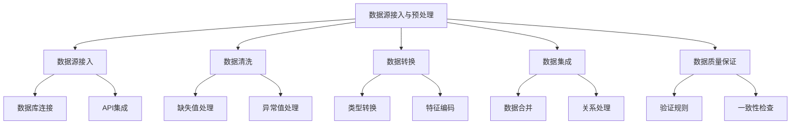
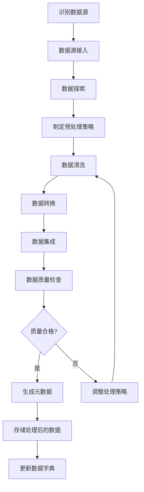
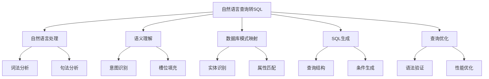
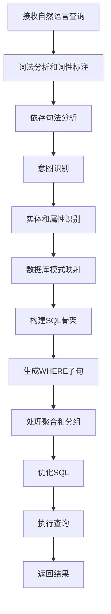
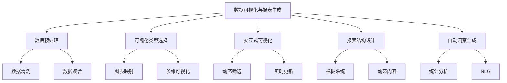
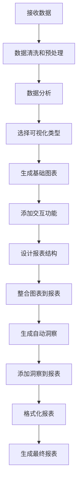
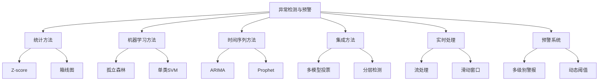
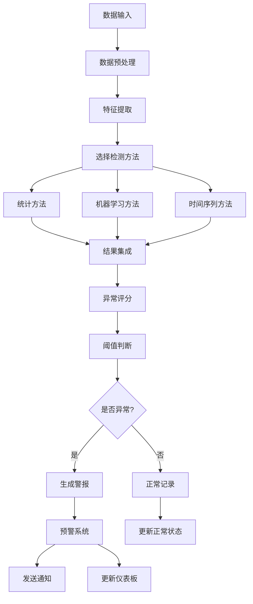
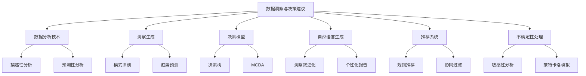
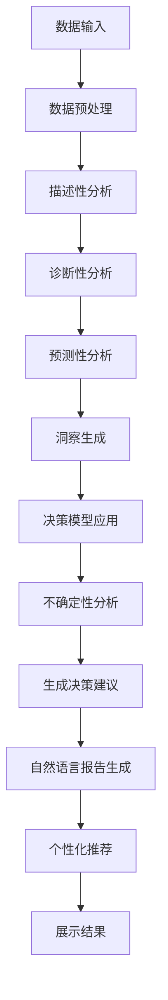

# 第9章：数据分析 Agent 开发

## 9.1 数据源接入与预处理

### 核心概念

数据源接入与预处理是数据分析Agent开发的基础环节，涉及从各种来源获取数据、清洗和转换数据，以及为后续分析做准备的过程。这个阶段的目标是确保数据的质量、一致性和可用性，为后续的分析工作奠定坚实的基础。

### 问题背景

在大数据时代，组织面临着来自多个渠道、格式各异的海量数据。这些数据可能包含错误、缺失值、异常值，或者格式不一致。同时，数据的实时性、安全性和隐私保护也成为重要考虑因素。有效地接入和预处理这些数据，对于确保分析结果的准确性和可靠性至关重要。

### 问题描述

1. 如何高效地接入多样化的数据源（如关系型数据库、NoSQL数据库、API、文件系统等）
2. 如何处理结构化、半结构化和非结构化数据
3. 如何识别和处理数据质量问题（如缺失值、异常值、重复数据等）
4. 如何确保数据的一致性和标准化
5. 如何处理大规模数据集的预处理，保证效率和可扩展性

### 问题解决

我们将从以下几个方面详细探讨数据源接入与预处理的实现：

1. 数据源接入：
    - 数据库连接器
    - API集成
    - 文件系统接入
    - 流数据处理

2. 数据清洗：
    - 缺失值处理
    - 异常值检测与处理
    - 重复数据去除

3. 数据转换：
    - 数据类型转换
    - 特征编码
    - 数据标准化/归一化

4. 数据集成：
    - 数据合并
    - 主键/外键关系处理
    - 时间序列对齐

5. 数据质量保证：
    - 数据验证规则
    - 数据一致性检查
    - 数据血缘追踪

### 边界与外延

虽然本节主要关注数据预处理，但也会涉及数据治理、元数据管理等相关领域。此外，我们还将讨论如何将预处理过程与后续的分析流程无缝集成，以及如何处理实时数据流的预处理需求。

### 概念结构与核心要素组成



### 概念之间的关系

| 组件 | 主要功能 | 输入 | 输出 | 与其他组件的关系 |
|------|---------|------|------|------------------|
| 数据源接入 | 获取原始数据 | 各类数据源 | 原始数据集 | 为其他所有组件提供输入 |
| 数据清洗 | 处理数据问题 | 原始数据集 | 清洗后的数据 | 为数据转换和集成提供基础 |
| 数据转换 | 调整数据格式和表示 | 清洗后的数据 | 转换后的数据 | 为数据集成提供标准化数据 |
| 数据集成 | 合并多源数据 | 转换后的数据 | 集成数据集 | 生成最终的分析就绪数据集 |
| 数据质量保证 | 验证数据质量 | 处理过程中的数据 | 质量报告 | 贯穿所有其他组件 |

### 算法流程图

数据源接入与预处理的基本流程：



### 算法源代码

以下是一个简化的数据源接入与预处理系统示例：

```python
import pandas as pd
import numpy as np
from sklearn.impute import SimpleImputer
from sklearn.preprocessing import StandardScaler, OneHotEncoder

class DataPreprocessor:
    def __init__(self):
        self.data = None
        self.metadata = {}

    def load_data(self, file_path, file_type='csv'):
        if file_type == 'csv':
            self.data = pd.read_csv(file_path)
        elif file_type == 'json':
            self.data = pd.read_json(file_path)
        else:
            raise ValueError("Unsupported file type")
        
        self.metadata['original_shape'] = self.data.shape
        print(f"Data loaded. Shape: {self.data.shape}")

    def handle_missing_values(self, strategy='mean'):
        numeric_columns = self.data.select_dtypes(include=[np.number]).columns
        imputer = SimpleImputer(strategy=strategy)
        self.data[numeric_columns] = imputer.fit_transform(self.data[numeric_columns])
        print("Missing values handled.")

    def remove_duplicates(self):
        original_count = len(self.data)
        self.data.drop_duplicates(inplace=True)
        new_count = len(self.data)
        print(f"Removed {original_count - new_count} duplicate rows.")

    def encode_categorical_variables(self):
        categorical_columns = self.data.select_dtypes(include=['object']).columns
        encoder = OneHotEncoder(sparse=False, handle_unknown='ignore')
        encoded_data = encoder.fit_transform(self.data[categorical_columns])
        encoded_df = pd.DataFrame(encoded_data, columns=encoder.get_feature_names(categorical_columns))
        self.data = pd.concat([self.data.drop(columns=categorical_columns), encoded_df], axis=1)
        print("Categorical variables encoded.")

    def scale_numeric_features(self):
        numeric_columns = self.data.select_dtypes(include=[np.number]).columns
        scaler = StandardScaler()
        self.data[numeric_columns] = scaler.fit_transform(self.data[numeric_columns])
        print("Numeric features scaled.")

    def check_data_quality(self):
        # 简单的数据质量检查示例
        null_counts = self.data.isnull().sum()
        if null_counts.sum() > 0:
            print("Warning: There are still null values in the dataset.")
        else:
            print("Data quality check passed: No null values found.")

    def get_metadata(self):
        self.metadata['final_shape'] = self.data.shape
        self.metadata['columns'] = list(self.data.columns)
        return self.metadata

    def preprocess(self):
        self.handle_missing_values()
        self.remove_duplicates()
        self.encode_categorical_variables()
        self.scale_numeric_features()
        self.check_data_quality()
        print("Preprocessing completed.")

# 使用示例
preprocessor = DataPreprocessor()
preprocessor.load_data('example_data.csv')
preprocessor.preprocess()
processed_data = preprocessor.data
metadata = preprocessor.get_metadata()

print("\nProcessed Data Sample:")
print(processed_data.head())
print("\nMetadata:")
print(metadata)
```

### 实际场景应用

1. 客户数据整合：
    - 合并来自CRM、交易系统、社交媒体的客户数据
    - 处理重复客户记录，统一客户标识
    - 标准化地址信息，丰富客户画像

2. 金融风险分析：
    - 接入多个金融数据源（如市场数据、信用评级、交易记录）
    - 处理缺失的财务指标，识别异常交易
    - 标准化不同货币和时区的数据

3. IoT数据处理：
    - 处理来自各种传感器的实时数据流
    - 清理噪声数据，处理设备离线导致的数据缺失
    - 将不同设备的数据对齐到统一的时间序列

4. 医疗数据分析：
    - 整合电子健康记录、实验室结果和医学影像数据
    - 标准化不同医疗机构的诊断编码
    - 处理敏感信息，确保数据隐私和合规性

5. 供应链优化：
    - 集成供应商、物流、库存和销售数据
    - 处理不同计量单位和货币的转换
    - 识别和处理供应链中的异常事件数据

### 最佳实践 tips

1. 数据探索和理解：
    - 在预处理前进行全面的数据探索
    - 理解数据的业务含义和上下文
    - 识别潜在的数据质量问题和异常模式

2. 自动化和可重复性：
    - 开发自动化的数据预处理流程
    - 使用版本控制管理预处理脚本
    - 记录所有预处理步骤，确保可重复性

3. 增量处理：
    - 设计支持增量数据处理的方案
    - 优化大规模数据集的处理效率
    - 实现实时或准实时的数据预处理

4. 数据质量监控：
    - 建立持续的数据质量监控机制
    - 设置关键指标的阈值警报
    - 实现数据质量问题的自动报告和可视化

5. 元数据管理：
    - 维护详细的数据字典和数据血缘关系
    - 记录数据转换和清洗的规则和逻辑
    - 实现元数据的版本控制和变更管理

6. 可扩展性设计：
    - 使用分布式处理框架处理大规模数据
    - 设计模块化的预处理组件，便于扩展
    - 考虑云计算资源的弹性利用

7. 数据安全和隐私：
    - 实施数据脱敏和匿名化技术
    - 确保数据传输和存储的加密
    - 遵守数据保护法规（如GDPR、CCPA）

### 行业发展与未来趋势

| 时期 | 主要特征 | 关键技术 | 挑战 | 未来展望 |
|------|---------|----------|------|----------|
| 2018-2019 | 批处理为主 | ETL工具、SQL | 处理效率 | 实时处理 |
| 2020-2021 | 实时处理兴起 | 流处理框架、NoSQL | 数据一致性 | 智能预处理 |
| 2022-2023 | 智能化预处理 | 机器学习、自动化管道 | 复杂数据类型 | 自适应系统 |
| 2024-2025 (预测) | 自动化和自适应 | AutoML、联邦学习 | 隐私计算 | 认知数据准备 |
| 2026+ (展望) | 认知数据工程 | AGI辅助、量子计算 | 跨域数据融合 | 自主数据生态系统 |

数据源接入与预处理技术正在经历快速的演变。从传统的批处理ETL到现在的实时、智能化预处理系统，我们看到了显著的进步。这些变化不仅提高了数据处理的效率和质量，还改变了组织管理和利用数据的方式。

未来的数据源接入与预处理系统可能会更加注重以下几个方面：

1. 智能自适应：
    - 自动识别数据模式和异常
    - 动态调整预处理策略
    - 学习并优化数据清洗规则

2. 端到端自动化：
    - 从数据发现到分析就绪的全流程自动化
    - 智能元数据生成和管理
    - 自动化数据质量评估和报告

3. 隐私保护和合规性：
    - 内置隐私保护机制（如差分隐私）
    - 自动化合规性检查和报告
    - 支持跨境数据传输的合规处理

4. 跨域数据融合：
    - 智能处理多模态数据（文本、图像、音频等）
    - 自动解决不同来源数据的语义差异
    - 支持知识图谱的动态构建和更新

5. 实时和流式处理：
    - 毫秒级的数据清洗和转换
    - 动态调整的流处理拓扑
    - 边缘计算与云计算的协同预处理

6. 可解释性和透明度：
    - 提供数据转换的详细解释
    - 可视化数据血缘和转换过程
    - 支持数据处理决策的可审计性

7. 认知辅助：
    - AI辅助的数据探索和理解
    - 自然语言交互式数据准备
    - 智能推荐最佳预处理策略

随着这些趋势的发展，数据源接入与预处理系统将从被动的数据处理工具演变为主动的数据管理助手。它们将能够更深入地理解数据的内在结构和语义，提供更智能、更高效的数据准备服务，并在确保数据质量和合规性方面发挥关键作用。

这种进步将带来多方面的益处：

1. 提高数据质量：通过智能化和自动化，显著减少数据错误和不一致。

2. 加速分析周期：缩短从原始数据到分析就绪数据的时间。

3. 增强数据价值：通过高质量的预处理，提高数据的可用性和洞察潜力。

4. 降低成本：减少人工干预，提高数据处理的效率和规模经济。

5. 强化合规性：内置的隐私保护和合规机制，降低合规风险。

6. 促进创新：使数据科学家和分析师能够更快地访问和使用高质量数据。

然而，这种发展也带来了新的挑战，如如何确保自动化系统的决策透明度，如何平衡数据处理的标准化和个性化需求，以及如何在提高效率的同时保持对数据处理过程的人为控制和理解。未来的系统需要在自动化和人工智慧之间找到平衡，确保技术进步能够真正增强人类的数据分析能力，而不是创造出一个难以理解和控制的黑箱。

总的来说，数据源接入与预处理技术的演进将继续深刻影响数据分析和决策制定的方式。通过提供更智能、更高效的数据准备解决方案，这些系统将帮助组织更好地利用其数据资产，提高分析的准确性和及时性，并在数据驱动的竞争环境中保持优势。这不仅将提高组织的数据分析能力，还将推动整个数据生态系统向更智能、更自动化的方向发展，最终实现数据的全面价值释放。

## 9.2 自然语言查询转 SQL

### 核心概念

自然语言查询转SQL是一种将用户以自然语言表达的数据查询需求自动转换为结构化查询语言（SQL）的技术。这一功能使得非技术用户能够通过日常语言与数据库进行交互，无需了解SQL语法，从而大大降低了数据访问的门槛。

### 问题背景

随着数据驱动决策在各行各业的普及，越来越多的非技术背景用户需要直接从数据库中获取信息。然而，传统的SQL查询要求用户具备专业的编程知识，这对许多业务用户来说是一个巨大的障碍。自然语言查询转SQL技术旨在解决这一问题，使数据查询变得更加直观和易用。

### 问题描述

1. 如何准确理解用户的自然语言查询意图
2. 如何将自然语言查询映射到数据库模式和字段
3. 如何处理复杂的查询逻辑，如多表连接、聚合函数等
4. 如何解决自然语言的歧义性和上下文依赖问题
5. 如何确保生成的SQL查询的正确性和效率

### 问题解决

我们将从以下几个方面详细探讨自然语言查询转SQL的实现：

1. 自然语言处理：
    - 词法分析和词性标注
    - 依存句法分析
    - 命名实体识别

2. 语义理解：
    - 意图识别
    - 槽位填充
    - 上下文管理

3. 数据库模式映射：
    - 实体识别
    - 属性匹配
    - 关系推断

4. SQL生成：
    - 查询结构构建
    - 条件表达式生成
    - 聚合函数处理

5. 查询优化：
    - 语法验证
    - 性能优化
    - 结果解释

### 边界与外延

虽然本节主要关注将自然语言转换为SQL，但这项技术的应用范围可以扩展到其他类型的数据查询语言，如NoSQL数据库查询、图数据库查询等。此外，我们还将讨论如何将这一技术与对话系统集成，实现交互式的数据探索和分析。

### 概念结构与核心要素组成



### 概念之间的关系

| 组件 | 主要功能 | 输入 | 输出 | 与其他组件的关系 |
|------|---------|------|------|------------------|
| 自然语言处理 | 解析输入文本 | 自然语言查询 | 结构化语言表示 | 为语义理解提供基础 |
| 语义理解 | 理解查询意图 | 结构化语言表示 | 查询意图和参数 | 指导数据库模式映射 |
| 数据库模式映射 | 连接语言和数据模型 | 查询意图和参数 | 数据库对象映射 | 为SQL生成提供必要信息 |
| SQL生成 | 构建SQL语句 | 数据库对象映射 | 初始SQL查询 | 生成待优化的SQL |
| 查询优化 | 改进SQL质量 | 初始SQL查询 | 优化后的SQL | 最终输出可执行的SQL |

### 算法流程图

自然语言查询转SQL的基本流程：



### 算法源代码

以下是一个简化的自然语言查询转SQL系统示例：

```python
import spacy
import re
from typing import Dict, List

class NLToSQLConverter:
    def __init__(self, db_schema: Dict[str, List[str]]):
        self.nlp = spacy.load("en_core_web_sm")
        self.db_schema = db_schema
        self.query_intent = None
        self.entities = {}
        self.conditions = []

    def parse_query(self, query: str):
        doc = self.nlp(query)
        self.identify_intent(doc)
        self.extract_entities(doc)
        self.extract_conditions(doc)

    def identify_intent(self, doc):
        # 简化的意图识别
        if "how many" in doc.text.lower():
            self.query_intent = "COUNT"
        elif any(token.lemma_ == "average" for token in doc):
            self.query_intent = "AVG"
        else:
            self.query_intent = "SELECT"

    def extract_entities(self, doc):
        for entity in doc.ents:
            if entity.label_ in self.db_schema:
                self.entities[entity.label_] = entity.text

    def extract_conditions(self, doc):
        # 简化的条件提取
        for token in doc:
            if token.dep_ == "amod" and token.head.text in self.db_schema.get(token.head.lemma_, []):
                self.conditions.append(f"{token.head.lemma_} = '{token.text}'")

    def generate_sql(self) -> str:
        if not self.query_intent or not self.entities:
            return "Could not generate SQL. Please provide more information."

        table = list(self.entities.keys())[0]
        if self.query_intent == "COUNT":
            select_clause = "COUNT(*)"
        elif self.query_intent == "AVG":
            # 假设我们知道要平均的字段
            select_clause = f"AVG({list(self.db_schema[table])[0]})"
        else:
            select_clause = ", ".join(self.db_schema[table])

        sql = f"SELECT {select_clause} FROM {table}"
        if self.conditions:
            sql += " WHERE " + " AND ".join(self.conditions)
        return sql

# 使用示例
db_schema = {
    "employees": ["id", "name", "department", "salary"],
    "departments": ["id", "name", "location"]
}

converter = NLToSQLConverter(db_schema)

queries = [
    "How many employees are in the sales department?",
    "What is the average salary of employees?",
    "Show me all employees in the IT department"
]

for query in queries:
    print(f"Query: {query}")
    converter.parse_query(query)
    sql = converter.generate_sql()
    print(f"Generated SQL: {sql}\n")
```

### 实际场景应用

1. 商业智能自助服务：
    - 允许业务用户通过自然语言查询销售数据
    - 生成复杂的多维分析SQL查询
    - 支持交互式的数据探索和可视化

2. 客户服务数据查询：
    - 使客服代表能够快速查询客户信息和交易历史
    - 处理多表连接的复杂查询
    - 支持模糊匹配和近似查询

3. 医疗数据分析：
    - 允许医生通过自然语言查询患者病历和检查结果
    - 生成符合HIPAA等规范的安全SQL查询
    - 支持时间序列数据的分析和趋势识别

4. 金融风险评估：
    - 使分析师能够通过自然语言探索复杂的金融数据
    - 生成包含复杂计算和聚合的SQL查询
    - 支持实时数据的快速查询和分析

5. 教育数据管理：
    - 允许教育工作者查询学生表现和课程数据
    - 生成跨多个学期和课程的复杂SQL分析
    - 支持个性化学习路径的数据驱动决策

### 最佳实践 tips

1. 上下文理解：
    - 维护会话状态，理解连续查询的上下文
    - 使用知识图谱增强语义理解
    - 实现代词解析和指代消解

2. 查询意图分类：
    - 使用机器学习模型进行精确的意图分类
    - 处理复合查询意图
    - 支持自定义的业务特定意图

3. 模糊匹配和容错：
    - 实现近似字符串匹配算法
    - 处理同义词和领域特定术语
    - 提供智能纠错和查询建议

4. SQL优化：
    - 使用查询计划分析优化生成的SQL
    - 实现动态索引建议
    - 处理大规模数据集的高效查询策略

5. 用户反馈学习：
    - 收集用户对生成SQL的反馈
    - 实现增量学习，不断改进转换质量
    - 建立个性化的用户查询模型

6. 安全性和访问控制：
    - 实现基于角色的查询权限控制
    - 防止SQL注入和其他安全威胁
    - 确保敏感数据的保护和合规性

7. 可解释性：
    - 提供SQL生成过程的详细解释
    - 可视化查询逻辑和数据流
    - 支持自然语言的查询结果解释

### 行业发展与未来趋势

| 时期 | 主要特征 | 关键技术 | 挑战 | 未来展望 |
|------|---------|----------|------|----------|
| 2018-2019 | 基础NLP转换 | 规则基础、简单ML | 准确性有限 | 更智能的语义理解 |
| 2020-2021 | 深度学习应用 | BERT、Transformer | 复杂查询处理 | 上下文感知查询 |
| 2022-2023 | 多模态交互 | GPT、多模态模型 | 跨领域泛化 | 自然对话式查询 |
| 2024-2025 (预测) | 认知数据分析 | 神经符号推理、AutoML | 隐私计算集成 | 自主学习系统 |
| 2026+ (展望) | 通用数据理解 | AGI、量子NLP | 人机协作平衡 | 思维级数据交互 |

自然语言查询转SQL技术正在经历快速的演变。从早期的基于规则的简单转换到现在的深度学习驱动的智能系统，我们看到了显著的进步。这些变化不仅提高了转换的准确性和灵活性，还扩展了技术的应用范围和易用性。

未来的自然语言查询转SQL系统可能会更加注重以下几个方面：

1. 深度语境理解：
    - 理解复杂的上下文和隐含意图
    - 处理长对话历史和多轮查询
    - 融合领域知识和常识推理

2. 多模态交互：
    - 结合语音、文本和视觉输入
    - 支持图表和数据可视化的自然语言生成
    - 实现手势和增强现实交互

3. 自适应学习：
    - 从用户交互中持续学习和改进
    - 适应不同用户的查询风格和偏好
    - 自动发现和学习新的数据关系

4. 高级推理能力：
    - 处理假设性和推理性查询
    - 支持因果关系分析
    - 实现复杂的时间序列和空间数据查询

5. 自然语言编程：
    - 允许通过自然语言创建和修改数据库结构
    - 支持自然语言定义的复杂数据转换和处理流程
    - 实现自然语言驱动的数据管道构建

6. 隐私保护和安全查询：
    - 集成差分隐私技术
    - 支持联邦学习和加密查询
    - 实现细粒度的访问控制和审计

7. 跨源数据集成：
    - 无缝查询多个异构数据源
    - 自动解决数据源间的语义差异
    - 支持实时数据流的自然语言查询

随着这些趋势的发展，自然语言查询转SQL系统将从简单的查询工具演变为智能的数据分析助手。它们将能够更深入地理解用户的分析需求，提供更全面、更具洞察力的数据访问服务，并在数据驱动决策中发挥关键作用。

这种进步将带来多方面的益处：

1. 民主化数据访问：使所有级别的用户都能轻松获取数据洞察。

2. 提高决策速度：快速获取所需信息，加速决策过程。

3. 增强数据探索：鼓励用户更深入地探索数据，发现新的洞察。

4. 减轻IT负担：减少对专门的SQL查询请求的依赖。

5. 提高数据素养：帮助用户更好地理解数据结构和关系。

6. 促进创新：通过简化数据访问，激发新的分析思路和应用。

然而，这种发展也带来了新的挑战，如如何确保自然语言查询的准确性和一致性，如何处理高度复杂和抽象的分析需求，以及如何在提供灵活性的同时维护数据治理和安全标准。未来的系统需要在易用性和精确性之间取得平衡，确保技术进步能够真正增强人类的分析能力，而不是创造出新的理解鸿沟。

总的来说，自然语言查询转SQL技术的演进将继续深刻影响数据分析和商业智能领域。通过打破技术壁垒，这项技术将使组织能够更充分地利用其数据资产，推动数据驱动文化的形成，并在数字化转型中占据优势。这不仅将改变我们与数据交互的方式，还将重塑整个数据分析生态系统，最终实现数据价值的全面释放和民主化。

## 9.3 数据可视化与报表生成

### 核心概念

数据可视化与报表生成是数据分析过程中至关重要的环节，旨在将复杂的数据集转化为直观、易懂的视觉表现形式，并生成结构化的报告。这一过程不仅涉及数据的图形化展示，还包括数据的组织、解释和叙事化，以便于决策者和利益相关者快速理解数据洞察。

### 问题背景

在数据驱动的决策环境中，组织面临着如何有效地传达数据分析结果的挑战。原始数据和复杂的统计结果往往难以直接理解，需要通过可视化和报表来揭示其中的模式、趋势和洞察。同时，不同的受众可能需要不同层次和角度的数据展示，这就要求可视化和报表系统具有高度的灵活性和定制能力。

### 问题描述

1. 如何选择最合适的可视化方式来展示不同类型的数据和关系
2. 如何处理大规模和多维数据的可视化挑战
3. 如何实现交互式和动态的数据可视化
4. 如何自动生成包含洞察和解释的结构化报表
5. 如何确保可视化和报表的准确性、一致性和可解释性

### 问题解决

我们将从以下几个方面详细探讨数据可视化与报表生成的实现：

1. 数据预处理：
    - 数据清洗和标准化
    - 数据聚合和转换
    - 异常值处理

2. 可视化类型选择：
    - 数据类型与图表映射
    - 多维数据可视化技术
    - 时间序列和地理数据可视化

3. 交互式可视化：
    - 动态筛选和钻取
    - 缩放和平移
    - 实时数据更新

4. 报表结构设计：
    - 模板系统
    - 动态内容生成
    - 多层次报表结构

5. 自动洞察生成：
    - 统计分析和模式识别
    - 自然语言生成（NLG）
    - 关键指标突出显示

### 边界与外延

虽然本节主要关注静态和交互式的数据可视化与报表生成，但也会涉及高级分析技术如预测分析、情景模拟等在可视化中的应用。此外，我们还将讨论如何将这些技术与其他系统（如BI工具、数据仓库）集成，以及如何应对新兴的可视化需求（如VR/AR数据可视化）。

### 概念结构与核心要素组成



### 概念之间的关系

| 组件 | 主要功能 | 输入 | 输出 | 与其他组件的关系 |
|------|---------|------|------|------------------|
| 数据预处理 | 准备可视化数据 | 原始数据 | 清洗后的数据 | 为所有其他组件提供基础 |
| 可视化类型选择 | 确定展示方式 | 数据特征 | 可视化方案 | 指导交互式可视化的实现 |
| 交互式可视化 | 实现用户交互 | 可视化方案 | 交互式图表 | 增强报表的动态性 |
| 报表结构设计 | 组织报表内容 | 数据和图表 | 报表框架 | 整合其他组件的输出 |
| 自动洞察生成 | 提取数据洞察 | 分析结果 | 文本洞察 | 丰富报表内容 |

### 算法流程图

数据可视化与报表生成的基本流程：



### 算法源代码

以下是一个简化的数据可视化与报表生成系统示例：

```python
import pandas as pd
import matplotlib.pyplot as plt
import seaborn as sns
from reportlab.lib import colors
from reportlab.lib.pagesizes import letter
from reportlab.platypus import SimpleDocTemplate, Paragraph, Spacer, Image
from reportlab.lib.styles import getSampleStyleSheet
from io import BytesIO

class DataVisualizer:
    def __init__(self, data):
        self.data = pd.DataFrame(data)

    def preprocess_data(self):
        # 简单的数据预处理
        self.data = self.data.dropna()
        # 可以添加更多预处理步骤

    def create_visualization(self, x_column, y_column, chart_type='line'):
        plt.figure(figsize=(10, 6))
        if chart_type == 'line':
            sns.lineplot(data=self.data, x=x_column, y=y_column)
        elif chart_type == 'bar':
            sns.barplot(data=self.data, x=x_column, y=y_column)
        elif chart_type == 'scatter':
            sns.scatterplot(data=self.data, x=x_column, y=y_column)
        plt.title(f'{y_column} vs {x_column}')
        plt.xlabel(x_column)
        plt.ylabel(y_column)
        
        # 保存图表为字节流
        img_buffer = BytesIO()
        plt.savefig(img_buffer, format='png')
        img_buffer.seek(0)
        plt.close()
        return img_buffer

    def generate_insights(self):
        # 简单的洞察生成
        insights = []
        for column in self.data.select_dtypes(include=[np.number]).columns:
            mean = self.data[column].mean()
            max_val = self.data[column].max()
            min_val = self.data[column].min()
            insights.append(f"{column}: Avg = {mean:.2f}, Max = {max_val:.2f}, Min = {min_val:.2f}")
        return insights

class ReportGenerator:
    def __init__(self, filename):
        self.filename = filename
        self.doc = SimpleDocTemplate(filename, pagesize=letter)
        self.styles = getSampleStyleSheet()
        self.elements = []

    def add_title(self, title):
        self.elements.append(Paragraph(title, self.styles['Title']))
        self.elements.append(Spacer(1, 12))

    def add_paragraph(self, text):
        self.elements.append(Paragraph(text, self.styles['Normal']))
        self.elements.append(Spacer(1, 6))

    def add_image(self, image_buffer, width=500):
        img = Image(image_buffer, width=width)
        self.elements.append(img)
        self.elements.append(Spacer(1, 12))

    def add_insights(self, insights):
        for insight in insights:
            self.add_paragraph(insight)

    def generate_report(self):
        self.doc.build(self.elements)

# 使用示例
data = {
    'Date': pd.date_range(start='2023-01-01', periods=100),
    'Sales': np.random.randint(100, 1000, 100),
    'Customers': np.random.randint(10, 100, 100)
}

visualizer = DataVisualizer(data)
visualizer.preprocess_data()

report = ReportGenerator("sales_report.pdf")
report.add_title("Sales Performance Report")

# 生成销售趋势图
sales_chart = visualizer.create_visualization('Date', 'Sales', 'line')
report.add_image(sales_chart)
report.add_paragraph("Figure 1: Sales Trend Over Time")

# 生成客户数量柱状图
customer_chart = visualizer.create_visualization('Date', 'Customers', 'bar')
report.add_image(customer_chart)
report.add_paragraph("Figure 2: Daily Customer Count")

# 生成销售vs客户数散点图
scatter_chart = visualizer.create_visualization('Customers', 'Sales', 'scatter')
report.add_image(scatter_chart)
report.add_paragraph("Figure 3: Sales vs Number of Customers")

# 添加洞察
insights = visualizer.generate_insights()
report.add_paragraph("Key Insights:")
report.add_insights(insights)

# 生成报告
report.generate_report()

print("Report generated successfully: sales_report.pdf")
```

### 实际场景应用

1. 金融仪表板：
    - 实时显示市场指标和投资组合表现
    - 交互式的风险分析和情景模拟
    - 自动生成每日市场摘要报告

2. 销售绩效跟踪：
    - 多维度展示销售数据（产品、地区、时间等）
    - 预测性分析图表，展示未来销售趋势
    - 自动识别表现异常的产品或区域

3. 医疗健康监测：
    - 患者生命体征的实时可视化
    - 人口健康趋势的地理热图
    - 自动生成个性化健康报告

4. 供应链优化：
    - 多层次的库存和物流流动可视化
    - 预测性维护的时间序列分析
    - 自动生成供应链瓶颈和优化建议报告

5. 社交媒体分析：
    - 情感分析和话题趋势的实时可视化
    - 用户互动网络的图形化展示
    - 自动生成品牌影响力报告

### 最佳实践 tips

1. 用户中心设计：
    - 了解目标受众的需求和偏好
    - 提供直观且易于理解的可视化
    - 允许用户自定义报表和仪表板

2. 数据准确性和一致性：
    - 实施严格的数据质量控制
    - 确保跨报表和可视化的数据一致性
    - 提供数据来源和更新时间信息

3. 性能优化：
    - 使用数据采样和聚合技术处理大数据集
    - 实现高效的数据缓存机制
    - 优化查询和渲染性能

4. 响应式设计：
    - 确保在不同设备和屏幕尺寸上的良好显示
    - 实现触摸友好的交互设计
    - 支持离线访问和同步

5. 安全性和隐私：
    - 实施细粒度的访问控制
    - 加密敏感数据
    - 遵守数据保护法规（如GDPR）

6. 可扩展性：
    - 设计模块化的可视化组件
    - 支持自定义图表类型和分析模块
    - 提供API以集成其他系统

7. 叙事性和上下文：
    - 使用数据故事讲述技巧增强报表的可读性
    - 提供相关的背景信息和比较数据
    - 突出显示关键见解和异常值

### 行业发展与未来趋势

| 时期 | 主要特征 | 关键技术 | 挑战 | 未来展望 |
|------|---------|----------|------|----------|
| 2018-2019 | 静态报表为主 | 传统BI工具、基础图表库 | 交互性有限 | 更动态的可视化 |
| 2020-2021 | 交互式仪表板 | D3.js、Tableau | 大数据处理 | 实时分析 |
| 2022-2023 | AI辅助可视化 | 机器学习、自动洞察 | 可解释性 | 智能推荐 |
| 2024-2025 (预测) | 沉浸式数据体验 | VR/AR、自然语言交互 | 用户接受度 | 多感官数据呈现 |
| 2026+ (展望) | 认知数据分析 | 脑机接口、量子可视化 | 伦理和隐私 | 思维直接数据交互 |

数据可视化与报表生成技术正在经历快速的演变。从传统的静态图表和报表，到现在的交互式、智能化的数据体验，我们看到了显著的进步。这些变化不仅提高了数据传达的效率和效果，还改变了人们理解和使用数据的方式。

未来的数据可视化与报表生成系统可能会更加注重以下几个方面：

1. 智能化和自适应：
    - 自动选择最佳可视化方式
    - 根据用户行为动态调整报表内容
    - 预测用户需求，主动提供相关洞察

2. 增强现实和虚拟现实：
    - 创建沉浸式的数据探索环境
    - 支持空间数据的3D可视化
    - 实现虚拟协作数据分析

3. 自然语言交互：
    - 通过对话式界面探索数据
    - 自动生成数据叙事和解释
    - 支持语音命令控制可视化

4. 实时和流式数据处理：
    - 毫秒级的数据更新和可视化
    - 支持大规模流数据的实时分析
    - 智能异常检测和实时警报

5. 多感官数据呈现：
    - 结合视觉、听觉、触觉的数据表达
    - 创新的数据物理化表现形式
    - 探索味觉和嗅觉在数据传达中的应用

6. 个性化和情境感知：
    - 基于用户角色和偏好定制报表
    - 考虑环境和设备特性的自适应显示
    - 融合外部数据源提供丰富上下文

7. 协作和社交功能：
    - 支持实时多用户协作分析
    - 集成社交媒体数据和互动
    - 实现跨组织的安全数据共享和协作分析

随着这些趋势的发展，数据可视化与报表生成系统将从单纯的数据展示工具演变为智能的数据探索和决策支持平台。它们将能够更深入地理解数据的内在结构和意义，提供更直观、更有洞察力的数据体验，并在数据驱动决策中发挥更加关键的作用。

这种进步将带来多方面的益处：

1. 提高决策效率：通过更直观的数据呈现，加速洞察获取和决策过程。

2. 增强数据民主化：使各级用户都能轻松理解和使用复杂数据。

3. 促进创新思维：通过新颖的可视化方式激发创意和洞察。

4. 改善用户体验：提供更吸引人、更易用的数据交互方式。

5. 支持实时决策：通过实时数据可视化，支持快速响应和调整。

6. 深化数据理解：通过多维度和上下文丰富的呈现，加深对数据的理解。

然而，这种发展也带来了新的挑战，如如何在丰富的可视化中保持数据的准确性和可解释性，如何平衡创新表现形式和用户习惯，以及如何在提供个性化体验的同时保护用户隐私。未来的系统需要在技术创新和用户需求之间找到平衡，确保数据可视化和报表不仅吸引眼球，更能有效地传达信息和支持决策。

总的来说，数据可视化与报表生成技术的演进将继续深刻影响商业智能和数据分析领域。通过将复杂数据转化为易懂、可操作的洞察，这些技术将帮助组织更好地利用其数据资产，提高决策质量，并在数据驱动的竞争环境中保持优势。这不仅将改变我们理解和使用数据的方式，还将推动整个数据文化向更加直观、民主和智能的方向发展，最终实现数据价值的最大化和普及化。

## 9.4 异常检测与预警

### 核心概念

异常检测与预警是数据分析中的关键组成部分，旨在从大量数据中识别出不符合预期模式的异常情况，并及时发出警报。这一功能对于维护系统安全、优化业务运营、预防风险等方面至关重要。异常可能表示潜在的问题、机会或需要关注的变化，因此有效的异常检测和预警系统可以帮助组织快速响应和采取适当的行动。

### 问题背景

在当今数据驱动的环境中，组织面临着从海量、高维、实时数据中识别关键异常的挑战。传统的基于规则的方法往往难以应对复杂和动态变化的数据模式。同时，误报（false positives）和漏报（false negatives）也是常见问题，需要在敏感性和特异性之间取得平衡。此外，随着物联网（IoT）和边缘计算的发展，实时异常检测的需求也在不断增加。

### 问题描述

1. 如何在高维数据中有效识别异常
2. 如何处理时间序列数据的异常检测
3. 如何区分真实异常和正常波动
4. 如何设计适应性强的异常检测算法以应对数据分布的变化
5. 如何实现实时异常检测和预警
6. 如何解释和可视化检测到的异常

### 问题解决

我们将从以下几个方面详细探讨异常检测与预警的实现：

1. 统计方法：
    - Z-score
    - 箱线图（Box Plot）
    - 移动平均线

2. 机器学习方法：
    - 孤立森林（Isolation Forest）
    - 单类SVM（One-Class SVM）
    - 自编码器（Autoencoder）

3. 时间序列异常检测：
    - ARIMA模型
    - Prophet
    - LSTM自编码器

4. 集成方法：
    - 多模型投票
    - 分层检测策略

5. 实时处理：
    - 流处理框架
    - 滑动窗口技术

6. 预警系统：
    - 多级别警报
    - 动态阈值调整
    - 警报聚合和抑制

### 边界与外延

虽然本节主要关注数值和时间序列数据的异常检测，但这些技术也可以扩展到其他类型的数据，如图像、音频、网络流量等。此外，我们还将讨论如何将异常检测与根因分析、预测性维护等高级分析技术结合，以提供更全面的解决方案。

### 概念结构与核心要素组成



### 概念之间的关系

| 组件 | 主要功能 | 输入 | 输出 | 与其他组件的关系 |
|------|---------|------|------|------------------|
| 统计方法 | 基础异常检测 | 数值数据 | 异常标记 | 为其他方法提供基准 |
| 机器学习方法 | 复杂模式识别 | 多维数据 | 异常概率 | 可与统计方法结合使用 |
| 时间序列方法 | 时序数据分析 | 时间序列 | 异常时间点 | 专门处理时序数据 |
| 集成方法 | 综合多种技术 | 多种模型结果 | 综合异常评分 | 整合其他方法的输出 |
| 实时处理 | 处理流数据 | 实时数据流 | 实时异常标记 | 支持其他方法的在线应用 |
| 预警系统 | 生成警报 | 异常检测结果 | 警报信息 | 基于所有检测方法的输出 |

### 算法流程图

异常检测与预警的基本流程：



### 算法源代码

以下是一个简化的异常检测与预警系统示例：

```python
import numpy as np
import pandas as pd
from sklearn.ensemble import IsolationForest
from statsmodels.tsa.arima.model import ARIMA
from datetime import datetime, timedelta

class AnomalyDetector:
    def __init__(self):
        self.if_model = IsolationForest(contamination=0.1, random_state=42)
        self.arima_model = None

    def detect_statistical(self, data, threshold=3):
        mean = np.mean(data)
        std = np.std(data)
        z_scores = [(y - mean) / std for y in data]
        return [abs(z) > threshold for z in z_scores]

    def detect_machine_learning(self, data):
        self.if_model.fit(data.reshape(-1, 1))
        return self.if_model.predict(data.reshape(-1, 1)) == -1

    def detect_time_series(self, data, order=(1,1,1)):
        if self.arima_model is None:
            self.arima_model = ARIMA(data, order=order)
            self.arima_model = self.arima_model.fit()
        
        forecast = self.arima_model.forecast(steps=1)
        last_value = data[-1]
        return abs(last_value - forecast[0]) > 2 * self.arima_model.sigma2 ** 0.5

    def ensemble_detection(self, data):
        stat_anomalies = self.detect_statistical(data)
        ml_anomalies = self.detect_machine_learning(data)
        ts_anomalies = [self.detect_time_series(data[:i+1]) for i in range(len(data))]
        
        ensemble_anomalies = []
        for s, m, t in zip(stat_anomalies, ml_anomalies, ts_anomalies):
            votes = sum([s, m, t])
            ensemble_anomalies.append(votes >= 2)  # 多数投票
        
        return ensemble_anomalies

class AlertSystem:
    def __init__(self, threshold=0.7):
        self.threshold = threshold
        self.alerts = []

    def generate_alert(self, timestamp, value, anomaly_score):
        if anomaly_score > self.threshold:
            alert = {
                "timestamp": timestamp,
                "value": value,
                "anomaly_score": anomaly_score,
                "level": "High" if anomaly_score > 0.9 else "Medium"
            }
            self.alerts.append(alert)
            return alert
        return None

    def get_recent_alerts(self, hours=24):
        current_time = datetime.now()
        return [alert for alert in self.alerts if current_time - alert["timestamp"] <= timedelta(hours=hours)]

# 使用示例
if __name__ == "__main__":
    # 生成示例数据
    np.random.seed(42)
    normal_data = np.random.normal(0, 1, 1000)
    anomalies = np.random.uniform(10, 15, 10)
    anomaly_indices = np.random.choice(1000, 10, replace=False)
    data = normal_data.copy()
    data[anomaly_indices] = anomalies

    # 创建检测器和警报系统
    detector = AnomalyDetector()
    alert_system = AlertSystem()

    # 执行异常检测
    anomalies = detector.ensemble_detection(data)

    # 生成警报
    for i, (value, is_anomaly) in enumerate(zip(data, anomalies)):
        if is_anomaly:
            timestamp = datetime.now() - timedelta(minutes=len(data) - i)
            alert = alert_system.generate_alert(timestamp, value, np.random.uniform(0.7, 1.0))
            if alert:
                print(f"Alert generated: {alert}")

    # 获取最近的警报
    recent_alerts = alert_system.get_recent_alerts()
    print(f"\nRecent alerts in the last 24 hours: {len(recent_alerts)}")
    for alert in recent_alerts:
        print(f"  {alert['timestamp']}: {alert['level']} alert, value: {alert['value']:.2f}")
```

### 实际场景应用

1. 网络安全监控：
    - 检测异常的网络流量模式
    - 识别潜在的DDoS攻击或数据泄露
    - 监控用户行为异常，预防内部威胁

2. 金融欺诈检测：
    - 实时检测信用卡欺诈交易
    - 识别异常的股票交易模式
    - 监控洗钱活动的可疑资金流动

3. 工业设备监控：
    - 预测性维护，检测设备性能异常
    - 识别生产线质量问题
    - 监控能源消耗异常，优化能源使用

4. 医疗健康监测：
    - 检测患者生命体征的异常变化
    - 识别医疗图像中的异常结构
    - 监控流行病的异常传播模式

5. 智能城市管理：
    - 交通流量异常检测，预防拥堵
    - 空气质量异常预警
    - 监控公共设施使用的异常模式

### 最佳实践 tips

1. 数据质量保证：
    - 实施严格的数据清洗和预处理
    - 处理缺失值和异常值
    - 确保数据的时间一致性和完整性

2. 多维度异常检测：
    - 结合多种检测方法以提高准确性
    - 考虑不同特征和时间尺度的异常
    - 实现上下文感知的异常检测

3. 动态阈值调整：
    - 使用自适应阈值以适应数据分布变化
    - 实现季节性和周期性调整
    - 考虑业务规则和领域知识

4. 减少误报：
    - 实施多级别的异常确认机制
    - 使用历史数据进行异常验证
    - 允许用户反馈和标记误报

5. 可解释性：
    - 提供异常检测的详细解释
    - 可视化异常点及其上下文
    - 生成人类可读的异常报告

6. 实时性能优化：
    - 使用高效的数据结构和算法
    - 实现增量学习和模型更新
    - 利用分布式计算处理大规模数据

7. 警报管理：
    - 实现警报优先级和分类
    - 提供警报聚合和抑制机制
    - 支持自定义的警报路由和通知

### 行业发展与未来趋势

| 时期 | 主要特征 | 关键技术 | 挑战 | 未来展望 |
|------|---------|----------|------|----------|
| 2018-2019 | 基于规则的检测 | 统计方法、简单ML | 高误报率 | 更智能的检测 |
| 2020-2021 | 机器学习应用 | 深度学习、集成方法 | 实时处理 | 自适应系统 |
| 2022-2023 | AI驱动异常检测 | 强化学习、图神经网络 | 可解释性 | 上下文感知检测 |
| 2024-2025 (预测) | 自主学习系统 | 联邦学习、边缘AI | 隐私保护 | 全面态势感知 |
| 2026+ (展望) | 认知异常检测 | 量子计算、AGI | 复杂系统建模 | 预见性异常预防 |

异常检测与预警技术正在经历快速的演变。从早期的基于规则的简单检测到现在的AI驱动的智能系统，我们看到了显著的进步。这些变化不仅提高了检测的准确性和效率，还扩展了异常检测的应用范围和深度。

未来的异常检测与预警系统可能会更加注重以下几个方面：

1. 智能自适应：
    - 自动学习正常行为模式
    - 动态调整检测策略和阈值
    - 适应环境和数据分布的变化

2. 多源数据融合：
    - 整合多种传感器和数据源
    - 处理异构数据的协同检测
    - 实现跨领域的异常关联分析

3. 因果推理：
    - 不仅检测异常，还推断异常原因
    - 构建系统行为的因果模型
    - 支持主动预防和干预决策

4. 隐私保护异常检测：
    - 应用联邦学习和差分隐私技术
    - 实现加密数据上的异常检测
    - 确保合规性和数据主权

5. 人机协作：
    - 结合人类专家知识和机器学习
    - 实现交互式的异常验证和学习
    - 提供直观的异常解释和决策支持

6. 预见性异常管理：
    - 从被动检测转向主动预测
    - 模拟和预测潜在的异常场景
    - 提供预防性的干预建议

7. 大规模实时处理：
    - 支持物联网和边缘设备的分布式检测
    - 实现毫秒级的异常响应
    - 处理超大规模、高维度的数据流

随着这些趋势的发展，异常检测与预警系统将从单纯的监控工具演变为智能的决策支持系统。它们将能够更深入地理解系统行为，提供更全面、更前瞻性的风险管理，并在复杂环境中发挥关键作用。

这种进步将带来多方面的益处：

1. 提高安全性：更早、更准确地识别潜在威胁和风险。

2. 优化运营效率：通过预防性维护和及时干预减少停机时间。

3. 增强决策支持：提供数据驱动的洞察，支持快速响应。

4. 改善用户体验：减少误报，提供更相关、更有价值的警报。

5. 节约成本：通过预防性措施减少损失和维护成本。

6. 促进创新：为新的业务模式和服务提供支持。

然而，这种发展也带来了新的挑战，如如何在复杂系统中建立可靠的异常检测模型，如何平衡实时性和准确性，以及如何处理隐私和伦理问题。未来的系统需要在技术创新和实际应用之间找到平衡，确保异常检测不仅高效可靠，还要符合道德和法律标准。

总的来说，异常检测与预警技术的演进将继续深刻影响各个行业的风险管理和决策制定。通过提供更智能、更前瞻性的异常检测能力，这些技术将帮助组织更好地应对不确定性，提高系统的可靠性和安全性，并在竞争激烈的环境中保持敏捷性。这不仅将改变我们管理风险的方式，还将推动整个行业向更加主动、智能的运营模式转变，最终实现更安全、更高效的系统和流程。

## 9.5 数据洞察与决策建议

### 核心概念

数据洞察与决策建议是数据分析过程中的关键环节，旨在从复杂的数据中提取有价值的信息，并将这些信息转化为可操作的决策建议。这个过程不仅涉及数据的深度分析，还包括对业务背景、市场趋势和战略目标的全面理解。数据洞察帮助揭示隐藏的模式、关系和趋势，而决策建议则将这些洞察转化为具体的行动方案，支持组织做出更明智、更有效的决策。

### 问题背景

在数据驱动的商业环境中，组织面临着如何从海量数据中提取真正有价值的洞察，并将这些洞察转化为实际行动的挑战。传统的报表和仪表板往往提供大量的数据，但缺乏深度解释和具体建议。同时，决策者需要在有限的时间内处理复杂的信息，并做出关键决策。因此，需要一个能够自动化洞察生成和决策支持的系统，以提高决策的质量和速度。

### 问题描述

1. 如何从多维度数据中识别关键洞察
2. 如何将统计分析结果转化为可理解的业务洞察
3. 如何生成针对特定业务问题的决策建议
4. 如何确保洞察和建议的相关性和可操作性
5. 如何处理不确定性和风险在决策建议中的影响
6. 如何个性化洞察和建议以适应不同角色和决策场景

### 问题解决

我们将从以下几个方面详细探讨数据洞察与决策建议的实现：

1. 数据分析技术：
    - 描述性分析
    - 诊断性分析
    - 预测性分析
    - 规范性分析

2. 洞察生成：
    - 模式识别
    - 异常检测
    - 相关性分析
    - 趋势预测

3. 决策模型：
    - 决策树
    - 贝叶斯网络
    - 多准则决策分析（MCDA）

4. 自然语言生成（NLG）：
    - 洞察叙述化
    - 上下文相关解释
    - 个性化报告生成

5. 推荐系统：
    - 基于规则的推荐
    - 协同过滤
    - 内容基础推荐

6. 不确定性处理：
    - 敏感性分析
    - 蒙特卡洛模拟
    - 模糊逻辑

### 边界与外延

虽然本节主要关注基于结构化数据的洞察和决策建议，但这些技术也可以扩展到非结构化数据（如文本、图像）的分析。此外，我们还将讨论如何将这些系统与人工智能和机器学习技术结合，以提供更智能、更前瞻性的决策支持。

### 概念结构与核心要素组成



### 概念之间的关系

| 组件 | 主要功能 | 输入 | 输出 | 与其他组件的关系 |
|------|---------|------|------|------------------|
| 数据分析技术 | 提取数据特征 | 原始数据 | 分析结果 | 为洞察生成提供基础 |
| 洞察生成 | 识别关键信息 | 分析结果 | 业务洞察 | 为决策模型提供输入 |
| 决策模型 | 评估决策选项 | 业务洞察 | 决策建议 | 使用洞察生成结果 |
| 自然语言生成 | 生成可读报告 | 洞察和建议 | 文本报告 | 整合其他组件的输出 |
| 推荐系统 | 提供个性化建议 | 用户数据、洞察 | 推荐结果 | 结合决策模型输出 |
| 不确定性处理 | 评估风险和变异 | 模型参数 | 风险评估 | 增强决策模型的可靠性 |

### 算法流程图

数据洞察与决策建议的基本流程：



### 算法源代码

以下是一个简化的数据洞察与决策建议系统示例：

```python
import pandas as pd
import numpy as np
from sklearn.tree import DecisionTreeClassifier
from sklearn.model_selection import train_test_split
from sklearn.metrics import accuracy_score
import matplotlib.pyplot as plt

class InsightAndDecisionSystem:
    def __init__(self, data):
        self.data = pd.DataFrame(data)
        self.insights = []
        self.decision_model = None
        self.recommendations = []

    def perform_descriptive_analysis(self):
        summary = self.data.describe()
        self.insights.append(f"Data summary:\n{summary}")

        correlations = self.data.corr()
        self.insights.append(f"Correlation matrix:\n{correlations}")

    def identify_trends(self):
        for column in self.data.select_dtypes(include=[np.number]).columns:
            trend = np.polyfit(range(len(self.data)), self.data[column], 1)
            if abs(trend[0]) > 0.1:  # 假设趋势斜率大于0.1就认为是显著的
                direction = "increasing" if trend[0] > 0 else "decreasing"
                self.insights.append(f"{column} shows a {direction} trend.")

    def build_decision_model(self, target_column):
        X = self.data.drop(columns=[target_column])
        y = self.data[target_column]
        X_train, X_test, y_train, y_test = train_test_split(X, y, test_size=0.2, random_state=42)

        self.decision_model = DecisionTreeClassifier()
        self.decision_model.fit(X_train, y_train)

        y_pred = self.decision_model.predict(X_test)
        accuracy = accuracy_score(y_test, y_pred)
        self.insights.append(f"Decision model accuracy: {accuracy:.2f}")

    def generate_recommendations(self):
        feature_importance = self.decision_model.feature_importances_
        important_features = self.data.drop(columns=[self.data.columns[-1]]).columns[np.argsort(feature_importance)[::-1]][:3]
        
        self.recommendations.append(f"Focus on these top 3 important factors: {', '.join(important_features)}")

        for feature in important_features:
            threshold = np.median(self.data[feature])
            recommendation = f"Consider {'increasing' if self.decision_model.predict([[threshold]])[0] == 0 else 'decreasing'} {feature} to improve outcomes."
            self.recommendations.append(recommendation)

    def visualize_insights(self):
        plt.figure(figsize=(10, 6))
        self.data.plot()
        plt.title("Data Trends Over Time")
        plt.xlabel("Time")
        plt.ylabel("Values")
        plt.legend(bbox_to_anchor=(1.05, 1), loc='upper left')
        plt.tight_layout()
        plt.show()

    def generate_report(self):
        report = "Data Insights and Decision Recommendations\n\n"
        report += "Insights:\n"
        for i, insight in enumerate(self.insights, 1):
            report += f"{i}. {insight}\n"
        report += "\nRecommendations:\n"
        for i, recommendation in enumerate(self.recommendations, 1):
            report += f"{i}. {recommendation}\n"
        return report

# 使用示例
if __name__ == "__main__":
    # 生成示例数据
    np.random.seed(42)
    dates = pd.date_range(start='2023-01-01', periods=100)
    data = {
        'Date': dates,
        'Sales': np.random.randint(100, 1000, 100),
        'Marketing_Spend': np.random.randint(1000, 5000, 100),
        'Customer_Satisfaction': np.random.uniform(3, 5, 100),
        'Profit': np.random.choice([0, 1], 100)  # 0 表示低利润，1 表示高利润
    }

    system = InsightAndDecisionSystem(data)
    system.perform_descriptive_analysis()
    system.identify_trends()
    system.build_decision_model('Profit')
    system.generate_recommendations()
    system.visualize_insights()

    report = system.generate_report()
    print(report)
```

### 实际场景应用

1. 销售策略优化：
    - 分析销售数据，识别高潜力客户群
    - 预测产品需求趋势，优化库存管理
    - 提供个性化的销售策略建议

2. 金融投资决策：
    - 分析市场数据，识别投资机会
    - 评估不同投资组合的风险和回报
    - 生成符合投资者风险偏好的建议

3. 医疗诊断支持：
    - 分析患者数据，识别潜在健康风险
    - 比较不同治疗方案的效果
    - 提供个性化的治疗建议

4. 供应链优化：
    - 分析供应链数据，识别效率瓶颈
    - 预测需求波动，优化库存水平
    - 提供供应商选择和物流路线建议

5. 客户体验改善：
    - 分析客户反馈和行为数据
    - 识别客户流失风险因素
    - 提供个性化的客户服务策略建议

### 最佳实践 tips

1. 上下文理解：
    - 深入理解业务背景和目标
    - 考虑行业特定的指标和基准
    - 整合定性信息以增强洞察

2. 多维度分析：
    - 结合多种数据源和分析技术
    - 考虑短期和长期影响
    - 分析直接和间接关系

3. 可解释性：
    - 提供清晰的洞察来源和推理过程
    - 使用可视化技术增强理解
    - 提供不同复杂度级别的解释

4. 个性化：
    - 根据用户角色和偏好定制洞察
    - 考虑决策者的经验和风险偏好
    - 提供交互式的洞察探索工具

5. 行动导向：
    - 确保每个洞察都链接到具体行动
    - 提供明确的下一步建议
    - 包含实施建议的潜在影响评估

6. 持续学习：
    - 跟踪建议的实施效果
    - 收集用户反馈以改进洞察质量
    - 定期更新模型以适应新的数据模式

7. 伦理考量：
    - 确保数据使用的透明度和公平性
    - 考虑决策建议的社会和道德影响
    - 提供多样化的观点以避免偏见

### 行业发展与未来趋势

| 时期 | 主要特征 | 关键技术 | 挑战 | 未来展望 |
|------|---------|----------|------|----------|
| 2018-2019 | 基础报表分析 | BI工具、统计分析 | 数据整合 | 更智能的洞察 |
| 2020-2021 | 预测性分析 | 机器学习、NLP | 实时决策支持 | 自动化洞察 |
| 2022-2023 | AI驱动决策 | 深度学习、因果推理 | 可解释性 | 认知决策支持 |
| 2024-2025 (预测) | 情境感知洞察 | 强化学习、知识图谱 | 伦理决策 | 自主学习系统 |
| 2026+ (展望) | 认知商业智能 | AGI、量子计算 | 人机协作 | 全息决策环境 |

数据洞察与决策建议技术正在经历快速的演变。从传统的描述性报告到现在的AI驱动的预测性和规范性分析，我们看到了显著的进步。这些变化不仅提高了洞察的深度和准确性，还改变了决策制定的方式和速度。

未来的数据洞察与决策建议系统可能会更加注重以下几个方面：

1. 实时洞察生成：
    - 持续分析流数据，实时更新洞察
    - 动态调整决策建议以响应快速变化
    - 支持即时决策和行动

2. 情境感知决策支持：
    - 考虑更广泛的环境和市场因素
    - 整合非结构化数据（如新闻、社交媒体）
    - 提供基于特定情境的定制建议

3.认知推理：
- 模拟人类专家的思维过程
- 结合领域知识和数据驱动的洞察
- 提供多角度的问题分析和解决方案

4. 协作式决策支持：
    - 支持多利益相关者的共同决策
    - 整合不同观点和专业知识
    - 促进团队共识的形成

5. 预见性洞察：
    - 从被动响应转向主动预测
    - 识别潜在机会和风险
    - 提供长期战略建议

6. 自适应学习系统：
    - 从决策结果中持续学习和改进
    - 适应不断变化的业务环境
    - 个性化洞察生成过程

7. 增强现实决策环境：
    - 创建沉浸式的数据可视化体验
    - 支持直观的场景模拟和比较
    - 实现虚拟协作决策会议

随着这些趋势的发展，数据洞察与决策建议系统将从被动的分析工具演变为主动的战略伙伴。它们将能够更深入地理解复杂的业务环境，提供更全面、更前瞻性的决策支持，并在组织的战略规划和日常运营中发挥关键作用。

这种进步将带来多方面的益处：

1. 提高决策质量：通过全面的数据分析和情境理解，支持更明智的决策。

2. 加速决策过程：实时洞察和自动化建议缩短决策周期。

3. 降低风险：通过预见性分析和情景模拟，更好地管理不确定性。

4. 促进创新：识别新的机会和趋势，支持创新战略。

5. 优化资源分配：基于数据驱动的洞察，更有效地分配资源。

6. 提高组织敏捷性：快速适应市场变化和新的商业机会。

7. 增强协作：促进跨部门的数据共享和协作决策。

然而，这种发展也带来了新的挑战，如如何确保AI生成的洞察和建议的可信度，如何平衡数据驱动决策与人类直觉和经验，以及如何在提供个性化洞察的同时保护隐私和数据安全。未来的系统需要在技术创新和伦理考量之间找到平衡，确保数据洞察不仅准确有效，还要符合道德标准和社会责任。

总的来说，数据洞察与决策建议技术的演进将继续深刻影响商业智能和战略管理领域。通过提供更智能、更全面的决策支持，这些技术将帮助组织在复杂多变的商业环境中保持竞争优势，实现可持续增长。这不仅将改变决策制定的方式，还将推动整个组织文化向更加数据驱动、前瞻性和适应性强的方向转变。

最终，数据洞察与决策建议系统将成为组织智慧的延伸，增强人类决策者的能力，使他们能够更好地应对未来的挑战和机遇。这种人机协作的新模式将重新定义领导力和战略管理的本质，推动组织在数字化时代实现卓越和创新。


